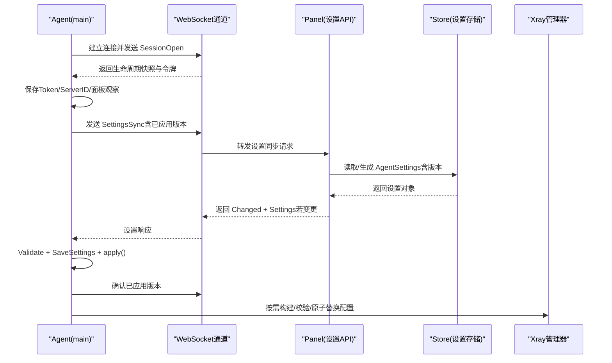
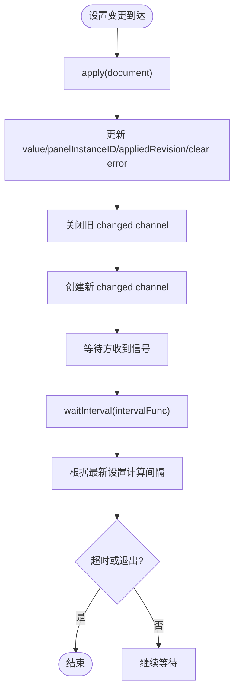
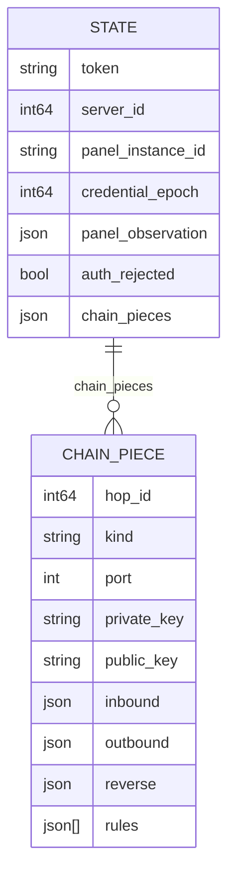
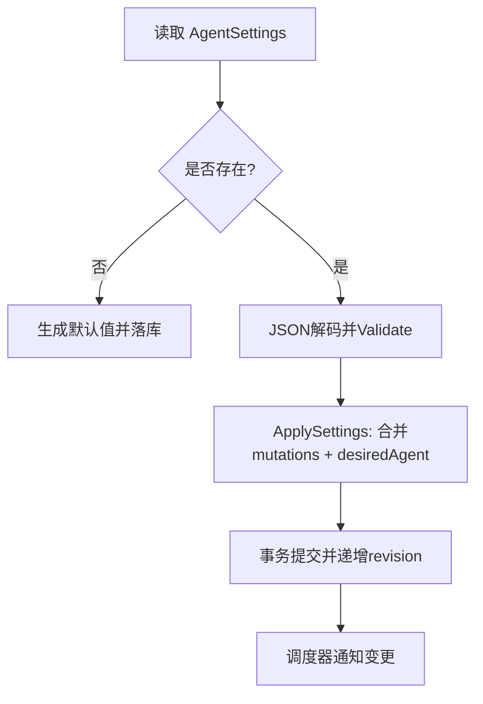
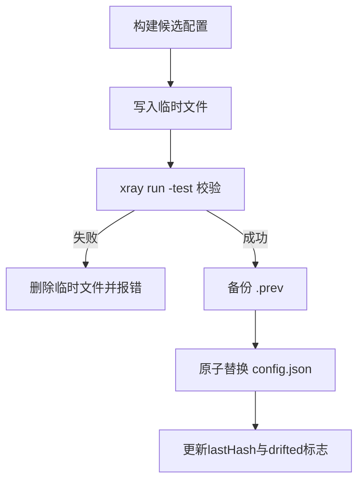
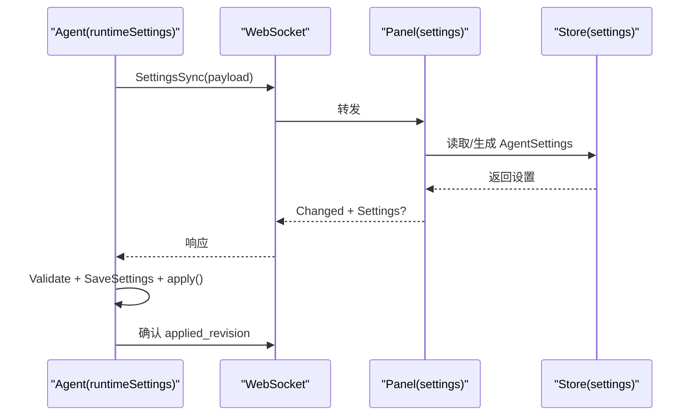
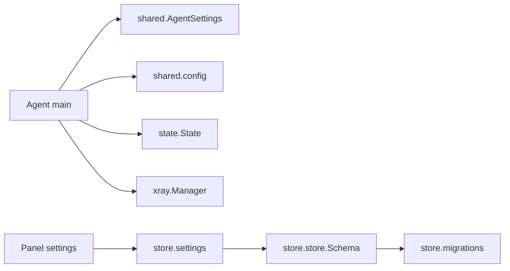

# 配置管理

<cite>
**本文引用的文件**   
- [src/agent/cmd/agent/main.go](file://src/agent/cmd/agent/main.go)
- [src/agent/cmd/agent/runtime_settings.go](file://src/agent/cmd/agent/runtime_settings.go)
- [src/agent/cmd/agent/panel_state.go](file://src/agent/cmd/agent/panel_state.go)
- [src/agent/internal/state/state.go](file://src/agent/internal/state/state.go)
- [src/shared/agent_settings.go](file://src/shared/agent_settings.go)
- [src/backend/internal/store/settings.go](file://src/backend/internal/store/settings.go)
- [src/backend/internal/panel/settings.go](file://src/backend/internal/panel/settings.go)
- [src/backend/internal/store/migrations.go](file://src/backend/internal/store/migrations.go)
- [src/backend/internal/store/store.go](file://src/backend/internal/store/store.go)
- [src/shared/config.go](file://src/shared/config.go)
</cite>

## 目录
1. [简介](#简介)
2. [项目结构](#项目结构)
3. [核心组件](#核心组件)
4. [架构总览](#架构总览)
5. [详细组件分析](#详细组件分析)
6. [依赖关系分析](#依赖关系分析)
7. [性能考量](#性能考量)
8. [故障排查指南](#故障排查指南)
9. [结论](#结论)
10. [附录](#附录)

## 简介
本技术文档面向 Lattix-codex Agent 的配置管理系统，围绕运行时配置机制、面板同步设置、本地状态持久化、配置校验与验证、备份与恢复等主题进行系统化说明。读者可据此理解 Agent 如何加载与热更新配置、如何与面板协同完成版本控制与冲突解决、如何维护本地认证信息与链配置件、以及如何在异常场景下实现安全回滚与灾难恢复。

## 项目结构
Agent 侧负责运行期配置与 xray 配置管理；Panel 侧提供设置存储与下发能力；Shared 层定义跨进程共享的数据结构与校验规则。关键路径包括：
- Agent 启动参数与默认值解析
- 本地状态与设置文件的读写
- WebSocket 会话建立与配置拉取/推送
- xray 配置构建、校验与原子替换
- 面板设置变更通知与版本控制

```mermaid
graph TB
subgraph "Agent"
A_main["main.go<br/>启动/WS连接/消息分发"]
A_runtime["runtime_settings.go<br/>运行期设置与重连策略"]
A_panelstate["panel_state.go<br/>面板生命周期快照跟踪"]
A_state["state/state.go<br/>本地状态与设置文件IO"]
A_xray_mgr["xray/manager.go<br/>配置构建/校验/原子替换"]
end
subgraph "Panel"
P_settings_api["panel/settings.go<br/>设置API与校验"]
P_store_settings["store/settings.go<br/>AgentSettings存储与版本"]
P_store_schema["store/store.go<br/>数据库Schema/备份"]
P_migrations["store/migrations.go<br/>Schema迁移"]
end
subgraph "Shared"
S_agent_settings["shared/agent_settings.go<br/>AgentSettings结构/校验"]
S_config["shared/config.go<br/>协议/模板占位符/RealizedConfig"]
end
A_main --> A_runtime
A_main --> A_panelstate
A_main --> A_state
A_main --> A_xray_mgr
A_main --> S_agent_settings
A_main --> S_config
P_settings_api --> P_store_settings
P_store_settings --> P_store_schema
P_store_schema --> P_migrations
A_main < --> P_settings_api
```

**图表来源** 
- [src/agent/cmd/agent/main.go:33-98](file://src/agent/cmd/agent/main.go#L33-L98)
- [src/agent/cmd/agent/runtime_settings.go:20-99](file://src/agent/cmd/agent/runtime_settings.go#L20-L99)
- [src/agent/cmd/agent/panel_state.go:9-52](file://src/agent/cmd/agent/panel_state.go#L9-L52)
- [src/agent/internal/state/state.go:14-110](file://src/agent/internal/state/state.go#L14-L110)
- [src/backend/internal/panel/settings.go:110-538](file://src/backend/internal/panel/settings.go#L110-L538)
- [src/backend/internal/store/settings.go:107-215](file://src/backend/internal/store/settings.go#L107-L215)
- [src/backend/internal/store/store.go:358-494](file://src/backend/internal/store/store.go#L358-L494)
- [src/backend/internal/store/migrations.go:9-52](file://src/backend/internal/store/migrations.go#L9-L52)
- [src/shared/agent_settings.go:37-93](file://src/shared/agent_settings.go#L37-L93)
- [src/shared/config.go:170-206](file://src/shared/config.go#L170-L206)

**章节来源**
- [src/agent/cmd/agent/main.go:33-98](file://src/agent/cmd/agent/main.go#L33-L98)
- [src/backend/internal/store/store.go:358-494](file://src/backend/internal/store/store.go#L358-L494)

## 核心组件
- 运行时设置（Agent）：维护 AgentSettings 的内存快照、面板实例ID、已应用版本号与错误信息，支持按间隔轮询与变更通知。
- 面板生命周期跟踪（Agent）：维护 PanelLifecycleSnapshot，基于 Epoch/Revision 保证顺序与一致性。
- 本地状态（Agent）：持久化 Token、ServerID、面板实例ID、凭证纪元、面板观察快照、认证拒绝标记、链 piece 记录。
- 面板设置存储（Panel）：以 key/value 形式存储全局设置，包含 AgentSettings 的 JSON 序列化与版本递增。
- 配置构建与校验（Agent/xray）：生成候选配置，调用 xray run -test 校验，原子替换并保留 .prev 用于回滚。
- 共享数据结构（Shared）：AgentSettings、AgentSettingsDocument、RealizedConfig、虚拟配置模板占位符等。

**章节来源**
- [src/agent/cmd/agent/runtime_settings.go:20-99](file://src/agent/cmd/agent/runtime_settings.go#L20-L99)
- [src/agent/cmd/agent/panel_state.go:9-52](file://src/agent/cmd/agent/panel_state.go#L9-L52)
- [src/agent/internal/state/state.go:14-110](file://src/agent/internal/state/state.go#L14-L110)
- [src/backend/internal/store/settings.go:107-215](file://src/backend/internal/store/settings.go#L107-L215)
- [src/shared/agent_settings.go:37-93](file://src/shared/agent_settings.go#L37-L93)
- [src/shared/config.go:170-206](file://src/shared/config.go#L170-L206)

## 架构总览
Agent 通过 WebSocket 长连接与 Panel 通信，首连完成认证与会话打开，随后进入“心跳+遥测+漂移检测+设置同步”的常驻循环。Panel 侧暴露设置 API，Agent 定时或事件触发拉取设置，经校验后落盘并应用到运行态。



**图表来源** 
- [src/agent/cmd/agent/main.go:141-386](file://src/agent/cmd/agent/main.go#L141-L386)
- [src/backend/internal/panel/settings.go:110-538](file://src/backend/internal/panel/settings.go#L110-L538)
- [src/backend/internal/store/settings.go:107-215](file://src/backend/internal/store/settings.go#L107-L215)

## 详细组件分析

### 运行时设置与热更新（Agent）
- 初始化：从 settings.json 加载 AgentSettingsDocument，失败则使用默认值。
- 快照与变更：snapshot() 返回当前设置、面板实例ID、已应用版本与最近错误；apply() 写入新设置并关闭旧 changed channel，创建新 channel 供等待方感知变更。
- 间隔等待：waitInterval() 根据设置动态计算间隔，支持在设置变更时立即中断并重算。
- 重连退避：reconnectDelay() 依据关闭码、模式与最大重试次数计算指数退避与抖动。



**图表来源** 
- [src/agent/cmd/agent/runtime_settings.go:48-99](file://src/agent/cmd/agent/runtime_settings.go#L48-L99)

**章节来源**
- [src/agent/cmd/agent/runtime_settings.go:20-99](file://src/agent/cmd/agent/runtime_settings.go#L20-L99)

### 面板生命周期快照跟踪（Agent）
- 初始值：仅接受有效 State 且非空 Epoch/Revision。
- 应用规则：新会话允许覆盖；非新会话需满足 Epoch 一致且 Revision 单调递增；同 Revision 要求 State/Fault 一致才视为无变化。
- 变更通知：每次成功 apply 关闭旧 channel 并创建新 channel，驱动延迟探测、遥测开关等。

```mermaid
classDiagram
class panelStateTracker {
-mu : RWMutex
-value : PanelLifecycleSnapshot
-changed : chan struct{}
+snapshot() (PanelLifecycleSnapshot, <-chan struct{})
+apply(next, newSession) bool
}
```

**图表来源** 
- [src/agent/cmd/agent/panel_state.go:9-52](file://src/agent/cmd/agent/panel_state.go#L9-L52)

**章节来源**
- [src/agent/cmd/agent/panel_state.go:9-52](file://src/agent/cmd/agent/panel_state.go#L9-L52)

### 本地状态文件（Agent）
- State 字段：Token、ServerID、PanelInstanceID、CredentialEpoch、PanelObservation、AuthRejected、ChainPieces。
- ChainPiece：记录 hop_id/kind/port/private_key/public_key/inbound/outbound/reverse/rules，用于重启重建 config.json 与幂等重发。
- IO 安全：Load/Save 使用临时文件+rename 原子写入，权限 0600；Settings 同样采用原子写入并在保存前 Validate。



**图表来源** 
- [src/agent/internal/state/state.go:14-38](file://src/agent/internal/state/state.go#L14-L38)

**章节来源**
- [src/agent/internal/state/state.go:14-110](file://src/agent/internal/state/state.go#L14-L110)

### 面板设置存储与版本控制（Panel）
- AgentSettings 存储：首次访问生成默认值并落库；后续更新通过 ApplySettings 在同一事务中递增 revision 并校验。
- 设置项：timezone、public_url、tls_mode、证书/私钥、ACME、告警、日志限制、AgentSettings 等。
- 变更通知：当 AgentSettings 更新时，调度器通知下游（如 WS 广播），触发 Agent 拉取。



**图表来源** 
- [src/backend/internal/store/settings.go:107-215](file://src/backend/internal/store/settings.go#L107-L215)

**章节来源**
- [src/backend/internal/store/settings.go:107-215](file://src/backend/internal/store/settings.go#L107-L215)

### 配置构建、校验与原子替换（Agent/xray）
- commitConfig：写临时文件 → xray run -test 校验 → 备份当前配置为 .prev → 原子 rename 替换 → 更新哈希基线。
- ConfigDrift：比较当前文件哈希与 lastHash，首次调用以当前文件为基线；文件删除视为漂移。
- loadConfig：不存在或损坏时重建骨架，并合并链 piece 记录；漂移修复时仅保留受管 inbound。



**图表来源** 
- [src/agent/internal/xray/manager.go:235-334](file://src/agent/internal/xray/manager.go#L235-L334)

**章节来源**
- [src/agent/internal/xray/manager.go:235-334](file://src/agent/internal/xray/manager.go#L235-L334)

### 设置同步流程（Agent ↔ Panel）
- Agent 发起 SettingsSync，携带 panel_instance_id、applied_revision、last_apply_error。
- Panel 返回 Changed + Settings（若存在新版本）。
- Agent 执行 Validate → SaveSettings → apply() → 再次发送确认。



**图表来源** 
- [src/agent/cmd/agent/main.go:673-720](file://src/agent/cmd/agent/main.go#L673-L720)
- [src/backend/internal/panel/settings.go:110-538](file://src/backend/internal/panel/settings.go#L110-L538)

**章节来源**
- [src/agent/cmd/agent/main.go:673-720](file://src/agent/cmd/agent/main.go#L673-L720)

### 配置校验与验证机制
- AgentSettings.Validate：检查 revision≥1、reconnect.mode 合法、max_retries 范围、telemetry/drift_detection 间隔范围。
- AgentSettingsDocument.Validate：schema_version 必须匹配、panel.instance_id 必填、委托 Agent.Validate。
- Panel 设置校验：TLS 模式完整性校验、域名/邮箱格式、Webhook URL 合法性、日志限制范围、币种支持等。

**章节来源**
- [src/shared/agent_settings.go:66-93](file://src/shared/agent_settings.go#L66-L93)
- [src/backend/internal/panel/settings.go:222-538](file://src/backend/internal/panel/settings.go#L222-L538)

### 配置备份与恢复
- 数据库备份：Backup 使用 VACUUM INTO 导出一致性快照，目标文件须为空且权限 0600。
- 配置文件回滚：commitConfig 成功后更新 lastHash；若热操作失败，restorePrev 将 .prev 恢复为 config.json 并重置漂移基线。
- 状态文件恢复：Load 对缺失/空文件返回零值；Save 原子写入避免部分写入导致损坏。

**章节来源**
- [src/backend/internal/store/store.go:448-494](file://src/backend/internal/store/store.go#L448-L494)
- [src/agent/internal/xray/manager.go:319-334](file://src/agent/internal/xray/manager.go#L319-L334)
- [src/agent/internal/state/state.go:59-110](file://src/agent/internal/state/state.go#L59-L110)

### 配置示例与最佳实践
- 首次启动：提供 -token 作为 bootstrap 凭据；state.json 不存在则从零开始；settings.json 不存在则使用默认设置。
- 热更新：修改面板设置后，Agent 会在下一个周期拉取并应用；如需立即生效，可通过事件触发拉取。
- 漂移防护：避免外部直接编辑 xray config.json；如有必要，确保符合受管 inbound 命名规范（node_*）。
- 备份策略：定期导出 SQLite 备份；保留 .prev 与 .broken 文件以便回滚与诊断。
- 安全建议：保持 state.json/settings.json 权限 0600；数据库文件权限 0600；禁用不必要的公网端口。

[本节为通用指导，不直接分析具体文件]

## 依赖关系分析
- Agent 依赖 shared 类型定义与校验逻辑。
- Panel 依赖 store 进行设置存取与 Schema 管理。
- xray Manager 依赖系统命令进行配置校验与服务控制。
- 各模块通过明确的接口与数据结构耦合，降低间接依赖风险。



**图表来源** 
- [src/agent/cmd/agent/main.go:33-98](file://src/agent/cmd/agent/main.go#L33-L98)
- [src/shared/agent_settings.go:37-93](file://src/shared/agent_settings.go#L37-L93)
- [src/backend/internal/store/settings.go:107-215](file://src/backend/internal/store/settings.go#L107-L215)
- [src/backend/internal/store/store.go:358-494](file://src/backend/internal/store/store.go#L358-L494)
- [src/backend/internal/store/migrations.go:9-52](file://src/backend/internal/store/migrations.go#L9-L52)

**章节来源**
- [src/agent/cmd/agent/main.go:33-98](file://src/agent/cmd/agent/main.go#L33-L98)
- [src/backend/internal/store/store.go:358-494](file://src/backend/internal/store/store.go#L358-L494)

## 性能考量
- 设置拉取周期：Telemetry 与 DriftDetection 间隔由设置控制，避免频繁 I/O 与网络开销。
- 重连退避：指数退避加抖动，防止雪崩效应；面板不可用时有独立退避策略。
- 配置校验：xray run -test 在内存中进行，避免影响运行服务；仅在必要时执行。
- 数据库并发：SQLite 单连接 + busy_timeout，减少锁竞争。

[本节为通用指导，不直接分析具体文件]

## 故障排查指南
- 认证被拒：检查 -token 与 state.json 中的凭证是否一致；面板可能已重建或替换凭证。
- 设置未生效：查看 last_apply_error 与 applied_revision；确认 Panel 返回 Changed 与 Settings。
- 配置漂移：检查 xray config.json 是否被外部修改；必要时清理 .broken 并重建骨架。
- 备份失败：确认目标路径为空且权限正确；检查 VACUUM INTO 错误信息。

**章节来源**
- [src/agent/cmd/agent/runtime_settings.go:121-155](file://src/agent/cmd/agent/runtime_settings.go#L121-L155)
- [src/agent/cmd/agent/main.go:687-720](file://src/agent/cmd/agent/main.go#L687-L720)
- [src/backend/internal/store/store.go:448-494](file://src/backend/internal/store/store.go#L448-L494)

## 结论
Lattix-codex Agent 的配置管理系统通过清晰的职责划分、严格的校验与版本控制、安全的持久化与回滚机制，实现了高可靠的运行时配置管理。管理员应遵循最佳实践，合理设置拉取周期、保护敏感文件权限、定期备份数据，并在出现漂移或认证问题时按指南排查。

[本节为总结性内容，不直接分析具体文件]

## 附录
- 术语表：
  - 设置（Settings）：面板下发的 Agent 运行参数集合。
  - 生命周期快照（PanelLifecycleSnapshot）：面板状态、重试策略、延迟窗口等元数据。
  - 链 piece（ChainPiece）：链路跳点的渲染后配置片段，用于重启重建与幂等。
  - 漂移（Drift）：config.json 被外部修改导致的与受管状态不一致。

[本节为补充信息，不直接分析具体文件]