# 共享模块

<cite>
**本文引用的文件**   
- [go.mod](file://src/shared/go.mod)
- [messages.go](file://src/shared/messages.go)
- [lifecycle.go](file://src/shared/lifecycle.go)
- [config.go](file://src/shared/config.go)
- [chain.go](file://src/shared/chain.go)
- [credential.go](file://src/shared/credential.go)
- [ports.go](file://src/shared/ports.go)
- [agent_settings.go](file://src/shared/agent_settings.go)
- [external.go](file://src/shared/requester/external.go)
- [agent.go](file://src/backend/internal/ws/agent.go)
- [main.go](file://src/agent/cmd/agent/main.go)
</cite>

## 目录
1. [简介](#简介)
2. [项目结构](#项目结构)
3. [核心组件](#核心组件)
4. [架构总览](#架构总览)
5. [详细组件分析](#详细组件分析)
6. [依赖关系分析](#依赖关系分析)
7. [性能考量](#性能考量)
8. [故障排查指南](#故障排查指南)
9. [结论](#结论)
10. [附录](#附录)

## 简介
本技术文档面向 Lattix-codex 的共享模块（shared），系统阐述其设计目的与架构原则，包括前后端代码复用、类型安全保证、接口一致性等。文档深入解析消息协议实现（WebSocket 信封、RPC 调用规范、错误码体系）、核心数据模型（服务器、节点、用户、链路等实体的结构与关系）、配置管理（验证、默认值、动态更新）以及生命周期管理（状态转换、事件通知、资源清理）。同时提供类型定义的使用示例与扩展指南，帮助开发者正确使用并扩展共享模块。

## 项目结构
共享模块位于 src/shared，采用 Go 包组织，按职责划分：
- 协议与消息：messages.go（统一信封、动作类型、错误码、载荷结构）
- 生命周期与连接：lifecycle.go（面板状态、连接状态、会话载荷）
- 虚拟配置与模板：config.go（协议常量、传输方式、占位符、VirtualConfig/RealizedConfig）
- 链跳与反向隧道：chain.go（链跳类型、域名生成、Tag 约定）
- 凭证与认证：credential.go（面板实例 ID、凭证格式与校验）
- 端口段与映射：ports.go（端口段解析、校验、候选与映射）
- Agent 设置同步：agent_settings.go（设置结构、默认值、校验、同步载荷）
- 外部 HTTP 客户端：requester/external.go（JSON/Webhook/文件下载封装）

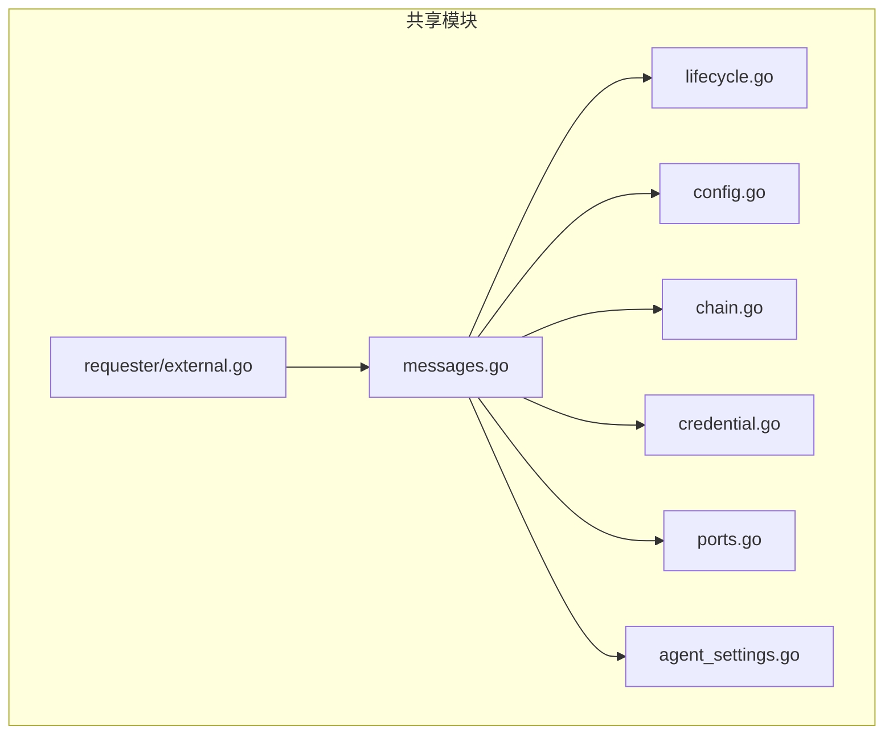

**图表来源** 
- [messages.go:1-313](file://src/shared/messages.go#L1-L313)
- [lifecycle.go:1-86](file://src/shared/lifecycle.go#L1-L86)
- [config.go:1-206](file://src/shared/config.go#L1-L206)
- [chain.go:1-24](file://src/shared/chain.go#L1-L24)
- [credential.go:1-65](file://src/shared/credential.go#L1-L65)
- [ports.go:1-115](file://src/shared/ports.go#L1-L115)
- [agent_settings.go:1-111](file://src/shared/agent_settings.go#L1-L111)
- [external.go:1-155](file://src/shared/requester/external.go#L1-L155)

**章节来源**
- [go.mod:1-4](file://src/shared/go.mod#L1-L4)

## 核心组件
- 统一 RPC 信封 Envelope：统一 kind/type/request_id/trace_id/data，响应附加 code/message；提供 Validate/MarshalJSON 确保请求/事件不携带响应字段，响应必须携带 code/message。
- 动作类型与错误码：定义 session.open/ready、credential.commit、settings.sync/changed、node.apply/remove、user.add/remove、uninstall、xray.upgrade、agent.upgrade、telemetry.report、config.drift、chain-hop.apply/remove 等类型；CodeOK/Accepted/AuthRequired/InvalidArgument/NotFound/Conflict/OperationLocked/UnsupportedAction/InternalError/UpstreamError/ServiceUnavailable/ServerOffline/PortOutOfRange/UpdateInProgress 等语义化错误码。
- 生命周期与连接状态：PanelState（startup/active/updating/faulted）、ConnectionState（never_connected/connecting/reconnecting/online/offline/auth_rejected）、SessionKind（initial/reconnect）及对应载荷。
- 虚拟配置与实现配置：VirtualConfig（协议、传输、占位符、模板）与 RealizedConfig（实际生效端口、公钥、短ID、SNI、指纹、网络参数、PSK、加密字符串）。
- 链跳与反向隧道：HopKind（portal/bridge/forward）、TunnelDomain、各跳 Tag 生成函数。
- 凭证与实例标识：Credential 结构、NewPanelInstanceID/NewCredential/ParseCredential 校验与生成。
- 端口段与映射：PortRange、ParsePortRanges/ValidatePortRanges、ListenCandidates/InListenRanges/PublicPort。
- Agent 设置：AgentSettings/AgentSettingsDocument、默认值、范围校验、同步载荷与变更事件。
- 外部 HTTP 客户端：JSONRequester/WebhookRequester/FileRequester 抽象与实现，统一错误处理与进度回调。

**章节来源**
- [messages.go:13-137](file://src/shared/messages.go#L13-L137)
- [messages.go:139-313](file://src/shared/messages.go#L139-L313)
- [lifecycle.go:5-86](file://src/shared/lifecycle.go#L5-L86)
- [config.go:13-206](file://src/shared/config.go#L13-L206)
- [chain.go:1-24](file://src/shared/chain.go#L1-L24)
- [credential.go:12-65](file://src/shared/credential.go#L12-L65)
- [ports.go:8-115](file://src/shared/ports.go#L8-L115)
- [agent_settings.go:8-111](file://src/shared/agent_settings.go#L8-L111)
- [external.go:16-155](file://src/shared/requester/external.go#L16-L155)

## 架构总览
共享模块作为 Backend 与 Agent 之间的“契约层”，通过 WebSocket 控制通道承载 RPC 与事件流。后端负责编排与下发策略，Agent 负责渲染与热更新 xray 配置，并通过遥测上报运行态。

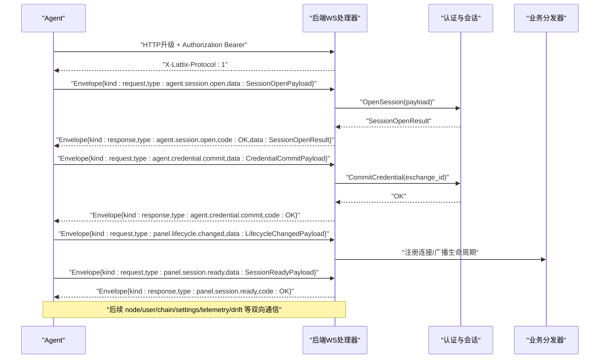

**图表来源** 
- [agent.go:32-200](file://src/backend/internal/ws/agent.go#L32-L200)
- [messages.go:72-91](file://src/shared/messages.go#L72-L91)
- [lifecycle.go:56-86](file://src/shared/lifecycle.go#L56-L86)

**章节来源**
- [agent.go:32-200](file://src/backend/internal/ws/agent.go#L32-L200)
- [main.go:137-200](file://src/agent/cmd/agent/main.go#L137-L200)

## 详细组件分析

### 消息协议与 RPC 规范
- 信封结构：统一 Kind（request/response/event）、Type（domain.action）、RequestID/TraceID（32位十六进制）、Data（json.RawMessage），响应附加 Code/Message。
- 序列化规则：MarshalJSON 对请求/事件剔除 code/message，响应强制包含；Validate 校验 Kind、Type、ID 格式、Data JSON 合法性、响应字段约束。
- 错误码体系：覆盖认证、参数、未找到、冲突、锁定、不支持、内部错误、上游错误、服务不可用、离线、端口越界、更新中。
- 典型载荷：ApplyNodePayload、RemoveNodePayload、AddUserPayload/RemoveUserPayload、UninstallPayload、ApplyResultPayload、TelemetryPayload、DriftPayload、UpgradeXrayPayload/UpgradeAgentPayload、ApplyChainHopPayload/RemoveChainHopPayload。

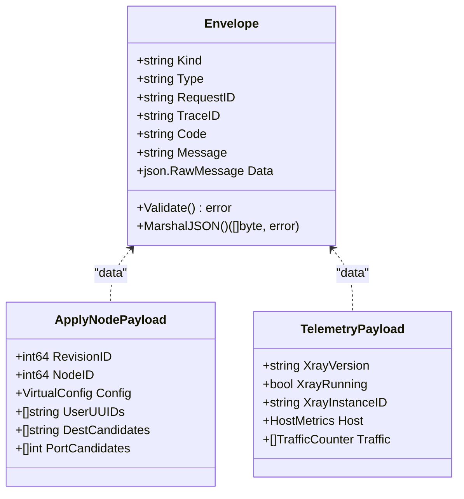

**图表来源** 
- [messages.go:13-45](file://src/shared/messages.go#L13-L45)
- [messages.go:139-203](file://src/shared/messages.go#L139-L203)

**章节来源**
- [messages.go:13-137](file://src/shared/messages.go#L13-L137)
- [messages.go:139-313](file://src/shared/messages.go#L139-L313)

### 生命周期与连接管理
- 面板状态：startup/active/updating/faulted，带 Epoch/Revision/EnteredAt/Fault/RetryPolicy/LatencyResumeWindowMS。
- 连接状态：never_connected/connecting/reconnecting/online/offline/auth_rejected，用于前端展示与重连策略。
- 会话流程：session.open → credential.commit → lifecycle.changed → session.ready，期间进行鉴权、版本协商、重试策略下发。
- Agent 侧：根据 PanelLifecycleSnapshot 调整重连退避，结合本地状态持久化（token、server_id、panel_instance_id、auth_rejected、chain_pieces）。

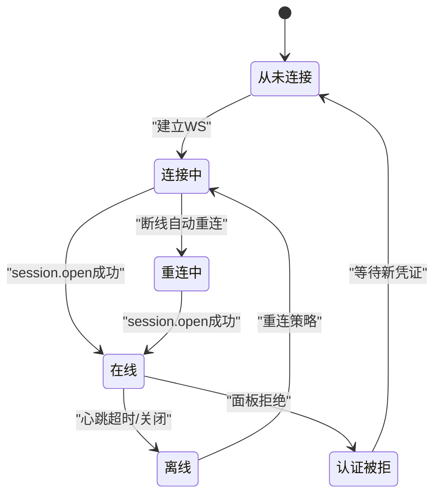

**图表来源** 
- [lifecycle.go:5-20](file://src/shared/lifecycle.go#L5-L20)
- [agent.go:59-98](file://src/backend/internal/ws/agent.go#L59-L98)
- [main.go:137-200](file://src/agent/cmd/agent/main.go#L137-L200)

**章节来源**
- [lifecycle.go:22-86](file://src/shared/lifecycle.go#L22-L86)
- [agent.go:32-200](file://src/backend/internal/ws/agent.go#L32-L200)
- [main.go:137-200](file://src/agent/cmd/agent/main.go#L137-L200)

### 虚拟配置与模板渲染
- 协议与传输：vless/vmess/trojan/shadowsocks/socks/http/dokodemo-door；tcp/grpc/xhttp；xhttp mode auto/packet-up/stream-up。
- 占位符：PORT/CLIENTS/PRIVATE_KEY/TAG/DECRYPTION，Agent 替换后原样写入 config.json，无翻译层。
- VirtualConfig：描述协议参数与模板；RealizedConfig：上报实际生效值（端口、公钥、短ID、SNI、指纹、网络参数、PSK、加密字符串）。
- 用户密码派生：SSUserPassword 基于 UUID 确定性派生，兼容旧式与 2022-blake3 系列。

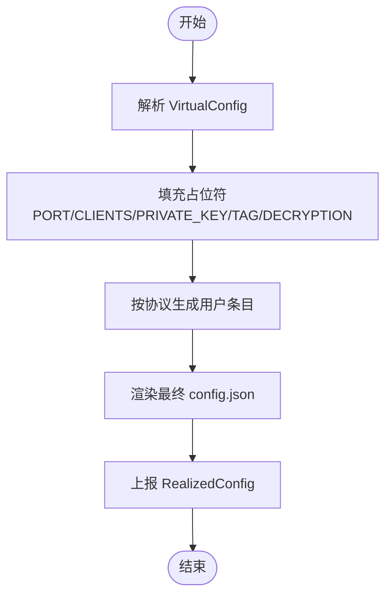

**图表来源** 
- [config.go:149-206](file://src/shared/config.go#L149-L206)

**章节来源**
- [config.go:13-206](file://src/shared/config.go#L13-L206)

### 链跳与反向隧道
- HopKind：portal（上游机 inbound+reverse portal）、bridge（下游机 reverse bridge+outbound+routing）、forward（入口/中间跳 dokodemo-door 透传）。
- TunnelDomain：c<chainID>h<hopID>.lx，作为 reverse 路由键。
- Tag 约定：ChainForwardTag/ChainPortalTag/ChainBridgeTag，供面板编排与 Agent 渲染共用。

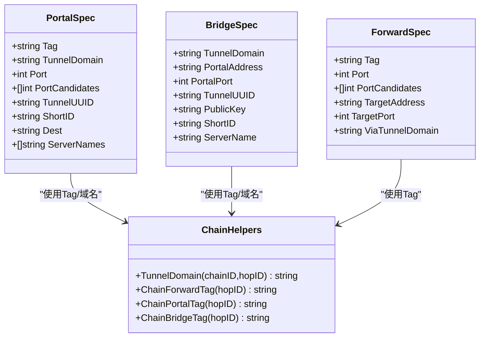

**图表来源** 
- [chain.go:1-24](file://src/shared/chain.go#L1-L24)
- [messages.go:255-313](file://src/shared/messages.go#L255-L313)

**章节来源**
- [chain.go:1-24](file://src/shared/chain.go#L1-L24)
- [messages.go:255-313](file://src/shared/messages.go#L255-L313)

### 凭证与认证
- Credential：前缀 ltx1，结构 panel_instance_id.epoch.secret（secret 为 32 字节十六进制）。
- NewPanelInstanceID：生成 p_ + 16 字节随机十六进制。
- NewCredential/ParseCredential：严格校验格式、epoch≥1、secret 长度与编码。

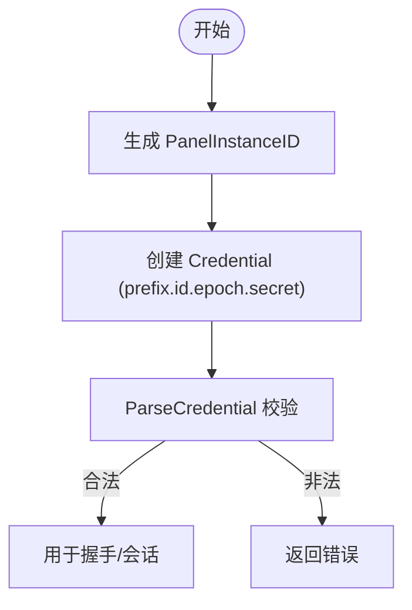

**图表来源** 
- [credential.go:12-65](file://src/shared/credential.go#L12-L65)

**章节来源**
- [credential.go:12-65](file://src/shared/credential.go#L12-L65)

### 端口段与映射
- PortRange：外部段 [PubStart,PubEnd] 映射到监听段 [ListenStart,ListenEnd]，0 表示 1:1。
- 校验：区间合法性、宽度一致、无重叠。
- 工具：ListenCandidates（展开候选）、InListenRanges（判断是否落在段内）、PublicPort（listen→public 映射）。

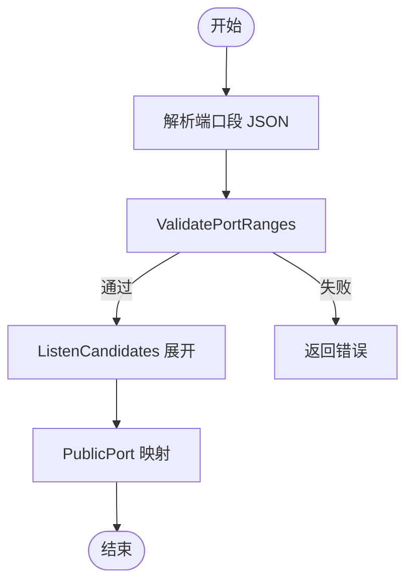

**图表来源** 
- [ports.go:8-115](file://src/shared/ports.go#L8-L115)

**章节来源**
- [ports.go:8-115](file://src/shared/ports.go#L8-L115)

### Agent 设置与动态更新
- AgentSettings：reconnect.mode（infinite/limited）、max_retries、telemetry.interval_seconds、drift_detection.interval_seconds。
- AgentSettingsDocument：schema_version、panel.metadata（instance_id/version/public_url/ws_url）、agent.settings。
- 默认值：DefaultAgentSettings 提供合理默认；Validate 检查边界与枚举。
- 同步：AgentSettingsSyncPayload/Result、AgentSettingsChangedPayload 用于面板下发与 Agent 回执。

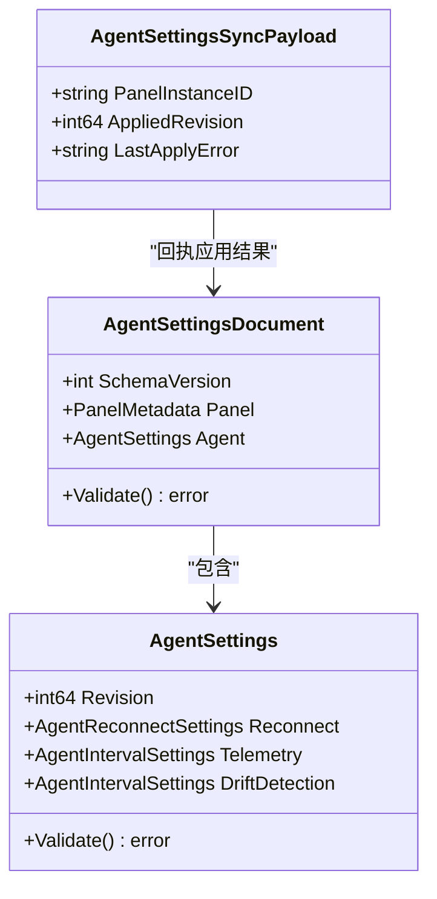

**图表来源** 
- [agent_settings.go:8-111](file://src/shared/agent_settings.go#L8-L111)

**章节来源**
- [agent_settings.go:8-111](file://src/shared/agent_settings.go#L8-L111)

### 外部 HTTP 客户端
- 抽象：HTTPDoer、JSONRequester、WebhookRequester、FileRequester。
- 实现：ExternalJSONRequester.GetJSON、ExternalWebhookRequester.PostJSON、ExternalFileRequester.GetText/Download（支持进度回调与大小限制）。
- 错误处理：require2xx 统一非 2xx 错误；do 封装上下文与 Content-Type。

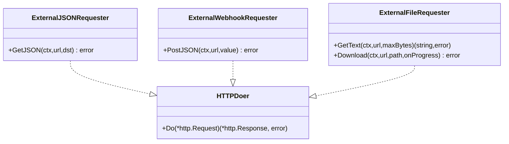

**图表来源** 
- [external.go:16-155](file://src/shared/requester/external.go#L16-L155)

**章节来源**
- [external.go:16-155](file://src/shared/requester/external.go#L16-L155)

## 依赖关系分析
共享模块被后端与 Agent 广泛引用，形成稳定的契约层。后端通过 ws/agent.go 实现握手与业务分发；Agent 通过 main.go 发起 session.open 并处理回执。

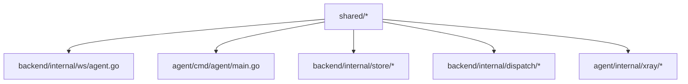

**图表来源** 
- [agent.go:1-200](file://src/backend/internal/ws/agent.go#L1-L200)
- [main.go:1-200](file://src/agent/cmd/agent/main.go#L1-L200)

**章节来源**
- [agent.go:1-200](file://src/backend/internal/ws/agent.go#L1-L200)
- [main.go:1-200](file://src/agent/cmd/agent/main.go#L1-L200)

## 性能考量
- 信封序列化优化：MarshalJSON 按需裁剪字段，减少无效负载。
- 遥测增量幂等：TrafficCounter 绝对计数器，Backend 持久化游标计算增量，丢帧可补齐。
- 端口候选预展开：ListenCandidates 提前展开，避免运行时扫描开销。
- 外部下载分块：Download 使用固定缓冲与进度回调，避免内存峰值。
- 心跳保活：Agent 每 30s Ping，Panel 回 Pong 并续期读超时，降低长连接维护成本。

[本节为通用指导，无需特定文件来源]

## 故障排查指南
- 握手失败：检查 Authorization 头与 Token 有效性；确认 X-Lattix-Protocol 版本匹配。
- 会话打开失败：核对 SessionOpenPayload.ProtocolVersion=1；查看 Code/Message 定位原因。
- 认证被拒：Agent 侧记录 AuthRejected=true 并停止重试，需重新安装或更换凭证。
- 端口冲突：ValidatePortRanges 报错时检查段重叠与范围合法性；PublicPort 映射是否正确。
- 遥测缺失：确认 TelemetryPayload.Host/Traffic 字段完整性；检查 Backend 游标持久化。
- 外部请求错误：require2xx 非 2xx 直接报错；检查 URL、Content-Type、最大字节限制。

**章节来源**
- [agent.go:32-200](file://src/backend/internal/ws/agent.go#L32-L200)
- [main.go:137-200](file://src/agent/cmd/agent/main.go#L137-L200)
- [ports.go:34-68](file://src/shared/ports.go#L34-L68)
- [messages.go:112-137](file://src/shared/messages.go#L112-L137)
- [external.go:129-155](file://src/shared/requester/external.go#L129-L155)

## 结论
共享模块以强类型与明确契约为核心，确保前后端在协议、数据模型与行为上高度一致。通过统一信封、标准化错误码、严格的配置模板与端口映射、完善的生命周期管理与外部客户端封装，为 Lattix-codex 的稳定运行与可扩展性奠定基础。开发者应遵循模块定义的类型与校验逻辑，避免引入不一致的实现。

[本节为总结性内容，无需特定文件来源]

## 附录
- 类型扩展建议：新增动作类型应在 messages.go 中声明 Type 常量，并定义对应 Payload/Result 结构；在 Validate/MarshalJSON 中保持字段一致性。
- 配置模板扩展：在 config.go 中补充占位符与协议常量，确保 Agent 渲染与订阅生成逻辑同步更新。
- 端口段扩展：在 ports.go 中增强校验规则与映射算法，确保 NAT 场景下的正确性与安全性。
- 外部客户端扩展：在 requester/external.go 中新增接口与实现，遵循统一错误处理与上下文传递。

[本节为通用指导，无需特定文件来源]