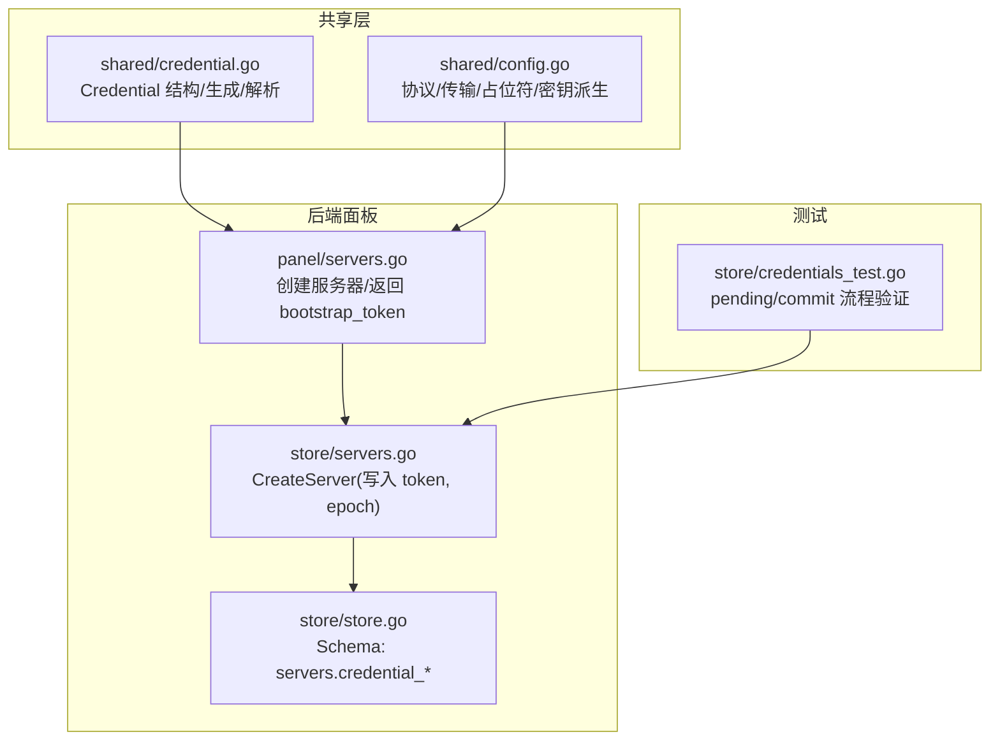
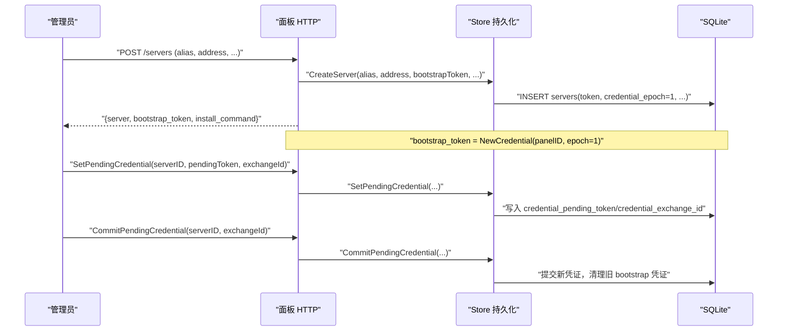
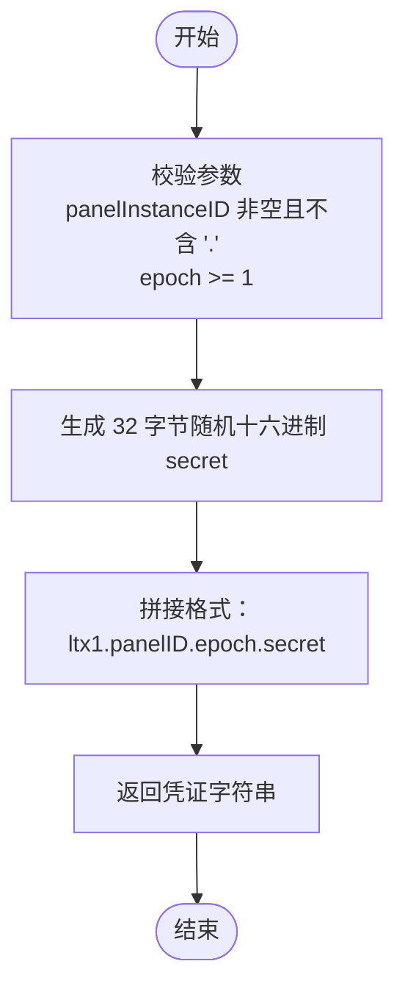
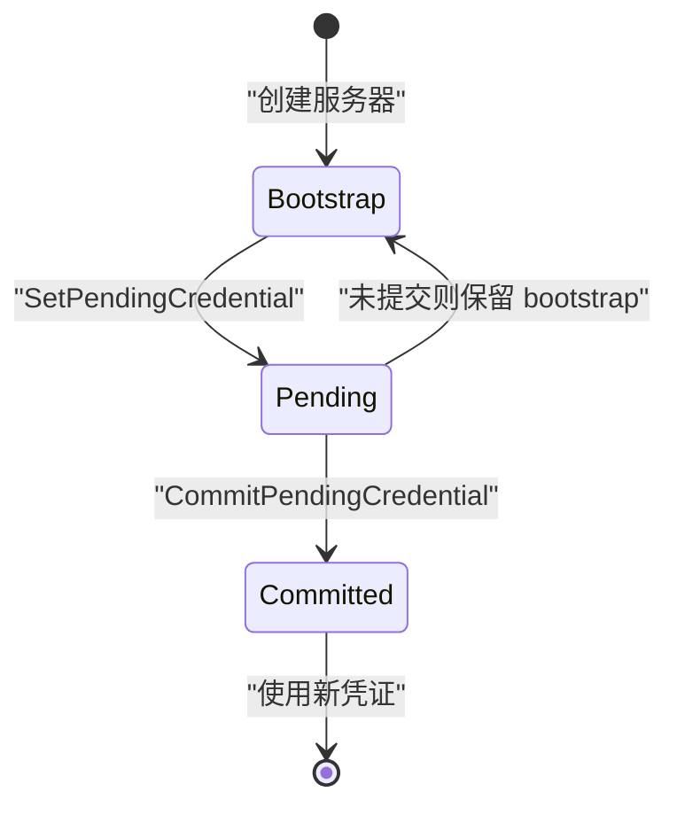
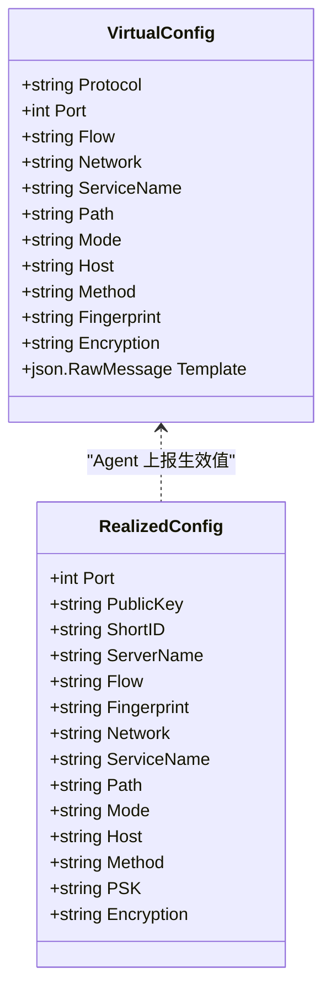
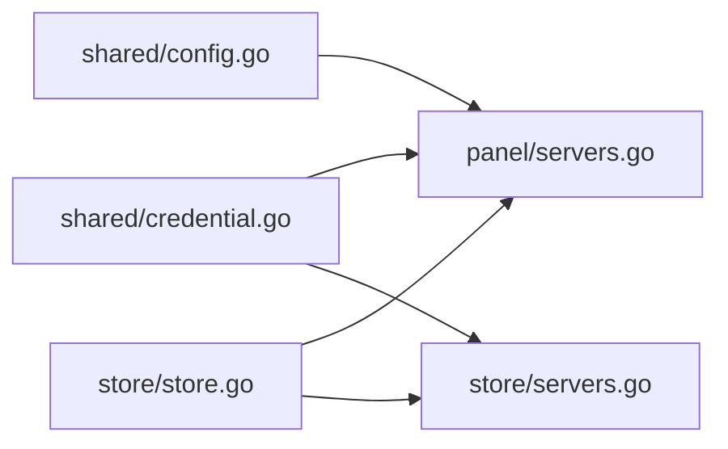

# 凭证管理

<cite>
**本文引用的文件**   
- [src/shared/credential.go](file://src/shared/credential.go)
- [src/backend/internal/store/servers.go](file://src/backend/internal/store/servers.go)
- [src/backend/internal/panel/servers.go](file://src/backend/internal/panel/servers.go)
- [src/backend/internal/store/store.go](file://src/backend/internal/store/store.go)
- [src/backend/internal/store/credentials_test.go](file://src/backend/internal/store/credentials_test.go)
- [src/shared/config.go](file://src/shared/config.go)
- [src/backend/internal/store/nodes.go](file://src/backend/internal/store/nodes.go)
- [src/backend/internal/store/chains.go](file://src/backend/internal/store/chains.go)
- [src/shared/chain.go](file://src/shared/chain.go)
</cite>

## 目录
1. [简介](#简介)
2. [项目结构](#项目结构)
3. [核心组件](#核心组件)
4. [架构总览](#架构总览)
5. [详细组件分析](#详细组件分析)
6. [依赖关系分析](#依赖关系分析)
7. [性能考虑](#性能考虑)
8. [故障排查指南](#故障排查指南)
9. [结论](#结论)
10. [附录](#附录)

## 简介
本技术文档聚焦 Lattix-codex 的“凭证管理系统”，围绕面板与 Agent 之间的安全认证、凭证格式、生命周期与安全策略展开。内容涵盖：
- Credential 结构设计（实例标识、纪元、随机密钥）
- 凭证生成、解析与存储格式
- 不同协议的凭证与配置要点（VLESS UUID、VMess ID、Trojan 密码、Shadowsocks 方法+密码等）
- 凭证生命周期（创建、更新、删除、轮换）
- 安全策略（加密传输、访问控制、审计日志）
- 代码级示例路径与安全最佳实践

## 项目结构
凭证相关能力主要分布在以下模块：
- shared：共享类型与工具，包含凭证结构与协议常量
- backend/store：持久化层（SQLite），定义服务器表字段与凭证相关列
- backend/panel：HTTP 接口，负责创建服务器并下发 bootstrap 凭证
- backend/agent：Agent 侧使用 bootstrap 凭证完成首次连接与会话建立

**图表来源** 
- [src/shared/credential.go](file://src/shared/credential.go)
- [src/backend/internal/panel/servers.go](file://src/backend/internal/panel/servers.go)
- [src/backend/internal/store/servers.go](file://src/backend/internal/store/servers.go)
- [src/backend/internal/store/store.go](file://src/backend/internal/store/store.go)
- [src/backend/internal/store/credentials_test.go](file://src/backend/internal/store/credentials_test.go)
- [src/shared/config.go](file://src/shared/config.go)

**章节来源**
- [src/shared/credential.go](file://src/shared/credential.go)
- [src/backend/internal/panel/servers.go](file://src/backend/internal/panel/servers.go)
- [src/backend/internal/store/servers.go](file://src/backend/internal/store/servers.go)
- [src/backend/internal/store/store.go](file://src/backend/internal/store/store.go)
- [src/backend/internal/store/credentials_test.go](file://src/backend/internal/store/credentials_test.go)
- [src/shared/config.go](file://src/shared/config.go)

## 核心组件
- Credential 结构体：包含面板实例标识、纪元号与随机密钥，用于唯一且可轮换的面板到 Agent 的认证凭据
- 凭证生成与解析：NewCredential/ParseCredential 提供强校验的序列化格式
- 服务器表凭证字段：token、credential_epoch、credential_committed、credential_pending_token、credential_exchange_id
- 协议与配置：VirtualConfig/RealizedConfig 定义模板与生效值，支撑多协议客户端配置生成

关键实现要点：
- 凭证前缀固定，便于快速识别与拦截非法输入
- Epoch 支持凭证轮换与版本控制
- Secret 为 32 字节十六进制随机串，具备高熵安全性
- 解析时严格校验长度、格式与数值范围

**章节来源**
- [src/shared/credential.go](file://src/shared/credential.go)
- [src/backend/internal/store/store.go](file://src/backend/internal/store/store.go)
- [src/shared/config.go](file://src/shared/config.go)

## 架构总览
下图展示从面板创建服务器到下发 bootstrap 凭证的关键调用链，以及 pending/commit 的凭证轮换流程。

**图表来源** 
- [src/backend/internal/panel/servers.go](file://src/backend/internal/panel/servers.go)
- [src/backend/internal/store/servers.go](file://src/backend/internal/store/servers.go)
- [src/backend/internal/store/store.go](file://src/backend/internal/store/store.go)
- [src/backend/internal/store/credentials_test.go](file://src/backend/internal/store/credentials_test.go)

## 详细组件分析

### Credential 结构与生成/解析
- 结构字段
  - PanelInstanceID：面板实例标识，避免跨实例混淆
  - Epoch：凭证纪元，支持轮换与版本控制
  - Secret：32 字节随机十六进制字符串，作为对称密钥材料
- 生成规则
  - 前缀固定，便于识别
  - 校验 panelInstanceID 非空且不包含点号
  - epoch >= 1
  - secret 由安全随机源生成
- 解析规则
  - 分割为 4 段，校验前缀与第二段非空
  - 解析 epoch 并校验范围
  - 解码 secret 并校验长度为 32

**图表来源** 
- [src/shared/credential.go](file://src/shared/credential.go)

**章节来源**
- [src/shared/credential.go](file://src/shared/credential.go)

### 服务器表与凭证字段设计
- servers 表关键字段
  - token：长期凭证（bootstrap 或已提交的凭证）
  - credential_epoch：当前凭证纪元
  - credential_committed：是否已提交新凭证
  - credential_pending_token：待提交的凭证
  - credential_exchange_id：交换会话标识，保证幂等提交
- 设计意图
  - 支持“先设置待提交凭证，再提交”的两阶段流程
  - 在提交前保留 bootstrap 凭证，确保 Agent 重连可用
  - 提交后清理旧凭证，防止回滚滥用

**章节来源**
- [src/backend/internal/store/store.go](file://src/backend/internal/store/store.go)

### 凭证生命周期管理（创建、更新、删除、轮换）
- 创建
  - 面板创建服务器时生成 bootstrap 凭证，随安装命令返回
- 更新（轮换）
  - SetPendingCredential：设置新的凭证与交换 ID
  - CommitPendingCredential：校验交换 ID 并提交，替换 token，清除 pending
- 删除
  - 服务器删除时，命令与任务被废弃，链状态标记删除；凭证层面通过 token 失效与历史留存保障审计
- 重试与幂等
  - 交换 ID 用于幂等提交，避免重复提交导致不一致

**图表来源** 
- [src/backend/internal/store/credentials_test.go](file://src/backend/internal/store/credentials_test.go)
- [src/backend/internal/store/store.go](file://src/backend/internal/store/store.go)

**章节来源**
- [src/backend/internal/store/credentials_test.go](file://src/backend/internal/store/credentials_test.go)
- [src/backend/internal/store/store.go](file://src/backend/internal/store/store.go)

### 不同协议的凭证与配置要点
- VLESS
  - UUID：用户标识，用于订阅与鉴权
  - Flow：可选 vision（仅 tcp）
  - Encryption：x25519/mlkem768（VLESS Encryption）
  - Network：tcp/grpc/xhttp（Reality 组合）
- VMess
  - ID：用户标识
  - Network：tcp/grpc/xhttp（Reality 组合）
- Trojan
  - 密码：用户密码
  - Network：tcp/grpc/xhttp（Reality 组合）
- Shadowsocks
  - 方法：aes-128-gcm/aes-256-gcm/chacha20-ietf-poly1305/2022-blake3-*
  - 密码：旧式 cipher 使用 UUID 原文；2022-blake3 系列使用定长 base64 密钥（节点 PSK + 用户密钥）
- SOCKS/HTTP/Dokodemo
  - 无用户列表（dokodemo 为端口转发）

**图表来源** 
- [src/shared/config.go](file://src/shared/config.go)

**章节来源**
- [src/shared/config.go](file://src/shared/config.go)

### 凭证的安全策略
- 加密传输
  - 面板监听模式支持 off/cert/acme/path，建议启用 TLS（cert/acme/path）
  - ACME 自动证书与域名路径热加载，降低运维风险
- 访问控制
  - 面板设置中保存 admin_user/password，结合请求鉴权
  - 服务器 token 作为 Agent 接入的唯一标识，禁止泄露
- 审计日志
  - 操作日志与请求日志可配置限制大小与保留策略
  - 服务器创建、凭证变更等操作记录审计事件

**章节来源**
- [src/backend/internal/panel/settings.go](file://src/backend/internal/panel/settings.go)

## 依赖关系分析
- shared/credential.go 被 panel/servers.go 与 store/servers.go 引用，用于生成与解析 bootstrap 凭证
- store/store.go 定义 servers 表结构与凭证相关字段，支撑生命周期管理
- shared/config.go 提供协议常量、占位符与密钥派生逻辑，贯穿配置生成与订阅构建

**图表来源** 
- [src/shared/credential.go](file://src/shared/credential.go)
- [src/backend/internal/panel/servers.go](file://src/backend/internal/panel/servers.go)
- [src/backend/internal/store/servers.go](file://src/backend/internal/store/servers.go)
- [src/backend/internal/store/store.go](file://src/backend/internal/store/store.go)
- [src/shared/config.go](file://src/shared/config.go)

**章节来源**
- [src/shared/credential.go](file://src/shared/credential.go)
- [src/backend/internal/panel/servers.go](file://src/backend/internal/panel/servers.go)
- [src/backend/internal/store/servers.go](file://src/backend/internal/store/servers.go)
- [src/backend/internal/store/store.go](file://src/backend/internal/store/store.go)
- [src/shared/config.go](file://src/shared/config.go)

## 性能考虑
- SQLite 单连接与 busy_timeout 降低并发写锁冲突
- 凭证解析与生成均为轻量操作，复杂度 O(1)
- 两阶段凭证更新减少 Agent 重连失败窗口

[本节为通用指导，不直接分析具体文件]

## 故障排查指南
- 常见错误
  - 无效凭证格式：检查前缀、分段数量、secret 长度
  - 无效纪元：确保 epoch >= 1
  - 提交失败：核对 exchange_id 一致性与幂等性
- 定位步骤
  - 查看服务器 token 与 credential_epoch 是否匹配
  - 检查 pending 凭证是否存在且未被提交
  - 确认 TLS 配置与对外地址正确

**章节来源**
- [src/shared/credential.go](file://src/shared/credential.go)
- [src/backend/internal/store/credentials_test.go](file://src/backend/internal/store/credentials_test.go)

## 结论
Lattix-codex 的凭证管理系统以结构化、可轮换、可审计为核心目标，通过严格的格式校验与两阶段更新机制，确保面板与 Agent 间的安全通信。配合多协议配置与 TLS 安全传输，形成完整的认证与配置生命周期管理能力。

[本节为总结，不直接分析具体文件]

## 附录
- 代码示例路径（不包含具体代码内容）
  - 凭证生成：[src/shared/credential.go](file://src/shared/credential.go)
  - 凭证解析：[src/shared/credential.go](file://src/shared/credential.go)
  - 服务器创建与 bootstrap 下发：[src/backend/internal/panel/servers.go](file://src/backend/internal/panel/servers.go)
  - 服务器持久化与凭证字段：[src/backend/internal/store/servers.go](file://src/backend/internal/store/servers.go)
  - 凭证轮换测试用例：[src/backend/internal/store/credentials_test.go](file://src/backend/internal/store/credentials_test.go)
  - 协议与配置定义：[src/shared/config.go](file://src/shared/config.go)
  - 节点与链管理（辅助上下文）：[src/backend/internal/store/nodes.go](file://src/backend/internal/store/nodes.go), [src/backend/internal/store/chains.go](file://src/backend/internal/store/chains.go), [src/shared/chain.go](file://src/shared/chain.go)

[本节为参考索引，不直接分析具体文件]