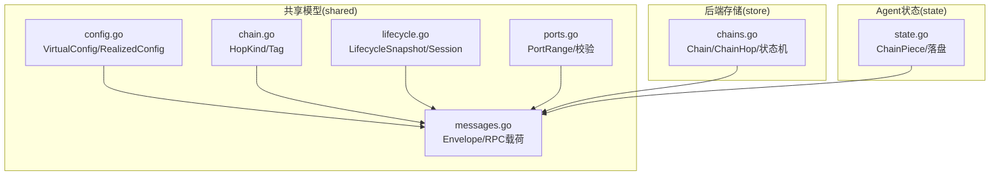
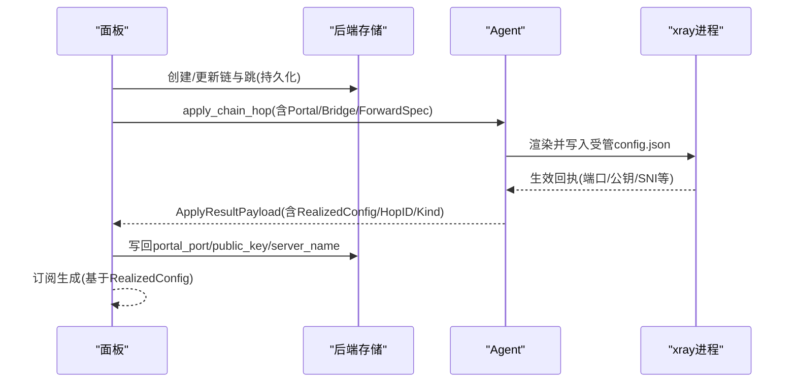
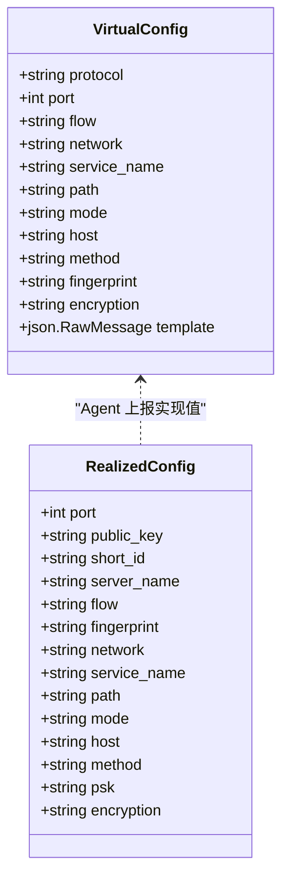
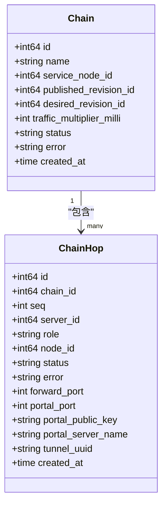
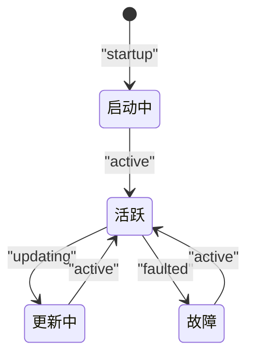
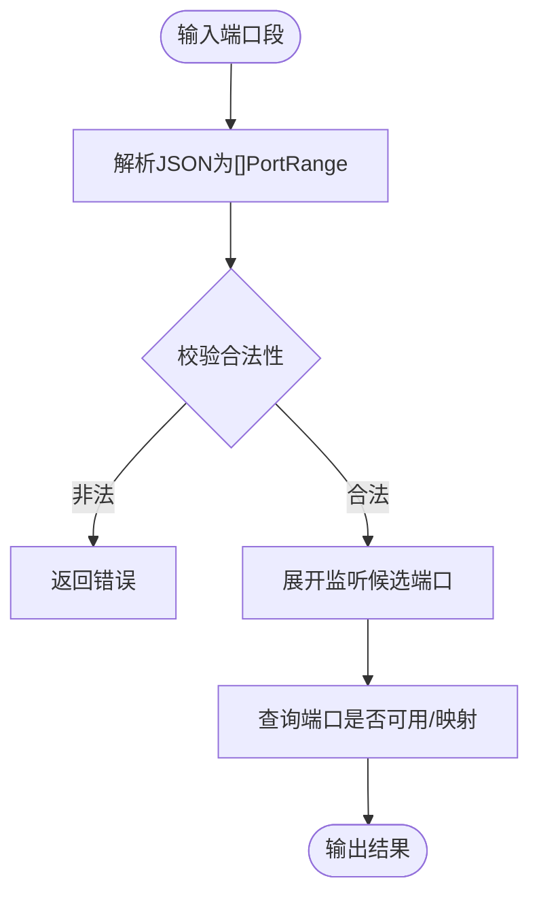
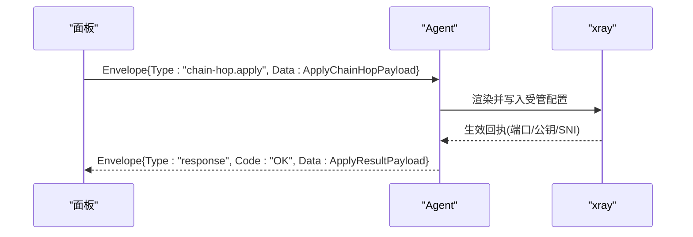
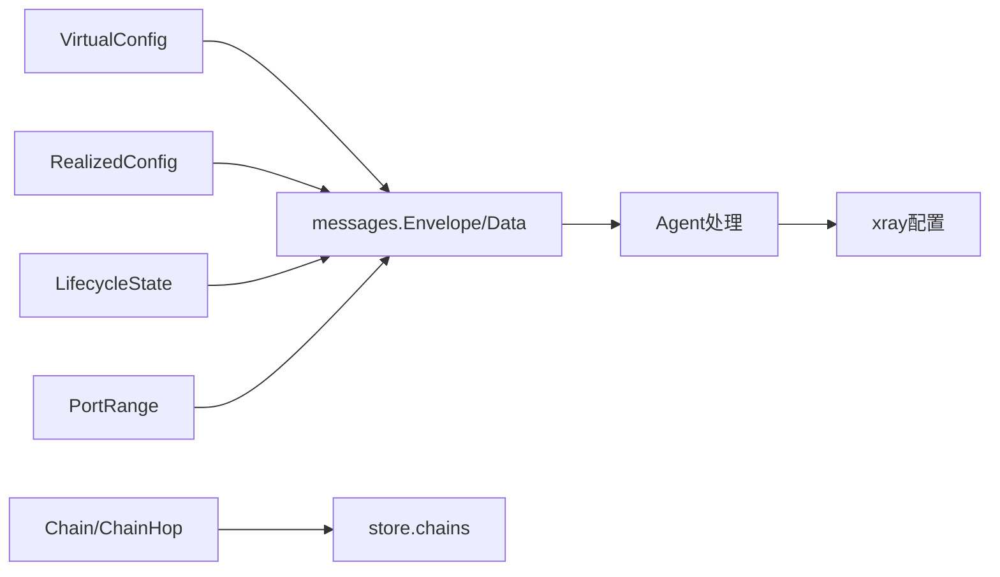

# 数据模型

<cite>
**本文引用的文件**   
- [src/shared/config.go](file://src/shared/config.go)
- [src/shared/chain.go](file://src/shared/chain.go)
- [src/shared/lifecycle.go](file://src/shared/lifecycle.go)
- [src/shared/messages.go](file://src/shared/messages.go)
- [src/shared/ports.go](file://src/shared/ports.go)
- [src/backend/internal/store/chains.go](file://src/backend/internal/store/chains.go)
- [src/agent/internal/state/state.go](file://src/agent/internal/state/state.go)
</cite>

## 目录
1. [简介](#简介)
2. [项目结构](#项目结构)
3. [核心组件](#核心组件)
4. [架构总览](#架构总览)
5. [详细组件分析](#详细组件分析)
6. [依赖关系分析](#依赖关系分析)
7. [性能考虑](#性能考虑)
8. [故障排查指南](#故障排查指南)
9. [结论](#结论)
10. [附录](#附录)

## 简介
本文件面向 Lattix-codex 的核心数据模型，聚焦以下目标：
- 虚拟配置 VirtualConfig 的结构设计（节点配置、用户管理、端口分配等）
- 链路拓扑模型 Chain 的定义（链跳 Hop、目标地址、路由规则等）
- 生命周期状态机 LifecycleState 的状态转换与事件通知机制
- 配置验证规则与约束条件（必填字段、格式校验、业务规则）
- 数据模型的序列化/反序列化示例与扩展新字段的最佳实践
- 提供完整的 JSON 示例与 Go 结构体定义路径，帮助开发者理解和使用

## 项目结构
围绕数据模型的关键代码主要位于 shared 包与后端 store、Agent 状态模块中：
- shared/config.go：VirtualConfig、RealizedConfig、协议/传输常量与占位符
- shared/chain.go：链跳类型与标签生成
- shared/lifecycle.go：面板生命周期快照、会话载荷与事件
- shared/messages.go：控制通道信封、RPC 消息类型与载荷（含链跳应用载荷）
- shared/ports.go：NAT 端口段解析与校验、候选端口与映射
- backend/internal/store/chains.go：链与跳的持久化模型与状态机常量
- agent/internal/state/state.go：Agent 侧链跳配置件落盘结构

**图示来源** 
- [src/shared/config.go:170-206](file://src/shared/config.go#L170-L206)
- [src/shared/chain.go:5-24](file://src/shared/chain.go#L5-L24)
- [src/shared/lifecycle.go:22-86](file://src/shared/lifecycle.go#L22-L86)
- [src/shared/messages.go:13-91](file://src/shared/messages.go#L13-L91)
- [src/shared/ports.go:8-32](file://src/shared/ports.go#L8-L32)
- [src/backend/internal/store/chains.go:43-73](file://src/backend/internal/store/chains.go#L43-L73)
- [src/agent/internal/state/state.go:28-38](file://src/agent/internal/state/state.go#L28-L38)

**章节来源**
- [src/shared/config.go:170-206](file://src/shared/config.go#L170-L206)
- [src/shared/chain.go:5-24](file://src/shared/chain.go#L5-L24)
- [src/shared/lifecycle.go:22-86](file://src/shared/lifecycle.go#L22-L86)
- [src/shared/messages.go:13-91](file://src/shared/messages.go#L13-L91)
- [src/shared/ports.go:8-32](file://src/shared/ports.go#L8-L32)
- [src/backend/internal/store/chains.go:43-73](file://src/backend/internal/store/chains.go#L43-L73)
- [src/agent/internal/state/state.go:28-38](file://src/agent/internal/state/state.go#L28-L38)

## 核心组件
本节概述三大核心数据模型及其职责边界。

- 虚拟配置 VirtualConfig
  - 描述 Agent 端 xray inbound 模板与协议参数，包含协议、传输、占位符替换项等
  - 由面板下发，Agent 根据用户 UUID 列表填充 clients 并上报 RealizedConfig

- 链路拓扑 Chain
  - 以“链”为单位组织多跳转发，每跳具备角色（入口/中间/出口）、端口、反向隧道信息等
  - 支持 portal/bridge/forward 三类跳，分别对应反向上游、下游与透传

- 生命周期状态机 LifecycleState
  - 面板实例状态（启动/活跃/更新/故障）与连接状态（从未连接/连接中/在线/离线/认证拒绝）
  - 通过 WS 事件推送生命周期变更，驱动前端与调度器行为

**章节来源**
- [src/shared/config.go:170-206](file://src/shared/config.go#L170-L206)
- [src/shared/chain.go:5-24](file://src/shared/chain.go#L5-L24)
- [src/shared/lifecycle.go:5-20](file://src/shared/lifecycle.go#L5-L20)

## 架构总览
下图展示数据模型在面板、Agent 与 xray 之间的交互关系与控制流。

**图示来源** 
- [src/shared/messages.go:255-312](file://src/shared/messages.go#L255-L312)
- [src/shared/config.go:170-206](file://src/shared/config.go#L170-L206)
- [src/backend/internal/store/chains.go:245-258](file://src/backend/internal/store/chains.go#L245-L258)
- [src/agent/internal/state/state.go:28-38](file://src/agent/internal/state/state.go#L28-L38)

## 详细组件分析

### 虚拟配置 VirtualConfig 与实现配置 RealizedConfig
- VirtualConfig
  - 关键字段：protocol、port、flow、network、service_name、path、mode、host、method、fingerprint、encryption、template
  - 作用：定义 inbound 模板与协议参数；port=0 表示由 Agent 自动挑选空闲端口
  - 占位符：PORT、PRIVATE_KEY、CLIENTS、DECRYPTION、TAG 等由 Agent 替换

- RealizedConfig
  - 关键字段：port、public_key、short_id、server_name、flow、fingerprint、network、service_name、path、mode、host、method、psk、encryption
  - 作用：Agent 上报的实际生效值，用于订阅生成与前端展示

- 序列化和反序列化
  - 两端通过 JSON 交换 Envelope.Data，使用 json.RawMessage 保留原始片段
  - 扩展建议：新增字段时保持向后兼容，使用 omitempty；对敏感字段避免明文传输

**图示来源** 
- [src/shared/config.go:170-206](file://src/shared/config.go#L170-L206)

**章节来源**
- [src/shared/config.go:170-206](file://src/shared/config.go#L170-L206)

### 链路拓扑模型 Chain 与链跳 Hop
- Chain
  - 字段：id、name、service_node_id、published_revision_id、desired_revision_id、traffic_multiplier_milli、status、error、created_at
  - 状态机：pending → applying → active | failed；可推导 degraded；支持清理与删除

- ChainHop
  - 字段：id、chain_id、seq、server_id、role(entry/middle/exit)、node_id、status、error、forward_port、portal_port、portal_public_key、portal_server_name、tunnel_uuid、created_at
  - 角色与用途：entry 指定订阅端口；exit 关联业务节点；portal/bridge/forward 三类跳

- 标签与域名
  - TunnelDomain(chainID, hopID) 生成 reverse 路由键
  - ChainForwardTag/ChainPortalTag/ChainBridgeTag 为 inbound/outbound/routing 的 tag

**图示来源** 
- [src/backend/internal/store/chains.go:43-73](file://src/backend/internal/store/chains.go#L43-L73)
- [src/shared/chain.go:5-24](file://src/shared/chain.go#L5-L24)

**章节来源**
- [src/backend/internal/store/chains.go:43-73](file://src/backend/internal/store/chains.go#L43-L73)
- [src/shared/chain.go:5-24](file://src/shared/chain.go#L5-L24)

### 生命周期状态机 LifecycleState
- 面板状态：startup、active、updating、faulted
- 连接状态：never_connected、connecting、reconnecting、online、offline、auth_rejected
- 会话载荷：SessionOpenPayload、SessionReadyPayload、CredentialCommitPayload
- 生命周期事件：LifecycleChangedPayload 携带 PanelLifecycleSnapshot

**图示来源** 
- [src/shared/lifecycle.go:5-20](file://src/shared/lifecycle.go#L5-L20)
- [src/shared/lifecycle.go:32-45](file://src/shared/lifecycle.go#L32-L45)

**章节来源**
- [src/shared/lifecycle.go:5-20](file://src/shared/lifecycle.go#L5-L20)
- [src/shared/lifecycle.go:32-45](file://src/shared/lifecycle.go#L32-L45)

### 端口分配与 NAT 映射 PortRange
- PortRange：外部段 [PubStart,PubEnd] 映射到内部监听段 [ListenStart,ListenEnd]；0 表示 1:1 映射
- 校验规则：范围合法、宽度一致、无重叠；支持候选端口展开与查询
- 常用函数：ParsePortRanges、ValidatePortRanges、ListenCandidates、InListenRanges、PublicPort

**图示来源** 
- [src/shared/ports.go:8-32](file://src/shared/ports.go#L8-L32)
- [src/shared/ports.go:34-68](file://src/shared/ports.go#L34-L68)
- [src/shared/ports.go:80-115](file://src/shared/ports.go#L80-L115)

**章节来源**
- [src/shared/ports.go:8-32](file://src/shared/ports.go#L8-L32)
- [src/shared/ports.go:34-68](file://src/shared/ports.go#L34-L68)
- [src/shared/ports.go:80-115](file://src/shared/ports.go#L80-L115)

### 控制通道消息与 RPC 载荷
- Envelope：统一信封，区分 request/response/event，强制 code/message 语义
- 消息类型：session.open/ready、credential.commit、lifecycle.changed、settings.sync/changed、apply_node/remove_node、add_user/remove_user、uninstall、upgrade_xray/agent、telemetry.report、drift.report、apply_chain_hop/remove_chain_hop
- 链跳载荷：ApplyChainHopPayload 包含 PortalSpec/BridgeSpec/ForwardSpec 与 DestCandidates

**图示来源** 
- [src/shared/messages.go:13-91](file://src/shared/messages.go#L13-L91)
- [src/shared/messages.go:255-312](file://src/shared/messages.go#L255-L312)

**章节来源**
- [src/shared/messages.go:13-91](file://src/shared/messages.go#L13-L91)
- [src/shared/messages.go:255-312](file://src/shared/messages.go#L255-L312)

## 依赖关系分析
- VirtualConfig 与 RealizedConfig 通过消息载荷传递，Agent 负责将模板与用户信息合并为实际配置
- Chain/ChainHop 由后端持久化，Agent 通过命令队列执行 apply/remove 操作
- LifecycleState 通过 WS 事件驱动面板状态同步与前端展示
- PortRange 被多处复用（节点创建、链跳端口分配、订阅对外端口）

**图示来源** 
- [src/shared/config.go:170-206](file://src/shared/config.go#L170-L206)
- [src/shared/messages.go:13-91](file://src/shared/messages.go#L13-L91)
- [src/backend/internal/store/chains.go:43-73](file://src/backend/internal/store/chains.go#L43-L73)
- [src/shared/ports.go:8-32](file://src/shared/ports.go#L8-L32)

**章节来源**
- [src/shared/config.go:170-206](file://src/shared/config.go#L170-L206)
- [src/shared/messages.go:13-91](file://src/shared/messages.go#L13-L91)
- [src/backend/internal/store/chains.go:43-73](file://src/backend/internal/store/chains.go#L43-L73)
- [src/shared/ports.go:8-32](file://src/shared/ports.go#L8-L32)

## 性能考虑
- 使用 json.RawMessage 减少不必要的结构体转换开销
- 端口段校验采用区间比较而非点集展开，复杂度 O(n^2) 但段数极小，满足性能要求
- Agent 配置写入采用原子替换与哈希基线，降低漂移检测成本
- 遥测计数器为绝对值，增量计算天然幂等，丢帧可补齐

[本节为通用指导，不直接分析具体文件]

## 故障排查指南
- 配置漂移检测：当配置文件被外部修改时，Agent 上报 DriftPayload，面板触发修复或重放 apply
- 端口冲突：ValidatePortRanges 会报告重叠与非法范围错误，检查 PortRange 配置
- 生命周期异常：观察 PanelLifecycleSnapshot 的 fault 字段与重试策略，定位面板状态异常
- 链跳失败：查看 ChainHop 的 error 字段与状态机流转，确认各跳是否成功应用

**章节来源**
- [src/shared/messages.go:234-238](file://src/shared/messages.go#L234-L238)
- [src/shared/ports.go:34-68](file://src/shared/ports.go#L34-L68)
- [src/shared/lifecycle.go:32-45](file://src/shared/lifecycle.go#L32-L45)
- [src/backend/internal/store/chains.go:231-243](file://src/backend/internal/store/chains.go#L231-L243)

## 结论
Lattix-codex 的数据模型围绕 VirtualConfig、Chain/ChainHop、LifecycleState 三大核心构建，配合严格的端口段校验与消息信封规范，实现了从面板到 Agent 再到 xray 的可控、可观测、可扩展的配置编排体系。遵循本文的验证规则与扩展实践，可安全地演进数据结构并保持前后端一致性。

[本节为总结性内容，不直接分析具体文件]

## 附录

### JSON 示例与结构体定义路径
- VirtualConfig/RealizedConfig
  - 结构体定义路径：[src/shared/config.go:170-206](file://src/shared/config.go#L170-L206)
  - 典型字段说明：protocol、port、network、template 等；RealizedConfig 包含 port、public_key、short_id、server_name、psk、encryption 等

- Chain/ChainHop
  - 结构体定义路径：[src/backend/internal/store/chains.go:43-73](file://src/backend/internal/store/chains.go#L43-L73)
  - 典型字段说明：name、status、role、forward_port、portal_port、tunnel_uuid 等

- LifecycleState
  - 结构体定义路径：[src/shared/lifecycle.go:32-45](file://src/shared/lifecycle.go#L32-L45)
  - 典型字段说明：panel_instance_id、state、epoch、revision、entered_at、fault、retry_policy 等

- 端口段 PortRange
  - 结构体定义路径：[src/shared/ports.go:8-32](file://src/shared/ports.go#L8-L32)
  - 典型字段说明：pub_start、pub_end、listen_start、listen_end

- 链跳载荷与规格
  - 结构体定义路径：[src/shared/messages.go:255-312](file://src/shared/messages.go#L255-L312)
  - 典型字段说明：PortalSpec/BridgeSpec/ForwardSpec 的 tag、port、dest、target_address、via_tunnel_domain 等

**章节来源**
- [src/shared/config.go:170-206](file://src/shared/config.go#L170-L206)
- [src/backend/internal/store/chains.go:43-73](file://src/backend/internal/store/chains.go#L43-L73)
- [src/shared/lifecycle.go:32-45](file://src/shared/lifecycle.go#L32-L45)
- [src/shared/ports.go:8-32](file://src/shared/ports.go#L8-L32)
- [src/shared/messages.go:255-312](file://src/shared/messages.go#L255-L312)

### 扩展新字段的最佳实践
- 使用 omitempty 保证向后兼容
- 新增字段优先放在结构体末尾，避免破坏已有 JSON 顺序
- 对敏感字段进行加密或脱敏，不在日志中打印
- 在消息信封层增加字段校验，确保两端一致性
- 对枚举类字段提供 ValidValue 或专用校验函数

[本节为通用指导，不直接分析具体文件]