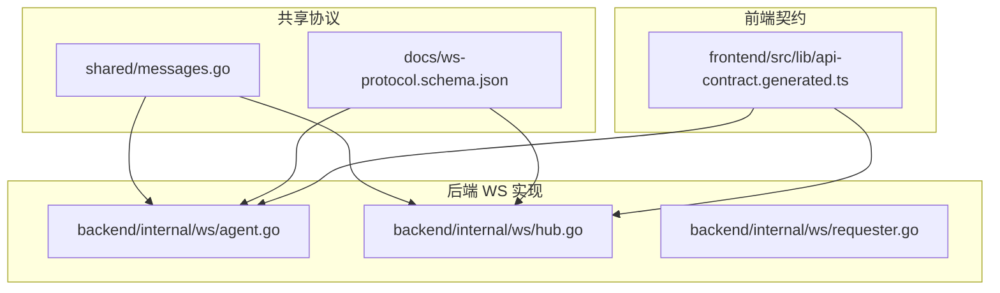
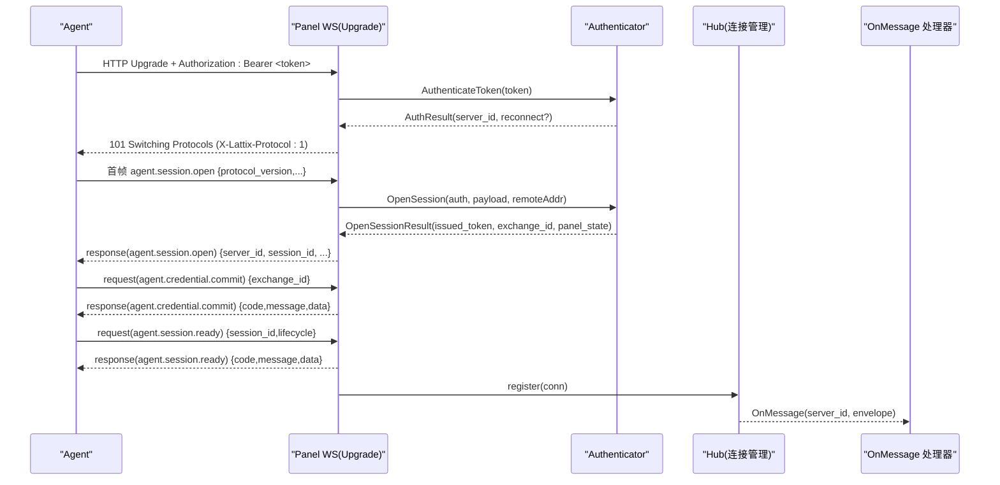
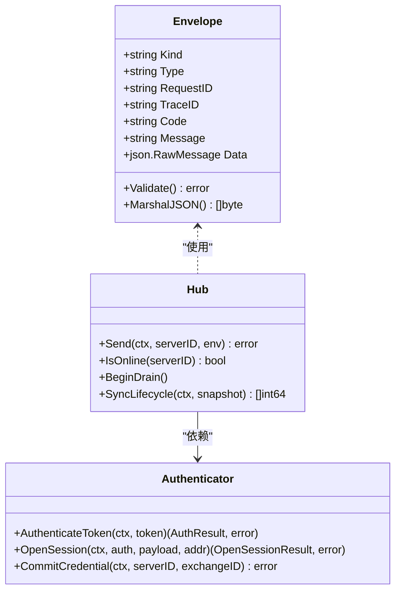

# 消息协议

<cite>
**本文引用的文件**   
- [messages.go](file://src/shared/messages.go)
- [ws-protocol.schema.json](file://docs/ws-protocol.schema.json)
- [agent.go](file://src/backend/internal/ws/agent.go)
- [hub.go](file://src/backend/internal/ws/hub.go)
- [requester.go](file://src/backend/internal/ws/requester.go)
- [messages_test.go](file://src/shared/messages_test.go)
- [api-contract.generated.ts](file://src/frontend/src/lib/api-contract.generated.ts)
</cite>

## 目录
1. [简介](#简介)
2. [项目结构](#项目结构)
3. [核心组件](#核心组件)
4. [架构总览](#架构总览)
5. [详细组件分析](#详细组件分析)
6. [依赖关系分析](#依赖关系分析)
7. [性能考量](#性能考量)
8. [故障排查指南](#故障排查指南)
9. [结论](#结论)
10. [附录：消息格式示例与最佳实践](#附录消息格式示例与最佳实践)

## 简介
本文件为 Lattix-codex 的 WebSocket 控制通道消息协议技术文档，面向 Backend（面板）与 Agent（节点代理）之间的 RPC 通信。文档围绕以下目标展开：
- 深入解释 Envelope 信封结构的设计与字段语义（Kind、Type、RequestID、TraceID、Code、Message、Data）。
- 说明 RPC 消息类型系统（请求、响应、事件）的区别与使用场景。
- 阐述业务结果码体系（OK、ACCEPTED、AUTH_REQUIRED、INTERNAL_ERROR 等）的语义与规范。
- 描述消息验证机制（格式校验、字段校验、错误处理）。
- 解释消息 ID 生成规则与验证逻辑。
- 提供完整的消息格式示例与最佳实践，帮助开发者正确使用 WebSocket 通信协议。

## 项目结构
与消息协议相关的代码主要分布在 shared 包（协议定义与通用类型）、backend/internal/ws（WebSocket 传输与握手）、以及 docs 下的 JSON Schema 定义。前端通过生成的 TypeScript 契约了解 HTTP API 的结果码与信封结构，便于前后端一致性。

图表来源
- [messages.go:1-120](file://src/shared/messages.go#L1-L120)
- [ws-protocol.schema.json:1-120](file://docs/ws-protocol.schema.json#L1-L120)
- [agent.go:1-120](file://src/backend/internal/ws/agent.go#L1-L120)
- [hub.go:1-120](file://src/backend/internal/ws/hub.go#L1-L120)
- [requester.go:1-43](file://src/backend/internal/ws/requester.go#L1-L43)
- [api-contract.generated.ts:1-40](file://src/frontend/src/lib/api-contract.generated.ts#L1-L40)

章节来源
- [messages.go:1-120](file://src/shared/messages.go#L1-L120)
- [ws-protocol.schema.json:1-120](file://docs/ws-protocol.schema.json#L1-L120)
- [agent.go:1-120](file://src/backend/internal/ws/agent.go#L1-L120)
- [hub.go:1-120](file://src/backend/internal/ws/hub.go#L1-L120)
- [requester.go:1-43](file://src/backend/internal/ws/requester.go#L1-L43)
- [api-contract.generated.ts:1-40](file://src/frontend/src/lib/api-contract.generated.ts#L1-L40)

## 核心组件
- Envelope 信封：统一的消息载体，包含 Kind、Type、RequestID、TraceID、Code、Message、Data。
- 消息类型系统：Kind 限定 request/response/event；Type 采用 domain.action 命名空间。
- 业务结果码：统一的 Code 常量集合，覆盖成功、认证、参数、资源、冲突、锁定、不支持、内部错误、上游错误、服务不可用、离线、端口越界、更新中。
- 消息 ID：NewMessageID 生成 32 位十六进制随机字符串；ValidMessageID 校验格式。
- 验证器：Envelope.Validate 对信封进行结构与字段级校验；JSON Schema 提供跨语言约束。
- WebSocket 传输：Hub 管理连接、发送队列、生命周期回调；Agent 端点负责握手、会话建立、鉴权、读循环。

章节来源
- [messages.go:13-137](file://src/shared/messages.go#L13-L137)
- [ws-protocol.schema.json:106-132](file://docs/ws-protocol.schema.json#L106-L132)
- [agent.go:30-120](file://src/backend/internal/ws/agent.go#L30-L120)
- [hub.go:25-138](file://src/backend/internal/ws/hub.go#L25-L138)
- [requester.go:12-43](file://src/backend/internal/ws/requester.go#L12-L43)

## 架构总览
Backend 作为服务端监听 /api/agent/ws，Agent 主动拨入并携带 Bearer Token 完成鉴权。首次应用帧必须为 agent.session.open，随后进入 credential.commit 与 session.ready 两阶段准备，完成后注册到 Hub 的连接表，开始收发业务命令与事件。

图表来源
- [agent.go:30-237](file://src/backend/internal/ws/agent.go#L30-L237)
- [hub.go:229-278](file://src/backend/internal/ws/hub.go#L229-L278)
- [requester.go:36-43](file://src/backend/internal/ws/requester.go#L36-L43)

## 详细组件分析

### Envelope 信封结构
- Kind：消息种类，枚举值 request、response、event。
- Type：动作标识，采用 domain.action 层级命名，如 agent.session.open、node.apply、telemetry.report 等。
- RequestID：请求唯一标识，用于匹配请求与响应。
- TraceID：链路追踪标识，贯穿一次调用链。
- Code：仅 response 携带，表示业务结果码。
- Message：仅 response 携带，人类可读的错误或提示文本。
- Data：载荷，具体动作的 JSON 对象，由 Type 决定结构。

MarshalJSON 保证响应始终包含 code/message，而请求/事件不输出这两个字段，减少冗余。

章节来源
- [messages.go:13-45](file://src/shared/messages.go#L13-L45)
- [messages.go:47-91](file://src/shared/messages.go#L47-L91)

### RPC 消息类型系统
- 请求（Kind=request）：由发起方发出，需等待响应。例如 node.apply、user.add、chain-hop.apply 等。
- 响应（Kind=response）：对请求的应答，必须包含 code/message，Type 与对应请求一致。
- 事件（Kind=event）：单向通知，无需回执，如 telemetry.report、panel.lifecycle.changed、agent.settings.changed。

Type 命名约定遵循 domain.action，未知 Type 将返回 UNSUPPORTED_ACTION。

章节来源
- [messages.go:47-91](file://src/shared/messages.go#L47-L91)
- [ws-protocol.schema.json:106-132](file://docs/ws-protocol.schema.json#L106-L132)

### 业务结果码体系
- OK：操作成功。
- ACCEPTED：已接受（异步处理中）。
- AUTH_REQUIRED：需要认证。
- AUTH_INVALID_CREDENTIALS：凭据无效。
- INVALID_ARGUMENT：参数非法。
- NOT_FOUND：资源不存在。
- CONFLICT：状态冲突。
- OPERATION_LOCKED：操作被锁定。
- UNSUPPORTED_ACTION：不支持的动作。
- INTERNAL_ERROR：内部错误。
- UPSTREAM_ERROR：上游错误。
- SERVICE_UNAVAILABLE：服务不可用。
- SERVER_OFFLINE：服务器离线。
- PORT_OUT_OF_RANGE：端口越界。
- UPDATE_IN_PROGRESS：更新进行中。

这些常量在 shared 包中统一定义，HTTP 与 WebSocket 共用同一语义。

章节来源
- [messages.go:54-70](file://src/shared/messages.go#L54-L70)
- [api-contract.generated.ts:4-20](file://src/frontend/src/lib/api-contract.generated.ts#L4-L20)

### 消息验证机制
- 格式校验：readEnvelope 要求文本帧且严格反序列化为 Envelope。
- 字段校验：Envelope.Validate 检查 Kind 枚举、Type 非空、RequestID/TraceID 格式、Data 有效 JSON、响应必须含 code 且请求/事件不得含 code/message。
- 严格反序列化：strictUnmarshal 禁止未知字段，确保契约稳定。
- JSON Schema：ws-protocol.schema.json 定义了全局与按 Type 的条件约束，便于多语言校验。

章节来源
- [agent.go:300-327](file://src/backend/internal/ws/agent.go#L300-L327)
- [messages.go:112-137](file://src/shared/messages.go#L112-L137)
- [ws-protocol.schema.json:106-132](file://docs/ws-protocol.schema.json#L106-L132)

### 消息 ID 生成与验证
- NewMessageID：使用 crypto/rand 生成 16 字节随机数，编码为 32 位小写十六进制字符串。
- ValidMessageID：长度 32 且可被 hex.DecodeString 解析。
- 用途：RequestID 用于请求-响应匹配；TraceID 用于全链路追踪。

章节来源
- [messages.go:93-109](file://src/shared/messages.go#L93-L109)

### WebSocket 握手与会话流程
- 鉴权：Authorization: Bearer <token>，失败返回 403 并附带结构化信封响应。
- 协议头：X-Lattix-Protocol: 1，用于版本协商。
- 首帧限制：第一个应用帧必须是 agent.session.open，否则关闭连接并返回协议错误。
- 会话准备：credential.commit 与 session.ready 两阶段，成功后注册连接。
- 心跳：Agent 主动 Ping，Panel Pong 并续期读超时；无消息则 90s 判定断开。
- 发送队列：每连接 256 条缓冲，满则断开重连后补发。

章节来源
- [agent.go:30-120](file://src/backend/internal/ws/agent.go#L30-L120)
- [agent.go:155-237](file://src/backend/internal/ws/agent.go#L155-L237)
- [hub.go:15-23](file://src/backend/internal/ws/hub.go#L15-L23)
- [hub.go:109-138](file://src/backend/internal/ws/hub.go#L109-L138)

### 连接管理与生命周期
- Hub.register/unregister：维护在线连接映射与状态快照，触发 OnOnline/OnReconnect/OnDisconnect。
- BeginDrain：优雅停机，拒绝新工作并关闭所有连接（RFC 6455 1012），促使 Agent 快速重启重连。
- SyncLifecycle：向所有在线 Agent 广播生命周期变更并等待 ACK。

章节来源
- [hub.go:229-278](file://src/backend/internal/ws/hub.go#L229-L278)
- [hub.go:155-172](file://src/backend/internal/ws/hub.go#L155-L172)
- [hub.go:321-360](file://src/backend/internal/ws/hub.go#L321-L360)

### 错误处理与协议错误上报
- writeHandshakeError：握手阶段错误以结构化信封返回，包含 code/message。
- protocolError：协议层错误记录 serverID、requestID、traceID、rpcType、message，供遥测与告警。
- 关闭帧：协议错误使用自定义关闭码（如 4002）并附带原因。

章节来源
- [agent.go:262-272](file://src/backend/internal/ws/agent.go#L262-L272)
- [agent.go:285-298](file://src/backend/internal/ws/agent.go#L285-L298)

### 数据模型与载荷类型
- ApplyNodePayload、RemoveNodePayload、AddUserPayload、RemoveUserPayload、TelemetryPayload、DriftPayload、UpgradeXrayPayload、UpgradeAgentPayload、ApplyChainHopPayload、RemoveChainHopPayload 等，均定义于 shared 包，随 Type 使用。
- RealizedConfig、HostMetrics、TrafficCounter 等用于回执与遥测。

章节来源
- [messages.go:139-313](file://src/shared/messages.go#L139-L313)

## 依赖关系分析
- shared/messages.go 提供 Envelope、常量、载荷类型与验证函数，被 ws 包与测试引用。
- backend/internal/ws/* 实现传输、握手、连接管理，依赖 shared 的类型与常量。
- docs/ws-protocol.schema.json 提供跨语言的协议约束，辅助前端与后端保持一致。
- frontend 契约文件导出 RPCCode 与 RPCEnvelope 类型，便于前端类型安全消费。

图表来源
- [messages.go:13-45](file://src/shared/messages.go#L13-L45)
- [hub.go:25-138](file://src/backend/internal/ws/hub.go#L25-L138)
- [requester.go:36-43](file://src/backend/internal/ws/requester.go#L36-L43)

章节来源
- [messages.go:13-137](file://src/shared/messages.go#L13-L137)
- [hub.go:25-138](file://src/backend/internal/ws/hub.go#L25-L138)
- [requester.go:12-43](file://src/backend/internal/ws/requester.go#L12-L43)

## 性能考量
- 写超时：单次写连接超时 10s，超时即判定连接死亡。
- 读超时：无消息 90s 判定断开，Ping/Pong 维持活跃。
- 发送缓冲：每连接 256 条，满则断开并重连后补发，避免慢连接拖垮。
- 串行写出：writePump 串行消费发送队列，避免 gorilla 并发写问题。
- 幂等性：遥测计数器基于绝对值增量，丢帧可由下一帧补齐。

章节来源
- [hub.go:15-23](file://src/backend/internal/ws/hub.go#L15-L23)
- [hub.go:380-395](file://src/backend/internal/ws/hub.go#L380-L395)
- [messages.go:224-232](file://src/shared/messages.go#L224-L232)

## 故障排查指南
- 握手失败：检查 Authorization 头与 token 有效性；查看 writeHandshakeError 返回的结构化信封。
- 首帧错误：确认首个应用帧为 agent.session.open，否则收到 4002 关闭帧。
- 协议错误：关注 protocolError 上报的 serverID、requestID、traceID、rpcType、message。
- 连接断开：检查 send buffer 是否满（慢连接），或 read deadline 超时（无心跳）。
- 生命周期不一致：session.ready 时 lifecycle 版本需与当前一致，否则返回 CONFLICT。

章节来源
- [agent.go:262-272](file://src/backend/internal/ws/agent.go#L262-L272)
- [agent.go:285-298](file://src/backend/internal/ws/agent.go#L285-L298)
- [agent.go:179-195](file://src/backend/internal/ws/agent.go#L179-L195)
- [hub.go:109-138](file://src/backend/internal/ws/hub.go#L109-L138)

## 结论
Lattix-codex 的 WebSocket 消息协议以 Envelope 为核心，通过严格的 Kind/Type/ID 设计与统一的 Code 体系，实现了高可靠、可观测、可扩展的面板-代理控制通道。结合 JSON Schema 与严格反序列化，确保了跨语言的一致性与健壮性。建议开发者遵循本文档的最佳实践，确保握手、会话、验证、错误处理的正确实现。

## 附录：消息格式示例与最佳实践

### 信封字段说明
- kind：request | response | event
- type：domain.action（如 agent.session.open、node.apply、telemetry.report）
- request_id：32 位十六进制随机串
- trace_id：32 位十六进制随机串
- code：仅 response 存在（如 OK、INTERNAL_ERROR）
- message：仅 response 存在（人类可读信息）
- data：具体载荷（由 type 决定）

章节来源
- [ws-protocol.schema.json:106-132](file://docs/ws-protocol.schema.json#L106-L132)
- [messages.go:13-45](file://src/shared/messages.go#L13-L45)

### 请求示例（agent.session.open）
- kind: request
- type: agent.session.open
- request_id: 32 位十六进制
- trace_id: 32 位十六进制
- data: { protocol_version: 1, agent_version: "...", xray_version: "...", xray_running: true, nic_addresses: [...], last_lifecycle: { epoch: "...", revision: N } }

章节来源
- [ws-protocol.schema.json:136-156](file://docs/ws-protocol.schema.json#L136-L156)

### 响应示例（agent.session.open）
- kind: response
- type: agent.session.open
- request_id: 与请求一致
- trace_id: 与请求一致
- code: OK
- message: ""
- data: { server_id: N, session_id: "...", session_kind: "initial"|"reconnect", issued_token: "...", credential_exchange_id: "...", panel_state: {...} }

章节来源
- [ws-protocol.schema.json:157-179](file://docs/ws-protocol.schema.json#L157-L179)

### 事件示例（telemetry.report）
- kind: event
- type: telemetry.report
- request_id: 32 位十六进制
- trace_id: 32 位十六进制
- data: { xray_instance_id: "...", traffic: [{ up: N, down: N, node_id?: N, hop_id?: N, user?: "..."}] }

章节来源
- [ws-protocol.schema.json:317-333](file://docs/ws-protocol.schema.json#L317-L333)

### 最佳实践
- 始终为每个请求生成独立的 request_id 与 trace_id，并使用 ValidMessageID 校验。
- 请求/事件不要包含 code/message；响应必须包含 code/message。
- 使用 strictUnmarshal 禁止未知字段，保持契约稳定。
- 处理握手错误与协议错误时，返回结构化信封以便客户端统一处理。
- 合理设置重试与退避策略，利用 CONNECTING/RECONNECTING 状态机。
- 对于慢连接，及时断开并依赖重连补发机制，避免阻塞。

章节来源
- [messages.go:112-137](file://src/shared/messages.go#L112-L137)
- [agent.go:300-327](file://src/backend/internal/ws/agent.go#L300-L327)
- [messages_test.go:9-48](file://src/shared/messages_test.go#L9-L48)