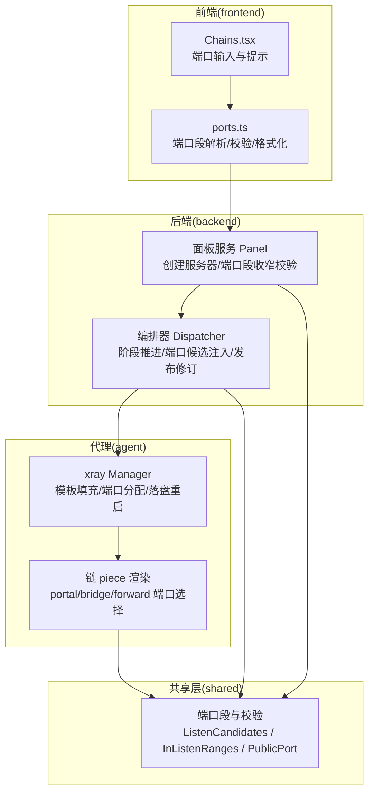
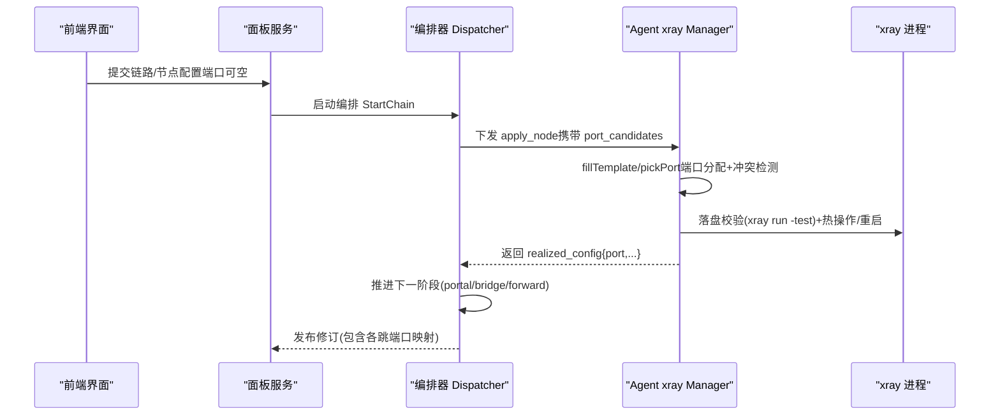
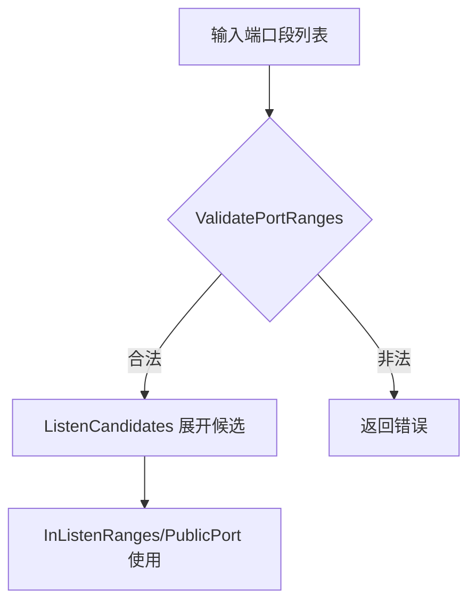
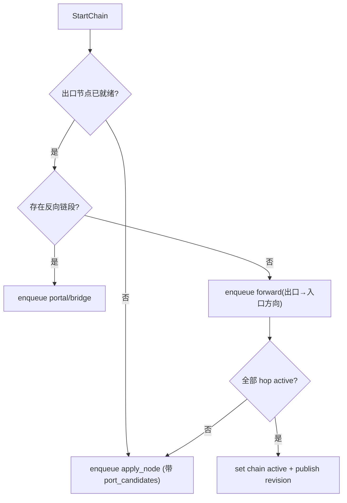
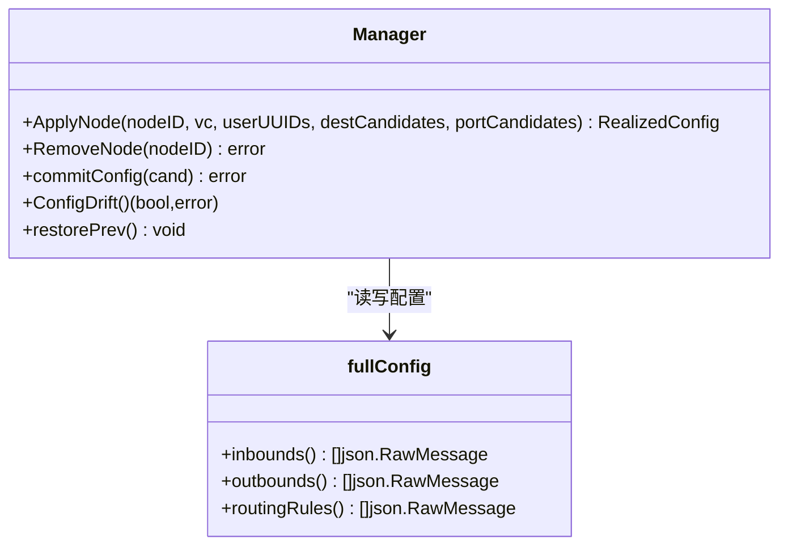
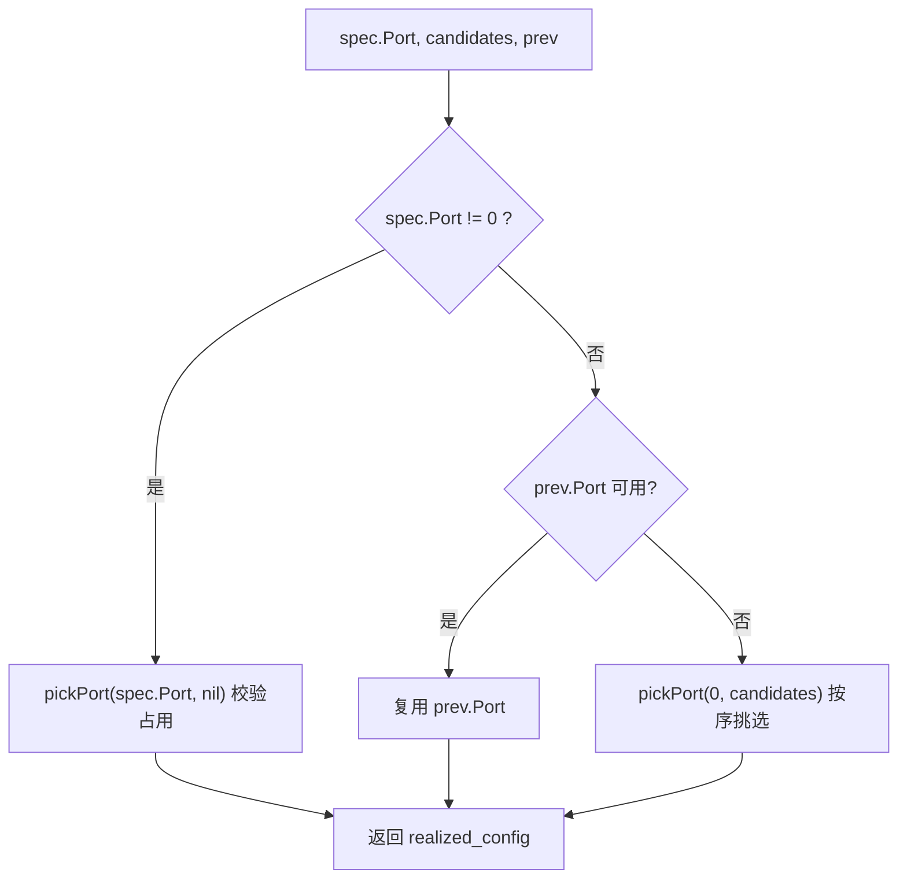
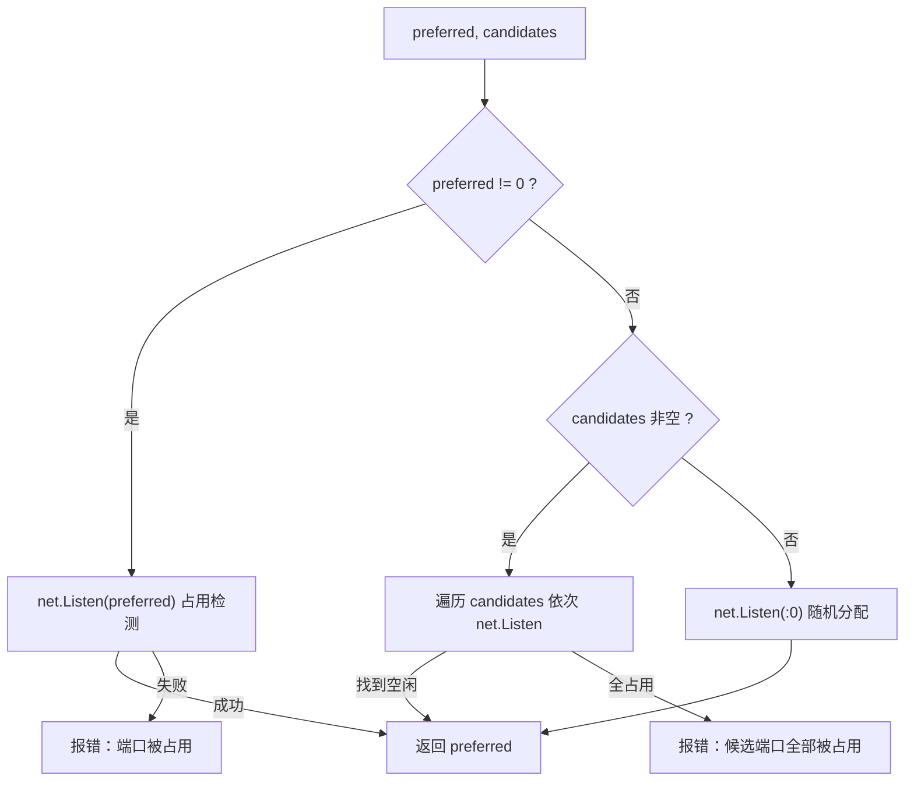
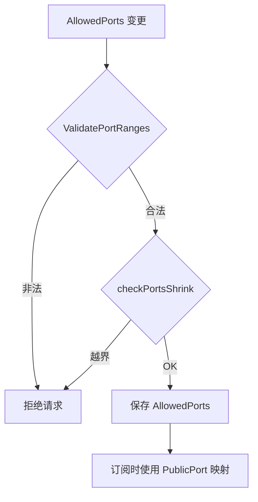
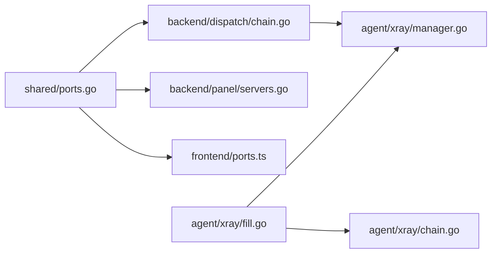

# 端口管理

<cite>
**本文引用的文件**   
- [ports.go](file://src/shared/ports.go)
- [ports_test.go](file://src/shared/ports_test.go)
- [fill.go](file://src/agent/internal/xray/fill.go)
- [chain.go](file://src/agent/internal/xray/chain.go)
- [manager.go](file://src/agent/internal/xray/manager.go)
- [chain.go](file://src/backend/internal/dispatch/chain.go)
- [chain_test.go](file://src/backend/internal/dispatch/chain_test.go)
- [servers.go](file://src/backend/internal/panel/servers.go)
- [Chains.tsx](file://src/frontend/src/pages/Chains.tsx)
- [ports.ts](file://src/frontend/src/lib/ports.ts)
</cite>

## 目录
1. [简介](#简介)
2. [项目结构](#项目结构)
3. [核心组件](#核心组件)
4. [架构总览](#架构总览)
5. [详细组件分析](#详细组件分析)
6. [依赖关系分析](#依赖关系分析)
7. [性能考量](#性能考量)
8. [故障排查指南](#故障排查指南)
9. [结论](#结论)
10. [附录：API 使用示例与最佳实践](#附录api-使用示例与最佳实践)

## 简介
本技术文档围绕 Lattix-codex 的“端口管理系统”展开，重点阐述以下能力：
- 端口分配算法与冲突检测机制（动态端口选择、端口池管理、NAT 环境适配）
- 端口验证规则（合法范围检查、权限校验、占用检测）
- 端口的生命周期管理（申请、分配、释放、回收）
- 端口与节点的绑定关系（多端口支持、端口复用、负载均衡）
- 前端到后端的 API 使用示例与故障排查指引

系统通过后端编排器（Dispatcher）与 Agent 侧 xray Manager 协同工作，结合 shared 层的端口段定义与校验工具，实现跨 NAT、直连、反向链等多种拓扑下的端口自动分配与稳定复用。

## 项目结构
端口管理相关代码分布在三层：
- shared 层：端口段数据结构与校验、候选端口生成、监听/公网端口映射等通用能力
- backend 层：链路编排与下发（含端口候选注入、端口收窄校验、订阅映射）
- agent 层：端口实际分配与冲突检测、配置落盘与重启、幂等重发与端口复用
- frontend 层：端口输入校验与格式化展示

**图表来源** 
- [ports.go:1-115](file://src/shared/ports.go#L1-L115)
- [chain.go:100-354](file://src/backend/internal/dispatch/chain.go#L100-L354)
- [manager.go:109-142](file://src/agent/internal/xray/manager.go#L109-L142)
- [chain.go:82-119](file://src/agent/internal/xray/chain.go#L82-L119)
- [Chains.tsx:1154-1194](file://src/frontend/src/pages/Chains.tsx#L1154-L1194)
- [ports.ts:1-101](file://src/frontend/src/lib/ports.ts#L1-L101)

**章节来源**
- [ports.go:1-115](file://src/shared/ports.go#L1-L115)
- [chain.go:100-354](file://src/backend/internal/dispatch/chain.go#L100-L354)
- [manager.go:109-142](file://src/agent/internal/xray/manager.go#L109-L142)
- [chain.go:82-119](file://src/agent/internal/xray/chain.go#L82-L119)
- [Chains.tsx:1154-1194](file://src/frontend/src/pages/Chains.tsx#L1154-L1194)
- [ports.ts:1-101](file://src/frontend/src/lib/ports.ts#L1-L101)

## 核心组件
- 端口段与校验（shared/ports.go）
  - PortRange：外部段与监听段的映射（支持 1:1 与非 1:1）
  - ValidatePortRanges：合法性与重叠校验
  - ListenCandidates：展开监听侧候选端口序列
  - InListenRanges：判断端口是否落在监听段内
  - PublicPort：监听端口映射为公网端口（订阅取 public_port）
- 后端编排器（backend/internal/dispatch/chain.go）
  - 五阶段编排：出口业务 apply_node → portal → bridge → forward → active
  - 根据节点 AllowedPorts 注入 port_candidates
  - 发布修订时回填各跳 ForwardPort/PortalPort 等
- Agent xray Manager（agent/internal/xray/manager.go）
  - ApplyNode：模板填充、dest 预检、端口分配、落盘校验、热操作或重启
  - commitConfig：原子落盘 + xray run -test 校验 + 回滚
- Agent 链 piece（agent/internal/xray/chain.go）
  - renderPortal/renderBridge/renderForward：按角色渲染配置并选择端口
  - pickChainPort：优先复用历史端口，否则从候选段挑选空闲端口
- 前端（frontend）
  - Chains.tsx：入口/出口端口输入、留空自动分配提示
  - ports.ts：端口段文本解析/校验/格式化，与后端规则一致

**章节来源**
- [ports.go:1-115](file://src/shared/ports.go#L1-L115)
- [chain.go:100-354](file://src/backend/internal/dispatch/chain.go#L100-L354)
- [manager.go:109-142](file://src/agent/internal/xray/manager.go#L109-L142)
- [chain.go:82-119](file://src/agent/internal/xray/chain.go#L82-L119)
- [Chains.tsx:1154-1194](file://src/frontend/src/pages/Chains.tsx#L1154-L1194)
- [ports.ts:1-101](file://src/frontend/src/lib/ports.ts#L1-L101)

## 架构总览
端口管理的端到端流程如下：
- 用户在面板创建/编辑链路，指定端口（可留空自动分配）
- 后端编排器根据服务器 AllowedPorts 计算 port_candidates
- Agent 侧在模板填充与配置落盘前进行端口分配与冲突检测
- 成功应用后上报 realized_config（含最终端口），编排器推进至下一跳
- 发布修订时，将各跳端口信息写入订阅数据（public_port）

**图表来源** 
- [chain.go:100-354](file://src/backend/internal/dispatch/chain.go#L100-L354)
- [manager.go:109-142](file://src/agent/internal/xray/manager.go#L109-L142)
- [fill.go:23-142](file://src/agent/internal/xray/fill.go#L23-L142)

## 详细组件分析

### 端口段与校验（shared/ports.go）
- 端口段定义支持 1:1 与非 1:1 映射；非 1:1 要求两侧宽度一致
- 校验覆盖：区间合法性、listen_* 成对性、宽度一致性、段间不重叠
- 工具函数：
  - ListenCandidates：顺序展开监听侧候选端口（用于 Agent 按序挑选）
  - InListenRanges：用于建链/建节点时的端口合法性校验
  - PublicPort：订阅时对外暴露的公网端口映射

**图表来源** 
- [ports.go:34-68](file://src/shared/ports.go#L34-L68)
- [ports.go:80-115](file://src/shared/ports.go#L80-L115)

**章节来源**
- [ports.go:1-115](file://src/shared/ports.go#L1-L115)
- [ports_test.go:1-73](file://src/shared/ports_test.go#L1-L73)

### 后端编排器（backend/internal/dispatch/chain.go）
- 五阶段编排：
  1) 出口业务 apply_node：若虚拟配置未指定端口，则注入 port_candidates
  2) portal（反向链上游机）：端口候选 = 监听侧段
  3) bridge（下游机）：携带 portal 回执（公网端口、公钥、SNI）
  4) forward（入口/中间跳）：目标为下一跳公网端口或回环地址+隧道域
  5) 全部完成 → active
- 端口候选注入：listenCandidatesOf(servers[serverID])
- 发布修订：回填各跳 ForwardPort/PortalPort，供订阅使用

**图表来源** 
- [chain.go:100-354](file://src/backend/internal/dispatch/chain.go#L100-L354)

**章节来源**
- [chain.go:100-354](file://src/backend/internal/dispatch/chain.go#L100-L354)
- [chain_test.go:147-231](file://src/backend/internal/dispatch/chain_test.go#L147-L231)

### Agent xray Manager（agent/internal/xray/manager.go）
- ApplyNode：
  - 模板填充（PORT/CLIENTS/Reality 私钥占位符替换）
  - dest 预检（Reality 白名单可达性探测）
  - 端口分配（pickPort）
  - 落盘校验（xray run -test）
  - 热操作失败则回滚并重启
- commitConfig：原子写临时文件 → 校验 → 备份旧配置 → 原子替换
- ConfigDrift：漂移检测与净化恢复

**图表来源** 
- [manager.go:109-142](file://src/agent/internal/xray/manager.go#L109-L142)
- [manager.go:235-287](file://src/agent/internal/xray/manager.go#L235-L287)

**章节来源**
- [manager.go:109-142](file://src/agent/internal/xray/manager.go#L109-L142)
- [manager.go:235-287](file://src/agent/internal/xray/manager.go#L235-L287)

### Agent 链 piece 端口选择（agent/internal/xray/chain.go）
- renderPortal/renderBridge/renderForward：按角色渲染配置片段
- pickChainPort：
  - 若 spec.Port 指定：校验占用（冲突报错）
  - 否则优先复用历史端口（重发幂等）
  - 被占用则从 candidates 按序挑选空闲端口
- 结果：返回 realized_config（含端口、公钥、短 ID、SNI 等）

**图表来源** 
- [chain.go:362-374](file://src/agent/internal/xray/chain.go#L362-L374)
- [chain.go:159-218](file://src/agent/internal/xray/chain.go#L159-L218)

**章节来源**
- [chain.go:82-119](file://src/agent/internal/xray/chain.go#L82-L119)
- [chain.go:310-349](file://src/agent/internal/xray/chain.go#L310-L349)
- [chain.go:362-374](file://src/agent/internal/xray/chain.go#L362-L374)

### 端口分配算法与冲突检测（agent/internal/xray/fill.go）
- pickPort：
  - 指定端口：尝试 net.Listen 校验占用，失败返回错误
  - 候选段：按序尝试，首个空闲即选中
  - 无候选：随机分配 (:0)
- ensureDestReachable：Reality dest 不可达时按白名单逐个尝试并改写 serverNames

**图表来源** 
- [fill.go:247-276](file://src/agent/internal/xray/fill.go#L247-L276)
- [fill.go:170-223](file://src/agent/internal/xray/fill.go#L170-L223)

**章节来源**
- [fill.go:23-142](file://src/agent/internal/xray/fill.go#L23-L142)
- [fill.go:247-276](file://src/agent/internal/xray/fill.go#L247-L276)

### 端口验证与收窄（backend/internal/panel/servers.go）
- 创建/更新服务器时：
  - 校验端口段合法性（ValidatePortRanges）
  - checkPortsShrink：收窄后存量端口不得越界（节点指定/realized、链跳 forward/portal）
- 订阅映射：PublicPort 将监听端口映射为公网端口

**图表来源** 
- [servers.go:465-483](file://src/backend/internal/panel/servers.go#L465-L483)
- [servers.go:538-573](file://src/backend/internal/panel/servers.go#L538-L573)

**章节来源**
- [servers.go:465-483](file://src/backend/internal/panel/servers.go#L465-L483)
- [servers.go:538-573](file://src/backend/internal/panel/servers.go#L538-L573)

### 前端端口输入与校验（frontend）
- Chains.tsx：入口/出口端口输入框，留空表示自动分配（须在服务器可用段内）
- ports.ts：端口段文本解析/校验/格式化，与后端 ValidatePortRanges 保持一致

**章节来源**
- [Chains.tsx:1154-1194](file://src/frontend/src/pages/Chains.tsx#L1154-L1194)
- [ports.ts:1-101](file://src/frontend/src/lib/ports.ts#L1-L101)

## 依赖关系分析
- shared/ports.go 被后端 panel、dispatch 与前端 ports.ts 共同引用，保证端口段语义一致
- dispatch/chain.go 依赖 shared 的 ListenCandidates/PublicPort 进行候选注入与订阅映射
- agent xray manager 依赖 fill.go 的 pickPort/ensureDestReachable 完成端口分配与 dest 预检
- agent chain.go 的 pickChainPort 复用 fill.go 的 pickPort，确保行为一致

**图表来源** 
- [ports.go:1-115](file://src/shared/ports.go#L1-L115)
- [chain.go:100-354](file://src/backend/internal/dispatch/chain.go#L100-L354)
- [servers.go:465-483](file://src/backend/internal/panel/servers.go#L465-L483)
- [fill.go:247-276](file://src/agent/internal/xray/fill.go#L247-L276)
- [chain.go:362-374](file://src/agent/internal/xray/chain.go#L362-L374)

**章节来源**
- [ports.go:1-115](file://src/shared/ports.go#L1-L115)
- [chain.go:100-354](file://src/backend/internal/dispatch/chain.go#L100-L354)
- [servers.go:465-483](file://src/backend/internal/panel/servers.go#L465-L483)
- [fill.go:247-276](file://src/agent/internal/xray/fill.go#L247-L276)
- [chain.go:362-374](file://src/agent/internal/xray/chain.go#L362-L374)

## 性能考量
- 端口候选展开 ListenCandidates：段数通常较小，线性扫描开销可忽略
- pickPort 占用检测：每次分配最多一次 net.Listen，失败快速失败，避免阻塞
- 配置落盘与重启：仅在热操作失败时回退重启，降低常规路径开销
- 编排器推进：每步仅一个在途 piece，减少并发竞争与状态不一致风险

## 故障排查指南
- 端口被占用
  - 现象：分配失败，提示端口被占用
  - 排查：确认本机/容器端口占用；检查候选段是否足够；必要时扩大 AllowedPorts
  - 参考：fill.go 中 pickPort 的错误分支
- 候选端口全部被占用
  - 现象：提示候选端口全部被占用
  - 排查：扩大端口段或清理占用；检查是否有其他服务监听
- Reality dest 不可达
  - 现象：dest 预检失败，需回退白名单候选
  - 排查：检查网络连通性与 TLS1.3；确认白名单候选可达
- 端口段收窄越界
  - 现象：面板保存时报错“端口段收窄后…越界”
  - 排查：检查节点指定/realized 端口与链跳 forward/portal 端口是否在新段内
- 链编排失败定位到跳
  - 现象：链 failed，错误定位到具体跳
  - 排查：查看该跳的 apply_chain_hop 回执与错误信息；重试只重放失败 piece

**章节来源**
- [fill.go:247-276](file://src/agent/internal/xray/fill.go#L247-L276)
- [chain.go:592-634](file://src/backend/internal/dispatch/chain.go#L592-L634)
- [servers.go:538-573](file://src/backend/internal/panel/servers.go#L538-L573)

## 结论
Lattix-codex 的端口管理系统以 shared 端口段为核心，结合后端编排器的阶段化推进与 Agent 侧严格的端口分配与冲突检测，实现了在 NAT/直连/反向链等多拓扑下的稳定端口管理。通过端口候选注入、监听/公网映射、幂等重发与回滚机制，系统在可用性、一致性与可维护性之间取得良好平衡。

## 附录：API 使用示例与最佳实践
- 创建/更新服务器时设置 AllowedPorts
  - 使用 ValidatePortRanges 校验端口段合法性
  - 收窄 AllowedPorts 前调用 checkPortsShrink 防止越界
- 创建链路时端口策略
  - 入口/出口端口可留空，由 Agent 自动分配（须满足 AllowedPorts）
  - 指定端口将被严格校验占用，冲突立即失败
- 订阅与端口映射
  - 订阅取 public_port（由 PublicPort 映射得到）
- 最佳实践
  - 合理划分端口段，避免重叠与过窄
  - 为 NAT 受限直连机预留足够候选段
  - 使用幂等重发与回滚机制保障稳定性

**章节来源**
- [servers.go:465-483](file://src/backend/internal/panel/servers.go#L465-L483)
- [ports.go:80-115](file://src/shared/ports.go#L80-L115)
- [chain.go:100-354](file://src/backend/internal/dispatch/chain.go#L100-L354)
- [fill.go:247-276](file://src/agent/internal/xray/fill.go#L247-L276)