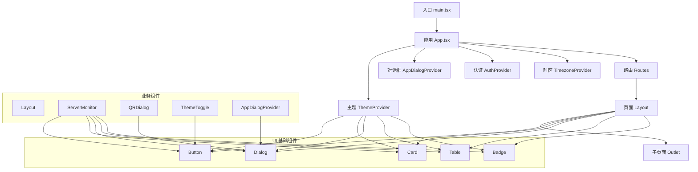
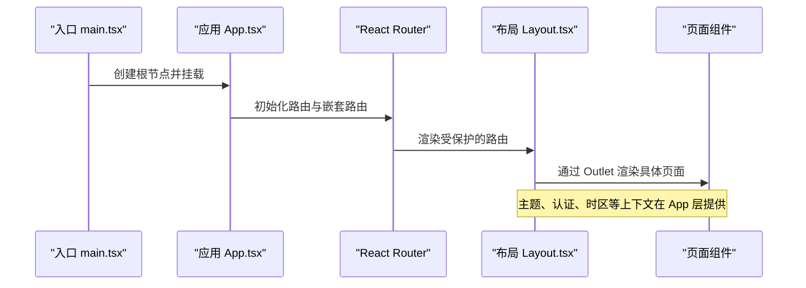
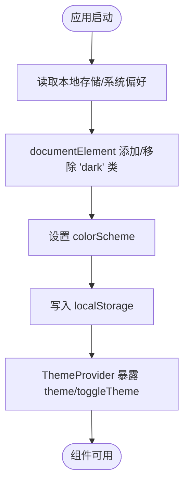
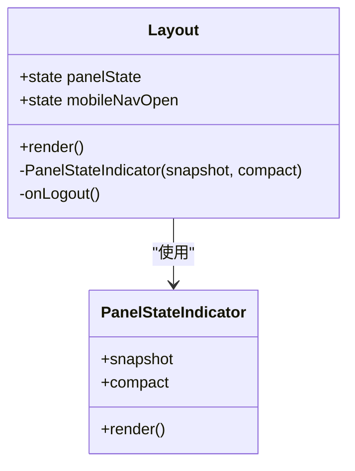
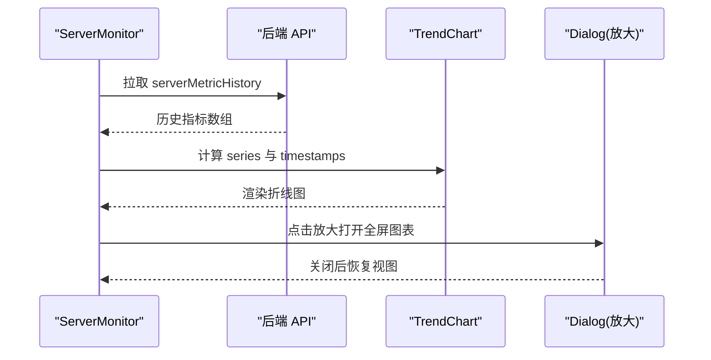
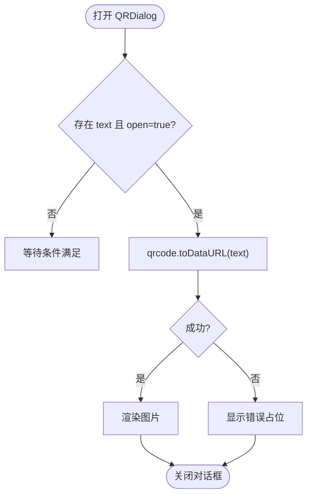
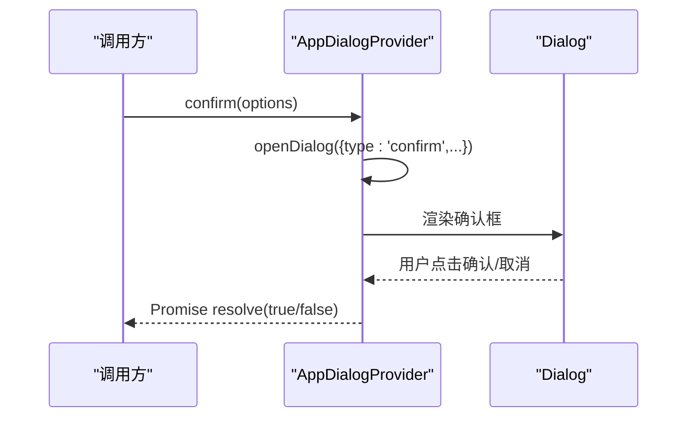
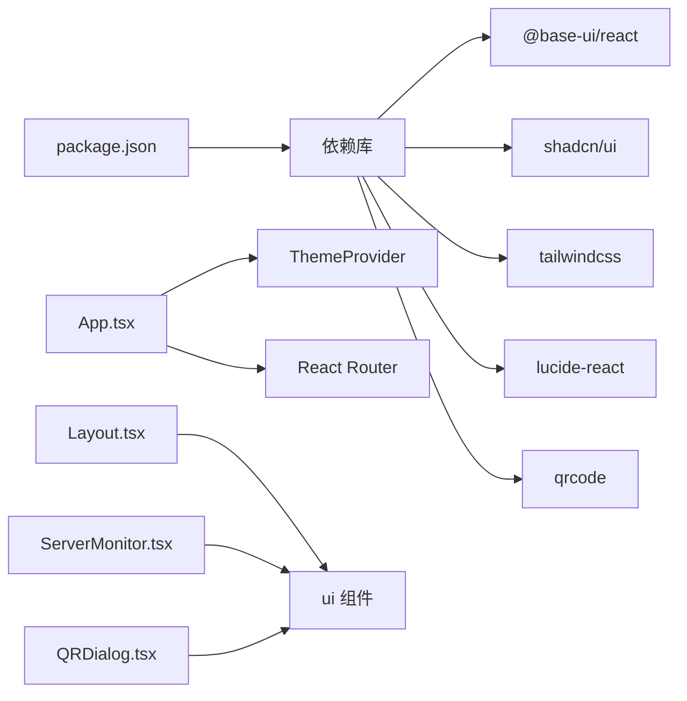

# UI 组件库

<cite>
**本文引用的文件**   
- [package.json](file://src/frontend/package.json)
- [components.json](file://src/frontend/components.json)
- [main.tsx](file://src/frontend/src/main.tsx)
- [App.tsx](file://src/frontend/src/App.tsx)
- [index.css](file://src/frontend/src/index.css)
- [utils.ts](file://src/frontend/src/lib/utils.ts)
- [theme.tsx](file://src/frontend/src/lib/theme.tsx)
- [theme-context.ts](file://src/frontend/src/lib/theme-context.ts)
- [button.tsx](file://src/frontend/src/components/ui/button.tsx)
- [card.tsx](file://src/frontend/src/components/ui/card.tsx)
- [dialog.tsx](file://src/frontend/src/components/ui/dialog.tsx)
- [table.tsx](file://src/frontend/src/components/ui/table.tsx)
- [badge.tsx](file://src/frontend/src/components/ui/badge.tsx)
- [Layout.tsx](file://src/frontend/src/components/Layout.tsx)
- [ServerMonitor.tsx](file://src/frontend/src/components/ServerMonitor.tsx)
- [QRDialog.tsx](file://src/frontend/src/components/QRDialog.tsx)
- [ThemeToggle.tsx](file://src/frontend/src/components/ThemeToggle.tsx)
- [AppDialogProvider.tsx](file://src/frontend/src/components/AppDialogProvider.tsx)
</cite>

## 目录
1. [简介](#简介)
2. [项目结构](#项目结构)
3. [核心组件](#核心组件)
4. [架构总览](#架构总览)
5. [详细组件分析](#详细组件分析)
6. [依赖关系分析](#依赖关系分析)
7. [性能考虑](#性能考虑)
8. [故障排查指南](#故障排查指南)
9. [结论](#结论)
10. [附录：API 参考与使用示例](#附录api-参考与使用示例)

## 简介
本技术文档面向 Lattix-codex 前端 UI 组件库，系统性阐述基于 shadcn/ui 的组件体系、主题系统、样式定制与响应式设计，并深入解析基础组件（Button、Card、Dialog、Table、Badge 等）的属性配置与使用方法。同时覆盖自定义业务组件（Layout、ServerMonitor、QRDialog 等）的实现思路、组合模式与复用策略，以及无障碍访问支持、开发规范、测试方法与性能优化建议，帮助开发者快速上手并高效扩展 UI 组件。

## 项目结构
前端采用 React + Vite + TypeScript 构建，UI 层基于 shadcn/ui 与 Tailwind CSS 4，通过 @base-ui/react 提供可访问性原语。入口文件负责挂载应用与全局 Provider，路由与主题、认证、时区等上下文在 App 中组织。组件按功能分层：ui 基础组件位于 components/ui，业务组件位于 components，通用工具与上下文位于 lib。

图表来源
- [main.tsx:1-15](file://src/frontend/src/main.tsx#L1-L15)
- [App.tsx:1-73](file://src/frontend/src/App.tsx#L1-L73)
- [index.css:1-266](file://src/frontend/src/index.css#L1-L266)

章节来源
- [package.json:1-48](file://src/frontend/package.json#L1-L48)
- [components.json:1-26](file://src/frontend/components.json#L1-L26)
- [main.tsx:1-15](file://src/frontend/src/main.tsx#L1-L15)
- [App.tsx:1-73](file://src/frontend/src/App.tsx#L1-L73)

## 核心组件
本节聚焦 shadcn/ui 基础组件的使用方式与属性配置要点，结合项目中的实现说明如何统一风格、变体与尺寸，以及如何通过 CSS 变量与 Tailwind 进行主题化与响应式适配。

- Button
  - 用途：按钮交互，支持多种变体与尺寸，内置焦点与禁用态样式。
  - 关键属性：variant（default、outline、secondary、ghost、destructive、link）、size（default、xs、sm、lg、icon、icon-xs、icon-sm、icon-lg）。
  - 设计要点：通过 class-variance-authority 管理变体；使用 cn 合并类名；遵循 focus-visible 与 aria-invalid 的可访问性规则。
  - 参考路径：[button.tsx:1-59](file://src/frontend/src/components/ui/button.tsx#L1-L59)

- Card
  - 用途：卡片容器，包含 Header、Title、Description、Action、Content、Footer 等语义化子块。
  - 关键属性：size（default、sm），通过 data-size 控制间距与排版。
  - 设计要点：使用 data-slot 标记语义区块；圆角、边框与阴影由 index.css 统一增强。
  - 参考路径：[card.tsx:1-104](file://src/frontend/src/components/ui/card.tsx#L1-L104)

- Dialog
  - 用途：模态对话框，含 Overlay、Portal、Header、Footer、Title、Description、Close 等。
  - 关键属性：showCloseButton（是否显示关闭按钮），配合 Portal 渲染到根节点。
  - 设计要点：动画与过渡由 tw-animate-css 驱动；无障碍方面提供 sr-only 文本与键盘操作支持。
  - 参考路径：[dialog.tsx:1-161](file://src/frontend/src/components/ui/dialog.tsx#L1-L161)

- Table
  - 用途：数据表格，包含 Container、Header、Body、Footer、Row、Head、Cell、Caption。
  - 关键属性：原生 table 语义，外层容器支持横向滚动。
  - 设计要点：行 hover 与选中态高亮；caption 用于描述表格内容。
  - 参考路径：[table.tsx:1-117](file://src/frontend/src/components/ui/table.tsx#L1-L117)

- Badge
  - 用途：标签/徽章，展示状态或简短信息。
  - 关键属性：variant（default、secondary、destructive、outline、ghost、link）。
  - 设计要点：通过 useRender 与 mergeProps 灵活渲染为 span 或其他元素；图标插槽支持 inline-start/end。
  - 参考路径：[badge.tsx:1-53](file://src/frontend/src/components/ui/badge.tsx#L1-L53)

章节来源
- [button.tsx:1-59](file://src/frontend/src/components/ui/button.tsx#L1-L59)
- [card.tsx:1-104](file://src/frontend/src/components/ui/card.tsx#L1-L104)
- [dialog.tsx:1-161](file://src/frontend/src/components/ui/dialog.tsx#L1-L161)
- [table.tsx:1-117](file://src/frontend/src/components/ui/table.tsx#L1-L117)
- [badge.tsx:1-53](file://src/frontend/src/components/ui/badge.tsx#L1-L53)

## 架构总览
整体架构以 React 组件树为核心，通过 Provider 注入主题、认证、时区、请求状态等上下文；路由将页面与布局分离，布局组件承载侧边栏、顶部导航与移动端抽屉；业务组件组合基础 UI 组件完成复杂场景。

图表来源
- [main.tsx:1-15](file://src/frontend/src/main.tsx#L1-L15)
- [App.tsx:1-73](file://src/frontend/src/App.tsx#L1-L73)
- [Layout.tsx:1-205](file://src/frontend/src/components/Layout.tsx#L1-L205)

## 详细组件分析

### 主题系统与样式定制
- 主题上下文
  - ThemeProvider 维护 theme 状态，切换时在 documentElement 上添加/移除 dark 类，并设置 colorScheme；持久化至 localStorage。
  - useTheme 提供 theme 与 toggleTheme，供组件消费。
  - 参考路径：[theme.tsx:1-38](file://src/frontend/src/lib/theme.tsx#L1-L38)、[theme-context.ts:1-17](file://src/frontend/src/lib/theme-context.ts#L1-L17)

- 样式与变量
  - index.css 定义 Tailwind 主题变量、颜色、字体、圆角等，并通过 @custom-variant dark 启用深色模式。
  - 组件级样式通过 data-slot 选择器统一增强边框、阴影与交互反馈。
  - 参考路径：[index.css:1-266](file://src/frontend/src/index.css#L1-L266)

- 工具函数
  - cn 使用 clsx 与 tailwind-merge 合并类名，避免冲突并提升可读性。
  - 参考路径：[utils.ts:1-7](file://src/frontend/src/lib/utils.ts#L1-L7)

- 主题切换按钮
  - ThemeToggle 调用 useTheme 切换主题，并提供无障碍标签。
  - 参考路径：[ThemeToggle.tsx:1-30](file://src/frontend/src/components/ThemeToggle.tsx#L1-L30)

图表来源
- [theme.tsx:1-38](file://src/frontend/src/lib/theme.tsx#L1-L38)
- [index.css:1-266](file://src/frontend/src/index.css#L1-L266)

章节来源
- [theme.tsx:1-38](file://src/frontend/src/lib/theme.tsx#L1-L38)
- [theme-context.ts:1-17](file://src/frontend/src/lib/theme-context.ts#L1-L17)
- [index.css:1-266](file://src/frontend/src/index.css#L1-L266)
- [utils.ts:1-7](file://src/frontend/src/lib/utils.ts#L1-L7)
- [ThemeToggle.tsx:1-30](file://src/frontend/src/components/ThemeToggle.tsx#L1-L30)

### 布局组件 Layout
- 职责
  - 提供桌面端侧边栏与移动端抽屉导航；集成面板生命周期状态指示、主题切换与用户登出。
  - 使用 Sheet（抽屉）与 NavLink 实现响应式导航；顶部进度条反映前台请求状态。
- 关键点
  - 面板状态轮询：定时调用 api.panelState() 更新状态。
  - 无障碍：role="status"、aria-label 与键盘交互。
  - 响应式：md 断点切换侧边栏与抽屉。
- 参考路径：[Layout.tsx:1-205](file://src/frontend/src/components/Layout.tsx#L1-L205)

图表来源
- [Layout.tsx:1-205](file://src/frontend/src/components/Layout.tsx#L1-L205)

章节来源
- [Layout.tsx:1-205](file://src/frontend/src/components/Layout.tsx#L1-L205)

### 监控组件 ServerMonitor
- 职责
  - 聚合服务器列表与遥测指标，展示 CPU/内存/磁盘/网络/延迟趋势与流量额度使用情况。
  - 提供编辑、修复、升级、凭证轮换、续费确认、删除等操作入口。
- 关键点
  - 指标可视化：TrendChart 使用 SVG 绘制多系列折线图，支持放大与键盘导航。
  - 健康度：根据阈值判定 normal/warning/critical，动态改变进度条颜色。
  - 无障碍：progressbar、aria-label、sr-only 标题与描述。
- 参考路径：[ServerMonitor.tsx:1-950](file://src/frontend/src/components/ServerMonitor.tsx#L1-L950)

图表来源
- [ServerMonitor.tsx:1-950](file://src/frontend/src/components/ServerMonitor.tsx#L1-L950)
- [dialog.tsx:1-161](file://src/frontend/src/components/ui/dialog.tsx#L1-L161)

章节来源
- [ServerMonitor.tsx:1-950](file://src/frontend/src/components/ServerMonitor.tsx#L1-L950)

### 二维码对话框 QRDialog
- 职责
  - 生成订阅链接的二维码，便于移动端扫码导入。
- 关键点
  - 使用 qrcode 库生成 dataURL；异步处理失败情况。
  - 通过 Dialog 包裹，提供标题与描述。
- 参考路径：[QRDialog.tsx:1-43](file://src/frontend/src/components/QRDialog.tsx#L1-L43)

图表来源
- [QRDialog.tsx:1-43](file://src/frontend/src/components/QRDialog.tsx#L1-L43)

章节来源
- [QRDialog.tsx:1-43](file://src/frontend/src/components/QRDialog.tsx#L1-L43)

### 应用级对话框 AppDialogProvider
- 职责
  - 提供全局 confirm/notify 能力，集中管理对话框状态与 Promise 结果。
- 关键点
  - 通过 Context 暴露 confirm/notify；内部使用 Dialog 渲染。
  - 支持 destructive 确认按钮与自定义文案。
- 参考路径：[AppDialogProvider.tsx:1-90](file://src/frontend/src/components/AppDialogProvider.tsx#L1-L90)

图表来源
- [AppDialogProvider.tsx:1-90](file://src/frontend/src/components/AppDialogProvider.tsx#L1-L90)
- [dialog.tsx:1-161](file://src/frontend/src/components/ui/dialog.tsx#L1-L161)

章节来源
- [AppDialogProvider.tsx:1-90](file://src/frontend/src/components/AppDialogProvider.tsx#L1-L90)

## 依赖关系分析
- 构建与脚本
  - package.json 定义了 dev/build/lint/preview 等脚本，依赖 React、Vite、Tailwind、shadcn、@base-ui/react、lucide-react、qrcode 等。
- 组件依赖
  - 业务组件依赖 ui 基础组件与 lib 工具；主题通过 ThemeProvider 注入；路由与认证在 App 层组织。
- 外部库
  - lucide-react 提供图标；qrcode 生成二维码；tw-animate-css 提供动画；flag-icons 提供国旗样式。

图表来源
- [package.json:1-48](file://src/frontend/package.json#L1-L48)
- [App.tsx:1-73](file://src/frontend/src/App.tsx#L1-L73)
- [Layout.tsx:1-205](file://src/frontend/src/components/Layout.tsx#L1-L205)
- [ServerMonitor.tsx:1-950](file://src/frontend/src/components/ServerMonitor.tsx#L1-L950)
- [QRDialog.tsx:1-43](file://src/frontend/src/components/QRDialog.tsx#L1-L43)

章节来源
- [package.json:1-48](file://src/frontend/package.json#L1-L48)

## 性能考虑
- 渲染与状态
  - 使用 useMemo/useCallback 缓存计算与回调，减少重渲染（如 TrendChart 的数据转换）。
  - 长列表与大数据集建议使用虚拟滚动或分页加载（当前未实现，可扩展）。
- 动画与过渡
  - 合理使用 tw-animate-css，避免过度动画影响性能；尊重 prefers-reduced-motion。
- 资源加载
  - 按需引入图标与库；对 qrcode 生成进行防抖/节流（如需频繁生成）。
- 主题切换
  - 切换时仅修改类名与 colorScheme，避免全量重绘。

## 故障排查指南
- 主题不生效
  - 检查 documentElement 是否包含 dark 类；确认 index.css 已正确引入；查看 ThemeProvider 是否正确包裹应用。
  - 参考路径：[theme.tsx:1-38](file://src/frontend/src/lib/theme.tsx#L1-L38)、[index.css:1-266](file://src/frontend/src/index.css#L1-L266)
- 对话框无法关闭
  - 检查 showCloseButton 与 onOpenChange 逻辑；确保 Dialog 的 close 行为未被阻止。
  - 参考路径：[dialog.tsx:1-161](file://src/frontend/src/components/ui/dialog.tsx#L1-L161)
- 二维码未显示
  - 检查 qrcode 生成是否成功；确认 open/text 参数变化触发 useEffect。
  - 参考路径：[QRDialog.tsx:1-43](file://src/frontend/src/components/QRDialog.tsx#L1-L43)
- 表格样式异常
  - 检查 data-slot 选择器是否被覆盖；确认外层容器 overflow-x 设置。
  - 参考路径：[table.tsx:1-117](file://src/frontend/src/components/ui/table.tsx#L1-L117)、[index.css:1-266](file://src/frontend/src/index.css#L1-L266)

章节来源
- [theme.tsx:1-38](file://src/frontend/src/lib/theme.tsx#L1-L38)
- [index.css:1-266](file://src/frontend/src/index.css#L1-L266)
- [dialog.tsx:1-161](file://src/frontend/src/components/ui/dialog.tsx#L1-L161)
- [QRDialog.tsx:1-43](file://src/frontend/src/components/QRDialog.tsx#L1-L43)
- [table.tsx:1-117](file://src/frontend/src/components/ui/table.tsx#L1-L117)

## 结论
本组件库以 shadcn/ui 为基础，结合 Tailwind 与 @base-ui/react，构建了统一、可访问、易扩展的前端 UI 体系。通过主题系统、CSS 变量与 data-slot 约定，实现了高度一致的视觉风格与响应式体验。业务组件（Layout、ServerMonitor、QRDialog）展示了良好的组合模式与复用策略。建议在后续迭代中继续完善无障碍细节、性能优化与测试覆盖，以提升用户体验与可维护性。

## 附录：API 参考与使用示例
- Button
  - 属性：variant、size、className、disabled、onClick 等
  - 使用示例：参见 [button.tsx:1-59](file://src/frontend/src/components/ui/button.tsx#L1-L59)
- Card
  - 属性：size、className；子组件：CardHeader、CardTitle、CardDescription、CardAction、CardContent、CardFooter
  - 使用示例：参见 [card.tsx:1-104](file://src/frontend/src/components/ui/card.tsx#L1-L104)
- Dialog
  - 属性：open、onOpenChange、showCloseButton；子组件：DialogContent、DialogHeader、DialogFooter、DialogTitle、DialogDescription、DialogTrigger、DialogClose
  - 使用示例：参见 [dialog.tsx:1-161](file://src/frontend/src/components/ui/dialog.tsx#L1-L161)
- Table
  - 属性：className；子组件：TableHeader、TableBody、TableFooter、TableRow、TableHead、TableCell、TableCaption
  - 使用示例：参见 [table.tsx:1-117](file://src/frontend/src/components/ui/table.tsx#L1-L117)
- Badge
  - 属性：variant、className、render
  - 使用示例：参见 [badge.tsx:1-53](file://src/frontend/src/components/ui/badge.tsx#L1-L53)
- ThemeProvider
  - 作用：提供 theme/toggleTheme 上下文
  - 使用示例：参见 [theme.tsx:1-38](file://src/frontend/src/lib/theme.tsx#L1-L38)
- AppDialogProvider
  - 作用：提供 confirm/notify 全局对话框能力
  - 使用示例：参见 [AppDialogProvider.tsx:1-90](file://src/frontend/src/components/AppDialogProvider.tsx#L1-L90)

章节来源
- [button.tsx:1-59](file://src/frontend/src/components/ui/button.tsx#L1-L59)
- [card.tsx:1-104](file://src/frontend/src/components/ui/card.tsx#L1-L104)
- [dialog.tsx:1-161](file://src/frontend/src/components/ui/dialog.tsx#L1-L161)
- [table.tsx:1-117](file://src/frontend/src/components/ui/table.tsx#L1-L117)
- [badge.tsx:1-53](file://src/frontend/src/components/ui/badge.tsx#L1-L53)
- [theme.tsx:1-38](file://src/frontend/src/lib/theme.tsx#L1-L38)
- [AppDialogProvider.tsx:1-90](file://src/frontend/src/components/AppDialogProvider.tsx#L1-L90)