# 业务组件

<cite>
**本文引用的文件**   
- [Layout.tsx](file://src/frontend/src/components/Layout.tsx)
- [ServerMonitor.tsx](file://src/frontend/src/components/ServerMonitor.tsx)
- [QRDialog.tsx](file://src/frontend/src/components/QRDialog.tsx)
- [CopyButton.tsx](file://src/frontend/src/components/CopyButton.tsx)
- [CountryCombobox.tsx](file://src/frontend/src/components/CountryCombobox.tsx)
- [GlobeTopology.tsx](file://src/frontend/src/components/GlobeTopology.tsx)
- [RealityDestPicker.tsx](file://src/frontend/src/components/RealityDestPicker.tsx)
- [TagInput.tsx](file://src/frontend/src/components/TagInput.tsx)
- [LowPolyEarth.tsx](file://src/frontend/src/components/LowPolyEarth.tsx)
- [types.ts](file://src/frontend/src/lib/types.ts)
- [geography.ts](file://src/frontend/src/lib/geography.ts)
- [reality.ts](file://src/frontend/src/lib/reality.ts)
- [server-state.ts](file://src/frontend/src/lib/server-state.ts)
</cite>

## 目录
1. [简介](#简介)
2. [项目结构](#项目结构)
3. [核心组件](#核心组件)
4. [架构总览](#架构总览)
5. [详细组件分析](#详细组件分析)
6. [依赖关系分析](#依赖关系分析)
7. [性能考量](#性能考量)
8. [故障排查指南](#故障排查指南)
9. [结论](#结论)
10. [附录：使用示例与集成指南](#附录使用示例与集成指南)

## 简介
本技术文档面向 Lattix-codex 前端“面向代理服务器管理”的业务组件，系统性解析以下组件的实现、数据绑定、状态管理与事件处理机制，并说明与后端 API 的集成方式、实时数据更新策略与错误处理方案。同时提供配置项、扩展点与性能优化建议，以及完整的使用示例和集成指南，帮助读者快速理解并在实际项目中高效复用。

涉及的组件包括：
- Layout 布局组件
- ServerMonitor 服务器监控组件
- QRDialog 二维码对话框
- CopyButton 复制按钮
- CountryCombobox 国家选择器
- GlobeTopology 地球拓扑图
- RealityDestPicker 目的地选择器
- TagInput 标签输入框

## 项目结构
前端采用 React + TypeScript 组织，业务组件位于 components 目录，类型定义与工具库位于 lib 目录。关键文件职责如下：
- components: 各业务组件与 UI 基础组件
- lib: 类型定义（types.ts）、地理信息（geography.ts）、Reality 配置常量（reality.ts）、服务器状态工具（server-state.ts）等
- pages: 页面级路由与组合（不在本文重点范围）

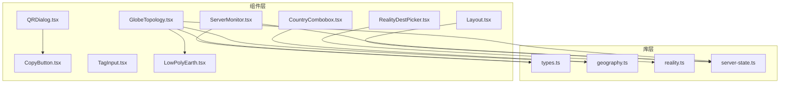

图表来源
- [Layout.tsx:1-231](file://src/frontend/src/components/Layout.tsx#L1-L231)
- [ServerMonitor.tsx:1-800](file://src/frontend/src/components/ServerMonitor.tsx#L1-L800)
- [QRDialog.tsx:1-54](file://src/frontend/src/components/QRDialog.tsx#L1-L54)
- [CopyButton.tsx:1-34](file://src/frontend/src/components/CopyButton.tsx#L1-L34)
- [CountryCombobox.tsx:1-95](file://src/frontend/src/components/CountryCombobox.tsx#L1-L95)
- [GlobeTopology.tsx:1-201](file://src/frontend/src/components/GlobeTopology.tsx#L1-L201)
- [RealityDestPicker.tsx:1-82](file://src/frontend/src/components/RealityDestPicker.tsx#L1-L82)
- [TagInput.tsx:1-96](file://src/frontend/src/components/TagInput.tsx#L1-L96)
- [LowPolyEarth.tsx:1-200](file://src/frontend/src/components/LowPolyEarth.tsx#L1-L200)
- [types.ts:1-200](file://src/frontend/src/lib/types.ts#L1-L200)
- [geography.ts:1-119](file://src/frontend/src/lib/geography.ts#L1-L119)
- [reality.ts:1-20](file://src/frontend/src/lib/reality.ts#L1-L20)
- [server-state.ts:1-23](file://src/frontend/src/lib/server-state.ts#L1-L23)

章节来源
- [Layout.tsx:1-231](file://src/frontend/src/components/Layout.tsx#L1-L231)
- [ServerMonitor.tsx:1-800](file://src/frontend/src/components/ServerMonitor.tsx#L1-L800)
- [QRDialog.tsx:1-54](file://src/frontend/src/components/QRDialog.tsx#L1-L54)
- [CopyButton.tsx:1-34](file://src/frontend/src/components/CopyButton.tsx#L1-L34)
- [CountryCombobox.tsx:1-95](file://src/frontend/src/components/CountryCombobox.tsx#L1-L95)
- [GlobeTopology.tsx:1-201](file://src/frontend/src/components/GlobeTopology.tsx#L1-L201)
- [RealityDestPicker.tsx:1-82](file://src/frontend/src/components/RealityDestPicker.tsx#L1-L82)
- [TagInput.tsx:1-96](file://src/frontend/src/components/TagInput.tsx#L1-L96)
- [LowPolyEarth.tsx:1-200](file://src/frontend/src/components/LowPolyEarth.tsx#L1-L200)
- [types.ts:1-200](file://src/frontend/src/lib/types.ts#L1-L200)
- [geography.ts:1-119](file://src/frontend/src/lib/geography.ts#L1-L119)
- [reality.ts:1-20](file://src/frontend/src/lib/reality.ts#L1-L20)
- [server-state.ts:1-23](file://src/frontend/src/lib/server-state.ts#L1-L23)

## 核心组件
本节对每个业务组件进行概览性说明，涵盖功能特性、数据绑定、状态管理、事件处理以及与后端 API 的集成方式。

- Layout 布局组件
  - 功能：应用级侧边栏导航、移动端抽屉菜单、主题切换、面板生命周期状态指示、登出流程与错误提示。
  - 数据绑定：通过 useAuth 获取用户名与登出方法；useRequestState 获取前台请求计数；本地 state 维护面板状态快照与登出状态。
  - 事件处理：导航点击、登出调用、错误捕获与展示。
  - 后端集成：定时轮询面板状态接口，失败时置空状态。
  - 配置与扩展：导航项数组可配置；状态映射可扩展。

- ServerMonitor 服务器监控组件
  - 功能：服务器卡片列表、指标展示（CPU/内存/磁盘/网络/延迟）、流量配额可视化、趋势图、详情抽屉（历史采样）。
  - 数据绑定：props 接收 servers、samples、loading、timezone 与一系列回调；内部计算百分比与健康度。
  - 事件处理：编辑、修复、升级、刷新凭证、续费确认、删除等操作通过回调上抛。
  - 后端集成：详情抽屉内拉取 serverMetricHistory，定时刷新；格式化时间、字节速率等。
  - 配置与扩展：阈值可调（warning/critical），单位与显示格式集中处理。

- QRDialog 二维码对话框
  - 功能：将文本生成二维码图片，用于移动端订阅导入。
  - 数据绑定：open 控制显隐，text 为待编码内容。
  - 事件处理：异步生成 dataURL，失败回退为空态。
  - 后端集成：无直接后端调用。

- CopyButton 复制按钮
  - 功能：一键复制文本到剪贴板，反馈“已复制”。
  - 数据绑定：text 为复制内容，size 控制尺寸。
  - 事件处理：navigator.clipboard.writeText 调用，异常忽略。
  - 后端集成：无。

- CountryCombobox 国家选择器
  - 功能：支持按国家名、英文名或代码过滤的下拉选择，带国旗图标。
  - 数据绑定：value 为选中 code，options 为选项集合，onValueChange 回调。
  - 事件处理：输入过滤、自动高亮、选择变更。
  - 后端集成：依赖 geography 模块加载国家与城市数据。

- GlobeTopology 地球拓扑图
  - 功能：基于 LowPolyEarth 渲染节点与链路，展示在线/离线状态与带宽速率。
  - 数据绑定：servers 与 chains 作为输入，内部定位坐标、构建节点与链路。
  - 事件处理：异步加载地理坐标，失败回退到随机位置。
  - 后端集成：依赖 isServerOnline 判断在线状态。

- RealityDestPicker 目的地选择器
  - 功能：内置或自定义 Reality dest/SNI，联动设置默认端口与 SNI。
  - 数据绑定：preset、dest、serverNames 及对应 onChange。
  - 事件处理：选择预设时自动填充 dest 与 serverNames。
  - 后端集成：无，仅前端配置。

- TagInput 标签输入框
  - 功能：支持逗号分隔批量添加、回车/Tab 提交、Backspace 删除末项、粘贴合并。
  - 数据绑定：value 为字符串数组，onChange 回调，maxTags 限制数量。
  - 事件处理：键盘与粘贴事件统一处理。
  - 后端集成：无。

章节来源
- [Layout.tsx:1-231](file://src/frontend/src/components/Layout.tsx#L1-L231)
- [ServerMonitor.tsx:1-800](file://src/frontend/src/components/ServerMonitor.tsx#L1-L800)
- [QRDialog.tsx:1-54](file://src/frontend/src/components/QRDialog.tsx#L1-L54)
- [CopyButton.tsx:1-34](file://src/frontend/src/components/CopyButton.tsx#L1-L34)
- [CountryCombobox.tsx:1-95](file://src/frontend/src/components/CountryCombobox.tsx#L1-L95)
- [GlobeTopology.tsx:1-201](file://src/frontend/src/components/GlobeTopology.tsx#L1-L201)
- [RealityDestPicker.tsx:1-82](file://src/frontend/src/components/RealityDestPicker.tsx#L1-L82)
- [TagInput.tsx:1-96](file://src/frontend/src/components/TagInput.tsx#L1-L96)

## 架构总览
整体架构遵循“组件层 + 库层”的分层设计：
- 组件层：业务组件负责 UI 交互与状态展示，通过 props 与回调与上层页面通信。
- 库层：类型定义、地理数据、Reality 配置、服务器状态工具等被多个组件复用。
- 外部依赖：qrcode、@base-ui/react/combobox、react-globe.gl、three.js 等。

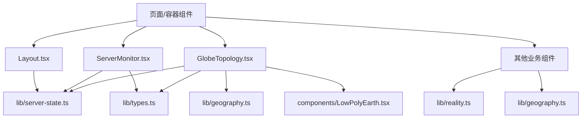

图表来源
- [Layout.tsx:1-231](file://src/frontend/src/components/Layout.tsx#L1-L231)
- [ServerMonitor.tsx:1-800](file://src/frontend/src/components/ServerMonitor.tsx#L1-L800)
- [GlobeTopology.tsx:1-201](file://src/frontend/src/components/GlobeTopology.tsx#L1-L201)
- [LowPolyEarth.tsx:1-200](file://src/frontend/src/components/LowPolyEarth.tsx#L1-L200)
- [types.ts:1-200](file://src/frontend/src/lib/types.ts#L1-L200)
- [geography.ts:1-119](file://src/frontend/src/lib/geography.ts#L1-L119)
- [reality.ts:1-20](file://src/frontend/src/lib/reality.ts#L1-L20)
- [server-state.ts:1-23](file://src/frontend/src/lib/server-state.ts#L1-L23)

## 详细组件分析

### Layout 布局组件
- 功能特性
  - 响应式侧边栏与移动端抽屉导航
  - 面板生命周期状态指示（启动中/正常/更新中/故障）
  - 主题切换与用户头像展示
  - 登出流程与错误提示
- 数据绑定与状态管理
  - 使用 useAuth 获取用户名与 logout
  - 使用 useRequestState 获取前台请求计数，顶部进度条
  - 本地 state 维护 panelState、loggingOut、logoutError
- 事件处理机制
  - 导航点击切换路由
  - 登出调用 logout，成功跳转登录页，失败显示错误
- 后端 API 集成
  - 定时轮询 api.panelState()，每 5 秒刷新，失败置空状态
- 配置选项与扩展点
  - navItems 数组可配置路由、图标与激活前缀
  - panelStatePresentation 映射状态到展示文案与颜色
- 性能优化建议
  - 清理定时器避免内存泄漏
  - 错误处理不阻塞渲染

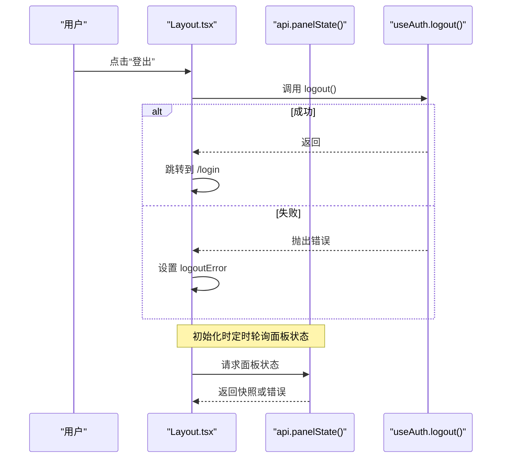

图表来源
- [Layout.tsx:1-231](file://src/frontend/src/components/Layout.tsx#L1-L231)

章节来源
- [Layout.tsx:1-231](file://src/frontend/src/components/Layout.tsx#L1-L231)

### ServerMonitor 服务器监控组件
- 功能特性
  - 服务器卡片：基本信息、连接状态、地区、公网地址、计费状态
  - 指标块：CPU、内存、磁盘、网络速率、延迟趋势
  - 流量额度：周期用量与剩余比例可视化
  - 详情抽屉：最近 24 小时采样历史，多系列趋势图
- 数据绑定与状态管理
  - props：servers、samples、loading、timezone、操作回调
  - 内部计算：percent、health、formatUptime、formatTrafficBytes
  - 详情抽屉：history、loading 状态，定时刷新
- 事件处理机制
  - 卡片点击打开详情
  - 下拉菜单触发编辑、修复、升级、刷新凭证、续费、删除等操作
- 后端 API 集成
  - 详情抽屉调用 api.serverMetricHistory(server.id)，每 60 秒刷新
  - 使用 formatDateTime、humanizeBytes、formatByteRate 等工具格式化
- 配置选项与扩展点
  - 健康阈值 warning/critical 可调
  - 趋势图 series 颜色与单位可定制
- 性能优化建议
  - 使用 useMemo 缓存计算结果
  - 限制采样长度与渲染粒度

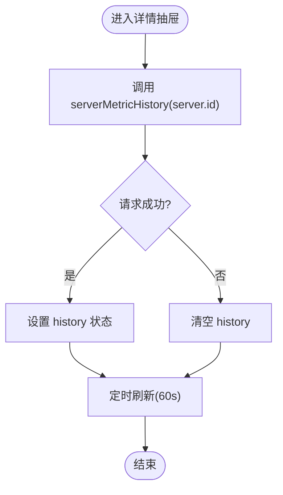

图表来源
- [ServerMonitor.tsx:1-800](file://src/frontend/src/components/ServerMonitor.tsx#L1-L800)

章节来源
- [ServerMonitor.tsx:1-800](file://src/frontend/src/components/ServerMonitor.tsx#L1-L800)

### QRDialog 二维码对话框
- 功能特性：将订阅链接生成二维码，移动端扫码导入
- 数据绑定：open 控制显隐，text 为待编码文本
- 事件处理：异步生成 dataURL，失败回退空态
- 后端集成：无
- 配置选项：margin、width 等参数由 qrcode 库提供

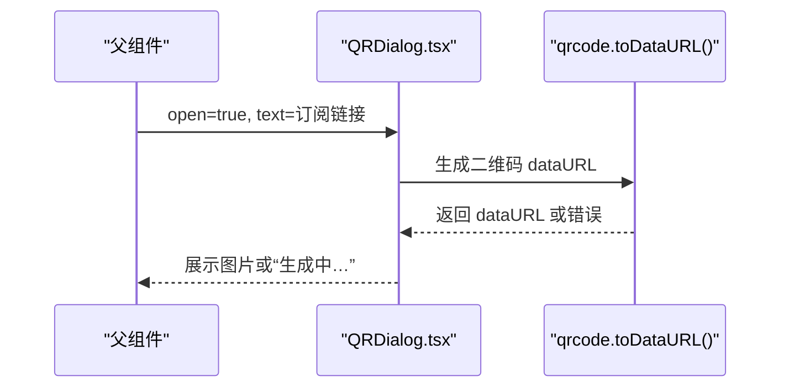

图表来源
- [QRDialog.tsx:1-54](file://src/frontend/src/components/QRDialog.tsx#L1-L54)

章节来源
- [QRDialog.tsx:1-54](file://src/frontend/src/components/QRDialog.tsx#L1-L54)

### CopyButton 复制按钮
- 功能特性：一键复制文本，反馈“已复制”
- 数据绑定：text、size、className
- 事件处理：navigator.clipboard.writeText，异常忽略
- 后端集成：无
- 配置选项：尺寸与样式类

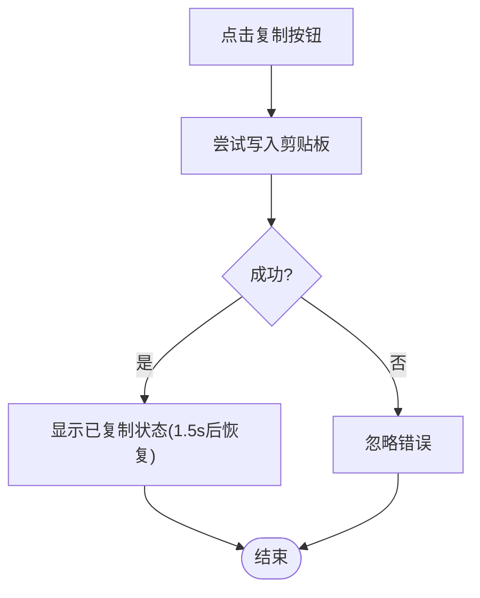

图表来源
- [CopyButton.tsx:1-34](file://src/frontend/src/components/CopyButton.tsx#L1-L34)

章节来源
- [CopyButton.tsx:1-34](file://src/frontend/src/components/CopyButton.tsx#L1-L34)

### CountryCombobox 国家选择器
- 功能特性：支持按国家名、英文名或代码过滤，显示国旗与名称
- 数据绑定：id、value(code)、options(CountryOption[])、onValueChange
- 事件处理：输入过滤、自动高亮、选择变更
- 后端集成：依赖 geography.ts 加载国家与城市数据
- 配置选项：filter 逻辑、itemToStringLabel/Value、isItemEqualToValue

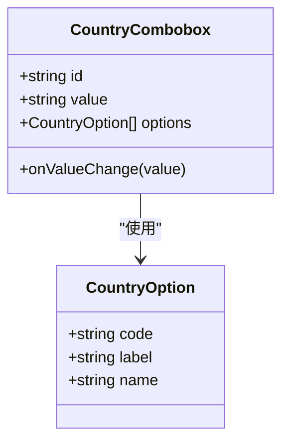

图表来源
- [CountryCombobox.tsx:1-95](file://src/frontend/src/components/CountryCombobox.tsx#L1-L95)
- [geography.ts:1-119](file://src/frontend/src/lib/geography.ts#L1-L119)

章节来源
- [CountryCombobox.tsx:1-95](file://src/frontend/src/components/CountryCombobox.tsx#L1-L95)
- [geography.ts:1-119](file://src/frontend/src/lib/geography.ts#L1-L119)

### GlobeTopology 地球拓扑图
- 功能特性：渲染节点与链路，展示在线/离线状态与带宽速率，统计未定位节点数
- 数据绑定：servers、chains
- 事件处理：异步定位坐标，失败回退到随机位置；构建节点与链路
- 后端集成：依赖 isServerOnline 判断在线状态
- 配置选项：节点状态映射、链路状态映射、颜色主题

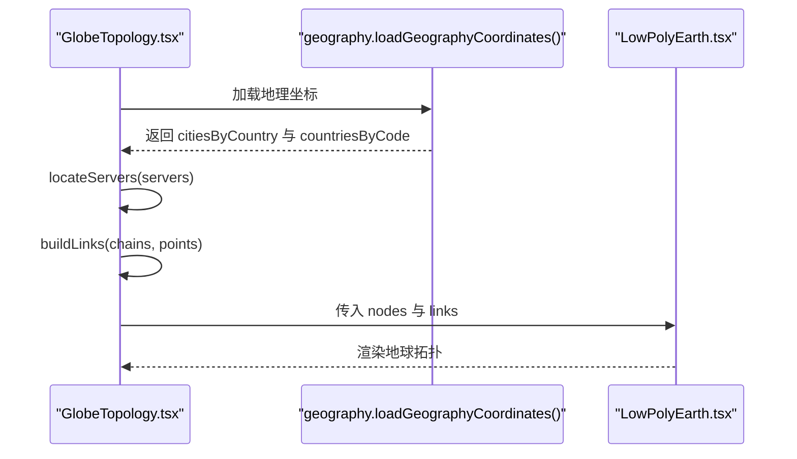

图表来源
- [GlobeTopology.tsx:1-201](file://src/frontend/src/components/GlobeTopology.tsx#L1-L201)
- [LowPolyEarth.tsx:1-200](file://src/frontend/src/components/LowPolyEarth.tsx#L1-L200)
- [geography.ts:1-119](file://src/frontend/src/lib/geography.ts#L1-L119)

章节来源
- [GlobeTopology.tsx:1-201](file://src/frontend/src/components/GlobeTopology.tsx#L1-L201)
- [LowPolyEarth.tsx:1-200](file://src/frontend/src/components/LowPolyEarth.tsx#L1-L200)
- [geography.ts:1-119](file://src/frontend/src/lib/geography.ts#L1-L119)

### RealityDestPicker 目的地选择器
- 功能特性：内置或自定义 Reality dest/SNI，选择预设时自动填充 dest 与 serverNames
- 数据绑定：idPrefix、preset、dest、serverNames 与对应 onChange
- 事件处理：selectPreset 联动更新
- 后端集成：无
- 配置选项：REALITY_DEST_OPTIONS 与 CUSTOM_REALITY_DEST

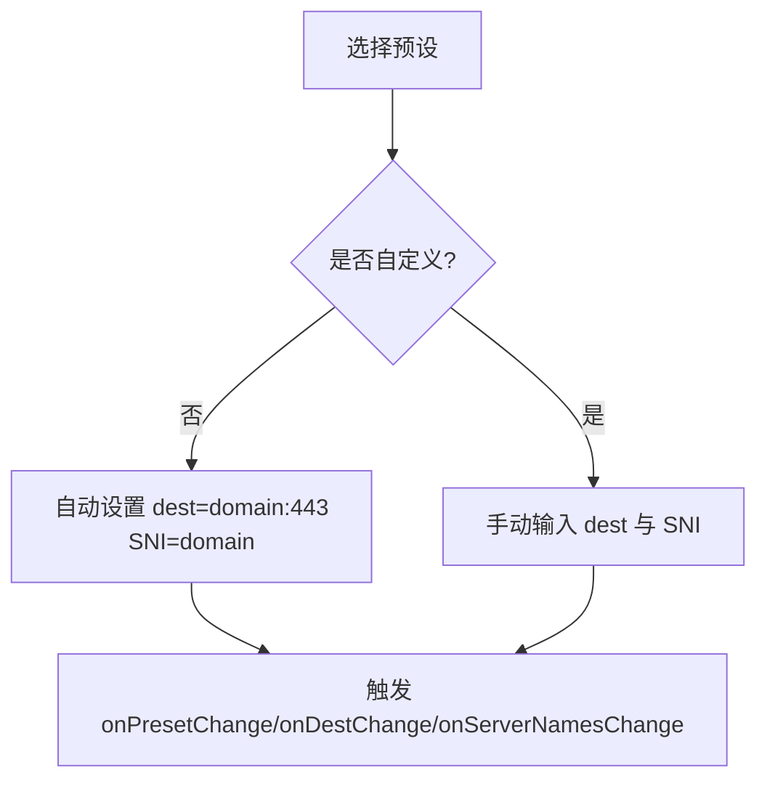

图表来源
- [RealityDestPicker.tsx:1-82](file://src/frontend/src/components/RealityDestPicker.tsx#L1-L82)
- [reality.ts:1-20](file://src/frontend/src/lib/reality.ts#L1-L20)

章节来源
- [RealityDestPicker.tsx:1-82](file://src/frontend/src/components/RealityDestPicker.tsx#L1-L82)
- [reality.ts:1-20](file://src/frontend/src/lib/reality.ts#L1-L20)

### TagInput 标签输入框
- 功能特性：支持逗号分隔批量添加、回车/Tab 提交、Backspace 删除末项、粘贴合并
- 数据绑定：value(string[])、onChange、maxTags、placeholder
- 事件处理：键盘与粘贴事件统一处理，限制最大标签数
- 后端集成：无
- 配置选项：maxTags、placeholder

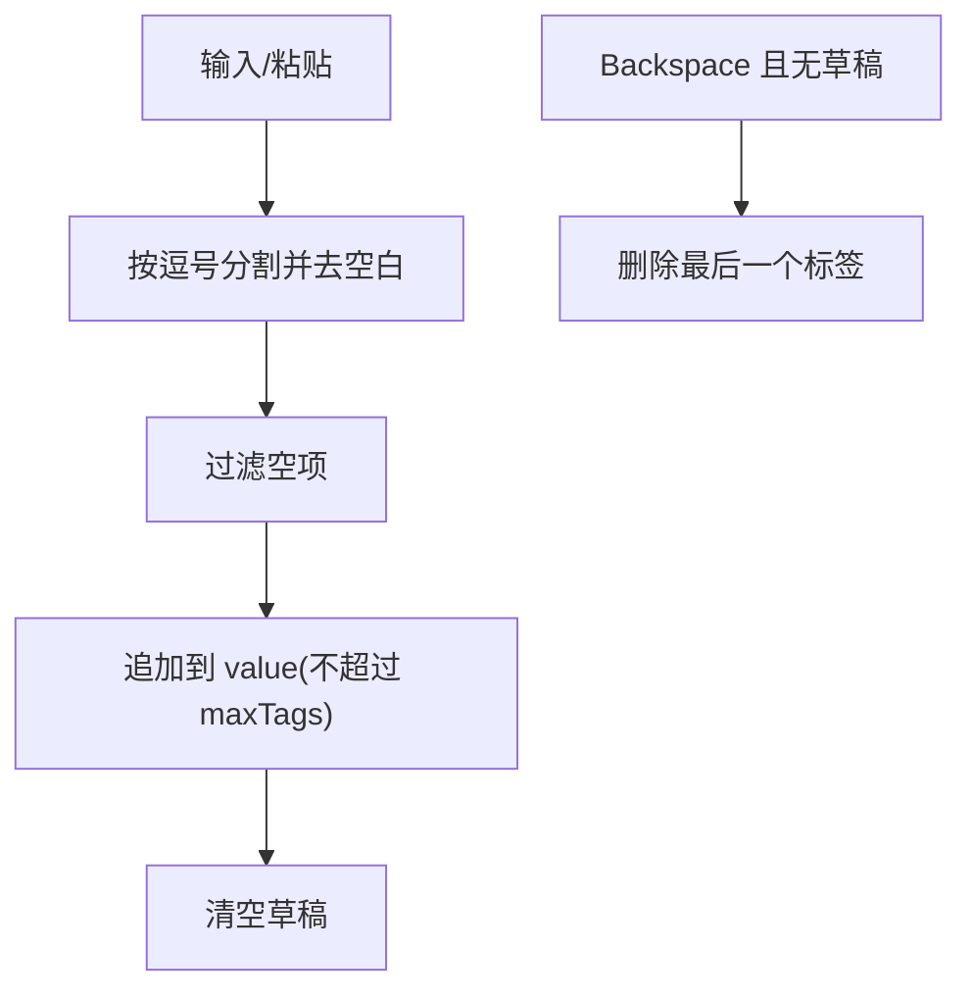

图表来源
- [TagInput.tsx:1-96](file://src/frontend/src/components/TagInput.tsx#L1-L96)

章节来源
- [TagInput.tsx:1-96](file://src/frontend/src/components/TagInput.tsx#L1-L96)

## 依赖关系分析
- 组件间耦合
  - GlobeTopology 依赖 LowPolyEarth 进行 3D 渲染
  - ServerMonitor 依赖 types.ts 中的 Server、ServerMetrics、ServerMetricSeries 等类型
  - CountryCombobox 依赖 geography.ts 的国家与城市数据
  - RealityDestPicker 依赖 reality.ts 的预设选项
- 外部依赖
  - qrcode：二维码生成
  - @base-ui/react/combobox：无障碍友好的组合框
  - react-globe.gl、three.js：3D 地球渲染
- 潜在循环依赖
  - 当前未发现循环引用，组件通过 props 与回调解耦

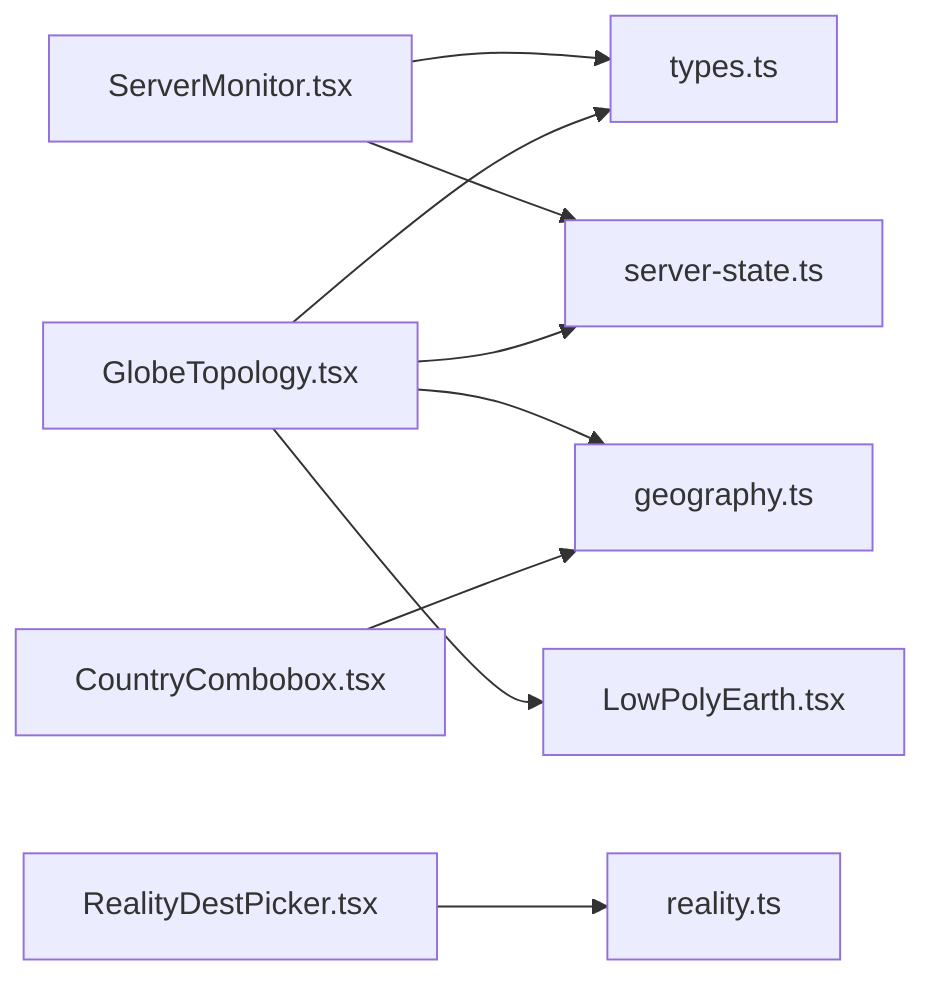

图表来源
- [ServerMonitor.tsx:1-800](file://src/frontend/src/components/ServerMonitor.tsx#L1-L800)
- [GlobeTopology.tsx:1-201](file://src/frontend/src/components/GlobeTopology.tsx#L1-L201)
- [CountryCombobox.tsx:1-95](file://src/frontend/src/components/CountryCombobox.tsx#L1-L95)
- [RealityDestPicker.tsx:1-82](file://src/frontend/src/components/RealityDestPicker.tsx#L1-L82)
- [types.ts:1-200](file://src/frontend/src/lib/types.ts#L1-L200)
- [geography.ts:1-119](file://src/frontend/src/lib/geography.ts#L1-L119)
- [reality.ts:1-20](file://src/frontend/src/lib/reality.ts#L1-L20)
- [server-state.ts:1-23](file://src/frontend/src/lib/server-state.ts#L1-L23)
- [LowPolyEarth.tsx:1-200](file://src/frontend/src/components/LowPolyEarth.tsx#L1-L200)

章节来源
- [ServerMonitor.tsx:1-800](file://src/frontend/src/components/ServerMonitor.tsx#L1-L800)
- [GlobeTopology.tsx:1-201](file://src/frontend/src/components/GlobeTopology.tsx#L1-L201)
- [CountryCombobox.tsx:1-95](file://src/frontend/src/components/CountryCombobox.tsx#L1-L95)
- [RealityDestPicker.tsx:1-82](file://src/frontend/src/components/RealityDestPicker.tsx#L1-L82)
- [types.ts:1-200](file://src/frontend/src/lib/types.ts#L1-L200)
- [geography.ts:1-119](file://src/frontend/src/lib/geography.ts#L1-L119)
- [reality.ts:1-20](file://src/frontend/src/lib/reality.ts#L1-L20)
- [server-state.ts:1-23](file://src/frontend/src/lib/server-state.ts#L1-L23)
- [LowPolyEarth.tsx:1-200](file://src/frontend/src/components/LowPolyEarth.tsx#L1-L200)

## 性能考量
- 渲染优化
  - 使用 useMemo 缓存复杂计算（如趋势图数据、节点与链路构建）
  - 限制采样长度与渲染粒度，避免大量 DOM 更新
- 网络请求
  - 合理设置轮询间隔（如面板状态 5s、历史采样 60s）
  - 失败快速回退，避免阻塞主流程
- 内存管理
  - 清理定时器与取消异步任务，防止内存泄漏
- 用户体验
  - 加载态与错误态明确提示
  - 无障碍属性完善（aria-label、role）

[本节为通用指导，无需特定文件引用]

## 故障排查指南
- 面板状态无法获取
  - 检查 api.panelState() 调用与错误处理
  - 确认网络与权限
- 服务器历史采样为空
  - 检查 serverMetricHistory 接口返回
  - 确认定时刷新是否生效
- 二维码生成失败
  - 检查 qrcode 库可用性与上下文安全
- 国家选择器无数据
  - 检查 geography 资源加载与 CORS
- 地球拓扑图节点未定位
  - 检查地理坐标数据与 fallback 逻辑

章节来源
- [Layout.tsx:1-231](file://src/frontend/src/components/Layout.tsx#L1-L231)
- [ServerMonitor.tsx:1-800](file://src/frontend/src/components/ServerMonitor.tsx#L1-L800)
- [QRDialog.tsx:1-54](file://src/frontend/src/components/QRDialog.tsx#L1-L54)
- [CountryCombobox.tsx:1-95](file://src/frontend/src/components/CountryCombobox.tsx#L1-L95)
- [GlobeTopology.tsx:1-201](file://src/frontend/src/components/GlobeTopology.tsx#L1-L201)

## 结论
本文系统梳理了 Lattix-codex 前端业务组件的实现细节与架构设计，明确了各组件的数据流、状态管理与事件处理机制，并提供了与后端 API 的集成方式、错误处理策略与性能优化建议。读者可据此在实际项目中高效集成与扩展这些组件，提升代理服务器管理的用户体验与可维护性。

[本节为总结性内容，无需特定文件引用]

## 附录：使用示例与集成指南
- Layout
  - 在应用根组件包裹 Layout，传入子页面内容
  - 配置导航项与状态映射以适配业务需求
- ServerMonitor
  - 传入 servers、samples、loading、timezone 与操作回调
  - 在详情页中拉取历史采样并展示趋势图
- QRDialog
  - 在需要展示订阅二维码的地方引入，传入 open 与 text
- CopyButton
  - 在任意需要复制的场景使用，传入 text 与可选 size
- CountryCombobox
  - 从 geography.ts 加载国家选项，传入 value 与 onValueChange
- GlobeTopology
  - 传入 servers 与 chains，组件内部完成定位与渲染
- RealityDestPicker
  - 根据业务预设选择或自定义 dest/SNI，联动更新
- TagInput
  - 在表单中使用，设置 maxTags 与 placeholder，监听 onChange

[本节为使用指南，无需特定文件引用]