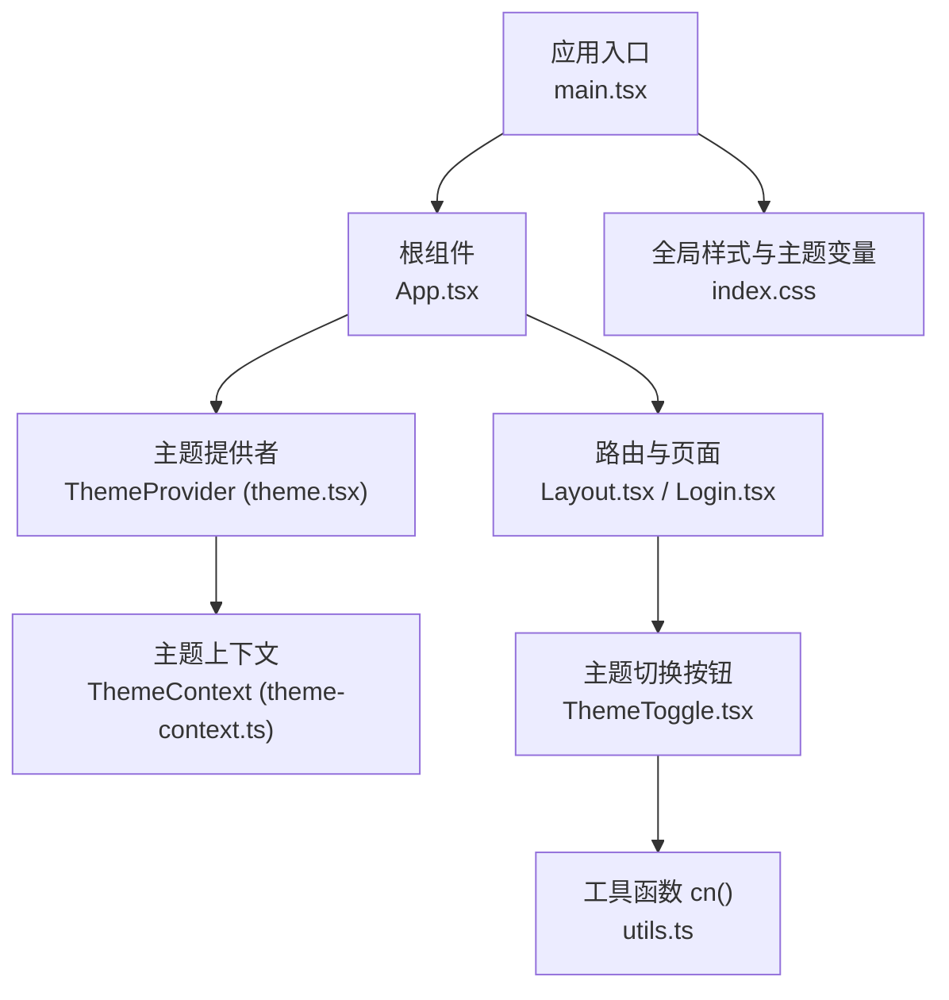
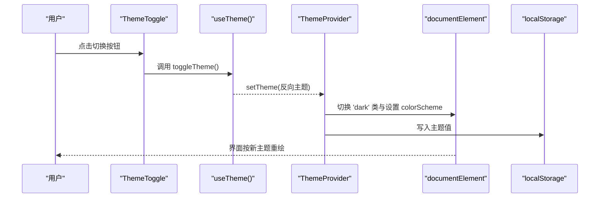
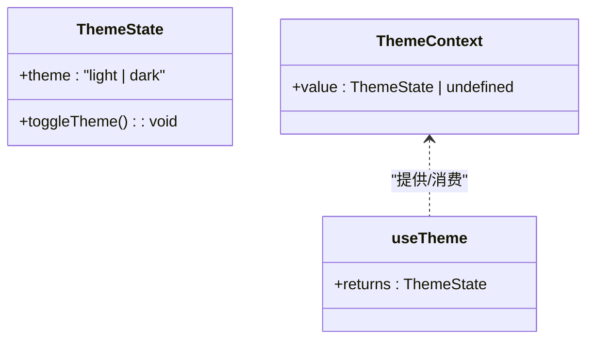
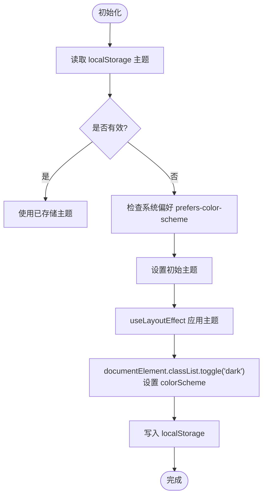
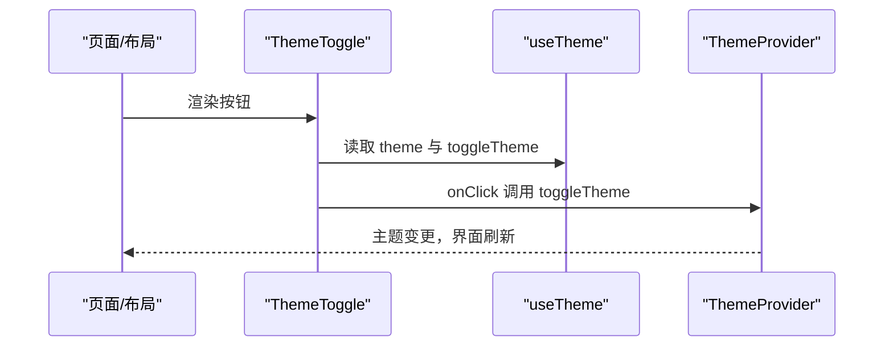
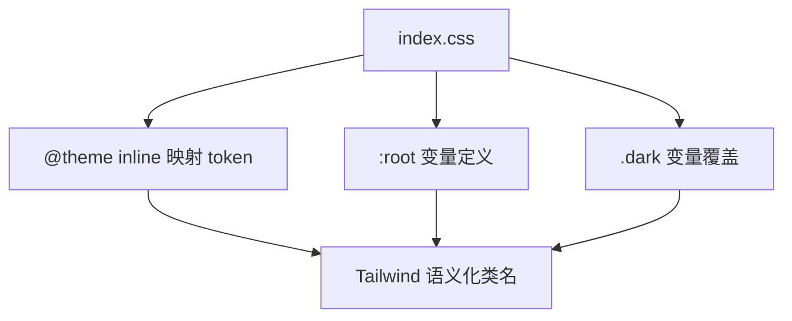
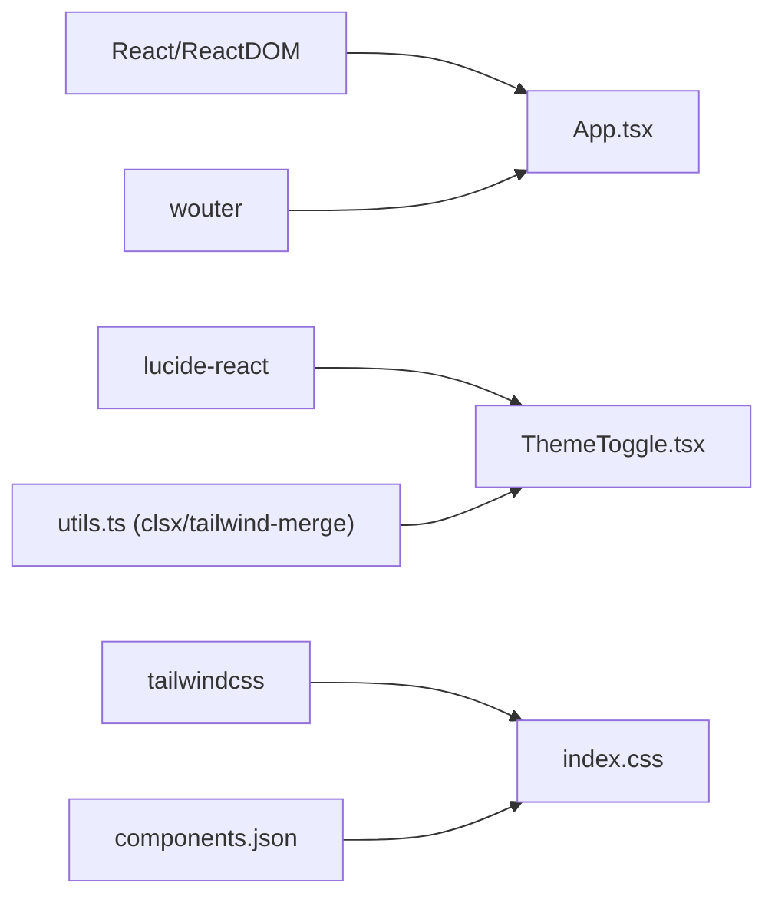

# 主题系统

<cite>
**本文引用的文件**   
- [src/frontend/src/lib/theme-context.ts](file://src/frontend/src/lib/theme-context.ts)
- [src/frontend/src/lib/theme.tsx](file://src/frontend/src/lib/theme.tsx)
- [src/frontend/src/components/ThemeToggle.tsx](file://src/frontend/src/components/ThemeToggle.tsx)
- [src/frontend/src/index.css](file://src/frontend/src/index.css)
- [src/frontend/src/App.tsx](file://src/frontend/src/App.tsx)
- [src/frontend/src/main.tsx](file://src/frontend/src/main.tsx)
- [src/frontend/src/components/Layout.tsx](file://src/frontend/src/components/Layout.tsx)
- [src/frontend/src/pages/Login.tsx](file://src/frontend/src/pages/Login.tsx)
- [src/frontend/src/lib/utils.ts](file://src/frontend/src/lib/utils.ts)
- [src/frontend/package.json](file://src/frontend/package.json)
- [src/frontend/components.json](file://src/frontend/components.json)
</cite>

## 目录
1. [简介](#简介)
2. [项目结构](#项目结构)
3. [核心组件](#核心组件)
4. [架构总览](#架构总览)
5. [详细组件分析](#详细组件分析)
6. [依赖关系分析](#依赖关系分析)
7. [性能考量](#性能考量)
8. [故障排查指南](#故障排查指南)
9. [结论](#结论)
10. [附录](#附录)

## 简介
本技术文档围绕 Lattix-codex 前端主题系统，系统性阐述基于 CSS 变量与 Tailwind CSS 的主题架构设计。内容涵盖深色模式切换、颜色系统设计、字体规范与间距标准、ThemeContext 状态管理、ThemeToggle 组件实现原理与主题持久化存储、CSS 变量命名规范、Tailwind 自定义扩展与响应式适配，以及主题开发规范、新增颜色变量的方法与主题测试策略，帮助开发者高效维护与扩展应用的主题体系。

## 项目结构
主题系统相关文件主要分布在以下位置：
- 主题上下文与提供者：lib/theme-context.ts、lib/theme.tsx
- 主题切换按钮：components/ThemeToggle.tsx
- 样式与主题变量：index.css（包含 Tailwind 导入、@theme inline、CSS 变量定义）
- 应用入口与 Provider 挂载：main.tsx、App.tsx
- 布局与页面集成：components/Layout.tsx、pages/Login.tsx
- 工具函数：lib/utils.ts（类名合并）
- 配置与依赖：package.json、components.json（shadcn/ui 配置）

**图表来源** 
- [src/frontend/src/main.tsx:1-15](file://src/frontend/src/main.tsx#L1-L15)
- [src/frontend/src/App.tsx:1-121](file://src/frontend/src/App.tsx#L1-L121)
- [src/frontend/src/lib/theme.tsx:1-38](file://src/frontend/src/lib/theme.tsx#L1-L38)
- [src/frontend/src/lib/theme-context.ts:1-17](file://src/frontend/src/lib/theme-context.ts#L1-L17)
- [src/frontend/src/components/ThemeToggle.tsx:1-30](file://src/frontend/src/components/ThemeToggle.tsx#L1-L30)
- [src/frontend/src/index.css:1-800](file://src/frontend/src/index.css#L1-L800)
- [src/frontend/src/components/Layout.tsx:183-210](file://src/frontend/src/components/Layout.tsx#L183-L210)
- [src/frontend/src/pages/Login.tsx:34-53](file://src/frontend/src/pages/Login.tsx#L34-L53)
- [src/frontend/src/lib/utils.ts:1-7](file://src/frontend/src/lib/utils.ts#L1-L7)

**章节来源**
- [src/frontend/src/main.tsx:1-15](file://src/frontend/src/main.tsx#L1-L15)
- [src/frontend/src/App.tsx:1-121](file://src/frontend/src/App.tsx#L1-L121)
- [src/frontend/src/index.css:1-800](file://src/frontend/src/index.css#L1-L800)
- [src/frontend/components.json:1-26](file://src/frontend/components.json#L1-L26)
- [src/frontend/package.json:1-54](file://src/frontend/package.json#L1-L54)

## 核心组件
- ThemeContext：定义主题类型与状态接口，提供 useTheme 钩子以在组件树中访问主题状态与切换方法。
- ThemeProvider：负责初始主题选择（优先读取本地存储，否则回退到系统偏好）、将主题写入 DOM（documentElement.classList.toggle('dark') 与 colorScheme），并持久化至 localStorage。
- ThemeToggle：UI 按钮组件，通过 useTheme 获取当前主题与切换方法，渲染对应图标与无障碍标签。

关键职责边界：
- 状态与副作用集中在 ThemeProvider，确保单一数据源与可预测的更新行为。
- UI 层仅消费状态与动作，避免直接操作 DOM 或存储。
- 样式层通过 CSS 变量与 Tailwind 的 @theme inline 暴露语义化 token，供组件使用。

**章节来源**
- [src/frontend/src/lib/theme-context.ts:1-17](file://src/frontend/src/lib/theme-context.ts#L1-L17)
- [src/frontend/src/lib/theme.tsx:1-38](file://src/frontend/src/lib/theme.tsx#L1-L38)
- [src/frontend/src/components/ThemeToggle.tsx:1-30](file://src/frontend/src/components/ThemeToggle.tsx#L1-L30)

## 架构总览
主题系统的运行流程如下：
- 应用启动时，main.tsx 引入 index.css 并渲染 App。
- App 包裹 ThemeProvider，初始化主题状态并提供给子树。
- 各页面与布局组件通过 useTheme 获取主题，ThemeToggle 触发切换。
- 切换时，ThemeProvider 更新 document.documentElement 的 dark 类与 colorScheme，并写入 localStorage。
- index.css 中的 :root 与 .dark 块定义 CSS 变量，Tailwind 通过 @theme inline 映射为语义化 token，组件样式引用这些 token。

**图表来源** 
- [src/frontend/src/components/ThemeToggle.tsx:1-30](file://src/frontend/src/components/ThemeToggle.tsx#L1-L30)
- [src/frontend/src/lib/theme-context.ts:1-17](file://src/frontend/src/lib/theme-context.ts#L1-L17)
- [src/frontend/src/lib/theme.tsx:1-38](file://src/frontend/src/lib/theme.tsx#L1-L38)

## 详细组件分析

### ThemeContext 与 useTheme
- 定义主题类型为 light/dark，状态对象包含 theme 与 toggleTheme。
- useTheme 钩子在未找到上下文时抛出错误，确保必须在 ThemeProvider 内使用。
- 该设计保证类型安全与强约束，避免误用。

**图表来源** 
- [src/frontend/src/lib/theme-context.ts:1-17](file://src/frontend/src/lib/theme-context.ts#L1-L17)

**章节来源**
- [src/frontend/src/lib/theme-context.ts:1-17](file://src/frontend/src/lib/theme-context.ts#L1-L17)

### ThemeProvider 与主题持久化
- 初始主题选择逻辑：优先从 localStorage 读取键值，若不可用则回退到 prefers-color-scheme 媒体查询结果。
- 使用 useLayoutEffect 同步更新 DOM 类与 colorScheme，避免闪烁。
- 写入 localStorage 失败时静默处理，不影响当前主题生效。
- 提供 toggleTheme 闭包，简单翻转当前主题。

**图表来源** 
- [src/frontend/src/lib/theme.tsx:1-38](file://src/frontend/src/lib/theme.tsx#L1-L38)

**章节来源**
- [src/frontend/src/lib/theme.tsx:1-38](file://src/frontend/src/lib/theme.tsx#L1-L38)

### ThemeToggle 组件
- 通过 useTheme 获取 theme 与 toggleTheme。
- 根据当前主题动态切换图标（太阳/月亮）与无障碍标签。
- 使用 Button 组件与 cn 工具函数组合样式，支持 className 透传。

**图表来源** 
- [src/frontend/src/components/ThemeToggle.tsx:1-30](file://src/frontend/src/components/ThemeToggle.tsx#L1-L30)
- [src/frontend/src/lib/theme-context.ts:1-17](file://src/frontend/src/lib/theme-context.ts#L1-L17)

**章节来源**
- [src/frontend/src/components/ThemeToggle.tsx:1-30](file://src/frontend/src/components/ThemeToggle.tsx#L1-L30)
- [src/frontend/src/lib/utils.ts:1-7](file://src/frontend/src/lib/utils.ts#L1-L7)

### 样式与主题变量（CSS 变量与 Tailwind）
- index.css 通过 @import 引入 Tailwind 与动画库，并在 @theme inline 中声明字体与颜色 token。
- :root 与 .dark 块分别定义浅色与深色主题的 CSS 变量，覆盖背景、前景、卡片、主色、辅助色、边框、输入框、环、图表等。
- 自定义变体 data-* 与 utility 如 scroll-fade、shimmer 等增强交互与视觉效果。
- shadcn/ui 配置启用 cssVariables，使组件样式自动绑定 CSS 变量。

**图表来源** 
- [src/frontend/src/index.css:1-800](file://src/frontend/src/index.css#L1-L800)
- [src/frontend/components.json:1-26](file://src/frontend/components.json#L1-L26)

**章节来源**
- [src/frontend/src/index.css:1-800](file://src/frontend/src/index.css#L1-L800)
- [src/frontend/components.json:1-26](file://src/frontend/components.json#L1-L26)

### 应用集成与 Provider 挂载
- main.tsx 引入 index.css 并创建 React 根节点。
- App.tsx 在最外层包裹 ThemeProvider，确保全应用可用主题上下文。
- Layout.tsx 与 Login.tsx 集成 ThemeToggle，提供用户切换入口。

**章节来源**
- [src/frontend/src/main.tsx:1-15](file://src/frontend/src/main.tsx#L1-L15)
- [src/frontend/src/App.tsx:1-121](file://src/frontend/src/App.tsx#L1-L121)
- [src/frontend/src/components/Layout.tsx:183-210](file://src/frontend/src/components/Layout.tsx#L183-L210)
- [src/frontend/src/pages/Login.tsx:34-53](file://src/frontend/src/pages/Login.tsx#L34-L53)

## 依赖关系分析
- 运行时依赖：React 与 ReactDOM 用于组件与渲染；wouter 用于路由；lucide-react 提供图标。
- 样式依赖：Tailwind CSS 与 tw-animate-css；shadcn/ui 通过 components.json 启用 CSS 变量模式。
- 工具依赖：clsx 与 tailwind-merge 用于类名合并（cn）。

**图表来源** 
- [src/frontend/package.json:1-54](file://src/frontend/package.json#L1-L54)
- [src/frontend/components.json:1-26](file://src/frontend/components.json#L1-L26)
- [src/frontend/src/lib/utils.ts:1-7](file://src/frontend/src/lib/utils.ts#L1-L7)

**章节来源**
- [src/frontend/package.json:1-54](file://src/frontend/package.json#L1-L54)
- [src/frontend/components.json:1-26](file://src/frontend/components.json#L1-L26)

## 性能考量
- 使用 useLayoutEffect 同步更新 DOM 类与 colorScheme，避免首次渲染时的主题闪烁。
- localStorage 读写失败时静默处理，防止阻塞渲染。
- 通过 CSS 变量与 Tailwind token 减少重复样式计算，提升样式解析效率。
- 按需引入字体与动画库，控制资源体积。

[本节为通用指导，不直接分析具体文件]

## 故障排查指南
- 主题未生效：确认 App.tsx 是否正确包裹 ThemeProvider；检查 index.css 是否被引入；验证 documentElement 是否包含 dark 类。
- 切换无效：检查 useTheme 是否在 ThemeProvider 内使用；确认 toggleTheme 是否被正确调用。
- 存储异常：浏览器环境可能禁用 localStorage，需降级到系统偏好；查看控制台是否有权限错误。
- 样式错乱：确认 shadcn/ui 的 cssVariables 配置开启；检查 CSS 变量是否被覆盖或未定义。

**章节来源**
- [src/frontend/src/App.tsx:101-121](file://src/frontend/src/App.tsx#L101-L121)
- [src/frontend/src/lib/theme.tsx:19-37](file://src/frontend/src/lib/theme.tsx#L19-L37)
- [src/frontend/src/lib/theme-context.ts:12-16](file://src/frontend/src/lib/theme-context.ts#L12-L16)
- [src/frontend/src/index.css:637-800](file://src/frontend/src/index.css#L637-L800)

## 结论
本主题系统以 React Context 为核心，结合 CSS 变量与 Tailwind 的语义化 token，实现了简洁、可扩展且高性能的深浅色主题方案。通过 ThemeProvider 集中管理状态与持久化，ThemeToggle 提供直观的用户交互，index.css 统一维护变量与样式规则。遵循本文的开发规范与最佳实践，可快速扩展颜色、字体与间距，并确保跨设备与浏览器的良好体验。

[本节为总结性内容，不直接分析具体文件]

## 附录

### 主题开发规范
- 命名规范
  - CSS 变量采用语义化前缀与用途描述，如 --background、--primary、--sidebar-*、--chart-*。
  - Tailwind token 通过 @theme inline 映射，保持与 CSS 变量一一对应。
  - 组件样式优先使用语义化类名（如 bg-primary、text-muted-foreground），避免硬编码颜色。
- 新增颜色变量步骤
  1. 在 index.css 的 :root 与 .dark 块中添加对应变量。
  2. 在 @theme inline 中映射为 Tailwind token（如 --color-*）。
  3. 在组件中使用语义化类名引用新 token。
  4. 验证浅色与深色模式下对比度与可读性。
- 响应式适配
  - 利用 Tailwind 的响应式前缀与媒体查询，确保在不同屏幕尺寸下的视觉一致性。
  - 对复杂布局使用 CSS 变量控制间距与尺寸，便于主题切换时整体调整。
- 主题测试策略
  - 单元测试：模拟 useTheme 返回不同主题，断言组件渲染与交互。
  - 集成测试：切换主题后验证 DOM 类与 colorScheme 变化，检查 localStorage 写入。
  - 视觉回归：截图对比浅色与深色模式下的关键页面，确保无样式回退。

**章节来源**
- [src/frontend/src/index.css:637-800](file://src/frontend/src/index.css#L637-L800)
- [src/frontend/src/lib/theme.tsx:1-38](file://src/frontend/src/lib/theme.tsx#L1-L38)
- [src/frontend/src/components/ThemeToggle.tsx:1-30](file://src/frontend/src/components/ThemeToggle.tsx#L1-L30)

### 主题定制指南与最佳实践
- 使用 shadcn/ui 的 CSS 变量模式，确保组件样式与主题变量联动。
- 通过 cn 工具函数合并类名，避免冲突并保持可组合性。
- 在 ThemeProvider 中集中处理副作用，避免在多个组件中重复操作 DOM 或存储。
- 对字体与动画进行按需加载，优化首屏性能。
- 定期审查颜色对比度与无障碍标签，提升可访问性。

**章节来源**
- [src/frontend/components.json:1-26](file://src/frontend/components.json#L1-L26)
- [src/frontend/src/lib/utils.ts:1-7](file://src/frontend/src/lib/utils.ts#L1-L7)
- [src/frontend/src/lib/theme.tsx:1-38](file://src/frontend/src/lib/theme.tsx#L1-L38)