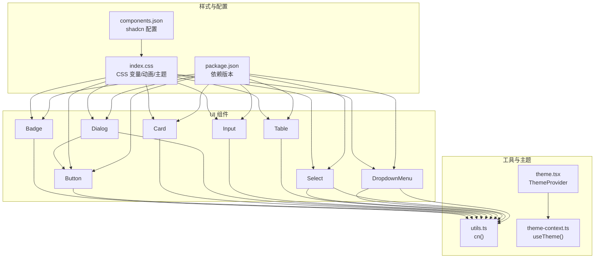
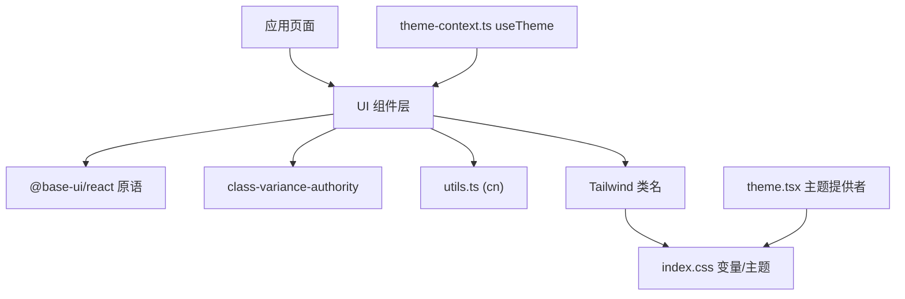
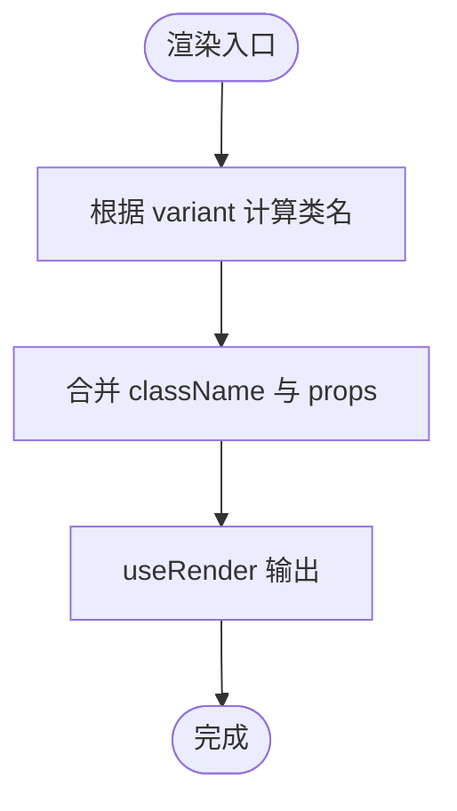
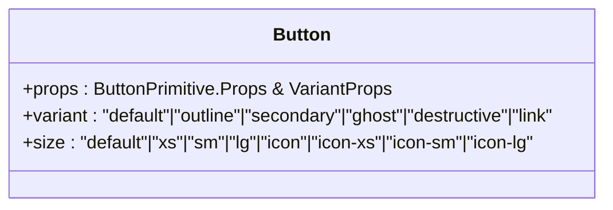
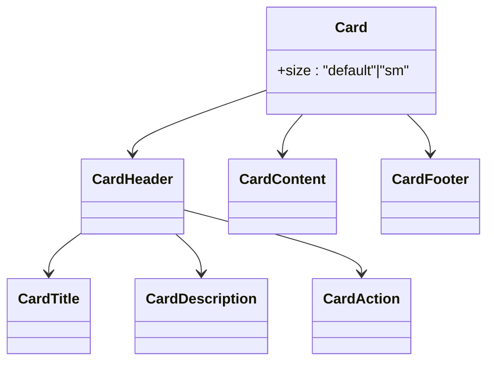
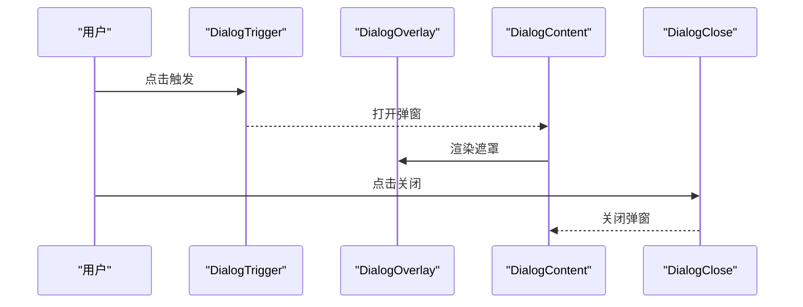
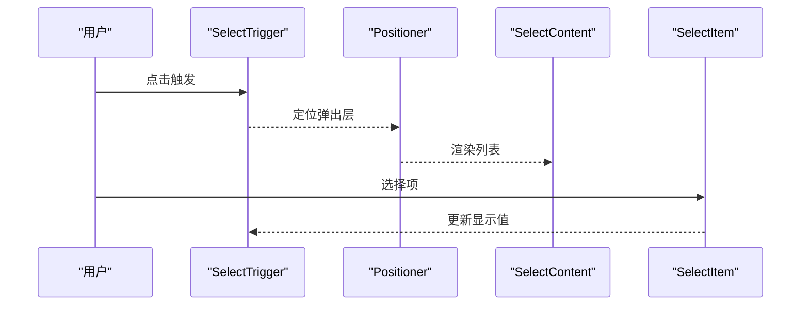
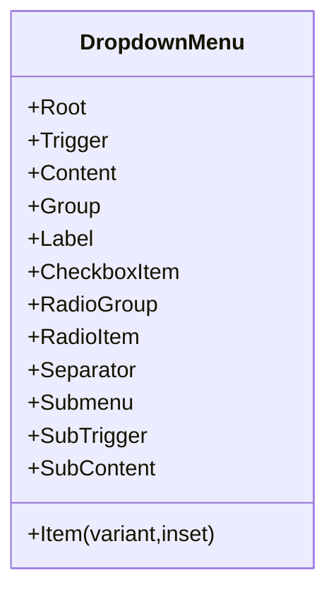
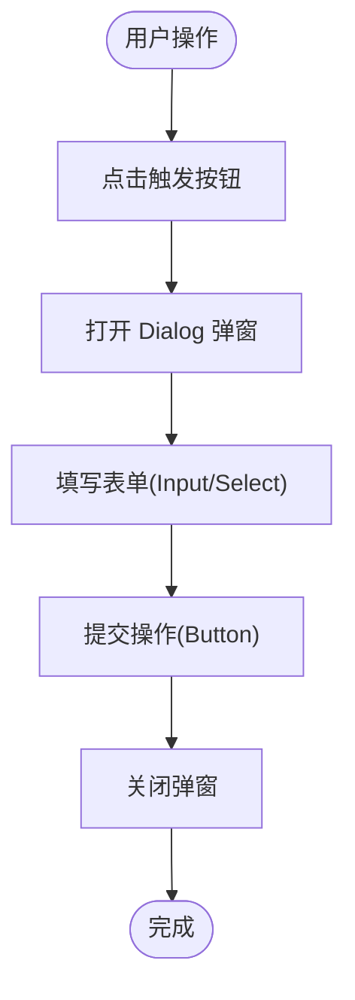
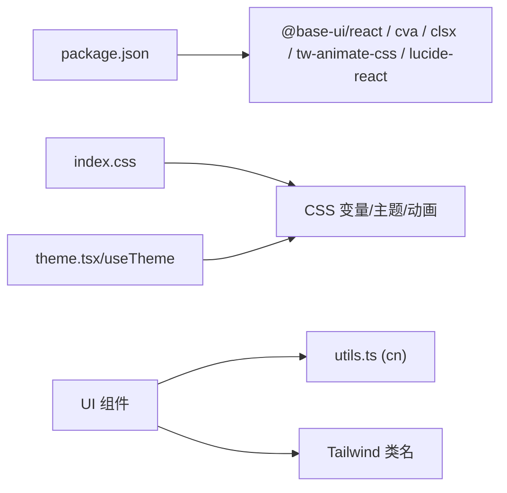

# 基础组件

<cite>
**本文引用的文件**   
- [badge.tsx](file://src/frontend/src/components/ui/badge.tsx)
- [button.tsx](file://src/frontend/src/components/ui/button.tsx)
- [card.tsx](file://src/frontend/src/components/ui/card.tsx)
- [dialog.tsx](file://src/frontend/src/components/ui/dialog.tsx)
- [input.tsx](file://src/frontend/src/components/ui/input.tsx)
- [table.tsx](file://src/frontend/src/components/ui/table.tsx)
- [select.tsx](file://src/frontend/src/components/ui/select.tsx)
- [dropdown-menu.tsx](file://src/frontend/src/components/ui/dropdown-menu.tsx)
- [utils.ts](file://src/frontend/src/lib/utils.ts)
- [theme.tsx](file://src/frontend/src/lib/theme.tsx)
- [theme-context.ts](file://src/frontend/src/lib/theme-context.ts)
- [index.css](file://src/frontend/src/index.css)
- [components.json](file://src/frontend/components.json)
- [package.json](file://src/frontend/package.json)
</cite>

## 目录
1. [简介](#简介)
2. [项目结构](#项目结构)
3. [核心组件](#核心组件)
4. [架构总览](#架构总览)
5. [详细组件分析](#详细组件分析)
6. [依赖关系分析](#依赖关系分析)
7. [性能考量](#性能考量)
8. [故障排查指南](#故障排查指南)
9. [结论](#结论)
10. [附录：API 参考与最佳实践](#附录api-参考与最佳实践)

## 简介
本技术文档聚焦 Lattix-codex 前端基础 UI 组件，系统阐述基于 shadcn/ui、@base-ui/react 与 Tailwind CSS 构建的 Badge、Button、Card、Dialog、Input、Table、Select、DropdownMenu 等核心组件。内容涵盖：
- 组件属性配置、样式变体、事件处理与组合使用方式
- class-variance-authority（CVA）变体系统与 Tailwind 样式定制
- 无障碍访问支持（ARIA、键盘导航、焦点管理）
- TypeScript 类型定义、Props 接口与使用示例
- 主题适配（明/暗）、响应式设计与性能优化策略
- 完整 API 参考与最佳实践

## 项目结构
前端采用 shadcn/ui 风格组织，组件位于 src/components/ui，工具函数在 src/lib/utils.ts，主题上下文与提供者位于 src/lib 下，全局样式与变量在 index.css，shadcn 配置在 components.json，依赖声明在 package.json。

**图表来源** 
- [badge.tsx:1-53](file://src/frontend/src/components/ui/badge.tsx#L1-L53)
- [button.tsx:1-59](file://src/frontend/src/components/ui/button.tsx#L1-L59)
- [card.tsx:1-104](file://src/frontend/src/components/ui/card.tsx#L1-L104)
- [dialog.tsx:1-161](file://src/frontend/src/components/ui/dialog.tsx#L1-L161)
- [input.tsx:1-21](file://src/frontend/src/components/ui/input.tsx#L1-L21)
- [table.tsx:1-117](file://src/frontend/src/components/ui/table.tsx#L1-L117)
- [select.tsx:1-200](file://src/frontend/src/components/ui/select.tsx#L1-L200)
- [dropdown-menu.tsx:1-267](file://src/frontend/src/components/ui/dropdown-menu.tsx#L1-L267)
- [utils.ts:1-7](file://src/frontend/src/lib/utils.ts#L1-L7)
- [theme.tsx:1-38](file://src/frontend/src/lib/theme.tsx#L1-L38)
- [theme-context.ts:1-17](file://src/frontend/src/lib/theme-context.ts#L1-L17)
- [index.css:1-485](file://src/frontend/src/index.css#L1-L485)
- [components.json:1-26](file://src/frontend/components.json#L1-L26)
- [package.json:1-54](file://src/frontend/package.json#L1-L54)

**章节来源**
- [components.json:1-26](file://src/frontend/components.json#L1-L26)
- [package.json:1-54](file://src/frontend/package.json#L1-L54)

## 核心组件
本节概览各组件的职责、关键特性与组合模式。

- Badge：轻量标签，支持多种语义变体（默认、次要、破坏性、描边、幽灵、链接），通过 CVA 管理样式变体，支持图标插槽与无障碍状态。
- Button：通用按钮，支持多尺寸与多变体，内置禁用态、焦点环、错误态与深色适配，可与图标组合。
- Card：卡片容器，提供 Header/Title/Description/Action/Content/Footer 子组件，支持 size 变体与间距变量。
- Dialog：对话框，包含 Trigger/Portal/Overlay/Popup/Header/Footer/Title/Description，支持关闭按钮与动画。
- Input：输入框，统一边框、焦点环、占位符、禁用态与深色背景，兼容文件上传。
- Table：表格套件，包含 Container/Header/Body/Footer/Row/Head/Cell/Caption，支持横向滚动与选中态。
- Select：下拉选择，封装 Trigger/Content/List/Item/Group/Label/Separator/ScrollUp/Down，支持尺寸与对齐。
- DropdownMenu：下拉菜单，包含 Root/Trigger/Content/Group/Label/Item/Checkbox/Radio/Submenu/Shortcut/Separator，支持变体与缩进。

**章节来源**
- [badge.tsx:1-53](file://src/frontend/src/components/ui/badge.tsx#L1-L53)
- [button.tsx:1-59](file://src/frontend/src/components/ui/button.tsx#L1-L59)
- [card.tsx:1-104](file://src/frontend/src/components/ui/card.tsx#L1-L104)
- [dialog.tsx:1-161](file://src/frontend/src/components/ui/dialog.tsx#L1-L161)
- [input.tsx:1-21](file://src/frontend/src/components/ui/input.tsx#L1-L21)
- [table.tsx:1-117](file://src/frontend/src/components/ui/table.tsx#L1-L117)
- [select.tsx:1-200](file://src/frontend/src/components/ui/select.tsx#L1-L200)
- [dropdown-menu.tsx:1-267](file://src/frontend/src/components/ui/dropdown-menu.tsx#L1-L267)

## 架构总览
整体架构由“基础原子组件 + 组合型组件 + 工具与主题 + 样式系统”构成。所有组件通过 cn() 合并类名，借助 Tailwind 变量实现主题化；@base-ui/react 提供可访问的原语能力；class-variance-authority 集中管理变体；index.css 定义 CSS 变量与动画。

**图表来源** 
- [utils.ts:1-7](file://src/frontend/src/lib/utils.ts#L1-L7)
- [index.css:1-485](file://src/frontend/src/index.css#L1-L485)
- [theme.tsx:1-38](file://src/frontend/src/lib/theme.tsx#L1-L38)
- [theme-context.ts:1-17](file://src/frontend/src/lib/theme-context.ts#L1-L17)
- [package.json:1-54](file://src/frontend/package.json#L1-L54)

## 详细组件分析

### Badge 组件
- 功能要点
  - 使用 CVA 定义 variant 变体（default、secondary、destructive、outline、ghost、link）。
  - 通过 mergeProps/useRender 暴露 slot 与 state，便于外部扩展。
  - 内置 focus-visible 与 aria-invalid 状态样式，支持图标内联布局。
- 属性与类型
  - className、variant、render、以及原生 span 属性。
- 事件处理
  - 作为展示型元素，通常不直接绑定交互事件；如需点击行为，建议包裹 Button 或 a 标签。
- 组合使用
  - 与图标组合时，利用 data-[icon=inline-start|end] 控制内边距。
- 无障碍
  - 支持 aria-invalid 与 focus-visible 环，适合状态提示。

**图表来源** 
- [badge.tsx:1-53](file://src/frontend/src/components/ui/badge.tsx#L1-L53)

**章节来源**
- [badge.tsx:1-53](file://src/frontend/src/components/ui/badge.tsx#L1-L53)

### Button 组件
- 功能要点
  - 基于 @base-ui/react/button 原语，提供丰富的 variant（default、outline、secondary、ghost、destructive、link）与 size（default、xs、sm、lg、icon、icon-xs、icon-sm、icon-lg）。
  - 统一的焦点环、禁用态、错误态与深色适配。
- 属性与类型
  - 继承 ButtonPrimitive.Props，并扩展 VariantProps<typeof buttonVariants>。
- 事件处理
  - 透传 onClick 等事件，支持 disabled 禁用。
- 组合使用
  - 与图标组合时，自动调整图标尺寸与间距。

**图表来源** 
- [button.tsx:1-59](file://src/frontend/src/components/ui/button.tsx#L1-L59)

**章节来源**
- [button.tsx:1-59](file://src/frontend/src/components/ui/button.tsx#L1-L59)

### Card 组件
- 功能要点
  - 提供 Card、CardHeader、CardTitle、CardDescription、CardAction、CardContent、CardFooter 子组件。
  - 支持 size="default" | "sm"，通过 CSS 变量控制间距。
- 属性与类型
  - 每个子组件接受 React.ComponentProps 与自定义 className。
- 组合使用
  - 典型结构：Card > Header(Title+Description+Action) > Content > Footer。
- 无障碍
  - 标题与描述语义清晰，适合表单说明与结果展示。

**图表来源** 
- [card.tsx:1-104](file://src/frontend/src/components/ui/card.tsx#L1-L104)

**章节来源**
- [card.tsx:1-104](file://src/frontend/src/components/ui/card.tsx#L1-L104)

### Dialog 组件
- 功能要点
  - 基于 @base-ui/react/dialog，封装 Root、Trigger、Portal、Close、Backdrop(Portal)、Popup(Content)、Header、Footer、Title、Description。
  - 支持 showCloseButton 控制右上角关闭按钮，底部 Footer 可选显示关闭按钮。
  - 内置淡入缩放动画与遮罩模糊。
- 属性与类型
  - 各子组件透传对应原语 Props，Content 额外支持 showCloseButton。
- 事件处理
  - Trigger 触发打开，Close 关闭；可通过 onOpenChange 监听状态。
- 无障碍
  - 焦点陷阱、Esc 关闭、屏幕阅读器友好（sr-only 文本）。

**图表来源** 
- [dialog.tsx:1-161](file://src/frontend/src/components/ui/dialog.tsx#L1-L161)

**章节来源**
- [dialog.tsx:1-161](file://src/frontend/src/components/ui/dialog.tsx#L1-L161)

### Input 组件
- 功能要点
  - 基于 @base-ui/react/input，统一边框、焦点环、占位符、禁用态与深色背景。
  - 支持 type 属性与文件上传场景（file 伪元素样式）。
- 属性与类型
  - 透传 input 原生属性，className 用于覆盖样式。
- 事件处理
  - onChange/onFocus/onBlur 等原生事件透传。
- 无障碍
  - 支持 aria-invalid 与 focus-visible 环，配合 label 使用更佳。

**章节来源**
- [input.tsx:1-21](file://src/frontend/src/components/ui/input.tsx#L1-L21)

### Table 组件
- 功能要点
  - 提供 Table(Container)、TableHeader、TableBody、TableFooter、TableRow、TableHead、TableCell、TableCaption。
  - 外层容器支持横向滚动，行支持 hover 与选中态。
- 属性与类型
  - 各子组件透传原生 table 相关 Props。
- 组合使用
  - 典型结构：Table > Header(Head) > Body(Row+Cell) > Footer > Caption。
- 无障碍
  - 表头与单元格语义明确，适合数据展示。

**章节来源**
- [table.tsx:1-117](file://src/frontend/src/components/ui/table.tsx#L1-L117)

### Select 组件
- 功能要点
  - 基于 @base-ui/react/select，封装 Root、Group、Value、Trigger、Content、Label、Item、Separator、ScrollUp/Down。
  - 支持 size="sm"|"default"，弹出层位置与对齐参数丰富。
- 属性与类型
  - Trigger 支持 size；Content 支持 side/sideOffset/align/alignOffset/alignItemWithTrigger。
- 事件处理
  - 值变更通过原语回调；Item 支持选中指示器。
- 无障碍
  - 键盘导航、焦点管理与屏幕阅读器支持。

**图表来源** 
- [select.tsx:1-200](file://src/frontend/src/components/ui/select.tsx#L1-L200)

**章节来源**
- [select.tsx:1-200](file://src/frontend/src/components/ui/select.tsx#L1-L200)

### DropdownMenu 组件
- 功能要点
  - 基于 @base-ui/react/menu，封装 Root、Portal、Trigger、Content、Group、Label、Item、CheckboxItem、RadioGroup/RadioItem、Submenu/SubTrigger/SubContent、Separator、Shortcut。
  - Item 支持 variant="default"|"destructive" 与 inset 缩进。
- 属性与类型
  - Content 支持 align/alignOffset/side/sideOffset；SubContent 支持独立定位参数。
- 事件处理
  - 子项点击、复选/单选状态切换、子菜单展开。
- 无障碍
  - 键盘导航、焦点管理与屏幕阅读器支持。

**图表来源** 
- [dropdown-menu.tsx:1-267](file://src/frontend/src/components/ui/dropdown-menu.tsx#L1-L267)

**章节来源**
- [dropdown-menu.tsx:1-267](file://src/frontend/src/components/ui/dropdown-menu.tsx#L1-L267)

### 概念总览
以下流程图展示一个典型的“打开对话框并操作表单”的用户流程，帮助理解组件组合方式。

[本图为概念流程，不映射具体源码文件]

## 依赖关系分析
- 运行时依赖
  - @base-ui/react：提供可访问的原语（Button、Dialog、Input、Select、Menu 等）。
  - class-variance-authority：集中管理组件变体。
  - clsx + tailwind-merge：类名合并工具（cn）。
  - lucide-react：图标库。
- 样式与主题
  - Tailwind CSS v4：原子化样式与变量。
  - index.css：CSS 变量、主题色、动画与组件增强样式。
  - components.json：shadcn 配置（样式风格、别名、图标库等）。
- 主题系统
  - theme.tsx：ThemeProvider 管理明/暗主题，持久化到 localStorage。
  - theme-context.ts：useTheme 钩子暴露主题状态与切换方法。

**图表来源** 
- [package.json:1-54](file://src/frontend/package.json#L1-L54)
- [index.css:1-485](file://src/frontend/src/index.css#L1-L485)
- [utils.ts:1-7](file://src/frontend/src/lib/utils.ts#L1-L7)
- [theme.tsx:1-38](file://src/frontend/src/lib/theme.tsx#L1-L38)
- [theme-context.ts:1-17](file://src/frontend/src/lib/theme-context.ts#L1-L17)

**章节来源**
- [package.json:1-54](file://src/frontend/package.json#L1-L54)
- [components.json:1-26](file://src/frontend/components.json#L1-L26)

## 性能考量
- 类名合并与样式计算
  - 使用 cn() 合并类名，避免重复与冲突，减少样式体积。
- 组件粒度与懒加载
  - 将复杂组件（如 Dialog、Select、DropdownMenu）按需引入，避免首屏冗余。
- 动画与过渡
  - 使用 tw-animate-css 提供的轻量动画，遵循 prefers-reduced-motion 媒体查询，降低对低性能设备的负担。
- 渲染优化
  - 避免在高频事件中创建新对象；合理使用 React.memo 包裹纯展示组件。
- 主题切换
  - 通过 documentElement.classList.toggle 切换 dark 类，避免全量重绘。

[本节为通用指导，不直接分析具体文件]

## 故障排查指南
- 主题未生效
  - 检查 ThemeProvider 是否包裹根组件，document.documentElement 是否正确设置 dark 类与 colorScheme。
- 样式冲突
  - 确认 cn() 正确合并类名；检查 Tailwind 变量是否被覆盖。
- 无障碍问题
  - 确保表单控件有对应的 label 或 aria-label；检查 focus-visible 与 aria-invalid 状态。
- 弹窗/菜单定位异常
  - 检查 Positioner/Portal 层级与 z-index；确认锚点元素可见且未被遮挡。
- 深色模式下输入框背景不可见
  - 确认 index.css 中 [data-slot="input"] 的背景变量已正确设置。

**章节来源**
- [theme.tsx:1-38](file://src/frontend/src/lib/theme.tsx#L1-L38)
- [index.css:1-485](file://src/frontend/src/index.css#L1-L485)

## 结论
本项目以 shadcn/ui 风格为基础，结合 @base-ui/react 的可访问性与 Tailwind 的原子化样式，构建了稳定、可扩展的基础组件体系。通过 CVA 统一管理变体、cn() 合并类名、CSS 变量驱动主题，实现了良好的可维护性与一致性。建议在业务中优先复用这些组件，并通过主题与变体快速适配不同场景。

[本节为总结，不直接分析具体文件]

## 附录：API 参考与最佳实践

### 组件 API 速览
- Badge
  - 属性：className、variant(default|secondary|destructive|outline|ghost|link)、render、...spanProps
  - 用途：状态标签、计数、分类标记
- Button
  - 属性：className、variant(default|outline|secondary|ghost|destructive|link)、size(default|xs|sm|lg|icon|icon-xs|icon-sm|icon-lg)、...buttonProps
  - 用途：主要交互入口
- Card
  - 子组件：CardHeader、CardTitle、CardDescription、CardAction、CardContent、CardFooter
  - 属性：size(default|sm)
  - 用途：信息块、结果展示
- Dialog
  - 子组件：Trigger、Portal、Overlay、Content、Header、Footer、Title、Description、Close
  - 属性：showCloseButton(boolean)
  - 用途：模态交互、表单编辑
- Input
  - 属性：type、className、...inputProps
  - 用途：文本输入、搜索、表单字段
- Table
  - 子组件：Container、Header、Body、Footer、Row、Head、Cell、Caption
  - 用途：数据展示、排序筛选
- Select
  - 子组件：Root、Group、Value、Trigger(size), Content, Label, Item, Separator, ScrollUp/Down
  - 属性：size(sm|default)
  - 用途：选项选择、过滤
- DropdownMenu
  - 子组件：Root、Trigger、Content、Group、Label、Item(variant,inset)、CheckboxItem、RadioGroup/RadioItem、Submenu/SubTrigger/SubContent、Separator、Shortcut
  - 用途：操作菜单、快捷入口

**章节来源**
- [badge.tsx:1-53](file://src/frontend/src/components/ui/badge.tsx#L1-L53)
- [button.tsx:1-59](file://src/frontend/src/components/ui/button.tsx#L1-L59)
- [card.tsx:1-104](file://src/frontend/src/components/ui/card.tsx#L1-L104)
- [dialog.tsx:1-161](file://src/frontend/src/components/ui/dialog.tsx#L1-L161)
- [input.tsx:1-21](file://src/frontend/src/components/ui/input.tsx#L1-L21)
- [table.tsx:1-117](file://src/frontend/src/components/ui/table.tsx#L1-L117)
- [select.tsx:1-200](file://src/frontend/src/components/ui/select.tsx#L1-L200)
- [dropdown-menu.tsx:1-267](file://src/frontend/src/components/ui/dropdown-menu.tsx#L1-L267)

### 最佳实践
- 使用 CVA 管理变体，保持样式一致性与可维护性。
- 通过 cn() 合并类名，避免样式冲突与冗余。
- 始终考虑无障碍：为交互元素提供合适的 role、aria-* 与键盘支持。
- 主题适配：使用 CSS 变量与 .dark 类，避免硬编码颜色。
- 响应式设计：优先使用 Tailwind 断点与相对单位，保证移动端体验。
- 性能优化：拆分大组件、懒加载、减少重排重绘，尊重 reduced motion。

[本节为通用指导，不直接分析具体文件]