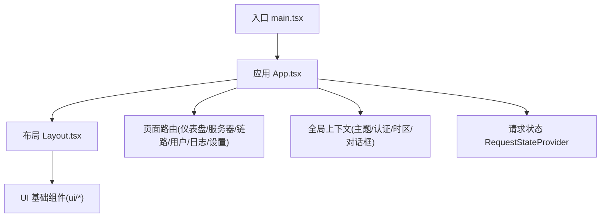
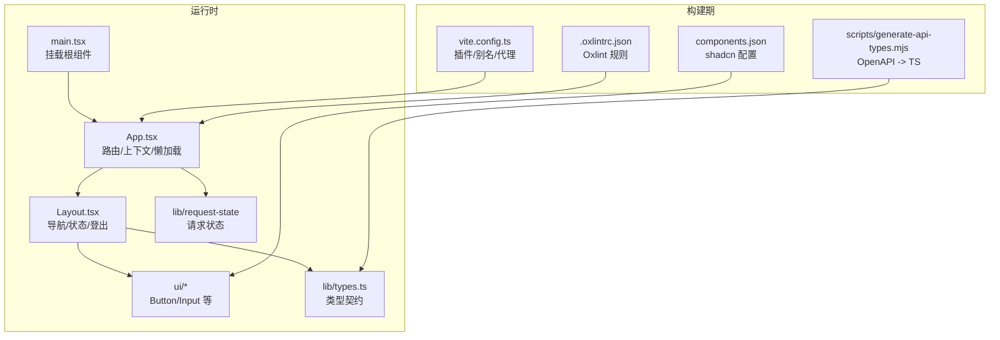
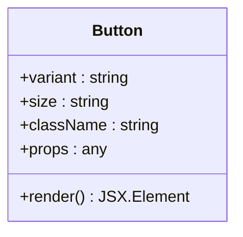
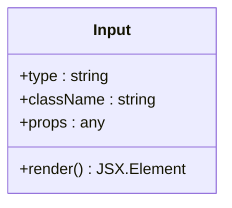
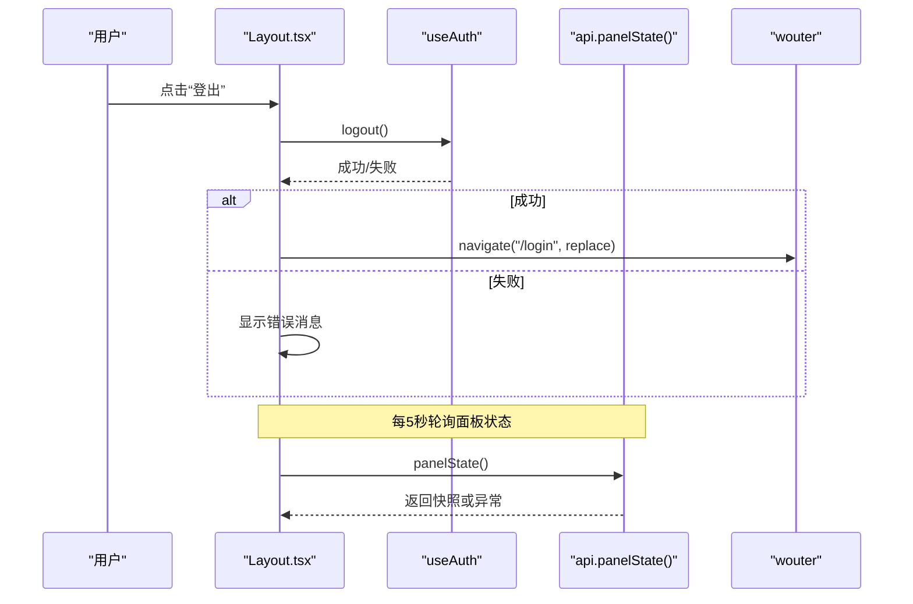
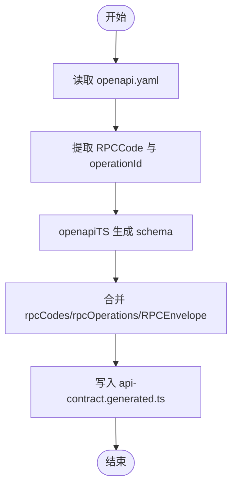
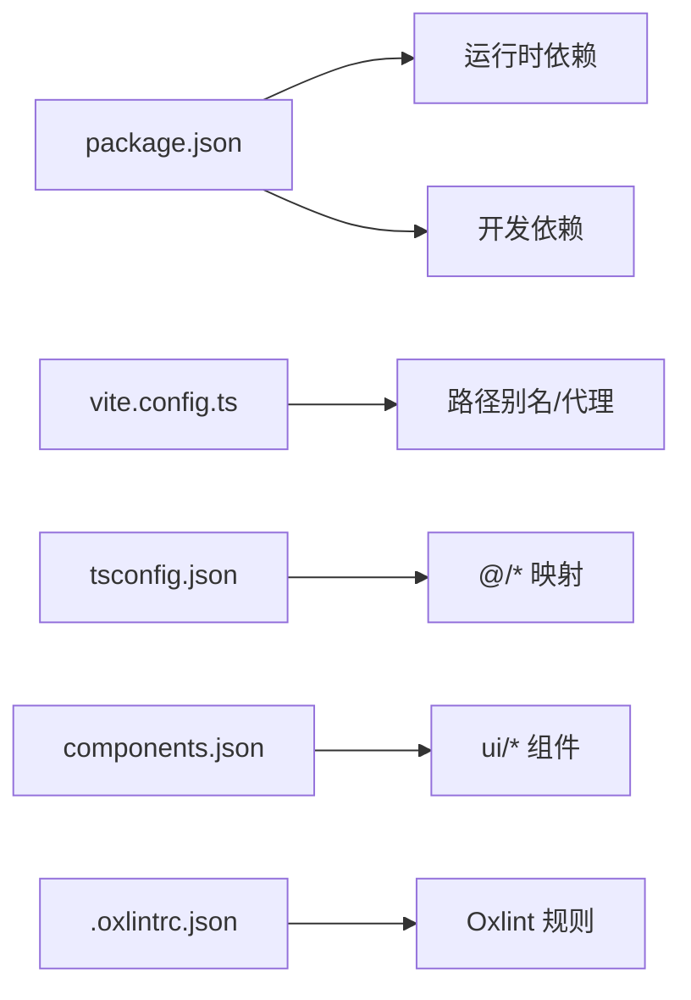

# 组件开发规范

<cite>
**本文引用的文件**   
- [package.json](file://src/frontend/package.json)
- [vite.config.ts](file://src/frontend/vite.config.ts)
- [tsconfig.json](file://src/frontend/tsconfig.json)
- [components.json](file://src/frontend/components.json)
- [.oxlintrc.json](file://src/frontend/.oxlintrc.json)
- [main.tsx](file://src/frontend/src/main.tsx)
- [App.tsx](file://src/frontend/src/App.tsx)
- [Layout.tsx](file://src/frontend/src/components/Layout.tsx)
- [button.tsx](file://src/frontend/src/components/ui/button.tsx)
- [input.tsx](file://src/frontend/src/components/ui/input.tsx)
- [types.ts](file://src/frontend/src/lib/types.ts)
- [utils.ts](file://src/frontend/src/lib/utils.ts)
- [generate-api-types.mjs](file://src/frontend/scripts/generate-api-types.mjs)
</cite>

## 目录
1. [简介](#简介)
2. [项目结构](#项目结构)
3. [核心组件](#核心组件)
4. [架构总览](#架构总览)
5. [详细组件分析](#详细组件分析)
6. [依赖分析](#依赖分析)
7. [性能考量](#性能考量)
8. [故障排查指南](#故障排查指南)
9. [结论](#结论)
10. [附录](#附录)

## 简介
本规范面向 Lattix-codex 前端组件开发，旨在为团队提供统一的组件开发标准与最佳实践。内容覆盖：
- 组件文件组织、命名约定与目录结构
- TypeScript 类型定义、Props 接口设计与事件处理模式
- 单元测试、可视化测试与可访问性检查方法
- ESLint（Oxlint）规则配置、代码质量检查与性能分析工具使用
- 组件文档生成、API 自动提取与版本管理策略
- 常见陷阱避免与调试技巧

目标：帮助开发者高效创建高质量、可维护、可复用的 UI 组件。

## 项目结构
前端基于 Vite + React + TypeScript，采用 shadcn/ui 风格的基础组件库与 Tailwind CSS。关键结构与职责如下：
- src/main.tsx：应用入口，挂载根组件并注入全局状态提供者
- src/App.tsx：路由与全局上下文（主题、认证、时区、对话框）装配，页面懒加载与权限保护
- src/components：业务与基础 UI 组件；ui/ 子目录存放原子化基础组件
- src/lib：通用工具、类型、请求封装、上下文等
- scripts：构建期脚本（如 API 类型生成）
- 配置文件：Vite、TypeScript、shadcn 配置、Oxlint 规则

**图示来源** 
- [main.tsx:1-15](file://src/frontend/src/main.tsx#L1-L15)
- [App.tsx:1-121](file://src/frontend/src/App.tsx#L1-L121)
- [Layout.tsx:1-231](file://src/frontend/src/components/Layout.tsx#L1-L231)

**章节来源**
- [package.json:1-54](file://src/frontend/package.json#L1-L54)
- [vite.config.ts:1-29](file://src/frontend/vite.config.ts#L1-L29)
- [tsconfig.json:1-13](file://src/frontend/tsconfig.json#L1-L13)
- [components.json:1-26](file://src/frontend/components.json#L1-L26)

## 核心组件
- 基础按钮 Button：基于 @base-ui/react 的 Button 原语，通过 class-variance-authority 管理 variant/size 变体，统一样式合并 cn()
- 输入框 Input：基于 @base-ui/react 的 Input 原语，标准化边框、焦点态、禁用态与无障碍属性
- 布局 Layout：侧边栏+头部+主内容区域，集成导航、面板状态指示、登出流程与更新提示
- 类型系统 types.ts：集中定义前后端契约类型（Server、Chain、User、Settings、Log 等），并与生成的 API 契约类型对齐

这些组件体现了“原子化基础组件 + 组合式页面组件”的分层设计，便于复用与一致性维护。

**章节来源**
- [button.tsx:1-59](file://src/frontend/src/components/ui/button.tsx#L1-L59)
- [input.tsx:1-21](file://src/frontend/src/components/ui/input.tsx#L1-L21)
- [Layout.tsx:1-231](file://src/frontend/src/components/Layout.tsx#L1-L231)
- [types.ts:1-588](file://src/frontend/src/lib/types.ts#L1-L588)

## 架构总览
整体架构围绕“入口 -> 路由与上下文 -> 页面与布局 -> 基础组件与工具库”展开，配合 Vite 插件生态与 Tailwind 样式体系。

**图示来源** 
- [main.tsx:1-15](file://src/frontend/src/main.tsx#L1-L15)
- [App.tsx:1-121](file://src/frontend/src/App.tsx#L1-L121)
- [Layout.tsx:1-231](file://src/frontend/src/components/Layout.tsx#L1-L231)
- [vite.config.ts:1-29](file://src/frontend/vite.config.ts#L1-L29)
- [.oxlintrc.json:1-9](file://src/frontend/.oxlintrc.json#L1-L9)
- [generate-api-types.mjs:1-79](file://src/frontend/scripts/generate-api-types.mjs#L1-L79)
- [components.json:1-26](file://src/frontend/components.json#L1-L26)

## 详细组件分析

### 基础按钮 Button
- 设计要点
  - 使用 cva 声明 variant 与 size 变体，默认值明确
  - 通过 cn() 合并 className，确保样式优先级与冲突解决
  - 透传 props 给底层 ButtonPrimitive，保持无障碍与语义化
- Props 设计建议
  - 显式定义 variant、size、className 等常用属性
  - 对交互行为（onClick、disabled、aria-*）进行约束与校验
- 事件处理模式
  - 将副作用逻辑上移至调用方或 hooks，组件内仅做最小渲染
- 可访问性
  - 保留原生 button 语义，必要时补充 aria-* 描述
- 测试建议
  - 渲染断言：不同 variant/size 的样式类名存在性
  - 交互断言：点击触发回调、disabled 状态不可交互
  - 快照测试：用于回归样式变化（谨慎使用）

**图示来源** 
- [button.tsx:1-59](file://src/frontend/src/components/ui/button.tsx#L1-L59)

**章节来源**
- [button.tsx:1-59](file://src/frontend/src/components/ui/button.tsx#L1-L59)
- [utils.ts:1-7](file://src/frontend/src/lib/utils.ts#L1-L7)

### 输入框 Input
- 设计要点
  - 基于 @base-ui/react 的 Input 原语，统一输入体验
  - 通过 cn() 合并样式，支持 disabled、aria-invalid 等状态
- Props 设计建议
  - 暴露 type、value、onChange、placeholder、disabled 等常用属性
  - 对受控与非受控模式进行明确约定
- 可访问性
  - 正确关联 label（通过 id/for 或 aria-labelledby）
  - 错误态使用 aria-invalid 与提示信息
- 测试建议
  - 输入变更触发 onChange
  - 禁用态不可编辑
  - 占位符与类型切换正常

**图示来源** 
- [input.tsx:1-21](file://src/frontend/src/components/ui/input.tsx#L1-L21)

**章节来源**
- [input.tsx:1-21](file://src/frontend/src/components/ui/input.tsx#L1-L21)
- [utils.ts:1-7](file://src/frontend/src/lib/utils.ts#L1-L7)

### 布局 Layout
- 设计要点
  - 响应式侧边栏与移动端抽屉导航
  - 集成面板生命周期状态指示器与主题切换
  - 登出流程包含错误展示与路由跳转
- 数据流
  - 定时轮询面板状态，失败回退到不可用状态
  - 使用 useAuth 获取用户名与登出方法
  - 使用 useRequestState 显示全局请求进度条
- 可访问性
  - 导航项具备合适的 aria-label
  - 状态指示使用 role="status"
  - 错误信息使用 role="alert"
- 测试建议
  - 导航高亮与路由匹配
  - 登出成功/失败分支
  - 面板状态更新与错误回退

**图示来源** 
- [Layout.tsx:1-231](file://src/frontend/src/components/Layout.tsx#L1-L231)

**章节来源**
- [Layout.tsx:1-231](file://src/frontend/src/components/Layout.tsx#L1-L231)

### 类型系统与 API 契约
- 类型来源
  - types.ts 集中定义领域模型（Server、Chain、User、Settings、Log 等）
  - 通过 generate-api-types.mjs 从 docs/openapi.yaml 生成 api-contract.generated.ts，并在 types.ts 中引用
- 生成流程
  - 解析 OpenAPI 中的 RPCCode 枚举与操作 ID，生成 rpcCodes、rpcOperations 与 RPCEnvelope
  - 支持 --check 模式在 CI 中校验类型是否过期
- 使用建议
  - 新增字段优先在 OpenAPI 中定义，再运行 generate:api 同步类型
  - 对可选字段使用 | null 或 ? 明确语义
  - 对枚举值使用字面量联合类型，提升类型安全

**图示来源** 
- [generate-api-types.mjs:1-79](file://src/frontend/scripts/generate-api-types.mjs#L1-L79)

**章节来源**
- [types.ts:1-588](file://src/frontend/src/lib/types.ts#L1-L588)
- [generate-api-types.mjs:1-79](file://src/frontend/scripts/generate-api-types.mjs#L1-L79)

## 依赖分析
- 运行时依赖
  - React、React DOM、Wouter（路由）、Tailwind 与 class-variance-authority（样式）
  - @base-ui/react（基础 UI 原语）、lucide-react（图标）
- 构建期依赖
  - Vite、@vitejs/plugin-react、tailwindcss 插件
  - Oxlint（代码检查）、TypeScript、Vitest（测试）
  - openapi-typescript（类型生成）
- 路径与别名
  - tsconfig 与 vite.config 均配置 @/* 指向 src，保证导入一致
  - three 相关别名优化打包体积与模块解析

**图示来源** 
- [package.json:1-54](file://src/frontend/package.json#L1-L54)
- [vite.config.ts:1-29](file://src/frontend/vite.config.ts#L1-L29)
- [tsconfig.json:1-13](file://src/frontend/tsconfig.json#L1-L13)
- [components.json:1-26](file://src/frontend/components.json#L1-L26)
- [.oxlintrc.json:1-9](file://src/frontend/.oxlintrc.json#L1-L9)

**章节来源**
- [package.json:1-54](file://src/frontend/package.json#L1-L54)
- [vite.config.ts:1-29](file://src/frontend/vite.config.ts#L1-L29)
- [tsconfig.json:1-13](file://src/frontend/tsconfig.json#L1-L13)
- [components.json:1-26](file://src/frontend/components.json#L1-L26)
- [.oxlintrc.json:1-9](file://src/frontend/.oxlintrc.json#L1-L9)

## 性能考量
- 代码分割与懒加载
  - 页面级组件使用 lazy/Suspense，减少首屏体积
  - chunkSizeWarningLimit 调优以避免过大分包
- 样式与渲染
  - 使用 Tailwind 原子类与 cn() 合并，避免重复样式
  - 控制重绘与回流，避免频繁状态更新
- 网络请求
  - 使用 request-state 统一管理请求进度与错误
  - 合理设置轮询间隔（如面板状态 5s）
- 第三方库
  - Three.js 通过别名与按需引入降低体积
  - 图标库按需引入 lucide-react 图标

[本节为通用指导，不直接分析具体文件]

## 故障排查指南
- 构建与类型问题
  - 运行 build 前执行 check:api 确保 API 类型未过期
  - 若类型不一致，运行 generate:api 重新生成
- 路由与权限
  - 未登录将被重定向至 /login，检查 RequireAuth 逻辑
  - 懒加载组件缺失会导致 Suspense 长时间显示
- 样式与主题
  - Tailwind 变量与 dark 模式需确保 index.css 正确引入
  - 组件 className 冲突时使用浏览器开发者工具检查最终样式
- 网络与代理
  - 本地开发通过 vite server.proxy 转发 /api 与 /sub
  - 后端服务端口与路径需与配置一致

**章节来源**
- [package.json:1-54](file://src/frontend/package.json#L1-L54)
- [vite.config.ts:1-29](file://src/frontend/vite.config.ts#L1-L29)
- [App.tsx:1-121](file://src/frontend/src/App.tsx#L1-L121)

## 结论
本规范以“原子化基础组件 + 组合式页面组件”为核心，结合严格的 TypeScript 类型与 OpenAPI 驱动的类型生成，保障前后端契约一致性。通过 Oxlint 与 Vitest 形成稳定的质量闭环，借助 Vite 与 Tailwind 提升开发与构建效率。遵循本文档的流程与实践，可显著提升组件的可维护性与用户体验。

[本节为总结性内容，不直接分析具体文件]

## 附录

### 组件开发标准流程
- 需求分析与接口设计
  - 明确组件职责、Props 与事件
  - 在 types.ts 中定义或更新类型
- 实现与样式
  - 基于 @base-ui/react 原语扩展，使用 cva 管理变体
  - 通过 cn() 合并样式，遵循 Tailwind 规范
- 可访问性
  - 语义化标签、aria-* 属性、键盘可达性
- 测试
  - 单元测试：渲染、交互、边界条件
  - 可视化测试：视觉回归（谨慎使用）
  - 可访问性检查：axe-core 或类似工具
- 文档与发布
  - 自动生成 API 文档（JSDoc/Storybook）
  - 版本管理与变更日志

[本节为概念性内容，不直接分析具体文件]

### ESLint（Oxlint）规则配置
- 启用 react、typescript、oxc 插件
- 强制 Hooks 规则与导出组件限制
- 建议在 CI 中执行 lint 命令阻断不合格提交

**章节来源**
- [.oxlintrc.json:1-9](file://src/frontend/.oxlintrc.json#L1-L9)

### 性能分析工具使用
- Vite 内置分析：构建后查看包大小与依赖占比
- Chrome Performance：定位渲染瓶颈与长任务
- Memory Profiling：排查内存泄漏与过度渲染

[本节为通用指导，不直接分析具体文件]

### 组件文档生成与 API 自动提取
- 使用 JSDoc 注释描述 Props、事件与示例
- 结合 Storybook 或自建文档站点展示
- OpenAPI 驱动的 API 类型生成，确保契约一致性

**章节来源**
- [generate-api-types.mjs:1-79](file://src/frontend/scripts/generate-api-types.mjs#L1-L79)

### 版本管理策略
- 语义化版本号（SemVer）
- 变更日志（CHANGELOG）与提交规范
- 发布流水线（GitHub Actions）自动化构建与发布

[本节为通用指导，不直接分析具体文件]