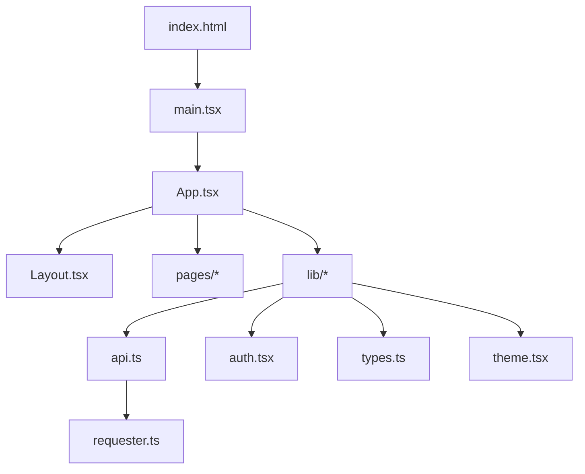
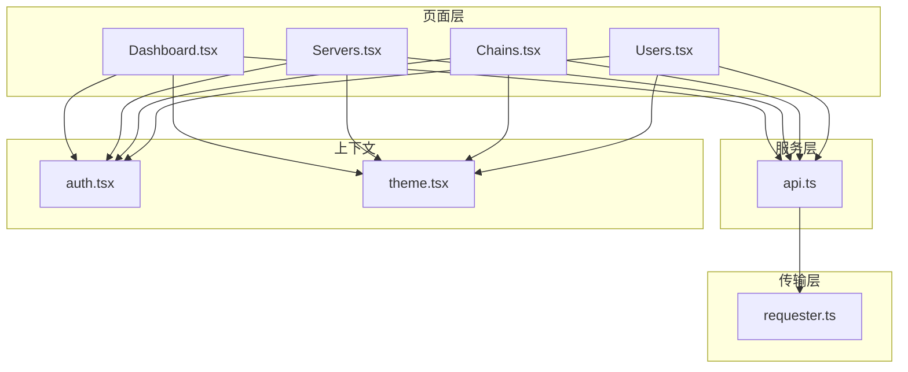
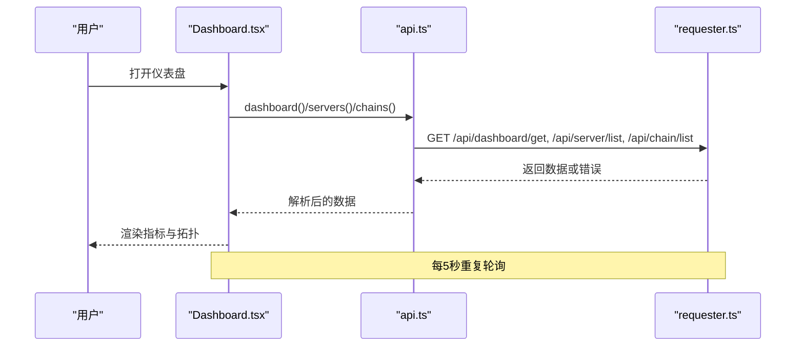
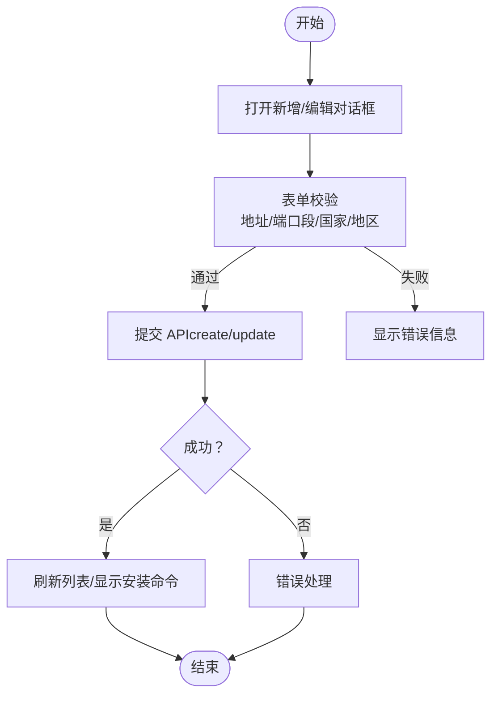
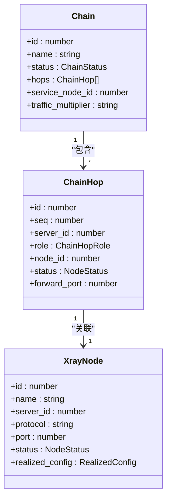
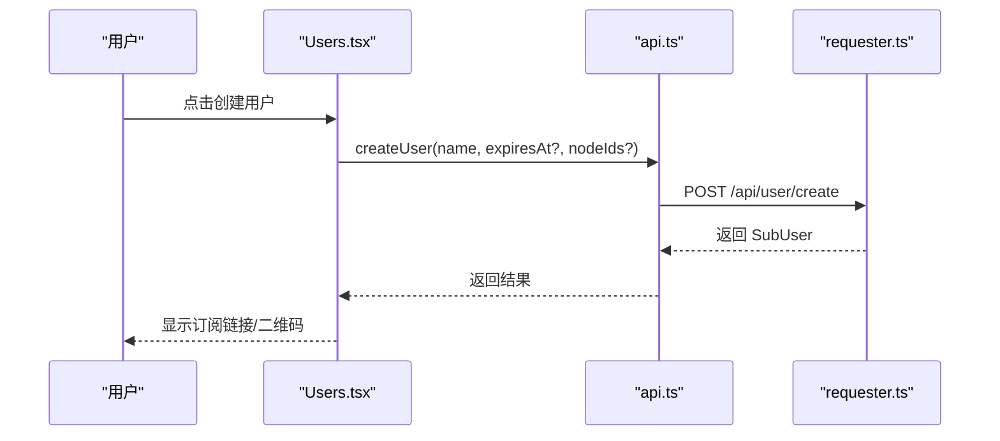
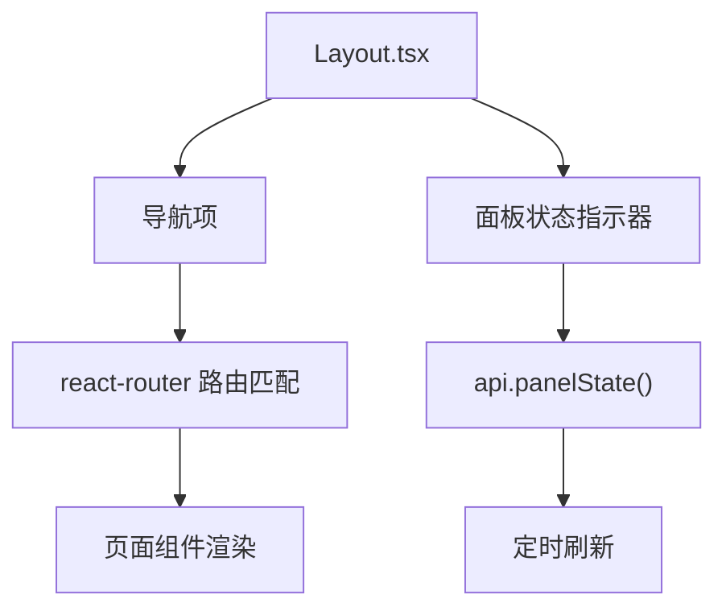
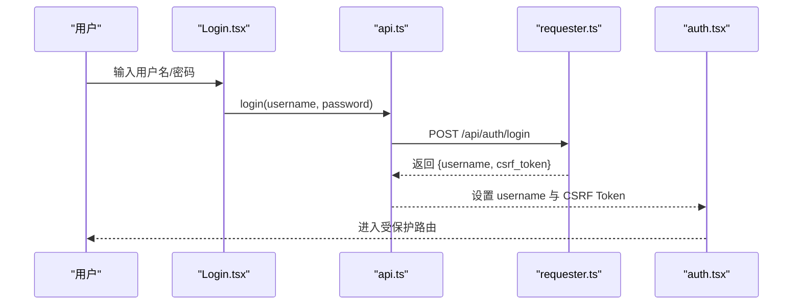
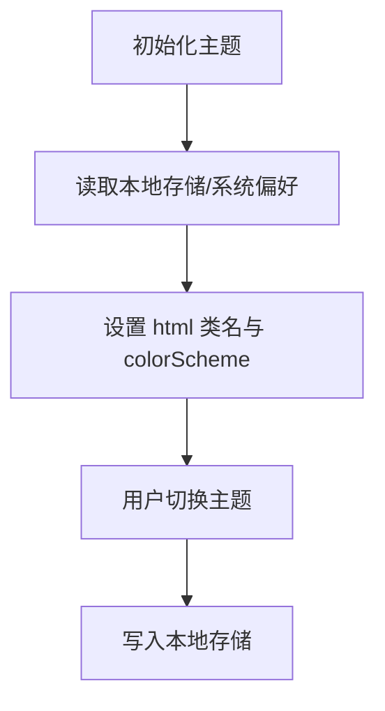
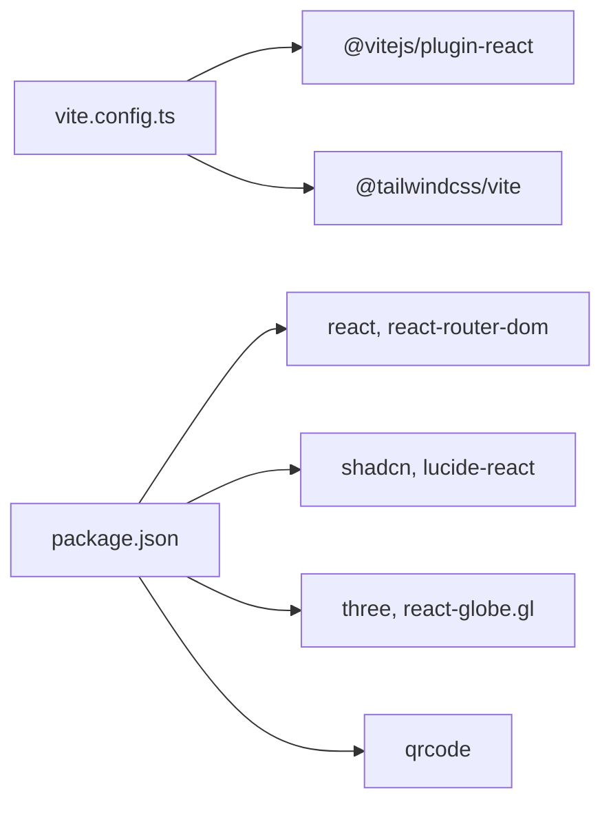

# 前端应用

<cite>
**本文引用的文件**   
- [package.json](file://src/frontend/package.json)
- [vite.config.ts](file://src/frontend/vite.config.ts)
- [components.json](file://src/frontend/components.json)
- [main.tsx](file://src/frontend/src/main.tsx)
- [App.tsx](file://src/frontend/src/App.tsx)
- [Layout.tsx](file://src/frontend/src/components/Layout.tsx)
- [Dashboard.tsx](file://src/frontend/src/pages/Dashboard.tsx)
- [Servers.tsx](file://src/frontend/src/pages/Servers.tsx)
- [Chains.tsx](file://src/frontend/src/pages/Chains.tsx)
- [Users.tsx](file://src/frontend/src/pages/Users.tsx)
- [api.ts](file://src/frontend/src/lib/api.ts)
- [requester.ts](file://src/frontend/src/lib/requester.ts)
- [auth.tsx](file://src/frontend/src/lib/auth.tsx)
- [types.ts](file://src/frontend/src/lib/types.ts)
- [theme.tsx](file://src/frontend/src/lib/theme.tsx)
</cite>

## 目录
1. [简介](#简介)
2. [项目结构](#项目结构)
3. [核心组件](#核心组件)
4. [架构总览](#架构总览)
5. [详细组件分析](#详细组件分析)
6. [依赖关系分析](#依赖关系分析)
7. [性能考虑](#性能考虑)
8. [故障排查指南](#故障排查指南)
9. [结论](#结论)
10. [附录](#附录)

## 简介
本技术文档面向 Lattix-codex 前端应用，聚焦 React 应用的架构设计、页面与组件实现、UI 组件库与主题系统、前后端通信机制（HTTP API、WebSocket）、状态管理策略、开发最佳实践与性能优化建议。读者可据此快速理解并扩展前端功能。

## 项目结构
前端基于 Vite + React + TypeScript 构建，使用 Tailwind CSS 与 shadcn/ui 基础组件，路由采用 react-router-dom，统一通过自研请求器与后端 REST API 通信。关键配置与入口如下：
- 构建与脚本：Vite 插件、别名、开发代理等
- 应用入口：React 根节点挂载与全局 Provider 包裹
- 路由与布局：BrowserRouter、RequireAuth、Layout 侧边栏与导航
- 页面模块：仪表盘、服务器、链路、用户、日志、设置等
- 通用库：API 封装、请求器、认证上下文、类型定义、主题切换等

**图表来源** 
- [main.tsx:1-15](file://src/frontend/src/main.tsx#L1-L15)
- [App.tsx:1-73](file://src/frontend/src/App.tsx#L1-L73)
- [Layout.tsx:1-205](file://src/frontend/src/components/Layout.tsx#L1-L205)
- [api.ts:1-292](file://src/frontend/src/lib/api.ts#L1-L292)
- [requester.ts:1-309](file://src/frontend/src/lib/requester.ts#L1-L309)
- [auth.tsx:1-52](file://src/frontend/src/lib/auth.tsx#L1-L52)
- [types.ts:1-587](file://src/frontend/src/lib/types.ts#L1-L587)
- [theme.tsx:1-38](file://src/frontend/src/lib/theme.tsx#L1-L38)

**章节来源**
- [package.json:1-48](file://src/frontend/package.json#L1-L48)
- [vite.config.ts:1-21](file://src/frontend/vite.config.ts#L1-L21)
- [components.json:1-26](file://src/frontend/components.json#L1-L26)
- [main.tsx:1-15](file://src/frontend/src/main.tsx#L1-L15)
- [App.tsx:1-73](file://src/frontend/src/App.tsx#L1-L73)

## 核心组件
- 应用壳与路由
  - App.tsx：集中式路由定义、鉴权守卫 RequireAuth、Provider 嵌套顺序（主题、对话框、认证、时区）
  - Layout.tsx：侧边栏导航、移动端抽屉、面板生命周期指示器、登出逻辑
- 页面组件
  - Dashboard.tsx：概览指标卡片、拓扑图、运行概况，定时刷新
  - Servers.tsx：服务器增删改查、端口段编辑、计费与流量计划、升级与命令跟踪
  - Chains.tsx：直连与中继链路创建/编辑、状态展示、流量历史图表
  - Users.tsx：用户创建、有效期管理、链路分配、订阅链接与二维码
- 通用库
  - api.ts：REST API 方法集合，统一错误处理与 CSRF Token 管理
  - requester.ts：HTTP 请求器，含重试、超时、IDEMPOTENCY、RPC 信封解析、事件订阅
  - auth.tsx：登录态维护、未授权回调
  - types.ts：前后端契约类型定义
  - theme.tsx：深色/浅色主题切换与持久化

**章节来源**
- [App.tsx:1-73](file://src/frontend/src/App.tsx#L1-L73)
- [Layout.tsx:1-205](file://src/frontend/src/components/Layout.tsx#L1-L205)
- [Dashboard.tsx:1-162](file://src/frontend/src/pages/Dashboard.tsx#L1-L162)
- [Servers.tsx:1-800](file://src/frontend/src/pages/Servers.tsx#L1-L800)
- [Chains.tsx:1-800](file://src/frontend/src/pages/Chains.tsx#L1-L800)
- [Users.tsx:1-486](file://src/frontend/src/pages/Users.tsx#L1-L486)
- [api.ts:1-292](file://src/frontend/src/lib/api.ts#L1-L292)
- [requester.ts:1-309](file://src/frontend/src/lib/requester.ts#L1-L309)
- [auth.tsx:1-52](file://src/frontend/src/lib/auth.tsx#L1-L52)
- [types.ts:1-587](file://src/frontend/src/lib/types.ts#L1-L587)
- [theme.tsx:1-38](file://src/frontend/src/lib/theme.tsx#L1-L38)

## 架构总览
前端采用“页面组件 + 通用库”的分层模式：
- 表现层：页面组件负责数据获取、交互与渲染
- 服务层：api.ts 暴露领域 API，封装业务语义
- 传输层：requester.ts 统一 HTTP 行为（重试、超时、CSRF、幂等键、RPC 信封）
- 状态层：页面级 useState + Context（认证、主题、时区、对话框）
- 路由与布局：BrowserRouter + Layout 提供导航与全局 UI 框架

**图表来源** 
- [Dashboard.tsx:1-162](file://src/frontend/src/pages/Dashboard.tsx#L1-L162)
- [Servers.tsx:1-800](file://src/frontend/src/pages/Servers.tsx#L1-L800)
- [Chains.tsx:1-800](file://src/frontend/src/pages/Chains.tsx#L1-L800)
- [Users.tsx:1-486](file://src/frontend/src/pages/Users.tsx#L1-L486)
- [api.ts:1-292](file://src/frontend/src/lib/api.ts#L1-L292)
- [requester.ts:1-309](file://src/frontend/src/lib/requester.ts#L1-L309)
- [auth.tsx:1-52](file://src/frontend/src/lib/auth.tsx#L1-L52)
- [theme.tsx:1-38](file://src/frontend/src/lib/theme.tsx#L1-L38)

## 详细组件分析

### 仪表盘（Dashboard）
- 功能要点
  - 聚合统计：服务器数、在线节点、链路数、订阅用户
  - 拓扑可视化：地球拓扑图展示服务器地理位置与链路状态
  - 运行概况：活跃链路、在线节点、订阅用户实时计数
  - 数据刷新：每 5 秒轮询 dashboard/servers/chains
- 数据流
  - useEffect 内并发调用 api.dashboard()、api.servers()、api.chains()
  - 错误处理：errorMessage(err) 统一提示
- 性能与体验
  - 加载骨架屏与错误面板
  - 间隔定时器在卸载时清理

**图表来源** 
- [Dashboard.tsx:1-162](file://src/frontend/src/pages/Dashboard.tsx#L1-L162)
- [api.ts:77-84](file://src/frontend/src/lib/api.ts#L77-L84)
- [requester.ts:84-112](file://src/frontend/src/lib/requester.ts#L84-L112)

**章节来源**
- [Dashboard.tsx:1-162](file://src/frontend/src/pages/Dashboard.tsx#L1-L162)

### 服务器管理（Servers）
- 功能要点
  - 服务器列表与监控网格（ServerMonitorGrid）
  - 新增服务器：支持 direct/nat、端口段编辑、标签、国家/城市、计费与流量计划
  - 编辑服务器：地址选择（内置候选/自定义）、端口段校验、计费与流量计划更新
  - 运维操作：凭证轮换、修复配置漂移、版本升级（xray/agent）、删除
  - 升级流程：下发升级命令后轮询命令终态（acked/failed），超时兜底
- 关键逻辑
  - 端口段解析与校验：parsePortRows、validatePortRanges
  - NAT 场景必填公网地址与端口映射
  - 升级命令跟踪：serverCommands 轮询 command_id 状态
- 用户体验
  - 确认弹窗、通知反馈、错误提示、时间与时区格式化

**图表来源** 
- [Servers.tsx:1-800](file://src/frontend/src/pages/Servers.tsx#L1-L800)
- [api.ts:91-177](file://src/frontend/src/lib/api.ts#L91-L177)

**章节来源**
- [Servers.tsx:1-800](file://src/frontend/src/pages/Servers.tsx#L1-L800)

### 链路管理（Chains）
- 功能要点
  - 直连与中继链路创建/编辑：入口/中间跳/出口选择、协议与参数配置（vless/reality/xhttp/dokodemo-door）
  - 名称模板校验与随机命名
  - 状态展示：pending/applying/active/degraded/failed 等
  - 流量历史：SVG 折线图展示上传/下载趋势（日/月）
  - 运维操作：重试、强制发布、重置流量、删除
- 关键逻辑
  - 入站能力判断：direct 或 NAT 受限直连（有端口段）
  - 链长限制与去重校验
  - Reality/XHTTP/VLESS 参数组合校验
- 数据流
  - 并发加载 chains/nodes/servers，定时刷新
  - 流量历史按 hopId 与 range 拉取

**图表来源** 
- [types.ts:232-322](file://src/frontend/src/lib/types.ts#L232-L322)
- [Chains.tsx:1-800](file://src/frontend/src/pages/Chains.tsx#L1-L800)

**章节来源**
- [Chains.tsx:1-800](file://src/frontend/src/pages/Chains.tsx#L1-L800)

### 用户管理（Users）
- 功能要点
  - 用户创建：姓名、有效期、分配链路（多选）
  - 用户列表：显示订阅链接、流量、有效期、状态
  - 操作：修改有效期、启用/停用、分配链路、删除
  - 分享：复制订阅链接、生成二维码、打开落地页
- 数据流
  - 并发加载 users/nodes/chains，定时刷新
  - 创建成功后返回 sub_url/sub_links_url

**图表来源** 
- [Users.tsx:1-486](file://src/frontend/src/pages/Users.tsx#L1-L486)
- [api.ts:205-225](file://src/frontend/src/lib/api.ts#L205-L225)
- [requester.ts:97-112](file://src/frontend/src/lib/requester.ts#L97-L112)

**章节来源**
- [Users.tsx:1-486](file://src/frontend/src/pages/Users.tsx#L1-L486)

### 布局与导航（Layout）
- 功能要点
  - 响应式侧边栏与移动端抽屉导航
  - 面板生命周期状态指示器（启动中/正常/更新中/故障）
  - 主题切换、用户头像与登出
  - 前台请求进度条（top bar）
- 数据流
  - 每 5 秒轮询 panelState，展示面板状态

**图表来源** 
- [Layout.tsx:1-205](file://src/frontend/src/components/Layout.tsx#L1-L205)
- [api.ts:238-241](file://src/frontend/src/lib/api.ts#L238-L241)

**章节来源**
- [Layout.tsx:1-205](file://src/frontend/src/components/Layout.tsx#L1-L205)

### 认证与鉴权（Auth）
- 功能要点
  - 登录/登出：调用 /api/auth/login 与 /api/auth/logout
  - 当前用户：/api/auth/me 初始化 username
  - 未授权处理：清除 CSRF Token 并清空用户名，触发跳转
- 集成点
  - App.tsx 中的 RequireAuth 守卫
  - Layout.tsx 的登出按钮

**图表来源** 
- [auth.tsx:1-52](file://src/frontend/src/lib/auth.tsx#L1-L52)
- [api.ts:58-75](file://src/frontend/src/lib/api.ts#L58-L75)
- [requester.ts:97-112](file://src/frontend/src/lib/requester.ts#L97-L112)

**章节来源**
- [auth.tsx:1-52](file://src/frontend/src/lib/auth.tsx#L1-L52)
- [App.tsx:19-35](file://src/frontend/src/App.tsx#L19-L35)

### 主题系统（Theme）
- 功能要点
  - 深色/浅色主题切换，持久化到 localStorage
  - 根据系统偏好自动选择初始主题
  - 通过 document.documentElement.classList 控制 dark 类名
- 集成点
  - App.tsx 顶层 ThemeProvider
  - Layout.tsx 与页面组件通过 context 使用

**图表来源** 
- [theme.tsx:1-38](file://src/frontend/src/lib/theme.tsx#L1-L38)

**章节来源**
- [theme.tsx:1-38](file://src/frontend/src/lib/theme.tsx#L1-L38)

## 依赖关系分析
- 构建与工具
  - Vite + @vitejs/plugin-react + @tailwindcss/vite
  - TypeScript、oxlint、shadcn/ui、Tailwind CSS
- 运行时依赖
  - React 19、react-router-dom、lucide-react、three/react-globe.gl、qrcode
- 配置
  - vite.config.ts 中 alias '@' 指向 src，开发代理 /api 与 /sub 至 localhost:8080
  - components.json 配置 shadcn/ui 路径别名与样式变量

**图表来源** 
- [vite.config.ts:1-21](file://src/frontend/vite.config.ts#L1-L21)
- [package.json:1-48](file://src/frontend/package.json#L1-L48)
- [components.json:1-26](file://src/frontend/components.json#L1-L26)

**章节来源**
- [vite.config.ts:1-21](file://src/frontend/vite.config.ts#L1-L21)
- [package.json:1-48](file://src/frontend/package.json#L1-L48)
- [components.json:1-26](file://src/frontend/components.json#L1-L26)

## 性能考虑
- 网络请求
  - requester.ts 默认 15s 超时，下载接口 30s；支持重试（transport 错误最多 2 次）
  - Idempotency-Key 保证 POST 幂等，避免重复提交
  - display: 'silent' 用于静默请求（如指标采样），减少 UI 干扰
- 数据刷新
  - 页面级 setInterval 轮询（5s/60s），注意在组件卸载时清理
  - 合并请求：Promise.all 并发拉取多资源
- 渲染优化
  - 骨架屏与错误面板提升感知性能
  - SVG 图表按需计算坐标与刻度，避免频繁重绘
- 缓存与状态
  - 主题与认证状态通过 Context 与 localStorage 持久化
  - 页面级 useState 管理局部状态，避免不必要的全局状态

[本节为通用指导，不直接分析具体文件]

## 故障排查指南
- 常见错误分类
  - business：业务错误（由 RPC envelope.code 决定）
  - transport：网络不可达或超时
  - protocol：无效响应或协议不符合
  - cancelled：请求取消或超时
- 定位手段
  - RequestError 携带 requestId、traceId、httpStatus，便于后端联调
  - 使用 requester.subscribe 监听 start/finish 事件，记录生命周期
  - 检查 CSRF Token 是否正确设置（登录后从 me 接口获取）
- 常见问题
  - 未授权：AUTH_REQUIRED 触发未授权回调，需重新登录
  - 下载失败：Content-Type 非 JSON 且非二进制时抛出协议错误
  - 轮询无回执：升级命令可能因 agent 重启停留在 sent，需超时兜底

**章节来源**
- [requester.ts:13-36](file://src/frontend/src/lib/requester.ts#L13-L36)
- [requester.ts:220-272](file://src/frontend/src/lib/requester.ts#L220-L272)
- [api.ts:38-51](file://src/frontend/src/lib/api.ts#L38-L51)

## 结论
Lattix-codex 前端以清晰的层次划分与统一的请求抽象为基础，结合 React 生态与 Tailwind/shadcn/ui，实现了仪表盘、服务器、链路、用户等核心管理能力。通过严格的类型契约、错误分类与生命周期追踪，保障了可维护性与可观测性。建议在扩展新功能时遵循现有模式：页面组件负责交互与数据流，api.ts 封装领域 API，requester.ts 统一传输细节，并通过 Context 管理跨组件状态。

[本节为总结，不直接分析具体文件]

## 附录
- 开发环境
  - 启动：npm run dev（Vite）
  - 构建：npm run build（生成 API 类型、TS 编译、Vite 打包）
  - 预览：npm run preview
- 代理配置
  - /api 与 /sub 代理至 http://localhost:8080
- 组件库
  - shadcn/ui 基础组件位于 components/ui，路径别名 ui
  - 图标库 lucide-react，主题色通过 CSS 变量与 Tailwind 控制

**章节来源**
- [package.json:1-48](file://src/frontend/package.json#L1-L48)
- [vite.config.ts:14-19](file://src/frontend/vite.config.ts#L14-L19)
- [components.json:1-26](file://src/frontend/components.json#L1-L26)