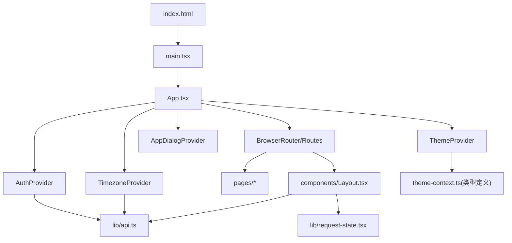
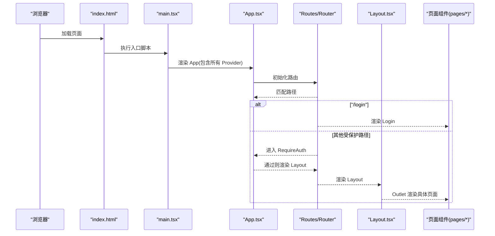
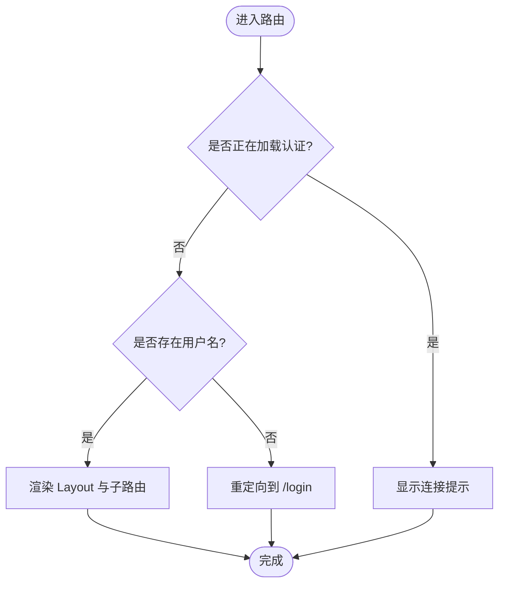
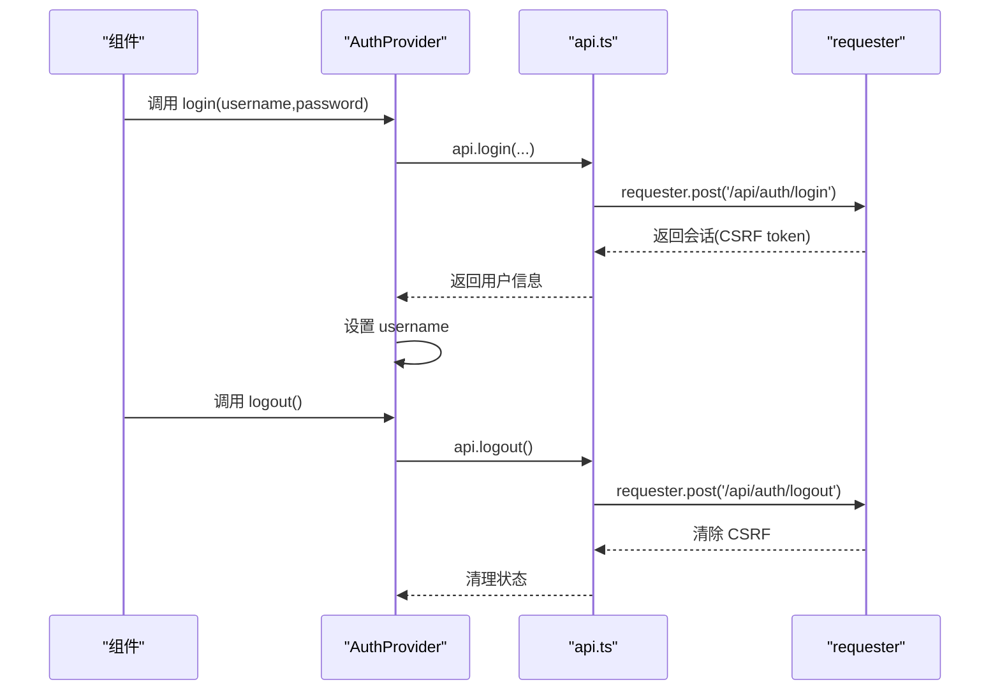
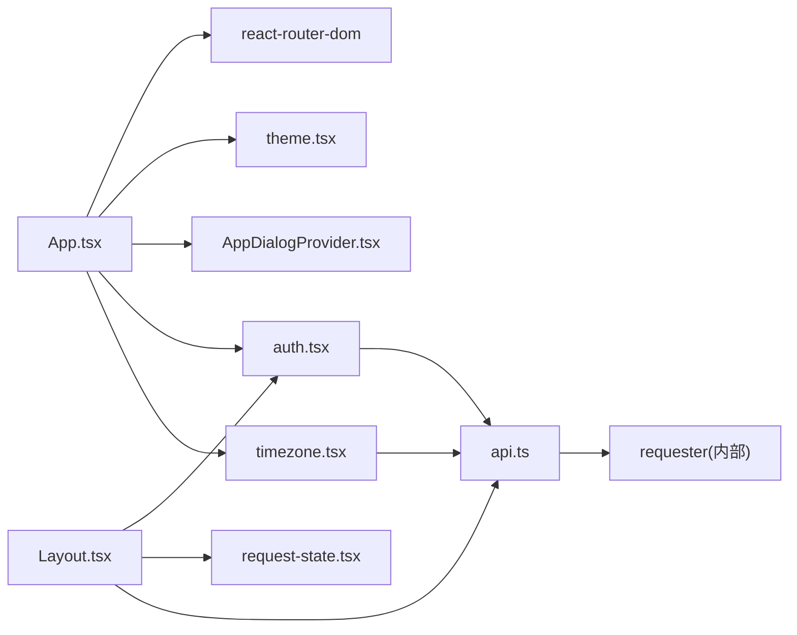

# 应用架构

<cite>
**本文引用的文件**   
- [main.tsx](file://src/frontend/src/main.tsx)
- [App.tsx](file://src/frontend/src/App.tsx)
- [package.json](file://src/frontend/package.json)
- [vite.config.ts](file://src/frontend/vite.config.ts)
- [index.html](file://src/frontend/index.html)
- [theme.tsx](file://src/frontend/src/lib/theme.tsx)
- [auth.tsx](file://src/frontend/src/lib/auth.tsx)
- [timezone.tsx](file://src/frontend/src/lib/timezone.tsx)
- [request-state.tsx](file://src/frontend/src/lib/request-state.tsx)
- [api.ts](file://src/frontend/src/lib/api.ts)
- [Layout.tsx](file://src/frontend/src/components/Layout.tsx)
- [Login.tsx](file://src/frontend/src/pages/Login.tsx)
- [AppDialogProvider.tsx](file://src/frontend/src/components/AppDialogProvider.tsx)
- [app-dialog.ts](file://src/frontend/src/lib/app-dialog.ts)
</cite>

## 目录
1. [简介](#简介)
2. [项目结构](#项目结构)
3. [核心组件](#核心组件)
4. [架构总览](#架构总览)
5. [详细组件分析](#详细组件分析)
6. [依赖关系分析](#依赖关系分析)
7. [性能考虑](#性能考虑)
8. [故障排查指南](#故障排查指南)
9. [结论](#结论)
10. [附录](#附录)

## 简介
本技术文档面向 Lattix-codex 前端应用，系统性阐述基于 React + Vite 的 SPA 架构：从应用启动、路由与守卫、全局 Provider 层级到状态管理与网络请求封装；并给出构建配置、开发环境设置与性能优化建议。文档以“由浅入深”的方式组织，既适合初学者快速上手，也便于有经验的开发者深入扩展与维护。

## 项目结构
前端工程位于 src/frontend，采用功能域与层次混合的组织方式：
- 入口与根组件：index.html → main.tsx → App.tsx
- 路由与页面：react-router-dom 的 Routes/Route 组合，页面组件位于 pages
- 布局与通用 UI：components（含 Layout、UI 基础组件）
- 全局上下文与状态：lib（主题、认证、时区、请求状态、API 封装等）
- 构建与脚本：vite.config.ts、package.json

图表来源
- [index.html:1-15](file://src/frontend/index.html#L1-L15)
- [main.tsx:1-15](file://src/frontend/src/main.tsx#L1-L15)
- [App.tsx:1-73](file://src/frontend/src/App.tsx#L1-L73)
- [Layout.tsx:1-205](file://src/frontend/src/components/Layout.tsx#L1-L205)
- [theme.tsx:1-38](file://src/frontend/src/lib/theme.tsx#L1-L38)
- [auth.tsx:1-52](file://src/frontend/src/lib/auth.tsx#L1-L52)
- [timezone.tsx:1-44](file://src/frontend/src/lib/timezone.tsx#L1-L44)
- [request-state.tsx:1-59](file://src/frontend/src/lib/request-state.tsx#L1-L59)
- [api.ts:1-292](file://src/frontend/src/lib/api.ts#L1-L292)

章节来源
- [index.html:1-15](file://src/frontend/index.html#L1-L15)
- [main.tsx:1-15](file://src/frontend/src/main.tsx#L1-L15)
- [package.json:1-48](file://src/frontend/package.json#L1-L48)
- [vite.config.ts:1-21](file://src/frontend/vite.config.ts#L1-L21)

## 核心组件
- 应用启动与渲染
  - index.html 提供挂载点 root，main.tsx 使用 createRoot 渲染 StrictMode 包裹的应用，并注入 RequestStateProvider。
- 路由与守卫
  - App.tsx 内使用 BrowserRouter 与 Routes，登录页 /login 独立；其余受 RequireAuth 守卫保护，未登录重定向至 /login。
- 全局 Provider 层级
  - ThemeProvider：主题切换与持久化
  - AppDialogProvider：全局确认/通知对话框
  - AuthProvider：认证状态与登录/登出流程
  - TimezoneProvider：面板时区设置与刷新
- 布局与导航
  - Layout.tsx 提供侧边栏/移动端抽屉导航、用户信息、登出、面板生命周期指示器与更新覆盖层。

章节来源
- [main.tsx:1-15](file://src/frontend/src/main.tsx#L1-L15)
- [App.tsx:1-73](file://src/frontend/src/App.tsx#L1-L73)
- [Layout.tsx:1-205](file://src/frontend/src/components/Layout.tsx#L1-L205)

## 架构总览
下图展示应用启动、路由分发与 Provider 嵌套顺序，以及关键数据流（认证、主题、时区、请求状态）。

图表来源
- [index.html:1-15](file://src/frontend/index.html#L1-L15)
- [main.tsx:1-15](file://src/frontend/src/main.tsx#L1-L15)
- [App.tsx:1-73](file://src/frontend/src/App.tsx#L1-L73)
- [Layout.tsx:1-205](file://src/frontend/src/components/Layout.tsx#L1-L205)

## 详细组件分析

### 应用启动与根 Provider
- 入口渲染
  - main.tsx 使用 React 19 的 createRoot，在 StrictMode 下渲染 App，并包裹 RequestStateProvider，用于集中管理请求生命周期与错误。
- 根组件与 Provider 顺序
  - App.tsx 中 Provider 嵌套顺序为：BrowserRouter > ThemeProvider > AppDialogProvider > AuthProvider > TimezoneProvider > Routes。该顺序确保主题、对话框、认证与时区在路由之前可用。

章节来源
- [main.tsx:1-15](file://src/frontend/src/main.tsx#L1-L15)
- [App.tsx:1-73](file://src/frontend/src/App.tsx#L1-L73)

### 路由配置与守卫机制
- 路由表
  - /login：登录页
  - 受保护区域：/、/servers、/chains、/users、/logs/*、/settings
  - 兜底：* 重定向到 /
- 守卫逻辑
  - RequireAuth 组件读取 useAuth() 的 username 与 loading：
    - loading 阶段显示连接提示
    - 未登录跳转到 /login
    - 已登录渲染 Layout 及其子路由

图表来源
- [App.tsx:19-35](file://src/frontend/src/App.tsx#L19-L35)

章节来源
- [App.tsx:1-73](file://src/frontend/src/App.tsx#L1-L73)

### 主题 Provider（ThemeProvider）
- 功能要点
  - 初始主题优先读取本地存储，回退到系统偏好
  - 通过 document.documentElement 的 class 与 colorScheme 控制暗色模式
  - 将 theme 与 toggleTheme 暴露给子组件
- 复杂度与影响
  - 状态变更触发全量重渲染，但仅涉及少量 DOM class/style 切换，开销极低

章节来源
- [theme.tsx:1-38](file://src/frontend/src/lib/theme.tsx#L1-L38)

### 认证 Provider（AuthProvider）
- 功能要点
  - 初始化时调用 api.me() 获取当前用户，失败则视为未登录
  - 注册 unauthorized 回调，当后端返回未授权时将 username 置空
  - 提供 login/logout 方法，分别调用 api.login/logout
- 与路由守卫联动
  - 未登录时 RequireAuth 会重定向到 /login

图表来源
- [auth.tsx:1-52](file://src/frontend/src/lib/auth.tsx#L1-L52)
- [api.ts:58-75](file://src/frontend/src/lib/api.ts#L58-L75)

章节来源
- [auth.tsx:1-52](file://src/frontend/src/lib/auth.tsx#L1-L52)
- [api.ts:1-292](file://src/frontend/src/lib/api.ts#L1-L292)

### 时区 Provider（TimezoneProvider）
- 功能要点
  - 在用户登录后拉取面板设置中的 timezone
  - 暴露 refresh 方法供设置页保存后重新拉取
- 依赖关系
  - 依赖 useAuth() 判断是否已登录

章节来源
- [timezone.tsx:1-44](file://src/frontend/src/lib/timezone.tsx#L1-L44)
- [auth.tsx:1-52](file://src/frontend/src/lib/auth.tsx#L1-L52)

### 请求状态 Provider（RequestStateProvider）
- 功能要点
  - 订阅 requester 的生命周期事件，维护活跃请求 Map
  - 统计 pendingCount 与 foregroundPendingCount
  - 记录最后一次传输/协议错误 lastTransportError
- 用途
  - Layout 顶部进度条根据 foregroundPendingCount 显示
  - 统一错误上报与提示

章节来源
- [request-state.tsx:1-59](file://src/frontend/src/lib/request-state.tsx#L1-L59)

### 全局对话框（AppDialogProvider）
- 功能要点
  - 提供 confirm/notify 两种对话框能力，均返回 Promise
  - 内部使用 Dialog 组件渲染，支持可取消与确认按钮
- 使用场景
  - 危险操作二次确认、全局提示信息

章节来源
- [AppDialogProvider.tsx:1-90](file://src/frontend/src/components/AppDialogProvider.tsx#L1-L90)
- [app-dialog.ts:1-31](file://src/frontend/src/lib/app-dialog.ts#L1-L31)

### 布局与导航（Layout.tsx）
- 功能要点
  - 响应式侧边栏与移动端抽屉导航
  - 集成主题切换、用户头像首字母、登出
  - 定时轮询面板生命周期状态 panelState
  - 结合 RequestStateProvider 显示前台请求进度条
- 路由关联
  - 通过 Outlet 渲染当前路由页面

章节来源
- [Layout.tsx:1-205](file://src/frontend/src/components/Layout.tsx#L1-L205)

### 登录页（Login.tsx）
- 功能要点
  - 表单提交调用 useAuth().login，成功后跳转首页
  - 错误信息通过 api.errorMessage 格式化

章节来源
- [Login.tsx:1-105](file://src/frontend/src/pages/Login.tsx#L1-L105)
- [api.ts:49-51](file://src/frontend/src/lib/api.ts#L49-L51)

## 依赖关系分析
- 模块耦合
  - App.tsx 作为编排中心，依赖 Router、各 Provider 与页面组件
  - Layout.tsx 依赖 auth、request-state、api 与 UI 组件
  - api.ts 依赖 requester 进行 HTTP 通信，集中处理 CSRF、鉴权与错误
- 外部依赖
  - react-router-dom：路由与导航
  - vite：开发与构建
  - tailwindcss：样式原子化
  - lucide-react：图标库

图表来源
- [App.tsx:1-73](file://src/frontend/src/App.tsx#L1-L73)
- [Layout.tsx:1-205](file://src/frontend/src/components/Layout.tsx#L1-L205)
- [auth.tsx:1-52](file://src/frontend/src/lib/auth.tsx#L1-L52)
- [timezone.tsx:1-44](file://src/frontend/src/lib/timezone.tsx#L1-L44)
- [request-state.tsx:1-59](file://src/frontend/src/lib/request-state.tsx#L1-L59)
- [api.ts:1-292](file://src/frontend/src/lib/api.ts#L1-L292)

章节来源
- [package.json:1-48](file://src/frontend/package.json#L1-L48)

## 性能考虑
- 构建与打包
  - 使用 Vite 插件 react 与 tailwindcss，按需编译与样式合并
  - 生产构建前生成 API 类型，避免运行时类型错误
- 路由与代码分割
  - 可按需对页面组件进行懒加载（例如动态 import），减少首屏体积
- 状态与渲染
  - 主题切换仅修改 DOM class/style，避免大范围重渲染
  - RequestStateProvider 使用 Map 与 useMemo 降低计算成本
- 网络请求
  - requester 统一管理请求生命周期，避免重复请求与竞态
  - 对静默请求使用 display:'silent' 选项，避免干扰 UI

[本节为通用指导，不直接分析具体文件]

## 故障排查指南
- 未登录或会话过期
  - 现象：被重定向到 /login
  - 排查：检查 api.me 与 unauthorized 回调是否生效
- 请求失败或无网络
  - 现象：前台请求进度条持续显示或出现错误提示
  - 排查：查看 RequestStateProvider 的 lastTransportError 与 requester 订阅事件
- 主题异常
  - 现象：暗色模式未生效或无法持久化
  - 排查：检查 localStorage 访问权限与 document.documentElement 的 class/colorScheme 设置
- 对话框阻塞
  - 现象：confirm/notify 未返回或卡住
  - 排查：检查 AppDialogProvider 的 resolverRef 与 settle 逻辑

章节来源
- [auth.tsx:1-52](file://src/frontend/src/lib/auth.tsx#L1-L52)
- [request-state.tsx:1-59](file://src/frontend/src/lib/request-state.tsx#L1-L59)
- [theme.tsx:1-38](file://src/frontend/src/lib/theme.tsx#L1-L38)
- [AppDialogProvider.tsx:1-90](file://src/frontend/src/components/AppDialogProvider.tsx#L1-L90)

## 结论
Lattix-codex 前端采用清晰的 Provider 分层与 React Router 路由体系，配合统一的请求与状态管理，实现了可扩展、易维护的管理面板。通过合理的构建配置与性能优化策略，可在保证用户体验的同时支撑复杂业务场景。建议在后续迭代中引入页面级懒加载与更细粒度的错误边界，进一步提升首屏性能与健壮性。

## 附录

### 构建与开发环境
- 开发命令
  - dev：启动 Vite 开发服务器
  - build：生成 API 类型、类型检查与构建产物
  - preview：预览构建产物
- 代理配置
  - /api 与 /sub 代理到后端 localhost:8080
- 别名
  - @ 指向 src 目录，简化导入路径

章节来源
- [package.json:1-48](file://src/frontend/package.json#L1-L48)
- [vite.config.ts:1-21](file://src/frontend/vite.config.ts#L1-L21)

### 路由与页面清单
- 登录：/login
- 仪表盘：/
- 服务器：/servers
- 链路：/chains
- 用户：/users
- 日志：/logs（默认重定向到 operations，支持 requests）
- 设置：/settings

章节来源
- [App.tsx:44-65](file://src/frontend/src/App.tsx#L44-L65)