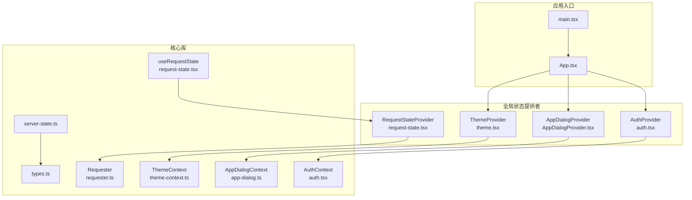
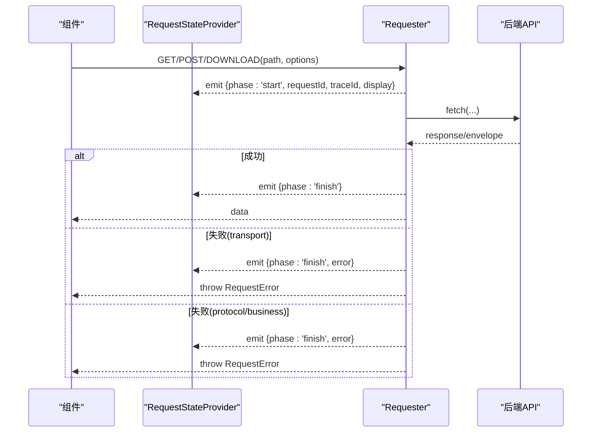
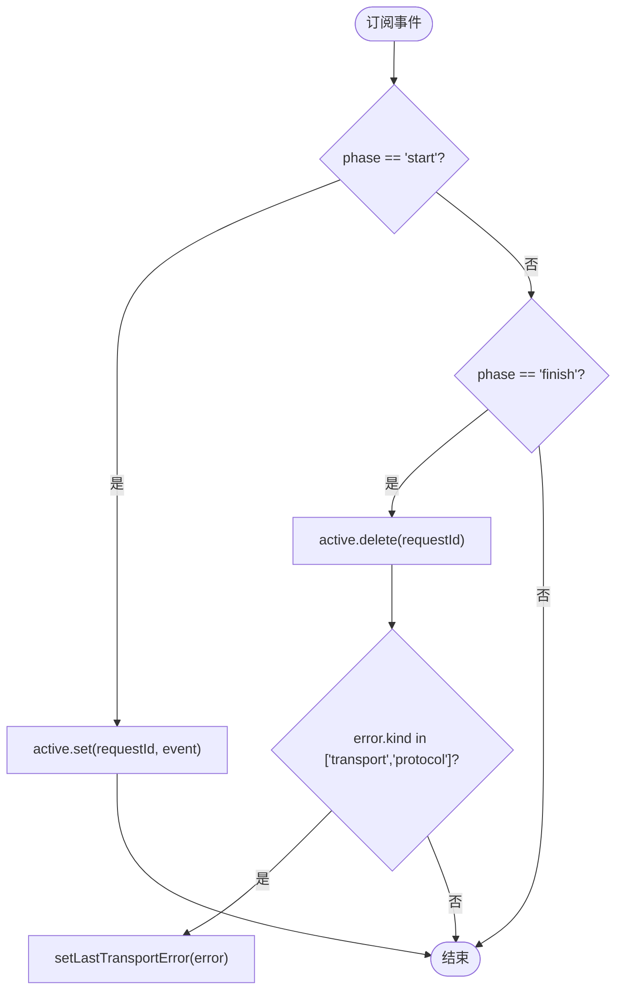
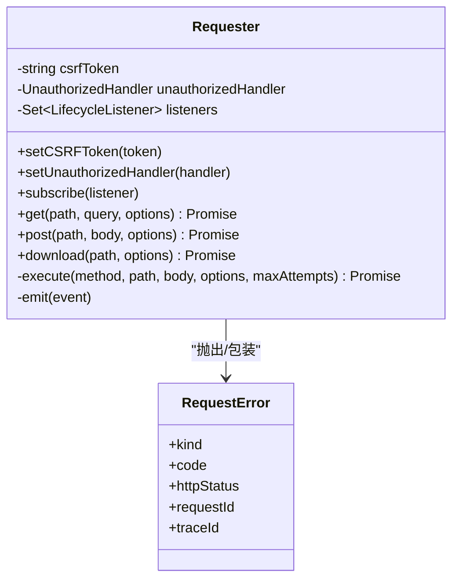
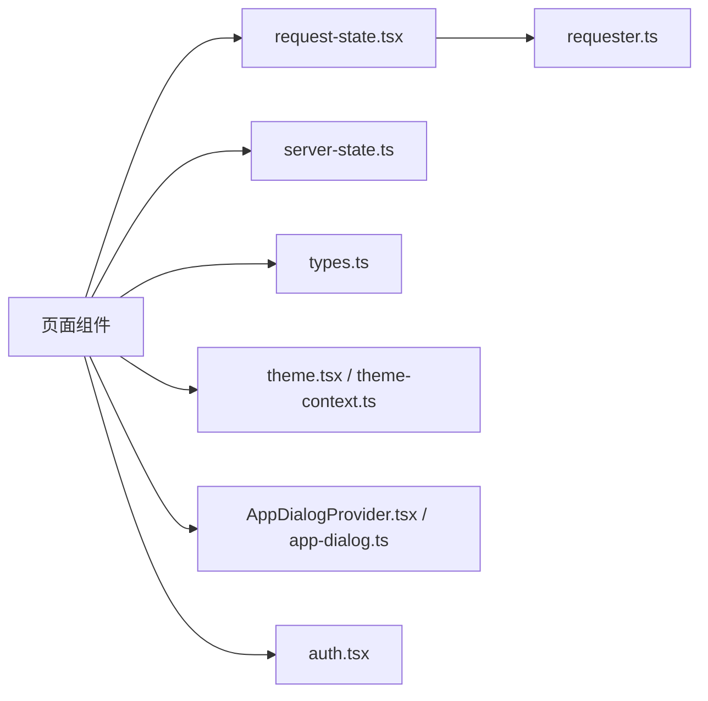

# 状态管理

<cite>
**本文引用的文件**   
- [request-state.tsx](file://src/frontend/src/lib/request-state.tsx)
- [requester.ts](file://src/frontend/src/lib/requester.ts)
- [server-state.ts](file://src/frontend/src/lib/server-state.ts)
- [types.ts](file://src/frontend/src/lib/types.ts)
- [theme-context.ts](file://src/frontend/src/lib/theme-context.ts)
- [theme.tsx](file://src/frontend/src/lib/theme.tsx)
- [app-dialog.ts](file://src/frontend/src/lib/app-dialog.ts)
- [AppDialogProvider.tsx](file://src/frontend/src/components/AppDialogProvider.tsx)
- [auth.tsx](file://src/frontend/src/lib/auth.tsx)
- [App.tsx](file://src/frontend/src/App.tsx)
- [main.tsx](file://src/frontend/src/main.tsx)
</cite>

## 目录
1. [简介](#简介)
2. [项目结构](#项目结构)
3. [核心组件](#核心组件)
4. [架构总览](#架构总览)
5. [详细组件分析](#详细组件分析)
6. [依赖关系分析](#依赖关系分析)
7. [性能考量](#性能考量)
8. [故障排查指南](#故障排查指南)
9. [结论](#结论)
10. [附录](#附录)

## 简介
本技术文档聚焦 Lattix-codex 前端的状态管理策略，覆盖本地状态、全局状态与服务端状态的统一治理。重点解析：
- RequestState 钩子与请求生命周期事件，用于统一管理异步请求的计数、错误与展示策略（前台/静默）。
- ServerState 工具函数，用于服务器连接状态的判断与标签化显示。
- 主题状态与对话框状态等应用级状态的管理方式。
- 认证状态与路由守卫的集成。
- 状态持久化、重置与调试方法，以及最佳实践与性能优化建议。

## 项目结构
前端采用 React + TypeScript，通过 Context API 提供全局状态，配合自定义 Hook 暴露给组件使用。关键目录与职责：
- lib/requester.ts：统一的 HTTP 请求封装，定义请求生命周期事件、错误模型与重试机制。
- lib/request-state.tsx：订阅请求生命周期，维护全局请求计数与最近一次传输错误。
- lib/server-state.ts：服务器连接状态的工具函数。
- lib/types.ts：服务端返回数据与业务实体的类型定义。
- lib/theme-context.ts / theme.tsx：主题状态与持久化。
- lib/app-dialog.ts / components/AppDialogProvider.tsx：应用级对话框状态管理。
- lib/auth.tsx：认证状态与未授权处理。
- App.tsx / main.tsx：应用根节点与 Provider 装配。

**图表来源** 
- [main.tsx:1-15](file://src/frontend/src/main.tsx#L1-L15)
- [App.tsx:1-73](file://src/frontend/src/App.tsx#L1-L73)
- [request-state.tsx:1-59](file://src/frontend/src/lib/request-state.tsx#L1-L59)
- [requester.ts:1-340](file://src/frontend/src/lib/requester.ts#L1-L340)
- [server-state.ts:1-23](file://src/frontend/src/lib/server-state.ts#L1-L23)
- [theme-context.ts:1-17](file://src/frontend/src/lib/theme-context.ts#L1-L17)
- [theme.tsx:1-38](file://src/frontend/src/lib/theme.tsx#L1-L38)
- [app-dialog.ts:1-31](file://src/frontend/src/lib/app-dialog.ts#L1-L31)
- [AppDialogProvider.tsx:1-90](file://src/frontend/src/components/AppDialogProvider.tsx#L1-L90)
- [auth.tsx:1-52](file://src/frontend/src/lib/auth.tsx#L1-L52)
- [types.ts:1-588](file://src/frontend/src/lib/types.ts#L1-L588)

**章节来源**
- [main.tsx:1-15](file://src/frontend/src/main.tsx#L1-L15)
- [App.tsx:1-73](file://src/frontend/src/App.tsx#L1-L73)

## 核心组件
- RequestStateProvider：订阅 requester 的生命周期事件，维护 active Map（按 requestId 跟踪 start/finish），统计 pendingCount 与 foregroundPendingCount，并记录 lastTransportError。
- Requester：封装 GET/POST/DOWNLOAD，统一错误分类（business/transport/protocol/cancelled），支持超时、取消信号、幂等键、CSRF 头、traceId/requestId 透传，失败时自动重试（仅 transport 错误）。
- server-state：提供 isServerOnline 与 serverConnectionLabel，将后端连接状态映射为可读文本。
- ThemeProvider：基于 localStorage 与 prefers-color-scheme 初始化主题，切换时更新 DOM class 与 colorScheme，并持久化。
- AppDialogProvider：集中管理 confirm/notice 对话框，使用 Promise 控制交互结果。
- AuthProvider：维护登录态 username 与 loading，监听未授权回调以清理状态。

**章节来源**
- [request-state.tsx:1-59](file://src/frontend/src/lib/request-state.tsx#L1-L59)
- [requester.ts:1-340](file://src/frontend/src/lib/requester.ts#L1-L340)
- [server-state.ts:1-23](file://src/frontend/src/lib/server-state.ts#L1-L23)
- [theme.tsx:1-38](file://src/frontend/src/lib/theme.tsx#L1-L38)
- [AppDialogProvider.tsx:1-90](file://src/frontend/src/components/AppDialogProvider.tsx#L1-L90)
- [auth.tsx:1-52](file://src/frontend/src/lib/auth.tsx#L1-L52)

## 架构总览
整体采用“单一请求源 + 全局状态上下文”的模式：
- 所有网络请求通过 Requester 发起，统一错误处理、重试与生命周期事件。
- RequestStateProvider 订阅事件，聚合全局请求计数与错误信息，供 UI 层展示加载指示或错误提示。
- 业务状态（如服务器列表、链路配置）由页面组件自行管理，并通过 Requester 调用后端 API。
- 应用级状态（主题、对话框、认证）通过 Context 提供，保证跨组件一致性。

**图表来源** 
- [requester.ts:157-225](file://src/frontend/src/lib/requester.ts#L157-L225)
- [request-state.tsx:21-39](file://src/frontend/src/lib/request-state.tsx#L21-L39)

## 详细组件分析

### RequestState 钩子与请求生命周期
- 设计要点：
  - 使用 Map<requestId, event> 追踪活跃请求，避免重复计数。
  - 区分 foreground/silent 展示策略，仅对 foreground 请求计数，便于区分用户可见的加载状态。
  - 捕获 transport/protocol 错误并记录 lastTransportError，供全局错误提示使用。
- 复杂度：
  - 每次事件触发 O(1) 更新 Map；统计时遍历 Map 值，O(n)，n 为活跃请求数，通常很小。
- 优化点：
  - 若活跃请求较多，可考虑用计数器替代 Map，但会丢失 display 字段统计能力。当前实现已足够高效。

**图表来源** 
- [request-state.tsx:21-39](file://src/frontend/src/lib/request-state.tsx#L21-L39)

**章节来源**
- [request-state.tsx:1-59](file://src/frontend/src/lib/request-state.tsx#L1-L59)
- [requester.ts:43-51](file://src/frontend/src/lib/requester.ts#L43-L51)

### Requester 请求封装与重试
- 功能特性：
  - 统一错误分类：business、transport、protocol、cancelled。
  - 支持 AbortSignal 与超时，组合父信号与定时器。
  - POST 自动设置 Content-Type、Idempotency-Key 与可选 CSRF Token。
  - 下载接口直接处理 Blob 与文件名提取，触发浏览器下载。
  - 失败重试：仅当错误类型为 transport 且未达到最大尝试次数时重试。
- 错误处理：
  - normalizeError 将 DOMException(AbortError) 转换为 cancelled，其他异常转为 transport 错误。
  - businessError 根据 envelope.code 区分业务错误与协议错误。
- 性能与安全：
  - 合理默认超时（GET/POST 15s，DOWNLOAD 30s），避免长时间阻塞。
  - 通过 requestId/traceId 透传，便于后端日志关联。

**图表来源** 
- [requester.ts:71-225](file://src/frontend/src/lib/requester.ts#L71-L225)
- [requester.ts:18-41](file://src/frontend/src/lib/requester.ts#L18-L41)

**章节来源**
- [requester.ts:1-340](file://src/frontend/src/lib/requester.ts#L1-L340)

### ServerState 服务器连接状态
- 提供 isServerOnline 快速判断是否在线。
- serverConnectionLabel 将枚举状态映射为用户可读文本，便于 UI 展示。

**章节来源**
- [server-state.ts:1-23](file://src/frontend/src/lib/server-state.ts#L1-L23)
- [types.ts:46-53](file://src/frontend/src/lib/types.ts#L46-L53)

### 主题状态与持久化
- 初始化策略：优先读取 localStorage，否则回退到系统偏好。
- 切换逻辑：更新 documentElement class 与 colorScheme，并持久化。
- 错误容忍：localStorage 不可用时不影响运行时主题。

**章节来源**
- [theme.tsx:1-38](file://src/frontend/src/lib/theme.tsx#L1-L38)
- [theme-context.ts:1-17](file://src/frontend/src/lib/theme-context.ts#L1-L17)

### 对话框状态与应用级交互
- AppDialogProvider 集中管理 confirm/notice 对话框，使用 Promise 控制确认结果。
- 支持 destructive 样式、自定义按钮文案，关闭时默认 resolve(false)。

**章节来源**
- [AppDialogProvider.tsx:1-90](file://src/frontend/src/components/AppDialogProvider.tsx#L1-L90)
- [app-dialog.ts:1-31](file://src/frontend/src/lib/app-dialog.ts#L1-L31)

### 认证状态与路由守卫
- AuthProvider 在启动时检查 me()，设置用户名与 loading。
- 监听未授权回调，清空用户名以触发重定向。
- RequireAuth 组件在路由层保护受保护页面。

**章节来源**
- [auth.tsx:1-52](file://src/frontend/src/lib/auth.tsx#L1-L52)
- [App.tsx:19-35](file://src/frontend/src/App.tsx#L19-L35)

## 依赖关系分析
- RequestStateProvider 依赖 requester 的事件订阅，不直接耦合具体 API。
- 各页面组件通过 useRequestState 获取全局请求状态，无需关心底层实现。
- ThemeProvider、AppDialogProvider、AuthProvider 相互独立，通过 App.tsx 组合装配。
- types.ts 作为契约层，被多处引用，确保前后端类型一致。

**图表来源** 
- [request-state.tsx:1-59](file://src/frontend/src/lib/request-state.tsx#L1-L59)
- [requester.ts:1-340](file://src/frontend/src/lib/requester.ts#L1-L340)
- [server-state.ts:1-23](file://src/frontend/src/lib/server-state.ts#L1-L23)
- [types.ts:1-588](file://src/frontend/src/lib/types.ts#L1-L588)
- [theme.tsx:1-38](file://src/frontend/src/lib/theme.tsx#L1-L38)
- [theme-context.ts:1-17](file://src/frontend/src/lib/theme-context.ts#L1-L17)
- [AppDialogProvider.tsx:1-90](file://src/frontend/src/components/AppDialogProvider.tsx#L1-L90)
- [app-dialog.ts:1-31](file://src/frontend/src/lib/app-dialog.ts#L1-L31)
- [auth.tsx:1-52](file://src/frontend/src/lib/auth.tsx#L1-L52)

**章节来源**
- [App.tsx:1-73](file://src/frontend/src/App.tsx#L1-L73)

## 性能考量
- 请求计数与错误统计：
  - 使用 Map 存储活跃请求，避免重复计算；统计时仅遍历必要字段。
  - foregroundPendingCount 过滤 display='foreground' 的请求，减少无关渲染。
- 重试与超时：
  - 仅对 transport 错误重试，避免业务错误的无效重试。
  - 合理超时时间降低长尾请求对用户体验的影响。
- 主题切换：
  - 使用 useLayoutEffect 避免闪烁，同步更新 DOM 类名与 colorScheme。
- 对话框状态：
  - 单例 Promise 模式避免多次弹窗冲突，提升交互确定性。

[本节为通用指导，不直接分析具体文件]

## 故障排查指南
- 请求失败定位：
  - 查看 lastTransportError 获取最近一次传输错误详情（含 code、message、traceId）。
  - 通过 requestId/traceId 在后端日志中关联请求链路。
- 未授权处理：
  - 检查 setOnUnauthorized 回调是否清空用户名，确保路由跳转至登录页。
- 主题持久化失败：
  - 在受限环境中 localStorage 可能不可用，需降级处理；当前实现已兼容。
- 对话框无响应：
  - 确认 resolverRef 是否正确 resolve，避免 Promise 悬挂。

**章节来源**
- [request-state.tsx:30-39](file://src/frontend/src/lib/request-state.tsx#L30-L39)
- [requester.ts:290-319](file://src/frontend/src/lib/requester.ts#L290-L319)
- [auth.tsx:18-26](file://src/frontend/src/lib/auth.tsx#L18-L26)
- [theme.tsx:22-30](file://src/frontend/src/lib/theme.tsx#L22-L30)
- [AppDialogProvider.tsx:51-56](file://src/frontend/src/components/AppDialogProvider.tsx#L51-L56)

## 结论
本状态管理体系通过统一的请求封装与全局状态上下文，实现了清晰的状态分层与良好的可维护性。RequestState 钩子简化了加载状态管理，ServerState 提供了直观的连接状态展示，主题与对话框状态确保了应用级交互的一致性。结合合理的错误处理、重试机制与持久化策略，开发者可以构建高效、健壮的前端状态管理系统。

[本节为总结，不直接分析具体文件]

## 附录
- 最佳实践：
  - 使用 useRequestState 统一管理加载状态，避免分散的 useState。
  - 通过 Requester 的 idempotencyKey 确保幂等操作。
  - 利用 traceId/requestId 贯穿前后端日志，便于问题定位。
- 性能优化建议：
  - 对频繁更新的列表数据，考虑分页与增量更新。
  - 避免在高频事件中创建新对象，使用 useMemo/useCallback 优化渲染。
  - 合理使用 display='silent' 减少不必要的加载指示。

[本节为通用指导，不直接分析具体文件]