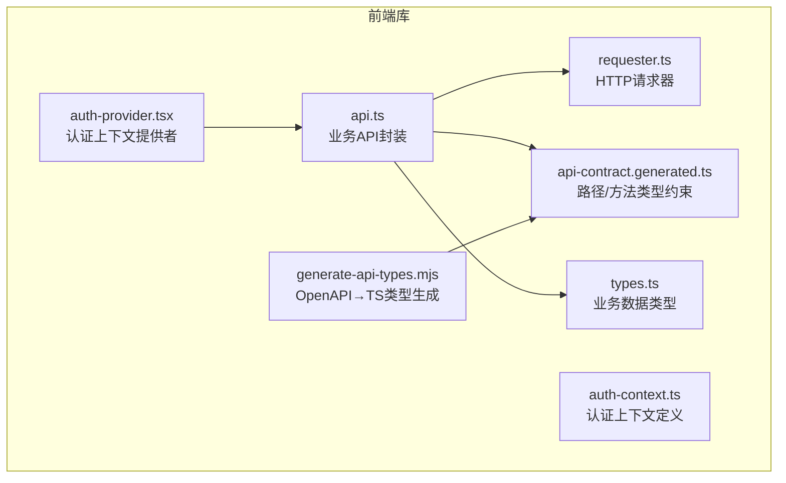
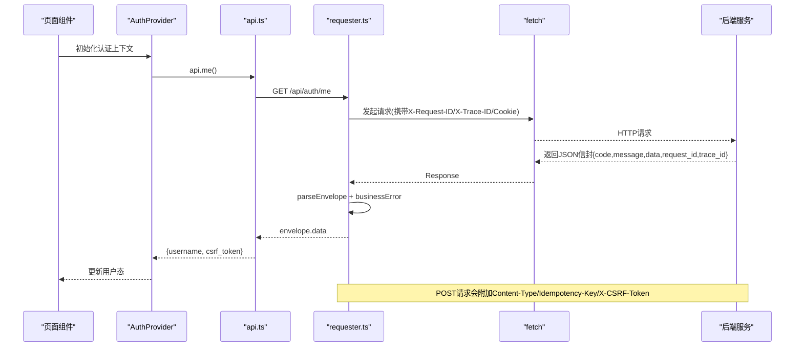
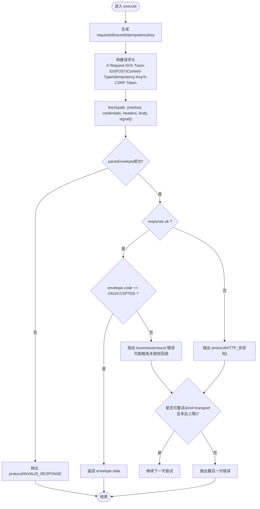
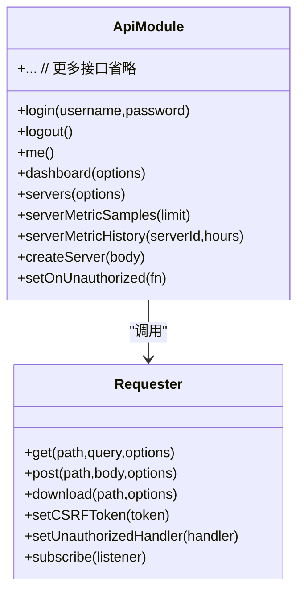
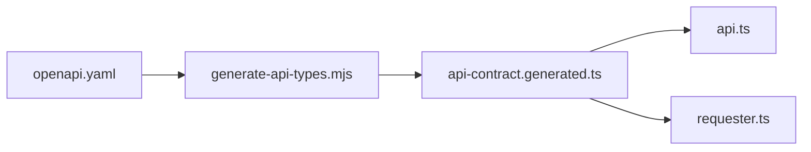
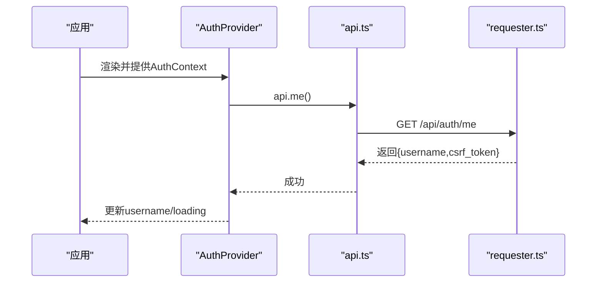
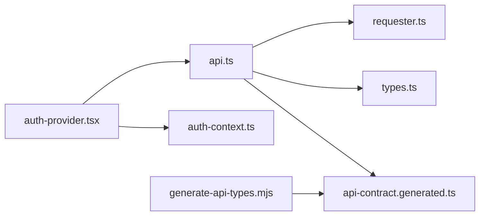

# HTTP API 客户端

<cite>
**本文引用的文件**   
- [api.ts](file://src/frontend/src/lib/api.ts)
- [requester.ts](file://src/frontend/src/lib/requester.ts)
- [api-contract.generated.ts](file://src/frontend/src/lib/api-contract.generated.ts)
- [types.ts](file://src/frontend/src/lib/types.ts)
- [generate-api-types.mjs](file://src/frontend/scripts/generate-api-types.mjs)
- [auth-provider.tsx](file://src/frontend/src/lib/auth-provider.tsx)
- [auth-context.ts](file://src/frontend/src/lib/auth-context.ts)
- [package.json](file://src/frontend/package.json)
</cite>

## 目录
1. [简介](#简介)
2. [项目结构](#项目结构)
3. [核心组件](#核心组件)
4. [架构总览](#架构总览)
5. [详细组件分析](#详细组件分析)
6. [依赖关系分析](#依赖关系分析)
7. [性能与并发控制](#性能与并发控制)
8. [故障排查指南](#故障排查指南)
9. [结论](#结论)
10. [附录：接口清单与使用示例](#附录接口清单与使用示例)

## 简介
本技术文档面向 Lattix-codex 前端 HTTP API 客户端，聚焦以下目标：
- 深入解析 api.ts 的 RESTful 封装设计、参数类型与返回值处理。
- 详解 requester.ts 的请求器实现：请求拦截、响应处理、错误分类与重试机制。
- 说明 CSRF Token 的自动注入与刷新逻辑。
- 解释请求配置选项（display、超时、并发控制等）。
- 提供正确使用各接口的实践示例与最佳实践建议，帮助避免常见网络问题。

## 项目结构
前端 HTTP 客户端位于 src/frontend/src/lib 目录下，关键文件职责如下：
- api.ts：按业务域暴露统一的 API 方法，封装对 requester 的调用，管理认证与会话状态。
- requester.ts：底层请求器，统一处理 fetch、信封解析、错误归一化、重试、生命周期事件与下载。
- api-contract.generated.ts：由 OpenAPI 生成的路径与方法类型约束，保证路径与方法的类型安全。
- types.ts：业务数据结构定义，供 api.ts 与页面层使用。
- generate-api-types.mjs：从 docs/openapi.yaml 生成类型契约，确保前后端契约一致性。
- auth-provider.tsx / auth-context.ts：认证上下文与提供者，集成未授权回调与登录态维护。

**图表来源** 
- [api.ts:1-294](file://src/frontend/src/lib/api.ts#L1-L294)
- [requester.ts:1-340](file://src/frontend/src/lib/requester.ts#L1-L340)
- [api-contract.generated.ts:1-800](file://src/frontend/src/lib/api-contract.generated.ts#L1-L800)
- [types.ts:1-588](file://src/frontend/src/lib/types.ts#L1-L588)
- [generate-api-types.mjs:1-79](file://src/frontend/scripts/generate-api-types.mjs#L1-L79)
- [auth-provider.tsx:1-36](file://src/frontend/src/lib/auth-provider.tsx#L1-L36)
- [auth-context.ts:1-19](file://src/frontend/src/lib/auth-context.ts#L1-L19)

**章节来源**
- [api.ts:1-294](file://src/frontend/src/lib/api.ts#L1-L294)
- [requester.ts:1-340](file://src/frontend/src/lib/requester.ts#L1-L340)
- [api-contract.generated.ts:1-800](file://src/frontend/src/lib/api-contract.generated.ts#L1-L800)
- [types.ts:1-588](file://src/frontend/src/lib/types.ts#L1-L588)
- [generate-api-types.mjs:1-79](file://src/frontend/scripts/generate-api-types.mjs#L1-L79)
- [auth-provider.tsx:1-36](file://src/frontend/src/lib/auth-provider.tsx#L1-L36)
- [auth-context.ts:1-19](file://src/frontend/src/lib/auth-context.ts#L1-L19)

## 核心组件
- Requester（请求器）
  - 提供 get/post/download 三种能力，统一构造请求头、序列化 body、附加 X-Request-ID/X-Trace-ID/Idempotency-Key/X-CSRF-Token。
  - 支持 RequestOptions：signal、timeoutMs、display、traceId、idempotencyKey。
  - 内置重试：仅对 transport 类错误重试，GET 最多 2 次，POST 最多 1 次。
  - 统一错误分类：business、transport、protocol、cancelled，并附带 requestId/traceId/httpStatus。
  - 生命周期事件：start/finish，便于监控与调试。
  - 下载流程：根据 Content-Type 判断 JSON 或二进制；非 JSON 时触发浏览器下载。

- API 封装（api.ts）
  - 以模块形式导出 login/logout/me/dashboard/servers/chains/nodes/users/settings/panel/log 等方法。
  - 自动管理 CSRF Token：login/me 成功后设置，logout/changePassword 后清空。
  - 暴露 setOnUnauthorized 钩子，用于全局未授权处理（如跳转登录页）。
  - 为高频轮询接口默认设置 display:'silent'，避免 UI 干扰。

- 类型契约（api-contract.generated.ts）
  - 基于 OpenAPI 生成 RPCCode、RPCEnvelope、RPCPathByMethod 等类型，确保 path/method 强类型校验。
  - 提供 isRPCCode 判定与 rpcOperations 映射，辅助运行时校验与工具链。

- 业务类型（types.ts）
  - 集中定义 DashboardStats、Server、Chain、XrayNode、PanelSettings、OperationLogPage、RequestLogPage 等。

**章节来源**
- [requester.ts:1-340](file://src/frontend/src/lib/requester.ts#L1-L340)
- [api.ts:1-294](file://src/frontend/src/lib/api.ts#L1-L294)
- [api-contract.generated.ts:1-800](file://src/frontend/src/lib/api-contract.generated.ts#L1-L800)
- [types.ts:1-588](file://src/frontend/src/lib/types.ts#L1-L588)

## 架构总览
下图展示从页面到后端的核心调用链路，包括认证、CSRF 注入、信封解析与错误处理。

**图表来源** 
- [auth-provider.tsx:1-36](file://src/frontend/src/lib/auth-provider.tsx#L1-L36)
- [api.ts:58-73](file://src/frontend/src/lib/api.ts#L58-L73)
- [requester.ts:157-220](file://src/frontend/src/lib/requester.ts#L157-L220)
- [requester.ts:227-265](file://src/frontend/src/lib/requester.ts#L227-L265)

## 详细组件分析

### 请求器（requester.ts）深度解析
- 请求构建
  - GET：拼接 URLSearchParams，默认最大尝试次数 2。
  - POST：设置 Content-Type=application/json，追加 Idempotency-Key（默认自动生成），若存在 CSRF Token 则注入 X-CSRF-Token。
  - DOWNLOAD：直接 GET 流式下载，按 Content-Type 区分 JSON 失败分支与二进制下载分支。
- 超时与取消
  - combinedSignal 将外部 AbortSignal 与内部 timeoutMs 合并，超时或父信号触发均中止请求。
- 重试策略
  - 仅当 lastError.kind === 'transport' 且 attempt+1 < maxAttempts 时重试。
  - GET 默认 maxAttempts=2，POST 默认 maxAttempts=1。
- 信封解析与错误分类
  - parseEnvelope 严格校验 code/message/data/request_id/trace_id 字段，非法则抛出 INVALID_RESPONSE。
  - businessError 将业务码与协议码区分，AUTH_REQUIRED 触发未授权处理器。
  - normalizeError 将 DOMException(AbortError) 归类为 cancelled，其他网络异常归类为 transport。
- 生命周期事件
  - emit({phase:'start'|'finish', ...}) 供订阅者收集指标与日志。

**图表来源** 
- [requester.ts:157-220](file://src/frontend/src/lib/requester.ts#L157-L220)
- [requester.ts:227-265](file://src/frontend/src/lib/requester.ts#L227-L265)
- [requester.ts:301-319](file://src/frontend/src/lib/requester.ts#L301-L319)

**章节来源**
- [requester.ts:1-340](file://src/frontend/src/lib/requester.ts#L1-L340)

### API 封装（api.ts）深度解析
- 认证与会话
  - login：POST /api/auth/login，成功后通过 requester.setCSRFToken(result.csrf_token) 注入 CSRF。
  - logout：POST /api/auth/logout，成功后清空 CSRF。
  - me：GET /api/auth/me，成功后刷新 CSRF。
- 业务接口分组
  - 仪表盘：dashboard
  - 服务器：servers/serverMetricSamples/serverMetricHistory/createServer/rotateServerToken/upgradeServer/upgradeAgent/releaseVersions/serverCommands/repair/updateServerAddress/updateServerPorts/deleteServer/confirmServerRenewal/providers/createProvider/updateProvider/deleteProvider/exchangeRates/refreshExchangeRates/saveCustomExchangeRate/deleteCustomExchangeRate
  - 链路：chains/createChain/editChain/forcePublishChain/resetChainTraffic/chainTrafficHistory/retry/deleteChain
  - 节点：nodes/createNode/retry/deleteNode
  - 用户：users/createUser/updateUserExpiry/setUserDisabled/setUserNodes/deleteUser
  - 设置：settings/updateSettings/changePassword/testAlerts
  - 面板：restartPanel/panelState/panelVersion/startPanelUpdate/panelUpdateStatus
  - 日志：operationLogs/clearOperationLogs/requestLogs/clearRequestLogs
  - 备份：downloadBackup
- 显示控制
  - 高频轮询接口默认 options.display='silent'，避免 UI 提示干扰。
- 未授权处理
  - setOnUnauthorized(fn)：在 Requester 中注册回调，收到 AUTH_REQUIRED 时执行（通常清空 CSRF 并跳转登录）。

**图表来源** 
- [api.ts:58-289](file://src/frontend/src/lib/api.ts#L58-L289)
- [requester.ts:71-225](file://src/frontend/src/lib/requester.ts#L71-L225)

**章节来源**
- [api.ts:1-294](file://src/frontend/src/lib/api.ts#L1-L294)

### 类型契约与生成（api-contract.generated.ts & generate-api-types.mjs）
- 生成流程
  - 读取 docs/openapi.yaml，提取 RPCCode 枚举与 operations（operationId/method/path）。
  - 使用 openapi-typescript 生成 components 类型，并追加 RPCCode/RPCEnvelope/RPCPathByMethod 等自定义类型。
  - 支持 --check 模式，确保生成文件与源码一致。
- 类型安全
  - RPCPathByMethod<'GET'>/<'POST'> 限制 path 与方法匹配，防止误用。
  - isRPCCode 用于运行时判定 code 是否为合法业务码。

**图表来源** 
- [generate-api-types.mjs:1-79](file://src/frontend/scripts/generate-api-types.mjs#L1-L79)
- [api-contract.generated.ts:1-800](file://src/frontend/src/lib/api-contract.generated.ts#L1-L800)

**章节来源**
- [generate-api-types.mjs:1-79](file://src/frontend/scripts/generate-api-types.mjs#L1-L79)
- [api-contract.generated.ts:1-800](file://src/frontend/src/lib/api-contract.generated.ts#L1-L800)

### 认证上下文（auth-provider.tsx & auth-context.ts）
- 启动时调用 api.me() 恢复会话，并注册 setOnUnauthorized 回调清空用户名。
- login/logout 分别调用 api.login/api.logout，并在成功后更新 username。
- 通过 Context 暴露 useAuth 钩子供页面消费。

**图表来源** 
- [auth-provider.tsx:1-36](file://src/frontend/src/lib/auth-provider.tsx#L1-L36)
- [api.ts:58-73](file://src/frontend/src/lib/api.ts#L58-L73)

**章节来源**
- [auth-provider.tsx:1-36](file://src/frontend/src/lib/auth-provider.tsx#L1-L36)
- [auth-context.ts:1-19](file://src/frontend/src/lib/auth-context.ts#L1-L19)

## 依赖关系分析
- 模块耦合
  - api.ts 依赖 requester.ts 与 types.ts，并通过 api-contract.generated.ts 获得路径/方法类型约束。
  - auth-provider.tsx 依赖 api.ts 与 auth-context.ts。
  - generate-api-types.mjs 独立于运行时，仅在构建期生成类型。
- 外部依赖
  - package.json 声明了构建与开发依赖（vite、openapi-typescript、vitest 等）。

**图表来源** 
- [api.ts:1-294](file://src/frontend/src/lib/api.ts#L1-L294)
- [requester.ts:1-340](file://src/frontend/src/lib/requester.ts#L1-L340)
- [types.ts:1-588](file://src/frontend/src/lib/types.ts#L1-L588)
- [api-contract.generated.ts:1-800](file://src/frontend/src/lib/api-contract.generated.ts#L1-L800)
- [auth-provider.tsx:1-36](file://src/frontend/src/lib/auth-provider.tsx#L1-L36)
- [auth-context.ts:1-19](file://src/frontend/src/lib/auth-context.ts#L1-L19)
- [generate-api-types.mjs:1-79](file://src/frontend/scripts/generate-api-types.mjs#L1-L79)
- [package.json:1-56](file://src/frontend/package.json#L1-L56)

**章节来源**
- [package.json:1-56](file://src/frontend/package.json#L1-L56)

## 性能与并发控制
- 超时控制
  - 默认超时：GET/POST 15s，DOWNLOAD 30s，可通过 options.timeoutMs 覆盖。
  - 支持外部 AbortSignal 与内部超时合并，避免悬挂请求。
- 重试机制
  - 仅对 transport 错误重试，GET 最多 2 次，POST 最多 1 次，避免幂等性风险。
- 并发控制
  - 当前无全局并发限制；如需限流可在上层使用队列或信号量。
- 显示控制
  - display:'silent' 抑制 UI 提示，适合轮询与后台任务。
- 资源释放
  - download 分支创建 ObjectURL 后立即 revoke，避免内存泄漏。

[本节为通用指导，不直接分析具体文件]

## 故障排查指南
- 常见错误分类
  - business：业务错误（如 AUTH_REQUIRED、参数校验失败）。
  - transport：网络不可达、DNS/连接失败。
  - protocol：服务端响应不符合信封格式或 HTTP 状态码异常。
  - cancelled：请求被取消或超时。
- 定位手段
  - 通过 RequestError.requestId/traceId 在后端日志中追踪请求。
  - 订阅 Requester 的生命周期事件，记录 start/finish 与 error。
- 未授权处理
  - 使用 setOnUnauthorized 清空 CSRF 并跳转到登录页。
- 下载失败
  - 检查 Content-Type 是否为 JSON（此时应视为错误），否则走二进制下载分支。

**章节来源**
- [requester.ts:18-41](file://src/frontend/src/lib/requester.ts#L18-L41)
- [requester.ts:290-319](file://src/frontend/src/lib/requester.ts#L290-L319)
- [api.ts:38-47](file://src/frontend/src/lib/api.ts#L38-L47)

## 结论
该 HTTP API 客户端通过分层设计实现了高内聚、低耦合的网络访问能力：
- api.ts 专注业务语义与认证状态管理。
- requester.ts 专注网络细节、错误分类与可靠性保障。
- 类型契约由 OpenAPI 驱动，确保前后端一致性。
- 通过 display、超时、重试与生命周期事件，兼顾可用性与可观测性。
遵循本文的最佳实践，可有效降低网络请求问题的发生概率，提升用户体验与排障效率。

[本节为总结，不直接分析具体文件]

## 附录：接口清单与使用示例

### 认证相关
- 登录
  - 方法：POST /api/auth/login
  - 入参：{ username, password }
  - 返回：{ username, csrf_token }
  - 副作用：自动设置 CSRF Token
  - 参考路径：[api.ts:59-63](file://src/frontend/src/lib/api.ts#L59-L63)
- 登出
  - 方法：POST /api/auth/logout
  - 入参：{}
  - 返回：void
  - 副作用：清空 CSRF Token
  - 参考路径：[api.ts:64-68](file://src/frontend/src/lib/api.ts#L64-L68)
- 获取当前用户
  - 方法：GET /api/auth/me
  - 入参：无
  - 返回：{ username, csrf_token }
  - 副作用：刷新 CSRF Token
  - 参考路径：[api.ts:69-73](file://src/frontend/src/lib/api.ts#L69-L73)

### 服务器管理
- 列表
  - 方法：GET /api/server/list
  - 入参：无
  - 返回：Server[]
  - 参考路径：[api.ts:77](file://src/frontend/src/lib/api.ts#L77)
- 创建
  - 方法：POST /api/server/create
  - 入参：CreateServerResponse 对应 body
  - 返回：CreateServerResponse
  - 参考路径：[api.ts:89-99](file://src/frontend/src/lib/api.ts#L89-L99)
- 更新地址
  - 方法：POST /api/server/update
  - 入参：包含 server_id、alias、address、tags、country_code、location、billing、traffic_plan
  - 返回：Server
  - 参考路径：[api.ts:121-140](file://src/frontend/src/lib/api.ts#L121-L140)
- 删除
  - 方法：POST /api/server/delete
  - 入参：{ server_id, purge }
  - 返回：void
  - 参考路径：[api.ts:163-164](file://src/frontend/src/lib/api.ts#L163-L164)

### 链路管理
- 列表
  - 方法：GET /api/chain/list
  - 入参：无
  - 返回：Chain[]
  - 参考路径：[api.ts:182](file://src/frontend/src/lib/api.ts#L182)
- 创建
  - 方法：POST /api/chain/create
  - 入参：CreateChainRequest
  - 返回：Chain
  - 参考路径：[api.ts:183](file://src/frontend/src/lib/api.ts#L183)
- 编辑
  - 方法：POST /api/chain/edit
  - 入参：EditChainRequest
  - 返回：Chain
  - 参考路径：[api.ts:184](file://src/frontend/src/lib/api.ts#L184)
- 删除
  - 方法：POST /api/chain/delete
  - 入参：{ chain_id }
  - 返回：void
  - 参考路径：[api.ts:197-198](file://src/frontend/src/lib/api.ts#L197-L198)

### 节点管理
- 列表
  - 方法：GET /api/node/list
  - 入参：无
  - 返回：XrayNode[]
  - 参考路径：[api.ts:200](file://src/frontend/src/lib/api.ts#L200)
- 创建
  - 方法：POST /api/node/create
  - 入参：CreateNodeRequest
  - 返回：XrayNode
  - 参考路径：[api.ts:201](file://src/frontend/src/lib/api.ts#L201)
- 删除
  - 方法：POST /api/node/delete
  - 入参：{ node_id }
  - 返回：void
  - 参考路径：[api.ts:204-205](file://src/frontend/src/lib/api.ts#L204-L205)

### 用户管理
- 列表
  - 方法：GET /api/user/list
  - 入参：无
  - 返回：SubUser[]
  - 参考路径：[api.ts:207](file://src/frontend/src/lib/api.ts#L207)
- 创建
  - 方法：POST /api/user/create
  - 入参：{ name, expires_at?, node_ids? }
  - 返回：SubUser
  - 参考路径：[api.ts:208-213](file://src/frontend/src/lib/api.ts#L208-L213)
- 删除
  - 方法：POST /api/user/delete
  - 入参：{ user_id }
  - 返回：void
  - 参考路径：[api.ts:226-227](file://src/frontend/src/lib/api.ts#L226-L227)

### 设置与面板
- 获取设置
  - 方法：GET /api/setting/get
  - 入参：无
  - 返回：PanelSettings
  - 参考路径：[api.ts:229](file://src/frontend/src/lib/api.ts#L229)
- 更新设置
  - 方法：POST /api/setting/update
  - 入参：UpdateSettingsRequest
  - 返回：PanelSettings
  - 参考路径：[api.ts:230-231](file://src/frontend/src/lib/api.ts#L230-L231)
- 修改密码
  - 方法：POST /api/setting/change-password
  - 入参：{ current_password, new_password }
  - 返回：void
  - 副作用：清空 CSRF Token
  - 参考路径：[api.ts:232-239](file://src/frontend/src/lib/api.ts#L232-L239)
- 重启面板
  - 方法：POST /api/panel/restart
  - 入参：{}
  - 返回：{ status }
  - 参考路径：[api.ts:240](file://src/frontend/src/lib/api.ts#L240)
- 面板版本
  - 方法：GET /api/panel/get-version
  - 入参：无
  - 返回：PanelVersionInfo
  - 参考路径：[api.ts:246](file://src/frontend/src/lib/api.ts#L246)
- 开始更新
  - 方法：POST /api/panel/start-update
  - 入参：{ version? }
  - 返回：PanelUpdateStatus
  - 参考路径：[api.ts:247-248](file://src/frontend/src/lib/api.ts#L247-L248)
- 更新状态
  - 方法：GET /api/panel/get-update-status
  - 入参：无
  - 返回：PanelUpdateStatus
  - 参考路径：[api.ts:249-252](file://src/frontend/src/lib/api.ts#L249-L252)

### 日志与备份
- 操作日志
  - 方法：GET /api/log/list-operations
  - 入参：severity/category/server_id/operator/q/from/to/limit/offset
  - 返回：OperationLogPage
  - 参考路径：[api.ts:254-279](file://src/frontend/src/lib/api.ts#L254-L279)
- 请求日志
  - 方法：GET /api/log/list-requests
  - 入参：limit (10|30|50|100)
  - 返回：RequestLogPage
  - 参考路径：[api.ts:281-286](file://src/frontend/src/lib/api.ts#L281-L286)
- 下载备份
  - 方法：GET /api/backup/download
  - 行为：浏览器触发下载，文件名来自 Content-Disposition
  - 参考路径：[api.ts:288](file://src/frontend/src/lib/api.ts#L288)

### 使用示例（代码片段路径）
- 登录并保存 CSRF
  - 参考路径：[api.ts:59-63](file://src/frontend/src/lib/api.ts#L59-L63)
- 获取服务器指标样本（静默显示）
  - 参考路径：[api.ts:78-81](file://src/frontend/src/lib/api.ts#L78-L81)
- 创建链路
  - 参考路径：[api.ts:183](file://src/frontend/src/lib/api.ts#L183)
- 下载备份
  - 参考路径：[api.ts:288](file://src/frontend/src/lib/api.ts#L288)

### 最佳实践建议
- 始终使用 api.ts 暴露的方法，不要绕过 requester 直接调用 fetch。
- 对需要幂等的 POST 请求，传入 idempotencyKey 以避免重复提交。
- 对轮询或后台任务，设置 display:'silent' 避免不必要的 UI 提示。
- 合理设置 timeoutMs，避免长耗时请求阻塞界面。
- 捕获 RequestError 并按 kind/code 分类处理，结合 requestId/traceId 进行日志追踪。
- 在应用启动时注册 setOnUnauthorized，确保未授权时及时清理状态并引导登录。

[本节为通用指导，不直接分析具体文件]