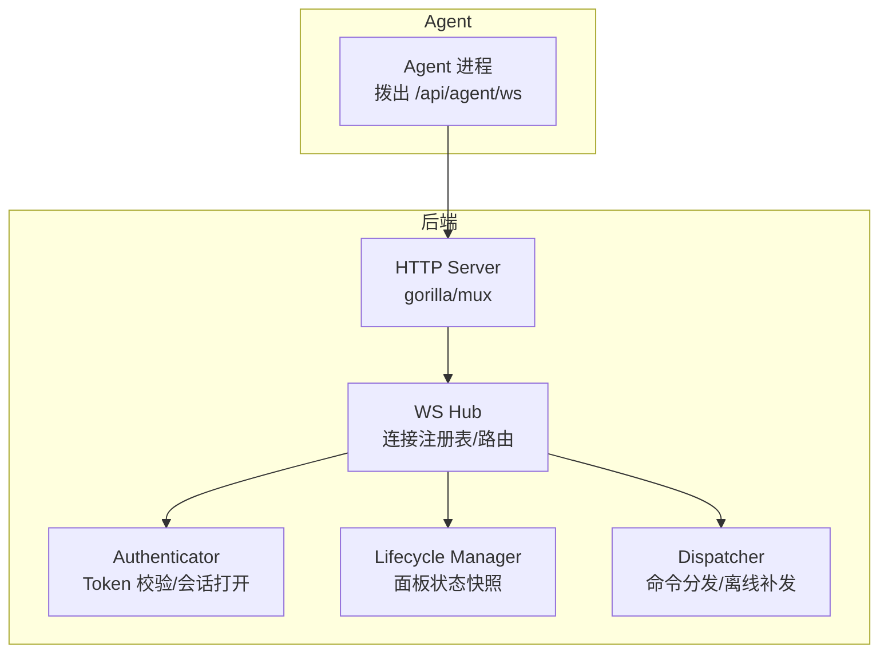
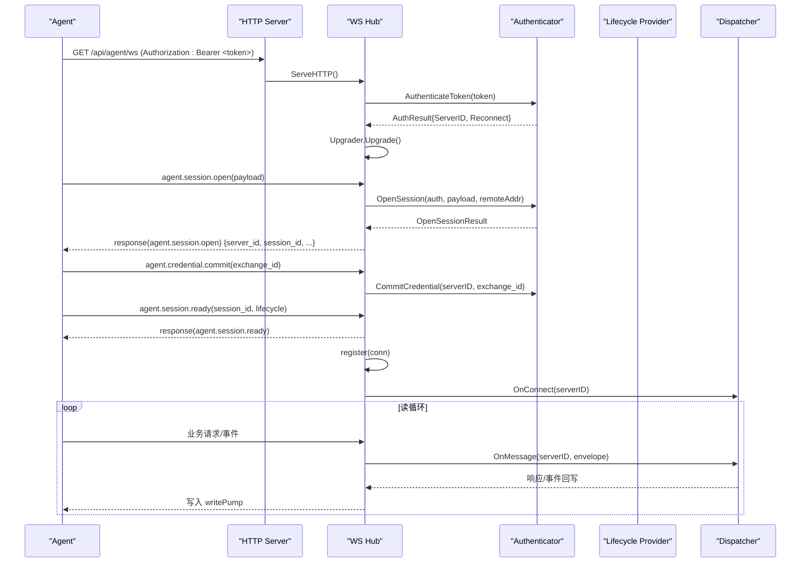
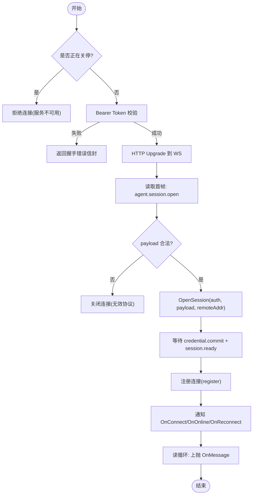
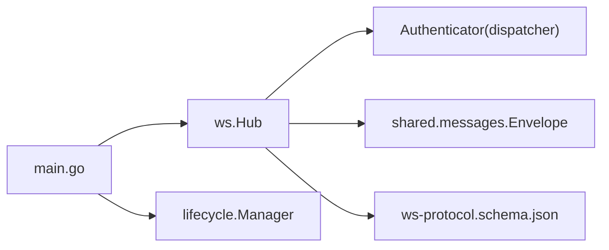

# WebSocket 实时通信

<cite>
**本文引用的文件**   
- [hub.go](file://src/backend/internal/ws/hub.go)
- [agent.go](file://src/backend/internal/ws/agent.go)
- [requester.go](file://src/backend/internal/ws/requester.go)
- [messages.go](file://src/shared/messages.go)
- [ws-protocol.schema.json](file://docs/ws-protocol.schema.json)
- [main.go](file://src/backend/cmd/backend/main.go)
- [manager.go](file://src/backend/internal/lifecycle/manager.go)
- [auth.go](file://src/backend/internal/panel/auth.go)
- [hub_test.go](file://src/backend/internal/ws/hub_test.go)
- [agent_test.go](file://src/backend/internal/ws/agent_test.go)
</cite>

## 目录
1. [简介](#简介)
2. [项目结构](#项目结构)
3. [核心组件](#核心组件)
4. [架构总览](#架构总览)
5. [详细组件分析](#详细组件分析)
6. [依赖关系分析](#依赖关系分析)
7. [性能与资源管理](#性能与资源管理)
8. [调试与故障排查](#调试与故障排查)
9. [结论](#结论)
10. [附录：协议与消息格式](#附录协议与消息格式)

## 简介
本文件面向 Lattix-codex 的 WebSocket 实时通信机制，聚焦后端 Hub 的设计与实现、Agent 与后端的 WS 通信协议、连接管理与广播机制、中间件认证与权限控制、以及调试与排错方法。文档以代码为依据，提供架构图、序列图与流程图，帮助开发者快速理解与维护该子系统。

## 项目结构
WebSocket 相关代码主要位于后端模块的 ws 包，配合共享协议定义与生命周期管理：
- ws 包：Hub（连接注册表与路由）、Agent 握手与会话建立、Requester 接口与错误定义
- shared：统一信封 Envelope、业务类型常量、载荷结构体
- lifecycle：面板生命周期快照与状态机
- main：HTTP 路由、WS 端点挂载、中间件与优雅关停
- panel/auth：Web 会话与 CSRF 等认证中间件（用于 Web API，非 Agent WS）



图表来源
- [main.go:372-382](file://src/backend/cmd/backend/main.go#L372-L382)
- [hub.go:26-63](file://src/backend/internal/ws/hub.go#L26-L63)
- [requester.go:18-43](file://src/backend/internal/ws/requester.go#L18-L43)
- [manager.go:18-28](file://src/backend/internal/lifecycle/manager.go#L18-L28)

章节来源
- [main.go:372-382](file://src/backend/cmd/backend/main.go#L372-L382)
- [hub.go:26-63](file://src/backend/internal/ws/hub.go#L26-L63)
- [requester.go:18-43](file://src/backend/internal/ws/requester.go#L18-L43)
- [manager.go:18-28](file://src/backend/internal/lifecycle/manager.go#L18-L28)

## 核心组件
- Hub：维护 Agent 连接映射、在线状态快照、发送队列与写泵；提供 Send/IsOnline/SyncLifecycle/BeginDrain/CloseAllAgents/ForgetAgent 等方法；通过回调 OnConnect/OnOnline/OnReconnect/OnDisconnect/OnMessage/OnProtocolError 与上层交互。
- Authenticator：由 dispatcher 注入，负责 Token 校验、OpenSession、Credential Commit。
- LifecycleProvider：提供 Panel 生命周期快照，用于阻断非活跃期业务命令与同步生命周期变更。
- Shared Envelope：统一 RPC 信封，包含 kind/type/request_id/trace_id/code/message/data，并严格校验。
- Protocol Schema：JSON Schema 定义了所有 WS 消息结构与约束。

章节来源
- [hub.go:26-63](file://src/backend/internal/ws/hub.go#L26-L63)
- [requester.go:18-43](file://src/backend/internal/ws/requester.go#L18-L43)
- [messages.go:14-137](file://src/shared/messages.go#L14-L137)
- [ws-protocol.schema.json:106-132](file://docs/ws-protocol.schema.json#L106-L132)

## 架构总览
Agent 主动拨出至后端 /api/agent/ws，完成 HTTP Upgrade 与鉴权后进入应用层握手（session.open → session.ready），随后进入长连接读循环。Hub 将业务信封投递到每个连接的发送队列，writePump 串行写出，避免并发写冲突。面板启动时通过 SyncLifecycle 向在线 Agent 广播生命周期变更，并在重启/故障时优雅关闭连接。



图表来源
- [agent.go:33-239](file://src/backend/internal/ws/agent.go#L33-L239)
- [hub.go:232-279](file://src/backend/internal/ws/hub.go#L232-L279)
- [requester.go:36-43](file://src/backend/internal/ws/requester.go#L36-L43)
- [main.go:253-325](file://src/backend/cmd/backend/main.go#L253-L325)

## 详细组件分析

### Hub 连接管理与广播
- 连接注册与踢旧：register 在同一 serverID 已有连接时关闭旧连接，确保单连接语义；unregister 在真实 offline→online 跃迁时触发 OnDisconnect。
- 发送队列与写泵：Send 将信封入队，writePump 串行写出；队列满视为慢连接直接断开，重连后可补发。
- 生命周期保护：Panel 处于 startup/faulted 时拒绝业务命令（isBusinessCommand），允许控制类消息。
- 优雅关停：BeginDrain 设置 draining 标志，拒绝新工作并关闭所有连接（RFC 6455 code 1012），Wait 等待 goroutine 退出。
- 连接快照：states 记录 everConnected/online/offline 及 session 信息，供外部查询。

```mermaid
classDiagram
class Hub {
+Authenticator Auth
+LifecycleProvider Lifecycle
+OnUpgrade(r)
+OnConnect(serverID)
+OnOnline(serverID)
+OnReconnect(serverID)
+OnMessage(serverID, envelope)
+OnProtocolError(serverID, requestID, traceID, rpcType, message)
+OnDisconnect(serverID)
+Send(ctx, serverID, envelope) error
+IsOnline(serverID) bool
+SyncLifecycle(ctx, snapshot) []int64
+BeginDrain()
+Wait(ctx) error
+CloseAgent(serverID, code, reason)
+ForgetAgent(serverID, code, reason)
+CloseAllAgents(code, reason)
}
class agentConn {
-hub *Hub
-serverID int64
-sessionID string
-sessionKind string
-ws *websocket.Conn
-send chan Envelope
-done chan struct{}
-lifecycleAcks map[string]chan struct{}
+writePump()
+close()
+closeWithCode(code, reason)
+registerLifecycleAck(requestID) <-chan struct{}
+resolveLifecycleAck(requestID) bool
+removeLifecycleAck(requestID)
}
Hub --> agentConn : "管理多个连接"
```

图表来源
- [hub.go:26-63](file://src/backend/internal/ws/hub.go#L26-L63)
- [hub.go:282-319](file://src/backend/internal/ws/hub.go#L282-L319)
- [hub.go:398-413](file://src/backend/internal/ws/hub.go#L398-L413)

章节来源
- [hub.go:111-154](file://src/backend/internal/ws/hub.go#L111-L154)
- [hub.go:156-193](file://src/backend/internal/ws/hub.go#L156-L193)
- [hub.go:232-279](file://src/backend/internal/ws/hub.go#L232-L279)
- [hub.go:320-378](file://src/backend/internal/ws/hub.go#L320-L378)

### Agent 握手与会话流程
- HTTP 升级前鉴权：Bearer Token 解析与调用 Authenticator.AuthenticateToken。
- 应用层握手：首帧必须为 agent.session.open，校验 protocol_version=1；随后接受 credential.commit 与 session.ready。
- 心跳检测：Agent 主动 Ping，Hub 原样 Pong，并以收到的控制帧续期读超时（默认 90s）。
- 错误处理：握手失败返回结构化 RPC 信封（含 Code/Message），协议错误通过 OnProtocolError 上报。



图表来源
- [agent.go:33-239](file://src/backend/internal/ws/agent.go#L33-L239)
- [agent.go:264-285](file://src/backend/internal/ws/agent.go#L264-L285)

章节来源
- [agent.go:33-239](file://src/backend/internal/ws/agent.go#L33-L239)
- [agent.go:255-262](file://src/backend/internal/ws/agent.go#L255-L262)
- [agent.go:302-329](file://src/backend/internal/ws/agent.go#L302-L329)

### 消息路由与广播
- 路由：Hub.OnMessage 交由 dispatcher.HandleMessage 处理，按 type 分派到具体业务逻辑。
- 广播：SyncLifecycle 向所有在线 Agent 下发 panel.lifecycle.changed，等待 ACK 或超时，返回缺失列表。
- 事件：telemetry.report、agent.settings.changed 等事件由 Agent 主动上报，Hub 透传至上层。

章节来源
- [hub.go:320-378](file://src/backend/internal/ws/hub.go#L320-L378)
- [main.go:299-300](file://src/backend/cmd/backend/main.go#L299-L300)

### 连接池与资源清理
- 连接池：conns 映射 serverID→agentConn；states 保存连接快照（state/session_id/session_kind/changed_at）。
- 清理：unregister 删除连接并更新快照；ForgetAgent 强制移除连接与快照；CloseAllAgents 批量关闭；BeginDrain 优雅关停。
- 防泄漏：writePump 与 done channel 保证 goroutine 退出；once 保证 close/closeWithCode 幂等。

章节来源
- [hub.go:232-279](file://src/backend/internal/ws/hub.go#L232-L279)
- [hub.go:205-228](file://src/backend/internal/ws/hub.go#L205-L228)
- [hub.go:380-396](file://src/backend/internal/ws/hub.go#L380-L396)

### 中间件与认证
- Agent WS 认证：Bearer Token 校验，OpenSession 完成应用层会话，CommitCredential 提交凭证交换。
- Web API 认证：panel/auth 提供登录/登出与会话校验，requireAuth/requireCSRF/requireSameOrigin 中间件保护 REST API（不用于 Agent WS）。
- 健康与就绪：/healthz 与 /readyz 独立于业务信封，/readyz 检查 Hub draining 与生命周期状态。

章节来源
- [agent.go:45-59](file://src/backend/internal/ws/agent.go#L45-L59)
- [auth.go:197-269](file://src/backend/internal/panel/auth.go#L197-L269)
- [main.go:385-432](file://src/backend/cmd/backend/main.go#L385-L432)

## 依赖关系分析
- Hub 依赖 Authenticator（由 dispatcher 注入）与 LifecycleProvider（由 lifecycle manager 提供）。
- main 组装路由与中间件，将 Hub 挂载到 /api/agent/ws，并配置 On* 回调对接 dispatcher、store、alert 与日志。
- shared.messages 定义 Envelope 与类型常量，ws-protocol.schema.json 作为契约校验。



图表来源
- [main.go:253-325](file://src/backend/cmd/backend/main.go#L253-L325)
- [hub.go:26-63](file://src/backend/internal/ws/hub.go#L26-L63)
- [messages.go:14-137](file://src/shared/messages.go#L14-L137)
- [ws-protocol.schema.json:106-132](file://docs/ws-protocol.schema.json#L106-L132)

章节来源
- [main.go:253-325](file://src/backend/cmd/backend/main.go#L253-L325)
- [hub.go:26-63](file://src/backend/internal/ws/hub.go#L26-L63)

## 性能与资源管理
- 写超时与读超时：单次写超时 10s，读超时 90s（无字节即判定死亡），防止僵尸连接。
- 发送缓冲：每连接 256 条，满则断链，重连后由上层补发，避免阻塞主循环。
- 串行写：writePump 单 goroutine 串行写出，规避 gorilla/websocket 并发写限制。
- 优雅关停：BeginDrain 标记+关闭连接，Wait 等待 goroutine 退出，确保资源释放。
- 内存与状态：states 仅保留必要快照；ForgetAgent/CloseAllAgents 及时清理。

章节来源
- [hub.go:16-24](file://src/backend/internal/ws/hub.go#L16-L24)
- [hub.go:398-413](file://src/backend/internal/ws/hub.go#L398-L413)
- [hub.go:156-193](file://src/backend/internal/ws/hub.go#L156-L193)

## 调试与故障排查
- 握手失败：检查 Authorization 头与 Token 有效性；查看 writeHandshakeError 返回的结构化信封。
- 协议错误：OnProtocolError 回调会记录 request_id/traceID/rpcType/message，便于定位。
- 连接频繁断开：确认 Agent 是否按时 Ping；检查 readDeadline 续期逻辑与网络状况。
- 命令未送达：检查 IsOnline 与 Send 返回值（ErrOffline/ErrDraining/ErrPanelNotActive）；必要时重试。
- 生命周期不同步：使用 SyncLifecycle 观察缺失 ACK 列表；检查 Panel 状态是否为 active。
- 客户端 IP：直连取 RemoteAddr host；回环代理信任 XFF 首个 IP；非回环不信任 XFF。

章节来源
- [agent.go:264-285](file://src/backend/internal/ws/agent.go#L264-L285)
- [agent.go:287-300](file://src/backend/internal/ws/agent.go#L287-L300)
- [agent.go:334-350](file://src/backend/internal/ws/agent.go#L334-L350)
- [hub_test.go:32-46](file://src/backend/internal/ws/hub_test.go#L32-L46)
- [agent_test.go:42-64](file://src/backend/internal/ws/agent_test.go#L42-L64)

## 结论
Lattix-codex 的 WebSocket 子系统以 Hub 为核心，采用严格的信封协议与 JSON Schema 约束，结合生命周期管理与优雅关停，实现了稳定可靠的 Agent 控制通道。通过清晰的连接管理、串行写泵与健壮的错误处理，系统在高负载与异常场景下仍具备良好鲁棒性。建议在生产环境开启请求/操作日志，并结合 OnProtocolError 与 /readyz 进行持续监控。

## 附录：协议与消息格式
- 信封 Envelope：kind（request/response/event）、type（domain.action）、request_id、trace_id、code（仅 response）、message（仅 response）、data（任意 JSON）。
- 关键类型常量：agent.session.open/ready、credential.commit、panel.lifecycle.changed、agent.settings.sync/changed、node.apply/remove、user.add/remove、agent.uninstall、xray.upgrade、agent.upgrade、telemetry.report、config.drift、chain-hop.apply/remove。
- Schema：ws-protocol.schema.json 对 data 字段进行强约束，确保两端一致性。

章节来源
- [messages.go:47-91](file://src/shared/messages.go#L47-L91)
- [messages.go:112-137](file://src/shared/messages.go#L112-L137)
- [ws-protocol.schema.json:106-132](file://docs/ws-protocol.schema.json#L106-L132)
- [ws-protocol.schema.json:136-353](file://docs/ws-protocol.schema.json#L136-L353)