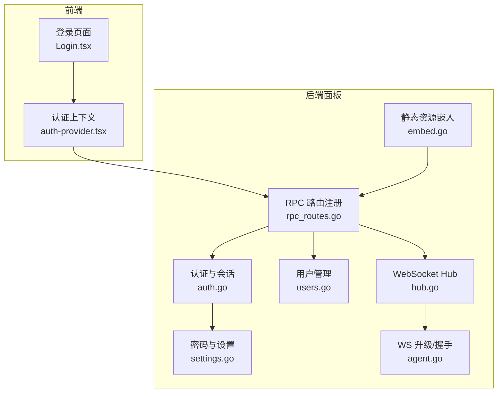
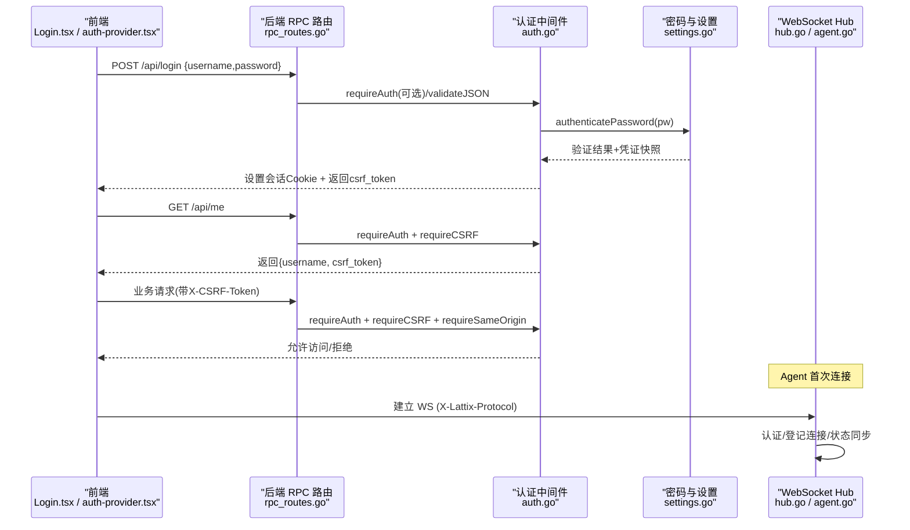
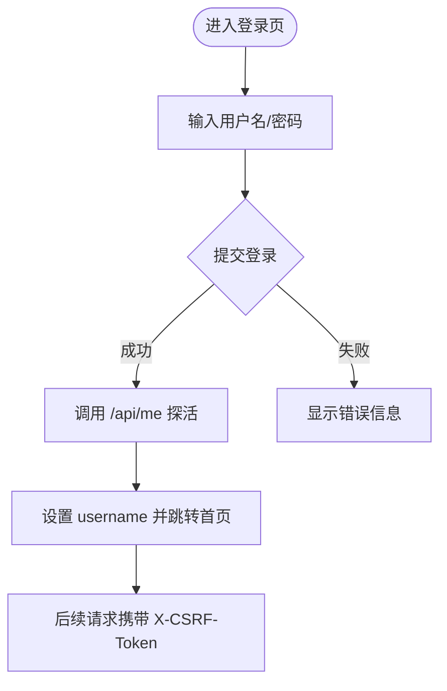
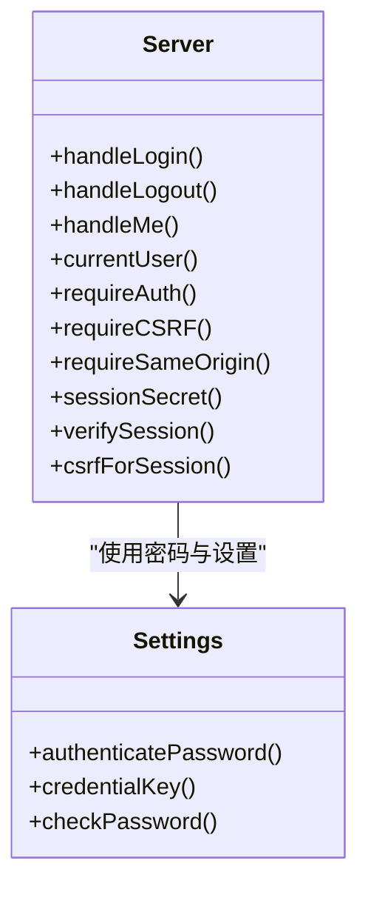
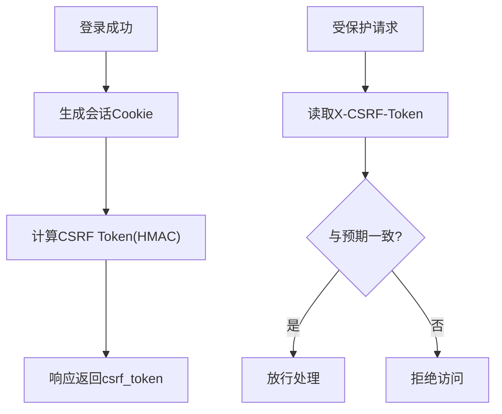
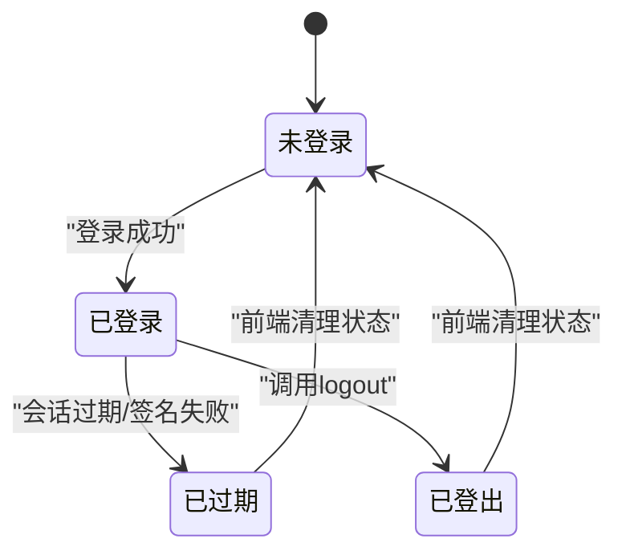
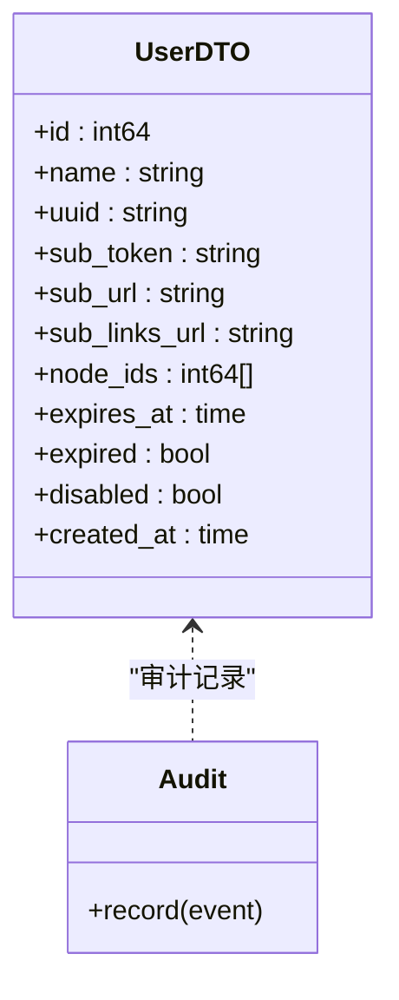
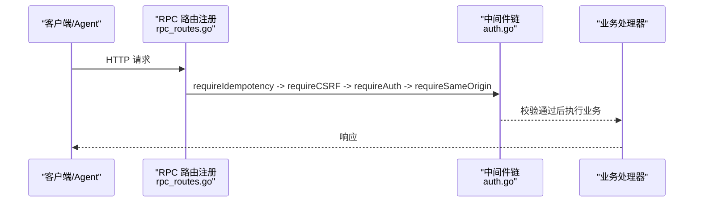
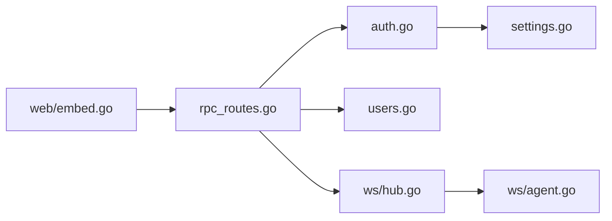

# 认证授权系统

<cite>
**本文引用的文件**   
- [auth.go](file://src/backend/internal/panel/auth.go)
- [settings.go](file://src/backend/internal/panel/settings.go)
- [rpc_routes.go](file://src/backend/internal/panel/rpc_routes.go)
- [users.go](file://src/backend/internal/panel/users.go)
- [Login.tsx](file://src/frontend/src/pages/Login.tsx)
- [auth-provider.tsx](file://src/frontend/src/lib/auth-provider.tsx)
- [auth.ts](file://src/frontend/src/lib/auth.ts)
- [embed.go](file://src/backend/internal/web/embed.go)
- [hub.go](file://src/backend/internal/ws/hub.go)
- [agent.go](file://src/backend/internal/ws/agent.go)
</cite>

## 目录
1. [简介](#简介)
2. [项目结构](#项目结构)
3. [核心组件](#核心组件)
4. [架构总览](#架构总览)
5. [详细组件分析](#详细组件分析)
6. [依赖关系分析](#依赖关系分析)
7. [性能考虑](#性能考虑)
8. [故障排查指南](#故障排查指南)
9. [结论](#结论)
10. [附录](#附录)

## 简介
本技术文档围绕 Lattix-codex 的认证与授权体系，系统性阐述前端登录流程、会话与 Token 管理、CSRF 安全机制、用户与会话生命周期、权限控制模型、认证中间件对 API 与 WebSocket 的保护策略，以及密码加密、会话安全与跨域配置等安全最佳实践。同时提供常见问题的定位与修复建议，帮助读者快速掌握并安全地使用该系统的认证能力。

## 项目结构
认证相关代码主要分布在后端面板模块与前端应用：
- 后端（Go）
  - 认证与会话：auth.go（会话签名、CSRF、鉴权中间件、登录/登出/当前用户）
  - 密码与设置：settings.go（bcrypt 哈希、密码校验、会话密钥派生）
  - 路由与中间件：rpc_routes.go（统一注册、鉴权/CSRF/SameOrigin 组合、幂等性）
  - 用户管理：users.go（用户生命周期、节点分配、停权/恢复扇出）
  - 静态资源嵌入：embed.go（前端构建产物嵌入二进制）
  - WebSocket Hub：hub.go（Agent 连接注册、状态、断开/重连）
  - WebSocket 升级：agent.go（协议头、握手参数）
- 前端（React + TypeScript）
  - 登录页面：Login.tsx（表单提交、调用登录接口、跳转）
  - 认证上下文：auth-provider.tsx（登录态维护、未授权回调、调用 me/login/logout）
  - 导出入口：auth.ts（对外暴露 useAuth/AuthProvider）

**图表来源** 
- [rpc_routes.go:33-72](file://src/backend/internal/panel/rpc_routes.go#L33-L72)
- [auth.go:81-145](file://src/backend/internal/panel/auth.go#L81-L145)
- [settings.go:587-631](file://src/backend/internal/panel/settings.go#L587-L631)
- [users.go:50-156](file://src/backend/internal/panel/users.go#L50-L156)
- [hub.go:25-63](file://src/backend/internal/ws/hub.go#L25-L63)
- [agent.go:19-29](file://src/backend/internal/ws/agent.go#L19-L29)
- [embed.go:12-22](file://src/backend/internal/web/embed.go#L12-L22)

**章节来源**
- [rpc_routes.go:33-72](file://src/backend/internal/panel/rpc_routes.go#L33-L72)
- [auth.go:81-145](file://src/backend/internal/panel/auth.go#L81-L145)
- [settings.go:587-631](file://src/backend/internal/panel/settings.go#L587-L631)
- [users.go:50-156](file://src/backend/internal/panel/users.go#L50-L156)
- [hub.go:25-63](file://src/backend/internal/ws/hub.go#L25-L63)
- [agent.go:19-29](file://src/backend/internal/ws/agent.go#L19-L29)
- [embed.go:12-22](file://src/backend/internal/web/embed.go#L12-L22)

## 核心组件
- 会话与会话密钥
  - 会话 Cookie 名称固定，有效期为 7 天；值由“用户名|过期时间”与 HMAC-SHA256 签名组成，采用 base64url 编码。
  - 会话密钥由管理员凭证派生（DB 中的 bcrypt 哈希优先，否则回退到启动参数），改密即更换密钥源，所有旧会话失效。
- CSRF 保护
  - 服务端基于会话值与密钥派生 CSRF Token，通过响应返回或 /api/me 获取；受保护请求需在 X-CSRF-Token 头部携带相同值。
  - 配合 Same-Origin 校验（Origin/Referer 与 Host 一致，HTTPS 下强制 https）。
- 认证中间件
  - requireAuth：校验会话 Cookie，解析出当前用户；更新进行中拒绝非白名单端点。
  - requireCSRF：校验 X-CSRF-Token 与预期值一致。
  - requireSameOrigin：校验请求来源，防止跨站伪造。
- 密码与凭据
  - 支持 DB 中 bcrypt 哈希与启动参数明文对比（常量时间比较）；修改密码后自动切换会话密钥源。
- 用户与权限
  - 管理员登录（用户名固定为配置项），用户对象包含到期时间、停用标记、节点分配等；停权/恢复会触发向 Agent 扇出 add_user/remove_user。
- WebSocket 连接
  - Agent 通过 WS 首连进行认证（X-Lattix-Protocol 等），Hub 维护在线连接、状态快照与断线重连逻辑。

**章节来源**
- [auth.go:21-79](file://src/backend/internal/panel/auth.go#L21-L79)
- [auth.go:197-249](file://src/backend/internal/panel/auth.go#L197-L249)
- [settings.go:587-631](file://src/backend/internal/panel/settings.go#L587-L631)
- [users.go:170-278](file://src/backend/internal/panel/users.go#L170-L278)
- [hub.go:25-63](file://src/backend/internal/ws/hub.go#L25-L63)
- [agent.go:19-29](file://src/backend/internal/ws/agent.go#L19-L29)

## 架构总览
下图展示了从前端登录到后端鉴权、CSRF 校验、会话签发与后续受保护请求的完整流程，以及 WebSocket 的认证路径。

**图表来源** 
- [auth.go:81-145](file://src/backend/internal/panel/auth.go#L81-L145)
- [auth.go:164-181](file://src/backend/internal/panel/auth.go#L164-L181)
- [auth.go:197-249](file://src/backend/internal/panel/auth.go#L197-L249)
- [rpc_routes.go:33-72](file://src/backend/internal/panel/rpc_routes.go#L33-L72)
- [agent.go:19-29](file://src/backend/internal/ws/agent.go#L19-L29)
- [hub.go:25-63](file://src/backend/internal/ws/hub.go#L25-L63)

## 详细组件分析

### 前端登录与认证上下文
- 登录页面
  - 收集用户名与密码，提交至登录接口；成功后跳转到首页。
- 认证上下文
  - 初始化时调用 /api/me 探测登录态；未授权时清空用户名。
  - 封装 login/logout 方法，分别调用后端登录与登出接口。
- Token 存储与刷新
  - 会话存储在 Cookie 中（HttpOnly、Secure、SameSite=Lax），无需前端手动持久化。
  - CSRF Token 随每次 /api/me 或登录响应返回，前端在后续写操作请求头中携带。

**图表来源** 
- [Login.tsx:23-35](file://src/frontend/src/pages/Login.tsx#L23-L35)
- [auth-provider.tsx:10-18](file://src/frontend/src/lib/auth-provider.tsx#L10-L18)
- [auth-provider.tsx:20-28](file://src/frontend/src/lib/auth-provider.tsx#L20-L28)

**章节来源**
- [Login.tsx:23-35](file://src/frontend/src/pages/Login.tsx#L23-L35)
- [auth-provider.tsx:10-18](file://src/frontend/src/lib/auth-provider.tsx#L10-L18)
- [auth-provider.tsx:20-28](file://src/frontend/src/lib/auth-provider.tsx#L20-L28)
- [auth.ts:1-3](file://src/frontend/src/lib/auth.ts#L1-L3)

### 会话管理与自动登出
- 会话生成
  - 登录成功后设置会话 Cookie（名称固定、有效期 7 天、HttpOnly、Secure、SameSite=Lax）。
  - 同时返回 CSRF Token，用于后续写操作防护。
- 会话校验
  - 每个受保护接口先校验 Cookie，再解析并验证签名与过期时间。
- 自动登出
  - 会话过期或无效时，/api/me 返回未登录；前端上下文捕获未授权回调并清空用户名，实现自动登出。
- 密钥轮换
  - 修改密码后，会话密钥源切换，旧会话无法通过验证，达到“全部会话失效”。

**图表来源** 
- [auth.go:21-79](file://src/backend/internal/panel/auth.go#L21-L79)
- [auth.go:164-195](file://src/backend/internal/panel/auth.go#L164-L195)
- [auth.go:197-249](file://src/backend/internal/panel/auth.go#L197-L249)
- [settings.go:587-631](file://src/backend/internal/panel/settings.go#L587-L631)

**章节来源**
- [auth.go:81-145](file://src/backend/internal/panel/auth.go#L81-L145)
- [auth.go:164-195](file://src/backend/internal/panel/auth.go#L164-L195)
- [auth.go:197-249](file://src/backend/internal/panel/auth.go#L197-L249)
- [settings.go:587-631](file://src/backend/internal/panel/settings.go#L587-L631)

### CSRF Token 安全机制
- 生成
  - 基于会话值与密钥派生 HMAC-SHA256 摘要，base64url 编码后作为 CSRF Token。
- 验证
  - 受保护接口读取 X-CSRF-Token 与预期值进行常量时间比较。
- 防攻击策略
  - Same-Origin 校验确保请求来源合法；HTTPS 模式下强制 https。
  - Cookie 设置 HttpOnly、Secure、SameSite=Lax，降低 XSS/CSRF 风险。

**图表来源** 
- [auth.go:215-249](file://src/backend/internal/panel/auth.go#L215-L249)

**章节来源**
- [auth.go:215-249](file://src/backend/internal/panel/auth.go#L215-L249)

### 用户与会话生命周期、过期处理与自动登出
- 用户生命周期
  - 创建用户时生成 UUID 与订阅令牌，可预选节点；更新时可设置到期时间与停用标记；删除时扇出 remove_user。
- 会话生命周期
  - 会话有效期 7 天；过期或签名不通过则视为未登录；修改密码后旧会话失效。
- 自动登出
  - 前端在 /api/me 未授权时清空用户名；后续请求被 requireAuth 拦截，引导重新登录。

**图表来源** 
- [users.go:78-156](file://src/backend/internal/panel/users.go#L78-L156)
- [users.go:170-278](file://src/backend/internal/panel/users.go#L170-L278)
- [auth.go:164-195](file://src/backend/internal/panel/auth.go#L164-L195)

**章节来源**
- [users.go:78-156](file://src/backend/internal/panel/users.go#L78-L156)
- [users.go:170-278](file://src/backend/internal/panel/users.go#L170-L278)
- [auth.go:164-195](file://src/backend/internal/panel/auth.go#L164-L195)

### 权限控制模型（角色、访问控制、审计）
- 角色定义
  - 管理员：固定用户名（配置项），通过密码校验登录；其他为用户对象（UUID、到期、停用、节点分配）。
- 访问控制
  - 所有受保护 API 均经 requireAuth 校验会话；写操作需携带有效 CSRF Token；部分接口要求 Same-Origin。
- 操作审计
  - 登录成功/失败、登出、用户变更、设置变更等均记录审计事件，包含操作者、IP、RequestID、TraceID 等。

**图表来源** 
- [users.go:18-48](file://src/backend/internal/panel/users.go#L18-L48)
- [auth.go:106-145](file://src/backend/internal/panel/auth.go#L106-L145)
- [settings.go:520-537](file://src/backend/internal/panel/settings.go#L520-L537)

**章节来源**
- [users.go:18-48](file://src/backend/internal/panel/users.go#L18-L48)
- [auth.go:106-145](file://src/backend/internal/panel/auth.go#L106-L145)
- [settings.go:520-537](file://src/backend/internal/panel/settings.go#L520-L537)

### 认证中间件原理与 API/WSS 保护
- API 保护
  - registerRPC 将 Auth/CSRF/SameOrigin/Idempotent 等中间件按顺序包装处理器，统一校验 JSON 载荷大小与字段白名单。
- WebSocket 保护
  - WS 升级器允许本地受信网络（MVP 场景），Agent 首连通过协议头与认证器完成身份校验；Hub 维护连接状态、心跳与断线重连。

**图表来源** 
- [rpc_routes.go:33-72](file://src/backend/internal/panel/rpc_routes.go#L33-L72)
- [auth.go:197-249](file://src/backend/internal/panel/auth.go#L197-L249)
- [agent.go:19-29](file://src/backend/internal/ws/agent.go#L19-L29)
- [hub.go:25-63](file://src/backend/internal/ws/hub.go#L25-L63)

**章节来源**
- [rpc_routes.go:33-72](file://src/backend/internal/panel/rpc_routes.go#L33-L72)
- [auth.go:197-249](file://src/backend/internal/panel/auth.go#L197-L249)
- [agent.go:19-29](file://src/backend/internal/ws/agent.go#L19-L29)
- [hub.go:25-63](file://src/backend/internal/ws/hub.go#L25-L63)

### 安全最佳实践（密码、会话、跨域）
- 密码加密
  - 使用 bcrypt 哈希存储；若 DB 无哈希则回退到启动参数（常量时间比较）；修改密码后自动切换会话密钥源。
- 会话安全
  - Cookie 设置 HttpOnly、Secure、SameSite=Lax；有效期 7 天；改密即失效。
- 跨域配置
  - Same-Origin 校验严格匹配 Host，HTTPS 模式强制 https；WS MVP 阶段 CheckOrigin 放宽（仅限受信网络）。

**章节来源**
- [settings.go:587-631](file://src/backend/internal/panel/settings.go#L587-L631)
- [auth.go:21-79](file://src/backend/internal/panel/auth.go#L21-L79)
- [agent.go:26-29](file://src/backend/internal/ws/agent.go#L26-L29)

## 依赖关系分析
- 模块耦合
  - rpc_routes.go 负责统一注册与中间件组合，依赖 auth.go 的 requireAuth/requireCSRF/requireSameOrigin。
  - auth.go 依赖 settings.go 的密码校验与会话密钥派生。
  - users.go 依赖 store 与调度器进行用户生命周期与节点分配扇出。
  - ws/hub.go 与 agent.go 共同实现 Agent 的 WS 认证与连接管理。
- 外部依赖
  - 前端通过 api.ts 调用后端 REST 接口；后端嵌入前端静态资源（dist）。

**图表来源** 
- [rpc_routes.go:33-72](file://src/backend/internal/panel/rpc_routes.go#L33-L72)
- [auth.go:197-249](file://src/backend/internal/panel/auth.go#L197-L249)
- [settings.go:587-631](file://src/backend/internal/panel/settings.go#L587-L631)
- [users.go:78-156](file://src/backend/internal/panel/users.go#L78-L156)
- [hub.go:25-63](file://src/backend/internal/ws/hub.go#L25-L63)
- [agent.go:19-29](file://src/backend/internal/ws/agent.go#L19-L29)
- [embed.go:12-22](file://src/backend/internal/web/embed.go#L12-L22)

**章节来源**
- [rpc_routes.go:33-72](file://src/backend/internal/panel/rpc_routes.go#L33-L72)
- [auth.go:197-249](file://src/backend/internal/panel/auth.go#L197-L249)
- [settings.go:587-631](file://src/backend/internal/panel/settings.go#L587-L631)
- [users.go:78-156](file://src/backend/internal/panel/users.go#L78-L156)
- [hub.go:25-63](file://src/backend/internal/ws/hub.go#L25-L63)
- [agent.go:19-29](file://src/backend/internal/ws/agent.go#L19-L29)
- [embed.go:12-22](file://src/backend/internal/web/embed.go#L12-L22)

## 性能考虑
- 会话与 CSRF 计算
  - HMAC-SHA256 计算开销低；避免在高频路径重复计算，必要时缓存会话解析结果（注意并发安全）。
- 密码哈希
  - bcrypt 计算成本高，存在忙等待（errBcryptBusy）；登录与改密路径已做限流与降级处理。
- 发送队列与 WS 超时
  - WS 发送缓冲满即断开慢连接，避免阻塞；写超时与心跳机制保障连接健康。
- 请求体限制
  - RPC 统一限制请求体大小与 JSON 格式，减少恶意负载影响。

[本节为通用指导，不直接分析具体文件]

## 故障排查指南
- 登录失败
  - 检查用户名/密码是否正确；查看是否触发速率限制；确认 bcrypt 服务可用。
- 未登录或会话已过期
  - 检查 Cookie 是否存在且未过期；确认 /api/me 返回未登录；前端上下文是否清空用户名。
- CSRF token 无效
  - 确认 X-CSRF-Token 头部正确携带；检查 Same-Origin 校验是否通过；HTTPS 模式下 Origin 必须为 https。
- 更新进行中拒绝访问
  - 仅允许 /api/panel/get-update-status 与 /api/auth/me；等待更新完成后再操作。
- WS 连接失败
  - 检查协议头与认证参数；查看 Hub 日志与连接状态；确认 CheckOrigin 策略是否符合部署环境。

**章节来源**
- [auth.go:81-145](file://src/backend/internal/panel/auth.go#L81-L145)
- [auth.go:164-195](file://src/backend/internal/panel/auth.go#L164-L195)
- [auth.go:197-249](file://src/backend/internal/panel/auth.go#L197-L249)
- [agent.go:19-29](file://src/backend/internal/ws/agent.go#L19-L29)
- [hub.go:25-63](file://src/backend/internal/ws/hub.go#L25-L63)

## 结论
本系统通过严格的会话签名、CSRF 与 Same-Origin 校验，结合 bcrypt 密码哈希与会话密钥派生，实现了安全的认证与授权体系。前端以 Cookie 承载会话、上下文管理登录态，后端通过中间件链统一保护 API 与 WS 连接。用户生命周期与停权/恢复通过扇出机制与 Agent 协同，确保端到端一致性。遵循本文的安全最佳实践与故障排查建议，可有效提升系统安全性与可运维性。

[本节为总结，不直接分析具体文件]

## 附录
- 关键端点
  - POST /api/login：登录，设置会话 Cookie，返回 csrf_token。
  - POST /api/logout：登出，清除会话 Cookie。
  - GET /api/me：探活，返回当前用户与 csrf_token。
  - 受保护 API：需携带 X-CSRF-Token，并通过 requireAuth/requireCSRF/requireSameOrigin。
- 前端调用要点
  - 登录后立即调用 /api/me 探活；后续写请求务必携带 X-CSRF-Token。
  - 未授权回调应清空用户名，引导重新登录。

**章节来源**
- [auth.go:81-145](file://src/backend/internal/panel/auth.go#L81-L145)
- [auth.go:164-181](file://src/backend/internal/panel/auth.go#L164-L181)
- [auth-provider.tsx:10-18](file://src/frontend/src/lib/auth-provider.tsx#L10-L18)