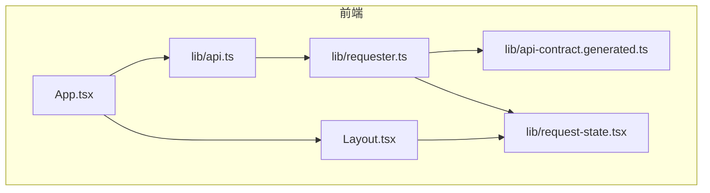
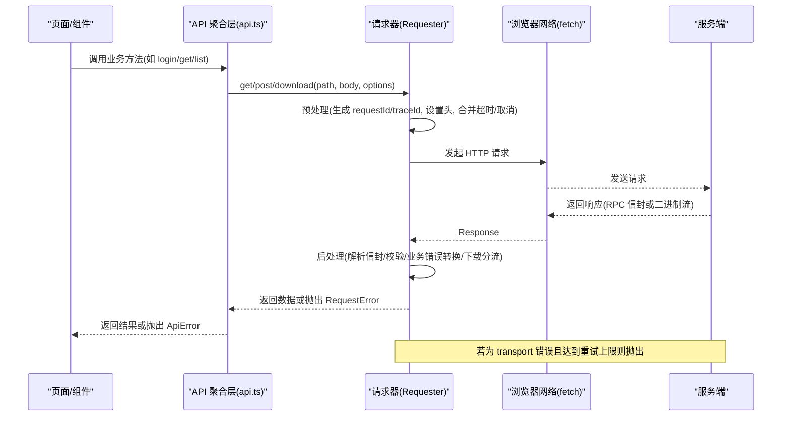
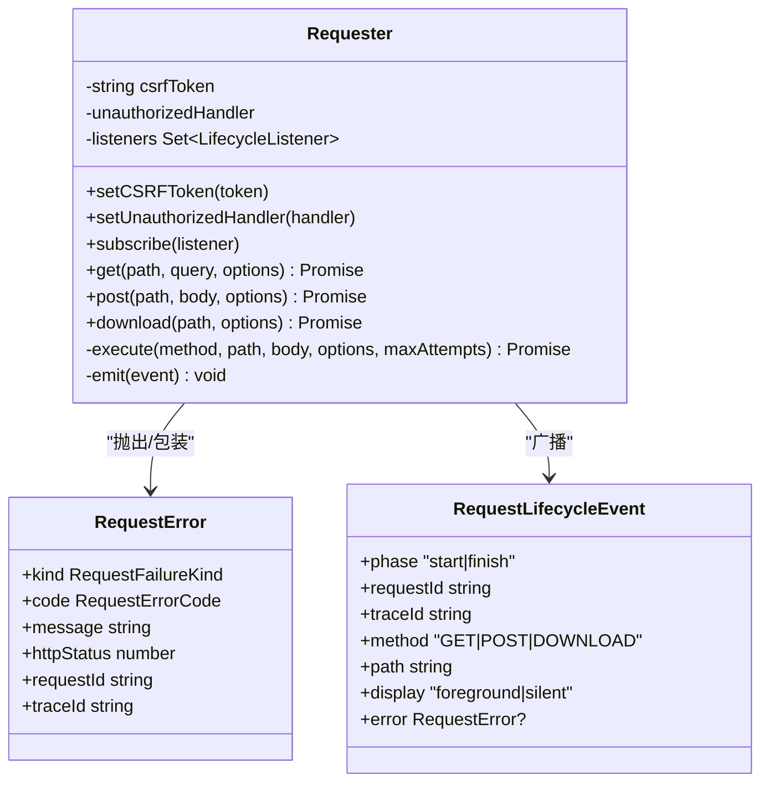
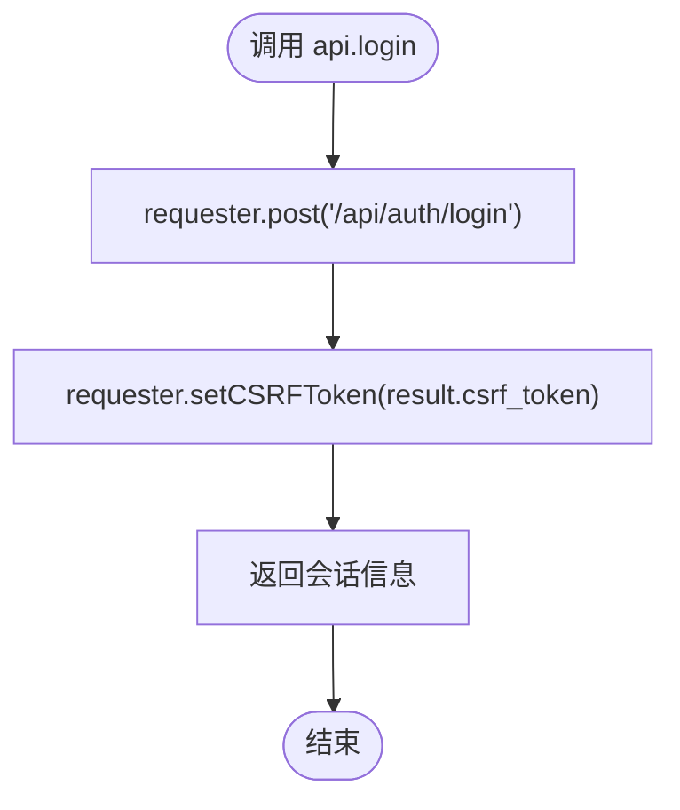
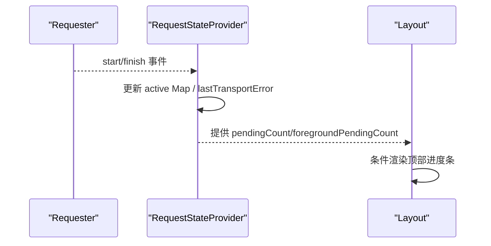
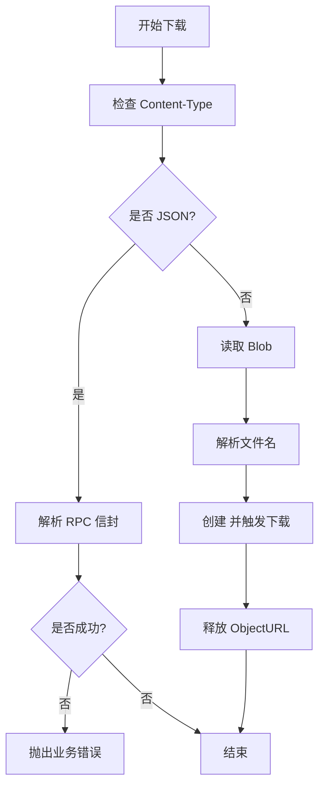
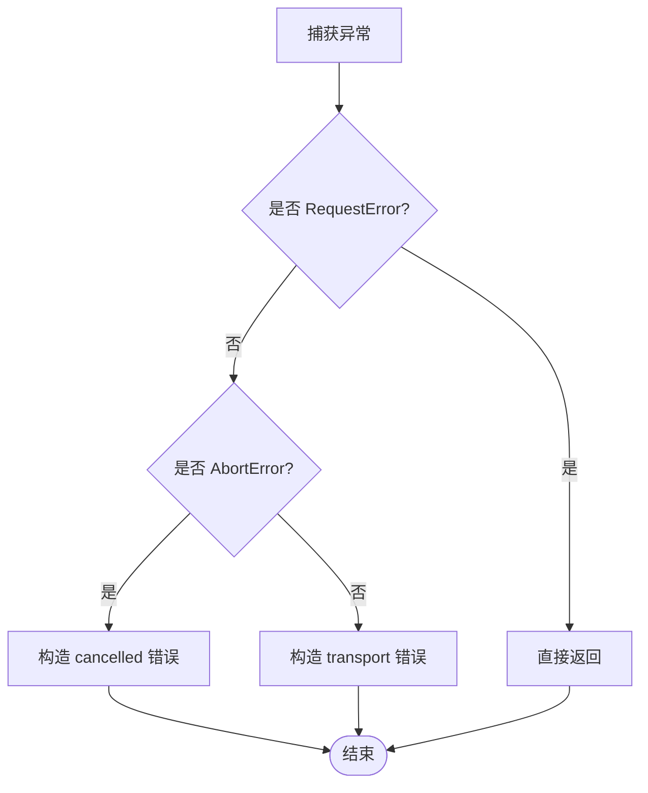
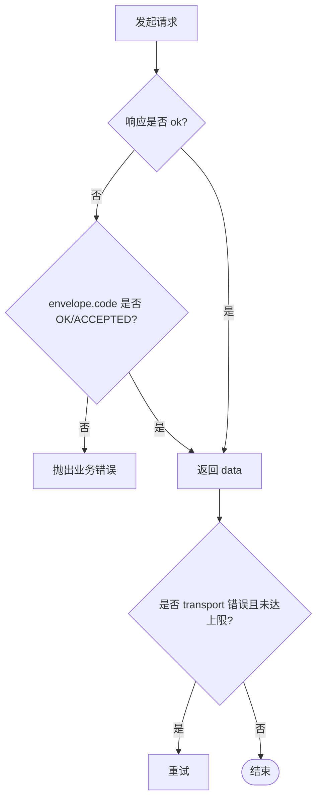
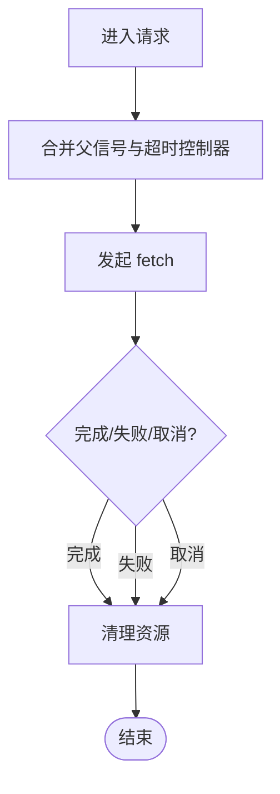
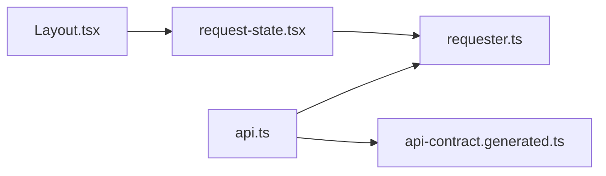

# 请求拦截器

<cite>
**本文引用的文件**   
- [requester.ts](file://src/frontend/src/lib/requester.ts)
- [api.ts](file://src/frontend/src/lib/api.ts)
- [api-contract.generated.ts](file://src/frontend/src/lib/api-contract.generated.ts)
- [request-state.tsx](file://src/frontend/src/lib/request-state.tsx)
- [Layout.tsx](file://src/frontend/src/components/Layout.tsx)
- [main.tsx](file://src/frontend/src/main.tsx)
</cite>

## 目录
1. [简介](#简介)
2. [项目结构](#项目结构)
3. [核心组件](#核心组件)
4. [架构总览](#架构总览)
5. [详细组件分析](#详细组件分析)
6. [依赖关系分析](#依赖关系分析)
7. [性能考量](#性能考量)
8. [故障排查指南](#故障排查指南)
9. [结论](#结论)
10. [附录](#附录)

## 简介
本技术文档围绕 Lattix-codex 前端请求拦截器系统，系统性阐述其设计模式与实现要点，涵盖：
- 请求预处理（统一头信息、CSRF、幂等键、超时与取消）
- 响应后处理（RPC 信封校验、业务错误分类、下载流处理）
- 错误统一处理（网络/协议/业务/取消四类错误，标准化消息与追踪标识）
- 全局错误处理机制（未认证、不可达、无效响应等）
- 加载状态管理（全局进度条与局部控制）
- 请求去重与缓存策略（当前实现说明与扩展建议）
- 请求取消机制（AbortSignal 组合、组件卸载安全）
- 与服务端状态的同步（ID 幂等、重试与 ACCEPTED 语义）
- 扩展点（生命周期监听、自定义拦截逻辑接入）

## 项目结构
前端请求相关代码集中在 lib 层与组件层：
- lib/requester.ts：请求封装与拦截核心（Requester 类、错误模型、生命周期事件、信号合并）
- lib/api.ts：API 方法聚合与鉴权联动（登录态、CSRF、未授权回调）
- lib/api-contract.generated.ts：RPC 信封类型与操作映射（由 OpenAPI 生成）
- lib/request-state.tsx：React 上下文提供请求计数与最近传输错误
- components/Layout.tsx：全局加载指示器（顶部进度条）
- main.tsx：应用根节点挂载 RequestStateProvider

图表来源
- [main.tsx:1-15](file://src/frontend/src/main.tsx#L1-L15)
- [Layout.tsx:1-205](file://src/frontend/src/components/Layout.tsx#L1-L205)
- [api.ts:1-292](file://src/frontend/src/lib/api.ts#L1-L292)
- [requester.ts:1-309](file://src/frontend/src/lib/requester.ts#L1-L309)
- [api-contract.generated.ts:1-88](file://src/frontend/src/lib/api-contract.generated.ts#L1-L88)

章节来源
- [main.tsx:1-15](file://src/frontend/src/main.tsx#L1-L15)
- [Layout.tsx:1-205](file://src/frontend/src/components/Layout.tsx#L1-L205)
- [api.ts:1-292](file://src/frontend/src/lib/api.ts#L1-L292)
- [requester.ts:1-309](file://src/frontend/src/lib/requester.ts#L1-L309)
- [api-contract.generated.ts:1-88](file://src/frontend/src/lib/api-contract.generated.ts#L1-L88)

## 核心组件
- Requester（请求器）
  - 职责：封装 GET/POST/DOWNLOAD，统一头信息、超时、取消、重试、错误归一化、生命周期事件广播。
  - 关键能力：
    - 请求预处理：自动注入 X-Request-ID、X-Trace-ID；POST 时注入 Content-Type、Idempotency-Key、可选 X-CSRF-Token。
    - 响应后处理：解析 RPC 信封并校验字段；非 OK/ACCEPTED 转为业务错误；下载流按 Content-Type 分支处理。
    - 错误统一：区分 transport/business/protocol/cancelled 四类，附带 requestId/traceId/httpStatus。
    - 重试策略：对 transport 错误最多重试指定次数。
    - 生命周期：start/finish 事件，供上层统计与 UI 展示。
- API 聚合层
  - 职责：暴露业务 API 方法，集中处理登录态与 CSRF，设置未授权回调。
- 请求状态上下文
  - 职责：订阅 Requester 事件，维护 pending 计数与 lastTransportError，供 UI 使用。
- 契约类型
  - 职责：定义 RPCCode、RPCEnvelope 与操作映射，保证前后端一致。

章节来源
- [requester.ts:1-309](file://src/frontend/src/lib/requester.ts#L1-L309)
- [api.ts:1-292](file://src/frontend/src/lib/api.ts#L1-L292)
- [request-state.tsx:1-59](file://src/frontend/src/lib/request-state.tsx#L1-L59)
- [api-contract.generated.ts:1-88](file://src/frontend/src/lib/api-contract.generated.ts#L1-L88)

## 架构总览
下图展示了从页面调用到服务端响应的完整链路，包括拦截器的预处理、后处理与错误处理流程。

图表来源
- [api.ts:1-292](file://src/frontend/src/lib/api.ts#L1-L292)
- [requester.ts:1-309](file://src/frontend/src/lib/requester.ts#L1-L309)
- [api-contract.generated.ts:1-88](file://src/frontend/src/lib/api-contract.generated.ts#L1-L88)

## 详细组件分析

### Requester 类与错误模型
- 数据结构
  - RequestError：包含 kind/code/message/httpStatus/requestId/traceId，用于统一错误表达。
  - RequestOptions：支持 signal、timeoutMs、display、traceId、idempotencyKey。
  - RequestLifecycleEvent：start/finish 事件，携带 requestId/traceId/method/path/display/error。
- 核心方法
  - get/post/download：对外接口，内部统一走 execute/dl 流程。
  - execute：通用执行器，负责重试、信封解析、错误归一化、生命周期事件。
  - download：专用下载流程，按 Content-Type 判断 JSON 还是二进制流。
- 辅助函数
  - parseEnvelope：严格校验 RPC 信封结构与字段类型。
  - businessError：将 envelope.code/message 转换为业务错误。
  - normalizeError：将 DOMException/AbortError/普通 Error 统一为 RequestError。
  - combinedSignal：合并父 AbortSignal 与超时控制器，确保清理。

图表来源
- [requester.ts:1-309](file://src/frontend/src/lib/requester.ts#L1-L309)

章节来源
- [requester.ts:1-309](file://src/frontend/src/lib/requester.ts#L1-L309)

### API 聚合层与鉴权联动
- 功能要点
  - setOnUnauthorized：注册未授权回调，清空 CSRF 并触发跳转/刷新。
  - login/logout/me：登录后设置 CSRF token，登出时清理。
  - 各业务方法：统一通过 requester.get/post 调用，部分方法标记 display:silent 避免干扰 UI。
- 错误提示
  - errorMessage：将未知错误降级为友好提示。
  - isRequestError：类型守卫，便于上层判断是否为 RequestError。

图表来源
- [api.ts:1-292](file://src/frontend/src/lib/api.ts#L1-L292)

章节来源
- [api.ts:1-292](file://src/frontend/src/lib/api.ts#L1-L292)

### 请求状态上下文与全局加载
- RequestStateProvider
  - 订阅 Requester 的 start/finish 事件，维护 active Map 与 lastTransportError。
  - 计算 pendingCount 与 foregroundPendingCount（仅 foreground 显示）。
- Layout 组件
  - 根据 foregroundPendingCount > 0 渲染顶部进度条。
- 应用入口
  - main.tsx 在根节点包裹 RequestStateProvider，使全局可用。

图表来源
- [request-state.tsx:1-59](file://src/frontend/src/lib/request-state.tsx#L1-L59)
- [Layout.tsx:1-205](file://src/frontend/src/components/Layout.tsx#L1-L205)
- [main.tsx:1-15](file://src/frontend/src/main.tsx#L1-L15)

章节来源
- [request-state.tsx:1-59](file://src/frontend/src/lib/request-state.tsx#L1-L59)
- [Layout.tsx:1-205](file://src/frontend/src/components/Layout.tsx#L1-L205)
- [main.tsx:1-15](file://src/frontend/src/main.tsx#L1-L15)

### 下载流程与二进制响应处理
- 分支逻辑
  - 若 Content-Type 包含 json：解析为 RPC 信封并抛业务错误。
  - 否则：读取 blob，解析 Content-Disposition 获取文件名，创建 ObjectURL 并触发下载。
- 错误处理
  - 非 ok 响应直接抛 transport 错误。
  - 异常统一经 normalizeError 处理。

图表来源
- [requester.ts:1-309](file://src/frontend/src/lib/requester.ts#L1-L309)

章节来源
- [requester.ts:1-309](file://src/frontend/src/lib/requester.ts#L1-L309)

### 错误分类与统一处理
- 错误种类
  - business：服务端业务错误（envelope.code/message）。
  - transport：网络不可达、HTTP 非 2xx。
  - protocol：响应体非有效 JSON 或不符合 RPC 信封。
  - cancelled：请求被取消或超时（AbortError）。
- 统一字段
  - requestId/traceId 贯穿全链路，便于日志与追踪。
  - httpStatus 保留原始 HTTP 状态码。

图表来源
- [requester.ts:1-309](file://src/frontend/src/lib/requester.ts#L1-L309)

章节来源
- [requester.ts:1-309](file://src/frontend/src/lib/requester.ts#L1-L309)

### 请求重试与幂等性
- 重试策略
  - execute 对 transport 错误进行有限次重试（默认 2 次），其他错误立即抛出。
- 幂等性
  - POST 请求默认生成 idempotencyKey，可通过 options.idempotencyKey 覆盖，配合服务端实现幂等。
- ACCEPTED 语义
  - 当 envelope.code 为 ACCEPTED 时视为成功，允许异步任务继续推进。

图表来源
- [requester.ts:1-309](file://src/frontend/src/lib/requester.ts#L1-L309)

章节来源
- [requester.ts:1-309](file://src/frontend/src/lib/requester.ts#L1-L309)

### 请求取消与超时控制
- 信号合并
  - combinedSignal 将父 AbortSignal 与内置超时控制器合并，确保组件卸载时可取消。
- 清理机制
  - cleanup 清除定时器与事件监听，避免内存泄漏。
- 使用方式
  - 可在 options.signal 传入外部 AbortController.signal，或在组件 useEffect 中管理。

图表来源
- [requester.ts:1-309](file://src/frontend/src/lib/requester.ts#L1-L309)

章节来源
- [requester.ts:1-309](file://src/frontend/src/lib/requester.ts#L1-L309)

### 与服务器状态的同步机制
- 一致性保障
  - 每次请求携带 requestId/traceId，便于服务端关联日志与追踪。
  - POST 请求携带 Idempotency-Key，避免重复提交导致的状态不一致。
- 异步任务
  - 接受 ACCEPTED 响应，前端可轮询或等待后续事件以确认最终状态。

章节来源
- [requester.ts:1-309](file://src/frontend/src/lib/requester.ts#L1-L309)
- [api-contract.generated.ts:1-88](file://src/frontend/src/lib/api-contract.generated.ts#L1-L88)

### 扩展点说明
- 生命周期监听
  - requester.subscribe(listener) 可订阅 start/finish 事件，用于埋点、监控、调试。
- 自定义拦截逻辑
  - 可在 Requester 的 execute 前后插入钩子（例如记录耗时、采样上报、动态头注入）。
  - 通过 setUnauthorizedHandler 定制未授权行为（如跳转登录、刷新令牌）。
- 选项扩展
  - RequestOptions 可扩展更多开关（如缓存键、重试策略、优先级）。

章节来源
- [requester.ts:1-309](file://src/frontend/src/lib/requester.ts#L1-L309)
- [api.ts:1-292](file://src/frontend/src/lib/api.ts#L1-L292)

## 依赖关系分析
- 模块耦合
  - api.ts 依赖 requester.ts 与 api-contract.generated.ts。
  - request-state.tsx 依赖 requester.ts 的事件。
  - Layout.tsx 依赖 request-state.tsx 提供的状态。
- 外部依赖
  - 浏览器原生 fetch、AbortController、crypto.getRandomValues。
- 潜在循环依赖
  - 当前无循环依赖，模块边界清晰。

图表来源
- [api.ts:1-292](file://src/frontend/src/lib/api.ts#L1-L292)
- [requester.ts:1-309](file://src/frontend/src/lib/requester.ts#L1-L309)
- [api-contract.generated.ts:1-88](file://src/frontend/src/lib/api-contract.generated.ts#L1-L88)
- [request-state.tsx:1-59](file://src/frontend/src/lib/request-state.tsx#L1-L59)
- [Layout.tsx:1-205](file://src/frontend/src/components/Layout.tsx#L1-L205)

章节来源
- [api.ts:1-292](file://src/frontend/src/lib/api.ts#L1-L292)
- [requester.ts:1-309](file://src/frontend/src/lib/requester.ts#L1-L309)
- [api-contract.generated.ts:1-88](file://src/frontend/src/lib/api-contract.generated.ts#L1-L88)
- [request-state.tsx:1-59](file://src/frontend/src/lib/request-state.tsx#L1-L59)
- [Layout.tsx:1-205](file://src/frontend/src/components/Layout.tsx#L1-L205)

## 性能考量
- 当前实现特性
  - 请求去重：未在 Requester 内实现基于 URL+参数的去重。
  - 缓存策略：未实现响应缓存（可按需扩展）。
  - 重试开销：transport 错误会触发有限次重试，注意后端稳定性。
- 优化建议
  - 请求去重：在 Requester 内维护 pending Map（key=URL+query+headers），相同请求复用 Promise。
  - 响应缓存：引入内存缓存（LRU），按 key 与过期时间管理，支持强制刷新。
  - 并发控制：限制并发数，避免瞬时高峰压垮服务。
  - 采样上报：对长尾请求与错误进行采样上报，降低监控开销。

[本节为通用指导，不直接分析具体文件]

## 故障排查指南
- 常见问题定位
  - 网络不可达：检查 normalizeError 的 transport 分支与 lastTransportError。
  - 无效响应：检查 parseEnvelope 的 JSON 解析与信封字段校验。
  - 业务错误：查看 envelope.code/message，结合服务端日志。
  - 请求取消：检查 AbortError 与 combinedSignal 的清理逻辑。
- 调试手段
  - 使用 requester.subscribe 打印 start/finish 事件，观察请求生命周期。
  - 利用 requestId/traceId 在服务端与前端日志中交叉定位问题。
- 未授权处理
  - 配置 setOnUnauthorized，确保登出后正确清理 CSRF 并跳转。

章节来源
- [requester.ts:1-309](file://src/frontend/src/lib/requester.ts#L1-L309)
- [api.ts:1-292](file://src/frontend/src/lib/api.ts#L1-L292)

## 结论
该请求拦截器系统通过统一的 Requester 抽象，实现了请求预处理、响应后处理、错误统一化与生命周期事件广播，结合 React 上下文提供全局加载状态。当前版本已具备完善的错误分类、重试与取消机制，并在鉴权与 CSRF 方面做了良好集成。建议在后续迭代中补充请求去重与响应缓存，进一步提升性能与用户体验。

[本节为总结性内容，不直接分析具体文件]

## 附录
- 术语表
  - RPC 信封：标准响应结构，包含 code/message/data/request_id/trace_id。
  - Idempotency-Key：幂等键，用于防止重复提交。
  - 生命周期事件：start/finish，用于监控与 UI 状态管理。
- 最佳实践
  - 为所有 POST 请求提供稳定的 idempotencyKey。
  - 对敏感操作设置较短超时与合理重试次数。
  - 使用 display:silent 避免后台请求干扰 UI。
  - 在组件卸载时主动取消未完成请求。

[本节为补充信息，不直接分析具体文件]