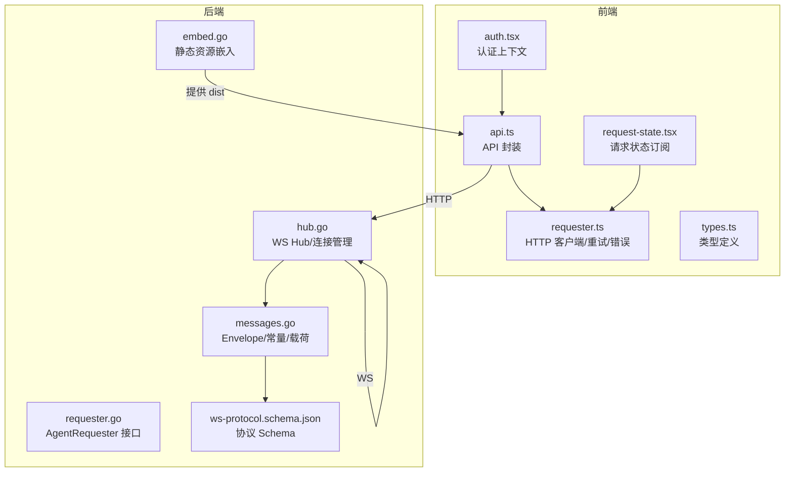
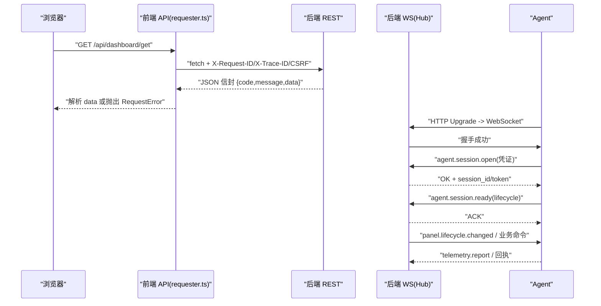
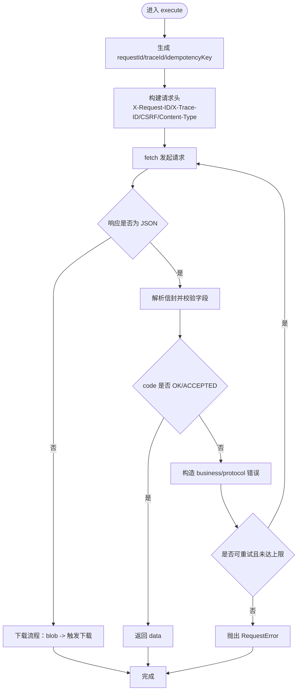
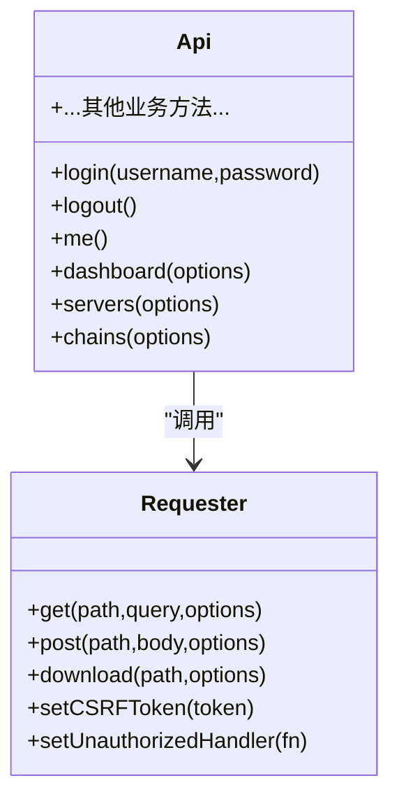
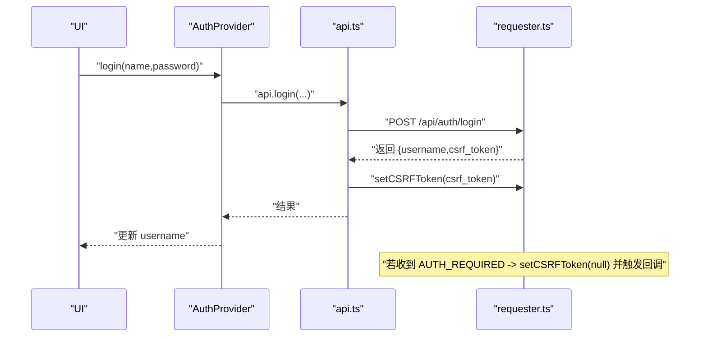
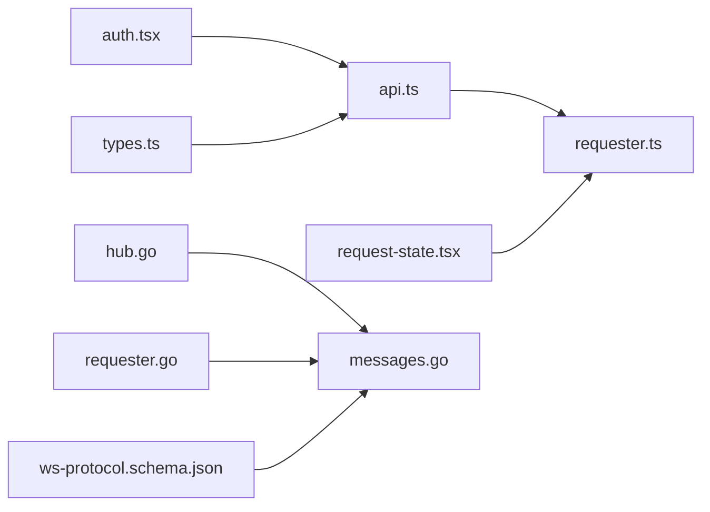

# 通信机制

<cite>
**本文引用的文件**   
- [src/frontend/src/lib/requester.ts](file://src/frontend/src/lib/requester.ts)
- [src/frontend/src/lib/api.ts](file://src/frontend/src/lib/api.ts)
- [src/frontend/src/lib/auth.tsx](file://src/frontend/src/lib/auth.tsx)
- [src/frontend/src/lib/types.ts](file://src/frontend/src/lib/types.ts)
- [src/frontend/src/lib/request-state.tsx](file://src/frontend/src/lib/request-state.tsx)
- [src/backend/internal/ws/hub.go](file://src/backend/internal/ws/hub.go)
- [src/backend/internal/ws/requester.go](file://src/backend/internal/ws/requester.go)
- [src/shared/messages.go](file://src/shared/messages.go)
- [docs/ws-protocol.schema.json](file://docs/ws-protocol.schema.json)
- [src/backend/internal/web/embed.go](file://src/backend/internal/web/embed.go)
</cite>

## 目录
1. [简介](#简介)
2. [项目结构](#项目结构)
3. [核心组件](#核心组件)
4. [架构总览](#架构总览)
5. [详细组件分析](#详细组件分析)
6. [依赖关系分析](#依赖关系分析)
7. [性能考量](#性能考量)
8. [故障排查指南](#故障排查指南)
9. [结论](#结论)
10. [附录](#附录)

## 简介
本文件系统性梳理 Lattix-codex 前端通信机制，覆盖 HTTP API 调用封装、WebSocket 实时通信、认证授权、请求拦截与错误处理、重试与幂等、以及连接状态管理与重连策略。文档同时给出架构图、时序图与流程图，帮助开发者快速理解并正确实现各类通信场景。

## 项目结构
前端通过统一的 Requester 抽象 HTTP 请求，API 层按业务域组织方法；认证状态由 React Context 管理；请求生命周期事件用于全局 UI 与调试。后端通过 Hub 维护 Agent WebSocket 连接，定义共享信封协议与消息类型。



**图表来源** 
- [src/frontend/src/lib/api.ts:1-294](file://src/frontend/src/lib/api.ts#L1-L294)
- [src/frontend/src/lib/requester.ts:1-340](file://src/frontend/src/lib/requester.ts#L1-L340)
- [src/frontend/src/lib/auth.tsx:1-52](file://src/frontend/src/lib/auth.tsx#L1-L52)
- [src/frontend/src/lib/request-state.tsx:1-59](file://src/frontend/src/lib/request-state.tsx#L1-L59)
- [src/backend/internal/ws/hub.go:1-413](file://src/backend/internal/ws/hub.go#L1-L413)
- [src/backend/internal/ws/requester.go:1-43](file://src/backend/internal/ws/requester.go#L1-L43)
- [src/shared/messages.go:1-313](file://src/shared/messages.go#L1-L313)
- [docs/ws-protocol.schema.json:1-356](file://docs/ws-protocol.schema.json#L1-L356)
- [src/backend/internal/web/embed.go:1-23](file://src/backend/internal/web/embed.go#L1-L23)

**章节来源**
- [src/frontend/src/lib/api.ts:1-294](file://src/frontend/src/lib/api.ts#L1-L294)
- [src/frontend/src/lib/requester.ts:1-340](file://src/frontend/src/lib/requester.ts#L1-L340)
- [src/frontend/src/lib/auth.tsx:1-52](file://src/frontend/src/lib/auth.tsx#L1-L52)
- [src/frontend/src/lib/request-state.tsx:1-59](file://src/frontend/src/lib/request-state.tsx#L1-L59)
- [src/backend/internal/ws/hub.go:1-413](file://src/backend/internal/ws/hub.go#L1-L413)
- [src/backend/internal/ws/requester.go:1-43](file://src/backend/internal/ws/requester.go#L1-L43)
- [src/shared/messages.go:1-313](file://src/shared/messages.go#L1-L313)
- [docs/ws-protocol.schema.json:1-356](file://docs/ws-protocol.schema.json#L1-L356)
- [src/backend/internal/web/embed.go:1-23](file://src/backend/internal/web/embed.go#L1-L23)

## 核心组件
- HTTP 客户端 Requester：统一 GET/POST/DOWNLOAD，内置超时、重试、幂等键、CSRF 注入、请求/追踪 ID、错误归一化与生命周期事件。
- API 封装：按模块暴露 typed 方法，集中处理登录/登出/用户信息与会话维持。
- 认证上下文：React Context 管理用户名与加载态，监听未授权回调清理会话。
- 请求状态订阅：聚合 pending 计数与最近传输错误，便于全局提示与调试。
- WS Hub（后端）：维护 Agent 连接、发送队列、心跳与离线状态、重连通知与生命周期同步。
- 共享协议：Envelope 信封、RPC 码、消息类型与载荷定义，配合 JSON Schema 约束。

**章节来源**
- [src/frontend/src/lib/requester.ts:1-340](file://src/frontend/src/lib/requester.ts#L1-L340)
- [src/frontend/src/lib/api.ts:1-294](file://src/frontend/src/lib/api.ts#L1-L294)
- [src/frontend/src/lib/auth.tsx:1-52](file://src/frontend/src/lib/auth.tsx#L1-L52)
- [src/frontend/src/lib/request-state.tsx:1-59](file://src/frontend/src/lib/request-state.tsx#L1-L59)
- [src/backend/internal/ws/hub.go:1-413](file://src/backend/internal/ws/hub.go#L1-L413)
- [src/shared/messages.go:1-313](file://src/shared/messages.go#L1-L313)
- [docs/ws-protocol.schema.json:1-356](file://docs/ws-protocol.schema.json#L1-L356)

## 架构总览
前端通过 Requester 发起 HTTP 请求，携带 X-Request-ID/X-Trace-ID 与 CSRF 头；后端以 REST 返回统一信封响应。Agent 侧通过 WebSocket 与 Panel 建立长连接，使用 Envelope 进行双向 RPC。Panel 通过 Hub 管理连接、转发命令与接收遥测/漂移报告等事件。



**图表来源** 
- [src/frontend/src/lib/requester.ts:89-220](file://src/frontend/src/lib/requester.ts#L89-L220)
- [src/backend/internal/ws/hub.go:199-238](file://src/backend/internal/ws/hub.go#L199-L238)
- [src/shared/messages.go:73-91](file://src/shared/messages.go#L73-L91)
- [docs/ws-protocol.schema.json:136-214](file://docs/ws-protocol.schema.json#L136-L214)

## 详细组件分析

### HTTP 客户端 Requester（请求拦截、错误处理、重试与幂等）
- 请求构造：GET 拼接查询参数，POST 设置 Content-Type 与 Idempotency-Key，自动附带 CSRF Token。
- 超时控制：基于 AbortController 合并父信号与默认超时，避免悬挂请求。
- 重试策略：对“传输类”错误最多重试指定次数（GET 默认 2 次，POST 默认 1 次）。
- 信封解析：严格校验 code/message/data/request_id/trace_id 格式，非法响应直接报错。
- 错误分类：business/transport/protocol/cancelled，统一包装为 RequestError，包含 requestId/traceId/httpStatus。
- 生命周期事件：start/finish 事件供上层订阅，用于统计与调试。



**图表来源** 
- [src/frontend/src/lib/requester.ts:157-220](file://src/frontend/src/lib/requester.ts#L157-L220)
- [src/frontend/src/lib/requester.ts:227-276](file://src/frontend/src/lib/requester.ts#L227-L276)
- [src/frontend/src/lib/requester.ts:301-337](file://src/frontend/src/lib/requester.ts#L301-L337)

**章节来源**
- [src/frontend/src/lib/requester.ts:1-340](file://src/frontend/src/lib/requester.ts#L1-L340)

### API 封装（REST 方法与鉴权联动）
- 登录/登出/当前用户：登录后设置 CSRF Token，未授权时清空并触发回调。
- 业务方法：服务器、节点、链路、用户、设置、日志、面板更新等，均透传 RequestOptions（如 display/silent）。
- 错误工具：errorMessage 将 Error 转为可读文本；isRequestError 判断类型。



**图表来源** 
- [src/frontend/src/lib/api.ts:58-289](file://src/frontend/src/lib/api.ts#L58-L289)
- [src/frontend/src/lib/requester.ts:71-104](file://src/frontend/src/lib/requester.ts#L71-L104)

**章节来源**
- [src/frontend/src/lib/api.ts:1-294](file://src/frontend/src/lib/api.ts#L1-L294)

### 认证与授权（Token/CSRF 与会话维护）
- 登录成功后保存 CSRF Token，后续 POST 自动附加。
- 未授权回调：当服务端返回 AUTH_REQUIRED 或 HTTP 未通过时，清空 Token 并重置用户名。
- 上下文：AuthProvider 初始化 me() 检查登录态，提供 login/logout 钩子。



**图表来源** 
- [src/frontend/src/lib/auth.tsx:14-43](file://src/frontend/src/lib/auth.tsx#L14-L43)
- [src/frontend/src/lib/api.ts:38-73](file://src/frontend/src/lib/api.ts#L38-L73)
- [src/frontend/src/lib/requester.ts:202-206](file://src/frontend/src/lib/requester.ts#L202-L206)

**章节来源**
- [src/frontend/src/lib/auth.tsx:1-52](file://src/frontend/src/lib/auth.tsx#L1-L52)
- [src/frontend/src/lib/api.ts:1-73](file://src/frontend/src/lib/api.ts#L1-L73)
- [src/frontend/src/lib/requester.ts:190-210](file://src/frontend/src/lib/requester.ts#L190-L210)

### WebSocket 协议与连接管理（后端 Hub）
- 连接生命周期：注册/注销、在线快照、重连通知、优雅关闭（draining）、写超时保护。
- 发送队列：每连接独立 channel，写满即断开并重连补发；writePump 串行写出保证并发安全。
- 心跳与保活：Agent 主动 Ping，Panel 在任意消息到达时续期读超时。
- 协议信封：kind/type/request_id/trace_id/data，响应含 code/message；支持 lifecycle 同步与遥测上报。

```mermaid
classDiagram
class Hub {
+Send(ctx,serverID,envelope) error
+IsOnline(serverID) bool
+BeginDrain()
+CloseAllAgents(code,reason)
+SyncLifecycle(ctx,snapshot) []int64
-register(conn) (becameOnline,accepted)
-unregister(conn)
-notifyConnectionEstablished(...)
}
class agentConn {
+send chan Envelope
+done chan struct{}
+close()
+closeWithCode(code,reason)
-writePump()
}
Hub --> agentConn : "管理多个连接"
```

**图表来源** 
- [src/backend/internal/ws/hub.go:26-55](file://src/backend/internal/ws/hub.go#L26-L55)
- [src/backend/internal/ws/hub.go:111-139](file://src/backend/internal/ws/hub.go#L111-L139)
- [src/backend/internal/ws/hub.go:398-413](file://src/backend/internal/ws/hub.go#L398-L413)

**章节来源**
- [src/backend/internal/ws/hub.go:1-413](file://src/backend/internal/ws/hub.go#L1-L413)
- [src/backend/internal/ws/requester.go:1-43](file://src/backend/internal/ws/requester.go#L1-L43)
- [src/shared/messages.go:13-51](file://src/shared/messages.go#L13-L51)
- [docs/ws-protocol.schema.json:106-132](file://docs/ws-protocol.schema.json#L106-L132)

### 请求状态与调试（前端）
- 订阅生命周期事件，维护活跃请求 Map，统计 foreground 数量。
- 记录最近一次 transport/protocol 错误，便于全局提示与定位。
- 结合 traceId/requestId 可在后端日志中串联前后端请求。

**章节来源**
- [src/frontend/src/lib/request-state.tsx:1-59](file://src/frontend/src/lib/request-state.tsx#L1-L59)
- [src/frontend/src/lib/requester.ts:43-61](file://src/frontend/src/lib/requester.ts#L43-L61)

## 依赖关系分析
- 前端内部依赖：api.ts 依赖 requester.ts；auth.tsx 依赖 api.ts；request-state.tsx 依赖 requester.ts；types.ts 被 api.ts 与页面引用。
- 前后端契约：shared/messages.go 定义 Envelope/常量/载荷；docs/ws-protocol.schema.json 约束 WS 信封结构。
- 后端内部依赖：Hub 依赖 shared 包与 gorilla/websocket；requester.go 定义 AgentRequester 接口。



**图表来源** 
- [src/frontend/src/lib/api.ts:1-34](file://src/frontend/src/lib/api.ts#L1-L34)
- [src/frontend/src/lib/requester.ts:1-8](file://src/frontend/src/lib/requester.ts#L1-L8)
- [src/frontend/src/lib/auth.tsx:1-4](file://src/frontend/src/lib/auth.tsx#L1-L4)
- [src/frontend/src/lib/request-state.tsx:1-4](file://src/frontend/src/lib/request-state.tsx#L1-L4)
- [src/backend/internal/ws/hub.go:1-14](file://src/backend/internal/ws/hub.go#L1-L14)
- [src/backend/internal/ws/requester.go:1-10](file://src/backend/internal/ws/requester.go#L1-L10)
- [src/shared/messages.go:1-11](file://src/shared/messages.go#L1-L11)
- [docs/ws-protocol.schema.json:1-10](file://docs/ws-protocol.schema.json#L1-L10)

**章节来源**
- [src/frontend/src/lib/api.ts:1-34](file://src/frontend/src/lib/api.ts#L1-L34)
- [src/frontend/src/lib/requester.ts:1-8](file://src/frontend/src/lib/requester.ts#L1-L8)
- [src/frontend/src/lib/auth.tsx:1-4](file://src/frontend/src/lib/auth.tsx#L1-L4)
- [src/frontend/src/lib/request-state.tsx:1-4](file://src/frontend/src/lib/request-state.tsx#L1-L4)
- [src/backend/internal/ws/hub.go:1-14](file://src/backend/internal/ws/hub.go#L1-L14)
- [src/backend/internal/ws/requester.go:1-10](file://src/backend/internal/ws/requester.go#L1-L10)
- [src/shared/messages.go:1-11](file://src/shared/messages.go#L1-L11)
- [docs/ws-protocol.schema.json:1-10](file://docs/ws-protocol.schema.json#L1-L10)

## 性能考量
- 请求优化
  - 静默请求：display:'silent' 避免频繁 UI 干扰（如指标轮询）。
  - 超时与取消：AbortController 合并父信号，避免内存泄漏与悬挂请求。
  - 幂等性：POST 自动注入 Idempotency-Key，防止重复提交。
  - 下载优化：Blob 直下并触发浏览器下载，避免内存放大。
- WS 优化
  - 写超时与缓冲：单次写超时 10s，缓冲满则断连重连，保障慢连接不阻塞。
  - 心跳与保活：Agent 主动 Ping，Panel 以 90s 无字节判定死亡。
  - 批量与顺序：writePump 串行写出，避免并发写冲突。
- 缓存策略
  - 前端未实现显式缓存，建议对只读数据（版本、提供者）增加短期缓存与失效策略。
  - 后端遥测计数器天然增量，丢帧可由下一帧补齐，具备幂等语义。

[本节为通用指导，无需代码来源]

## 故障排查指南
- 常见错误分类
  - business：业务逻辑错误（如权限不足、参数非法），查看 envelope.code/message。
  - transport：网络不可达、DNS 失败、TLS 握手失败等。
  - protocol：响应非 JSON 或信封字段缺失/格式不符。
  - cancelled：请求被取消或超时。
- 定位技巧
  - 使用 requestId/traceId 在后端日志中串联请求。
  - 关注 lastTransportError 与 pendingCount，快速发现异常与堆积。
  - 检查 CSRF Token 是否正确设置，未授权时会被清空。
- 常见问题
  - 下载失败：检查 Content-Type 与 Content-Disposition，确保文件名提取正常。
  - WS 断连：观察 Hub 的 draining 状态与 close code，确认是否服务重启或慢连接。
  - 认证失败：确认登录成功并设置了 CSRF Token，必要时重新调用 me() 刷新。

**章节来源**
- [src/frontend/src/lib/requester.ts:18-41](file://src/frontend/src/lib/requester.ts#L18-L41)
- [src/frontend/src/lib/requester.ts:227-276](file://src/frontend/src/lib/requester.ts#L227-L276)
- [src/frontend/src/lib/request-state.tsx:17-53](file://src/frontend/src/lib/request-state.tsx#L17-L53)
- [src/backend/internal/ws/hub.go:156-173](file://src/backend/internal/ws/hub.go#L156-L173)

## 结论
该通信机制以 Requester 为核心统一 HTTP 行为，结合 API 分层与认证上下文，形成清晰的前端调用模型；后端通过 Hub 与共享协议实现稳定可靠的 Agent 控制通道。整体设计强调可观测性（traceId/requestId）、健壮性（重试/超时/幂等）与可扩展性（Envelope/Schema）。建议在只读数据上引入前端缓存，并在关键路径增加更细粒度的监控埋点。

[本节为总结，无需代码来源]

## 附录
- 最佳实践清单
  - 所有 POST 请求务必传递合理 idempotencyKey（或由框架自动生成）。
  - 对高频轮询使用 display:'silent' 降低 UI 抖动。
  - 捕获 RequestError 并按 kind 分类处理，优先展示 message。
  - 在鉴权相关页面，登录成功后立即设置 CSRF Token，并在未授权时清理本地状态。
  - 使用 traceId/requestId 关联前后端日志，提升排障效率。
  - 对 WS 连接，关注 Hub 的 OnDisconnect/OnReconnect 回调，及时刷新 UI 状态。

[本节为通用指导，无需代码来源]