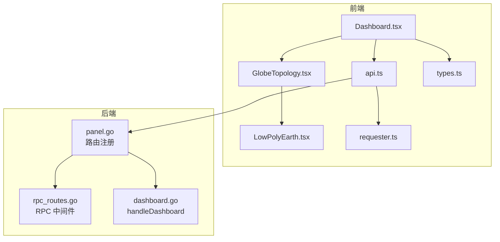
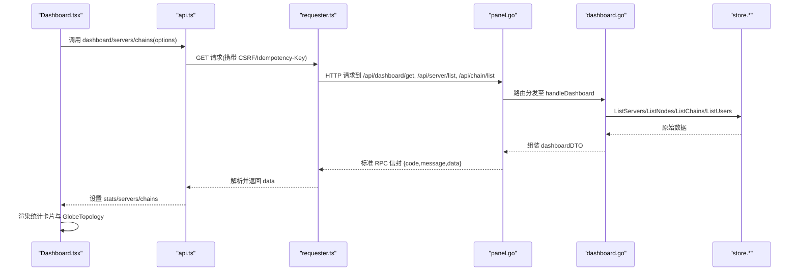
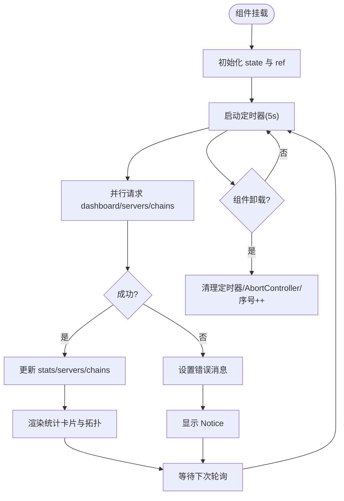
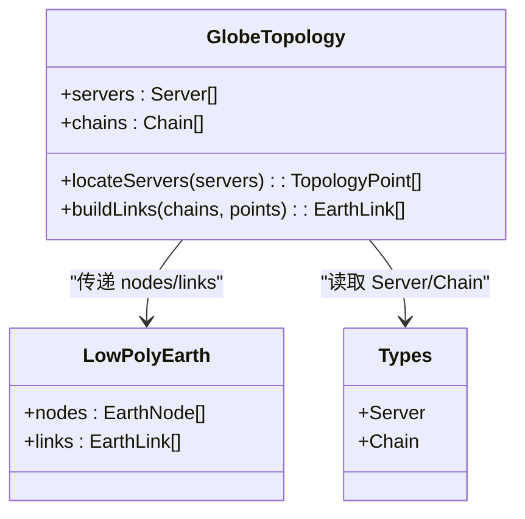
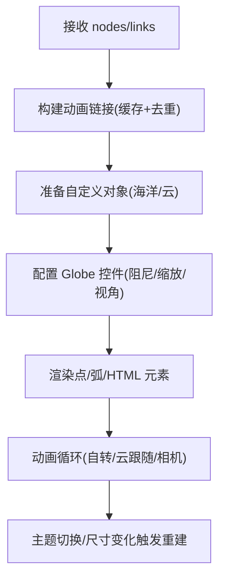
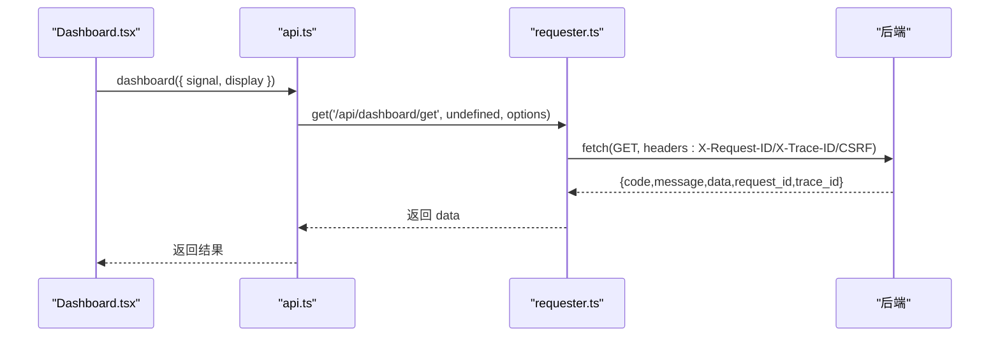
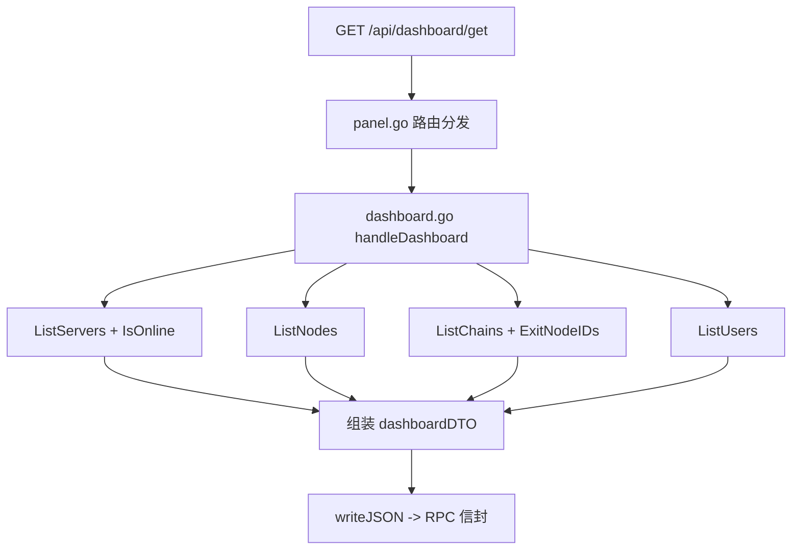
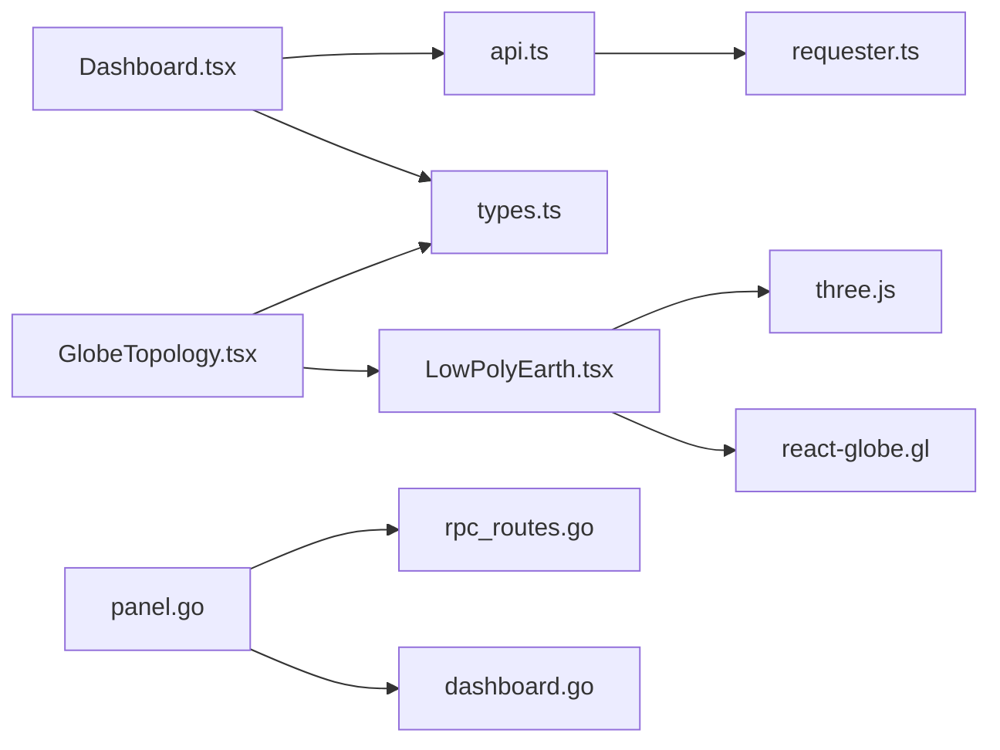

# 仪表盘页面

<cite>
**本文引用的文件**   
- [Dashboard.tsx](file://src/frontend/src/pages/Dashboard.tsx)
- [GlobeTopology.tsx](file://src/frontend/src/components/GlobeTopology.tsx)
- [LowPolyEarth.tsx](file://src/frontend/src/components/LowPolyEarth.tsx)
- [api.ts](file://src/frontend/src/lib/api.ts)
- [requester.ts](file://src/frontend/src/lib/requester.ts)
- [types.ts](file://src/frontend/src/lib/types.ts)
- [server-state.ts](file://src/frontend/src/lib/server-state.ts)
- [dashboard.go](file://src/backend/internal/panel/dashboard.go)
- [panel.go](file://src/backend/internal/panel/panel.go)
- [rpc_routes.go](file://src/backend/internal/panel/rpc_routes.go)
- [package.json](file://src/frontend/package.json)
</cite>

## 目录
1. [简介](#简介)
2. [项目结构](#项目结构)
3. [核心组件](#核心组件)
4. [架构总览](#架构总览)
5. [详细组件分析](#详细组件分析)
6. [依赖关系分析](#依赖关系分析)
7. [性能考虑](#性能考虑)
8. [故障排查指南](#故障排查指南)
9. [结论](#结论)
10. [附录：扩展指南](#附录扩展指南)

## 简介
本技术文档围绕 Lattix-codex 前端仪表盘页面展开，系统性解析 Dashboard 组件的实现与数据流，包括统计数据展示、实时刷新机制、错误处理与加载状态管理。同时说明后端如何聚合服务器、链路和用户数据，以及 GlobeTopology 全球拓扑图的集成方式。文档还涵盖定时刷新逻辑、数据缓存策略、性能优化实践，并提供扩展仪表盘的指导（新增统计卡片与自定义图表组件）。

## 项目结构
仪表盘相关的前端代码位于 src/frontend/src 下，核心文件包括页面组件 Dashboard.tsx、拓扑图组件 GlobeTopology.tsx 与 LowPolyEarth.tsx，以及 API 封装 requester.ts 与类型定义 types.ts。后端面板服务在 src/backend/internal/panel 中提供 /api/dashboard/get 等接口。

**图示来源** 
- [Dashboard.tsx:1-199](file://src/frontend/src/pages/Dashboard.tsx#L1-L199)
- [GlobeTopology.tsx:1-260](file://src/frontend/src/components/GlobeTopology.tsx#L1-L260)
- [LowPolyEarth.tsx:1-644](file://src/frontend/src/components/LowPolyEarth.tsx#L1-L644)
- [api.ts:1-294](file://src/frontend/src/lib/api.ts#L1-L294)
- [requester.ts:1-340](file://src/frontend/src/lib/requester.ts#L1-L340)
- [types.ts:1-588](file://src/frontend/src/lib/types.ts#L1-L588)
- [panel.go:160-200](file://src/backend/internal/panel/panel.go#L160-L200)
- [rpc_routes.go:1-308](file://src/backend/internal/panel/rpc_routes.go#L1-L308)
- [dashboard.go:1-74](file://src/backend/internal/panel/dashboard.go#L1-L74)

**章节来源**
- [Dashboard.tsx:1-199](file://src/frontend/src/pages/Dashboard.tsx#L1-L199)
- [panel.go:160-200](file://src/backend/internal/panel/panel.go#L160-L200)

## 核心组件
- Dashboard 页面：负责聚合统计数据、服务器列表与链路信息，驱动全局拓扑图渲染，并实现 5 秒轮询刷新。
- GlobeTopology：将服务器与链路映射为地球节点与弧线，进行地理定位与在线状态可视化。
- LowPolyEarth：基于 react-globe.gl 与 three.js 的三维地球渲染层，支持动态连线、节点徽章、动画与主题切换。
- api.ts：统一暴露 REST 调用方法，如 dashboard、servers、chains 等。
- requester.ts：HTTP 请求封装，包含重试、超时、取消、CSRF、幂等键、错误归一化与生命周期事件。
- types.ts：前后端共享的数据模型，如 DashboardStats、Server、Chain 等。
- server-state.ts：判断服务器在线状态的辅助函数。

**章节来源**
- [Dashboard.tsx:1-199](file://src/frontend/src/pages/Dashboard.tsx#L1-L199)
- [GlobeTopology.tsx:1-260](file://src/frontend/src/components/GlobeTopology.tsx#L1-L260)
- [LowPolyEarth.tsx:1-644](file://src/frontend/src/components/LowPolyEarth.tsx#L1-L644)
- [api.ts:1-294](file://src/frontend/src/lib/api.ts#L1-L294)
- [requester.ts:1-340](file://src/frontend/src/lib/requester.ts#L1-L340)
- [types.ts:1-588](file://src/frontend/src/lib/types.ts#L1-L588)
- [server-state.ts:1-23](file://src/frontend/src/lib/server-state.ts#L1-L23)

## 架构总览
仪表盘采用“前端轮询 + 后端聚合”的架构模式。前端通过 api.dashboard、api.servers、api.chains 并行获取数据，使用 AbortController 与请求序号避免竞态；后端 handleDashboard 聚合服务器数、在线数、链路数与用户数，并通过 RPC 中间件返回标准信封响应。

**图示来源** 
- [Dashboard.tsx:23-43](file://src/frontend/src/pages/Dashboard.tsx#L23-L43)
- [api.ts:75-182](file://src/frontend/src/lib/api.ts#L75-L182)
- [requester.ts:89-220](file://src/frontend/src/lib/requester.ts#L89-L220)
- [panel.go:173-176](file://src/backend/internal/panel/panel.go#L173-L176)
- [dashboard.go:20-73](file://src/backend/internal/panel/dashboard.go#L20-L73)

## 详细组件分析

### Dashboard 组件
- 数据加载与并发控制
  - 使用 Promise.all 并行拉取 dashboard、servers、chains 三组数据，提升首屏速度。
  - 通过 useRef 维护 loadRequest 序号，结合 AbortController.signal 确保旧请求被忽略或取消，避免竞态导致的脏更新。
- 定时刷新
  - useEffect 内启动定时器，每 5 秒执行一次 load，首次进入时以 silent 模式不显示错误提示，后续刷新同样静默。
  - 组件卸载时清理定时器、中止控制器并递增序号，保证资源释放。
- 错误处理与加载状态
  - 捕获异常后通过 errorMessage 转换为可读消息，并在 Notice 中展示。
  - 未获取到 stats 时显示骨架屏占位，提升用户体验。
- 数据聚合与展示
  - 统计卡片：服务器总数、在线节点、链路总数与活跃/降级链路、订阅用户数。
  - 运行概况侧栏：活跃链路、在线节点、订阅用户。
  - 拓扑区域：Suspense 包裹 GlobeTopology，懒加载渲染。

**图示来源** 
- [Dashboard.tsx:23-60](file://src/frontend/src/pages/Dashboard.tsx#L23-L60)
- [Dashboard.tsx:62-77](file://src/frontend/src/pages/Dashboard.tsx#L62-L77)
- [Dashboard.tsx:79-148](file://src/frontend/src/pages/Dashboard.tsx#L79-L148)
- [Dashboard.tsx:151-173](file://src/frontend/src/pages/Dashboard.tsx#L151-L173)

**章节来源**
- [Dashboard.tsx:1-199](file://src/frontend/src/pages/Dashboard.tsx#L1-L199)

### GlobeTopology 组件
- 地理数据加载与缓存
  - 异步加载城市与国家坐标 JSON，构建 Map 索引，并使用 coordinateCache 缓存已解析坐标，减少重复计算。
- 服务器定位与回退
  - 优先按国家码与位置名匹配城市坐标，失败则回退到国家中心坐标，再失败则生成伪随机坐标以避免重叠。
  - 对重复位置进行角度偏移与半径扩散，提升视觉区分度。
- 链路构建
  - 根据 Chain.hops 顺序生成 EarthLink，将链状态映射为地球连线状态（active/applying/failed 等）。
- 渲染与交互
  - 将 TopologyPoint 转为 EarthNode，传入 LowPolyEarth 渲染点与弧。
  - 未解析位置的节点数量提示，在线/离线图例。

**图示来源** 
- [GlobeTopology.tsx:97-179](file://src/frontend/src/components/GlobeTopology.tsx#L97-L179)
- [GlobeTopology.tsx:181-230](file://src/frontend/src/components/GlobeTopology.tsx#L181-L230)
- [types.ts:122-306](file://src/frontend/src/lib/types.ts#L122-L306)

**章节来源**
- [GlobeTopology.tsx:1-260](file://src/frontend/src/components/GlobeTopology.tsx#L1-L260)

### LowPolyEarth 组件
- 三维地球渲染
  - 使用 react-globe.gl 与 three.js 创建海洋、陆地、云层与节点/连线。
  - 支持轴倾斜、自动旋转、相机距离限制与移动端适配。
- 节点与连线动画
  - 节点徽章显示名称、国旗、在线状态与上下行速率。
  - 连线虚线动画，基于 id 哈希生成相位与时长，减少运动偏好时禁用动画。
- 主题与可访问性
  - 跟随主题色板，提供 aria-label 与屏幕阅读器列表。
- 性能优化
  - 使用 useMemo 缓存动画链接与自定义对象，ResizeObserver 监听容器尺寸变化，按需重建材质与几何体。

**图示来源** 
- [LowPolyEarth.tsx:427-448](file://src/frontend/src/components/LowPolyEarth.tsx#L427-L448)
- [LowPolyEarth.tsx:454-485](file://src/frontend/src/components/LowPolyEarth.tsx#L454-L485)
- [LowPolyEarth.tsx:487-558](file://src/frontend/src/components/LowPolyEarth.tsx#L487-L558)
- [LowPolyEarth.tsx:560-644](file://src/frontend/src/components/LowPolyEarth.tsx#L560-L644)

**章节来源**
- [LowPolyEarth.tsx:1-644](file://src/frontend/src/components/LowPolyEarth.tsx#L1-L644)

### API 与请求封装
- api.ts
  - 暴露 dashboard、servers、chains 等方法，支持 RequestOptions（signal、display 等）。
- requester.ts
  - 统一 GET/POST/DOWNLOAD，支持超时、取消、重试（仅网络错误）、CSRF 与幂等键。
  - 解析 RPC 信封，规范化错误（业务/协议/传输/取消），提供生命周期事件订阅。

**图示来源** 
- [api.ts:75-76](file://src/frontend/src/lib/api.ts#L75-L76)
- [requester.ts:89-104](file://src/frontend/src/lib/requester.ts#L89-L104)
- [requester.ts:157-220](file://src/frontend/src/lib/requester.ts#L157-L220)

**章节来源**
- [api.ts:1-294](file://src/frontend/src/lib/api.ts#L1-L294)
- [requester.ts:1-340](file://src/frontend/src/lib/requester.ts#L1-L340)

### 后端聚合逻辑
- panel.go 注册 /api/dashboard/get 路由，使用 polledRead 策略（仅记录失败日志）。
- dashboard.go 的 handleDashboard：
  - 统计服务器总数与在线数（通过 ws.AgentRequester.IsOnline）。
  - 统计链路总数与活跃/降级链路（基于 Node 与 Chain 状态）。
  - 统计用户总数。
  - 返回 dashboardDTO。

**图示来源** 
- [panel.go:173-176](file://src/backend/internal/panel/panel.go#L173-L176)
- [dashboard.go:20-73](file://src/backend/internal/panel/dashboard.go#L20-L73)

**章节来源**
- [panel.go:160-200](file://src/backend/internal/panel/panel.go#L160-L200)
- [dashboard.go:1-74](file://src/backend/internal/panel/dashboard.go#L1-L74)
- [rpc_routes.go:1-308](file://src/backend/internal/panel/rpc_routes.go#L1-L308)

## 依赖关系分析
- 前端依赖
  - Dashboard 依赖 api.ts 与 types.ts，通过 requester.ts 发起 HTTP 请求。
  - GlobeTopology 依赖 LowPolyEarth 与 types.ts，内部使用 country-state-city 与 flag-icons。
  - LowPolyEarth 依赖 react-globe.gl、three.js、@turf/simplify 与主题上下文。
- 后端依赖
  - panel.go 注册路由，dashboard.go 依赖 store 与 ws.AgentRequester。
  - rpc_routes.go 提供认证、CSRF、幂等、日志策略等通用中间件。

**图示来源** 
- [Dashboard.tsx:1-199](file://src/frontend/src/pages/Dashboard.tsx#L1-L199)
- [api.ts:1-294](file://src/frontend/src/lib/api.ts#L1-L294)
- [requester.ts:1-340](file://src/frontend/src/lib/requester.ts#L1-L340)
- [GlobeTopology.tsx:1-260](file://src/frontend/src/components/GlobeTopology.tsx#L1-L260)
- [LowPolyEarth.tsx:1-644](file://src/frontend/src/components/LowPolyEarth.tsx#L1-L644)
- [panel.go:160-200](file://src/backend/internal/panel/panel.go#L160-L200)
- [rpc_routes.go:1-308](file://src/backend/internal/panel/rpc_routes.go#L1-L308)
- [dashboard.go:1-74](file://src/backend/internal/panel/dashboard.go#L1-L74)

**章节来源**
- [package.json:1-53](file://src/frontend/package.json#L1-L53)

## 性能考虑
- 前端
  - 并行请求：Promise.all 同时拉取 dashboard/servers/chains，降低首屏延迟。
  - 取消与竞态控制：AbortController 与请求序号避免过时响应覆盖当前状态。
  - 懒加载与 Suspense：GlobeTopology 与 Globe 组件懒加载，减少初始包体积与渲染开销。
  - 数据缓存：GlobeTopology 使用 coordinateCache 缓存坐标解析结果，减少重复计算。
  - 动画与渲染优化：LowPolyEarth 使用 useMemo 缓存动画链接与自定义对象，ResizeObserver 控制尺寸变化重建，尊重 prefers-reduced-motion。
- 后端
  - 只读接口日志策略：polledRead 仅记录失败日志，降低高频轮询的日志压力。
  - 聚合查询：handleDashboard 一次性聚合多表数据，减少往返次数。
  - 幂等与限流：POST 接口支持 Idempotency-Key 与 CSRF，保障安全与一致性。

[本节为通用性能建议，不直接分析具体文件]

## 故障排查指南
- 网络连接与超时
  - requester.ts 将网络不可达与取消请求归一化为 RequestError，可在上层通过 isRequestError 判断并提示用户。
- 鉴权与 CSRF
  - 若出现 AUTH_REQUIRED，requester 会触发未授权处理器，清空 CSRF Token 并跳转登录。
- 后端错误
  - dashboard.go 中数据库查询失败会返回 500 与错误消息，前端 errorMessage 将其显示在 Notice 中。
- 调试建议
  - 利用 requester 的生命周期事件订阅，记录 start/finish 阶段与错误详情。
  - 检查浏览器网络面板中的 X-Request-ID/X-Trace-ID 头，便于跨端追踪。

**章节来源**
- [requester.ts:18-41](file://src/frontend/src/lib/requester.ts#L18-L41)
- [requester.ts:227-276](file://src/frontend/src/lib/requester.ts#L227-L276)
- [dashboard.go:20-73](file://src/backend/internal/panel/dashboard.go#L20-L73)

## 结论
仪表盘通过清晰的前后端职责划分与稳健的请求封装，实现了高可用、低延迟的实时监控体验。Dashboard 组件负责数据聚合与状态管理，GlobeTopology 与 LowPolyEarth 提供高性能的三维可视化。后端 handleDashboard 高效聚合关键指标，配合 RPC 中间件保障一致性与安全性。整体架构具备良好的扩展性与可维护性，适合持续迭代与功能增强。

[本节为总结性内容，不直接分析具体文件]

## 附录：扩展指南
- 添加新的统计卡片
  - 在 Dashboard.tsx 的 cards 数组中新增一项，绑定 DashboardStats 的新字段，并确保后端 dashboard.go 返回对应字段。
  - 示例路径参考：[Dashboard.tsx:79-108](file://src/frontend/src/pages/Dashboard.tsx#L79-L108)、[dashboard.go:10-17](file://src/backend/internal/panel/dashboard.go#L10-L17)。
- 自定义图表组件
  - 新建 React 组件，使用 api.ts 提供的接口获取数据，通过 requester.ts 的错误处理与生命周期事件进行状态管理。
  - 如需复杂可视化，可参考 LowPolyEarth 的模式：懒加载重型库、useMemo 缓存计算结果、ResizeObserver 响应尺寸变化。
- 调整刷新频率与缓存策略
  - 修改 Dashboard.tsx 的定时器间隔（默认 5 秒），或在 api.ts 中为特定接口启用更长的本地缓存（例如基于时间戳的内存缓存）。
  - 对于热点数据（如世界地图 GeoJSON），可在 GlobeTopology 或 LowPolyEarth 中增加内存缓存与失效策略。
- 接入新数据源
  - 在 api.ts 中新增接口方法，在 types.ts 中定义数据结构，Dashboard.tsx 中并行拉取并合并到 state。
  - 后端新增聚合逻辑于 dashboard.go 或独立 handler，并在 panel.go 中注册路由。

**章节来源**
- [Dashboard.tsx:79-108](file://src/frontend/src/pages/Dashboard.tsx#L79-L108)
- [dashboard.go:10-17](file://src/backend/internal/panel/dashboard.go#L10-L17)
- [api.ts:1-294](file://src/frontend/src/lib/api.ts#L1-L294)
- [types.ts:1-588](file://src/frontend/src/lib/types.ts#L1-L588)
- [LowPolyEarth.tsx:427-448](file://src/frontend/src/components/LowPolyEarth.tsx#L427-L448)
- [panel.go:160-200](file://src/backend/internal/panel/panel.go#L160-L200)