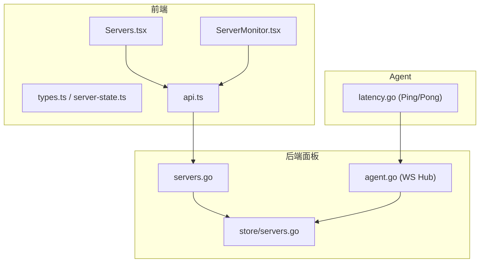
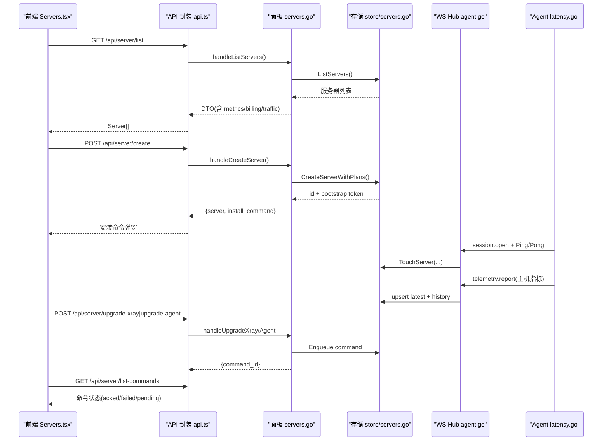
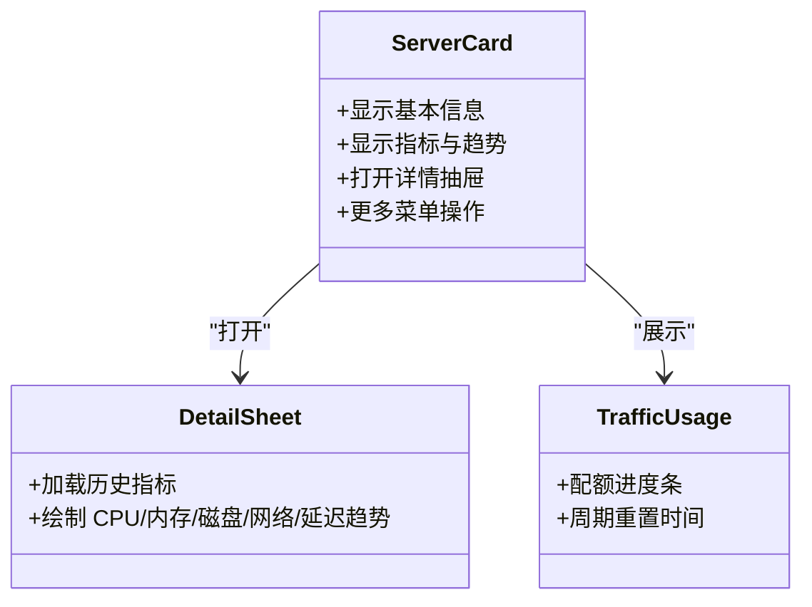
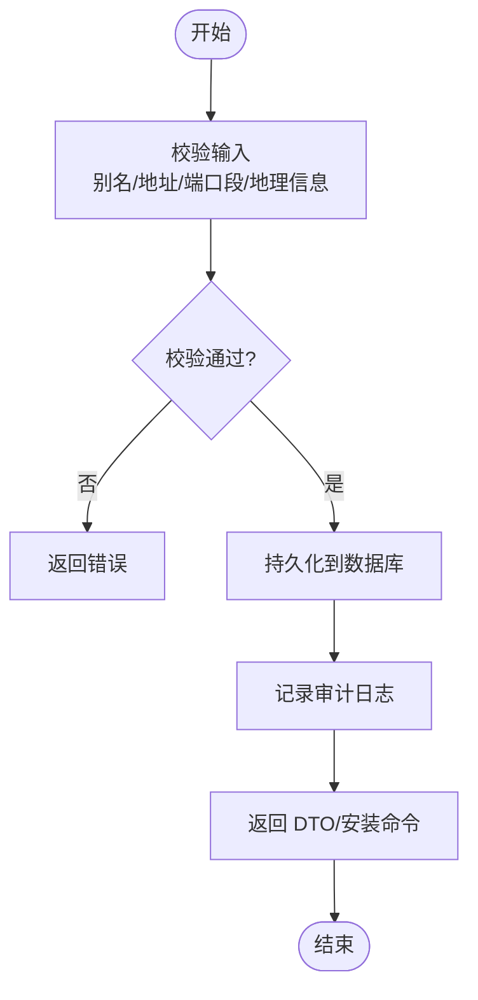
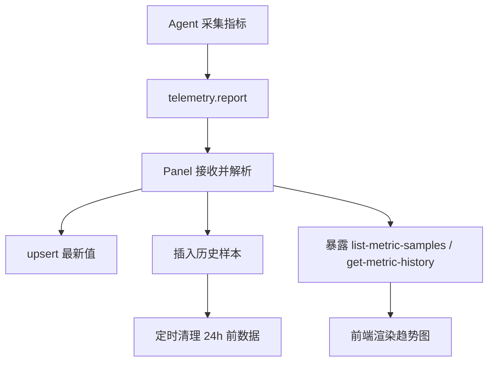
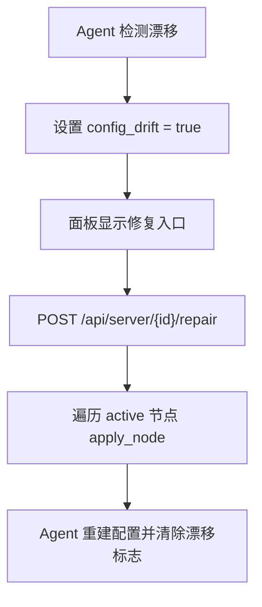
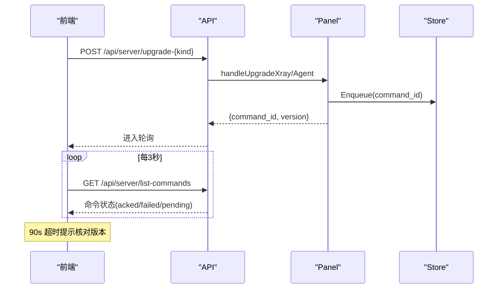
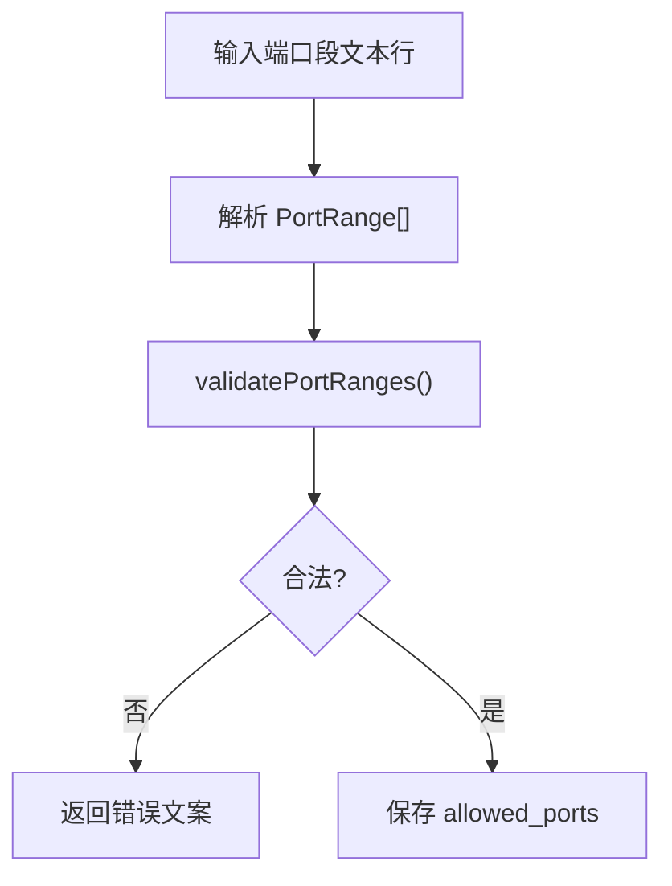
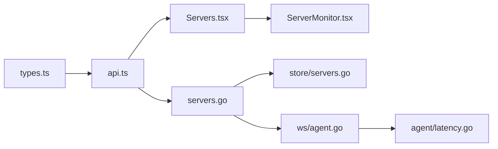

# 服务器管理页面

<cite>
**本文引用的文件**   
- [Servers.tsx](file://src/frontend/src/pages/Servers.tsx)
- [ServerMonitor.tsx](file://src/frontend/src/components/ServerMonitor.tsx)
- [server-state.ts](file://src/frontend/src/lib/server-state.ts)
- [api.ts](file://src/frontend/src/lib/api.ts)
- [types.ts](file://src/frontend/src/lib/types.ts)
- [servers.go](file://src/backend/internal/panel/servers.go)
- [servers_store.go](file://src/backend/internal/store/servers.go)
- [agent_ws.go](file://src/backend/internal/ws/agent.go)
- [latency.go](file://src/agent/cmd/agent/latency.go)
- [server-probe-monitoring-design.md](file://docs/server-probe-monitoring-design.md)
</cite>

## 目录
1. [简介](#简介)
2. [项目结构](#项目结构)
3. [核心组件](#核心组件)
4. [架构总览](#架构总览)
5. [详细组件分析](#详细组件分析)
6. [依赖关系分析](#依赖关系分析)
7. [性能考量](#性能考量)
8. [故障排查指南](#故障排查指南)
9. [结论](#结论)
10. [附录](#附录)

## 简介
本技术文档围绕 Lattix-codex 的“服务器管理页面”展开，重点解析前端 Servers 组件与后端面板服务在服务器列表展示、添加/删除、连接状态监控、配置管理与升级修复等能力上的实现。文档涵盖：
- 服务器状态检测机制（WebSocket 心跳、延迟探测、重连逻辑）
- 表单验证、端口段编辑、搜索过滤与批量操作
- 配置漂移检测与修复、版本升级（Xray/Agent）、凭证轮换
- 计费与流量计划、服务商管理、续费确认
- 指标采集与可视化（CPU/内存/磁盘/网络/延迟）
- 错误恢复与命令执行结果轮询

## 项目结构
服务器管理功能由前后端协同实现：
- 前端页面与服务监控卡片位于 src/frontend/src/pages 与 components
- API 封装与类型定义位于 src/frontend/src/lib
- 后端 HTTP 路由与业务处理位于 src/backend/internal/panel
- 数据持久化与模型位于 src/backend/internal/store
- WebSocket 会话与心跳在 src/backend/internal/ws
- Agent 侧探针与延迟计算在 src/agent/cmd/agent



图表来源
- [Servers.tsx:193-310](file://src/frontend/src/pages/Servers.tsx#L193-L310)
- [ServerMonitor.tsx:64-75](file://src/frontend/src/components/ServerMonitor.tsx#L64-L75)
- [api.ts:77-175](file://src/frontend/src/lib/api.ts#L77-L175)
- [servers.go:164-206](file://src/backend/internal/panel/servers.go#L164-L206)
- [agent_ws.go:33-239](file://src/backend/internal/ws/agent.go#L33-L239)
- [latency.go:12-55](file://src/agent/cmd/agent/latency.go#L12-L55)

章节来源
- [Servers.tsx:193-310](file://src/frontend/src/pages/Servers.tsx#L193-L310)
- [api.ts:77-175](file://src/frontend/src/lib/api.ts#L77-L175)
- [servers.go:164-206](file://src/backend/internal/panel/servers.go#L164-L206)
- [agent_ws.go:33-239](file://src/backend/internal/ws/agent.go#L33-L239)
- [latency.go:12-55](file://src/agent/cmd/agent/latency.go#L12-L55)

## 核心组件
- 服务器列表与监控卡片：ServerMonitorGrid 渲染卡片网格，展示在线状态、地址、地区、指标与趋势；提供编辑、修复、升级、刷新凭证、续费、删除等操作入口。
- 服务器生命周期管理：创建、更新（地址/NAT 端口段/标签/地理信息）、删除（级联清理）、凭证轮换、版本升级（Xray/Agent）。
- 连接状态与心跳：通过 WebSocket 建立会话，Agent 发起 Ping/Pong 维持连接并测量 RTT；Panel 维护连接快照，供列表实时显示。
- 指标采集与展示：Agent 周期上报主机遥测（CPU/内存/磁盘/网络/延迟），Panel 存储最新值与历史样本，前端以折线图与迷你条展示。
- 配置漂移与修复：Agent 检测 xray 配置文件是否被外部修改；面板提供“修复配置漂移”，重放 active 节点 apply 命令重建配置。
- 计费与流量计划：支持服务商选择、金额币种、周期续费；流量额度限制、重置锚点与计流方式。

章节来源
- [ServerMonitor.tsx:64-75](file://src/frontend/src/components/ServerMonitor.tsx#L64-L75)
- [servers.go:208-322](file://src/backend/internal/panel/servers.go#L208-L322)
- [agent_ws.go:33-239](file://src/backend/internal/ws/agent.go#L33-L239)
- [server-probe-monitoring-design.md:1-104](file://docs/server-probe-monitoring-design.md#L1-L104)

## 架构总览
服务器管理页面的端到端流程如下：
- 前端定时轮询服务器列表与指标样本，渲染卡片网格与趋势图
- 用户操作（创建/编辑/删除/升级/修复）调用后端 REST API
- 后端校验参数、落库、下发命令至 Agent，记录审计日志
- Agent 通过 WebSocket 与 Panel 保持心跳，上报遥测与命令回执
- 前端根据命令状态轮询升级结果，提示成功或失败



图表来源
- [Servers.tsx:255-310](file://src/frontend/src/pages/Servers.tsx#L255-L310)
- [api.ts:77-175](file://src/frontend/src/lib/api.ts#L77-L175)
- [servers.go:164-206](file://src/backend/internal/panel/servers.go#L164-L206)
- [servers_store.go:287-301](file://src/backend/internal/store/servers.go#L287-L301)
- [agent_ws.go:33-239](file://src/backend/internal/ws/agent.go#L33-L239)
- [latency.go:12-55](file://src/agent/cmd/agent/latency.go#L12-L55)

## 详细组件分析

### 服务器列表与监控卡片（ServerMonitorGrid）
- 卡片内容：在线状态、名称、地区、公网地址、计费状态、CPU/内存/磁盘/网络速率、延迟趋势、流量使用进度条
- 交互：点击打开详情抽屉，查看 24 小时历史曲线；更多菜单包含编辑、修复漂移、升级 Xray/Agent、刷新凭证、续费、删除
- 健康阈值：CPU/内存/磁盘 <80% 正常，80–90% 警告，>90% 严重；延迟 <100ms 正常，100–300ms 警告，>300ms 严重



图表来源
- [ServerMonitor.tsx:329-462](file://src/frontend/src/components/ServerMonitor.tsx#L329-L462)
- [ServerMonitor.tsx:684-800](file://src/frontend/src/components/ServerMonitor.tsx#L684-L800)

章节来源
- [ServerMonitor.tsx:329-462](file://src/frontend/src/components/ServerMonitor.tsx#L329-L462)
- [ServerMonitor.tsx:684-800](file://src/frontend/src/components/ServerMonitor.tsx#L684-L800)

### 服务器生命周期管理（创建/更新/删除/凭证轮换）
- 创建：生成一次性 bootstrap token，返回安装命令；支持 NAT 模式与端口段配置
- 更新：支持别名、地址（自动/手动学习）、NAT 端口段、标签、国家/地区、计费与流量计划
- 删除：在线则先下发卸载命令，再级联删除记录；离线仅删除记录
- 凭证轮换：换发新 bootstrap token，旧凭证立即失效，需重新执行安装命令



图表来源
- [servers.go:208-322](file://src/backend/internal/panel/servers.go#L208-L322)
- [servers.go:385-536](file://src/backend/internal/panel/servers.go#L385-L536)
- [servers.go:734-808](file://src/backend/internal/panel/servers.go#L734-L808)

章节来源
- [servers.go:208-322](file://src/backend/internal/panel/servers.go#L208-L322)
- [servers.go:385-536](file://src/backend/internal/panel/servers.go#L385-L536)
- [servers.go:734-808](file://src/backend/internal/panel/servers.go#L734-L808)

### 连接状态检测、心跳与重连
- WebSocket 握手：认证后建立会话，首次帧必须为 session.open
- 心跳：Agent 每 30 秒发送 Ping，Panel 原样 Pong；任何控制帧到达即续期读超时
- 连接失效：连续 90 秒无有效数据判定断开；初始化 10 秒无响应关闭连接
- 重连：Agent 按既有重连流程重试；Panel 维护连接快照，列表实时反映状态

```mermaid
sequenceDiagram
participant Agent as "Agent"
participant WS as "Panel WS Hub"
Agent->>WS : HTTP Upgrade + Authorization
WS-->>Agent : 401/403/503 或 200
Agent->>WS : session.open (payload : protocol version, xray version)
WS-->>Agent : session.open result (issued token, exchange id)
Agent->>WS : credential.commit + session.ready
WS-->>Agent : OK
Agent->>WS : Ping (每30s)
WS-->>Agent : Pong (回显载荷)
Note over Agent,WS : 90s 无数据 -> 断开; 10s 初始化失败 -> 关闭
```

图表来源
- [agent_ws.go:33-239](file://src/backend/internal/ws/agent.go#L33-L239)
- [latency.go:12-55](file://src/agent/cmd/agent/latency.go#L12-L55)

章节来源
- [agent_ws.go:33-239](file://src/backend/internal/ws/agent.go#L33-L239)
- [latency.go:12-55](file://src/agent/cmd/agent/latency.go#L12-L55)

### 指标采集与可视化
- Agent 每 60 秒上报主机遥测：CPU/负载、内存、磁盘、网卡流量、运行时间、延迟
- Panel 存储最新值与历史样本，提供批量最近样本接口用于卡片趋势
- 前端展示：卡片内迷你延迟趋势（最近 30 次），详情抽屉 24 小时折线图



图表来源
- [server-probe-monitoring-design.md:27-75](file://docs/server-probe-monitoring-design.md#L27-L75)
- [servers.go:164-206](file://src/backend/internal/panel/servers.go#L164-L206)

章节来源
- [server-probe-monitoring-design.md:27-75](file://docs/server-probe-monitoring-design.md#L27-L75)

### 配置漂移检测与修复
- 漂移检测：Agent 比较当前 xray 配置文件哈希与上次受管落盘哈希，差异视为漂移
- 修复流程：面板触发 repair，重放该服务器全部 active 节点的 apply_node，Agent 重建配置并清除漂移标志



图表来源
- [servers.go:674-720](file://src/backend/internal/panel/servers.go#L674-L720)
- [manager.go:289-371](file://src/agent/cmd/agent/latency.go#L289-L371)

章节来源
- [servers.go:674-720](file://src/backend/internal/panel/servers.go#L674-L720)
- [manager.go:289-371](file://src/agent/cmd/agent/latency.go#L289-L371)

### 版本升级（Xray/Agent）与命令轮询
- 升级入口：选择 kind（xray/agent）与版本（latest 或 vX.Y.Z）
- 命令下发：后端入队 upgrade_xray 或 upgrade_agent，返回 command_id
- 结果轮询：前端定时查询命令日志，跟踪 acked/failed/pending，90 秒超时兜底



图表来源
- [servers.go:587-672](file://src/backend/internal/panel/servers.go#L587-L672)
- [api.ts:102-118](file://src/frontend/src/lib/api.ts#L102-L118)
- [Servers.tsx:574-645](file://src/frontend/src/pages/Servers.tsx#L574-L645)

章节来源
- [servers.go:587-672](file://src/backend/internal/panel/servers.go#L587-L672)
- [api.ts:102-118](file://src/frontend/src/lib/api.ts#L102-L118)
- [Servers.tsx:574-645](file://src/frontend/src/pages/Servers.tsx#L574-L645)

### 表单验证与端口段编辑
- 必填项：别名、国家/地区、NAT 模式的公网地址
- 端口段格式：单端口、范围、映射（如 20001-20010:10001-10010）
- 收窄校验：端口段收窄时检查存量节点 realized 端口与链跳 forward/portal 端口不越界



图表来源
- [Servers.tsx:175-191](file://src/frontend/src/pages/Servers.tsx#L175-L191)
- [servers.go:538-573](file://src/backend/internal/panel/servers.go#L538-L573)

章节来源
- [Servers.tsx:175-191](file://src/frontend/src/pages/Servers.tsx#L175-L191)
- [servers.go:538-573](file://src/backend/internal/panel/servers.go#L538-L573)

### 计费与流量计划、服务商管理
- 计费：启用/禁用、服务商选择、金额币种、开通日期、周期与下次续费日
- 流量计划：有限额度（GB/TB）、计流方式（出站/双向/取较大方向）、重置锚点
- 服务商：增删改查，已使用时不可删除

章节来源
- [Servers.tsx:74-127](file://src/frontend/src/pages/Servers.tsx#L74-L127)
- [api.ts:165-180](file://src/frontend/src/lib/api.ts#L165-L180)

### 搜索过滤与批量操作
- 搜索过滤：当前实现未内置全局搜索框；可通过浏览器页面内查找或扩展前端组件
- 批量操作：当前为单服务器操作；可基于 TagInput 与后端批量接口扩展（如批量升级/删除）

[本节为概念性说明，不直接分析具体文件]

### 导入导出与批量部署
- 导入导出：当前未提供服务器配置的导入导出 API；可在后端新增批量接口，前端增加 CSV/JSON 上传与下载
- 批量部署：结合安装命令与任务队列，实现多服务器并行安装与状态追踪

[本节为概念性说明，不直接分析具体文件]

## 依赖关系分析
- 前端依赖：
  - types.ts 定义 Server、ServerMetrics、PortRange、BillingProfile 等类型
  - api.ts 封装所有 REST 调用，统一错误处理与请求选项
  - server-state.ts 提供连接状态判断与标签转换
- 后端依赖：
  - servers.go 处理 HTTP 路由与业务逻辑，调用 store 与 dispatch
  - store/servers.go 负责数据模型与 SQL 操作
  - ws/agent.go 管理 WebSocket 会话、心跳与消息分发
- Agent 依赖：
  - latency.go 实现 Ping/Pong 与延迟统计



图表来源
- [types.ts:122-154](file://src/frontend/src/lib/types.ts#L122-L154)
- [api.ts:77-175](file://src/frontend/src/lib/api.ts#L77-L175)
- [servers.go:164-206](file://src/backend/internal/panel/servers.go#L164-L206)
- [agent_ws.go:33-239](file://src/backend/internal/ws/agent.go#L33-L239)
- [latency.go:12-55](file://src/agent/cmd/agent/latency.go#L12-L55)

章节来源
- [types.ts:122-154](file://src/frontend/src/lib/types.ts#L122-L154)
- [api.ts:77-175](file://src/frontend/src/lib/api.ts#L77-L175)
- [servers.go:164-206](file://src/backend/internal/panel/servers.go#L164-L206)
- [agent_ws.go:33-239](file://src/backend/internal/ws/agent.go#L33-L239)
- [latency.go:12-55](file://src/agent/cmd/agent/latency.go#L12-L55)

## 性能考量
- 前端轮询：服务器列表每 5 秒刷新，指标样本每 60 秒刷新，避免频繁请求
- 后端聚合：列表接口合并 metrics/billing/traffic 数据，减少前端多次请求
- 存储优化：历史指标按 24 小时清理，最新值快速读取
- WebSocket 心跳：Agent 主动 Ping，Panel 被动 Pong，降低服务端开销
- 升级轮询：命令状态每 3 秒轮询，90 秒超时兜底，避免长时间阻塞

[本节为通用指导，不直接分析具体文件]

## 故障排查指南
- 连接失败：检查 WebSocket 握手与认证，确认 Authorization 头与协议版本
- 指标缺失：确认 Agent 是否正常上报 telemetry.report，检查 Panel 存储与清理策略
- 配置漂移：查看 config_drift 标志，执行修复流程并重放 apply_node
- 升级失败：查看命令日志 error 字段，核对版本格式与 release 可用性
- 端口段报错：检查端口段格式与收窄校验，确保存量端口不越界

章节来源
- [agent_ws.go:33-239](file://src/backend/internal/ws/agent.go#L33-L239)
- [servers.go:538-573](file://src/backend/internal/panel/servers.go#L538-L573)
- [servers.go:674-720](file://src/backend/internal/panel/servers.go#L674-L720)

## 结论
服务器管理页面通过前后端协作实现了完整的服务器生命周期管理、实时监控、配置修复与版本升级能力。WebSocket 心跳与延迟探测保障了连接可靠性，Agent 遥测提供了丰富的系统指标。未来可扩展搜索过滤、批量操作、导入导出等功能以提升运维效率。

[本节为总结性内容，不直接分析具体文件]

## 附录
- 关键 API 路径：
  - GET /api/server/list
  - POST /api/server/create
  - PATCH /api/server/update
  - POST /api/server/delete
  - POST /api/server/rotate-token
  - POST /api/server/upgrade-xray
  - POST /api/server/upgrade-agent
  - GET /api/server/list-commands
  - POST /api/server/repair
  - GET /api/server/list-metric-samples
  - GET /api/server/get-metric-history

章节来源
- [api.ts:77-175](file://src/frontend/src/lib/api.ts#L77-L175)