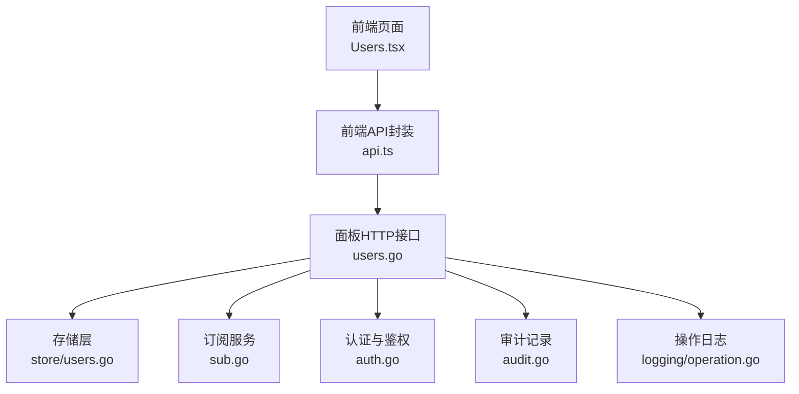
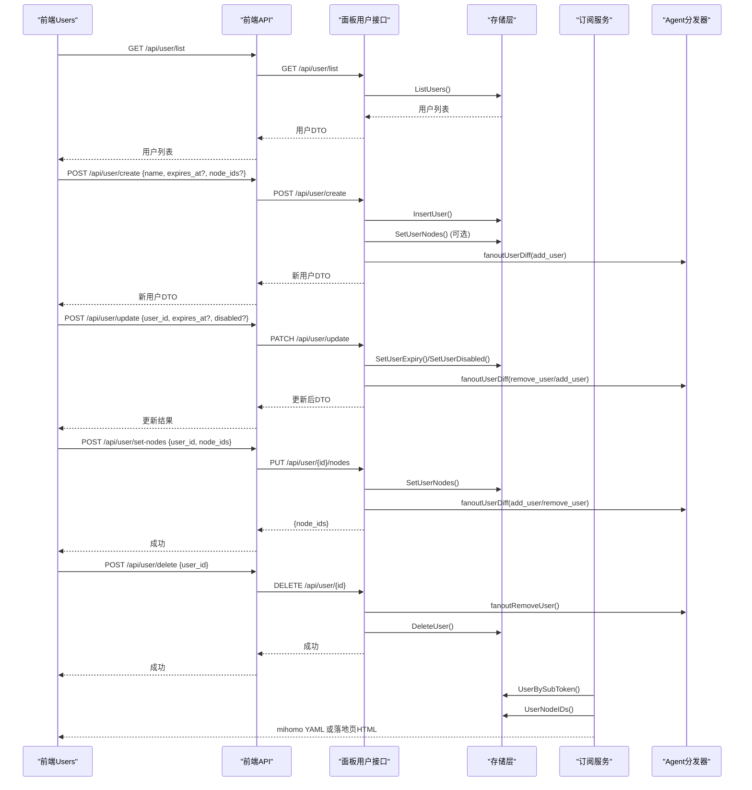
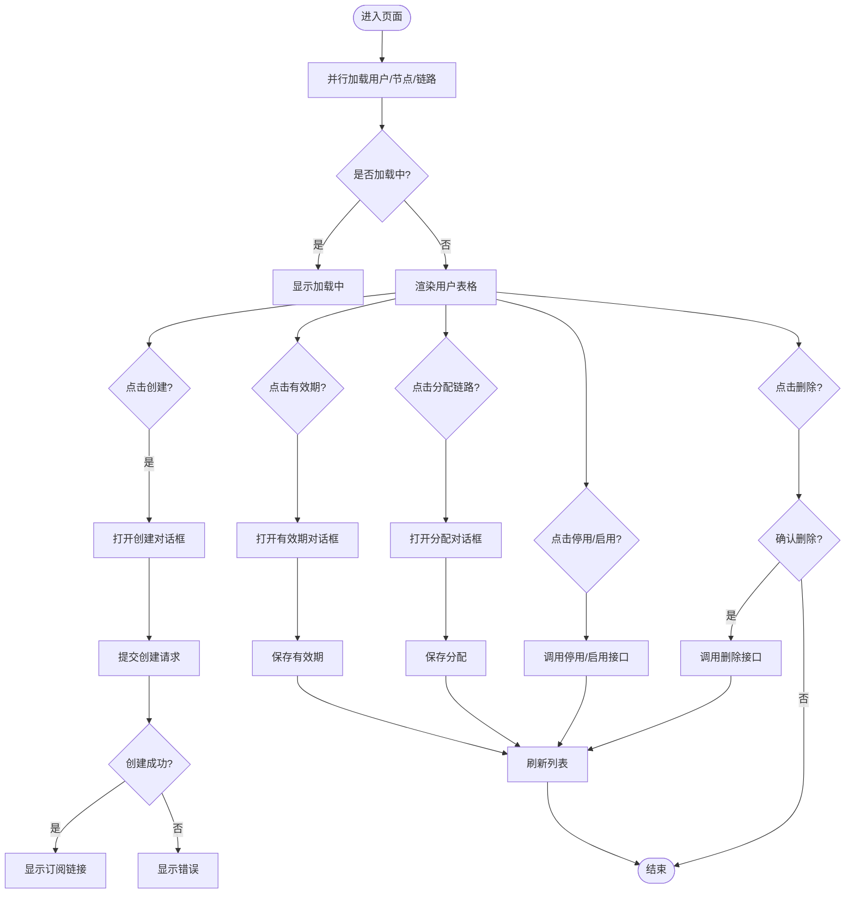
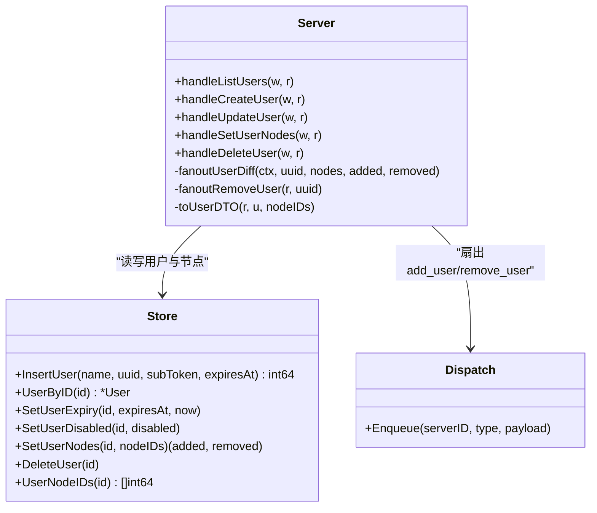
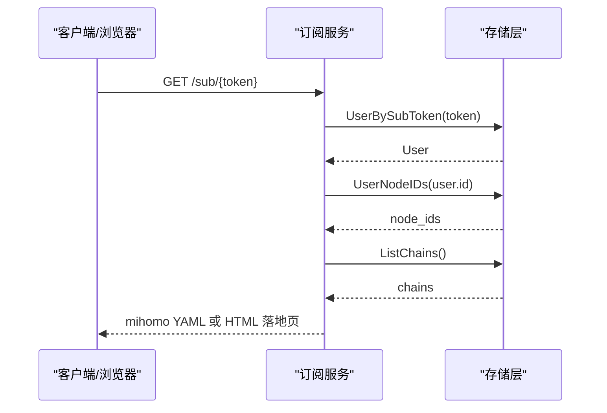
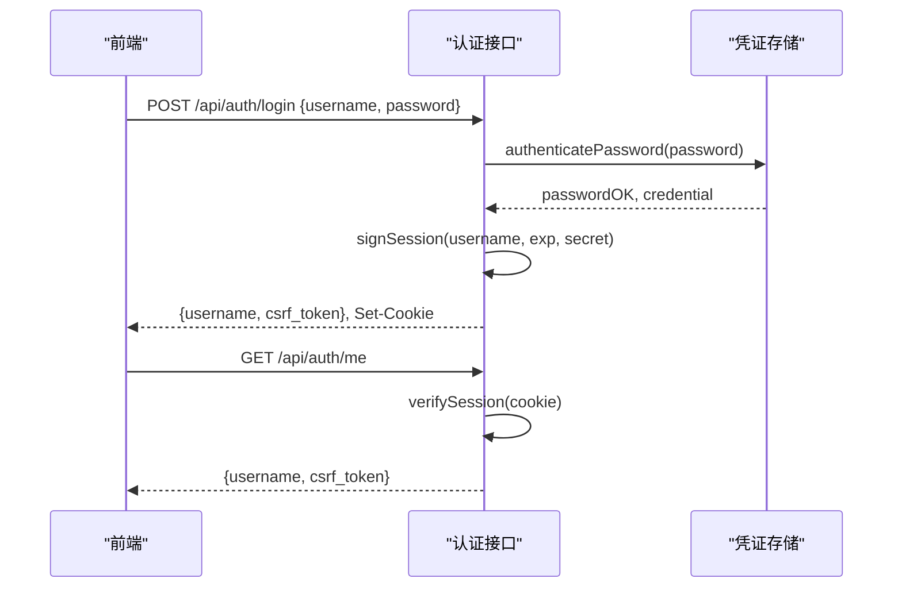
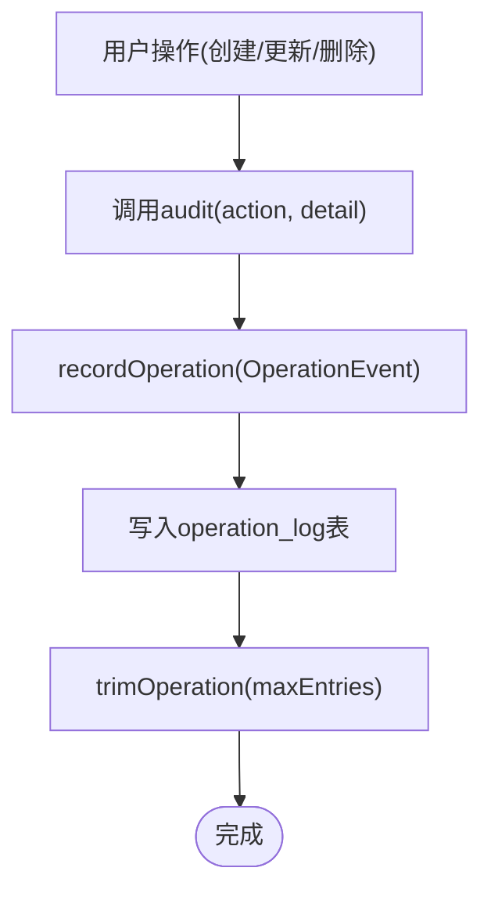
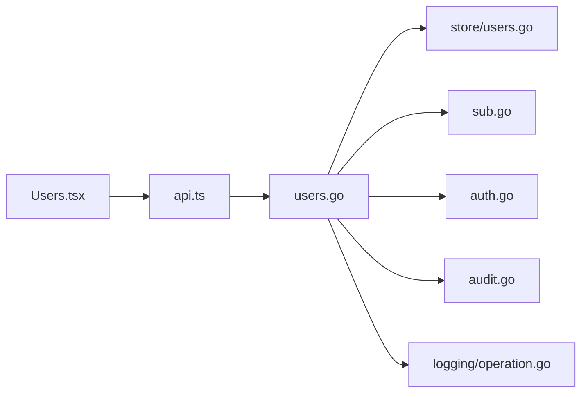

# 用户管理页面

<cite>
**本文引用的文件**
- [Users.tsx](file://src/frontend/src/pages/Users.tsx)
- [api.ts](file://src/frontend/src/lib/api.ts)
- [types.ts](file://src/frontend/src/lib/types.ts)
- [links.ts](file://src/frontend/src/lib/links.ts)
- [users.go](file://src/backend/internal/panel/users.go)
- [auth.go](file://src/backend/internal/panel/auth.go)
- [audit.go](file://src/backend/internal/panel/audit.go)
- [sub.go](file://src/backend/internal/sub/sub.go)
- [users_store.go](file://src/backend/internal/store/users.go)
- [operation.go](file://src/backend/internal/logging/operation.go)
</cite>

## 目录
1. [简介](#简介)
2. [项目结构](#项目结构)
3. [核心组件](#核心组件)
4. [架构总览](#架构总览)
5. [详细组件分析](#详细组件分析)
6. [依赖关系分析](#依赖关系分析)
7. [性能考虑](#性能考虑)
8. [故障排查指南](#故障排查指南)
9. [结论](#结论)
10. [附录](#附录)

## 简介
本技术文档面向 Lattix-codex 的用户管理页面，围绕 Users 组件的实现进行系统化说明。内容涵盖：
- 用户列表展示、创建、编辑有效期与停用/启用、删除等全生命周期操作
- 用户角色与权限控制（管理员会话认证、CSRF 校验、来源校验）
- 订阅链接生成（mihomo YAML 与落地页 HTML）、分享链接集合订阅
- 用户配额限制（到期自动停权、显式停用）
- 批量用户操作（前端交互层面支持多选分配链路）
- 导入导出与模板能力（当前代码未实现，提供扩展建议）
- 用户行为审计、登录日志与异常监控（操作日志与请求日志）
- 数据同步机制（用户变更通过分发器向 Agent 扇出 add_user/remove_user）

## 项目结构
用户管理功能由前后端协同实现：
- 前端：React 页面 Users.tsx，封装 API 调用、状态管理与 UI 交互；类型定义在 types.ts；链接选项构建在 links.ts
- 后端：面板 HTTP 处理器 users.go 处理用户 CRUD、节点分配、扇出同步；认证与鉴权在 auth.go；审计记录在 audit.go；订阅服务在 sub.go；存储层在 store/users.go；操作日志在 logging/operation.go

**图表来源**
- [Users.tsx:1-514](file://src/frontend/src/pages/Users.tsx#L1-L514)
- [api.ts:207-227](file://src/frontend/src/lib/api.ts#L207-L227)
- [users.go:50-156](file://src/backend/internal/panel/users.go#L50-L156)
- [users_store.go:118-192](file://src/backend/internal/store/users.go#L118-L192)
- [sub.go:143-190](file://src/backend/internal/sub/sub.go#L143-L190)
- [auth.go:81-145](file://src/backend/internal/panel/auth.go#L81-L145)
- [audit.go:12-34](file://src/backend/internal/panel/audit.go#L12-L34)
- [operation.go:142-182](file://src/backend/internal/logging/operation.go#L142-L182)

**章节来源**
- [Users.tsx:1-514](file://src/frontend/src/pages/Users.tsx#L1-L514)
- [api.ts:207-227](file://src/frontend/src/lib/api.ts#L207-L227)
- [users.go:50-156](file://src/backend/internal/panel/users.go#L50-L156)

## 核心组件
- 前端 Users 组件：负责用户列表渲染、创建对话框、有效期修改、节点分配、停用/启用、删除确认、二维码展示与复制按钮
- 后端用户处理器：提供用户列表、创建、更新（有效期与停用）、节点分配、删除等接口，并负责与存储层和分发器的交互
- 订阅服务：根据用户 UUID 与已分配节点生成 mihomo YAML 或浏览器落地页
- 认证与鉴权：基于 Cookie 的会话签名、CSRF 校验、来源校验
- 审计与日志：统一的操作日志记录与查询

**章节来源**
- [Users.tsx:59-128](file://src/frontend/src/pages/Users.tsx#L59-L128)
- [users.go:50-156](file://src/backend/internal/panel/users.go#L50-L156)
- [sub.go:143-190](file://src/backend/internal/sub/sub.go#L143-L190)
- [auth.go:81-145](file://src/backend/internal/panel/auth.go#L81-L145)
- [audit.go:12-34](file://src/backend/internal/panel/audit.go#L12-L34)

## 架构总览
用户管理的端到端流程如下：
- 前端轮询获取用户、节点、链路信息，渲染表格与操作按钮
- 创建用户时，前端调用 /api/user/create，后端生成 UUID 与 sub_token，可选预选节点并扇出 add_user
- 修改有效期或停用/启用时，后端更新存储并根据有效停权态跃迁扇出 remove_user/add_user
- 分配节点时，后端计算差量并扇出对应节点的 add_user/remove_user
- 删除用户时，先扇出 remove_user，再删除存储记录
- 订阅端点根据用户 token 返回 mihomo YAML 或落地页，包含用户可用节点与链路的代理条目

**图表来源**
- [Users.tsx:90-128](file://src/frontend/src/pages/Users.tsx#L90-L128)
- [api.ts:207-227](file://src/frontend/src/lib/api.ts#L207-L227)
- [users.go:82-156](file://src/backend/internal/panel/users.go#L82-L156)
- [users.go:287-345](file://src/backend/internal/panel/users.go#L287-L345)
- [users.go:381-412](file://src/backend/internal/panel/users.go#L381-L412)
- [sub.go:143-190](file://src/backend/internal/sub/sub.go#L143-L190)

## 详细组件分析

### 前端 Users 组件
- 数据加载：使用 AbortController 与定时器轮询 /api/user/list、/api/node/list、/api/chain/list，避免竞态与内存泄漏
- 创建用户：表单收集 name、expires_at、node_ids，调用 createUser，成功后刷新列表并显示订阅链接
- 有效期修改：打开对话框设置 datetime-local 值，转换为 RFC3339 后调用 updateUserExpiry
- 节点分配：勾选直连与中转链路，保存时调用 setUserNodes 并刷新
- 停用/启用：切换 disabled 标志，调用 setUserDisabled
- 删除用户：确认后调用 deleteUser，刷新列表
- 订阅链接：展示 sub_url 与 sub_links_url，支持复制与二维码展示

**图表来源**
- [Users.tsx:90-128](file://src/frontend/src/pages/Users.tsx#L90-L128)
- [Users.tsx:147-160](file://src/frontend/src/pages/Users.tsx#L147-L160)
- [Users.tsx:168-183](file://src/frontend/src/pages/Users.tsx#L168-L183)
- [Users.tsx:227-242](file://src/frontend/src/pages/Users.tsx#L227-L242)
- [Users.tsx:205-215](file://src/frontend/src/pages/Users.tsx#L205-L215)
- [Users.tsx:185-203](file://src/frontend/src/pages/Users.tsx#L185-L203)

**章节来源**
- [Users.tsx:59-128](file://src/frontend/src/pages/Users.tsx#L59-L128)
- [Users.tsx:147-160](file://src/frontend/src/pages/Users.tsx#L147-L160)
- [Users.tsx:168-183](file://src/frontend/src/pages/Users.tsx#L168-L183)
- [Users.tsx:227-242](file://src/frontend/src/pages/Users.tsx#L227-L242)
- [Users.tsx:205-215](file://src/frontend/src/pages/Users.tsx#L205-L215)
- [Users.tsx:185-203](file://src/frontend/src/pages/Users.tsx#L185-L203)

### 后端用户处理器
- 用户列表：合并用户信息与流量统计、节点分配，构造 userDTO
- 创建用户：校验输入，生成 UUID 与 sub_token，插入存储，可选预选节点并扇出 add_user
- 更新用户：支持 expires_at 与 disabled 字段，按有效停权态跃迁扇出 remove_user/add_user
- 节点分配：整体替换用户节点，计算差量并扇出
- 删除用户：先扇出 remove_user，再删除存储记录

**图表来源**
- [users.go:50-156](file://src/backend/internal/panel/users.go#L50-L156)
- [users.go:287-345](file://src/backend/internal/panel/users.go#L287-L345)
- [users.go:381-412](file://src/backend/internal/panel/users.go#L381-L412)
- [users_store.go:25-38](file://src/backend/internal/store/users.go#L25-L38)
- [users_store.go:170-192](file://src/backend/internal/store/users.go#L170-L192)
- [users_store.go:214-253](file://src/backend/internal/store/users.go#L214-L253)

**章节来源**
- [users.go:50-156](file://src/backend/internal/panel/users.go#L50-L156)
- [users.go:287-345](file://src/backend/internal/panel/users.go#L287-L345)
- [users.go:381-412](file://src/backend/internal/panel/users.go#L381-L412)

### 订阅服务
- 根据 sub_token 查找用户，过滤已分配且 active 的节点与链路
- 浏览器 Accept 含 text/html 时返回落地页 HTML，否则返回 mihomo YAML
- 有效停权态（expired 或 disabled）用户订阅返回空 proxies，客户端显示到期/停用而非报错
- 为每个协议构造代理项，填充 UUID、密码、传输参数等

**图表来源**
- [sub.go:143-190](file://src/backend/internal/sub/sub.go#L143-L190)
- [sub.go:205-247](file://src/backend/internal/sub/sub.go#L205-L247)
- [sub.go:301-369](file://src/backend/internal/sub/sub.go#L301-L369)

**章节来源**
- [sub.go:143-190](file://src/backend/internal/sub/sub.go#L143-L190)
- [sub.go:205-247](file://src/backend/internal/sub/sub.go#L205-L247)
- [sub.go:301-369](file://src/backend/internal/sub/sub.go#L301-L369)

### 认证与鉴权
- 登录：POST /api/auth/login，验证用户名密码，签发带签名的会话 Cookie，记录登录事件
- 登出：POST /api/auth/logout，清除会话 Cookie
- 当前用户：GET /api/auth/me，返回用户名与 CSRF Token
- 中间件：requireAuth 校验会话，requireCSRF 校验 CSRF Token，requireSameOrigin 校验来源

**图表来源**
- [auth.go:81-145](file://src/backend/internal/panel/auth.go#L81-L145)
- [auth.go:147-181](file://src/backend/internal/panel/auth.go#L147-L181)
- [auth.go:197-213](file://src/backend/internal/panel/auth.go#L197-L213)
- [auth.go:229-249](file://src/backend/internal/panel/auth.go#L229-L249)
- [auth.go:251-268](file://src/backend/internal/panel/auth.go#L251-L268)

**章节来源**
- [auth.go:81-145](file://src/backend/internal/panel/auth.go#L81-L145)
- [auth.go:147-181](file://src/backend/internal/panel/auth.go#L147-L181)
- [auth.go:197-213](file://src/backend/internal/panel/auth.go#L197-L213)
- [auth.go:229-249](file://src/backend/internal/panel/auth.go#L229-L249)
- [auth.go:251-268](file://src/backend/internal/panel/auth.go#L251-L268)

### 审计与日志
- 审计：所有写操作成功后调用 audit，记录 action、operator、IP、RequestID、TraceID 等
- 操作日志：SQLite 存储，支持分页、过滤、清理，保留最近 N 条
- 请求日志：记录 HTTP/WebSocket 请求详情，支持查询与清理

**图表来源**
- [audit.go:12-34](file://src/backend/internal/panel/audit.go#L12-L34)
- [operation.go:142-182](file://src/backend/internal/logging/operation.go#L142-L182)
- [operation.go:377-389](file://src/backend/internal/logging/operation.go#L377-L389)

**章节来源**
- [audit.go:12-34](file://src/backend/internal/panel/audit.go#L12-L34)
- [operation.go:142-182](file://src/backend/internal/logging/operation.go#L142-L182)
- [operation.go:377-389](file://src/backend/internal/logging/operation.go#L377-L389)

## 依赖关系分析
- 前端依赖：api.ts 封装所有 HTTP 请求，types.ts 定义数据结构，links.ts 构建链路选项
- 后端依赖：users.go 依赖 store/users.go 进行数据持久化，依赖 dispatch 进行异步下发，依赖 audit.go 记录审计
- 订阅服务依赖 store/users.go 获取用户与节点信息，依赖 shared 协议常量

**图表来源**
- [Users.tsx:1-514](file://src/frontend/src/pages/Users.tsx#L1-L514)
- [api.ts:207-227](file://src/frontend/src/lib/api.ts#L207-L227)
- [users.go:50-156](file://src/backend/internal/panel/users.go#L50-L156)
- [users_store.go:118-192](file://src/backend/internal/store/users.go#L118-L192)
- [sub.go:143-190](file://src/backend/internal/sub/sub.go#L143-L190)
- [auth.go:81-145](file://src/backend/internal/panel/auth.go#L81-L145)
- [audit.go:12-34](file://src/backend/internal/panel/audit.go#L12-L34)
- [operation.go:142-182](file://src/backend/internal/logging/operation.go#L142-L182)

**章节来源**
- [Users.tsx:1-514](file://src/frontend/src/pages/Users.tsx#L1-L514)
- [api.ts:207-227](file://src/frontend/src/lib/api.ts#L207-L227)
- [users.go:50-156](file://src/backend/internal/panel/users.go#L50-L156)

## 性能考虑
- 前端轮询：使用 AbortController 取消未完成请求，避免竞态与内存泄漏；静默模式减少 UI 抖动
- 后端并发：并行获取用户、节点、链路信息，减少响应时间
- 存储层：使用事务保证一致性，索引优化查询性能
- 订阅服务：按需生成 YAML，跳过无效节点与链路，减少不必要计算

[本节为通用指导，不直接分析具体文件]

## 故障排查指南
- 登录失败：检查用户名密码、会话 Cookie、CSRF Token、来源校验
- 用户创建失败：检查 name 是否为空、expires_at 格式、node_ids 是否存在
- 节点分配失败：检查节点 ID 有效性、用户是否存在
- 订阅链接无效：检查 sub_token 是否正确、用户是否被停用或到期
- 审计日志缺失：检查 audit 调用路径、日志存储是否启用

**章节来源**
- [auth.go:81-145](file://src/backend/internal/panel/auth.go#L81-L145)
- [users.go:82-156](file://src/backend/internal/panel/users.go#L82-L156)
- [users.go:287-345](file://src/backend/internal/panel/users.go#L287-L345)
- [sub.go:143-190](file://src/backend/internal/sub/sub.go#L143-L190)

## 结论
Lattix-codex 用户管理页面实现了完整的用户生命周期管理、权限控制、订阅链接生成与审计日志功能。前端采用 React 组件化设计，后端采用模块化 HTTP 处理器与存储层分离，确保高内聚低耦合。未来可扩展批量操作、导入导出与模板功能，提升用户体验与管理效率。

[本节为总结性内容，不直接分析具体文件]

## 附录
- 批量用户操作：当前前端支持多选分配链路，可进一步扩展批量创建、批量停用/启用、批量删除
- 导入导出：可引入 CSV/Excel 导入导出，支持用户模板与批量配置
- 用户模板：预定义常用用户配置（有效期、节点分配），快速创建用户

[本节为概念性内容，不直接分析具体文件]