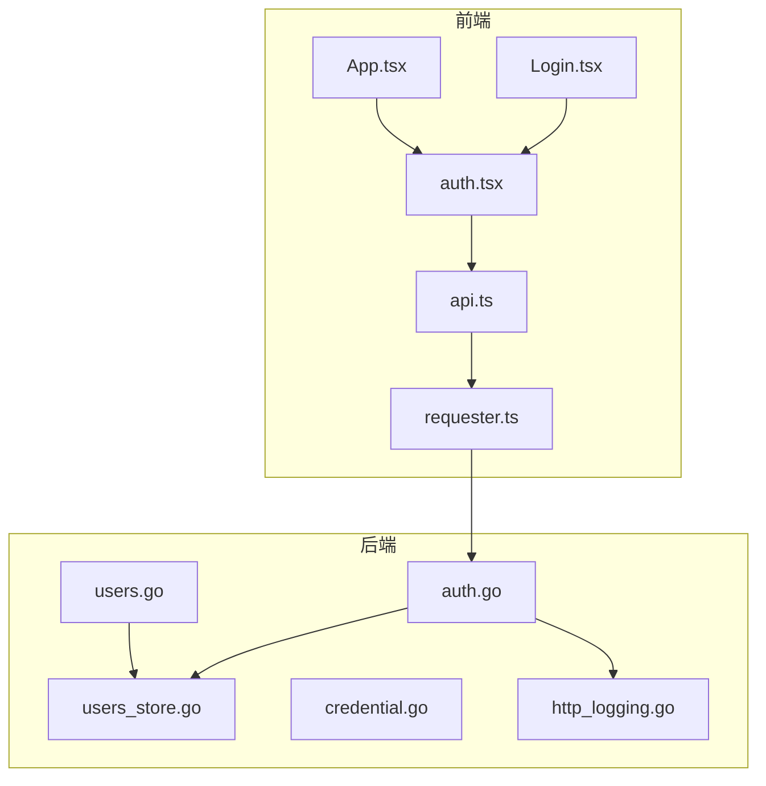
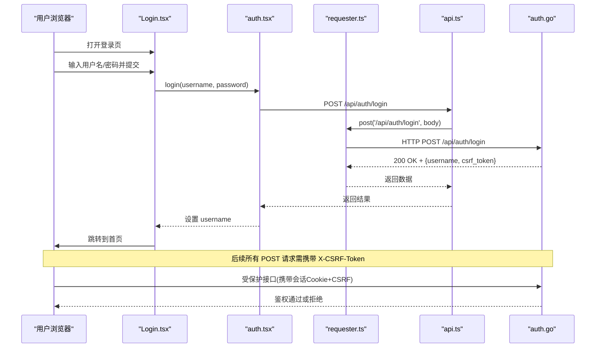
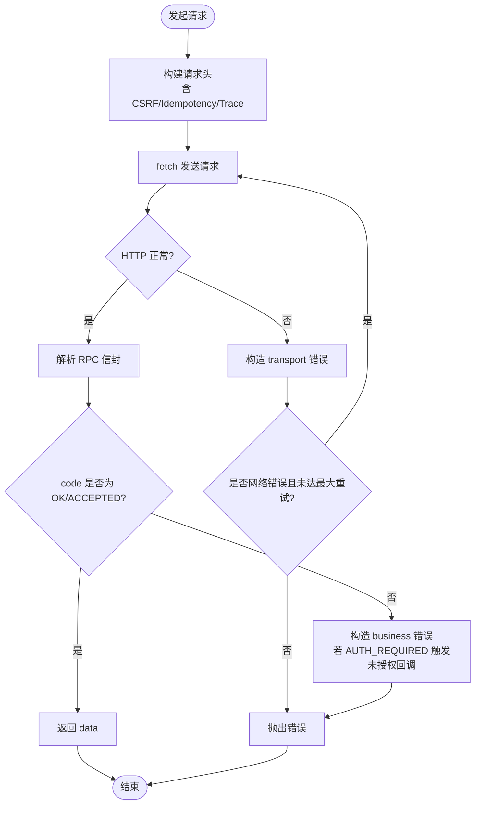
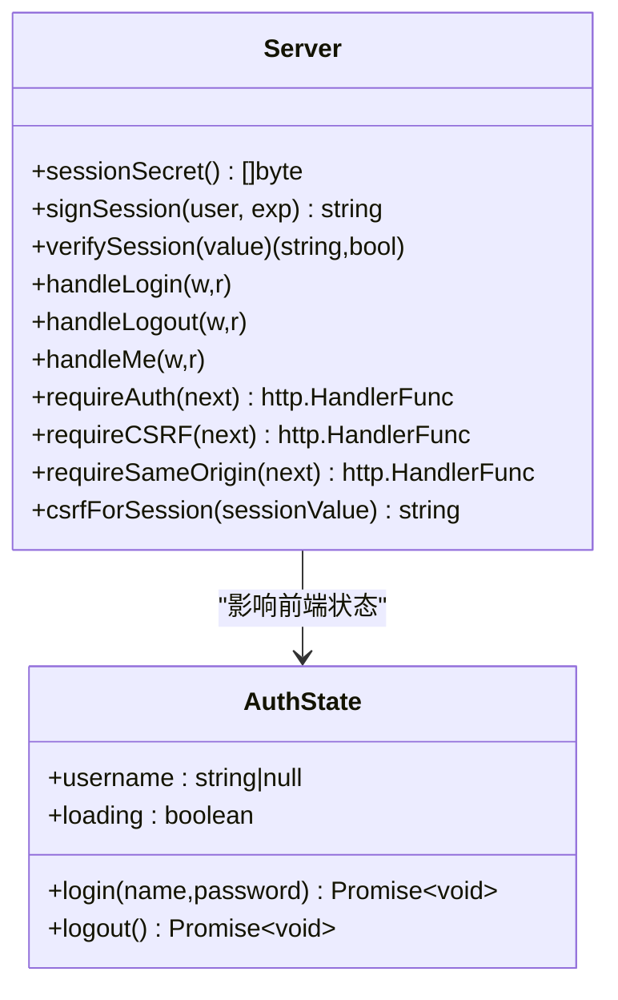
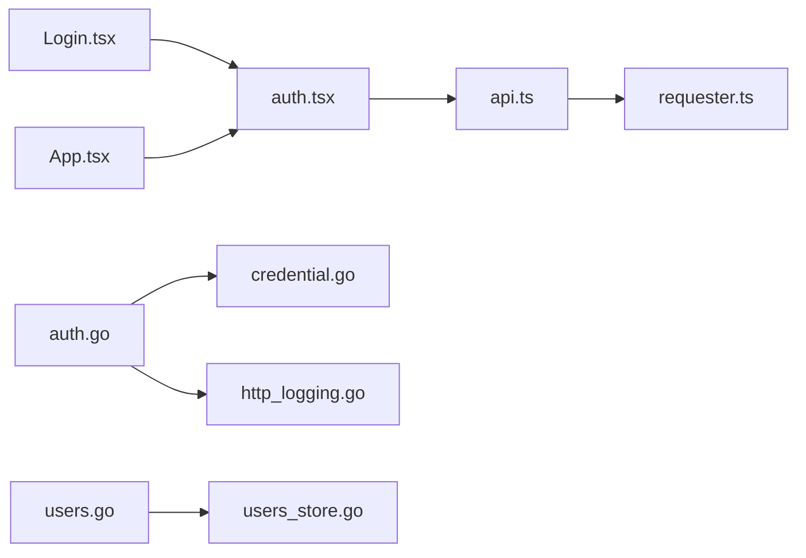

# 登录页面

<cite>
**本文引用的文件**   
- [Login.tsx](file://src/frontend/src/pages/Login.tsx)
- [auth.tsx](file://src/frontend/src/lib/auth.tsx)
- [api.ts](file://src/frontend/src/lib/api.ts)
- [requester.ts](file://src/frontend/src/lib/requester.ts)
- [auth.go](file://src/backend/internal/panel/auth.go)
- [users.go](file://src/backend/internal/panel/users.go)
- [users_store.go](file://src/backend/internal/store/users.go)
- [credential.go](file://src/shared/credential.go)
- [http_logging.go](file://src/backend/internal/logging/http.go)
- [App.tsx](file://src/frontend/src/App.tsx)
</cite>

## 目录
1. [简介](#简介)
2. [项目结构](#项目结构)
3. [核心组件](#核心组件)
4. [架构总览](#架构总览)
5. [详细组件分析](#详细组件分析)
6. [依赖关系分析](#依赖关系分析)
7. [性能与可用性](#性能与可用性)
8. [故障排查指南](#故障排查指南)
9. [结论](#结论)
10. [附录：安全与扩展建议](#附录安全与扩展建议)

## 简介
本技术文档聚焦 Lattix-codex 的登录页面实现，围绕前端 Login 组件、认证状态管理、后端会话签发与校验、CSRF 防护、请求重试与错误处理等关键路径进行系统化说明。同时给出多设备支持、自动登录（基于 Cookie）的实现方式，以及审计日志记录机制。对于双因素认证、IP 白名单等安全特性，当前代码未内置，本文在附录中提供可落地的扩展方案与集成要点。

## 项目结构
登录相关的前端与后端职责划分如下：
- 前端
  - 页面层：Login.tsx 负责表单渲染、用户输入与提交、错误提示与跳转。
  - 认证上下文：auth.tsx 提供 useAuth Hook，封装登录/登出与会话探测，维护全局 username 与 loading 状态。
  - API 客户端：api.ts 暴露 login/logout/me 等方法；requester.ts 统一 HTTP 请求、CSRF Token 注入、失败重试、未授权回调。
  - 路由守卫：App.tsx 中的 RequireAuth 根据 username 决定是否重定向到 /login。
- 后端
  - 认证中间件与处理器：auth.go 实现 handleLogin/handleLogout/handleMe、会话签名与校验、CSRF 校验、同源校验、更新中保护。
  - 用户存储：store/users.go 定义 User 模型与数据库操作（用于订阅用户体系，非管理员登录）。
  - 凭证工具：shared/credential.go 提供面板实例标识与凭据生成解析（用于跨服务通信，非登录流程必需）。
  - 日志记录：logging/http.go 提供请求级日志、敏感信息脱敏、RPC 信封解析与错误分类。

**图表来源** 
- [Login.tsx:1-108](file://src/frontend/src/pages/Login.tsx#L1-L108)
- [auth.tsx:1-52](file://src/frontend/src/lib/auth.tsx#L1-L52)
- [api.ts:1-292](file://src/frontend/src/lib/api.ts#L1-L292)
- [requester.ts:1-309](file://src/frontend/src/lib/requester.ts#L1-L309)
- [auth.go:1-205](file://src/backend/internal/panel/auth.go#L1-L205)
- [users.go:1-461](file://src/backend/internal/panel/users.go#L1-L461)
- [users_store.go:1-276](file://src/backend/internal/store/users.go#L1-L276)
- [credential.go:1-65](file://src/shared/credential.go#L1-L65)
- [http_logging.go:1-409](file://src/backend/internal/logging/http.go#L1-L409)
- [App.tsx:1-73](file://src/frontend/src/App.tsx#L1-L73)

**章节来源**
- [Login.tsx:1-108](file://src/frontend/src/pages/Login.tsx#L1-L108)
- [auth.tsx:1-52](file://src/frontend/src/lib/auth.tsx#L1-L52)
- [api.ts:1-292](file://src/frontend/src/lib/api.ts#L1-L292)
- [requester.ts:1-309](file://src/frontend/src/lib/requester.ts#L1-L309)
- [auth.go:1-205](file://src/backend/internal/panel/auth.go#L1-L205)
- [users.go:1-461](file://src/backend/internal/panel/users.go#L1-L461)
- [users_store.go:1-276](file://src/backend/internal/store/users.go#L1-L276)
- [credential.go:1-65](file://src/shared/credential.go#L1-L65)
- [http_logging.go:1-409](file://src/backend/internal/logging/http.go#L1-L409)
- [App.tsx:1-73](file://src/frontend/src/App.tsx#L1-L73)

## 核心组件
- 登录页面组件（Login.tsx）
  - 负责用户名/密码输入、提交、错误展示、按钮禁用态与成功跳转。
  - 调用 useAuth.login(username, password)，成功后导航至首页。
- 认证上下文（auth.tsx）
  - 初始化时调用 api.me() 探测登录态，设置 setOnUnauthorized 回调以清空用户名。
  - login 调用 api.login，成功后保存 username；logout 调用 api.logout 并清空用户名。
- API 客户端（api.ts）
  - login 返回 {username, csrf_token}，并将 csrf_token 写入 requester 的全局头。
  - logout 清理 CSRF Token；me 刷新 CSRF Token。
- 请求器（requester.ts）
  - 统一 GET/POST，自动携带 X-CSRF-Token、Idempotency-Key、X-Request-ID、X-Trace-ID。
  - 对网络错误进行最多 2 次重试；当业务码为 AUTH_REQUIRED 时触发未授权回调。
- 后端认证（auth.go）
  - handleLogin：校验管理员账号与密码，签发带 HMAC 签名的会话 Cookie，返回 username 与 csrf_token。
  - handleLogout：清除会话 Cookie。
  - handleMe：从 Cookie 解析当前用户并返回 csrf_token。
  - requireAuth/requireCSRF/requireSameOrigin：鉴权、CSRF 校验、同源校验。
  - sessionTTL=7天，Cookie 标记 HttpOnly、Secure（HTTPS）、SameSite=Lax。
- 用户存储（store/users.go）
  - 面向订阅用户的 CRUD、有效期与停权标记、节点分配等（与管理员登录无关）。
- 日志记录（http_logging.go）
  - 请求生命周期记录、敏感字段脱敏、RPC 信封解析、错误分类与严重级别判定。

**章节来源**
- [Login.tsx:1-108](file://src/frontend/src/pages/Login.tsx#L1-L108)
- [auth.tsx:1-52](file://src/frontend/src/lib/auth.tsx#L1-L52)
- [api.ts:1-292](file://src/frontend/src/lib/api.ts#L1-L292)
- [requester.ts:1-309](file://src/frontend/src/lib/requester.ts#L1-L309)
- [auth.go:1-205](file://src/backend/internal/panel/auth.go#L1-L205)
- [users_store.go:1-276](file://src/backend/internal/store/users.go#L1-L276)
- [http_logging.go:1-409](file://src/backend/internal/logging/http.go#L1-L409)

## 架构总览
登录流程时序图展示了前后端交互的关键步骤，包括登录、会话签发、CSRF Token 下发、后续请求的鉴权与 CSRF 校验。

**图表来源** 
- [Login.tsx:1-108](file://src/frontend/src/pages/Login.tsx#L1-L108)
- [auth.tsx:1-52](file://src/frontend/src/lib/auth.tsx#L1-L52)
- [api.ts:1-292](file://src/frontend/src/lib/api.ts#L1-L292)
- [requester.ts:1-309](file://src/frontend/src/lib/requester.ts#L1-L309)
- [auth.go:1-205](file://src/backend/internal/panel/auth.go#L1-L205)

## 详细组件分析

### 登录页面组件（Login.tsx）
- 功能要点
  - 表单验证与提交：阻止默认提交、清空错误、设置 submitting 禁用按钮。
  - 调用 useAuth.login，成功后使用 navigate('/', { replace: true }) 替换历史进入首页。
  - 错误处理：捕获异常并通过 errorMessage(err) 显示友好消息。
- 用户体验优化
  - 自动聚焦用户名输入框，提升输入效率。
  - 提交期间按钮禁用与文案“登录中…”反馈。
  - 错误提示使用 Notice 组件，视觉一致。

**章节来源**
- [Login.tsx:1-108](file://src/frontend/src/pages/Login.tsx#L1-L108)
- [api.ts:1-292](file://src/frontend/src/lib/api.ts#L1-L292)

### 认证上下文（auth.tsx）
- 功能要点
  - 启动时调用 api.me() 探测登录态，成功则设置 username，失败忽略。
  - setOnUnauthorized 回调用于响应 AUTH_REQUIRED 后清空用户名，触发路由守卫重定向。
  - login/logout 分别调用 api.login/api.logout，并在成功后/失败后维护 username。
- 会话管理
  - 依赖 Cookie 维持登录态（HttpOnly、Secure、SameSite=Lax），跨域受限但同站可用。
  - 未启用本地持久化（如 localStorage），刷新页面由 me() 恢复状态。

**章节来源**
- [auth.tsx:1-52](file://src/frontend/src/lib/auth.tsx#L1-L52)
- [api.ts:1-292](file://src/frontend/src/lib/api.ts#L1-L292)

### API 客户端与请求器（api.ts、requester.ts）
- API 封装
  - login/logout/me 方法对应后端 /api/auth/* 端点。
  - login 成功后将 csrf_token 写入 requester.setCSRFToken，后续 POST 自动携带。
- 请求器能力
  - 统一请求头：X-Request-ID、X-Trace-ID、Content-Type、Idempotency-Key、X-CSRF-Token。
  - 失败重试：网络错误最多重试 2 次；业务错误直接抛出。
  - 未授权处理：当 envelope.code === 'AUTH_REQUIRED' 时触发 setOnUnauthorized 回调。
  - 下载流：独立 download 方法，处理 Blob 与文件名提取。
- 错误分类
  - business/transport/protocol/cancelled 四类错误，便于上层区分处理。

**图表来源** 
- [requester.ts:1-309](file://src/frontend/src/lib/requester.ts#L1-L309)
- [api.ts:1-292](file://src/frontend/src/lib/api.ts#L1-L292)

**章节来源**
- [api.ts:1-292](file://src/frontend/src/lib/api.ts#L1-L292)
- [requester.ts:1-309](file://src/frontend/src/lib/requester.ts#L1-L309)

### 后端认证与会话（auth.go）
- 会话签发与校验
  - signSession：payload=user|exp，HMAC-SHA256 签名，base64url 编码拼接。
  - verifySession：解码 payload、校验签名、检查过期时间。
  - sessionSecret：由管理员凭据派生，改密即失效全部会话。
- 登录/登出/探活
  - handleLogin：校验管理员账号密码，成功写 Cookie，返回 username 与 csrf_token。
  - handleLogout：清除 Cookie。
  - handleMe：解析当前用户并返回 csrf_token。
- 安全中间件
  - requireAuth：无会话或过期返回 AUTH_REQUIRED；更新进行中限制非轮询接口。
  - requireCSRF：校验 X-CSRF-Token 与 Cookie 派生的期望值。
  - requireSameOrigin：校验 Origin/Referer 与 Host 一致，HTTPS 下强制 https。
- 审计日志
  - 登录成功/失败均记录 OperationEvent，包含 Operator、IP、RequestID、TraceID。

**图表来源** 
- [auth.go:1-205](file://src/backend/internal/panel/auth.go#L1-L205)
- [auth.tsx:1-52](file://src/frontend/src/lib/auth.tsx#L1-L52)

**章节来源**
- [auth.go:1-205](file://src/backend/internal/panel/auth.go#L1-L205)

### 用户存储与订阅用户（store/users.go、panel/users.go）
- store/users.go
  - User 模型：id、name、uuid、sub_token、expires_at、expired、disabled、created_at。
  - 常用操作：InsertUser、ListUsers、UserByID、SetUserExpiry、SetUserDisabled、SetUserNodes 等。
- panel/users.go
  - 面向订阅用户的增删改查、节点分配、扇出 add_user/remove_user、删除前清理等。
  - 与管理员登录无关，但体现系统对用户生命周期的完整管理。

**章节来源**
- [users_store.go:1-276](file://src/backend/internal/store/users.go#L1-L276)
- [users.go:1-461](file://src/backend/internal/panel/users.go#L1-L461)

### 路由守卫与自动登录（App.tsx）
- RequireAuth：loading 时显示连接中提示；username 为空则重定向到 /login。
- 结合 auth.tsx 的 me() 探活，实现刷新页面后的自动登录恢复。

**章节来源**
- [App.tsx:1-73](file://src/frontend/src/App.tsx#L1-L73)
- [auth.tsx:1-52](file://src/frontend/src/lib/auth.tsx#L1-L52)

## 依赖关系分析
- 前端
  - Login.tsx 依赖 auth.tsx 提供的 useAuth。
  - auth.tsx 依赖 api.ts 的 login/logout/me。
  - api.ts 依赖 requester.ts 的统一请求能力。
  - App.tsx 依赖 auth.tsx 的状态进行路由守卫。
- 后端
  - auth.go 依赖 shared/credential.go 的凭据派生（会话密钥）。
  - auth.go 依赖 logging/http.go 的记录与审计。
  - users.go 依赖 store/users.go 的数据访问。

**图表来源** 
- [Login.tsx:1-108](file://src/frontend/src/pages/Login.tsx#L1-L108)
- [auth.tsx:1-52](file://src/frontend/src/lib/auth.tsx#L1-L52)
- [api.ts:1-292](file://src/frontend/src/lib/api.ts#L1-L292)
- [requester.ts:1-309](file://src/frontend/src/lib/requester.ts#L1-L309)
- [auth.go:1-205](file://src/backend/internal/panel/auth.go#L1-L205)
- [users.go:1-461](file://src/backend/internal/panel/users.go#L1-L461)
- [users_store.go:1-276](file://src/backend/internal/store/users.go#L1-L276)
- [credential.go:1-65](file://src/shared/credential.go#L1-L65)
- [http_logging.go:1-409](file://src/backend/internal/logging/http.go#L1-L409)
- [App.tsx:1-73](file://src/frontend/src/App.tsx#L1-L73)

**章节来源**
- [Login.tsx:1-108](file://src/frontend/src/pages/Login.tsx#L1-L108)
- [auth.tsx:1-52](file://src/frontend/src/lib/auth.tsx#L1-L52)
- [api.ts:1-292](file://src/frontend/src/lib/api.ts#L1-L292)
- [requester.ts:1-309](file://src/frontend/src/lib/requester.ts#L1-L309)
- [auth.go:1-205](file://src/backend/internal/panel/auth.go#L1-L205)
- [users.go:1-461](file://src/backend/internal/panel/users.go#L1-L461)
- [users_store.go:1-276](file://src/backend/internal/store/users.go#L1-L276)
- [credential.go:1-65](file://src/shared/credential.go#L1-L65)
- [http_logging.go:1-409](file://src/backend/internal/logging/http.go#L1-L409)
- [App.tsx:1-73](file://src/frontend/src/App.tsx#L1-L73)

## 性能与可用性
- 请求重试与超时
  - requester.ts 对网络错误进行最多 2 次重试，默认超时 15s（download 30s），避免瞬时抖动导致失败。
- 会话有效期
  - 后端会话 TTL 为 7 天，减少频繁登录；Cookie 标记 HttpOnly/SameSite/Lax，兼顾安全与跨子域场景。
- 前端加载体验
  - RequireAuth 在 loading 时显示“正在连接控制面板…”，提升感知。
- 日志与追踪
  - 全链路 RequestID/TraceID 贯穿前后端，便于问题定位与性能分析。

[本节为通用指导，不直接分析具体文件]

## 故障排查指南
- 常见错误类型
  - 网络不可达：transport 错误，requester 会重试；检查网络与代理。
  - 协议错误：INVALID_RESPONSE，服务端返回非 JSON 或信封格式不符。
  - 业务错误：AUTH_REQUIRED、AUTH_INVALID_CREDENTIALS 等，按 message 提示处理。
- 未授权处理
  - 当收到 AUTH_REQUIRED，requester 触发 setOnUnauthorized，auth.tsx 清空 username，路由守卫重定向到 /login。
- 登录失败
  - 检查用户名/密码是否正确；查看后端审计日志（auth.login_failed）确认原因。
- CSRF 失败
  - 确保 X-CSRF-Token 存在且正确；login 成功后 api.ts 会设置全局 CSRF Token。
- 会话过期
  - 7 天后会话失效，重新登录即可；如需延长，可考虑刷新策略（见附录）。

**章节来源**
- [requester.ts:1-309](file://src/frontend/src/lib/requester.ts#L1-L309)
- [auth.tsx:1-52](file://src/frontend/src/lib/auth.tsx#L1-L52)
- [auth.go:1-205](file://src/backend/internal/panel/auth.go#L1-L205)
- [http_logging.go:1-409](file://src/backend/internal/logging/http.go#L1-L409)

## 结论
Lattix-codex 的登录流程采用“前端状态 + Cookie 会话 + HMAC 签名 + CSRF 防护”的组合方案，具备以下特点：
- 安全性：会话签名防篡改、CSRF 校验、同源校验、Https 强制、审计日志完善。
- 可用性：自动登录恢复、请求重试、友好的错误提示与加载态。
- 可扩展性：会话密钥由管理员凭据派生，改密即失效全部会话；审计日志便于安全审计。

当前未内置双因素认证与 IP 白名单，可在现有基础上平滑扩展（见附录）。

[本节为总结，不直接分析具体文件]

## 附录：安全与扩展建议
- 双因素认证（2FA）
  - 后端扩展：在 handleLogin 增加 OTP/TOTP 校验阶段，校验通过后签发会话。
  - 前端扩展：Login.tsx 增加验证码输入与提交分支；auth.tsx 增加二次校验流程。
  - 参考路径：在 handleLogin 中插入 TOTP 校验逻辑，失败返回 AUTH_INVALID_CREDENTIALS。
- IP 白名单
  - 后端扩展：在 requireAuth 或 requireSameOrigin 之前增加 IP 白名单校验中间件，命中黑名单直接拒绝。
  - 配置化：从配置读取允许列表，支持动态更新。
- 令牌刷新
  - 当前使用长时效 Cookie 会话，无需额外刷新；如需短效 Access Token + Refresh Token 模式，可在 api.ts 增加 refresh 流程与拦截器。
- 安全存储机制
  - 前端不建议将敏感信息存入 localStorage；当前已使用 Cookie（HttpOnly）存储会话，符合最佳实践。
  - CSRF Token 仅用于请求头，不持久化。

[本节为概念性建议，不直接分析具体文件]