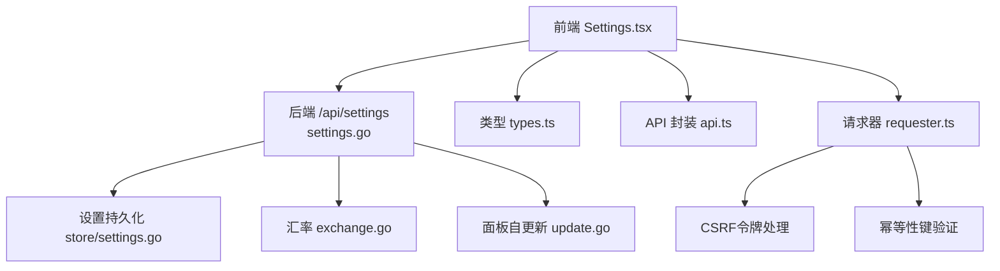
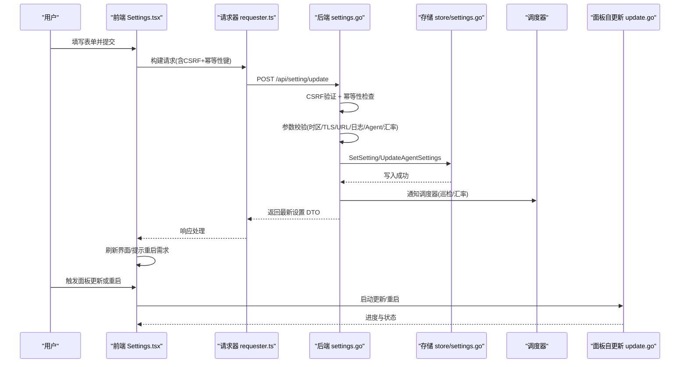
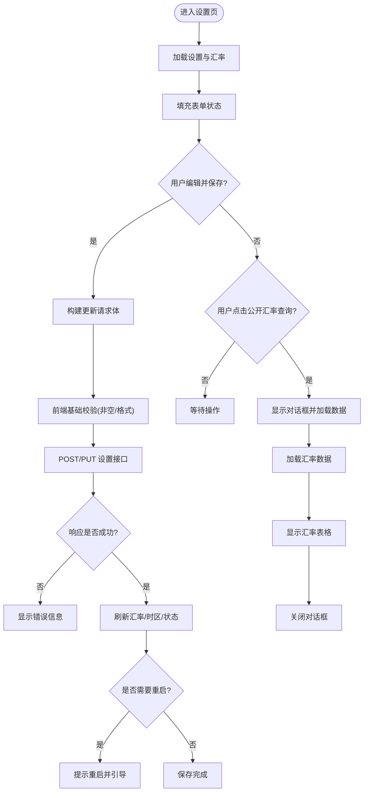
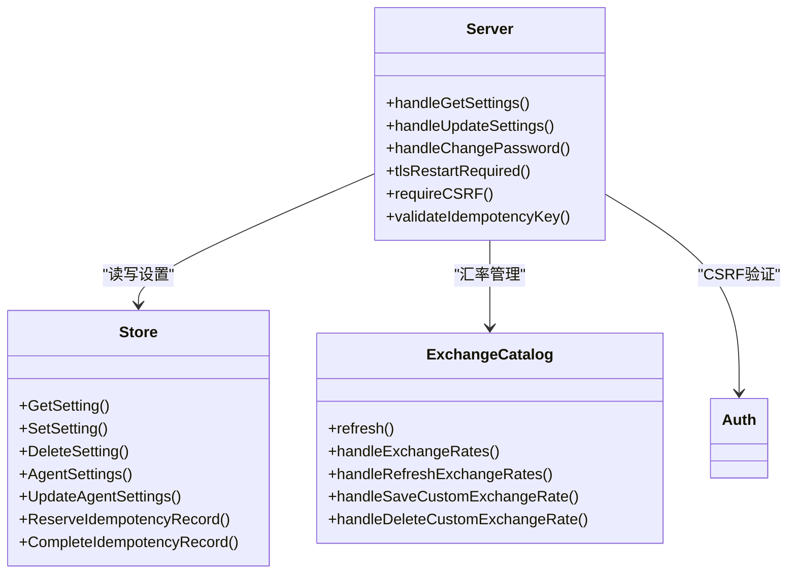
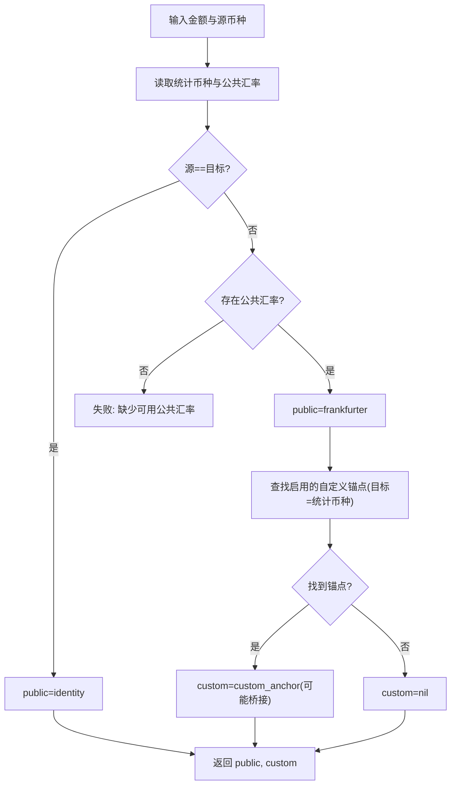
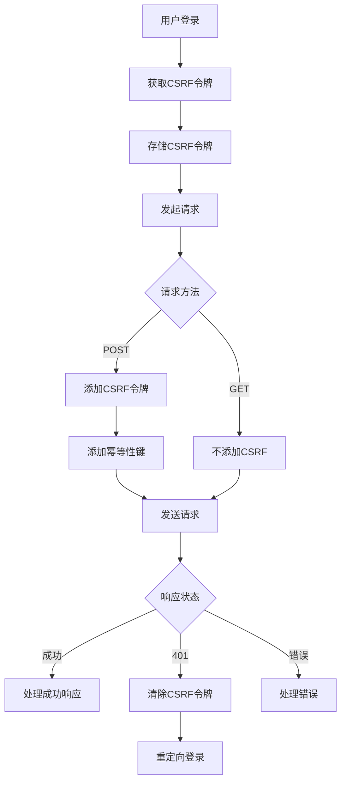
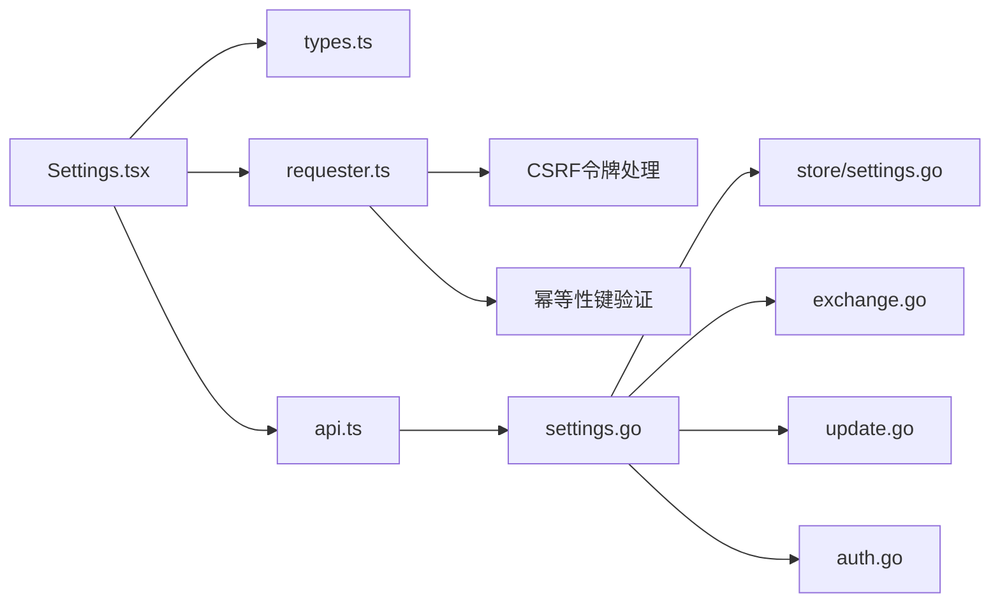

# 设置页面

<cite>
**本文引用的文件**   
- [Settings.tsx](file://src/frontend/src/pages/Settings.tsx)
- [settings.go](file://src/backend/internal/panel/settings.go)
- [store_settings.go](file://src/backend/internal/store/settings.go)
- [agent_settings.go](file://src/shared/agent_settings.go)
- [exchange.go](file://src/backend/internal/panel/exchange.go)
- [types.ts](file://src/frontend/src/lib/types.ts)
- [api.ts](file://src/frontend/src/lib/api.ts)
- [update.go](file://src/backend/internal/panel/update.go)
- [requester.ts](file://src/frontend/src/lib/requester.ts)
- [idempotency.go](file://src/backend/internal/store/idempotency.go)
- [auth.go](file://src/backend/internal/panel/auth.go)
</cite>

## 更新摘要
**变更内容**   
- 新增公开汇率查询功能，包含完整的对话框界面和表格展示
- 增强面板更新测试功能，改进版本检查和更新流程
- 实现CSRF令牌自动处理，所有POST请求自动添加X-CSRF-Token头
- 支持幂等性键验证，防止重复操作和数据冲突
- 优化汇率数据获取和缓存机制

## 目录
1. [简介](#简介)
2. [项目结构](#项目结构)
3. [核心组件](#核心组件)
4. [架构总览](#架构总览)
5. [详细组件分析](#详细组件分析)
6. [依赖关系分析](#依赖关系分析)
7. [性能考虑](#性能考虑)
8. [故障排查指南](#故障排查指南)
9. [结论](#结论)
10. [附录](#附录)

## 简介
本技术文档聚焦 Lattix-codex 的"设置页面"（Settings），系统性解析前端 Settings 组件与后端设置 API 的实现，覆盖系统配置管理、TLS 证书设置、通知配置、配置分组与校验规则、默认值管理、配置文件导入导出（备份）、版本兼容性与回滚机制、安全设置、备份恢复与系统维护等。文档同时提供关键流程的时序图与流程图，帮助读者快速理解配置验证、实时更新与持久化存储的实现细节。

**更新** 新增了公开汇率查询功能，用户现在可以通过专门的对话框查看Frankfurter提供的公共汇率缓存数据，包括报价货币、汇率值、汇率日期、获取时间戳和数据源等详细信息。该功能通过三个状态变量管理对话框显示、加载状态和错误处理，提供了直观的汇率数据浏览体验。同时增强了安全性，实现了CSRF令牌处理和幂等性键验证机制。

## 项目结构
设置功能由前后端协同实现：
- 前端：React 页面组件负责表单展示、用户交互、本地状态管理与 API 调用。
- 后端：HTTP 接口处理设置读取/更新、校验、持久化到数据库、调度任务与审计日志记录。
- 共享类型：Agent 设置结构与校验逻辑在 shared 包中定义，前后端共用。

图表来源
- [Settings.tsx:156-187](file://src/frontend/src/pages/Settings.tsx#L156-L187)
- [settings.go:109-172](file://src/backend/internal/panel/settings.go#L109-L172)
- [store_settings.go:42-73](file://src/backend/internal/store/settings.go#L42-L73)
- [exchange.go:179-203](file://src/backend/internal/panel/exchange.go#L179-L203)
- [update.go:213-216](file://src/backend/internal/panel/update.go#L213-L216)
- [requester.ts:175-183](file://src/frontend/src/lib/requester.ts#L175-L183)

章节来源
- [Settings.tsx:1-1217](file://src/frontend/src/pages/Settings.tsx#L1-L1217)
- [settings.go:1-667](file://src/backend/internal/panel/settings.go#L1-L667)
- [store_settings.go:1-167](file://src/backend/internal/store/settings.go#L1-L167)
- [agent_settings.go:1-111](file://src/shared/agent_settings.go#L1-L111)
- [exchange.go:1-296](file://src/backend/internal/panel/exchange.go#L1-L296)
- [types.ts:408-460](file://src/frontend/src/lib/types.ts#L408-L460)
- [api.ts:172-182](file://src/frontend/src/lib/api.ts#L172-L182)
- [update.go:1-671](file://src/backend/internal/panel/update.go#L1-L671)
- [requester.ts:1-340](file://src/frontend/src/lib/requester.ts#L1-L340)
- [idempotency.go:1-105](file://src/backend/internal/store/idempotency.go#L1-L105)
- [auth.go:111-268](file://src/backend/internal/panel/auth.go#L111-L268)

## 核心组件
- 前端 Settings 组件：集中管理所有设置项的 UI 与交互，包括 Agent、巡检任务、费用换算、基本设置、日志缓存、TLS、告警、密码修改、面板更新与维护。
- 后端 settings 处理器：统一接收 GET/PUT 请求，执行严格校验、落库、审计与实时生效策略（如日志限制、Agent 设置 revision）。
- 存储层 settings 模块：键值型设置持久化，支持默认值生成、Agent 设置增量 revision 与事务性更新。
- 汇率模块：从 Frankfurter 拉取公共汇率，支持自定义锚点汇率，按统计币种计算费用。
- 面板自更新：检查 GitHub release、下载校验、原子替换并重启。
- 安全机制：CSRF令牌验证和幂等性键保护。

**更新** 新增了公开汇率查询对话框组件，提供直观的汇率数据浏览功能，包含完整的状态管理和错误处理机制。同时增强了安全性，实现了CSRF令牌自动处理和幂等性键验证。

章节来源
- [Settings.tsx:87-187](file://src/frontend/src/pages/Settings.tsx#L87-L187)
- [settings.go:196-566](file://src/backend/internal/panel/settings.go#L196-L566)
- [store_settings.go:101-167](file://src/backend/internal/store/settings.go#L101-L167)
- [exchange.go:179-257](file://src/backend/internal/panel/exchange.go#L179-L257)
- [update.go:89-216](file://src/backend/internal/panel/update.go#L89-L216)
- [requester.ts:76-78](file://src/frontend/src/lib/requester.ts#L76-L78)

## 架构总览
设置页面的数据流遵循"前端表单 -> 后端校验 -> 持久化 -> 实时应用/重启生效"的模式。TLS 相关变更需要重启进程；Agent 设置通过 revision 增量推送；日志限制与汇率刷新可即时生效。

图表来源
- [Settings.tsx:200-267](file://src/frontend/src/pages/Settings.tsx#L200-L267)
- [settings.go:221-566](file://src/backend/internal/panel/settings.go#L221-L566)
- [store_settings.go:55-73](file://src/backend/internal/store/settings.go#L55-73)
- [update.go:213-216](file://src/backend/internal/panel/update.go#L213-L216)
- [requester.ts:175-183](file://src/frontend/src/lib/requester.ts#L175-L183)

## 详细组件分析

### 前端 Settings 组件
- 数据加载：初始化时调用获取设置与汇率接口，填充表单状态。
- 保存逻辑：构建更新请求体，空字段表示保持原值（如 TLS key、Bot token）；成功后刷新汇率与时区。
- 交互特性：
  - TLS 模式切换显示不同输入项（off/cert/acme/path）。
  - 告警测试按钮调用后端测试接口，展示各通道结果。
  - 面板更新检查与启动更新，错误信息展示。
  - 维护操作：重启面板、下载备份。

**更新** 新增公开汇率查询功能：
- 三个状态变量管理对话框状态：`publicRatesOpen`（控制对话框显示）、`loadingPublicRates`（加载状态）、`publicRatesError`（错误信息）
- `showPublicRates()`异步函数：打开对话框并获取汇率数据，处理加载状态和错误情况
- "公开汇率查询"按钮：位于费用换算区域，点击后打开对话框
- 完整对话框界面：使用Dialog组件展示汇率数据表格，包含报价货币、汇率值、汇率日期、抓取时间和数据来源等信息

图表来源
- [Settings.tsx:156-187](file://src/frontend/src/pages/Settings.tsx#L156-L187)
- [Settings.tsx:200-267](file://src/frontend/src/pages/Settings.tsx#L200-L267)
- [Settings.tsx:294-305](file://src/frontend/src/pages/Settings.tsx#L294-L305)
- [Settings.tsx:724-763](file://src/frontend/src/pages/Settings.tsx#L724-L763)
- [Settings.tsx:1098-1112](file://src/frontend/src/pages/Settings.tsx#L1098-L1112)

章节来源
- [Settings.tsx:87-187](file://src/frontend/src/pages/Settings.tsx#L87-L187)
- [Settings.tsx:200-267](file://src/frontend/src/pages/Settings.tsx#L200-L267)
- [Settings.tsx:294-305](file://src/frontend/src/pages/Settings.tsx#L294-L305)
- [Settings.tsx:724-763](file://src/frontend/src/pages/Settings.tsx#L724-L763)
- [Settings.tsx:1098-1112](file://src/frontend/src/pages/Settings.tsx#L1098-L1112)

### 后端设置处理器（settings.go）
- GET /api/settings：聚合 DB 设置、运行态 TLS、日志状态、Agent 设置、巡检计划、汇率与统计币种，计算 restart_required。
- PUT /api/settings：
  - 校验范围与时区合法性、URL 格式、TLS 模式完整性（cert/acme/path）。
  - 合并已保存值后校验目标模式完整性（如 path 模式需证书存在且配对有效）。
  - 落库并应用实时生效项（日志限制、Agent 设置 revision、调度器通知）。
  - 审计变更记录（敏感字段仅标记"已变更"）。
- 密码修改：校验当前密码，bcrypt 哈希存储，改密即会话失效。

**更新** 新增CSRF令牌验证和幂等性键支持：
- CSRF令牌验证：所有POST请求必须携带有效的X-CSRF-Token头
- 幂等性键验证：通过Idempotency-Key头部防止重复操作
- 增强的错误处理：区分认证失败和业务错误

图表来源
- [settings.go:109-172](file://src/backend/internal/panel/settings.go#L109-L172)
- [settings.go:196-566](file://src/backend/internal/panel/settings.go#L196-L566)
- [store_settings.go:42-73](file://src/backend/internal/store/settings.go#L42-L73)
- [exchange.go:179-257](file://src/backend/internal/panel/exchange.go#L179-L257)
- [auth.go:229-249](file://src/backend/internal/panel/auth.go#L229-L249)

章节来源
- [settings.go:109-172](file://src/backend/internal/panel/settings.go#L109-L172)
- [settings.go:196-566](file://src/backend/internal/panel/settings.go#L196-L566)
- [settings.go:568-614](file://src/backend/internal/panel/settings.go#L568-L614)
- [auth.go:229-249](file://src/backend/internal/panel/auth.go#L229-L249)

### 存储层设置（store/settings.go）
- 键值存储：key-value 表，支持 upsert 与删除（恢复跟随启动参数）。
- Agent 设置：首次使用生成默认值，更新时事务内递增 revision，确保一致性。
- 实例 ID：稳定标识用于备份/恢复场景。
- 幂等性记录：支持请求去重和重复操作防护。

**更新** 新增幂等性记录管理：
- IdempotencyRecord结构：包含RequestHash和ResponseJSON字段
- ReserveIdempotencyRecord：预留幂等性记录，防止重复操作
- CompleteIdempotencyRecord：完成幂等性记录，存储响应结果
- DeleteExpiredIdempotencyRecords：定期清理过期记录（24小时）

章节来源
- [store_settings.go:13-40](file://src/backend/internal/store/settings.go#L13-L40)
- [store_settings.go:42-73](file://src/backend/internal/store/settings.go#L42-L73)
- [store_settings.go:101-167](file://src/backend/internal/store/settings.go#L101-L167)
- [idempotency.go:17-35](file://src/backend/internal/store/idempotency.go#L17-L35)
- [idempotency.go:37-59](file://src/backend/internal/store/idempotency.go#L37-L59)
- [idempotency.go:61-81](file://src/backend/internal/store/idempotency.go#L61-L81)
- [idempotency.go:96-104](file://src/backend/internal/store/idempotency.go#L96-L104)

### 共享 Agent 设置（shared/agent_settings.go）
- 结构定义：包含 reconnect、telemetry、drift_detection 等子配置。
- 默认值：提供默认 AgentSettings。
- 校验规则：revision>=1、reconnect.mode 合法、max_retries 范围、interval_seconds 范围。

章节来源
- [agent_settings.go:8-17](file://src/shared/agent_settings.go#L8-L17)
- [agent_settings.go:37-64](file://src/shared/agent_settings.go#L37-L64)
- [agent_settings.go:66-83](file://src/shared/agent_settings.go#L66-L83)

### 汇率与费用换算（exchange.go）
- 公共汇率：从 Frankfurter 拉取 EUR 基准汇率，过滤支持的币种。
- 自定义汇率：支持源币种锚点，目标币种必须匹配统计币种，一侧金额须为 1。
- 转换逻辑：优先公共汇率，若无则尝试自定义锚点桥接；输出 public/custom 两种结果。

**更新** 公开汇率查询功能通过 `/api/exchange-rate/list` 端点获取缓存的汇率数据，包括：
- base_currency：基准货币（固定为EUR）
- quote_currency：报价货币
- rate：汇率值
- rate_date：汇率日期
- source：数据来源（frankfurter）
- fetched_at：抓取时间戳

图表来源
- [exchange.go:124-177](file://src/backend/internal/panel/exchange.go#L124-L177)
- [exchange.go:205-241](file://src/backend/internal/panel/exchange.go#L205-L241)

章节来源
- [exchange.go:31-66](file://src/backend/internal/panel/exchange.go#L31-L66)
- [exchange.go:179-203](file://src/backend/internal/panel/exchange.go#L179-L203)
- [exchange.go:205-241](file://src/backend/internal/panel/exchange.go#L205-L241)

### 面板自更新（update.go）
- 版本检测：对比当前版本与 GitHub release 最新版本。
- 更新流程：下载 checksums.txt -> 下载资产 -> 校验 -> 解压 -> 原子替换 -> 重启。
- 进度查询：轮询更新状态，进行中拒绝其他写操作（423）。

**更新** 面板更新测试功能增强：
- 改进的版本检查流程，支持镜像基址配置
- 增强的错误处理和状态管理
- 更好的用户体验反馈

章节来源
- [update.go:89-216](file://src/backend/internal/panel/update.go#L89-L216)
- [update.go:312-350](file://src/backend/internal/panel/update.go#L312-L350)

### 请求器与安全机制（requester.ts）
- CSRF令牌处理：自动为所有POST请求添加X-CSRF-Token头
- 幂等性键生成：为每个POST请求生成唯一的Idempotency-Key
- 错误处理：统一的错误分类和处理机制
- 生命周期管理：请求开始、结束事件监听

**更新** 新增安全机制：
- CSRF令牌自动管理：登录时获取token，登出时清除
- 幂等性键自动生成：POST请求自动添加唯一键
- 未授权处理：自动清除CSRF令牌并重定向登录

图表来源
- [requester.ts:76-78](file://src/frontend/src/lib/requester.ts#L76-L78)
- [requester.ts:175-183](file://src/frontend/src/lib/requester.ts#L175-L183)
- [requester.ts:202-206](file://src/frontend/src/lib/requester.ts#L202-L206)

章节来源
- [requester.ts:76-78](file://src/frontend/src/lib/requester.ts#L76-L78)
- [requester.ts:175-183](file://src/frontend/src/lib/requester.ts#L175-L183)
- [requester.ts:202-206](file://src/frontend/src/lib/requester.ts#L202-L206)
- [auth.go:229-249](file://src/backend/internal/panel/auth.go#L229-L249)

## 依赖关系分析
- 前端依赖：
  - types.ts：定义 PanelSettings、UpdateSettingsRequest、AlertTestResult、PanelVersionInfo、ExchangeRateSettings 等类型。
  - api.ts：封装 /api/exchange-rate/*、/api/setting/test-alerts、/api/panel/restart、/api/backup/download 等接口。
  - requester.ts：提供CSRF令牌处理和幂等性键验证。
- 后端依赖：
  - store/settings.go：设置持久化与 Agent 设置管理。
  - panel/exchange.go：汇率拉取与自定义汇率管理。
  - panel/update.go：面板自更新状态机与进度。
  - panel/auth.go：CSRF令牌验证和会话管理。

**更新** 新增的安全依赖：
- CSRF令牌验证：所有POST请求必须携带有效的X-CSRF-Token
- 幂等性键验证：防止重复操作和数据冲突
- 会话管理：登录、登出时的令牌生命周期管理

图表来源
- [types.ts:408-460](file://src/frontend/src/lib/types.ts#L408-L460)
- [api.ts:172-182](file://src/frontend/src/lib/api.ts#L172-L182)
- [settings.go:109-172](file://src/backend/internal/panel/settings.go#L109-L172)
- [store_settings.go:42-73](file://src/backend/internal/store/settings.go#L42-L73)
- [exchange.go:179-203](file://src/backend/internal/panel/exchange.go#L179-L203)
- [update.go:213-216](file://src/backend/internal/panel/update.go#L213-L216)
- [requester.ts:175-183](file://src/frontend/src/lib/requester.ts#L175-L183)
- [auth.go:229-249](file://src/backend/internal/panel/auth.go#L229-L249)

章节来源
- [types.ts:408-460](file://src/frontend/src/lib/types.ts#L408-L460)
- [api.ts:172-182](file://src/frontend/src/lib/api.ts#L172-L182)
- [settings.go:109-172](file://src/backend/internal/panel/settings.go#L109-L172)
- [store_settings.go:42-73](file://src/backend/internal/store/settings.go#L42-L73)
- [exchange.go:179-203](file://src/backend/internal/panel/exchange.go#L179-L203)
- [update.go:213-216](file://src/backend/internal/panel/update.go#L213-L216)
- [requester.ts:175-183](file://src/frontend/src/lib/requester.ts#L175-L183)
- [auth.go:229-249](file://src/backend/internal/panel/auth.go#L229-L249)

## 性能考虑
- 设置读取与更新：DB 键值存取 O(1)，Agent 设置更新使用事务保证一致性。
- 汇率刷新：外部 HTTP 请求超时 30 秒，失败不阻塞主流程。
- 日志限制：内存与文件分段存储，调整上限时立即清理最旧记录。
- 面板更新：分阶段下载与校验，避免长时间占用锁，支持进度轮询。
- 幂等性记录：定期清理24小时前的过期记录，避免数据库膨胀。

**更新** 新增的性能考虑：
- CSRF令牌缓存：前端缓存CSRF令牌，避免重复获取
- 幂等性键生成：使用crypto.getRandomValues生成唯一键
- 请求重试机制：网络错误自动重试，最多2次
- 超时控制：默认15秒超时，下载请求30秒超时
- 内存管理：及时清理临时数据和对象URL

[本节为通用指导，无需引用具体文件]

## 故障排查指南
- 设置保存失败：
  - 检查时区是否为 IANA 名称、URL 是否合法、TLS 模式完整性（cert 需证书+私钥、acme 需域名、path 需证书存在且配对）。
  - 查看后端返回的错误消息（如"无效的时区"、"证书/私钥校验失败"）。
  - 检查CSRF令牌是否有效，重新登录后再试。
- 告警测试失败：
  - 确认 Webhook URL 可达、Telegram Bot Token 与 Chat ID 正确。
  - 查看测试结果中的 error 字段定位问题。
- 面板更新失败：
  - 检查网络连通性与镜像基址环境变量（LATX_RELEASE_BASE）。
  - 查看更新状态中的 stage 与 message 字段。
- **更新** 公开汇率查询失败：
  - 检查网络连接是否正常，Frankfurter API 是否可达。
  - 查看对话框中的错误提示信息。
  - 确认汇率数据是否已刷新，如无数据需先点击"立即刷新汇率"。
  - 检查浏览器控制台是否有网络错误或 CORS 问题。
- **更新** CSRF令牌错误：
  - 检查是否已登录，重新登录获取新的CSRF令牌。
  - 确认浏览器Cookie是否启用。
  - 检查跨域请求是否正确配置。
- **更新** 幂等性键冲突：
  - 检查是否存在重复提交的操作。
  - 查看后端日志中的幂等性记录冲突信息。
  - 等待24小时后自动清理过期记录。

章节来源
- [settings.go:250-388](file://src/backend/internal/panel/settings.go#L250-L388)
- [exchange.go:205-241](file://src/backend/internal/panel/exchange.go#L205-L241)
- [update.go:240-250](file://src/backend/internal/panel/update.go#L240-L250)
- [auth.go:229-249](file://src/backend/internal/panel/auth.go#L229-L249)
- [idempotency.go:37-59](file://src/backend/internal/store/idempotency.go#L37-L59)

## 结论
设置页面实现了完整的系统配置管理能力，涵盖 TLS、通知、日志、Agent、汇率与面板维护等关键领域。通过严格的校验规则、默认值管理、实时生效与重启生效策略，以及备份恢复与自更新机制，确保了系统的稳定性与可维护性。**更新** 新增的公开汇率查询功能为用户提供了更直观的数据浏览体验，便于监控汇率数据的准确性和时效性。同时增强了安全性，实现了CSRF令牌处理和幂等性键验证机制，有效防止了跨站请求伪造和重复操作攻击。建议在生产环境中合理配置日志保留与汇率刷新频率，并定期备份数据库以保障数据安全。

[本节为总结性内容，无需引用具体文件]

## 附录
- 配置分组说明：
  - Agent：重连策略、遥测间隔、漂移检测。
  - 巡检任务：Agent/xray 版本巡检、计费巡检、汇率刷新。
  - 费用换算：统计币种、公共汇率、自定义汇率、**公开汇率查询**。
  - 基本设置：对外地址、显示时区、流量统计时区。
  - 日志缓存：操作日志条数、请求日志容量。
  - 面板证书（TLS）：模式选择、证书上传、ACME、域名路径。
  - 告警：Webhook、Telegram。
  - 修改密码：当前密码与新密码。
  - 面板更新：检查更新、启动更新。
  - 面板维护：重启面板、下载备份。

**更新** 公开汇率查询对话框功能说明：
- 触发方式：点击费用换算区域的"公开汇率查询"按钮
- 数据展示：表格形式显示所有可用的汇率对
- 列信息：基准币种、报价币种、公开汇率、汇率日期、抓取时间、数据来源
- 状态管理：支持加载状态、错误处理和空数据提示
- 用户体验：最大高度限制、滚动支持、响应式设计
- 数据源：Frankfurter API 提供的公共汇率缓存，支持 EUR / USD / CNY / JPY / CAD 五种基准货币

**更新** 安全机制说明：
- CSRF令牌：登录时获取，自动添加到所有POST请求头
- 幂等性键：为每个POST请求生成唯一键，防止重复操作
- 会话管理：登出时自动清除CSRF令牌
- 错误处理：认证失败时自动重定向登录页面

章节来源
- [Settings.tsx:422-1217](file://src/frontend/src/pages/Settings.tsx#L422-L1217)
- [settings.go:75-107](file://src/backend/internal/panel/settings.go#L75-L107)
- [store_settings.go:13-40](file://src/backend/internal/store/settings.go#L13-L40)
- [requester.ts:76-78](file://src/frontend/src/lib/requester.ts#L76-L78)
- [requester.ts:175-183](file://src/frontend/src/lib/requester.ts#L175-L183)
- [auth.go:229-249](file://src/backend/internal/panel/auth.go#L229-L249)