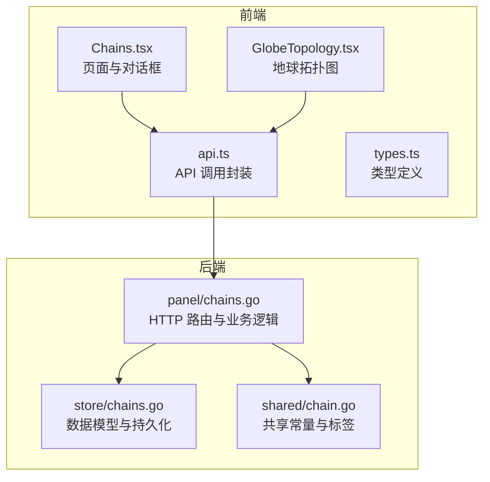
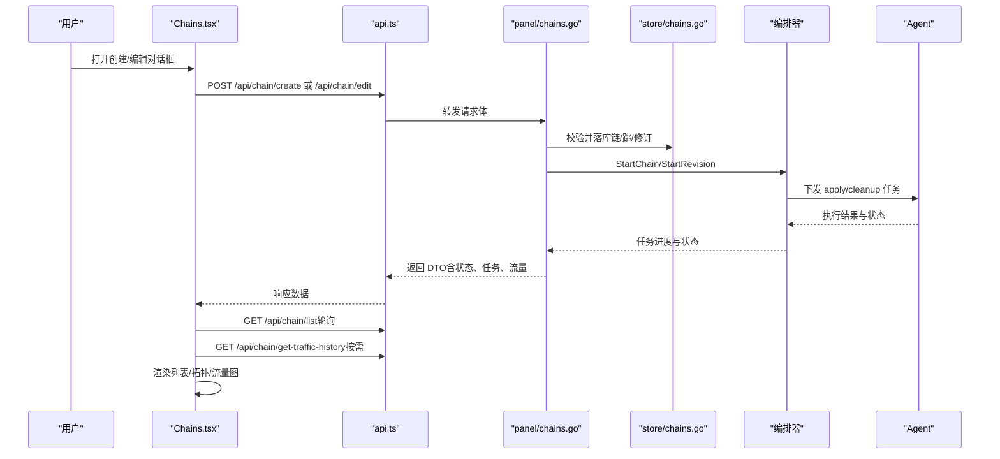
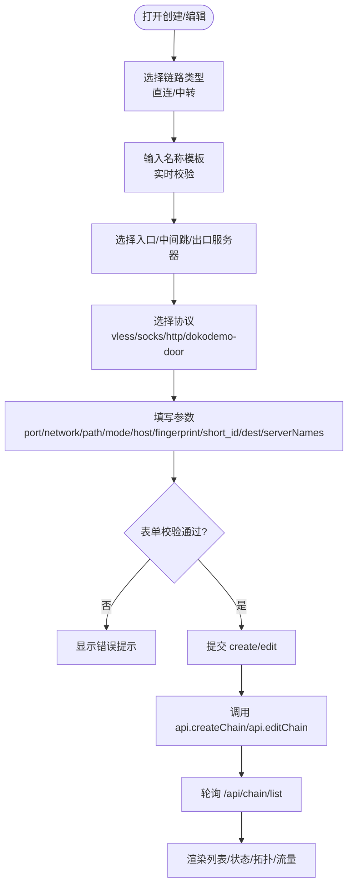
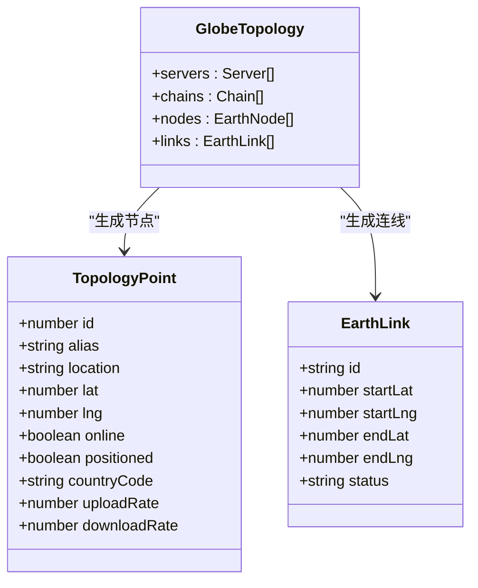
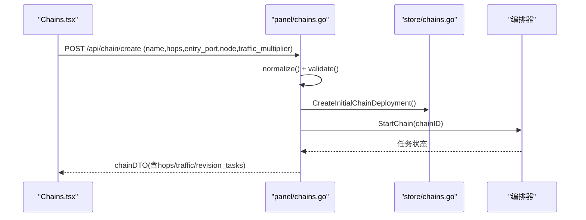
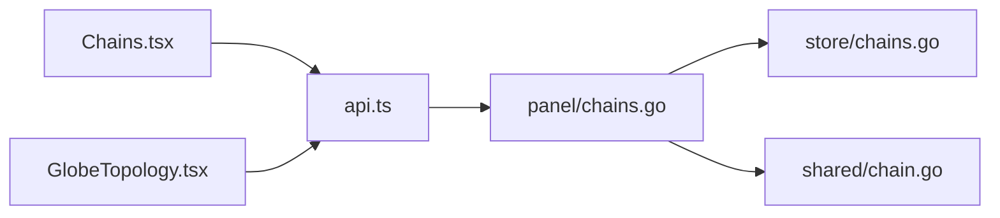

# 链路管理页面

<cite>
**本文引用的文件**   
- [Chains.tsx](file://src/frontend/src/pages/Chains.tsx)
- [GlobeTopology.tsx](file://src/frontend/src/components/GlobeTopology.tsx)
- [api.ts](file://src/frontend/src/lib/api.ts)
- [types.ts](file://src/frontend/src/lib/types.ts)
- [chains.go](file://src/backend/internal/panel/chains.go)
- [chains_store.go](file://src/backend/internal/store/chains.go)
- [chain_shared.go](file://src/shared/chain.go)
</cite>

## 目录
1. [简介](#简介)
2. [项目结构](#项目结构)
3. [核心组件](#核心组件)
4. [架构总览](#架构总览)
5. [详细组件分析](#详细组件分析)
6. [依赖关系分析](#依赖关系分析)
7. [性能考量](#性能考量)
8. [故障排查指南](#故障排查指南)
9. [结论](#结论)
10. [附录](#附录)

## 简介
本技术文档围绕 Lattix-codex 的“链路管理”页面展开，重点解析 Chains 组件的实现与交互流程，涵盖：
- 代理链路的可视化编排（直连/中转）、节点选择与拓扑图展示
- 链路创建向导、协议选择与参数配置界面
- 链路状态监控、流量统计与健康检查
- 链路测试、性能分析与故障诊断工具的使用说明
- 复杂表单验证、实时预览与配置校验机制的代码级实现路径

## 项目结构
前端以 React + TypeScript 构建，后端为 Go 服务。链路管理相关的关键文件分布如下：
- 前端页面与组件：src/frontend/src/pages/Chains.tsx、src/frontend/src/components/GlobeTopology.tsx
- 前端 API 封装与类型定义：src/frontend/src/lib/api.ts、src/frontend/src/lib/types.ts
- 后端面板控制器与存储层：src/backend/internal/panel/chains.go、src/backend/internal/store/chains.go
- 共享常量与标签生成：src/shared/chain.go

**图表来源** 
- [Chains.tsx:1-120](file://src/frontend/src/pages/Chains.tsx#L1-L120)
- [GlobeTopology.tsx:1-60](file://src/frontend/src/components/GlobeTopology.tsx#L1-L60)
- [api.ts:180-200](file://src/frontend/src/lib/api.ts#L180-L200)
- [chains.go:150-220](file://src/backend/internal/panel/chains.go#L150-L220)
- [chains_store.go:12-40](file://src/backend/internal/store/chains.go#L12-L40)
- [chain_shared.go:1-24](file://src/shared/chain.go#L1-L24)

**章节来源**
- [Chains.tsx:1-120](file://src/frontend/src/pages/Chains.tsx#L1-L120)
- [api.ts:180-200](file://src/frontend/src/lib/api.ts#L180-L200)

## 核心组件
- Chains.tsx：链路列表、创建/编辑对话框、流量历史弹窗、状态与重试操作、名称模板与表单校验、拓扑服务器选择等。
- GlobeTopology.tsx：基于服务器地理位置与链路跳序列绘制地球拓扑连线，展示在线/离线与链路状态。
- api.ts：提供 /api/chain/* 系列接口封装，包括创建、编辑、强制发布、重置流量、查询历史、重试与删除。
- types.ts：Chain、XrayNode、Server、ChainTrafficBucket 等类型定义，支撑前后端数据结构一致性。
- panel/chains.go：处理链路 CRUD、编排任务下发、端口段校验、流量倍率、修订计划与任务队列。
- store/chains.go：链与跳的状态机、持久化模型与查询方法。
- shared/chain.go：链内反向隧道域名与 tag 生成规则。

**章节来源**
- [Chains.tsx:330-420](file://src/frontend/src/pages/Chains.tsx#L330-L420)
- [GlobeTopology.tsx:90-120](file://src/frontend/src/components/GlobeTopology.tsx#L90-L120)
- [api.ts:182-198](file://src/frontend/src/lib/api.ts#L182-L198)
- [chains.go:199-383](file://src/backend/internal/panel/chains.go#L199-L383)
- [chains_store.go:12-41](file://src/backend/internal/store/chains.go#L12-L41)
- [chain_shared.go:12-24](file://src/shared/chain.go#L12-L24)

## 架构总览
链路管理的端到端流程如下：
- 前端用户通过 Chains.tsx 完成链路创建/编辑，提交到后端 /api/chain/create 或 /api/chain/edit。
- 后端进行参数校验（端口段、入站能力、协议约束），生成初始部署或修订快照，写入存储并触发编排器。
- 编排器按“出口→入口”的顺序逐跳下发任务；Agent 执行后上报状态，面板轮询更新 UI。
- 流量统计由后端聚合，前端通过 /api/chain/get-traffic-history 拉取并按日/月聚合展示。
- 拓扑图根据服务器位置与链路跳序列渲染，直观展示跨地域链路走向。

**图表来源** 
- [Chains.tsx:395-433](file://src/frontend/src/pages/Chains.tsx#L395-L433)
- [api.ts:182-198](file://src/frontend/src/lib/api.ts#L182-L198)
- [chains.go:199-383](file://src/backend/internal/panel/chains.go#L199-L383)
- [chains_store.go:167-193](file://src/backend/internal/store/chains.go#L167-L193)

## 详细组件分析

### Chains.tsx：链路管理与向导
- 列表与状态：
  - 支持直连与中转两类条目，显示状态徽章、错误信息、重试按钮、删除与编辑操作。
  - 对 Agent 离线情况给出降级提示，支持“强制发布未确认配置”。
- 创建/编辑对话框：
  - 链路类型：直连（单服务器）或中转（入口→中间跳 0-2 →出口）。
  - 名称模板：支持变量替换与实时校验，留空自动生成 Chain #xxxx。
  - 协议与参数：
    - 直连协议：vless、socks、http、dokodemo-door；中转协议：vless、socks、http。
    - Reality 参数：network（tcp/xhttp）、path/mode/host、uTLS 指纹、short_id、dest/serverNames。
    - VLESS 可选 encryption 与 flow（tcp 时可用 vision，xhttp 时 flow 必须 none）。
    - dokodemo-door 需目标地址与端口。
  - 入口/出口端口：支持自动分配或在 NAT 可用段内指定。
  - 流量倍率：0.001-1000.000，影响统计显示。
- 表单验证与提交：
  - 前端严格校验：链长上限 4 跳、同链不重复、入站能力限制、端口范围、必填项。
  - 提交时组装 CreateNodeRequest/EditChainRequest，调用 api.createChain/api.editChain。
- 流量历史：
  - 支持按日/月切换，选择链路（出口权威）或各跳查看，使用 SVG 折线图展示上传/下载趋势。
- 重试与删除：
  - 失败链路可重试（仅重放失败 piece），删除链路将反向拆链并清理出口节点。

**图表来源** 
- [Chains.tsx:1010-1378](file://src/frontend/src/pages/Chains.tsx#L1010-L1378)
- [Chains.tsx:541-654](file://src/frontend/src/pages/Chains.tsx#L541-L654)

**章节来源**
- [Chains.tsx:330-420](file://src/frontend/src/pages/Chains.tsx#L330-L420)
- [Chains.tsx:1010-1378](file://src/frontend/src/pages/Chains.tsx#L1010-L1378)
- [Chains.tsx:541-654](file://src/frontend/src/pages/Chains.tsx#L541-L654)

### GlobeTopology.tsx：地球拓扑图
- 服务器定位：
  - 根据 country_code 与 location 匹配城市坐标，缓存避免重复计算。
  - 无法定位时使用回退算法分散分布。
- 链路连线：
  - 按链的 hop 序列（seq 升序）连接相邻服务器，状态映射至 active/applying/failed 等。
- 在线状态：
  - 结合 isServerOnline 判断节点在线/离线，并在图例中展示。

**图表来源** 
- [GlobeTopology.tsx:8-24](file://src/frontend/src/components/GlobeTopology.tsx#L8-L24)
- [GlobeTopology.tsx:91-120](file://src/frontend/src/components/GlobeTopology.tsx#L91-L120)

**章节来源**
- [GlobeTopology.tsx:38-89](file://src/frontend/src/components/GlobeTopology.tsx#L38-L89)
- [GlobeTopology.tsx:91-120](file://src/frontend/src/components/GlobeTopology.tsx#L91-L120)

### 后端链路控制器（panel/chains.go）
- 创建链路（handleCreateChain）：
  - 校验链长度（1-4）、协议约束（dokodemo 不能作为中转出口）、端口段与入站能力。
  - 生成虚拟配置与服务配置，构造 InitialChainDeployment，写入存储并启动编排。
- 编辑链路（handleEditChain）：
  - 生成期望拓扑与差异计划（apply/cleanup），创建 revision 快照，必要时迁移 service。
  - 若存在离线节点，设置等待 Agent 状态。
- 其他接口：
  - 强制发布、重置流量、查询历史、重试、删除（反向拆链与清理）。
- 端口与传输策略：
  - inboundCapable 判定直连/NAT 受限直连；checkPortInRanges 校验端口在可用段内。
  - transportForServers 决定 direct/encrypted/reverse 传输方式。

**图表来源** 
- [chains.go:199-383](file://src/backend/internal/panel/chains.go#L199-L383)
- [chains_store.go:112-152](file://src/backend/internal/store/chains.go#L112-L152)

**章节来源**
- [chains.go:199-383](file://src/backend/internal/panel/chains.go#L199-L383)
- [chains.go:391-584](file://src/backend/internal/panel/chains.go#L391-L584)
- [chains.go:800-851](file://src/backend/internal/panel/chains.go#L800-L851)

### 存储层与状态机（store/chains.go）
- 状态机：
  - 链状态：pending → applying → active | failed；任一 server 离线推导 degraded。
  - 跳状态：pending → applying → active | failed。
- 数据模型：
  - Chain 与 ChainHop 包含角色、端口、portal/tunnel 字段，用于反向链与路由标记。
- 常用方法：
  - InsertChain/InsertChainHop、ListChains、ChainHops、ChainByID 等。

**章节来源**
- [chains_store.go:12-41](file://src/backend/internal/store/chains.go#L12-L41)
- [chains_store.go:167-193](file://src/backend/internal/store/chains.go#L167-L193)

### 共享常量与标签（shared/chain.go）
- HopKind：portal/bridge/forward 三种 piece 类型。
- TunnelDomain：c<chainID>h<hopID>.lx 反向链路由键。
- ChainForwardTag/ChainPortalTag/ChainBridgeTag：各跳 inbound/outbound/routing 的 tag 命名规范。

**章节来源**
- [chain_shared.go:1-24](file://src/shared/chain.go#L1-24)

## 依赖关系分析
- 前端依赖：
  - Chains.tsx 依赖 api.ts 的链式接口与 types.ts 的类型定义。
  - GlobeTopology.tsx 依赖地理坐标加载与 isServerOnline 状态判断。
- 后端依赖：
  - panel/chains.go 依赖 store/chains.go 的数据访问与 shared/chain.go 的常量。
  - 编排器（外部）负责任务分发与 Agent 通信。

**图表来源** 
- [Chains.tsx:1-60](file://src/frontend/src/pages/Chains.tsx#L1-L60)
- [api.ts:182-198](file://src/frontend/src/lib/api.ts#L182-L198)
- [chains.go:1-20](file://src/backend/internal/panel/chains.go#L1-L20)
- [chains_store.go:1-10](file://src/backend/internal/store/chains.go#L1-L10)
- [chain_shared.go:1-10](file://src/shared/chain.go#L1-L10)

**章节来源**
- [Chains.tsx:1-60](file://src/frontend/src/pages/Chains.tsx#L1-L60)
- [api.ts:182-198](file://src/frontend/src/lib/api.ts#L182-L198)

## 性能考量
- 前端轮询：
  - 每 5 秒轮询一次 /api/chain/list，使用 AbortController 取消过期请求，避免竞态。
- 图表渲染：
  - TrafficHistoryChart 使用 SVG 原生绘制，按需聚合（日/月）减少数据量。
- 后端聚合：
  - 流量历史按天聚合，支持最大 730 天查询，避免过大响应。
- 拓扑定位：
  - 地理坐标缓存 Map，避免重复解析；无坐标时回退算法快速布局。

[本节为通用指导，无需特定文件引用]

## 故障排查指南
- 常见错误与处理：
  - 端口不在可用段：检查 NAT 机的 allowed_ports 与用户指定端口。
  - 入站能力不足：直连或中间跳需具备入站能力（direct 或 allowed_ports 非空）。
  - 协议限制：dokodemo-door 不可作为中转出口；xhttp 时 flow 必须 none。
  - 链长超限：最多 4 跳（入口+中间跳≤2+出口）。
- 重试与强制发布：
  - 失败链路可重试（仅重放失败 piece）；存在未确认 revision 时可强制发布。
- 流量统计重置：
  - 重置当前累计计数，不影响 Agent 原始计数。

**章节来源**
- [chains.go:221-302](file://src/backend/internal/panel/chains.go#L221-L302)
- [chains.go:446-458](file://src/backend/internal/panel/chains.go#L446-L458)
- [Chains.tsx:656-684](file://src/frontend/src/pages/Chains.tsx#L656-L684)

## 结论
Chains 组件提供了完整的链路管理能力，从创建向导、协议参数配置到状态监控与流量分析，形成闭环。后端通过严格的校验与编排机制确保链路正确部署与稳定运行。前端通过直观的拓扑图与图表提升运维效率。建议在实际使用中关注端口段与入站能力配置，合理选择协议与传输方式，利用重试与强制发布功能提高可用性。

[本节为总结性内容，无需特定文件引用]

## 附录
- 关键 API 路径：
  - 列表：GET /api/chain/list
  - 创建：POST /api/chain/create
  - 编辑：POST /api/chain/edit
  - 强制发布：POST /api/chain/force-publish
  - 重置流量：POST /api/chain/reset-traffic
  - 流量历史：GET /api/chain/get-traffic-history
  - 重试：POST /api/chain/retry
  - 删除：POST /api/chain/delete

**章节来源**
- [api.ts:182-198](file://src/frontend/src/lib/api.ts#L182-L198)