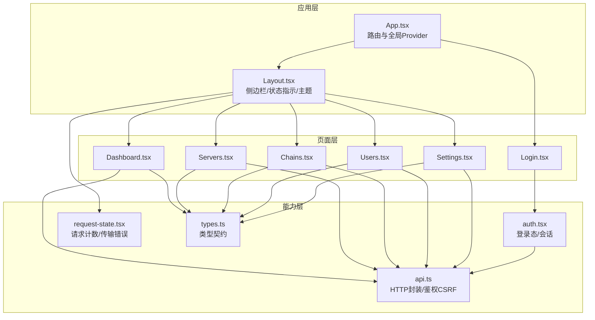
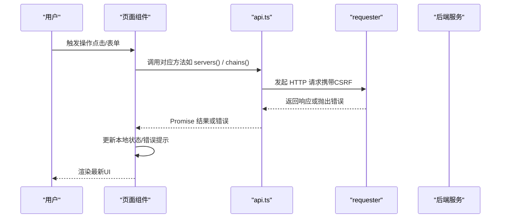
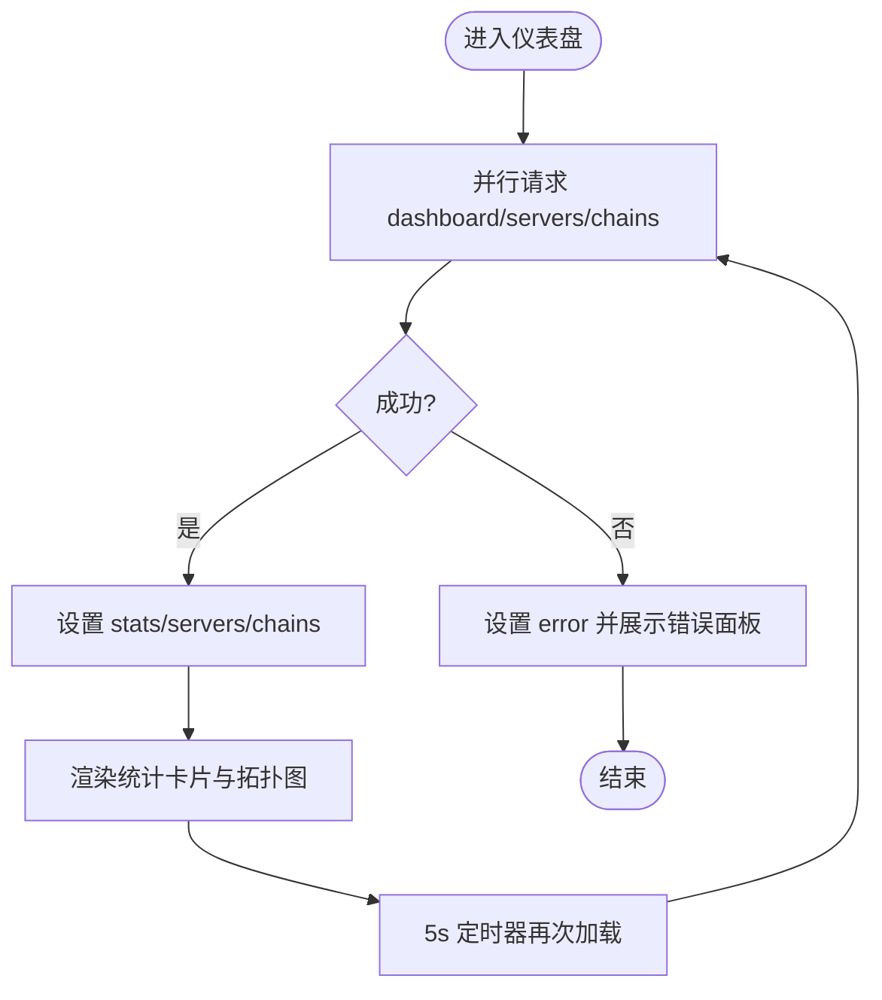
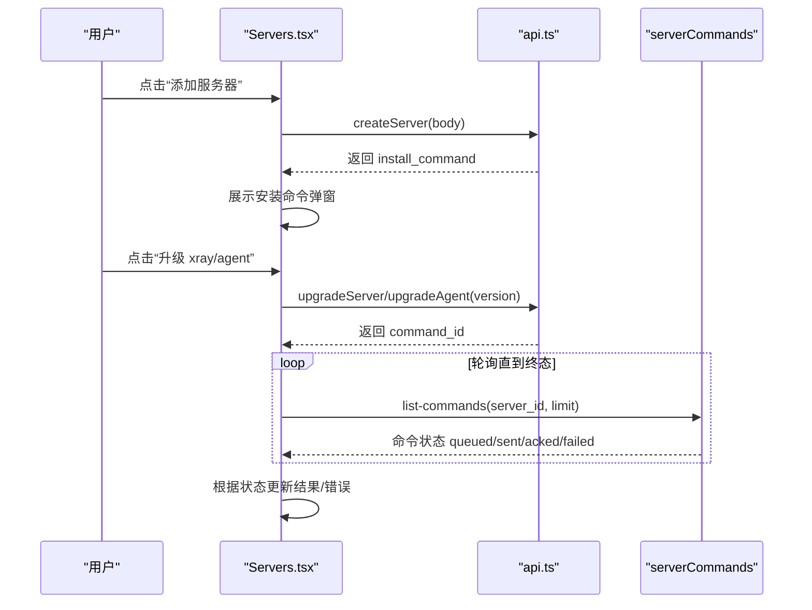
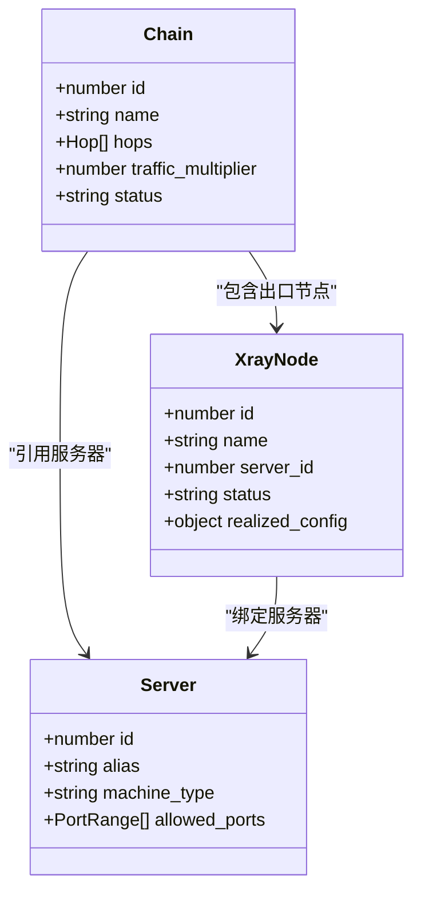
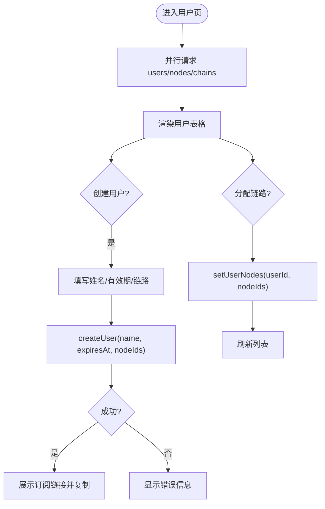
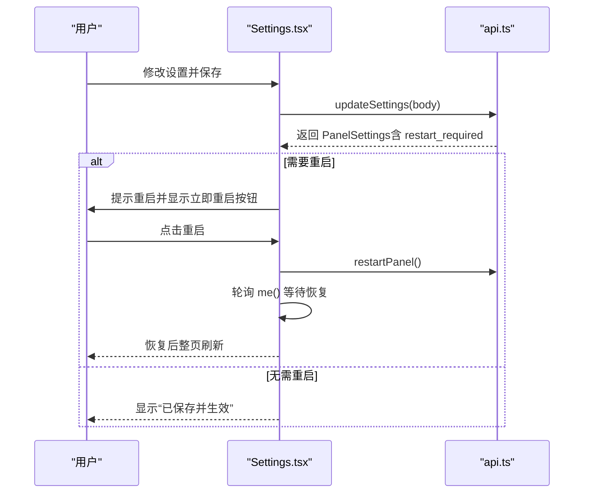
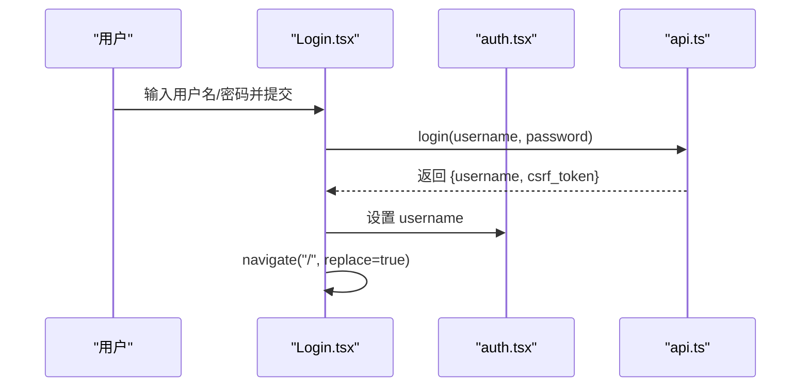
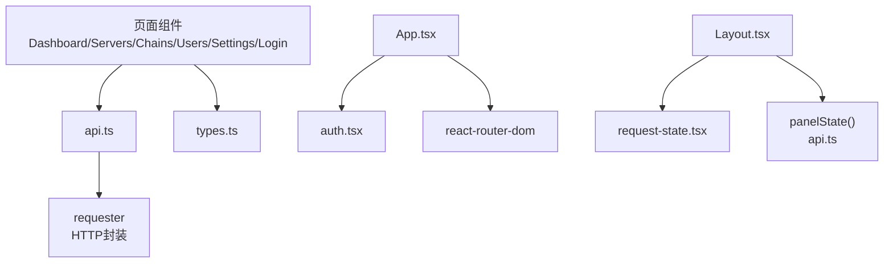

# 页面组件

<cite>
**本文引用的文件**   
- [Dashboard.tsx](file://src/frontend/src/pages/Dashboard.tsx)
- [Servers.tsx](file://src/frontend/src/pages/Servers.tsx)
- [Chains.tsx](file://src/frontend/src/pages/Chains.tsx)
- [Users.tsx](file://src/frontend/src/pages/Users.tsx)
- [Settings.tsx](file://src/frontend/src/pages/Settings.tsx)
- [Login.tsx](file://src/frontend/src/pages/Login.tsx)
- [App.tsx](file://src/frontend/src/App.tsx)
- [Layout.tsx](file://src/frontend/src/components/Layout.tsx)
- [api.ts](file://src/frontend/src/lib/api.ts)
- [auth.tsx](file://src/frontend/src/lib/auth.tsx)
- [request-state.tsx](file://src/frontend/src/lib/request-state.tsx)
- [types.ts](file://src/frontend/src/lib/types.ts)
</cite>

## 目录
1. [简介](#简介)
2. [项目结构](#项目结构)
3. [核心组件](#核心组件)
4. [架构总览](#架构总览)
5. [详细组件分析](#详细组件分析)
6. [依赖关系分析](#依赖关系分析)
7. [性能考量](#性能考量)
8. [故障排查指南](#故障排查指南)
9. [结论](#结论)

## 简介
本文件面向 Lattix-codex 前端页面组件，系统性梳理仪表盘、服务器管理、链路管理、用户管理、设置与登录六大页面的实现细节。内容覆盖数据流处理、用户交互逻辑、状态管理、错误处理、加载状态、页面间数据传递、路由参数处理与表单验证等，并提供可视化图示与最佳实践建议，帮助开发者快速理解与扩展功能。

## 项目结构
前端采用 React + TypeScript + Vite 构建，页面按功能模块划分在 pages 目录，通用 UI 组件位于 components/ui，业务组件位于 components，API 封装与类型定义集中在 lib 目录。应用入口 App.tsx 通过 react-router-dom 进行路由配置，Layout.tsx 提供侧边导航与全局状态展示，认证由 auth.tsx 提供上下文，请求生命周期由 request-state.tsx 统一管理。

图表来源
- [App.tsx:1-73](file://src/frontend/src/App.tsx#L1-L73)
- [Layout.tsx:1-205](file://src/frontend/src/components/Layout.tsx#L1-L205)
- [api.ts:1-292](file://src/frontend/src/lib/api.ts#L1-L292)
- [auth.tsx:1-52](file://src/frontend/src/lib/auth.tsx#L1-L52)
- [request-state.tsx:1-59](file://src/frontend/src/lib/request-state.tsx#L1-L59)
- [types.ts:1-200](file://src/frontend/src/lib/types.ts#L1-L200)

章节来源
- [App.tsx:1-73](file://src/frontend/src/App.tsx#L1-L73)
- [Layout.tsx:1-205](file://src/frontend/src/components/Layout.tsx#L1-L205)

## 核心组件
- 认证与鉴权：auth.tsx 提供登录态与未授权回调；api.ts 统一处理 CSRF Token 注入与未授权清理。
- 请求状态：request-state.tsx 订阅 requester 事件，维护前台请求计数与最近一次传输错误，供 Layout 顶部进度条显示。
- 类型契约：types.ts 定义 DashboardStats、Server、XrayNode、Chain、SubUser、PanelSettings 等关键数据结构，贯穿各页面。
- 路由与布局：App.tsx 定义受保护路由与页面映射；Layout.tsx 提供侧边导航、面板状态指示、主题切换与更新遮罩。

章节来源
- [auth.tsx:1-52](file://src/frontend/src/lib/auth.tsx#L1-L52)
- [api.ts:1-292](file://src/frontend/src/lib/api.ts#L1-L292)
- [request-state.tsx:1-59](file://src/frontend/src/lib/request-state.tsx#L1-L59)
- [types.ts:1-200](file://src/frontend/src/lib/types.ts#L1-L200)
- [App.tsx:1-73](file://src/frontend/src/App.tsx#L1-L73)
- [Layout.tsx:1-205](file://src/frontend/src/components/Layout.tsx#L1-L205)

## 架构总览
整体采用“页面组件 + 能力层”的解耦模式：
- 页面组件负责 UI 与交互，调用 api.ts 暴露的方法获取或提交数据。
- 能力层集中处理鉴权、网络请求、错误提示、类型约束。
- 路由与布局提供统一的导航、认证守卫与全局状态展示。

图表来源
- [api.ts:1-292](file://src/frontend/src/lib/api.ts#L1-L292)
- [request-state.tsx:1-59](file://src/frontend/src/lib/request-state.tsx#L1-L59)

## 详细组件分析

### 仪表盘（Dashboard）
- 功能特性：聚合统计卡片（服务器数、在线节点、链路数、订阅用户）、实时拓扑图（GlobeTopology）、运行概况列表。
- 数据流：使用 useEffect 定时轮询 dashboard/servers/chains 接口，合并为 stats/servers/chains 状态；失败时通过 errorMessage 展示错误。
- 交互逻辑：无复杂表单，主要展示与刷新；每 5 秒自动刷新。
- 状态管理：stats/servers/chains/error 四个状态；加载中以骨架屏占位。
- 复用与错误处理：复用 GlobeTopology 组件；错误统一用 errorMessage 格式化。

图表来源
- [Dashboard.tsx:1-162](file://src/frontend/src/pages/Dashboard.tsx#L1-L162)
- [api.ts:77-79](file://src/frontend/src/lib/api.ts#L77-L79)

章节来源
- [Dashboard.tsx:1-162](file://src/frontend/src/pages/Dashboard.tsx#L1-L162)

### 服务器管理（Servers）
- 功能特性：服务器列表与监控网格、创建/编辑/删除、凭证轮换、配置漂移修复、版本升级（xray/agent）、服务商管理、计费与流量计划配置、端口段编辑与校验。
- 数据流：
  - 列表与指标：定时拉取 servers/serverMetricSamples，5s/60s 分别刷新。
  - 创建/编辑：构造 BillingInput/TrafficPlanInput，NAT 模式下解析端口段文本行并校验。
  - 升级流程：下发升级命令后轮询 serverCommands 跟踪 command_id 终态（acked/failed），超时兜底提示。
- 交互逻辑：
  - 创建弹窗：别名、国家/城市、标签、机器类型、公网地址、端口段、计费与流量计划。
  - 编辑弹窗：内置/自定义地址选择、端口段多行编辑、计费与流量计划编辑。
  - 升级弹窗：选择版本、下发升级、轮询命令日志直至终态。
- 状态管理：大量表单状态与操作状态（loading/error/renewing/upgrading 等）。
- 错误处理：errorMessage 统一包装；端口段解析失败即时反馈；确认对话框用于危险操作。
- 复用模式：CountryCombobox、TagInput、ServerMonitorGrid、Dialog 组件；端口段编辑器 PortRowsEditor。

图表来源
- [Servers.tsx:1-800](file://src/frontend/src/pages/Servers.tsx#L1-L800)
- [api.ts:91-177](file://src/frontend/src/lib/api.ts#L91-L177)

章节来源
- [Servers.tsx:1-800](file://src/frontend/src/pages/Servers.tsx#L1-L800)

### 链路管理（Chains）
- 功能特性：直连与中转链路创建/编辑、状态展示（正常/部署中/异常/降级/等待 Agent/已强制发布/发布后失败/等待清理/失效）、流量历史折线图、重试/强制发布/重置流量/删除。
- 数据流：并行拉取 chains/nodes/servers；编辑时解析 service_config/template 填充表单；流量历史按 day/month 聚合展示。
- 交互逻辑：
  - 创建/编辑：链类型选择、跳点选择、协议与网络参数（vless/reality/xhttp/dokodemo-door）、名称模板校验。
  - 流量查看：选择跳点与时间范围，动态加载历史数据并绘制 SVG 折线图。
- 状态管理：chains/nodes/servers/loading/error/retrying/editingChainId/trafficHistory 等。
- 错误处理：名称模板校验、入站能力校验、重复服务器校验、协议组合限制；errorMessage 统一处理。
- 复用模式：NameTemplateInput、RealityDestPicker、Badge/Card/Dialog/Select/Input；TrafficHistoryChart 自绘折线图。

图表来源
- [types.ts:120-200](file://src/frontend/src/lib/types.ts#L120-L200)
- [Chains.tsx:1-800](file://src/frontend/src/pages/Chains.tsx#L1-L800)

章节来源
- [Chains.tsx:1-800](file://src/frontend/src/pages/Chains.tsx#L1-L800)

### 用户管理（Users）
- 功能特性：用户列表、创建用户、分配链路、修改有效期、停用/启用、删除、复制订阅链接与二维码。
- 数据流：并行拉取 users/nodes/chains；创建用户时可选分配 node_ids；有效期使用 datetime-local 输入框转换 RFC3339。
- 交互逻辑：
  - 创建弹窗：姓名、有效期、链路多选；成功后展示订阅链接并可复制。
  - 有效期弹窗：设置或清除到期时间。
  - 分配弹窗：勾选可用链路保存即下发。
- 状态管理：users/nodes/chains/loading/error/deleting/toggling/creating/assignTarget/expiryTarget 等。
- 错误处理：errorMessage 统一处理；确认对话框用于删除等危险操作。
- 复用模式：CopyButton、QRDialog、Table/Badge/Dialog/Select/Input。

图表来源
- [Users.tsx:1-486](file://src/frontend/src/pages/Users.tsx#L1-L486)
- [api.ts:205-225](file://src/frontend/src/lib/api.ts#L205-L225)

章节来源
- [Users.tsx:1-486](file://src/frontend/src/pages/Users.tsx#L1-L486)

### 设置页面（Settings）
- 功能特性：Agent 重连策略、遥测与漂移检测周期、巡检任务（Agent/xray/计费/汇率）、费用换算（公共汇率与自定义汇率）、基本设置（对外地址与时区）、日志缓存、TLS 证书配置、密码修改、面板重启与自更新。
- 数据流：初始化拉取 settings/exchangeRates；保存设置后可能需重启进程；重启后轮询 panelState 恢复并刷新页面。
- 交互逻辑：
  - 表单保存：将字段映射到 UpdateSettingsRequest，空值保持后端语义不变。
  - 汇率管理：刷新公共汇率、添加自定义汇率、启用/停用、删除。
  - TLS 模式：跟随启动参数/关闭/自带证书/ACME/域名路径；重启生效。
  - 密码修改：校验两次新密码一致，成功后清空会话。
  - 面板更新：检查最新版本、启动自更新，后续由 UpdateOverlay 接管进度。
- 状态管理：settings/loadError/saving/restarting/message/error/passwordMessage/passwordError/alertTestResult/alertTestError/versionInfo/checkingUpdate/startingUpdate/updateError 等。
- 错误处理：errorMessage 统一处理；重启等待超时提示；更新锁定与进度可视化。

图表来源
- [Settings.tsx:1-800](file://src/frontend/src/pages/Settings.tsx#L1-L800)
- [api.ts:227-246](file://src/frontend/src/lib/api.ts#L227-L246)

章节来源
- [Settings.tsx:1-800](file://src/frontend/src/pages/Settings.tsx#L1-L800)

### 登录页面（Login）
- 功能特性：用户名/密码登录，成功后跳转首页；错误提示与提交状态控制。
- 数据流：调用 api.login 获取 csrf_token 并设置；useAuth 管理 username 与 loading。
- 交互逻辑：表单提交后禁用按钮，成功后 navigate 到根路径替换当前路由。
- 状态管理：username/password/error/submitting。
- 错误处理：errorMessage 统一包装；未授权时 AuthProvider 会清空 username。

图表来源
- [Login.tsx:1-105](file://src/frontend/src/pages/Login.tsx#L1-L105)
- [auth.tsx:1-52](file://src/frontend/src/lib/auth.tsx#L1-L52)
- [api.ts:58-75](file://src/frontend/src/lib/api.ts#L58-L75)

章节来源
- [Login.tsx:1-105](file://src/frontend/src/pages/Login.tsx#L1-L105)

## 依赖关系分析
- 页面与 API：所有页面通过 api.ts 统一访问后端，避免分散的请求逻辑。
- 认证与路由：App.tsx 的 RequireAuth 基于 useAuth 的 username 判断是否跳转到 /login。
- 全局状态：Layout.tsx 通过 useRequestState 获取前台请求计数，显示顶部进度条；同时轮询 panelState 显示面板状态。
- 类型一致性：types.ts 定义的数据结构与后端保持一致，确保前后端契约稳定。

图表来源
- [App.tsx:1-73](file://src/frontend/src/App.tsx#L1-L73)
- [Layout.tsx:1-205](file://src/frontend/src/components/Layout.tsx#L1-L205)
- [api.ts:1-292](file://src/frontend/src/lib/api.ts#L1-L292)
- [types.ts:1-200](file://src/frontend/src/lib/types.ts#L1-L200)
- [request-state.tsx:1-59](file://src/frontend/src/lib/request-state.tsx#L1-L59)

章节来源
- [App.tsx:1-73](file://src/frontend/src/App.tsx#L1-L73)
- [Layout.tsx:1-205](file://src/frontend/src/components/Layout.tsx#L1-L205)

## 性能考量
- 轮询频率：Dashboard/Servers/Chains/Users 均使用 setInterval 定期拉取数据，注意合理间隔（5s/60s）避免频繁请求。
- 并发请求：页面内使用 Promise.all 并行拉取多个接口，减少首屏延迟。
- 状态更新：尽量使用 useMemo/useCallback 优化计算与回调，避免不必要的重渲染。
- 错误静默：部分接口使用 display:'silent' 避免干扰用户（如 metrics/history）。
- 资源占用：SVG 折线图按需渲染，大数据量时需考虑分页或采样。

[本节为通用指导，不直接分析具体文件]

## 故障排查指南
- 未授权问题：api.ts 设置 setOnUnauthorized 回调，清空 CSRF Token 并触发 AuthProvider 清空 username，导致跳转登录。
- 请求失败：errorMessage 统一包装 Error.message；request-state.tsx 记录 lastTransportError，可用于全局提示。
- 升级失败：Servers.tsx 轮询 serverCommands，若长时间 pending 则超时提示；检查 agent 是否重启重连。
- 设置保存后无效：Settings.tsx 提示 restart_required，需重启面板进程；重启后轮询 me() 恢复并刷新页面。
- 表单校验失败：端口段解析、名称模板校验、入站能力校验等在前端即时反馈，检查输入格式与约束。

章节来源
- [api.ts:38-51](file://src/frontend/src/lib/api.ts#L38-L51)
- [request-state.tsx:17-59](file://src/frontend/src/lib/request-state.tsx#L17-L59)
- [Servers.tsx:577-623](file://src/frontend/src/pages/Servers.tsx#L577-L623)
- [Settings.tsx:319-347](file://src/frontend/src/pages/Settings.tsx#L319-L347)

## 结论
Lattix-codex 前端通过清晰的模块化设计与统一的 API 封装，实现了仪表盘、服务器、链路、用户、设置与登录等核心页面的高效开发与维护。页面组件专注于 UI 与交互，能力层集中处理鉴权、网络与错误，类型契约保障前后端一致性。通过合理的轮询策略、并发请求与状态管理，系统在用户体验与性能之间取得平衡。开发者可基于现有模式快速扩展新功能，遵循表单校验、错误处理与复用组件的最佳实践，确保代码质量与可维护性。