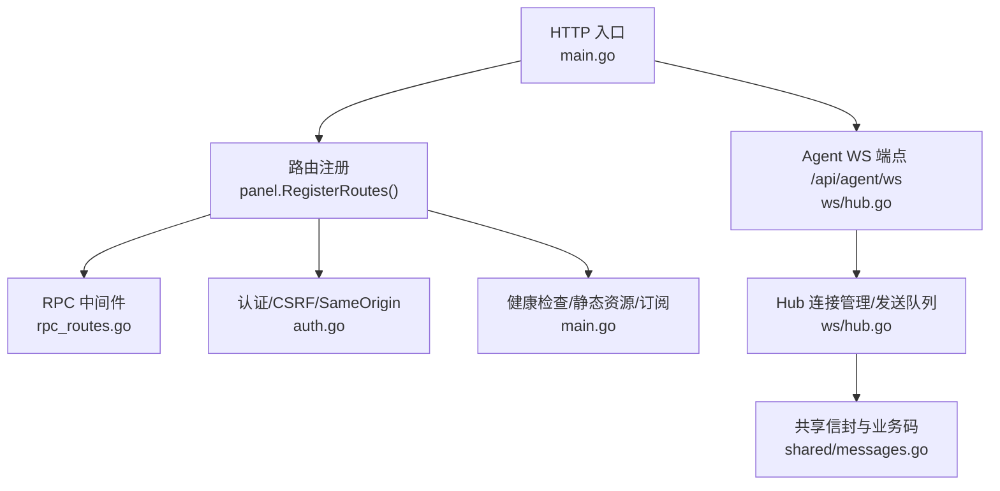
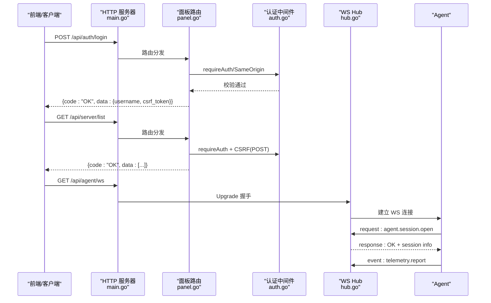
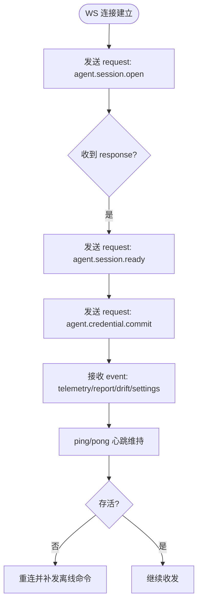
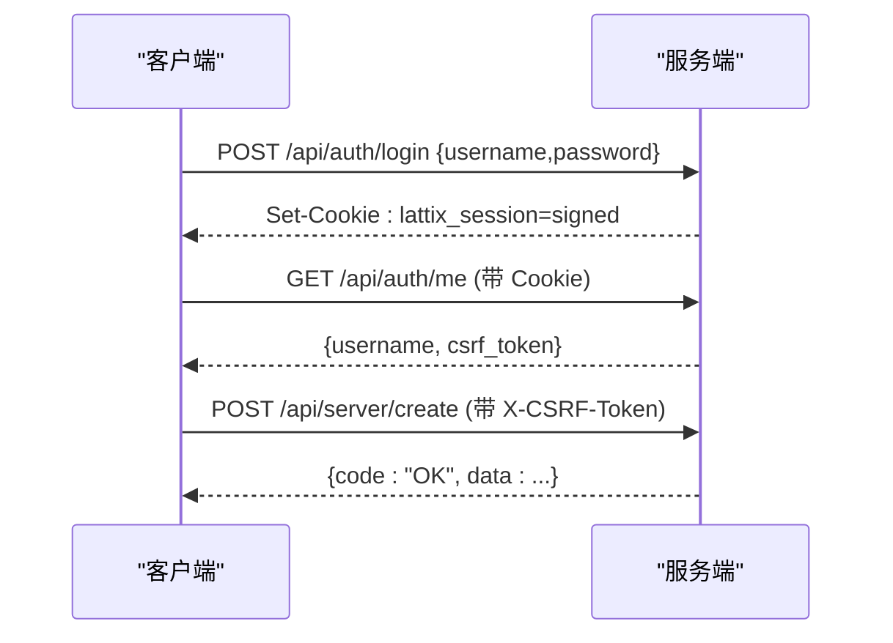
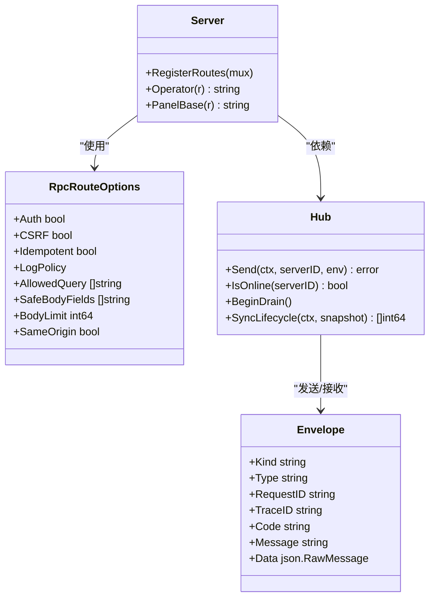

# API 接口

<cite>
**本文引用的文件**   
- [main.go](file://src/backend/cmd/backend/main.go)
- [panel.go](file://src/backend/internal/panel/panel.go)
- [rpc_routes.go](file://src/backend/internal/panel/rpc_routes.go)
- [auth.go](file://src/backend/internal/panel/auth.go)
- [hub.go](file://src/backend/internal/ws/hub.go)
- [messages.go](file://src/shared/messages.go)
- [openapi.yaml](file://docs/openapi.yaml)
- [rpc-api-design.md](file://docs/rpc-api-design.md)
- [ws-protocol.schema.json](file://docs/ws-protocol.schema.json)
</cite>

## 目录
1. [简介](#简介)
2. [项目结构](#项目结构)
3. [核心组件](#核心组件)
4. [架构总览](#架构总览)
5. [详细组件分析](#详细组件分析)
6. [依赖关系分析](#依赖关系分析)
7. [性能考量](#性能考量)
8. [故障排查指南](#故障排查指南)
9. [结论](#结论)
10. [附录：API 参考与使用示例](#附录api-参考与使用示例)

## 简介
本文件为 Lattix-codex 后端服务的 API 接口文档，覆盖以下方面：
- RESTful API 设计规范：HTTP 方法、URL 模式、请求响应格式、状态码定义
- WebSocket 协议实现：连接建立、消息格式、事件类型、实时通信模式
- 认证授权机制：用户登录、权限验证、会话管理、CSRF 保护
- RPC 调用规范：方法定义、参数校验、错误处理、超时控制、幂等性
- 完整 API 使用示例与集成指南，帮助开发者快速理解与调用

## 项目结构
后端服务由 Go 模块组成，入口在 main.go；面板 HTTP API 路由注册与中间件在 panel.go 与 rpc_routes.go；WebSocket Hub 在 ws/hub.go；共享消息信封与业务常量在 shared/messages.go；OpenAPI 契约与 WS Schema 在 docs 目录。

图表来源
- [main.go:364-441](file://src/backend/cmd/backend/main.go#L364-L441)
- [panel.go:159-276](file://src/backend/internal/panel/panel.go#L159-L276)
- [rpc_routes.go:33-72](file://src/backend/internal/panel/rpc_routes.go#L33-L72)
- [auth.go:146-185](file://src/backend/internal/panel/auth.go#L146-L185)
- [hub.go:25-62](file://src/backend/internal/ws/hub.go#L25-L62)
- [messages.go:13-70](file://src/shared/messages.go#L13-L70)

章节来源
- [main.go:62-112](file://src/backend/cmd/backend/main.go#L62-L112)
- [panel.go:159-276](file://src/backend/internal/panel/panel.go#L159-L276)
- [rpc-api-design.md:143-209](file://docs/rpc-api-design.md#L143-L209)

## 核心组件
- HTTP 路由与中间件：统一注册 RPC 路由，注入鉴权、CSRF、幂等、严格 JSON/Query 校验、日志策略
- 认证与会话：基于 Cookie 的会话签名（HMAC+Base64），CSRF Token 绑定会话，Same-Origin 校验
- WebSocket Hub：Agent 连接注册表、发送队列、生命周期同步、优雅关停
- 共享信封：统一的 Envelope 结构与业务码，HTTP 与 WS 共用语义
- OpenAPI 契约：作为协议事实来源，驱动前端类型生成与后端校验一致性

章节来源
- [rpc_routes.go:82-123](file://src/backend/internal/panel/rpc_routes.go#L82-L123)
- [auth.go:26-65](file://src/backend/internal/panel/auth.go#L26-L65)
- [hub.go:101-138](file://src/backend/internal/ws/hub.go#L101-L138)
- [messages.go:13-70](file://src/shared/messages.go#L13-L70)
- [openapi.yaml:1-12](file://docs/openapi.yaml#L1-L12)

## 架构总览
整体采用“HTTP 管理面 + WS 控制面”的双通道设计：
- 管理面：RESTful RPC，统一信封，严格解析，幂等键，CSRF 保护
- 控制面：Panel ↔ Agent WebSocket，request/response/event 三类消息，心跳 ping/pong

图表来源
- [main.go:364-374](file://src/backend/cmd/backend/main.go#L364-L374)
- [panel.go:159-176](file://src/backend/internal/panel/panel.go#L159-L176)
- [auth.go:67-109](file://src/backend/internal/panel/auth.go#L67-L109)
- [hub.go:25-62](file://src/backend/internal/ws/hub.go#L25-L62)
- [messages.go:72-91](file://src/shared/messages.go#L72-L91)

## 详细组件分析

### RESTful API 设计规范
- 方法与参数
  - 只读查询使用 GET；动作类一律 POST；不使用 PUT/PATCH/DELETE
  - 路由风格：/api/{单数领域}/{kebab-case 动作}
  - GET 参数仅 query string；POST 参数仅 JSON body
  - 目标 ID 使用明确命名：server_id、node_id、chain_id、user_id
- 严格解析
  - POST 必须 application/json；无参动作发送 {}
  - 拒绝未知字段、类型不匹配、多个值、尾随垃圾
  - GET 拒绝未知 query 参数与重复单值参数
- 统一响应信封
  - 所有管理 JSON RPC 返回 {code, message, data, request_id, trace_id}
  - 成功业务码 OK；异步操作 ACCEPTED；失败按业务码表达
  - HTTP 状态仅表达协议层结果；命中 RPC 后始终 200
- 安全头与幂等
  - X-Request-ID、X-Trace-ID、Idempotency-Key、X-CSRF-Token
  - 幂等记录按“管理员 + 路由 + Idempotency-Key”持久化

章节来源
- [rpc-api-design.md:44-81](file://docs/rpc-api-design.md#L44-L81)
- [rpc-api-design.md:83-122](file://docs/rpc-api-design.md#L83-L122)
- [rpc-api-design.md:211-224](file://docs/rpc-api-design.md#L211-L224)
- [rpc-api-design.md:259-269](file://docs/rpc-api-design.md#L259-L269)
- [rpc_routes.go:82-123](file://src/backend/internal/panel/rpc_routes.go#L82-L123)
- [panel.go:330-347](file://src/backend/internal/panel/panel.go#L330-L347)

### WebSocket 协议实现
- 连接建立
  - 端点：GET /api/agent/ws，HTTP 升级
  - 初始动作：agent.session.open → agent.session.ready → agent.credential.commit
- 消息格式
  - kind: request | response | event
  - type: domain.action（如 node.apply、telemetry.report）
  - request_id/trace_id：32 位十六进制
  - response 必须包含 code/message/data；request/event 不带 code/message
- 事件类型
  - 遥测上报 telemetry.report、配置漂移 config.drift、设置变更 agent.settings.changed 等
- 心跳与超时
  - 使用 WS ping/pong；Panel 90s 未收到字节判定连接死亡
  - 写超时 10s；发送队列满断开并重连补发
- 生命周期同步
  - panel.lifecycle.changed：Panel 状态变化时广播，等待 ACK

图表来源
- [hub.go:15-22](file://src/backend/internal/ws/hub.go#L15-L22)
- [messages.go:111-137](file://src/shared/messages.go#L111-L137)
- [ws-protocol.schema.json:106-132](file://docs/ws-protocol.schema.json#L106-L132)

章节来源
- [rpc-api-design.md:283-354](file://docs/rpc-api-design.md#L283-L354)
- [ws-protocol.schema.json:1-356](file://docs/ws-protocol.schema.json#L1-L356)
- [messages.go:13-70](file://src/shared/messages.go#L13-L70)

### 认证授权机制
- 会话管理
  - 登录 POST /api/auth/login，返回 username 与 csrf_token，并设置 lattix_session Cookie
  - 登出 POST /api/logout，清空 Cookie
  - 探活 GET /api/auth/me，返回当前用户与 csrf_token
- 会话签名
  - 基于 HMAC-SHA256 + Base64url，payload 为 user|exp
  - 改密即全部会话失效（派生密钥来自密码哈希）
- CSRF 保护
  - 已登录 POST 自动携带 X-CSRF-Token，服务端校验与会话绑定
- Same-Origin
  - 登录强制同源校验（Origin/Referer），HTTPS 下禁止 http 来源

图表来源
- [auth.go:67-109](file://src/backend/internal/panel/auth.go#L67-L109)
- [auth.go:111-135](file://src/backend/internal/panel/auth.go#L111-L135)
- [auth.go:146-185](file://src/backend/internal/panel/auth.go#L146-L185)

章节来源
- [auth.go:26-65](file://src/backend/internal/panel/auth.go#L26-L65)
- [auth.go:67-135](file://src/backend/internal/panel/auth.go#L67-L135)
- [auth.go:164-204](file://src/backend/internal/panel/auth.go#L164-L204)

### RPC 调用规范
- 方法定义
  - 路由见 openapi.yaml；每个路径对应一个 operationId
- 参数校验
  - 严格 JSON/Query 校验；允许白名单字段进入日志属性
- 错误处理
  - 业务码：OK/ACCEPTED/AUTH_REQUIRED/INVALID_ARGUMENT/NOT_FOUND/CONFLICT/OPERATION_LOCKED/UNSUPPORTED_ACTION/INTERNAL_ERROR/UPSTREAM_ERROR/SERVICE_UNAVAILABLE/SERVER_OFFLINE/PORT_OUT_OF_RANGE/UPDATE_IN_PROGRESS
  - 协议错误：HTTP 状态 4xx/5xx 以 problem+json 返回
- 超时控制
  - WS 写超时 10s；Panel 启动/故障态拒绝业务命令
- 幂等性
  - 支持 Idempotency-Key；同一 key 重复请求返回首次结果

章节来源
- [openapi.yaml:338-523](file://docs/openapi.yaml#L338-L523)
- [rpc_routes.go:157-226](file://src/backend/internal/panel/rpc_routes.go#L157-L226)
- [messages.go:54-70](file://src/shared/messages.go#L54-L70)
- [hub.go:118-138](file://src/backend/internal/ws/hub.go#L118-L138)

## 依赖关系分析
- 路由注册依赖 panel.Server.RegisterRoutes，内部使用 registerRPC 注入中间件链
- 认证依赖 auth.go 的会话签名与 CSRF 校验
- WS Hub 依赖 shared.Envelope 与业务码常量
- 健康检查与优雅关停由 main.go 编排

图表来源
- [panel.go:159-276](file://src/backend/internal/panel/panel.go#L159-L276)
- [rpc_routes.go:22-31](file://src/backend/internal/panel/rpc_routes.go#L22-L31)
- [hub.go:25-62](file://src/backend/internal/ws/hub.go#L25-L62)
- [messages.go:13-22](file://src/shared/messages.go#L13-L22)

章节来源
- [panel.go:159-276](file://src/backend/internal/panel/panel.go#L159-L276)
- [rpc_routes.go:33-72](file://src/backend/internal/panel/rpc_routes.go#L33-L72)
- [hub.go:101-138](file://src/backend/internal/ws/hub.go#L101-L138)

## 性能考量
- 请求日志与操作日志分离，高频轮询接口可关闭或降级日志策略
- WS 发送队列长度有限，慢连接断开并重连补发，避免背压扩散
- 健康检查 /readyz 不依赖外部服务，快速反馈就绪状态
- 幂等记录定期清理，避免存储膨胀

章节来源
- [panel.go:174-182](file://src/backend/internal/panel/panel.go#L174-L182)
- [hub.go:21-22](file://src/backend/internal/ws/hub.go#L21-L22)
- [main.go:408-424](file://src/backend/cmd/backend/main.go#L408-L424)

## 故障排查指南
- 常见错误码
  - AUTH_REQUIRED：未登录或会话过期
  - INVALID_ARGUMENT：参数无效或缺失
  - NOT_FOUND：资源不存在
  - CONFLICT：幂等键冲突或资源冲突
  - OPERATION_LOCKED：操作被锁定（如更新进行中）
  - SERVER_OFFLINE：Agent 离线
  - UPDATE_IN_PROGRESS：面板更新中
- 排查步骤
  - 检查 X-Request-ID/X-Trace-ID 是否一致
  - 确认 Content-Type 与 JSON 结构
  - 查看 WS 连接状态与心跳
  - 检查 /readyz 与健康检查日志

章节来源
- [messages.go:54-70](file://src/shared/messages.go#L54-L70)
- [rpc-api-design.md:65-81](file://docs/rpc-api-design.md#L65-L81)
- [main.go:408-424](file://src/backend/cmd/backend/main.go#L408-L424)

## 结论
本 API 设计以 OpenAPI 契约为核心，结合严格的请求解析、统一的响应信封、完善的认证与幂等机制，以及高效的 WS 控制通道，为 Lattix 面板提供了稳定、安全、可扩展的管理能力。开发者可依据本文档快速集成与调试。

## 附录：API 参考与使用示例

### RESTful API 列表（节选）
- 认证
  - POST /api/auth/login
  - POST /api/auth/logout
  - GET /api/auth/me
- 服务器
  - GET /api/server/list
  - POST /api/server/create
  - POST /api/server/update
  - POST /api/server/delete
  - POST /api/server/rotate-token
  - POST /api/server/repair
  - POST /api/server/upgrade-xray
  - POST /api/server/upgrade-agent
  - GET /api/server/list-release-versions?kind=agent|xray
- 节点
  - GET /api/node/list
  - POST /api/node/create
  - POST /api/node/retry
  - POST /api/node/delete
- 链路
  - GET /api/chain/list
  - POST /api/chain/create
  - POST /api/chain/edit
  - POST /api/chain/force-publish
  - POST /api/chain/retry
  - POST /api/chain/delete
  - POST /api/chain/set-traffic-multiplier
  - POST /api/chain/reset-traffic
  - GET /api/chain/get-traffic-history?chain_id=&hop_id=&days=
- 用户
  - GET /api/user/list
  - POST /api/user/create
  - POST /api/user/update
  - POST /api/user/set-nodes
  - POST /api/user/delete
- 设置
  - GET /api/setting/get
  - POST /api/setting/update
  - POST /api/setting/change-password
  - POST /api/setting/test-alerts
- 面板
  - POST /api/panel/restart
  - GET /api/panel/state
  - GET /api/panel/get-version
  - POST /api/panel/start-update
  - GET /api/panel/get-update-status
- 备份
  - GET /api/backup/download
- 日志
  - GET /api/log/list-operations
  - POST /api/log/clear-operations
  - GET /api/log/list-requests
  - POST /api/log/clear-requests

章节来源
- [openapi.yaml:14-337](file://docs/openapi.yaml#L14-L337)
- [rpc-api-design.md:143-209](file://docs/rpc-api-design.md#L143-L209)

### WebSocket 消息示例
- 请求
  - {kind:"request", type:"node.apply", request_id:"...", trace_id:"...", data:{...}}
- 响应
  - {kind:"response", type:"node.apply", request_id:"...", trace_id:"...", code:"OK", message:"", data:{...}}
- 事件
  - {kind:"event", type:"telemetry.report", request_id:"...", trace_id:"...", data:{...}}

章节来源
- [rpc-api-design.md:283-354](file://docs/rpc-api-design.md#L283-L354)
- [ws-protocol.schema.json:106-132](file://docs/ws-protocol.schema.json#L106-L132)

### 认证流程示例
- 登录
  - POST /api/auth/login {username, password}
  - 响应：{code:"OK", data:{username, csrf_token}}
- 探活
  - GET /api/auth/me
  - 响应：{code:"OK", data:{username, csrf_token}}
- 登出
  - POST /api/auth/logout
  - 响应：{code:"OK", data:null}

章节来源
- [auth.go:67-109](file://src/backend/internal/panel/auth.go#L67-L109)
- [auth.go:111-135](file://src/backend/internal/panel/auth.go#L111-L135)

### 幂等调用示例
- 添加 Idempotency-Key 头
- 相同 key 重复请求返回首次结果
- 适用于创建、升级、修复、重启等副作用动作

章节来源
- [rpc_routes.go:157-226](file://src/backend/internal/panel/rpc_routes.go#L157-L226)
- [rpc-api-design.md:259-269](file://docs/rpc-api-design.md#L259-L269)