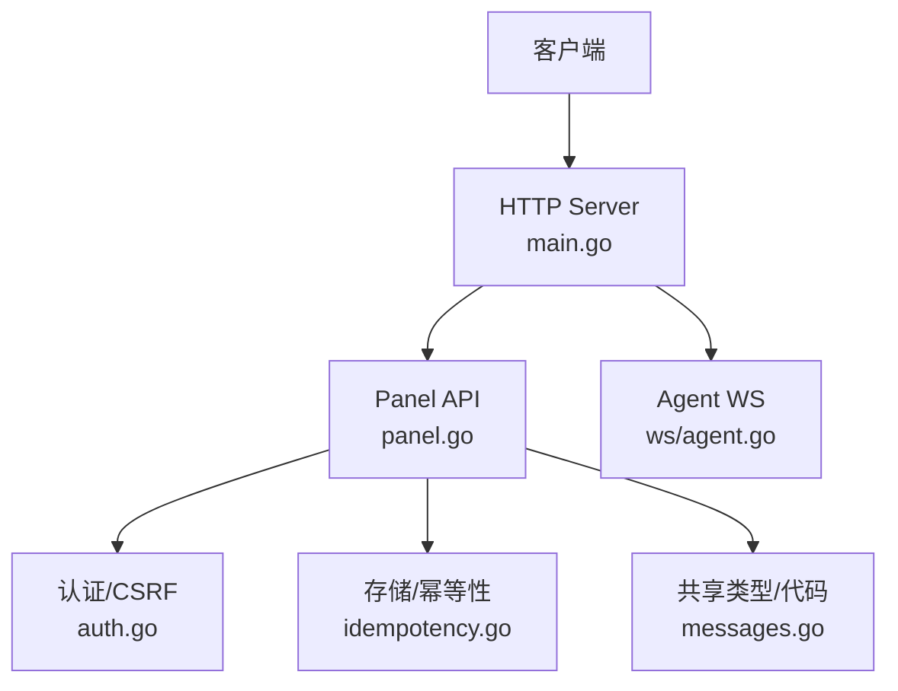
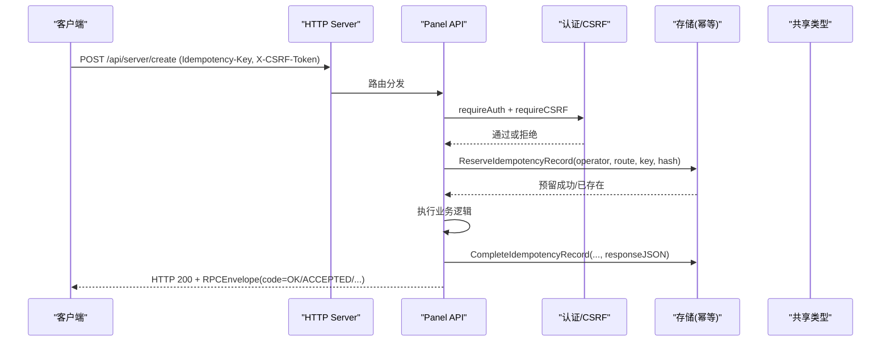
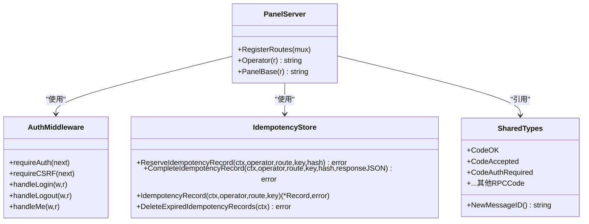

# RESTful API

<cite>
**本文引用的文件**   
- [openapi.yaml](file://docs/openapi.yaml)
- [main.go](file://src/backend/cmd/backend/main.go)
- [panel.go](file://src/backend/internal/panel/panel.go)
- [auth.go](file://src/backend/internal/panel/auth.go)
- [idempotency.go](file://src/backend/internal/store/idempotency.go)
- [messages.go](file://src/shared/messages.go)
- [servers.go](file://src/backend/internal/panel/servers.go)
- [agent.go](file://src/backend/internal/ws/agent.go)
</cite>

## 目录
1. [简介](#简介)
2. [项目结构](#项目结构)
3. [核心组件](#核心组件)
4. [架构总览](#架构总览)
5. [详细接口说明](#详细接口说明)
6. [依赖关系分析](#依赖关系分析)
7. [性能与可靠性](#性能与可靠性)
8. [故障排查指南](#故障排查指南)
9. [结论](#结论)
10. [附录：幂等性与调用示例](#附录幂等性与调用示例)

## 简介
本文件为 Lattix-codex 的 RESTful API 完整接口文档。API 采用统一的 RPC 信封格式，HTTP 状态码统一为 200（业务结果由响应体 code 表达），协议层错误使用 application/problem+json 返回。所有管理接口均基于会话 Cookie 认证，并支持 CSRF 校验与 Idempotency-Key 幂等性保证。

## 项目结构
- OpenAPI 规范定义在 docs/openapi.yaml，包含全部路径、参数、请求体与响应体结构。
- HTTP 服务启动与路由注册位于 src/backend/cmd/backend/main.go。
- 面板 API 路由与中间件逻辑位于 src/backend/internal/panel/panel.go。
- 认证与会话、CSRF 实现位于 src/backend/internal/panel/auth.go。
- 幂等性存储与生命周期在 src/backend/internal/store/idempotency.go。
- 共享消息类型与 RPC 代码枚举在 src/shared/messages.go。
- 服务器相关处理逻辑在 src/backend/internal/panel/servers.go。
- Agent WebSocket 端点与鉴权在 src/backend/internal/ws/agent.go。

**图表来源** 
- [main.go:372-448](file://src/backend/cmd/backend/main.go#L372-L448)
- [panel.go:162-279](file://src/backend/internal/panel/panel.go#L162-L279)
- [auth.go:82-181](file://src/backend/internal/panel/auth.go#L82-L181)
- [idempotency.go:17-104](file://src/backend/internal/store/idempotency.go#L17-L104)
- [messages.go:54-70](file://src/shared/messages.go#L54-L70)
- [agent.go:31-63](file://src/backend/internal/ws/agent.go#L31-L63)

**章节来源**
- [openapi.yaml:1-712](file://docs/openapi.yaml#L1-L712)
- [main.go:372-448](file://src/backend/cmd/backend/main.go#L372-L448)
- [panel.go:162-279](file://src/backend/internal/panel/panel.go#L162-L279)

## 核心组件
- 统一响应信封：所有成功响应均为 HTTP 200，响应体包含 code、message、data、request_id、trace_id。
- 协议层错误：非 200 的状态码（如 400/404/405/413/415）以 application/problem+json 返回，包含 code、message、data、request_id、trace_id。
- 认证与会话：基于 Cookie 的会话机制，登录返回 csrf_token，后续写操作需携带 X-CSRF-Token。
- 幂等性：写操作支持 Idempotency-Key 请求头，服务端按 operator+route+key 去重并缓存响应 JSON。
- 健康检查：/healthz 与 /readyz 不经过业务信封，直接返回文本。

**章节来源**
- [panel.go:312-396](file://src/backend/internal/panel/panel.go#L312-L396)
- [messages.go:54-70](file://src/shared/messages.go#L54-L70)
- [auth.go:82-181](file://src/backend/internal/panel/auth.go#L82-L181)
- [idempotency.go:17-104](file://src/backend/internal/store/idempotency.go#L17-L104)
- [main.go:384-432](file://src/backend/cmd/backend/main.go#L384-L432)

## 架构总览
- HTTP 入口：main.go 构建 http.Server，注册 /api/* 路由与健康检查。
- 面板 API：panel.go 通过 registerRPC 统一注册路由，自动应用认证、CSRF、日志策略与幂等性。
- 认证流程：auth.go 提供登录、登出、当前用户获取，签发会话 Cookie 与 CSRF Token。
- 幂等性：store/idempotency.go 提供预留、完成、查询与过期清理能力。
- 共享类型：shared/messages.go 定义 RPCCode、MessageID 等通用类型。

**图表来源** 
- [main.go:372-448](file://src/backend/cmd/backend/main.go#L372-L448)
- [panel.go:162-279](file://src/backend/internal/panel/panel.go#L162-L279)
- [auth.go:229-249](file://src/backend/internal/panel/auth.go#L229-L249)
- [idempotency.go:37-81](file://src/backend/internal/store/idempotency.go#L37-L81)
- [messages.go:54-70](file://src/shared/messages.go#L54-L70)

**章节来源**
- [main.go:372-448](file://src/backend/cmd/backend/main.go#L372-L448)
- [panel.go:162-279](file://src/backend/internal/panel/panel.go#L162-L279)
- [auth.go:229-249](file://src/backend/internal/panel/auth.go#L229-L249)
- [idempotency.go:37-81](file://src/backend/internal/store/idempotency.go#L37-L81)

## 详细接口说明
以下接口均以 OpenAPI 为准，HTTP 方法、路径、参数与请求体结构如下。所有成功响应均为 HTTP 200，响应体遵循 RPCEnvelope；协议层错误使用 application/problem+json。

- 认证与会话
  - POST /api/auth/login
    - 描述：浏览器登录需要同源 Origin 或 Referer；HTTPS 场景要求来源为 HTTPS。
    - 请求头：无特殊要求（跨域时注意同源）。
    - 请求体：application/json，字段 username、password。
    - 响应体：code=OK，data.username、data.csrf_token。
    - 安全：无需认证。
  - POST /api/auth/logout
    - 描述：清除会话 Cookie。
    - 请求头：X-CSRF-Token（必需）。
    - 请求体：application/json，空对象。
    - 响应体：code=OK，data=null。
    - 安全：需认证。
  - GET /api/auth/me
    - 描述：返回当前登录用户与 csrf_token。
    - 请求头：无特殊要求。
    - 响应体：code=OK，data.username、data.csrf_token。
    - 安全：需认证。

- 仪表盘与服务器
  - GET /api/dashboard/get
    - 描述：仪表盘统计信息。
    - 安全：需认证。
  - GET /api/server/list
    - 描述：列出服务器列表。
    - 安全：需认证。
  - GET /api/server/list-metric-samples
    - 描述：指标采样点列表。
    - 查询参数：limit（整数，1-60，默认 30）。
    - 安全：需认证。
  - GET /api/server/get-metric-history
    - 描述：服务器指标历史。
    - 查询参数：server_id（整数，>=1）、hours（整数，1-24，默认 24）。
    - 安全：需认证。
  - GET /api/server/list-commands
    - 描述：服务器命令列表。
    - 查询参数：server_id（整数，>=1）、limit（整数，1-200）。
    - 安全：需认证。
  - POST /api/server/create
    - 描述：创建服务器。
    - 请求头：X-CSRF-Token、Idempotency-Key（必需）。
    - 请求体：application/json，字段见 OpenAPI。
    - 响应体：code=OK/ACCEPTED，data 包含新服务器信息。
    - 安全：需认证。
  - POST /api/server/update
    - 描述：更新服务器。
    - 请求头：X-CSRF-Token、Idempotency-Key（必需）。
    - 请求体：application/json，字段见 OpenAPI。
    - 安全：需认证。
  - POST /api/server/delete
    - 描述：删除服务器。
    - 请求头：X-CSRF-Token、Idempotency-Key（必需）。
    - 请求体：application/json，字段 server_id。
    - 安全：需认证。
  - POST /api/server/rotate-token
    - 描述：轮换服务器 token。
    - 请求头：X-CSRF-Token、Idempotency-Key（必需）。
    - 请求体：application/json，字段 server_id。
    - 安全：需认证。
  - POST /api/server/repair
    - 描述：修复服务器。
    - 请求头：X-CSRF-Token、Idempotency-Key（必需）。
    - 请求体：application/json，字段 server_id。
    - 安全：需认证。
  - POST /api/server/upgrade-xray
    - 描述：升级 xray。
    - 请求头：X-CSRF-Token、Idempotency-Key（必需）。
    - 请求体：application/json，字段 server_id、version。
    - 安全：需认证。
  - POST /api/server/upgrade-agent
    - 描述：升级 agent。
    - 请求头：X-CSRF-Token、Idempotency-Key（必需）。
    - 请求体：application/json，字段 server_id、version。
    - 安全：需认证。
  - GET /api/server/list-release-versions
    - 描述：列出可用版本。
    - 查询参数：kind（枚举：agent、xray，必需）。
    - 安全：需认证。

- 提供商与汇率
  - GET /api/provider/list
    - 描述：列出提供商。
    - 安全：需认证。
  - POST /api/provider/create
    - 描述：创建提供商。
    - 请求头：X-CSRF-Token、Idempotency-Key（必需）。
    - 请求体：application/json。
    - 安全：需认证。
  - POST /api/provider/update
    - 描述：更新提供商。
    - 请求头：X-CSRF-Token、Idempotency-Key（必需）。
    - 请求体：application/json。
    - 安全：需认证。
  - POST /api/provider/delete
    - 描述：删除提供商。
    - 请求头：X-CSRF-Token、Idempotency-Key（必需）。
    - 请求体：application/json。
    - 安全：需认证。
  - GET /api/exchange-rate/list
    - 描述：列出汇率。
    - 安全：需认证。
  - POST /api/exchange-rate/refresh
    - 描述：刷新汇率。
    - 请求头：X-CSRF-Token、Idempotency-Key（必需）。
    - 请求体：application/json。
    - 安全：需认证。
  - POST /api/exchange-rate/save-custom
    - 描述：保存自定义汇率。
    - 请求头：X-CSRF-Token、Idempotency-Key（必需）。
    - 请求体：application/json，CustomExchangeRate。
    - 安全：需认证。
  - POST /api/exchange-rate/delete-custom
    - 描述：删除自定义汇率。
    - 请求头：X-CSRF-Token、Idempotency-Key（必需）。
    - 请求体：application/json。
    - 安全：需认证。

- 节点与链路
  - GET /api/node/list
    - 描述：列出节点。
    - 安全：需认证。
  - POST /api/node/create
    - 描述：创建节点。
    - 请求头：X-CSRF-Token、Idempotency-Key（必需）。
    - 请求体：application/json。
    - 安全：需认证。
  - POST /api/node/retry
    - 描述：重试节点操作。
    - 请求头：X-CSRF-Token、Idempotency-Key（必需）。
    - 请求体：application/json，字段 node_id。
    - 安全：需认证。
  - POST /api/node/delete
    - 描述：删除节点。
    - 请求头：X-CSRF-Token、Idempotency-Key（必需）。
    - 请求体：application/json，字段 node_id。
    - 安全：需认证。
  - GET /api/chain/list
    - 描述：列出链路。
    - 安全：需认证。
  - POST /api/chain/create
    - 描述：创建链路。
    - 请求头：X-CSRF-Token、Idempotency-Key（必需）。
    - 请求体：application/json。
    - 安全：需认证。
  - POST /api/chain/edit
    - 描述：编辑链路（生成期望修订并按序部署）。
    - 请求头：X-CSRF-Token、Idempotency-Key（必需）。
    - 请求体：application/json。
    - 安全：需认证。
  - POST /api/chain/force-publish
    - 描述：强制发布（将期望修订提升为未确认，队列任务继续执行不回滚）。
    - 请求头：X-CSRF-Token、Idempotency-Key（必需）。
    - 请求体：application/json。
    - 安全：需认证。
  - POST /api/chain/set-traffic-multiplier
    - 描述：设置流量倍数。
    - 请求头：X-CSRF-Token、Idempotency-Key（必需）。
    - 请求体：application/json。
    - 安全：需认证。
  - POST /api/chain/reset-traffic
    - 描述：重置流量计数。
    - 请求头：X-CSRF-Token、Idempotency-Key（必需）。
    - 请求体：application/json。
    - 安全：需认证。
  - GET /api/chain/get-traffic-history
    - 描述：获取链路流量历史。
    - 查询参数：chain_id（整数，>=1，必需）、hop_id（整数，>=0，默认 0）、days（整数，1-730，默认 30）。
    - 安全：需认证。
  - POST /api/chain/retry
    - 描述：重试链路操作。
    - 请求头：X-CSRF-Token、Idempotency-Key（必需）。
    - 请求体：application/json，字段 chain_id。
    - 安全：需认证。
  - POST /api/chain/delete
    - 描述：删除链路。
    - 请求头：X-CSRF-Token、Idempotency-Key（必需）。
    - 请求体：application/json，字段 chain_id。
    - 安全：需认证。

- 用户
  - GET /api/user/list
    - 描述：列出用户。
    - 安全：需认证。
  - POST /api/user/create
    - 描述：创建用户。
    - 请求头：X-CSRF-Token、Idempotency-Key（必需）。
    - 请求体：application/json。
    - 安全：需认证。
  - POST /api/user/update
    - 描述：更新用户。
    - 请求头：X-CSRF-Token、Idempotency-Key（必需）。
    - 请求体：application/json，字段 user_id。
    - 安全：需认证。
  - POST /api/user/set-nodes
    - 描述：设置用户节点。
    - 请求头：X-CSRF-Token、Idempotency-Key（必需）。
    - 请求体：application/json，字段 user_id。
    - 安全：需认证。
  - POST /api/user/delete
    - 描述：删除用户。
    - 请求头：X-CSRF-Token、Idempotency-Key（必需）。
    - 请求体：application/json，字段 user_id。
    - 安全：需认证。

- 设置与面板
  - GET /api/setting/get
    - 描述：获取设置。
    - 安全：需认证。
  - POST /api/setting/update
    - 描述：更新设置。
    - 请求头：X-CSRF-Token、Idempotency-Key（必需）。
    - 请求体：application/json，SettingUpdateRequest。
    - 安全：需认证。
  - POST /api/setting/change-password
    - 描述：修改密码。
    - 请求头：X-CSRF-Token（必需）。
    - 请求体：application/json。
    - 安全：需认证。
  - POST /api/setting/test-alerts
    - 描述：测试告警。
    - 请求头：X-CSRF-Token、Idempotency-Key（必需）。
    - 请求体：application/json。
    - 安全：需认证。
  - POST /api/panel/restart
    - 描述：重启面板。
    - 请求头：X-CSRF-Token、Idempotency-Key（必需）。
    - 请求体：application/json。
    - 安全：需认证。
  - GET /api/panel/state
    - 描述：面板状态。
    - 安全：需认证。
  - GET /api/panel/get-version
    - 描述：面板版本。
    - 安全：需认证。
  - POST /api/panel/start-update
    - 描述：开始更新。
    - 请求头：X-CSRF-Token、Idempotency-Key（必需）。
    - 请求体：application/json。
    - 安全：需认证。
  - GET /api/panel/get-update-status
    - 描述：更新状态。
    - 安全：需认证。

- 备份与日志
  - GET /api/backup/download
    - 描述：下载备份（SQLite 附件或 RPC 错误信封）。
    - 响应体：application/octet-stream 或 application/json。
    - 安全：需认证。
  - GET /api/log/list-operations
    - 描述：操作日志列表。
    - 查询参数：severity、category、server_id、operator、q、from、to、limit、offset。
    - 安全：需认证。
  - POST /api/log/clear-operations
    - 描述：清空操作日志。
    - 请求头：X-CSRF-Token、Idempotency-Key（必需）。
    - 请求体：application/json。
    - 安全：需认证。
  - GET /api/log/list-requests
    - 描述：请求日志列表。
    - 查询参数：limit（枚举：10、30、50、100，默认 30）。
    - 安全：需认证。
  - POST /api/log/clear-requests
    - 描述：清空请求日志。
    - 请求头：X-CSRF-Token、Idempotency-Key（必需）。
    - 请求体：application/json。
    - 安全：需认证。

**章节来源**
- [openapi.yaml:14-448](file://docs/openapi.yaml#L14-L448)
- [panel.go:162-279](file://src/backend/internal/panel/panel.go#L162-L279)

## 依赖关系分析
- 路由注册：panel.go 中 registerRPC 统一注入认证、CSRF、日志策略与幂等性。
- 认证依赖：auth.go 提供会话签名、CSRF 令牌生成与校验。
- 幂等性依赖：store/idempotency.go 提供预留、完成、查询与过期清理。
- 共享类型：messages.go 定义 RPCCode、MessageID 等。
- 健康检查：main.go 中 /healthz 与 /readyz 独立于业务信封。

**图表来源** 
- [panel.go:162-279](file://src/backend/internal/panel/panel.go#L162-L279)
- [auth.go:82-181](file://src/backend/internal/panel/auth.go#L82-L181)
- [idempotency.go:17-104](file://src/backend/internal/store/idempotency.go#L17-L104)
- [messages.go:54-100](file://src/shared/messages.go#L54-L100)

**章节来源**
- [panel.go:162-279](file://src/backend/internal/panel/panel.go#L162-L279)
- [auth.go:82-181](file://src/backend/internal/panel/auth.go#L82-L181)
- [idempotency.go:17-104](file://src/backend/internal/store/idempotency.go#L17-L104)
- [messages.go:54-100](file://src/shared/messages.go#L54-L100)

## 性能与可靠性
- 超时配置：ReadHeaderTimeout、ReadTimeout、WriteTimeout、IdleTimeout、MaxHeaderBytes 在 main.go 中设置。
- 优雅关停：drainMiddleware 在面板重启期间对 /api/* 返回 SERVICE_UNAVAILABLE 信封。
- 健康检查：/healthz 与 /readyz 快速判断服务可用性。
- 幂等性：避免重复提交导致副作用，提高网络抖动下的可靠性。

**章节来源**
- [main.go:46-51](file://src/backend/cmd/backend/main.go#L46-L51)
- [main.go:586-604](file://src/backend/cmd/backend/main.go#L586-L604)
- [main.go:384-432](file://src/backend/cmd/backend/main.go#L384-L432)

## 故障排查指南
- 协议层错误：检查 HTTP 状态码与 application/problem+json 响应体中的 code、message、request_id、trace_id。
- 认证失败：确认 Cookie lattix_session 有效且 X-CSRF-Token 正确。
- 幂等冲突：若 Idempotency-Key 已存在，将返回预留已存在的错误；确保客户端生成唯一键。
- 服务不可用：drainMiddleware 在重启期间返回 SERVICE_UNAVAILABLE；等待恢复后重试。

**章节来源**
- [panel.go:371-396](file://src/backend/internal/panel/panel.go#L371-L396)
- [auth.go:229-249](file://src/backend/internal/panel/auth.go#L229-L249)
- [idempotency.go:37-59](file://src/backend/internal/store/idempotency.go#L37-L59)
- [main.go:586-604](file://src/backend/cmd/backend/main.go#L586-L604)

## 结论
Lattix-codex 的 RESTful API 采用统一信封与强一致的错误模型，结合会话认证、CSRF 与幂等性机制，提供了高可靠的管理接口。OpenAPI 规范完整定义了所有路径与数据结构，便于前后端协作与自动化测试。

## 附录：幂等性与调用示例
- 幂等性保证
  - Idempotency-Key 请求头：客户端生成唯一键（长度 8-128，字符集 A-Za-z0-9._:-），与服务端 operator、route、key 共同作为幂等键。
  - 预留阶段：ReserveIdempotencyRecord 插入记录，若已存在则返回错误。
  - 完成阶段：CompleteIdempotencyRecord 写入响应 JSON，确保幂等响应可重复返回。
  - 过期清理：DeleteExpiredIdempotencyRecords 定期清理 24 小时前的预留记录。

- 调用示例（概念性）
  - 登录
    - POST /api/auth/login
    - 请求体：{"username":"admin","password":"..."}
    - 响应体：{"code":"OK","message":"","data":{"username":"admin","csrf_token":"..."},"request_id":"...","trace_id":"..."}
  - 创建服务器（幂等）
    - POST /api/server/create
    - 请求头：X-CSRF-Token: "...", Idempotency-Key: "unique-key-123"
    - 请求体：{"alias":"...","country_code":"...","location":"..."}
    - 响应体：{"code":"OK","message":"","data":{...},"request_id":"...","trace_id":"..."}
  - 错误处理
    - 协议层错误：HTTP 400/404/405/413/415，响应体 application/problem+json，包含 code、message、data、request_id、trace_id。
    - 业务错误：HTTP 200，响应体 code 为非 OK 的值（如 AUTH_REQUIRED、INVALID_ARGUMENT 等）。

**章节来源**
- [idempotency.go:17-104](file://src/backend/internal/store/idempotency.go#L17-L104)
- [openapi.yaml:467-476](file://docs/openapi.yaml#L467-L476)
- [panel.go:312-396](file://src/backend/internal/panel/panel.go#L312-L396)
- [auth.go:82-181](file://src/backend/internal/panel/auth.go#L82-L181)