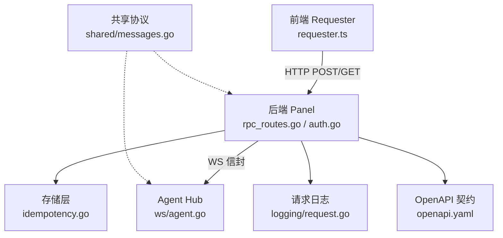
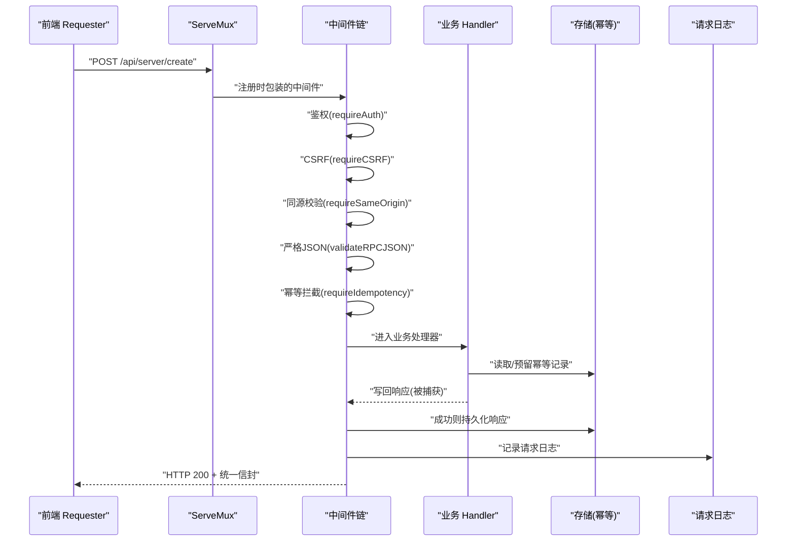
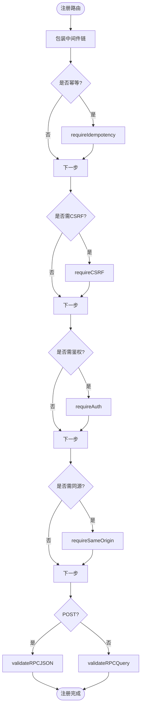
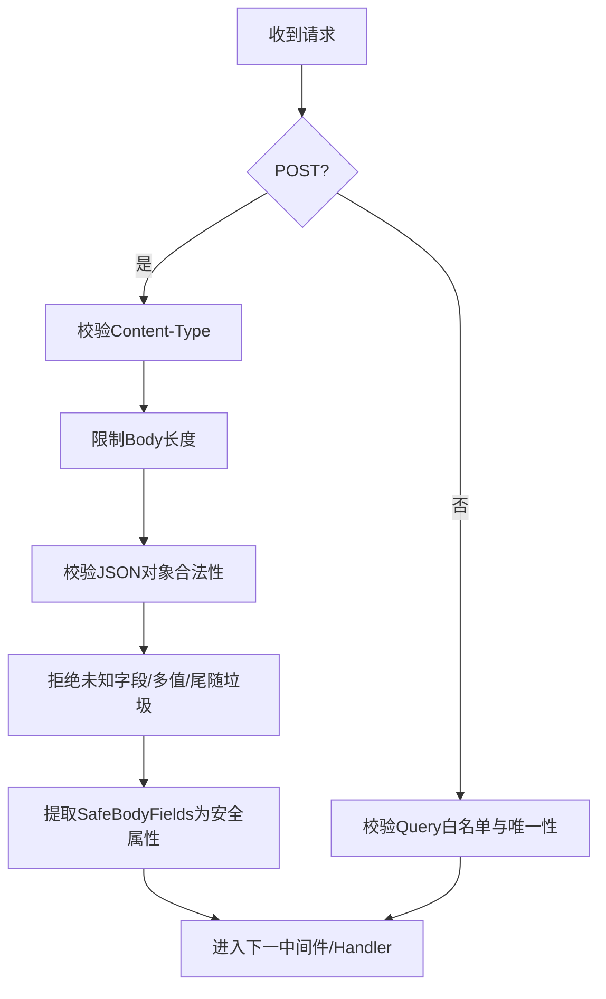
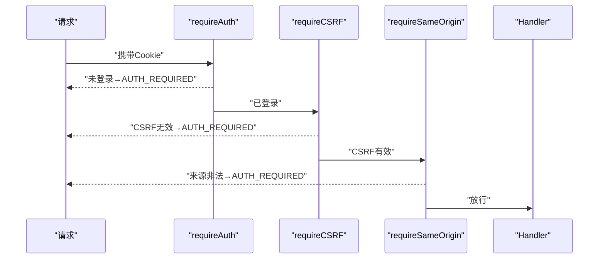
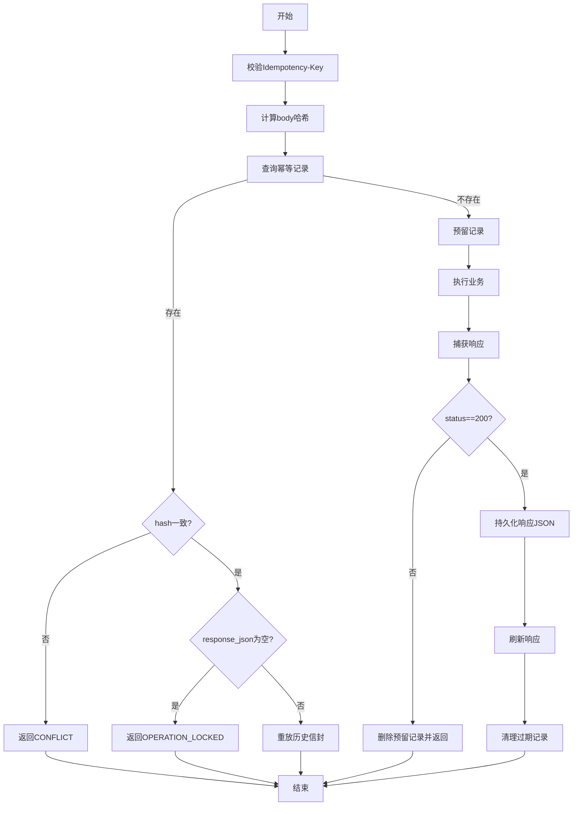
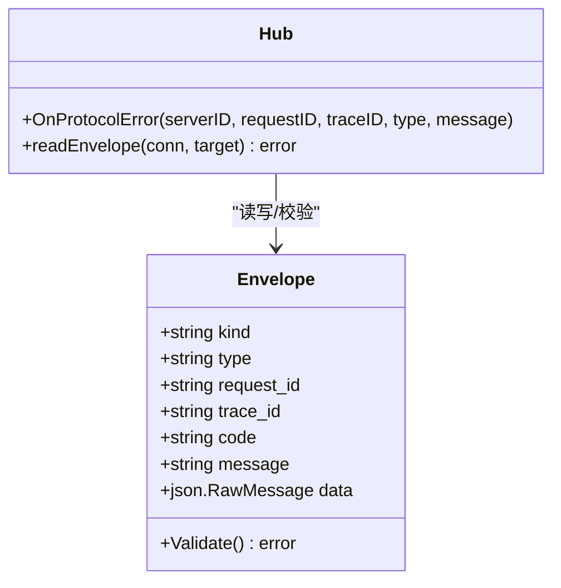
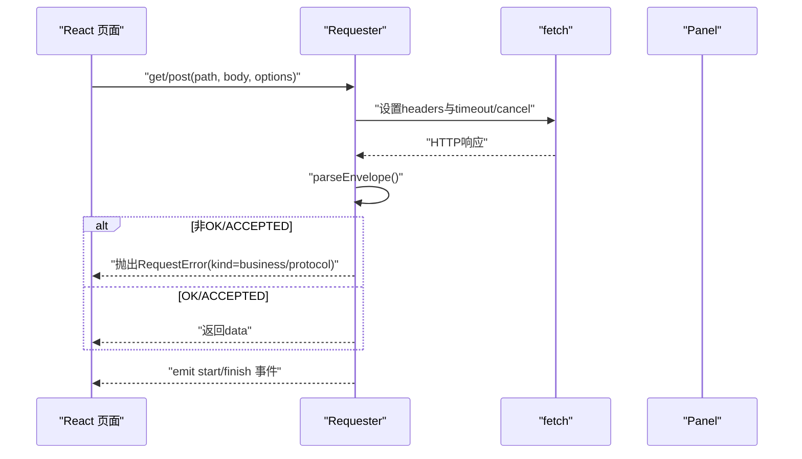
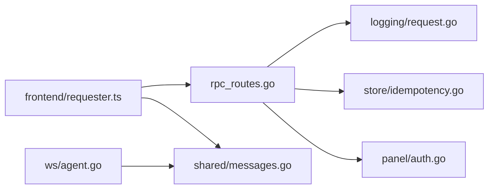

# RPC 机制

<cite>
**本文引用的文件**   
- [rpc-api-design.md](file://docs/rpc-api-design.md)
- [openapi.yaml](file://docs/openapi.yaml)
- [rpc_routes.go](file://src/backend/internal/panel/rpc_routes.go)
- [auth.go](file://src/backend/internal/panel/auth.go)
- [idempotency.go](file://src/backend/internal/store/idempotency.go)
- [messages.go](file://src/shared/messages.go)
- [agent.go](file://src/backend/internal/ws/agent.go)
- [requester.ts](file://src/frontend/src/lib/requester.ts)
- [request-state-context.ts](file://src/frontend/src/lib/request-state-context.ts)
- [main.go](file://src/backend/cmd/backend/main.go)
- [request.go](file://src/backend/internal/logging/request.go)
</cite>

## 目录
1. [简介](#简介)
2. [项目结构](#项目结构)
3. [核心组件](#核心组件)
4. [架构总览](#架构总览)
5. [详细组件分析](#详细组件分析)
6. [依赖关系分析](#依赖关系分析)
7. [性能考量](#性能考量)
8. [故障排查指南](#故障排查指南)
9. [结论](#结论)
10. [附录：RPC 开发指南与调试技巧](#附录rpc-开发指南与调试技巧)

## 简介
本文件为 Lattix-codex 的 RPC 机制提供完整技术文档，覆盖以下方面：
- HTTP 管理 API 与 Panel ↔ Agent WebSocket 的协议边界、路由与信封
- 路由注册与中间件链（鉴权、CSRF、同源校验、请求体/查询严格解析、幂等）
- 请求验证框架（参数校验、类型检查、安全过滤）
- 响应捕获与缓存（幂等性保证、结果重放）
- 错误处理与异常传播（HTTP 状态码与业务码分离、WS 信封校验与错误分类）
- 性能优化建议（重试策略、超时控制、日志与容量限制）
- 完整的开发指南与调试技巧

## 项目结构
Lattix 的 RPC 体系由三部分构成：
- Frontend Requester：浏览器端发起管理 HTTP RPC，统一构造请求头、信封解析、错误分类与生命周期事件
- Backend Panel：HTTP 路由注册、中间件链、鉴权与 CSRF、严格解析、幂等缓存、日志记录
- Panel ↔ Agent WebSocket：统一的 Envelope 信封协议，定义请求/响应/事件结构与业务码

**图表来源**
- [requester.ts](file://src/frontend/src/lib/requester.ts)
- [rpc_routes.go](file://src/backend/internal/panel/rpc_routes.go)
- [auth.go](file://src/backend/internal/panel/auth.go)
- [agent.go](file://src/backend/internal/ws/agent.go)
- [idempotency.go](file://src/backend/internal/store/idempotency.go)
- [request.go](file://src/backend/internal/logging/request.go)
- [openapi.yaml](file://docs/openapi.yaml)
- [messages.go](file://src/shared/messages.go)

**章节来源**
- [rpc-api-design.md](file://docs/rpc-api-design.md)
- [openapi.yaml](file://docs/openapi.yaml)

## 核心组件
- 统一信封与业务码：Panel 与 Agent 共用 Envelope 与稳定业务码，确保两端一致
- 路由注册与中间件：registerRPC 将方法+路径注册到 ServeMux，并自动注入鉴权、CSRF、同源、严格解析、幂等中间件
- 请求验证：POST 严格 JSON 校验（Content-Type、大小、未知字段拒绝），GET 严格 Query 白名单与去重
- 幂等与响应缓存：Idempotency-Key + 请求体哈希，首次成功写入持久化，重复请求直接返回历史信封
- 错误分类：HTTP 状态表达传输/协议/进程完成度；业务结果通过 code/message/data 表达
- 日志与追踪：X-Request-ID/X-Trace-ID 贯穿全链路，请求日志按配置限流与轮转

**章节来源**
- [messages.go](file://src/shared/messages.go)
- [rpc_routes.go](file://src/backend/internal/panel/rpc_routes.go)
- [idempotency.go](file://src/backend/internal/store/idempotency.go)
- [request.go](file://src/backend/internal/logging/request.go)

## 架构总览
下图展示一次典型的管理 RPC 调用流程，包括中间件链、严格解析、鉴权、CSRF、幂等、响应捕获与日志。

**图表来源**
- [rpc_routes.go](file://src/backend/internal/panel/rpc_routes.go)
- [auth.go](file://src/backend/internal/panel/auth.go)
- [idempotency.go](file://src/backend/internal/store/idempotency.go)
- [request.go](file://src/backend/internal/logging/request.go)

## 详细组件分析

### 路由注册与中间件链
- registerRPC 将 method+path 作为 pattern 注册，同时注册 path 的 Allow 兜底以返回 405
- 中间件顺序：幂等 → CSRF → 鉴权 → 同源 → 严格解析（POST/GET）
- 日志策略在注册时声明，可通过 LogPolicy(r) 获取

**图表来源**
- [rpc_routes.go](file://src/backend/internal/panel/rpc_routes.go)

**章节来源**
- [rpc_routes.go](file://src/backend/internal/panel/rpc_routes.go)

### 请求验证框架
- POST：强制 Content-Type=application/json；默认 1MiB 上限；拒绝空 body、非对象、未知字段、多个 JSON 值与尾随垃圾
- GET：仅允许白名单 query 参数，且单值不重复
- 安全属性：SafeBodyFields 白名单中的标量字段会被提取为安全属性用于日志脱敏

**图表来源**
- [rpc_routes.go](file://src/backend/internal/panel/rpc_routes.go)

**章节来源**
- [rpc_routes.go](file://src/backend/internal/panel/rpc_routes.go)

### 鉴权与 CSRF
- requireAuth：从 Cookie 解析会话，未登录或过期返回 AUTH_REQUIRED；更新进行中拒绝除进度轮询与/me外的操作
- requireCSRF：基于会话派生 CSRF Token，缺失或不匹配返回 AUTH_REQUIRED
- requireSameOrigin：校验 Origin/Referer 与 Host 一致，HTTPS 下要求来源也为 HTTPS

**图表来源**
- [auth.go](file://src/backend/internal/panel/auth.go)

**章节来源**
- [auth.go](file://src/backend/internal/panel/auth.go)

### 幂等性与响应缓存
- 幂等键：Idempotency-Key 必须合法（长度与字符集）
- 请求体哈希：SHA256(body) 作为 requestHash，防止篡改
- 存储语义：ReserveIdempotencyRecord 使用 ON CONFLICT DO NOTHING 实现原子预留；CompleteIdempotencyRecord 仅在 request_hash 与空 response_json 时更新
- 重放逻辑：命中已有记录且 hash 一致则直接返回历史信封；若状态未知（未成功）返回 OPERATION_LOCKED 提示客户端不要自动重试

**图表来源**
- [rpc_routes.go](file://src/backend/internal/panel/rpc_routes.go)
- [idempotency.go](file://src/backend/internal/store/idempotency.go)

**章节来源**
- [rpc_routes.go](file://src/backend/internal/panel/rpc_routes.go)
- [idempotency.go](file://src/backend/internal/store/idempotency.go)

### WebSocket RPC 信封与错误处理
- Envelope：kind 限定 request/response/event；type 使用 domain.action；response 必须包含 code/message/data
- 严格解析：禁止未知字段、多值 JSON、尾随垃圾；缺少关键字段关闭连接
- 错误上报：protocolError 回调可记录服务端协议错误，含 request_id/trace_id/type/message

**图表来源**
- [messages.go](file://src/shared/messages.go)
- [agent.go](file://src/backend/internal/ws/agent.go)

**章节来源**
- [messages.go](file://src/shared/messages.go)
- [agent.go](file://src/backend/internal/ws/agent.go)

### 前端 Requester 与错误分类
- 请求头：X-Request-ID、X-Trace-ID、POST 时 Idempotency-Key、X-CSRF-Token
- 响应解析：统一信封解析，非 OK/ACCEPTED 抛出业务错误；AUTH_REQUIRED 触发未授权回调
- 错误分类：business（业务码）、transport（网络不可达）、protocol（信封非法）、cancelled（取消/超时）
- 生命周期：start/finish 事件便于 UI 维护 pending 计数与加载态

**图表来源**
- [requester.ts](file://src/frontend/src/lib/requester.ts)

**章节来源**
- [requester.ts](file://src/frontend/src/lib/requester.ts)
- [request-state-context.ts](file://src/frontend/src/lib/request-state-context.ts)

## 依赖关系分析
- 路由注册依赖 logging.LogPolicy、store.IdempotencyRecord、shared 业务码
- 鉴权依赖 session cookie、CSRF token 派生、更新中状态
- WS 协议依赖 shared.Envelope 与 ValidMessageID
- 请求日志依赖 RequestLog 的队列、轮转与容量限制

**图表来源**
- [rpc_routes.go](file://src/backend/internal/panel/rpc_routes.go)
- [auth.go](file://src/backend/internal/panel/auth.go)
- [idempotency.go](file://src/backend/internal/store/idempotency.go)
- [agent.go](file://src/backend/internal/ws/agent.go)
- [messages.go](file://src/shared/messages.go)
- [requester.ts](file://src/frontend/src/lib/requester.ts)
- [request.go](file://src/backend/internal/logging/request.go)

**章节来源**
- [rpc_routes.go](file://src/backend/internal/panel/rpc_routes.go)
- [auth.go](file://src/backend/internal/panel/auth.go)
- [idempotency.go](file://src/backend/internal/store/idempotency.go)
- [agent.go](file://src/backend/internal/ws/agent.go)
- [messages.go](file://src/shared/messages.go)
- [requester.ts](file://src/frontend/src/lib/requester.ts)
- [request.go](file://src/backend/internal/logging/request.go)

## 性能考量
- 请求合并与批量处理
  - 对高频只读 GET 可在前端做短时合并（例如列表分页），但需遵循“GET 可安全重试”的策略
  - 对副作用动作避免合并，优先使用幂等键保障重复提交安全
- 超时与重试
  - Requester 支持 timeoutMs 与 AbortSignal，失败仅对 transport 类错误进行有限重试
  - 业务错误（如 AUTH_REQUIRED、INVALID_ARGUMENT）不应自动重试
- 缓存策略
  - 幂等缓存仅针对成功响应；失败不缓存，避免误重放
  - 前端可根据业务场景对静态数据做短期内存缓存（注意失效策略）
- 日志与容量
  - 请求日志采用分段轮转与最大字节限制，避免磁盘膨胀
  - 队列满时丢弃并上报 dropped 计数，建议监控告警

[本节为通用指导，无需特定文件引用]

## 故障排查指南
- 常见错误定位
  - 405 Method Not Allowed：检查路由注册是否正确绑定方法与路径
  - 415 Unsupported Media Type：POST 未设置 application/json
  - 400 Bad Request：JSON 非法、未知字段、Query 重复或缺失
  - AUTH_REQUIRED：会话过期或 CSRF 不匹配
  - CONFLICT：Idempotency-Key 被不同请求体复用
  - OPERATION_LOCKED：幂等预留存在但结果未知，客户端不应自动重试
- 追踪手段
  - 使用 X-Request-ID/X-Trace-ID 关联前后端日志
  - 查看请求日志 Tail 与 Status，确认是否发生丢弃
  - WS 侧通过 protocolError 回调定位信封解析失败原因

**章节来源**
- [rpc_routes.go](file://src/backend/internal/panel/rpc_routes.go)
- [auth.go](file://src/backend/internal/panel/auth.go)
- [request.go](file://src/backend/internal/logging/request.go)
- [agent.go](file://src/backend/internal/ws/agent.go)

## 结论
Lattix 的 RPC 机制通过严格的协议约束、清晰的错误分类、完善的鉴权与幂等能力，以及前后端一致的信封设计，提供了高可靠、可观测、易扩展的管理通道。建议在新增接口时遵循 OpenAPI 契约、保持中间件链一致性，并结合日志与监控持续优化性能与稳定性。

[本节为总结，无需特定文件引用]

## 附录：RPC 开发指南与调试技巧
- 新增路由
  - 使用 registerRPC(method, path, options, handler) 注册，按需启用 Auth/CSRF/SameOrigin/Idempotent
  - 明确 AllowedQuery 与 SafeBodyFields，避免未知字段泄露
- 参数校验
  - POST 使用 Go struct 标签配合严格解析器；GET 使用白名单校验
  - 业务约束在 Handler 内二次校验，返回 INVALID_ARGUMENT 与 fields 明细
- 幂等设计
  - 对副作用动作强制 Idempotency-Key；确保请求体稳定（排序/规范化）
  - 关注 OPERATION_LOCKED 分支，引导用户手动重试
- 错误处理
  - 区分 HTTP 状态与业务码；message 面向用户，cause 仅入日志
  - WS 侧 Validate 失败立即断开，其他错误通过 code/message 回执
- 调试技巧
  - 前端 Requester 开启 start/finish 监听，打印 requestId/traceId
  - 后端请求日志 Tail 与 Status 观察吞吐与丢弃情况
  - 健康检查 /readyz 与 /healthz 辅助定位服务就绪状态

**章节来源**
- [rpc-api-design.md](file://docs/rpc-api-design.md)
- [openapi.yaml](file://docs/openapi.yaml)
- [rpc_routes.go](file://src/backend/internal/panel/rpc_routes.go)
- [auth.go](file://src/backend/internal/panel/auth.go)
- [idempotency.go](file://src/backend/internal/store/idempotency.go)
- [messages.go](file://src/shared/messages.go)
- [requester.ts](file://src/frontend/src/lib/requester.ts)
- [request.go](file://src/backend/internal/logging/request.go)
- [main.go](file://src/backend/cmd/backend/main.go)