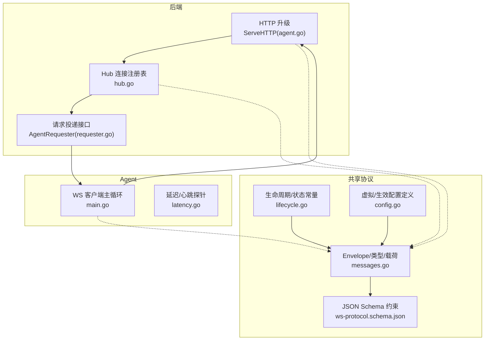
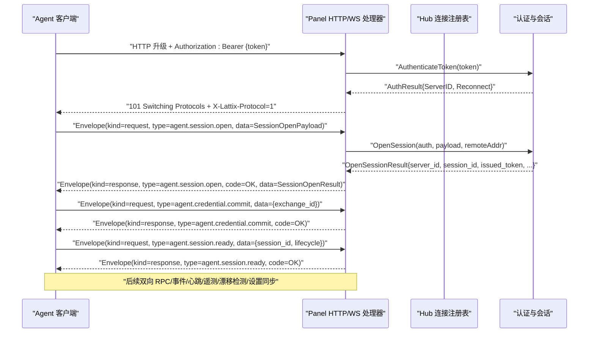
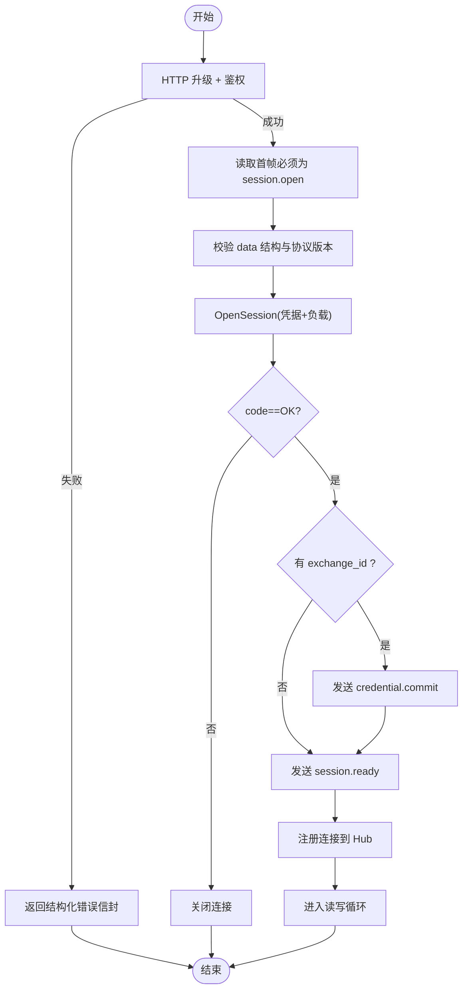
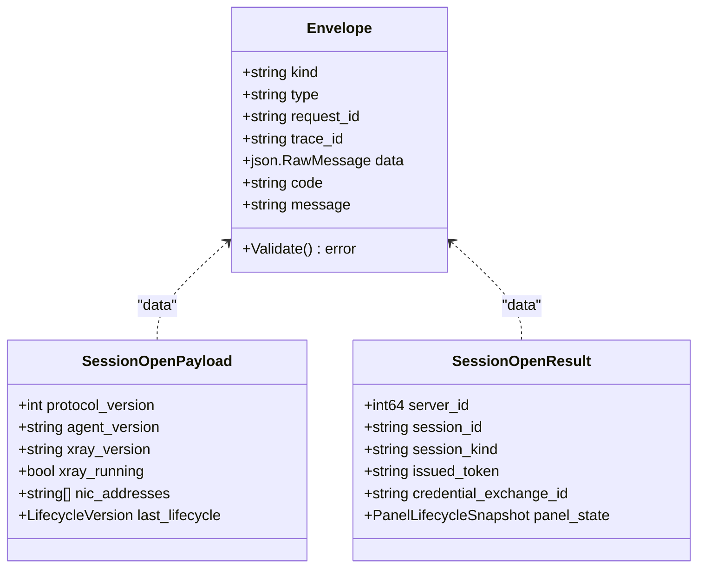
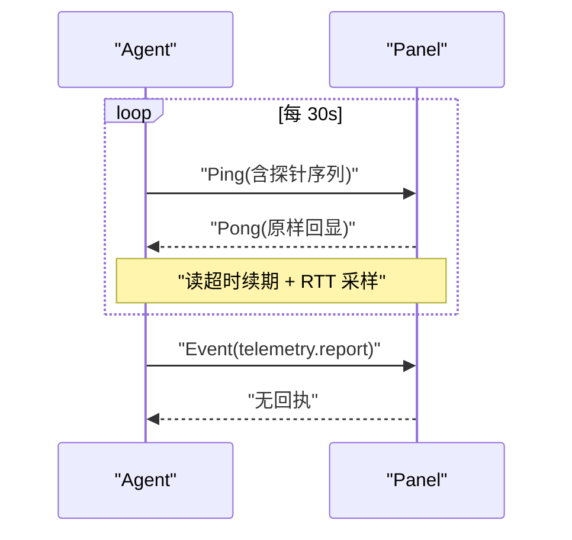
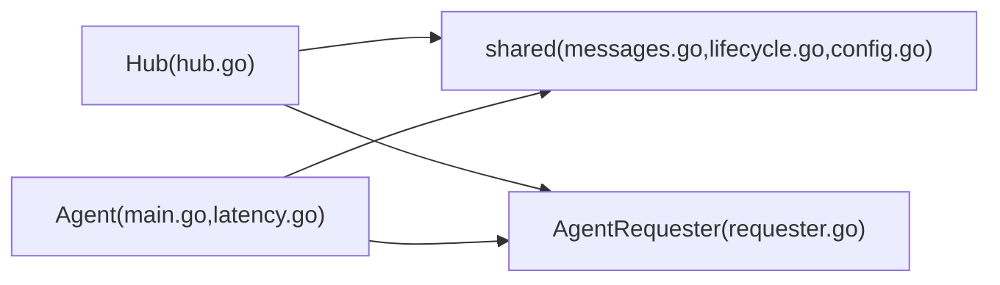

# WebSocket 协议

<cite>
**本文引用的文件**   
- [agent.go](file://src/backend/internal/ws/agent.go)
- [hub.go](file://src/backend/internal/ws/hub.go)
- [requester.go](file://src/backend/internal/ws/requester.go)
- [messages.go](file://src/shared/messages.go)
- [lifecycle.go](file://src/shared/lifecycle.go)
- [config.go](file://src/shared/config.go)
- [ws-protocol.schema.json](file://docs/ws-protocol.schema.json)
- [main.go](file://src/agent/cmd/agent/main.go)
- [latency.go](file://src/agent/cmd/agent/latency.go)
</cite>

## 目录
1. [简介](#简介)
2. [项目结构](#项目结构)
3. [核心组件](#核心组件)
4. [架构总览](#架构总览)
5. [详细组件分析](#详细组件分析)
6. [依赖关系分析](#依赖关系分析)
7. [性能与可靠性](#性能与可靠性)
8. [故障排查指南](#故障排查指南)
9. [结论](#结论)
10. [附录：消息规范与示例](#附录消息规范与示例)

## 简介
本文件为 Lattix-codex 的 Agent 与 Panel（后端）之间基于 WebSocket 的控制通道协议技术文档。内容覆盖连接建立、握手与认证、消息信封格式、实时通信模式（双向 RPC、事件订阅发布、心跳保活）、Agent 与后端的命令下发与状态上报、连接管理与错误处理最佳实践，以及集成所需的完整消息示例与流程说明。

## 项目结构
WebSocket 协议实现主要分布在以下模块：
- 后端 Hub 与 HTTP 升级处理器：负责 WS 握手、鉴权、会话打开、注册表管理、发送队列与写泵、生命周期同步等
- 共享协议类型与校验：统一信封 Envelope、RPC 码、消息类型、载荷结构、JSON Schema 约束
- Agent 客户端：主动拨号、首帧 session.open、凭证交换、session.ready、周期性心跳与遥测、配置漂移检测、设置同步拉取

**图示来源** 
- [agent.go:33-239](file://src/backend/internal/ws/agent.go#L33-L239)
- [hub.go:26-139](file://src/backend/internal/ws/hub.go#L26-L139)
- [requester.go:18-43](file://src/backend/internal/ws/requester.go#L18-L43)
- [messages.go:14-137](file://src/shared/messages.go#L14-L137)
- [lifecycle.go:5-86](file://src/shared/lifecycle.go#L5-L86)
- [config.go:170-206](file://src/shared/config.go#L170-L206)
- [ws-protocol.schema.json:1-356](file://docs/ws-protocol.schema.json#L1-L356)
- [main.go:141-386](file://src/agent/cmd/agent/main.go#L141-L386)
- [latency.go:12-55](file://src/agent/cmd/agent/latency.go#L12-L55)

**章节来源**
- [agent.go:33-239](file://src/backend/internal/ws/agent.go#L33-L239)
- [hub.go:26-139](file://src/backend/internal/ws/hub.go#L26-L139)
- [requester.go:18-43](file://src/backend/internal/ws/requester.go#L18-L43)
- [messages.go:14-137](file://src/shared/messages.go#L14-L137)
- [lifecycle.go:5-86](file://src/shared/lifecycle.go#L5-L86)
- [config.go:170-206](file://src/shared/config.go#L170-L206)
- [ws-protocol.schema.json:1-356](file://docs/ws-protocol.schema.json#L1-L356)
- [main.go:141-386](file://src/agent/cmd/agent/main.go#L141-L386)
- [latency.go:12-55](file://src/agent/cmd/agent/latency.go#L12-L55)

## 核心组件
- 后端 Hub：维护 Agent 连接映射、在线状态、发送缓冲与串行写出、生命周期同步、优雅停机（drain）与连接踢出
- 认证与会话：通过 HTTP Upgrade 阶段鉴权，随后完成 session.open → response → credential.commit → session.ready 四步握手
- 共享信封：统一的 kind/type/request_id/trace_id/data 结构，严格 JSON 校验与字段白名单
- Agent 客户端：长连接、Ping/Pong 保活、遥测上报、配置漂移检测、设置同步拉取、幂等回执

**章节来源**
- [hub.go:26-139](file://src/backend/internal/ws/hub.go#L26-L139)
- [agent.go:33-239](file://src/backend/internal/ws/agent.go#L33-L239)
- [messages.go:14-137](file://src/shared/messages.go#L14-L137)
- [main.go:141-386](file://src/agent/cmd/agent/main.go#L141-L386)

## 架构总览
Agent 作为客户端主动发起 WebSocket 连接到后端 /api/agent/ws。后端在 HTTP 层进行鉴权并升级为 WS，随后进入应用层握手与业务收发。所有控制面消息均使用统一信封，支持 request/response/event 三种语义。

**图示来源** 
- [agent.go:33-239](file://src/backend/internal/ws/agent.go#L33-L239)
- [requester.go:18-43](file://src/backend/internal/ws/requester.go#L18-L43)
- [messages.go:73-91](file://src/shared/messages.go#L73-L91)
- [lifecycle.go:56-86](file://src/shared/lifecycle.go#L56-L86)
- [main.go:168-261](file://src/agent/cmd/agent/main.go#L168-L261)

## 详细组件分析

### 连接建立与握手流程
- HTTP 升级前鉴权：从 Authorization 头提取 Bearer token，调用认证器验证；失败返回结构化响应信封
- 成功升级后设置读超时与 Ping 处理器：Agent 每 30s 发 Ping，Panel 原样回 Pong 并续期读超时
- 首帧必须是 agent.session.open，携带协议版本、Agent/Xray 版本、网卡地址、上次面板生命周期版本
- 成功后返回 SessionOpenResult，包含 server_id、session_id、issued_token（可选）、credential_exchange_id（可选）、panel_state
- 若存在 exchange_id，则执行 credential.commit；随后发送 session.ready 完成注册

**图示来源** 
- [agent.go:33-239](file://src/backend/internal/ws/agent.go#L33-L239)
- [main.go:168-261](file://src/agent/cmd/agent/main.go#L168-L261)
- [messages.go:73-91](file://src/shared/messages.go#L73-L91)
- [lifecycle.go:56-86](file://src/shared/lifecycle.go#L56-L86)

**章节来源**
- [agent.go:33-239](file://src/backend/internal/ws/agent.go#L33-L239)
- [main.go:168-261](file://src/agent/cmd/agent/main.go#L168-L261)

### 认证机制
- 传输层：Authorization: Bearer {token}
- 服务端：AuthenticateToken 校验 token，返回 ServerID 与是否重连标记
- 会话级：OpenSession 结合 payload 与远端 IP 创建会话，可能换发新 token
- 凭证交换：若返回 exchange_id，Agent 需提交 credential.commit 完成绑定确认

**章节来源**
- [agent.go:45-79](file://src/backend/internal/ws/agent.go#L45-L79)
- [requester.go:26-43](file://src/backend/internal/ws/requester.go#L26-L43)
- [main.go:208-251](file://src/agent/cmd/agent/main.go#L208-L251)

### 消息信封与类型
- 信封字段：kind、type、request_id、trace_id、data；response 额外包含 code、message
- 类型命名：domain.action 风格，如 agent.session.open、node.apply、telemetry.report 等
- 校验规则：JSON Schema 严格限制字段与取值范围；服务端 strictUnmarshal 禁止未知字段

**图示来源** 
- [messages.go:14-137](file://src/shared/messages.go#L14-L137)
- [lifecycle.go:56-86](file://src/shared/lifecycle.go#L56-L86)
- [ws-protocol.schema.json:106-179](file://docs/ws-protocol.schema.json#L106-L179)

**章节来源**
- [messages.go:14-137](file://src/shared/messages.go#L14-L137)
- [ws-protocol.schema.json:106-179](file://docs/ws-protocol.schema.json#L106-L179)

### 实时通信模式
- 双向 RPC：request/response 成对出现，沿用 request_id/trace_id/type
- 事件推送：event 无需回执，如 telemetry.report、agent.settings.changed
- 心跳保活：Agent 每 30s 发送 Ping，Panel 回 Pong 并续期读超时；任一方向无字节超过 pongTimeoutDefault（默认 90s）判定连接死亡
- 延迟探测：Agent 侧周期性 Ping 探针，统计中位数 RTT 随遥测上报

**图示来源** 
- [hub.go:19-23](file://src/backend/internal/ws/hub.go#L19-L23)
- [latency.go:12-55](file://src/agent/cmd/agent/latency.go#L12-L55)
- [main.go:264-314](file://src/agent/cmd/agent/main.go#L264-L314)

**章节来源**
- [hub.go:19-23](file://src/backend/internal/ws/hub.go#L19-L23)
- [latency.go:12-55](file://src/agent/cmd/agent/latency.go#L12-L55)
- [main.go:264-314](file://src/agent/cmd/agent/main.go#L264-L314)

### Agent 与后端的核心功能
- 节点管理：node.apply、node.remove
- 用户管理：user.add、user.remove
- 链跳配置：chain-hop.apply、chain-hop.remove
- 升级卸载：xray.upgrade、agent.upgrade、agent.uninstall
- 遥测与漂移：telemetry.report、config.drift
- 设置同步：agent.settings.sync（请求）、agent.settings.changed（事件），结果包含 changed/settings

**章节来源**
- [messages.go:73-91](file://src/shared/messages.go#L73-L91)
- [messages.go:139-313](file://src/shared/messages.go#L139-L313)
- [main.go:564-671](file://src/agent/cmd/agent/main.go#L564-L671)

### 连接管理与错误处理
- 连接注册表：Hub 维护 serverID→connection 映射，同一服务器仅保留最新连接
- 发送队列：每连接固定长度缓冲，写满视为慢连接直接断开，重连后由上层补发
- 优雅停机：BeginDrain 拒绝新工作并关闭所有连接（RFC 1012），Agent 走快速重启路径
- 生命周期同步：SyncLifecycle 向所有在线 Agent 广播生命周期变更并等待 ACK，超时返回缺失列表
- 错误分类：AUTH_INVALID_CREDENTIALS、SERVICE_UNAVAILABLE、UNSUPPORTED_ACTION、CONFLICT 等

**章节来源**
- [hub.go:111-139](file://src/backend/internal/ws/hub.go#L111-L139)
- [hub.go:156-173](file://src/backend/internal/ws/hub.go#L156-L173)
- [hub.go:322-378](file://src/backend/internal/ws/hub.go#L322-L378)
- [messages.go:54-70](file://src/shared/messages.go#L54-L70)

## 依赖关系分析
- 后端 Hub 依赖 shared.Envelope 与生命周期快照，提供 IsOnline/Send/SyncLifecycle 能力
- Agent 客户端依赖 shared 类型与 JSON Schema 约束，确保两端一致性
- 认证器 Authenticator 抽象了 token 校验与会话打开逻辑，便于替换实现

**图示来源** 
- [hub.go:26-139](file://src/backend/internal/ws/hub.go#L26-L139)
- [requester.go:18-43](file://src/backend/internal/ws/requester.go#L18-L43)
- [messages.go:14-137](file://src/shared/messages.go#L14-L137)
- [lifecycle.go:5-86](file://src/shared/lifecycle.go#L5-L86)
- [config.go:170-206](file://src/shared/config.go#L170-L206)
- [main.go:141-386](file://src/agent/cmd/agent/main.go#L141-L386)
- [latency.go:12-55](file://src/agent/cmd/agent/latency.go#L12-L55)

**章节来源**
- [hub.go:26-139](file://src/backend/internal/ws/hub.go#L26-L139)
- [requester.go:18-43](file://src/backend/internal/ws/requester.go#L18-L43)
- [messages.go:14-137](file://src/shared/messages.go#L14-L137)
- [lifecycle.go:5-86](file://src/shared/lifecycle.go#L5-L86)
- [config.go:170-206](file://src/shared/config.go#L170-L206)
- [main.go:141-386](file://src/agent/cmd/agent/main.go#L141-L386)
- [latency.go:12-55](file://src/agent/cmd/agent/latency.go#L12-L55)

## 性能与可靠性
- 读超时与心跳：默认 90s 无字节即断线；Agent 每 30s Ping 维持活跃
- 写超时：单次写操作 10s 超时，避免阻塞
- 发送缓冲：单连接 256 条，写满即断，重连后补发，保证背压可控
- 幂等性：遥测流量计数器为绝对值，丢帧可由下一帧补齐；命令回执沿用 request_id
- 优雅停机：BeginDrain 快速下线所有连接，Agent 按策略退避重试

[本节为通用指导，不直接分析具体文件]

## 故障排查指南
- 握手失败：检查 Authorization 头与 token 有效性；查看结构化错误信封中的 code/message
- 首帧错误：确保第一个应用帧为 agent.session.open，且 data 符合 schema
- 连接频繁断开：检查网络连通性与防火墙；关注 pongTimeout 与 Ping 间隔
- 命令未生效：核对 request_id/trace_id/type 匹配；确认 Hub 在线状态与 Send 返回值
- 设置不同步：观察 agent.settings.changed 事件与 settings.sync 往返；检查 applied_revision

**章节来源**
- [agent.go:264-274](file://src/backend/internal/ws/agent.go#L264-L274)
- [hub.go:111-139](file://src/backend/internal/ws/hub.go#L111-L139)
- [messages.go:112-137](file://src/shared/messages.go#L112-L137)
- [main.go:673-720](file://src/agent/cmd/agent/main.go#L673-L720)

## 结论
该 WebSocket 协议以统一信封为核心，结合严格的 JSON Schema 与明确的握手流程，实现了稳定可靠的 Agent-Panel 控制通道。通过 Ping/Pong 保活、发送缓冲与优雅停机、生命周期同步与幂等回执，保障了高可用与可观测性。遵循本文档的集成与实践建议，可实现高效的远程设备管理与运维自动化。

[本节为总结性内容，不直接分析具体文件]

## 附录：消息规范与示例

### 通用信封
- 必需字段：kind、type、request_id、trace_id、data
- response 额外字段：code、message
- 校验：strictUnmarshal 禁止未知字段；Validate 强制 request_id/trace_id 格式与 data 合法

**章节来源**
- [messages.go:14-137](file://src/shared/messages.go#L14-L137)
- [ws-protocol.schema.json:106-179](file://docs/ws-protocol.schema.json#L106-L179)

### 握手相关
- agent.session.open（请求）：protocol_version、agent_version、xray_version、xray_running、nic_addresses、last_lifecycle
- agent.session.open（响应）：server_id、session_id、session_kind、issued_token、credential_exchange_id、panel_state
- agent.credential.commit（请求）：exchange_id
- agent.session.ready（请求）：session_id、lifecycle

**章节来源**
- [ws-protocol.schema.json:136-214](file://docs/ws-protocol.schema.json#L136-L214)
- [lifecycle.go:56-86](file://src/shared/lifecycle.go#L56-L86)

### 业务命令与回执
- node.apply/remove、user.add/remove、chain-hop.apply/remove、xray.upgrade、agent.upgrade、agent.uninstall
- 回执：ApplyResultPayload（node_id/hop_id/kind/realized_config）

**章节来源**
- [messages.go:139-313](file://src/shared/messages.go#L139-L313)

### 事件与遥测
- telemetry.report（事件）：xray_instance_id、traffic[]（node_id/hop_id/user + up/down）
- config.drift（事件）：drifted
- agent.settings.changed（事件）：revision

**章节来源**
- [ws-protocol.schema.json:318-333](file://docs/ws-protocol.schema.json#L318-L333)
- [messages.go:195-238](file://src/shared/messages.go#L195-L238)

### 设置同步
- agent.settings.sync（请求）：panel_instance_id、applied_revision、last_apply_error
- agent.settings.sync（响应）：changed、settings（schema_version、panel、agent）

**章节来源**
- [ws-protocol.schema.json:256-296](file://docs/ws-protocol.schema.json#L256-L296)

### 集成要点
- 连接参数：X-Lattix-Protocol=1；Authorization: Bearer {token}
- 心跳：Agent 每 30s Ping；Panel 90s 无字节断线
- 错误码：AUTH_INVALID_CREDENTIALS、SERVICE_UNAVAILABLE、UNSUPPORTED_ACTION、CONFLICT、INTERNAL_ERROR 等
- 资源清理：BeginDrain 关闭全部连接；ForgetAgent/ClearAllAgents 清理内存状态

**章节来源**
- [agent.go:19-24](file://src/backend/internal/ws/agent.go#L19-L24)
- [hub.go:156-173](file://src/backend/internal/ws/hub.go#L156-L173)
- [messages.go:54-70](file://src/shared/messages.go#L54-L70)