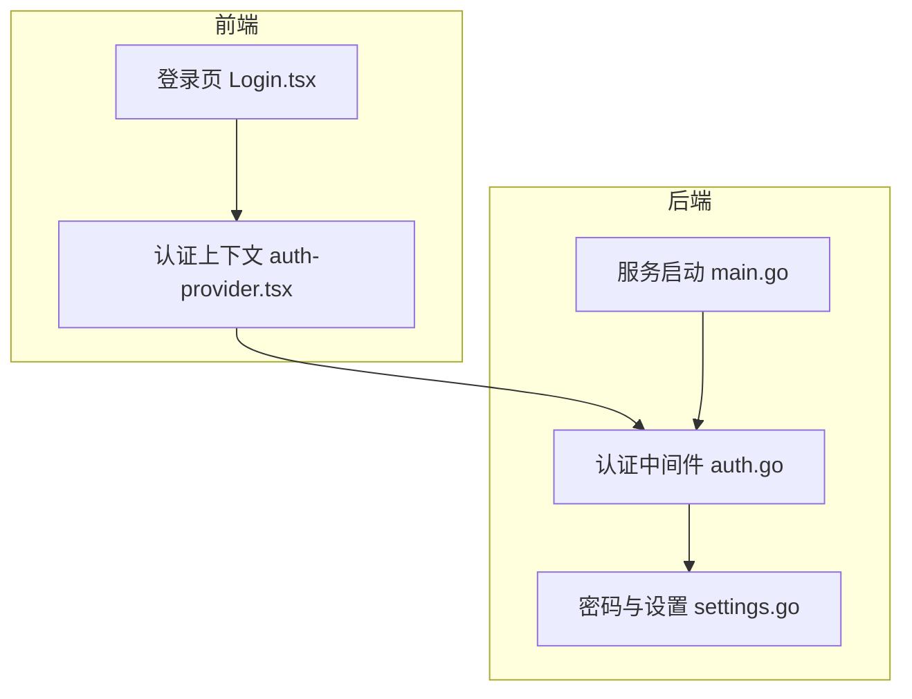
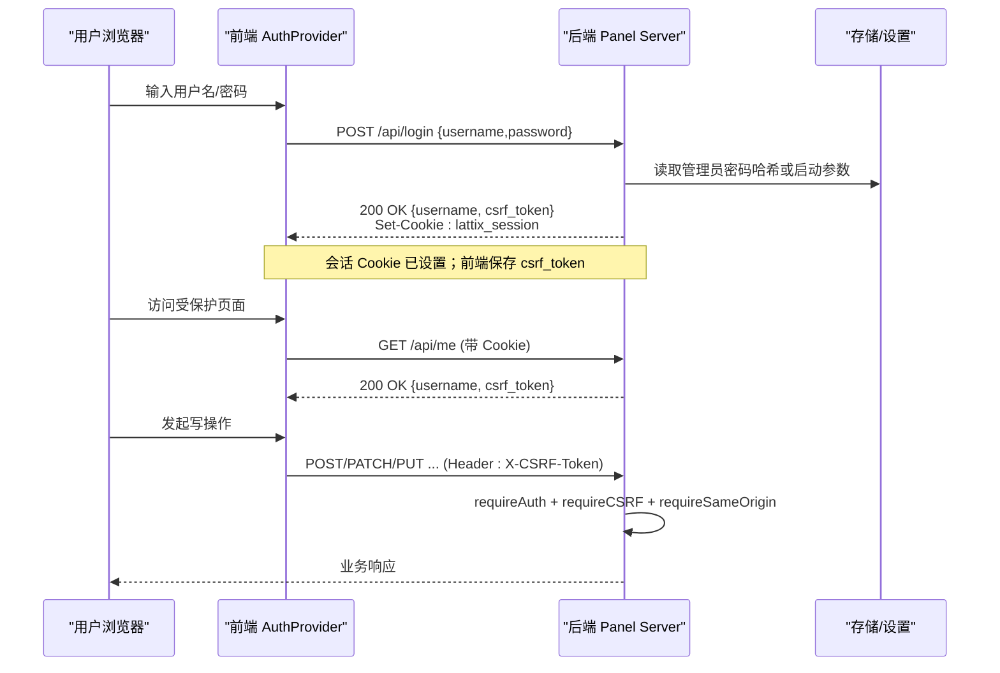
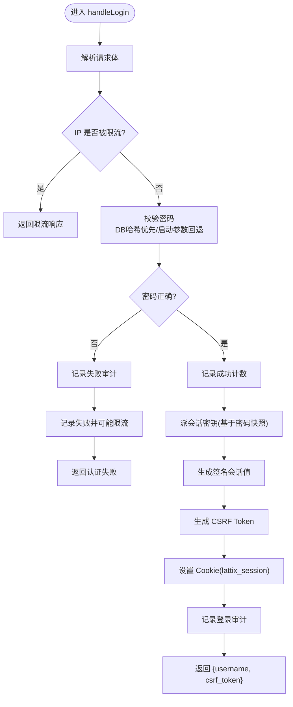
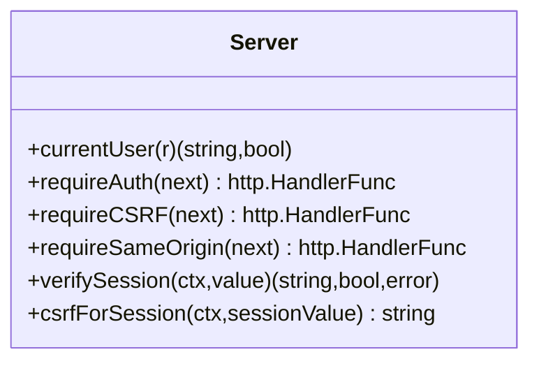
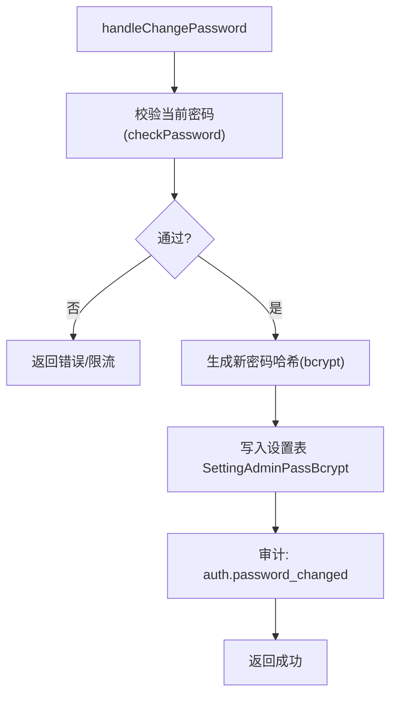
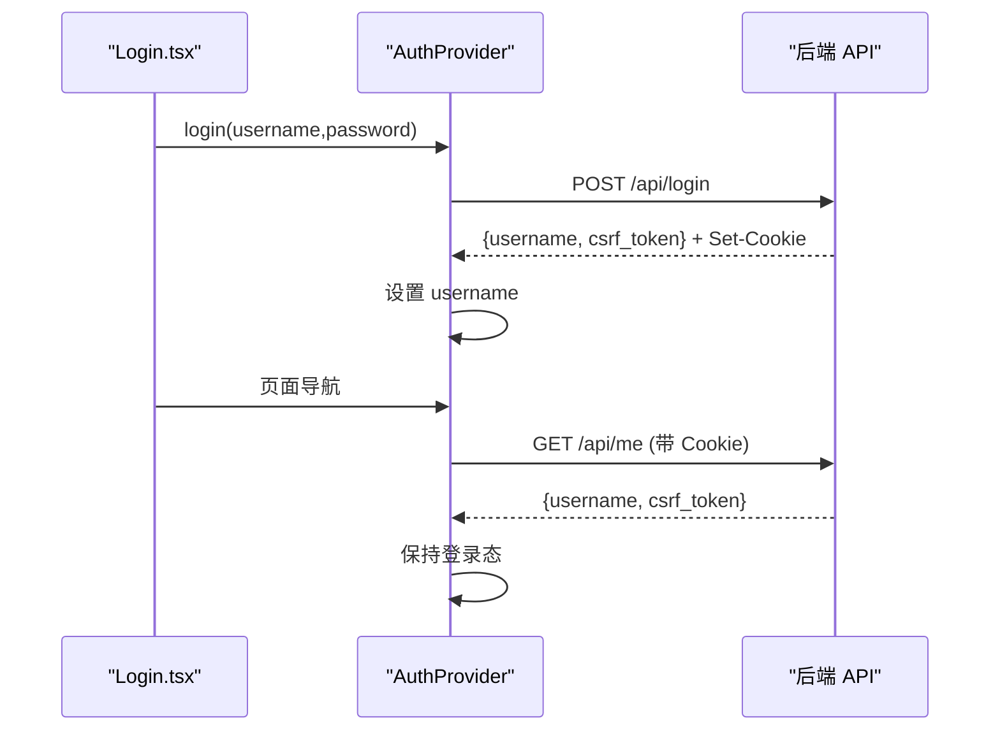
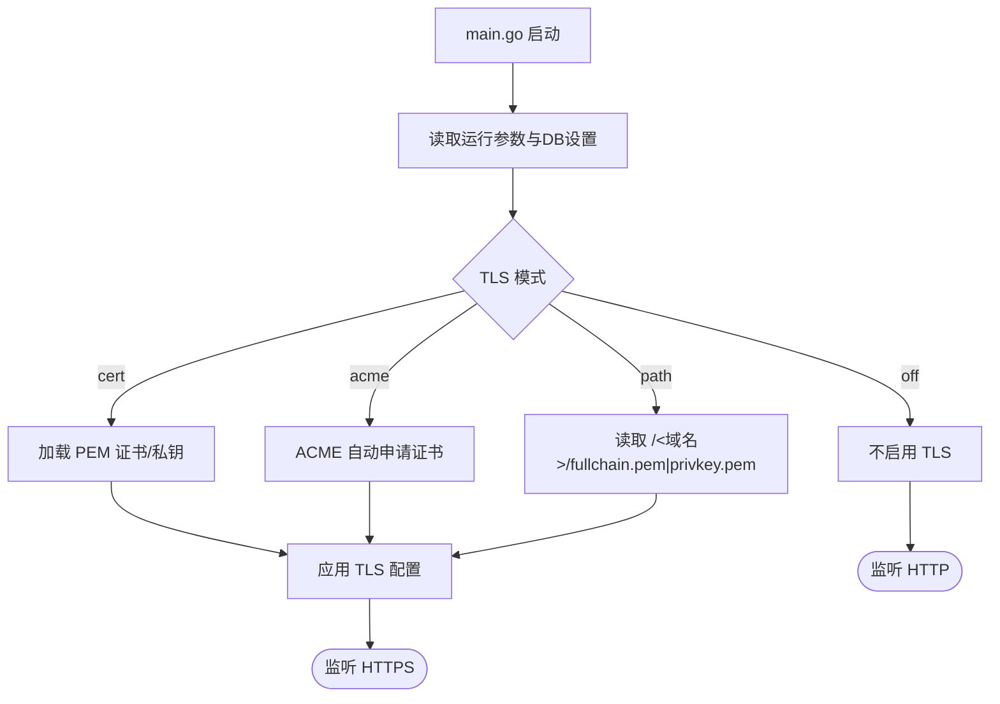
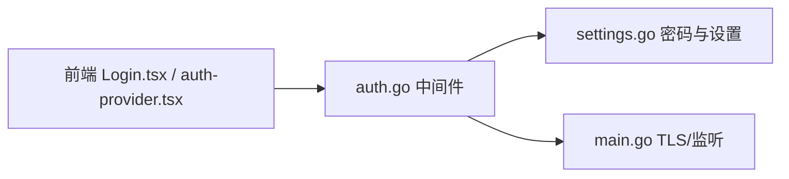

# 认证授权

<cite>
**本文引用的文件**   
- [src/backend/internal/panel/auth.go](file://src/backend/internal/panel/auth.go)
- [src/backend/internal/panel/settings.go](file://src/backend/internal/panel/settings.go)
- [src/backend/cmd/backend/main.go](file://src/backend/cmd/backend/main.go)
- [src/frontend/src/pages/Login.tsx](file://src/frontend/src/pages/Login.tsx)
- [src/frontend/src/lib/auth-provider.tsx](file://src/frontend/src/lib/auth-provider.tsx)
</cite>

## 目录
1. [简介](#简介)
2. [项目结构](#项目结构)
3. [核心组件](#核心组件)
4. [架构总览](#架构总览)
5. [详细组件分析](#详细组件分析)
6. [依赖关系分析](#依赖关系分析)
7. [性能考量](#性能考量)
8. [故障排查指南](#故障排查指南)
9. [结论](#结论)
10. [附录：安全配置与最佳实践](#附录安全配置与最佳实践)

## 简介
本文件面向 Lattix-codex 的认证授权系统，系统性阐述管理员登录、密码校验、会话管理、CSRF 防护、来源校验以及前端鉴权状态流转。文档同时给出流程图、时序图与类图，帮助读者快速理解实现细节与安全要点。

## 项目结构
与认证授权相关的关键代码集中在后端面板模块与前端认证上下文：
- 后端
  - 认证与会话：auth.go（登录、登出、会话签名与验证、CSRF、来源校验）
  - 密码与设置：settings.go（bcrypt 哈希、密码覆盖策略、会话密钥派生）
  - 服务启动：main.go（TLS 模式、ACME、证书热加载、监听参数）
- 前端
  - 登录页面：Login.tsx（表单提交、错误提示）
  - 认证上下文：auth-provider.tsx（登录态维护、未授权回调）

**图表来源** 
- [src/frontend/src/pages/Login.tsx](file://src/frontend/src/pages/Login.tsx)
- [src/frontend/src/lib/auth-provider.tsx](file://src/frontend/src/lib/auth-provider.tsx)
- [src/backend/cmd/backend/main.go](file://src/backend/cmd/backend/main.go)
- [src/backend/internal/panel/auth.go](file://src/backend/internal/panel/auth.go)
- [src/backend/internal/panel/settings.go](file://src/backend/internal/panel/settings.go)

**章节来源**
- [src/backend/internal/panel/auth.go](file://src/backend/internal/panel/auth.go)
- [src/backend/internal/panel/settings.go](file://src/backend/internal/panel/settings.go)
- [src/backend/cmd/backend/main.go](file://src/backend/cmd/backend/main.go)
- [src/frontend/src/pages/Login.tsx](file://src/frontend/src/pages/Login.tsx)
- [src/frontend/src/lib/auth-provider.tsx](file://src/frontend/src/lib/auth-provider.tsx)

## 核心组件
- 会话令牌（Cookie）
  - 名称：固定为“lattix_session”
  - 内容：base64url(用户名|过期时间戳).HMAC-SHA256(负载, 会话密钥)
  - 有效期：固定 7 天
  - 安全属性：HttpOnly、Secure（HTTPS/反代时）、SameSite=Lax、Path=/
- CSRF 令牌
  - 生成：HMAC-SHA256("csrf|" + 会话值, 会话密钥)，返回给前端作为 X-CSRF-Token
  - 校验：要求请求头携带相同 token，且来源必须同源并匹配 Scheme（HTTPS 下强制 https）
- 密码校验
  - 优先级：数据库中的 bcrypt 哈希 > 启动参数明文
  - 改密即失效：会话密钥由密码哈希派生，修改后旧会话全部失效
- 访问控制
  - requireAuth：校验会话 Cookie，更新进行中拒绝非白名单接口
  - requireCSRF：校验 X-CSRF-Token
  - requireSameOrigin：校验 Origin/Referer 与 Host 一致，HTTPS 下强制 https

**章节来源**
- [src/backend/internal/panel/auth.go](file://src/backend/internal/panel/auth.go)
- [src/backend/internal/panel/settings.go](file://src/backend/internal/panel/settings.go)

## 架构总览
下图展示从浏览器到后端的认证授权关键路径：登录、会话签发、CSRF 获取、后续受保护 API 调用。

**图表来源** 
- [src/frontend/src/lib/auth-provider.tsx](file://src/frontend/src/lib/auth-provider.tsx)
- [src/backend/internal/panel/auth.go](file://src/backend/internal/panel/auth.go)
- [src/backend/internal/panel/settings.go](file://src/backend/internal/panel/settings.go)

## 详细组件分析

### 登录流程与会话签发
- 入口：POST /api/login
- 步骤
  - 解析请求体，按 IP 进行速率限制
  - 校验密码（DB 哈希优先），失败记录审计并限流
  - 成功则基于当前密码快照派生会话密钥，生成签名会话值与 CSRF 令牌
  - 设置 Cookie（HttpOnly/Secure/SameSite/Lax），返回 username 与 csrf_token
- 关键点
  - 会话密钥随密码哈希变化而变化，改密即全部会话失效
  - 登录失败会触发审计事件与频率限制

**图表来源** 
- [src/backend/internal/panel/auth.go](file://src/backend/internal/panel/auth.go)
- [src/backend/internal/panel/settings.go](file://src/backend/internal/panel/settings.go)

**章节来源**
- [src/backend/internal/panel/auth.go](file://src/backend/internal/panel/auth.go)
- [src/backend/internal/panel/settings.go](file://src/backend/internal/panel/settings.go)

### 会话验证与鉴权中间件
- currentUser：从 Cookie 解析并验签会话，返回用户名与有效性
- requireAuth：无会话则返回未登录；若面板更新中，仅放行更新状态查询与 /api/auth/me
- requireCSRF：校验 X-CSRF-Token 与 Cookie 会话一致性
- requireSameOrigin：校验 Origin/Referer 与 Host 一致，HTTPS 下强制 https

**图表来源** 
- [src/backend/internal/panel/auth.go](file://src/backend/internal/panel/auth.go)

**章节来源**
- [src/backend/internal/panel/auth.go](file://src/backend/internal/panel/auth.go)

### 密码管理与密钥派生
- checkPassword：优先使用 DB 中的 bcrypt 哈希，否则比对启动参数
- authenticatePassword：返回校验结果与“密码快照”，用于会话签名一致性
- credentialKey：会话密钥派生源 = 密码哈希（DB）或启动参数明文
- handleChangePassword：校验当前密码后写入新哈希，审计变更

**图表来源** 
- [src/backend/internal/panel/settings.go](file://src/backend/internal/panel/settings.go)

**章节来源**
- [src/backend/internal/panel/settings.go](file://src/backend/internal/panel/settings.go)

### 前端登录态与 CSRF 协作
- Login.tsx：收集用户名/密码，调用 login()，成功后跳转首页
- auth-provider.tsx：初始化时调用 me() 探测登录态；login/logout 封装 API 调用；未授权回调清空用户名

**图表来源** 
- [src/frontend/src/pages/Login.tsx](file://src/frontend/src/pages/Login.tsx)
- [src/frontend/src/lib/auth-provider.tsx](file://src/frontend/src/lib/auth-provider.tsx)

**章节来源**
- [src/frontend/src/pages/Login.tsx](file://src/frontend/src/pages/Login.tsx)
- [src/frontend/src/lib/auth-provider.tsx](file://src/frontend/src/lib/auth-provider.tsx)

### TLS 与传输安全
- main.go 支持三种 TLS 模式：关闭(off)、自带证书(cert)、ACME自动(acme)、域名路径(path)
- path 模式支持外部 ACME 续期后热加载
- 运行时根据设置或启动参数决定实际生效模式，并在设置页显示是否需要重启

**图表来源** 
- [src/backend/cmd/backend/main.go](file://src/backend/cmd/backend/main.go)
- [src/backend/internal/panel/settings.go](file://src/backend/internal/panel/settings.go)

**章节来源**
- [src/backend/cmd/backend/main.go](file://src/backend/cmd/backend/main.go)
- [src/backend/internal/panel/settings.go](file://src/backend/internal/panel/settings.go)

## 依赖关系分析
- 认证中间件依赖
  - 会话密钥派生：settings.go 的 credentialKey
  - 密码校验：settings.go 的 authenticatePassword/checkPassword
  - 审计日志：统一审计记录登录/失败/密码变更等事件
- 前端依赖
  - 登录态探测：/api/me
  - 登录/登出：/api/login、/api/logout
  - 写操作需携带 X-CSRF-Token

**图表来源** 
- [src/frontend/src/pages/Login.tsx](file://src/frontend/src/pages/Login.tsx)
- [src/frontend/src/lib/auth-provider.tsx](file://src/frontend/src/lib/auth-provider.tsx)
- [src/backend/internal/panel/auth.go](file://src/backend/internal/panel/auth.go)
- [src/backend/internal/panel/settings.go](file://src/backend/internal/panel/settings.go)
- [src/backend/cmd/backend/main.go](file://src/backend/cmd/backend/main.go)

**章节来源**
- [src/backend/internal/panel/auth.go](file://src/backend/internal/panel/auth.go)
- [src/backend/internal/panel/settings.go](file://src/backend/internal/panel/settings.go)
- [src/backend/cmd/backend/main.go](file://src/backend/cmd/backend/main.go)
- [src/frontend/src/pages/Login.tsx](file://src/frontend/src/pages/Login.tsx)
- [src/frontend/src/lib/auth-provider.tsx](file://src/frontend/src/lib/auth-provider.tsx)

## 性能考量
- 密码哈希
  - 使用 bcrypt，存在 CPU 密集场景；内部通过并发槽位避免阻塞其他请求
  - 建议在高并发环境合理评估成本，必要时扩容或异步化
- 会话验证
  - HMAC 计算开销低，适合高频校验
- 速率限制
  - 登录失败与 bcrypt 忙时均有限流保护，防止暴力破解与资源耗尽

[本节为通用指导，无需特定文件引用]

## 故障排查指南
- 常见错误码与含义
  - 未登录或会话已过期：检查 Cookie 是否存在、是否 HttpOnly/Secure、是否跨域
  - CSRF token 无效：确认请求头 X-CSRF-Token 与服务器生成的值一致
  - 请求来源校验失败：检查 Origin/Referer 与 Host 是否一致，HTTPS 下是否为 https
  - 认证服务暂时不可用：bcrypt 繁忙或数据库读取异常，稍后重试
- 定位方法
  - 查看服务端审计日志（登录成功/失败、密码变更）
  - 检查 TLS 模式与证书路径是否正确
  - 核对前端是否保存并传递 csrf_token

**章节来源**
- [src/backend/internal/panel/auth.go](file://src/backend/internal/panel/auth.go)
- [src/backend/internal/panel/settings.go](file://src/backend/internal/panel/settings.go)

## 结论
Lattix-codex 的认证授权采用“管理员单账号 + 会话 Cookie + HMAC 签名 + CSRF + 来源校验”的组合方案，具备以下特点：
- 简单可靠：无需复杂权限模型，满足面板管理场景
- 安全性强：密码哈希优先、会话密钥随密码变化、严格来源校验与 CSRF 保护
- 可运维性高：支持多种 TLS 模式与热加载，提供审计与限流

[本节为总结，无需特定文件引用]

## 附录：安全配置与最佳实践
- 密码策略
  - 使用 bcrypt 哈希存储，最小长度 8 位
  - 修改密码后立即使所有会话失效，强制重新登录
- 会话安全
  - Cookie 设置 HttpOnly、Secure（HTTPS）、SameSite=Lax、Path=/
  - 会话有效期 7 天，建议结合网关层做更严格的超时与刷新策略
- CSRF 防护
  - 所有写操作必须携带 X-CSRF-Token，且与 Cookie 会话绑定
  - 禁止将敏感信息放入 URL 或 Referer
- 来源校验
  - 严格校验 Origin/Referer 与 Host 一致，HTTPS 下强制 https
- 传输安全
  - 生产环境务必启用 TLS（cert/acme/path），避免明文传输
  - 定期轮换证书，确保 ACME 自动续期正常
- 审计与监控
  - 关注登录失败、密码变更、设置变更等审计事件
  - 对高频失败与 bcrypt 忙告警进行监控

[本节为通用指导，无需特定文件引用]