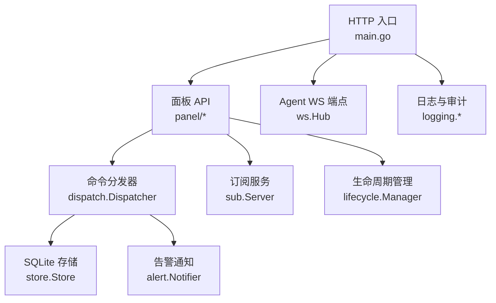
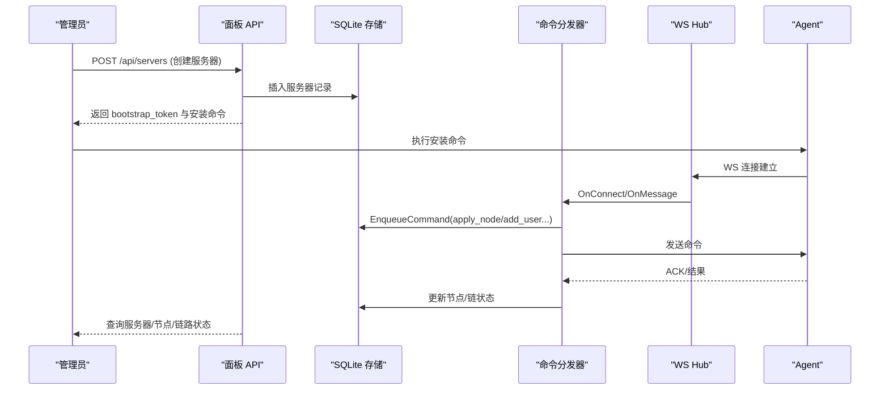
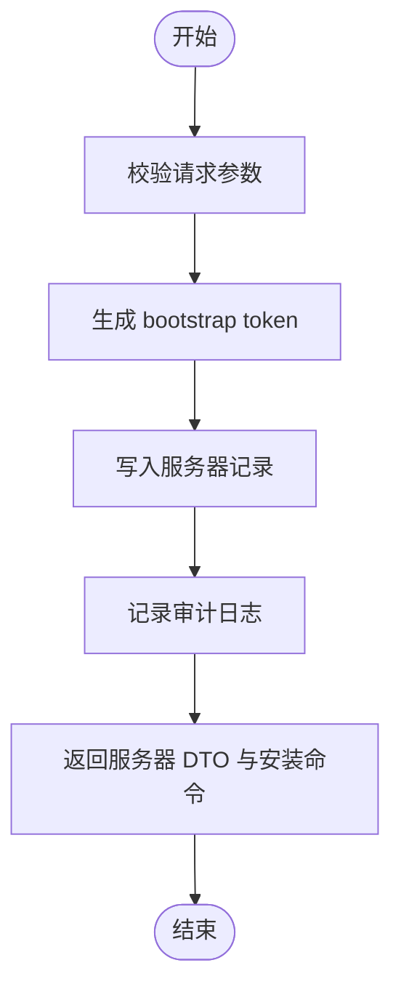
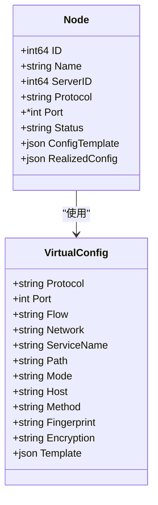
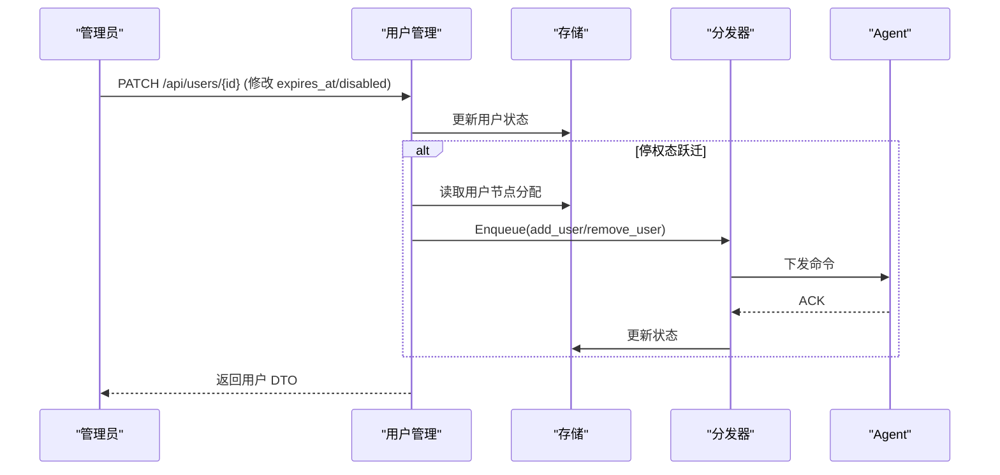
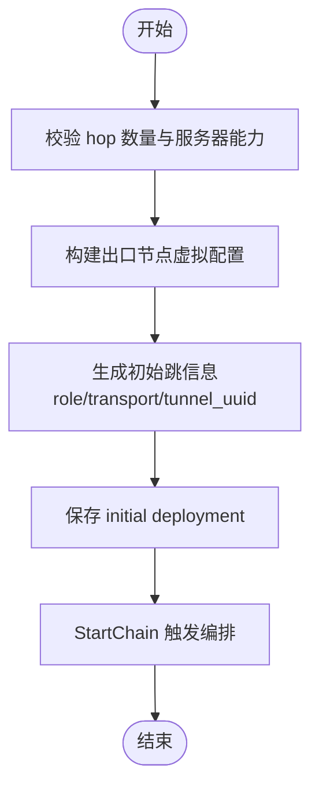
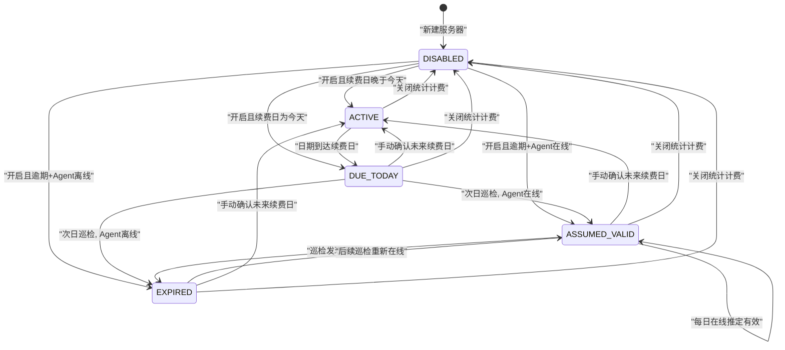
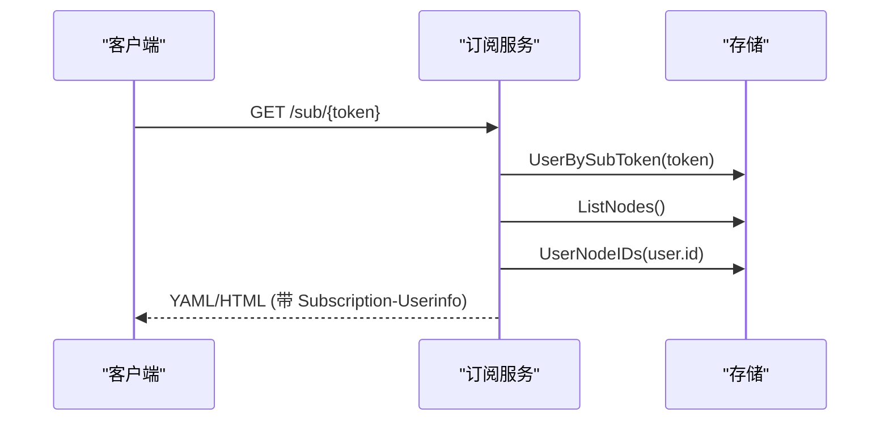
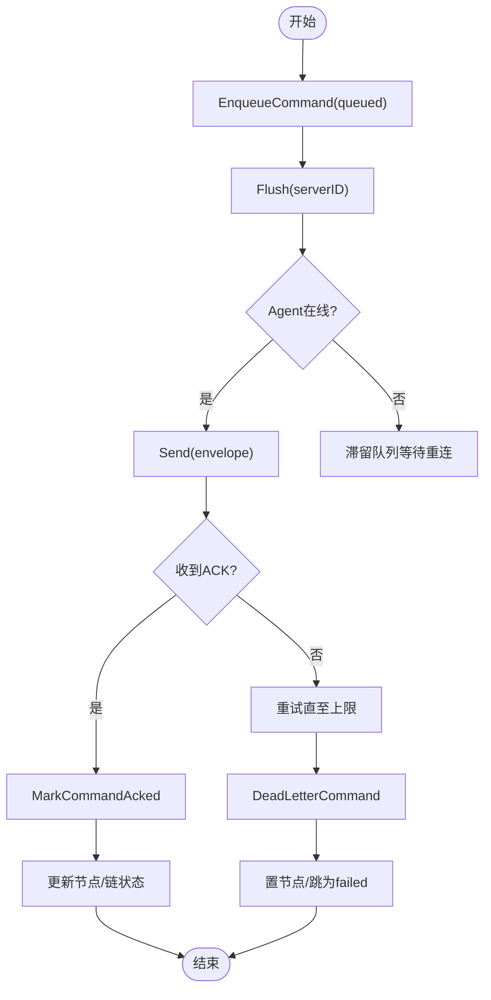
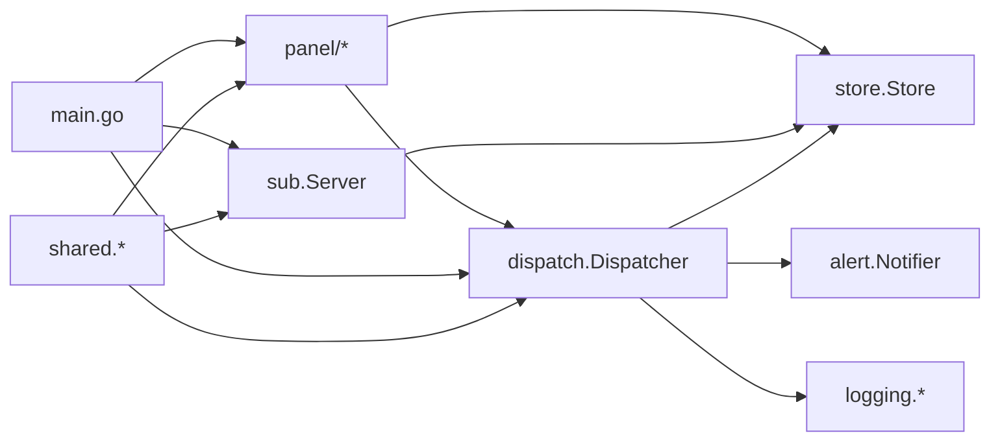

# 业务逻辑

<cite>
**本文引用的文件**   
- [main.go](file://src/backend/cmd/backend/main.go)
- [servers.go](file://src/backend/internal/panel/servers.go)
- [nodes.go](file://src/backend/internal/panel/nodes.go)
- [users.go](file://src/backend/internal/panel/users.go)
- [chains.go](file://src/backend/internal/panel/chains.go)
- [billing.go](file://src/backend/internal/panel/billing.go)
- [store.go](file://src/backend/internal/store/store.go)
- [dispatcher.go](file://src/backend/internal/dispatch/dispatcher.go)
- [sub.go](file://src/backend/internal/sub/sub.go)
- [manager.go](file://src/backend/internal/lifecycle/manager.go)
- [messages.go](file://src/shared/messages.go)
- [chain.go](file://src/shared/chain.go)
- [billing-scheduler-design.md](file://docs/billing-scheduler-design.md)
- [chain-revisions-traffic-design.md](file://docs/chain-revisions-traffic-design.md)
</cite>

## 目录
1. [简介](#简介)
2. [项目结构](#项目结构)
3. [核心组件](#核心组件)
4. [架构总览](#架构总览)
5. [详细组件分析](#详细组件分析)
6. [依赖关系分析](#依赖关系分析)
7. [性能考量](#性能考量)
8. [故障排查指南](#故障排查指南)
9. [结论](#结论)
10. [附录](#附录)

## 简介
本技术文档聚焦 Lattix-codex 后端服务的业务逻辑层，系统性阐述服务器管理、节点管理、用户管理、链路编排与计费系统五大核心域。内容覆盖：
- 服务器添加、配置管理、状态监控、连接管理
- 节点创建、协议配置、端口分配、健康检查
- 用户注册、权限控制、订阅生成、配额管理
- 直连链路、中转链路、负载均衡、故障转移等编排特性
- 订阅周期、流量统计、账单生成等业务能力

文档以代码级分析与可视化为主，辅以设计文档说明，帮助开发者快速理解并扩展业务逻辑。

## 项目结构
后端服务由 HTTP API、WebSocket 控制通道、SQLite 存储、调度与生命周期管理等模块组成。入口 main 负责启动 HTTP/WS 服务、TLS 配置、路由注册、后台任务与优雅关停；面板业务逻辑集中在 panel 包；命令分发与 Agent 通信在 dispatch 包；持久化在 store 包；订阅服务在 sub 包；共享协议类型在 shared 包。

图表来源
- [main.go:70-120](file://src/backend/cmd/backend/main.go#L70-L120)
- [main.go:327-382](file://src/backend/cmd/backend/main.go#L327-L382)
- [dispatcher.go:24-48](file://src/backend/internal/dispatch/dispatcher.go#L24-L48)
- [store.go:358-389](file://src/backend/internal/store/store.go#L358-L389)
- [sub.go:18-36](file://src/backend/internal/sub/sub.go#L18-L36)
- [manager.go:18-28](file://src/backend/internal/lifecycle/manager.go#L18-L28)

章节来源
- [main.go:70-120](file://src/backend/cmd/backend/main.go#L70-L120)
- [store.go:358-389](file://src/backend/internal/store/store.go#L358-L389)

## 核心组件
- 服务器管理（panel/servers.go）：提供服务器增删改查、安装引导、版本升级、漂移修复、NAT 端口段校验等。
- 节点管理（panel/nodes.go）：支持多协议节点创建、自动端口分配、虚拟配置模板下发、重试与删除。
- 用户管理（panel/users.go）：用户注册、到期与停用控制、节点分配差量扇出、订阅链接生成。
- 链路编排（panel/chains.go）：直连/中转链路的创建与编辑、Revision 发布、跳状态与流量统计、强制发布与重试。
- 计费系统（panel/billing.go + docs/billing-scheduler-design.md）：服务商、费用、汇率、续费巡检、流量计划与周期重置。
- 命令分发（dispatch/dispatcher.go）：命令入队、离线排队、ACK 回执、死信处理、遥测与漂移上报。
- 订阅服务（sub/sub.go）：mihomo YAML 落地页与订阅链接集合，按用户授权输出可用代理项。
- 存储（store/store.go）：SQLite Schema、备份、并发安全与权限加固。
- 生命周期（lifecycle/manager.go）：面板状态机与重试策略。

章节来源
- [servers.go:165-322](file://src/backend/internal/panel/servers.go#L165-L322)
- [nodes.go:196-250](file://src/backend/internal/panel/nodes.go#L196-L250)
- [users.go:82-156](file://src/backend/internal/panel/users.go#L82-L156)
- [chains.go:199-383](file://src/backend/internal/panel/chains.go#L199-L383)
- [billing.go:158-178](file://src/backend/internal/panel/billing.go#L158-L178)
- [dispatcher.go:171-241](file://src/backend/internal/dispatch/dispatcher.go#L171-L241)
- [sub.go:147-190](file://src/backend/internal/sub/sub.go#L147-L190)
- [store.go:18-356](file://src/backend/internal/store/store.go#L18-L356)
- [manager.go:36-51](file://src/backend/internal/lifecycle/manager.go#L36-L51)

## 架构总览
后端通过 HTTP 暴露面板 API，通过 WebSocket 维护与 Agent 的控制通道。Panel 将变更写入 store，并通过 dispatcher 向在线 Agent 投递命令；Agent 周期性上报遥测与漂移事件。订阅服务根据用户授权与已发布 revision 生成 mihomo 配置。

图表来源
- [main.go:374-382](file://src/backend/cmd/backend/main.go#L374-L382)
- [dispatcher.go:51-67](file://src/backend/internal/dispatch/dispatcher.go#L51-L67)
- [dispatcher.go:412-438](file://src/backend/internal/dispatch/dispatcher.go#L412-L438)
- [servers.go:208-322](file://src/backend/internal/panel/servers.go#L208-L322)

## 详细组件分析

### 服务器管理
- 功能要点
  - 列表与详情：聚合 metrics、billing、traffic_plan、provider 信息。
  - 创建：生成一次性 bootstrap token，落库后返回安装命令；支持 NAT 端口段与地理信息。
  - 更新：别名、地址、端口段收窄校验、地理信息、计费与流量计划。
  - 升级：xray/agent 版本升级命令下发，离线留队列补发。
  - 修复：重放 active 节点的 apply_node 以恢复配置漂移。
  - 删除：在线先下发 uninstall，再级联删除；离线仅删除记录。
- 关键流程
  - 创建服务器：参数校验 → 生成凭证 → 落库 → 审计 → 返回 DTO 与安装命令。
  - 端口段收窄：校验存量节点 realized 端口与链跳 forward/portal 端口不越界。
  - 升级 xray/agent：构造 payload → Enqueue → 审计 → 返回 command_id。
  - 修复：遍历 active 节点 → enqueueApply → 审计 → 返回 reapplied 计数。
  - 删除：查找引用链 → 失效修订 → 下发 remove_chain_hop → 删除记录。

图表来源
- [servers.go:208-322](file://src/backend/internal/panel/servers.go#L208-L322)
- [servers.go:538-573](file://src/backend/internal/panel/servers.go#L538-L573)
- [servers.go:587-626](file://src/backend/internal/panel/servers.go#L587-L626)
- [servers.go:674-720](file://src/backend/internal/panel/servers.go#L674-L720)
- [servers.go:734-800](file://src/backend/internal/panel/servers.go#L734-L800)

章节来源
- [servers.go:165-322](file://src/backend/internal/panel/servers.go#L165-L322)
- [servers.go:538-573](file://src/backend/internal/panel/servers.go#L538-L573)
- [servers.go:587-626](file://src/backend/internal/panel/servers.go#L587-L626)
- [servers.go:674-720](file://src/backend/internal/panel/servers.go#L674-L720)
- [servers.go:734-800](file://src/backend/internal/panel/servers.go#L734-L800)

### 节点管理
- 功能要点
  - 列表：聚合节点流量合计。
  - 创建：协议向导（vless/vmess/trojan/shadowsocks/dokodemo），自动端口或指定端口（受限 NAT 段内校验），生成虚拟配置模板并下发 apply_node。
  - 重试：failed 节点重新下发 apply_node。
  - 删除：下发 remove_node 后删除记录。
- 关键流程
  - normalize：填充默认值与协议组合校验（Reality 网络、fingerprint、grpc/xhttp 选项）。
  - buildVirtualConfig：按协议构造 inbound 模板与 streamSettings（reality）。
  - enqueueApply：设置 applying 状态 → 获取用户 UUID 列表 → 构造 ApplyNodePayload（含 dest 白名单与 port_candidates）→ Enqueue。

图表来源
- [nodes.go:21-51](file://src/backend/internal/panel/nodes.go#L21-L51)
- [nodes.go:393-462](file://src/backend/internal/panel/nodes.go#L393-L462)

章节来源
- [nodes.go:53-74](file://src/backend/internal/panel/nodes.go#L53-L74)
- [nodes.go:101-194](file://src/backend/internal/panel/nodes.go#L101-L194)
- [nodes.go:196-250](file://src/backend/internal/panel/nodes.go#L196-L250)
- [nodes.go:328-369](file://src/backend/internal/panel/nodes.go#L328-L369)
- [nodes.go:371-388](file://src/backend/internal/panel/nodes.go#L371-L388)
- [nodes.go:393-462](file://src/backend/internal/panel/nodes.go#L393-L462)

### 用户管理
- 功能要点
  - 列表：聚合用户流量与节点分配。
  - 创建：生成 UUID 与 sub_token，可选预选节点（差量扇出 add_user）。
  - 更新：有效期与停用开关，停权态跃迁触发 remove_user/add_user 扇出。
  - 节点分配：整体替换 user_nodes，差量扇出。
  - 删除：扇出 remove_user 后删除记录。
- 关键流程
  - fanoutUserDiff：按服务器分组节点的用户条目参数（排除 dokodemo），分别 Enqueue add_user/remove_user。
  - fanoutRemoveUser：向有用户节点的服务器下发 remove_user（无节点则跳过）。

图表来源
- [users.go:170-278](file://src/backend/internal/panel/users.go#L170-L278)
- [users.go:347-379](file://src/backend/internal/panel/users.go#L347-L379)
- [users.go:435-461](file://src/backend/internal/panel/users.go#L435-L461)

章节来源
- [users.go:50-76](file://src/backend/internal/panel/users.go#L50-L76)
- [users.go:82-156](file://src/backend/internal/panel/users.go#L82-L156)
- [users.go:170-278](file://src/backend/internal/panel/users.go#L170-L278)
- [users.go:287-345](file://src/backend/internal/panel/users.go#L287-L345)
- [users.go:347-379](file://src/backend/internal/panel/users.go#L347-L379)
- [users.go:435-461](file://src/backend/internal/panel/users.go#L435-L461)

### 链路编排
- 功能要点
  - 创建/编辑：1～4 跳链路，出口节点协议表单复用节点创建；自动选择内部传输（direct/encrypted/reverse）。
  - Revision：不可变目标快照，make-before-break 部署顺序，强制发布与重试。
  - 状态：active/degraded/failed/waiting_for_agent/cleanup_pending 等。
  - 流量：原始与有效流量累计，倍率分段，日/月统计与重置。
- 关键流程
  - handleCreateChain：构图校验 → 落库 initial deployment → StartChain。
  - handleEditChain：计算 desired snapshot → PlanRevision → 写入 tasks → ReplaceWorkingChainTopology → StartChain。
  - transportForServers：根据下游入站能力与明文协议选择 direct/encrypted/reverse。

图表来源
- [chains.go:199-383](file://src/backend/internal/panel/chains.go#L199-L383)
- [chains.go:391-584](file://src/backend/internal/panel/chains.go#L391-L584)
- [chains.go:618-626](file://src/backend/internal/panel/chains.go#L618-L626)

章节来源
- [chains.go:154-171](file://src/backend/internal/panel/chains.go#L154-L171)
- [chains.go:199-383](file://src/backend/internal/panel/chains.go#L199-L383)
- [chains.go:391-584](file://src/backend/internal/panel/chains.go#L391-L584)
- [chains.go:618-626](file://src/backend/internal/panel/chains.go#L618-L626)
- [chain-revisions-traffic-design.md:1-173](file://docs/chain-revisions-traffic-design.md#L1-L173)

### 计费系统
- 功能要点
  - 服务商：名称唯一、官网 URL 校验。
  - 费用：amount_minor + currency，区间周期 interval_count/unit，续费日 next_renewal_on。
  - 巡检：每日定时任务计算状态（disabled/active/due_today/assumed_valid/expired）。
  - 汇率：公共源（Frankfurter）与自定义锚点，展示原价与折算价。
  - 流量计划：quota_bytes/accounting_mode/reset_anchor_on/reset_count/reset_unit，周期起止与使用量。
- 关键流程
  - inspectBilling：扫描可巡检记录 → 计算 status → Upsert。
  - enrichServerBilling：聚合 provider、public/custom converted cost、traffic plan 周期与用量。
  - saveServerPlans：Upsert billing 与 traffic plan，保留 tracking_started_on。

图表来源
- [billing-scheduler-design.md:28-51](file://docs/billing-scheduler-design.md#L28-L51)
- [billing.go:158-178](file://src/backend/internal/panel/billing.go#L158-L178)
- [billing.go:354-389](file://src/backend/internal/panel/billing.go#L354-L389)
- [billing.go:399-426](file://src/backend/internal/panel/billing.go#L399-L426)

章节来源
- [billing.go:193-277](file://src/backend/internal/panel/billing.go#L193-L277)
- [billing.go:158-178](file://src/backend/internal/panel/billing.go#L158-L178)
- [billing.go:354-389](file://src/backend/internal/panel/billing.go#L354-L389)
- [billing.go:399-426](file://src/backend/internal/panel/billing.go#L399-L426)
- [billing-scheduler-design.md:1-64](file://docs/billing-scheduler-design.md#L1-L64)

### 订阅服务
- 功能要点
  - GET /sub/{token}：mihomo YAML 或浏览器落地页 HTML。
  - 用户维度：按 user_nodes 授权，过滤 active 节点与 published chain 出口。
  - 头部：Subscription-Userinfo（upload/download/expire）、Profile-Update-Interval=24h。
  - 链条目：server/port 取入口公网侧（端口段换算），其余字段取出口 realized_config。
- 关键流程
  - assignedActiveNodes：解析 token → 列出 nodes → 过滤 assigned 且 active → 返回 user 与 nodes。
  - subscriptionItems：合并单机节点与链条目（排除 dokodemo 与未分配出口）。
  - buildProxy：按协议构造代理项（vless/vmess/trojan/ss/socks/http），填充 reality 选项。

图表来源
- [sub.go:147-190](file://src/backend/internal/sub/sub.go#L147-L190)
- [sub.go:205-247](file://src/backend/internal/sub/sub.go#L205-L247)
- [sub.go:301-381](file://src/backend/internal/sub/sub.go#L301-L381)

章节来源
- [sub.go:18-36](file://src/backend/internal/sub/sub.go#L18-L36)
- [sub.go:147-190](file://src/backend/internal/sub/sub.go#L147-L190)
- [sub.go:205-247](file://src/backend/internal/sub/sub.go#L205-L247)
- [sub.go:301-381](file://src/backend/internal/sub/sub.go#L301-L381)

### 命令分发与连接管理
- 功能要点
  - Enqueue：写入 commands 表（queued），尽力 Flush 投递。
  - Flush：按服务器并发锁串行投递，离线滞留；超过最大尝试次数标记 dead-letter。
  - HandleMessage：响应回写命令状态、节点状态机、遥测与漂移上报。
  - OpenSession：bootstrap token 换长期凭证，学习公网地址与 NIC 候选。
- 关键流程
  - Dead-letter：apply_node/apply_chain_hop 死信 → 置 failed → 链 failed 定位到跳。
  - Telemetry：主机指标与流量绝对计数器增量持久化。
  - DriftReport：配置漂移状态落库与告警。

图表来源
- [dispatcher.go:51-67](file://src/backend/internal/dispatch/dispatcher.go#L51-L67)
- [dispatcher.go:171-241](file://src/backend/internal/dispatch/dispatcher.go#L171-L241)
- [dispatcher.go:625-730](file://src/backend/internal/dispatch/dispatcher.go#L625-L730)
- [dispatcher.go:553-592](file://src/backend/internal/dispatch/dispatcher.go#L553-L592)
- [dispatcher.go:594-623](file://src/backend/internal/dispatch/dispatcher.go#L594-L623)

章节来源
- [dispatcher.go:24-48](file://src/backend/internal/dispatch/dispatcher.go#L24-L48)
- [dispatcher.go:51-67](file://src/backend/internal/dispatch/dispatcher.go#L51-L67)
- [dispatcher.go:171-241](file://src/backend/internal/dispatch/dispatcher.go#L171-L241)
- [dispatcher.go:625-730](file://src/backend/internal/dispatch/dispatcher.go#L625-L730)
- [dispatcher.go:553-592](file://src/backend/internal/dispatch/dispatcher.go#L553-L592)
- [dispatcher.go:594-623](file://src/backend/internal/dispatch/dispatcher.go#L594-L623)

## 依赖关系分析
- 组件耦合
  - panel.* 依赖 store 与 dispatch；sub 依赖 store；main 组装所有模块。
  - dispatch 依赖 store、ws、alert、logging；shared 定义协议类型供两端共用。
- 外部依赖
  - SQLite（modernc.org/sqlite）单连接 + busy_timeout；ACME 自动证书；bcrypt 密码哈希。
- 潜在循环依赖
  - panel → dispatch → store；无循环。
- 接口契约
  - shared.Envelope/Type/*Payload 保证 WS 消息一致性；store.Schema 定义数据模型。

图表来源
- [main.go:327-382](file://src/backend/cmd/backend/main.go#L327-L382)
- [dispatcher.go:24-48](file://src/backend/internal/dispatch/dispatcher.go#L24-L48)
- [store.go:358-389](file://src/backend/internal/store/store.go#L358-L389)
- [messages.go:13-71](file://src/shared/messages.go#L13-L71)

章节来源
- [main.go:327-382](file://src/backend/cmd/backend/main.go#L327-L382)
- [dispatcher.go:24-48](file://src/backend/internal/dispatch/dispatcher.go#L24-L48)
- [store.go:358-389](file://src/backend/internal/store/store.go#L358-L389)
- [messages.go:13-71](file://src/shared/messages.go#L13-L71)

## 性能考量
- SQLite 单连接与 busy_timeout 避免并发写冲突；备份使用 VACUUM INTO 原子导出。
- 命令分发按服务器粒度加锁，避免重复投递；死信阈值防止无限重试。
- 遥测与流量采用绝对计数器增量，丢帧补差，减少高频写入压力。
- TLS 热加载（域名路径模式）免重启续期；ACME 自动证书简化运维。
- 订阅服务仅查询必要数据，失败不阻断响应。

[本节为通用指导，无需特定文件引用]

## 故障排查指南
- 节点 failed 与链 degraded
  - 检查命令死信与回执错误；查看节点 realized_config 与漂移报告。
  - 链路状态由 Agent 在线与跳状态推导；全部恢复后自动 active。
- 订阅为空或异常
  - 确认用户授权节点与出口节点分配；检查 realized_config 是否完整。
- 计费状态异常
  - 巡检任务是否执行；续费日与 Agent 在线状态影响 ASSUMED_VALID/EXPIRED。
- 连接问题
  - WS 握手与认证；bootstrap token 换长期凭证流程；版本不一致阻止命令投递。

章节来源
- [dispatcher.go:625-730](file://src/backend/internal/dispatch/dispatcher.go#L625-L730)
- [dispatcher.go:594-623](file://src/backend/internal/dispatch/dispatcher.go#L594-L623)
- [sub.go:147-190](file://src/backend/internal/sub/sub.go#L147-L190)
- [billing.go:158-178](file://src/backend/internal/panel/billing.go#L158-L178)

## 结论
Lattix-codex 后端以清晰的模块化设计与稳健的命令分发机制，实现了服务器、节点、用户、链路与计费的完整业务闭环。通过 Revision 编排、绝对流量计数与订阅服务，既保证了数据面稳定，又提供了灵活的运营能力。开发者可基于本文档快速定位实现细节，按需扩展协议、编排策略与计费规则。

[本节为总结性内容，无需特定文件引用]

## 附录
- 设计文档参考
  - 计费与调度：[billing-scheduler-design.md](file://docs/billing-scheduler-design.md)
  - 链路 Revision 与流量：[chain-revisions-traffic-design.md](file://docs/chain-revisions-traffic-design.md)
- 关键数据结构
  - 共享协议与载荷：[messages.go](file://src/shared/messages.go)
  - 链跳配置件类型：[chain.go](file://src/shared/chain.go)
  - 存储 Schema：[store.go](file://src/backend/internal/store/store.go)

[本节为补充信息，无需特定文件引用]