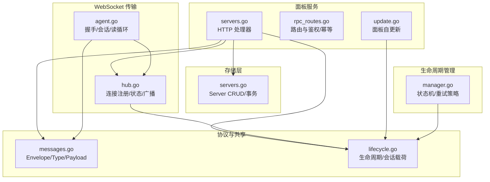
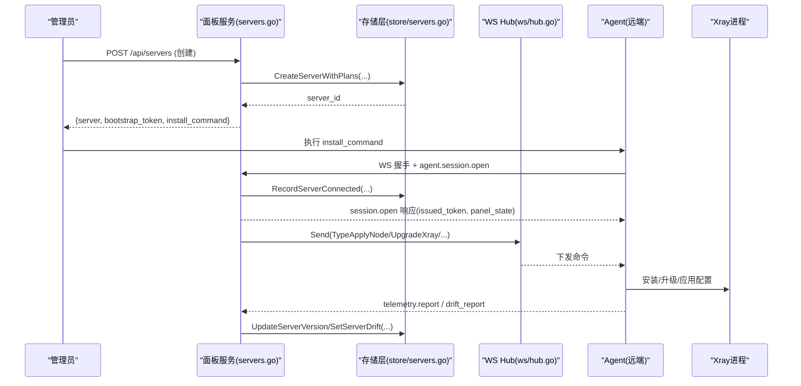
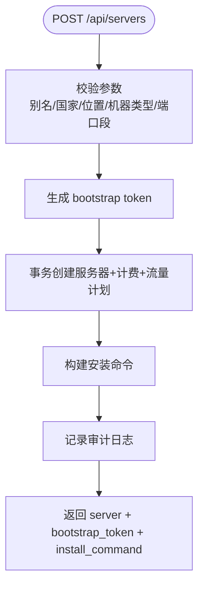
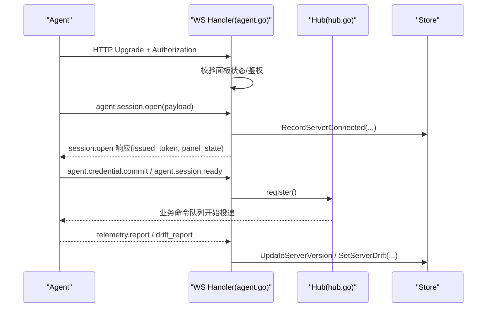
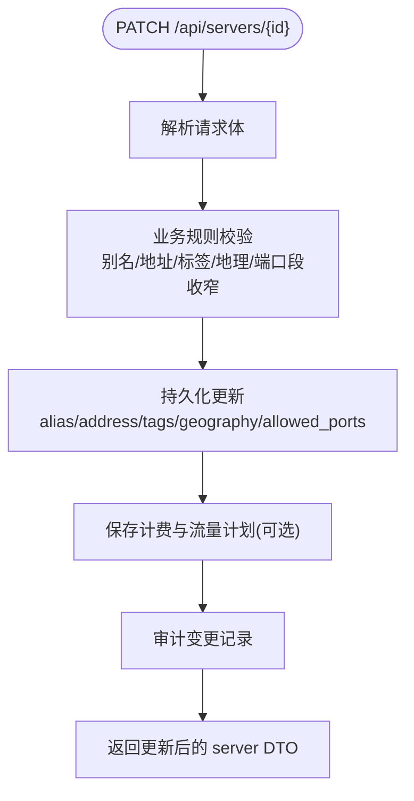
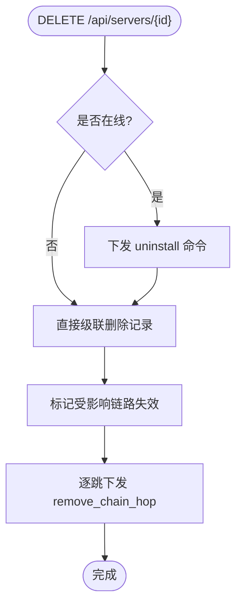
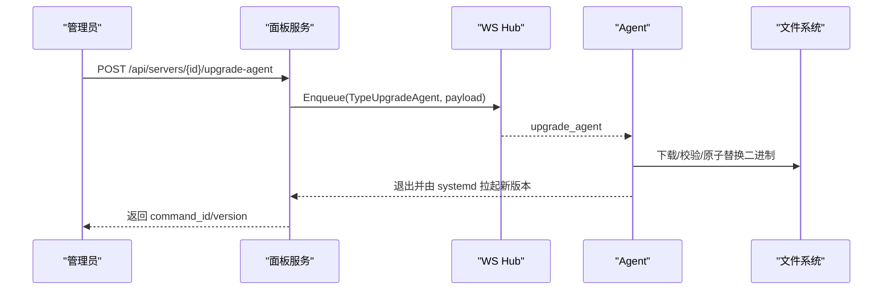
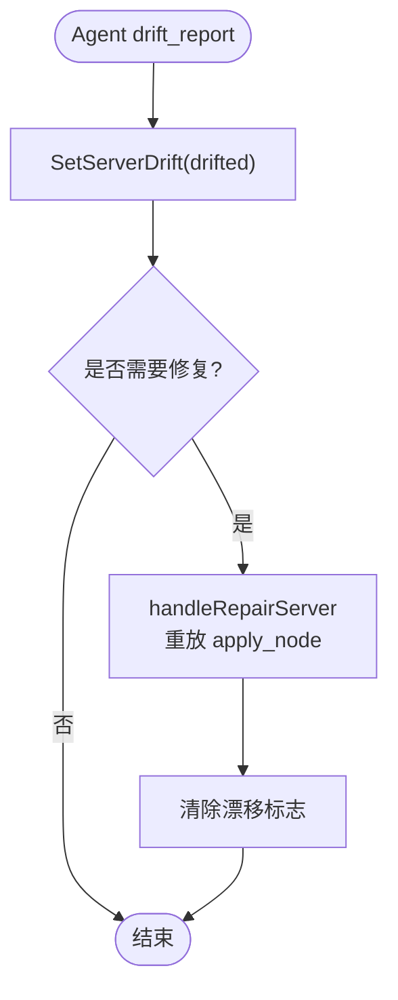
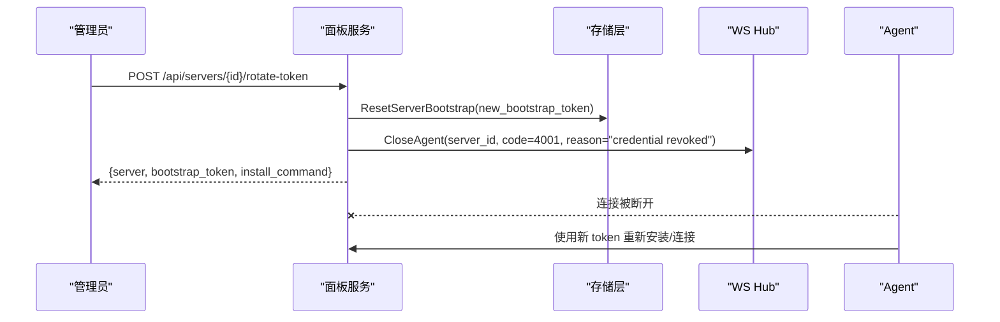
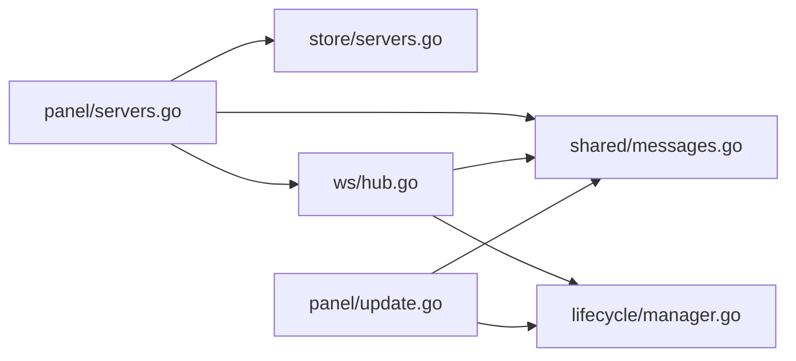

# 服务器管理

<cite>
**本文引用的文件**   
- [src/backend/internal/panel/servers.go](file://src/backend/internal/panel/servers.go)
- [src/backend/internal/store/servers.go](file://src/backend/internal/store/servers.go)
- [src/shared/messages.go](file://src/shared/messages.go)
- [src/backend/internal/ws/agent.go](file://src/backend/internal/ws/agent.go)
- [src/backend/internal/ws/hub.go](file://src/backend/internal/ws/hub.go)
- [src/backend/internal/lifecycle/manager.go](file://src/backend/internal/lifecycle/manager.go)
- [src/shared/lifecycle.go](file://src/shared/lifecycle.go)
- [src/backend/internal/panel/update.go](file://src/backend/internal/panel/update.go)
- [src/backend/internal/panel/rpc_routes.go](file://src/backend/internal/panel/rpc_routes.go)
- [src/backend/internal/panel/servers_install_test.go](file://src/backend/internal/panel/servers_install_test.go)
</cite>

## 目录
1. [简介](#简介)
2. [项目结构](#项目结构)
3. [核心组件](#核心组件)
4. [架构总览](#架构总览)
5. [详细组件分析](#详细组件分析)
6. [依赖关系分析](#依赖关系分析)
7. [性能考量](#性能考量)
8. [故障排查指南](#故障排查指南)
9. [结论](#结论)
10. [附录：API 与示例](#附录api-与示例)

## 简介
本技术文档围绕 Lattix-codex 的“服务器管理”能力，系统化阐述服务器的全生命周期管理：从创建、安装引导、连接与会话、配置下发与漂移修复、到更新升级与删除清理。重点覆盖以下业务逻辑与实现要点：
- 服务器创建流程：bootstrap token 生成、安装命令构建、机器类型（direct/nat）与端口段分配等。
- 服务器更新操作：别名修改、地址更新、标签管理、地理位置配置等业务规则。
- 服务器删除逻辑：在线卸载、离线清理、级联删除策略。
- 服务器升级功能：Xray 版本升级、Agent 版本升级、自动回滚机制。
- 配置漂移检测与修复：漂移标志设置、自动修复流程、手动修复接口。
- 连接管理与状态监控：WebSocket 会话、心跳保活、在线状态、遥测指标上报。

## 项目结构
服务器管理相关代码主要分布在后端面板层、存储层、共享协议定义、WebSocket 传输层以及生命周期管理模块中：
- 面板服务层（panel）：HTTP API 路由、请求校验、业务编排、审计记录。
- 存储层（store）：服务器元数据、计费与流量计划、节点与链跳信息、遥测历史等持久化。
- 共享协议（shared）：控制通道信封、消息类型、载荷结构、生命周期快照等。
- WebSocket 层（ws）：Agent 连接注册、认证、会话建立、消息分发与连接状态维护。
- 生命周期（lifecycle）：面板实例状态机与重试策略。

**图表来源** 
- [src/backend/internal/panel/servers.go:1-859](file://src/backend/internal/panel/servers.go#L1-L859)
- [src/backend/internal/store/servers.go:1-370](file://src/backend/internal/store/servers.go#L1-L370)
- [src/shared/messages.go:1-313](file://src/shared/messages.go#L1-L313)
- [src/backend/internal/ws/agent.go:1-359](file://src/backend/internal/ws/agent.go#L1-L359)
- [src/backend/internal/ws/hub.go:1-413](file://src/backend/internal/ws/hub.go#L1-L413)
- [src/backend/internal/lifecycle/manager.go:1-63](file://src/backend/internal/lifecycle/manager.go#L1-L63)
- [src/shared/lifecycle.go:1-86](file://src/shared/lifecycle.go#L1-L86)
- [src/backend/internal/panel/update.go:1-620](file://src/backend/internal/panel/update.go#L1-L620)
- [src/backend/internal/panel/rpc_routes.go:1-308](file://src/backend/internal/panel/rpc_routes.go#L1-L308)

**章节来源**
- [src/backend/internal/panel/servers.go:1-859](file://src/backend/internal/panel/servers.go#L1-L859)
- [src/backend/internal/store/servers.go:1-370](file://src/backend/internal/store/servers.go#L1-L370)
- [src/shared/messages.go:1-313](file://src/shared/messages.go#L1-L313)
- [src/backend/internal/ws/agent.go:1-359](file://src/backend/internal/ws/agent.go#L1-L359)
- [src/backend/internal/ws/hub.go:1-413](file://src/backend/internal/ws/hub.go#L1-L413)
- [src/backend/internal/lifecycle/manager.go:1-63](file://src/backend/internal/lifecycle/manager.go#L1-L63)
- [src/shared/lifecycle.go:1-86](file://src/shared/lifecycle.go#L1-L86)
- [src/backend/internal/panel/update.go:1-620](file://src/backend/internal/panel/update.go#L1-L620)
- [src/backend/internal/panel/rpc_routes.go:1-308](file://src/backend/internal/panel/rpc_routes.go#L1-L308)

## 核心组件
- HTTP 服务器处理器（panel/servers.go）：提供服务器列表、创建、更新、升级、修复、删除、Token 轮换等 REST 接口；负责参数校验、业务规则、审计记录与 DTO 转换。
- 存储层（store/servers.go）：服务器实体模型、CRUD、事务性创建（含计费与流量计划）、连接事件记录、漂移标志、Bootstrap Token 重置等。
- 共享协议（shared/messages.go）：控制通道信封、消息类型（如 apply_node、upgrade_xray、config.drift 等）、载荷结构与 RPC 结果码。
- WebSocket 传输（ws/agent.go, ws/hub.go）：Agent 连接握手、认证、会话建立、消息收发、连接状态快照、重连与下线处理。
- 生命周期（lifecycle/manager.go, shared/lifecycle.go）：面板实例状态机（startup/active/updating/faulted）、重试策略、生命周期变更通知。
- 面板自更新（panel/update.go）：下载、校验、原子替换、重启切换，支持进度查询与失败回退。

**章节来源**
- [src/backend/internal/panel/servers.go:1-859](file://src/backend/internal/panel/servers.go#L1-L859)
- [src/backend/internal/store/servers.go:1-370](file://src/backend/internal/store/servers.go#L1-L370)
- [src/shared/messages.go:1-313](file://src/shared/messages.go#L1-L313)
- [src/backend/internal/ws/agent.go:1-359](file://src/backend/internal/ws/agent.go#L1-L359)
- [src/backend/internal/ws/hub.go:1-413](file://src/backend/internal/ws/hub.go#L1-L413)
- [src/backend/internal/lifecycle/manager.go:1-63](file://src/backend/internal/lifecycle/manager.go#L1-L63)
- [src/shared/lifecycle.go:1-86](file://src/shared/lifecycle.go#L1-L86)
- [src/backend/internal/panel/update.go:1-620](file://src/backend/internal/panel/update.go#L1-L620)

## 架构总览
下图展示了服务器管理的端到端流程：管理员通过 HTTP API 触发服务器创建/更新/升级/修复/删除；面板调用存储层持久化元数据；通过 WebSocket 向 Agent 下发命令；Agent 执行并回报遥测与漂移状态；面板聚合展示与告警。

**图表来源** 
- [src/backend/internal/panel/servers.go:208-322](file://src/backend/internal/panel/servers.go#L208-L322)
- [src/backend/internal/store/servers.go:121-150](file://src/backend/internal/store/servers.go#L121-L150)
- [src/backend/internal/ws/agent.go:33-156](file://src/backend/internal/ws/agent.go#L33-L156)
- [src/backend/internal/ws/hub.go:111-139](file://src/backend/internal/ws/hub.go#L111-L139)
- [src/shared/messages.go:185-203](file://src/shared/messages.go#L185-L203)

## 详细组件分析

### 服务器创建与安装引导
- 输入校验：别名必填；国家/位置规范化；机器类型直连或 NAT；NAT 必须填写公网地址；端口段合法性校验。
- Bootstrap Token：基于面板实例 ID 与凭证纪元生成一次性令牌，用于首次安装引导。
- 存储事务：CreateServerWithPlans 在事务内写入服务器、初始计费与流量计划，保证一致性。
- 安装命令：根据仓库名与面板版本拼接 curl 安装脚本，dev 构建默认 latest，不显式钉住 xray 版本。
- 审计与返回：记录创建审计日志，返回服务器 DTO、bootstrap_token 与 install_command。

**图表来源** 
- [src/backend/internal/panel/servers.go:208-322](file://src/backend/internal/panel/servers.go#L208-L322)
- [src/backend/internal/store/servers.go:121-150](file://src/backend/internal/store/servers.go#L121-L150)
- [src/backend/internal/panel/servers_install_test.go:1-33](file://src/backend/internal/panel/servers_install_test.go#L1-L33)

**章节来源**
- [src/backend/internal/panel/servers.go:208-322](file://src/backend/internal/panel/servers.go#L208-L322)
- [src/backend/internal/store/servers.go:121-150](file://src/backend/internal/store/servers.go#L121-L150)
- [src/backend/internal/panel/servers_install_test.go:1-33](file://src/backend/internal/panel/servers_install_test.go#L1-L33)

### 连接管理与状态监控
- WS 握手：Authorization Bearer 校验，拒绝面板重启/不可用状态的新连接。
- 会话建立：首帧必须为 agent.session.open，携带协议版本、Agent/Xray 版本、网卡地址等；成功后换发长期凭证（可延迟提交）。
- 连接状态：Hub 维护每个服务器的连接快照（never_connected/connecting/reconnecting/online/offline），OnConnect/OnDisconnect 回调触发离线命令补发与告警。
- 心跳保活：Agent 主动 Ping，Panel 原样 Pong 并续期读超时；未收到任何字节超过阈值判定连接死亡。
- 遥测上报：telemetry.report 周期上报主机指标与 Xray 运行状态，面板据此刷新展示与版本字段。

**图表来源** 
- [src/backend/internal/ws/agent.go:33-156](file://src/backend/internal/ws/agent.go#L33-L156)
- [src/backend/internal/ws/hub.go:199-212](file://src/backend/internal/ws/hub.go#L199-L212)
- [src/backend/internal/store/servers.go:190-207](file://src/backend/internal/store/servers.go#L190-L207)
- [src/shared/messages.go:195-222](file://src/shared/messages.go#L195-L222)

**章节来源**
- [src/backend/internal/ws/agent.go:33-156](file://src/backend/internal/ws/agent.go#L33-L156)
- [src/backend/internal/ws/hub.go:199-212](file://src/backend/internal/ws/hub.go#L199-L212)
- [src/backend/internal/store/servers.go:190-207](file://src/backend/internal/store/servers.go#L190-L207)
- [src/shared/messages.go:195-222](file://src/shared/messages.go#L195-L222)

### 服务器更新操作（别名/地址/标签/地理/计费与流量计划）
- 别名：非空且长度限制；省略表示不变。
- 地址：非空切换手工模式，置空切换自动模式并在下次 session.open 重新学习；NAT 类型禁止置空。
- 标签：整体替换；省略表示不变。
- 地理：country_code 与 location 须同时提供，并进行规范化。
- 端口段收窄：检查该服务器节点指定/realized 端口与链跳 forward/portal 端口是否越界，越界则拒绝。
- 计费与流量计划：可选更新，需通过校验器验证。

**图表来源** 
- [src/backend/internal/panel/servers.go:385-536](file://src/backend/internal/panel/servers.go#L385-L536)
- [src/backend/internal/store/servers.go:248-285](file://src/backend/internal/store/servers.go#L248-L285)

**章节来源**
- [src/backend/internal/panel/servers.go:385-536](file://src/backend/internal/panel/servers.go#L385-L536)
- [src/backend/internal/store/servers.go:248-285](file://src/backend/internal/store/servers.go#L248-L285)

### 服务器删除逻辑（在线卸载/离线清理/级联删除）
- 在线删除：先下发 uninstall 命令（Agent 自卸载），随后级联删除记录（节点、命令、链跳、流量游标、指标、计费与计划等）。
- 离线删除：仅删除记录，Agent 需手动清理。
- 受影响链路：标记失效并逐跳下发 remove_chain_hop，确保远端清理残留配置。

**图表来源** 
- [src/backend/internal/panel/servers.go:734-800](file://src/backend/internal/panel/servers.go#L734-L800)
- [src/backend/internal/store/servers.go:341-369](file://src/backend/internal/store/servers.go#L341-L369)

**章节来源**
- [src/backend/internal/panel/servers.go:734-800](file://src/backend/internal/panel/servers.go#L734-L800)
- [src/backend/internal/store/servers.go:341-369](file://src/backend/internal/store/servers.go#L341-L369)

### 服务器升级功能（Xray/Agent/自动回滚）
- Xray 升级：POST /api/servers/{id}/upgrade，下发 upgrade_xray 命令；离线服务器留队列补发；完成后经 telemetry 刷新版本号。
- Agent 升级：POST /api/servers/{id}/upgrade-agent，Agent 从 ReleaseBase 下载二进制与 checksums.txt，校验后原子替换自身并退出（systemd 拉起即完成升级）。
- 面板自更新：download → verify → extract → apply（原子替换）→ restart；失败停留在 failed 状态，保持旧版本运行；支持进度轮询。

**图表来源** 
- [src/backend/internal/panel/servers.go:587-672](file://src/backend/internal/panel/servers.go#L587-L672)
- [src/shared/messages.go:240-253](file://src/shared/messages.go#L240-L253)
- [src/backend/internal/panel/update.go:258-426](file://src/backend/internal/panel/update.go#L258-L426)

**章节来源**
- [src/backend/internal/panel/servers.go:587-672](file://src/backend/internal/panel/servers.go#L587-L672)
- [src/shared/messages.go:240-253](file://src/shared/messages.go#L240-L253)
- [src/backend/internal/panel/update.go:258-426](file://src/backend/internal/panel/update.go#L258-L426)

### 配置漂移检测与修复机制
- 漂移上报：Agent 通过 config.drift 事件上报 drifted=true/false，仅在状态变化时上报。
- 漂移标志：面板持久化 servers.config_drift 标志位。
- 自动修复：面板周期性或触发式重放 active 节点的 apply_node，使 Agent 重建配置并清除漂移标志。
- 手动修复：POST /api/servers/{id}/repair，遍历该服务器 active 节点，逐个 enqueue apply_node，返回 reapplied 计数。

**图表来源** 
- [src/shared/messages.go:234-238](file://src/shared/messages.go#L234-L238)
- [src/backend/internal/store/servers.go:310-315](file://src/backend/internal/store/servers.go#L310-L315)
- [src/backend/internal/panel/servers.go:674-720](file://src/backend/internal/panel/servers.go#L674-L720)

**章节来源**
- [src/shared/messages.go:234-238](file://src/shared/messages.go#L234-L238)
- [src/backend/internal/store/servers.go:310-315](file://src/backend/internal/store/servers.go#L310-L315)
- [src/backend/internal/panel/servers.go:674-720](file://src/backend/internal/panel/servers.go#L674-L720)

### Token 轮换与强制重连
- 轮换接口：POST /api/servers/{id}/rotate-token，生成新 bootstrap token 并重置服务器至 bootstrap 状态（last_seen_at 置空，credential_epoch++）。
- 强制重连：关闭现有 Agent 连接（CloseAgent），旧凭证立即失效；返回新的 bootstrap_token 与 install_command。

**图表来源** 
- [src/backend/internal/panel/servers.go:324-383](file://src/backend/internal/panel/servers.go#L324-L383)
- [src/backend/internal/store/servers.go:317-329](file://src/backend/internal/store/servers.go#L317-L329)
- [src/backend/internal/ws/hub.go:195-203](file://src/backend/internal/ws/hub.go#L195-L203)

**章节来源**
- [src/backend/internal/panel/servers.go:324-383](file://src/backend/internal/panel/servers.go#L324-L383)
- [src/backend/internal/store/servers.go:317-329](file://src/backend/internal/store/servers.go#L317-L329)
- [src/backend/internal/ws/hub.go:195-203](file://src/backend/internal/ws/hub.go#L195-L203)

## 依赖关系分析
- 面板服务依赖存储层进行数据持久化，依赖 WS Hub 进行命令下发与状态同步。
- WS Hub 依赖生命周期管理器提供的面板状态快照，以决定是否接受新连接或拒绝业务命令。
- 共享协议定义贯穿所有组件，确保信封、类型与载荷一致。
- 面板自更新独立于服务器管理，但复用生命周期状态与审计记录。

**图表来源** 
- [src/backend/internal/panel/servers.go:1-859](file://src/backend/internal/panel/servers.go#L1-L859)
- [src/backend/internal/store/servers.go:1-370](file://src/backend/internal/store/servers.go#L1-L370)
- [src/backend/internal/ws/hub.go:1-413](file://src/backend/internal/ws/hub.go#L1-L413)
- [src/shared/messages.go:1-313](file://src/shared/messages.go#L1-L313)
- [src/backend/internal/lifecycle/manager.go:1-63](file://src/backend/internal/lifecycle/manager.go#L1-L63)
- [src/backend/internal/panel/update.go:1-620](file://src/backend/internal/panel/update.go#L1-L620)

**章节来源**
- [src/backend/internal/panel/servers.go:1-859](file://src/backend/internal/panel/servers.go#L1-L859)
- [src/backend/internal/store/servers.go:1-370](file://src/backend/internal/store/servers.go#L1-L370)
- [src/backend/internal/ws/hub.go:1-413](file://src/backend/internal/ws/hub.go#L1-L413)
- [src/shared/messages.go:1-313](file://src/shared/messages.go#L1-L313)
- [src/backend/internal/lifecycle/manager.go:1-63](file://src/backend/internal/lifecycle/manager.go#L1-L63)
- [src/backend/internal/panel/update.go:1-620](file://src/backend/internal/panel/update.go#L1-L620)

## 性能考量
- WS 发送缓冲：每连接 256 条，写满视为慢连接并断开，重连后补发 queued 命令，避免阻塞主循环。
- 心跳与超时：Agent 每 30s Ping，Panel 90s 无字节判定连接死亡；单次写超时 10s，保障资源回收。
- 批量操作：创建服务器与计划使用事务，减少锁竞争与不一致风险。
- 遥测增量：流量计数器按绝对值计算增量，丢帧可补齐，天然幂等。

[本节为通用指导，无需特定文件引用]

## 故障排查指南
- 连接失败：检查 Authorization Bearer 是否正确；面板是否处于 faulted 或 draining 状态；WS 握手错误码与消息。
- 会话无法就绪：确认 credential.commit 与 session.ready 顺序与参数正确；生命周期版本冲突需重试。
- 漂移持续：查看 drift_report 是否上报；执行 repair 接口并重放 apply_node；检查节点 realized_config 与实际配置差异。
- 升级失败：查看 update status 阶段与错误信息；确认 checksums.txt 与资产完整性；面板自更新失败会保留旧版本运行。
- 删除无效：在线删除需确认 uninstall 回执；离线删除需手动清理 Agent；检查受影响链路是否已移除 hop。

**章节来源**
- [src/backend/internal/ws/agent.go:264-274](file://src/backend/internal/ws/agent.go#L264-L274)
- [src/backend/internal/ws/hub.go:156-173](file://src/backend/internal/ws/hub.go#L156-L173)
- [src/backend/internal/panel/update.go:240-256](file://src/backend/internal/panel/update.go#L240-L256)
- [src/backend/internal/panel/servers.go:734-800](file://src/backend/internal/panel/servers.go#L734-L800)

## 结论
Lattix-codex 的服务器管理模块以清晰的职责分层与严格的协议约束，实现了从创建、安装、连接、配置、升级到删除的全生命周期闭环。通过 WS 可靠传输、事务性存储与面板自更新机制，系统在可用性、一致性与可运维性方面具备良好实践。建议在生产环境中结合审计日志、遥测指标与告警策略，持续优化配置漂移治理与升级回滚体验。

[本节为总结性内容，无需特定文件引用]

## 附录：API 与示例
- 服务器列表：GET /api/servers
- 服务器创建：POST /api/servers（body 包含 alias、address、machine_type、allowed_ports、tags、country_code、location、billing、traffic_plan）
- 服务器更新：PATCH /api/servers/{id}（body 包含 server_id、alias、address、machine_type、allowed_ports、tags、country_code、location、billing、traffic_plan）
- 服务器删除：DELETE /api/servers/{id}（body 包含 server_id、purge=xray|agent）
- Token 轮换：POST /api/servers/{id}/rotate-token（body 包含 server_id）
- Xray 升级：POST /api/servers/{id}/upgrade（body 包含 server_id、version）
- Agent 升级：POST /api/servers/{id}/upgrade-agent（body 包含 server_id、version）
- 配置修复：POST /api/servers/{id}/repair（body 包含 server_id）

示例调用路径参考：
- 创建服务器与安装命令生成：[servers.go:208-322](file://src/backend/internal/panel/servers.go#L208-L322)
- 更新服务器与端口段收窄校验：[servers.go:385-536](file://src/backend/internal/panel/servers.go#L385-L536)
- 删除服务器与级联清理：[servers.go:734-800](file://src/backend/internal/panel/servers.go#L734-L800)
- Token 轮换与强制重连：[servers.go:324-383](file://src/backend/internal/panel/servers.go#L324-L383)
- Xray/Agent 升级流程：[servers.go:587-672](file://src/backend/internal/panel/servers.go#L587-L672)
- 配置漂移修复：[servers.go:674-720](file://src/backend/internal/panel/servers.go#L674-L720)

**章节来源**
- [src/backend/internal/panel/servers.go:208-322](file://src/backend/internal/panel/servers.go#L208-L322)
- [src/backend/internal/panel/servers.go:385-536](file://src/backend/internal/panel/servers.go#L385-L536)
- [src/backend/internal/panel/servers.go:734-800](file://src/backend/internal/panel/servers.go#L734-L800)
- [src/backend/internal/panel/servers.go:324-383](file://src/backend/internal/panel/servers.go#L324-L383)
- [src/backend/internal/panel/servers.go:587-672](file://src/backend/internal/panel/servers.go#L587-L672)
- [src/backend/internal/panel/servers.go:674-720](file://src/backend/internal/panel/servers.go#L674-L720)