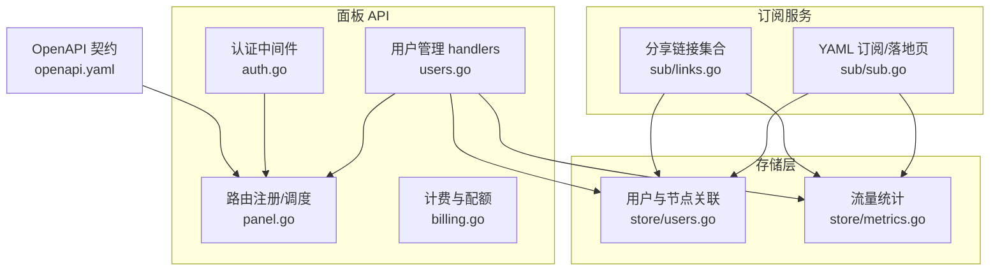
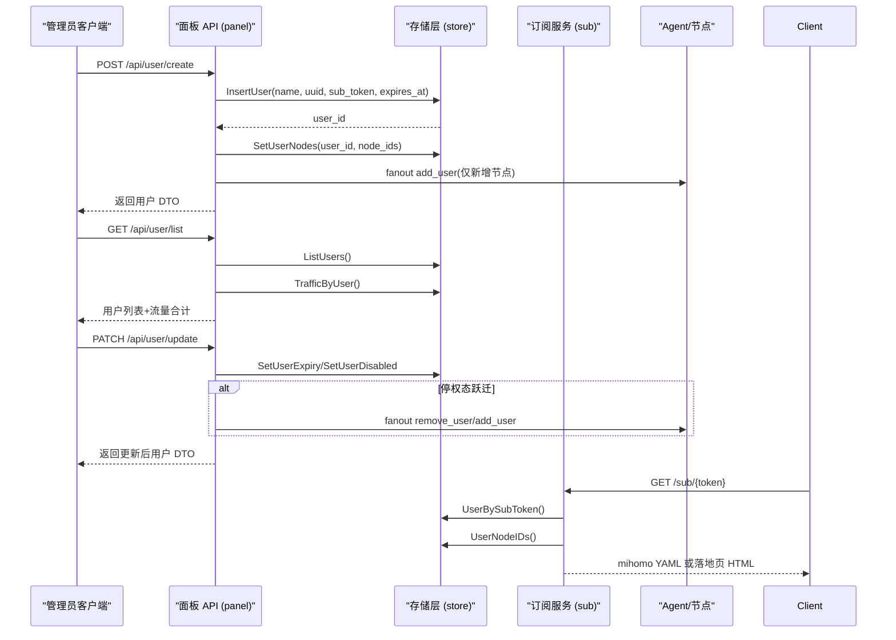
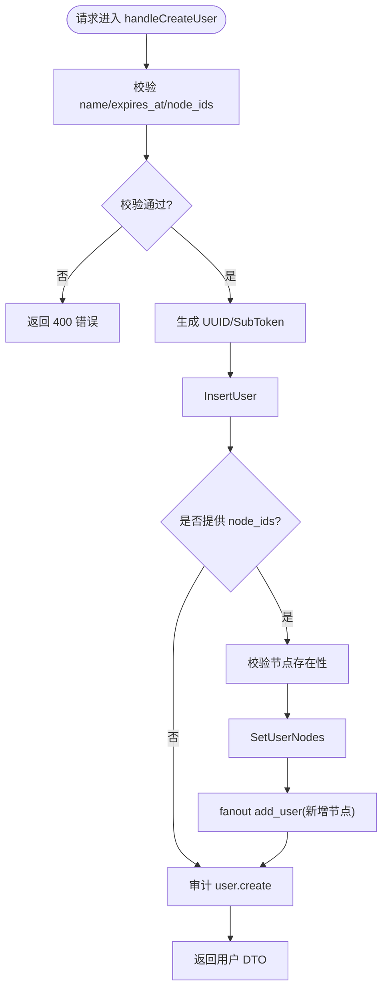
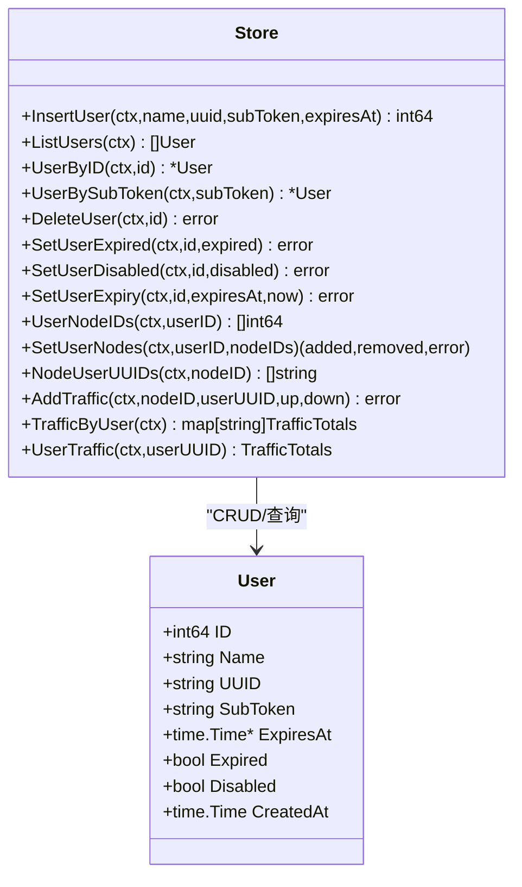
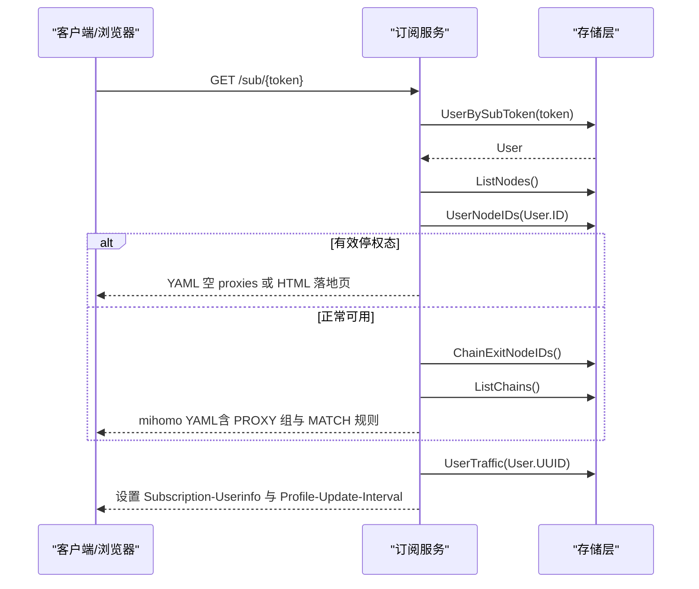
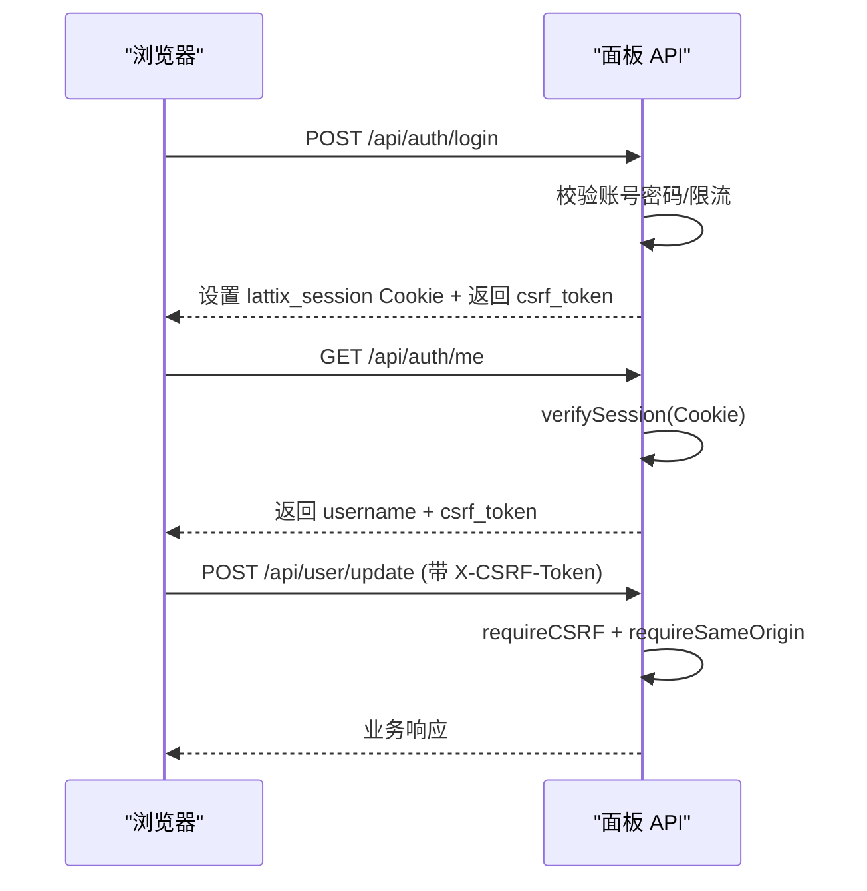
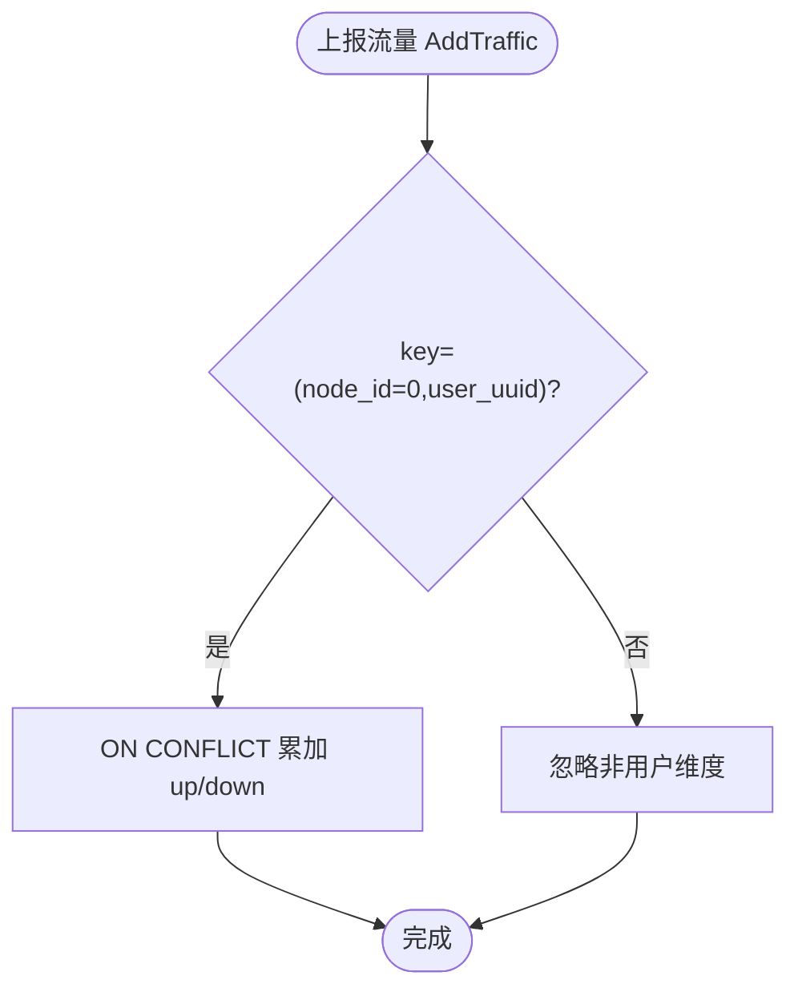
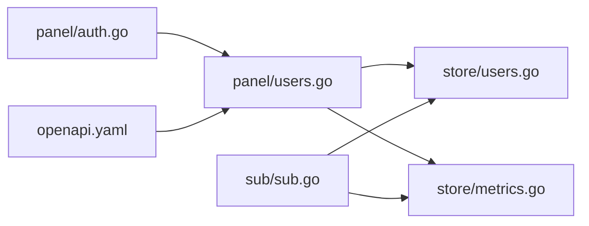

# 用户管理

<cite>
**本文引用的文件**   
- [users.go](file://src/backend/internal/panel/users.go)
- [auth.go](file://src/backend/internal/panel/auth.go)
- [sub.go](file://src/backend/internal/sub/sub.go)
- [links.go](file://src/backend/internal/sub/links.go)
- [users_store.go](file://src/backend/internal/store/users.go)
- [metrics_store.go](file://src/backend/internal/store/metrics.go)
- [billing.go](file://src/backend/internal/panel/billing.go)
- [openapi.yaml](file://docs/openapi.yaml)
- [panel.go](file://src/backend/internal/panel/panel.go)
</cite>

## 目录
1. [简介](#简介)
2. [项目结构](#项目结构)
3. [核心组件](#核心组件)
4. [架构总览](#架构总览)
5. [详细组件分析](#详细组件分析)
6. [依赖关系分析](#依赖关系分析)
7. [性能考量](#性能考量)
8. [故障排查指南](#故障排查指南)
9. [结论](#结论)
10. [附录](#附录)

## 简介
本文件面向 Lattix-codex 的用户管理功能，系统性阐述用户账户全生命周期管理、权限控制、订阅生成与流量统计等核心业务。文档覆盖：
- 用户创建流程（用户名校验、UUID/SubToken 生成、有效期与停权态）
- 用户权限模型（管理员会话认证、CSRF、同源校验、停权态判定）
- 订阅系统（mihomo YAML 落地页、分享链接集合、多协议支持、流量头信息）
- 配额与流量统计（按用户维度累计、周期重置策略、计费状态）
- 认证授权机制（会话 Cookie、HMAC 签名、CSRF Token、来源校验）
- API 示例与权限配置参考（OpenAPI 定义）

## 项目结构
围绕用户管理的后端代码主要分布在以下模块：
- 面板 API 层：用户 CRUD、节点分配、停权态扇出、审计记录
- 存储层：用户实体、用户-节点关联、到期扫描、流量统计
- 订阅服务：mihomo YAML 订阅、分享链接集合、流量头
- 认证授权：登录、登出、会话校验、CSRF、同源校验
- OpenAPI：统一 RPC 信封与鉴权参数定义

**图表来源** 
- [users.go:1-461](file://src/backend/internal/panel/users.go#L1-L461)
- [auth.go:1-269](file://src/backend/internal/panel/auth.go#L1-L269)
- [sub.go:1-382](file://src/backend/internal/sub/sub.go#L1-L382)
- [links.go:1-133](file://src/backend/internal/sub/links.go#L1-L133)
- [users_store.go:1-276](file://src/backend/internal/store/users.go#L1-L276)
- [metrics_store.go:1-276](file://src/backend/internal/store/metrics.go#L1-L276)
- [billing.go:1-431](file://src/backend/internal/panel/billing.go#L1-L431)
- [openapi.yaml:1-712](file://docs/openapi.yaml#L1-L712)
- [panel.go:1-200](file://src/backend/internal/panel/panel.go#L1-L200)

**章节来源**
- [panel.go:161-200](file://src/backend/internal/panel/panel.go#L161-L200)
- [openapi.yaml:304-339](file://docs/openapi.yaml#L304-L339)

## 核心组件
- 用户管理处理器（Panel）
  - 列表、创建、更新、删除用户；节点分配与差量扇出；停权态跃迁处理；审计记录
- 存储层（Store）
  - 用户表读写、用户-节点关联、到期扫描、停权标记、流量累计与查询
- 订阅服务（Sub）
  - mihomo YAML 订阅、浏览器落地页、分享链接集合、流量头设置
- 认证授权（Auth）
  - 登录/登出、会话 Cookie、HMAC 签名、CSRF Token、同源校验、更新中保护
- 计费与配额（Billing）
  - 服务器级计费与流量计划（周期重置、用量统计、状态计算）

**章节来源**
- [users.go:50-156](file://src/backend/internal/panel/users.go#L50-L156)
- [users_store.go:25-116](file://src/backend/internal/store/users.go#L25-L116)
- [sub.go:143-190](file://src/backend/internal/sub/sub.go#L143-L190)
- [links.go:16-43](file://src/backend/internal/sub/links.go#L16-L43)
- [auth.go:81-145](file://src/backend/internal/panel/auth.go#L81-L145)
- [billing.go:399-426](file://src/backend/internal/panel/billing.go#L399-L426)

## 架构总览
用户管理在面板侧通过 HTTP + Session 认证访问，所有写操作需 CSRF 与幂等键保护。用户数据持久化到数据库，订阅端点对外暴露 mihomo 兼容格式与分享链接集合。停权态（过期或停用）影响订阅条目可见性与节点下发。

**图表来源** 
- [users.go:78-156](file://src/backend/internal/panel/users.go#L78-L156)
- [users.go:170-278](file://src/backend/internal/panel/users.go#L170-L278)
- [users_store.go:25-116](file://src/backend/internal/store/users.go#L25-L116)
- [sub.go:143-190](file://src/backend/internal/sub/sub.go#L143-L190)

## 详细组件分析

### 用户管理 API（创建、更新、删除、节点分配）
- 创建用户
  - 输入：name、可选 expires_at（RFC3339）、可选 node_ids（预选链路对应业务节点）
  - 规则：name 非空；expires_at 必须为未来时间或 null（长期）；默认不分配节点（全关）
  - 行为：生成 UUID 与 sub_token；插入用户；可选校验并设置节点分配；差量扇出 add_user；审计记录
- 更新用户
  - 输入：user_id、可选 expires_at（null=清除长期）、可选 disabled（布尔）
  - 规则：expires_at 不允许过去时间；有效停权态 = expired OR disabled
  - 行为：修改有效期/停用标记；若停权态发生跃迁则扇出 remove_user 或 add_user；审计变更
- 删除用户
  - 行为：扇出 remove_user（向有用户节点的服务器下发），然后删除用户及关联；审计记录
- 节点分配
  - 整体替换用户节点集合；校验节点存在性；差量计算 added/removed；扇出对应命令；审计 before/after

**图表来源** 
- [users.go:78-156](file://src/backend/internal/panel/users.go#L78-L156)

**章节来源**
- [users.go:78-156](file://src/backend/internal/panel/users.go#L78-L156)
- [users.go:170-278](file://src/backend/internal/panel/users.go#L170-L278)
- [users.go:287-345](file://src/backend/internal/panel/users.go#L287-L345)
- [users.go:381-412](file://src/backend/internal/panel/users.go#L381-L412)

### 存储层（用户、节点关联、到期扫描、流量统计）
- 用户实体与操作
  - InsertUser、ListUsers、UserByID、UserBySubToken、DeleteUser
  - SetUserExpired、SetUserDisabled、SetUserExpiry（含恢复逻辑）
  - UserNodeIDs、SetUserNodes（返回 added/removed）
  - NodeUserUUIDs（过滤已停权用户）
- 流量统计
  - AddTraffic（节点维度与用户维度累计）
  - TrafficByNode、TrafficByUser、UserTraffic（订阅流量头）

**图表来源** 
- [users_store.go:14-23](file://src/backend/internal/store/users.go#L14-L23)
- [users_store.go:25-116](file://src/backend/internal/store/users.go#L25-L116)
- [users_store.go:118-192](file://src/backend/internal/store/users.go#L118-L192)
- [users_store.go:194-276](file://src/backend/internal/store/users.go#L194-L276)
- [metrics_store.go:202-276](file://src/backend/internal/store/metrics.go#L202-L276)

**章节来源**
- [users_store.go:25-116](file://src/backend/internal/store/users.go#L25-L116)
- [users_store.go:118-192](file://src/backend/internal/store/users.go#L118-L192)
- [users_store.go:194-276](file://src/backend/internal/store/users.go#L194-L276)
- [metrics_store.go:202-276](file://src/backend/internal/store/metrics.go#L202-L276)

### 订阅系统（YAML、落地页、分享链接、流量头）
- mihomo YAML 订阅
  - 根据用户分配的 active 节点生成代理项；有效停权态返回空 proxies
  - 响应头 Subscription-Userinfo（upload/download/expire）与 Profile-Update-Interval
- 浏览器落地页
  - Accept 含 text/html 时返回 HTML 落地页
- 分享链接集合
  - vless/trojan/vmess/ss 标准分享链接；base64 编码换行分隔；dokodemo/socks/http 跳过
  - 有效停权态返回空集合

**图表来源** 
- [sub.go:143-190](file://src/backend/internal/sub/sub.go#L143-L190)
- [sub.go:205-247](file://src/backend/internal/sub/sub.go#L205-L247)
- [sub.go:249-299](file://src/backend/internal/sub/sub.go#L249-L299)
- [metrics_store.go:261-276](file://src/backend/internal/store/metrics.go#L261-L276)

**章节来源**
- [sub.go:143-190](file://src/backend/internal/sub/sub.go#L143-L190)
- [links.go:16-43](file://src/backend/internal/sub/links.go#L16-L43)

### 认证授权（会话、CSRF、同源校验、更新中保护）
- 登录
  - 账号密码校验（管理员单账号）；失败记录审计与限流；成功签发会话 Cookie（HMAC 签名）
  - 返回 CSRF Token（基于会话 Secret 派生）
- 登出
  - 清除会话 Cookie；审计
- 会话校验
  - requireAuth 中间件：校验 Cookie 签名与过期；更新进行中拒绝其余 API（仅放行更新进度与会话探活）
- CSRF 与同源校验
  - requireCSRF：校验 X-CSRF-Token 与 Cookie 绑定
  - requireSameOrigin：校验 Origin/Referer 与 Host 一致；HTTPS 下要求 HTTPS 来源

**图表来源** 
- [auth.go:81-145](file://src/backend/internal/panel/auth.go#L81-L145)
- [auth.go:197-213](file://src/backend/internal/panel/auth.go#L197-L213)
- [auth.go:229-249](file://src/backend/internal/panel/auth.go#L229-L249)
- [auth.go:251-269](file://src/backend/internal/panel/auth.go#L251-L269)

**章节来源**
- [auth.go:81-145](file://src/backend/internal/panel/auth.go#L81-L145)
- [auth.go:197-213](file://src/backend/internal/panel/auth.go#L197-L213)
- [auth.go:229-249](file://src/backend/internal/panel/auth.go#L229-L249)
- [auth.go:251-269](file://src/backend/internal/panel/auth.go#L251-L269)

### 配额与流量统计（用户维度、周期重置、计费状态）
- 用户维度流量
  - AddTraffic 以 (node_id=0, user_uuid) 累计；TrafficByUser/UserTraffic 聚合
  - 订阅头 Subscription-Userinfo 包含 upload/download/expire
- 服务器级配额与计费
  - ServerTrafficPlan：quota_bytes、accounting_mode（outbound/bidirectional/max）、reset_anchor_on、reset_count/unit
  - 周期计算：trafficPeriod 基于锚点日期与间隔单位计算起止时间；UsedBytes 按模式汇总
  - BillingStatus：enabled/renewal/online 决定 Active/DueToday/AssumedValid/Expired

**图表来源** 
- [metrics_store.go:202-213](file://src/backend/internal/store/metrics.go#L202-L213)
- [metrics_store.go:241-276](file://src/backend/internal/store/metrics.go#L241-L276)
- [billing.go:334-352](file://src/backend/internal/panel/billing.go#L334-L352)
- [billing.go:142-156](file://src/backend/internal/panel/billing.go#L142-L156)

**章节来源**
- [metrics_store.go:202-276](file://src/backend/internal/store/metrics.go#L202-L276)
- [billing.go:334-352](file://src/backend/internal/panel/billing.go#L334-L352)
- [billing.go:142-156](file://src/backend/internal/panel/billing.go#L142-L156)

## 依赖关系分析
- 面板 API 依赖存储层进行用户与节点数据的持久化与查询
- 订阅服务依赖存储层获取用户、节点、链信息与流量统计
- 认证中间件依赖会话 Secret（由管理员凭证派生）与 CSRF 派生函数
- OpenAPI 定义统一了鉴权参数（CSRF Token、Idempotency-Key）与 RPC 信封

**图表来源** 
- [users.go:1-461](file://src/backend/internal/panel/users.go#L1-L461)
- [users_store.go:1-276](file://src/backend/internal/store/users.go#L1-L276)
- [metrics_store.go:1-276](file://src/backend/internal/store/metrics.go#L1-L276)
- [sub.go:1-382](file://src/backend/internal/sub/sub.go#L1-L382)
- [auth.go:1-269](file://src/backend/internal/panel/auth.go#L1-L269)
- [openapi.yaml:1-712](file://docs/openapi.yaml#L1-L712)

**章节来源**
- [panel.go:161-200](file://src/backend/internal/panel/panel.go#L161-L200)
- [openapi.yaml:450-476](file://docs/openapi.yaml#L450-L476)

## 性能考量
- 用户节点分配采用差量计算（added/removed），减少不必要的扇出与网络开销
- 订阅生成对无效/损坏配置做容错（跳过异常节点），避免阻塞响应
- 流量统计使用 ON CONFLICT 累加，降低写入放大
- 会话校验与 CSRF 验证均为轻量 HMAC 计算，无外部依赖

[本节为通用指导，无需特定文件引用]

## 故障排查指南
- 用户创建失败
  - 检查 name 是否为空、expires_at 格式与时间合法性、节点是否存在
  - 查看审计日志与错误码（400/500）
- 订阅为空或异常
  - 确认用户未处于有效停权态（expired/disabled）
  - 检查节点 RealizedConfig 与链 PublishedRevision 是否就绪
- 认证失败
  - 检查 Cookie 是否携带、CSRF Token 是否正确、同源校验是否通过
  - 面板更新进行中会拒绝写操作，等待更新完成

**章节来源**
- [users.go:82-104](file://src/backend/internal/panel/users.go#L82-L104)
- [sub.go:147-156](file://src/backend/internal/sub/sub.go#L147-L156)
- [auth.go:197-213](file://src/backend/internal/panel/auth.go#L197-L213)

## 结论
Lattix-codex 的用户管理以“面板 API + 存储层 + 订阅服务”为核心，结合严格的认证授权与停权态控制，实现了从用户创建、节点分配到订阅生成与流量统计的完整闭环。通过差量扇出、容错处理与轻量鉴权，系统在安全性与性能之间取得平衡。开发者可依据 OpenAPI 与源码路径快速集成与扩展。

[本节为总结性内容，无需特定文件引用]

## 附录
- API 示例（用户管理）
  - 创建用户：POST /api/user/create（CSRF + Idempotency-Key）
  - 更新用户：POST /api/user/update（CSRF + Idempotency-Key）
  - 设置节点：POST /api/user/set-nodes（CSRF + Idempotency-Key）
  - 删除用户：POST /api/user/delete（CSRF + Idempotency-Key）
- 权限配置参考
  - 会话 Cookie：lattix_session（HMAC 签名，7 天 TTL）
  - CSRF Token：X-CSRF-Token（基于会话 Secret 派生）
  - 同源校验：Origin/Referer 与 Host 一致，HTTPS 下要求 HTTPS 来源

**章节来源**
- [openapi.yaml:304-339](file://docs/openapi.yaml#L304-L339)
- [auth.go:21-48](file://src/backend/internal/panel/auth.go#L21-L48)
- [auth.go:229-249](file://src/backend/internal/panel/auth.go#L229-L249)