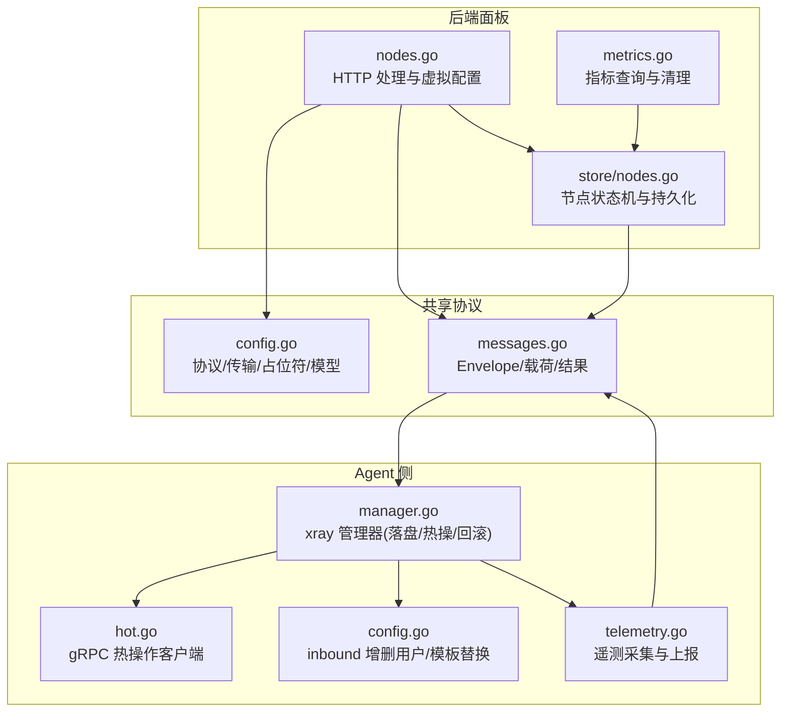
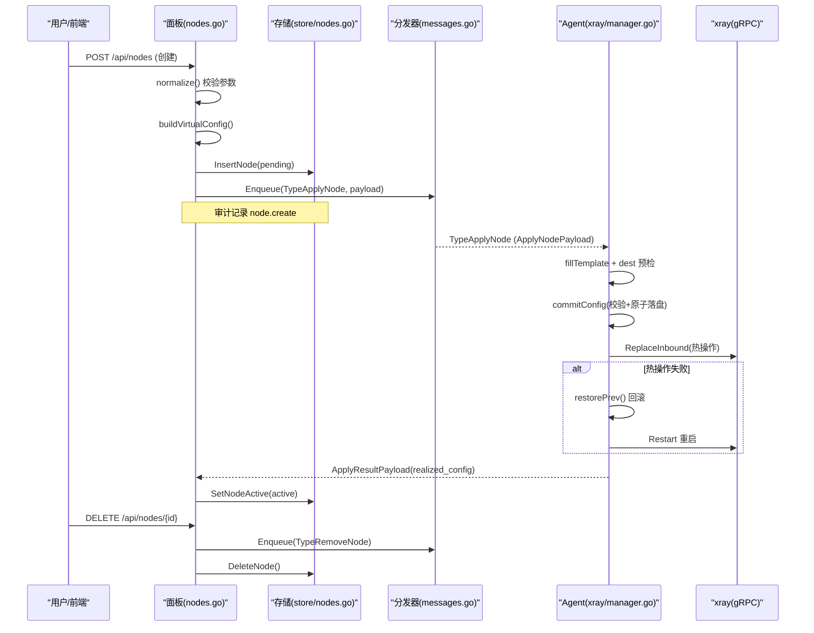
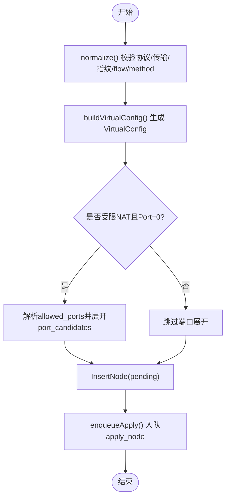
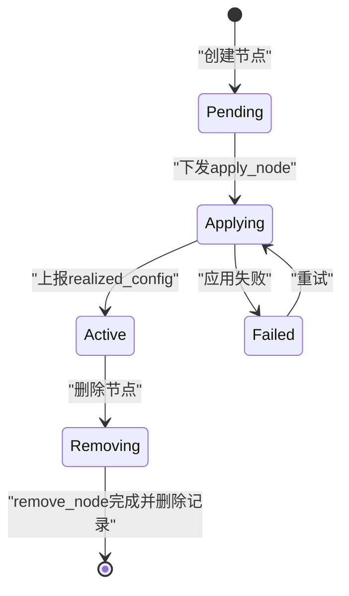
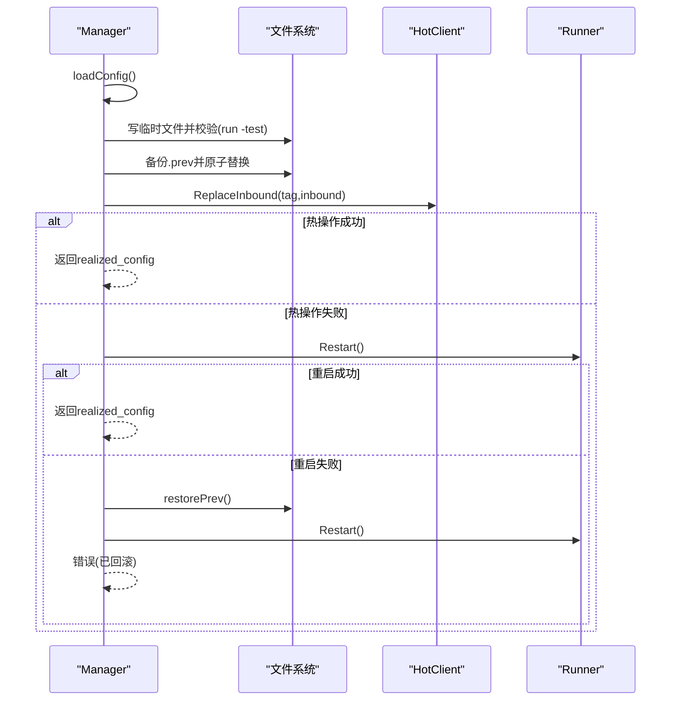
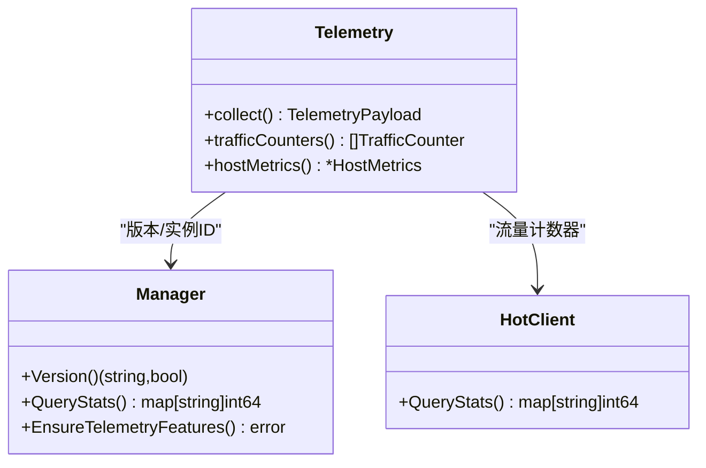
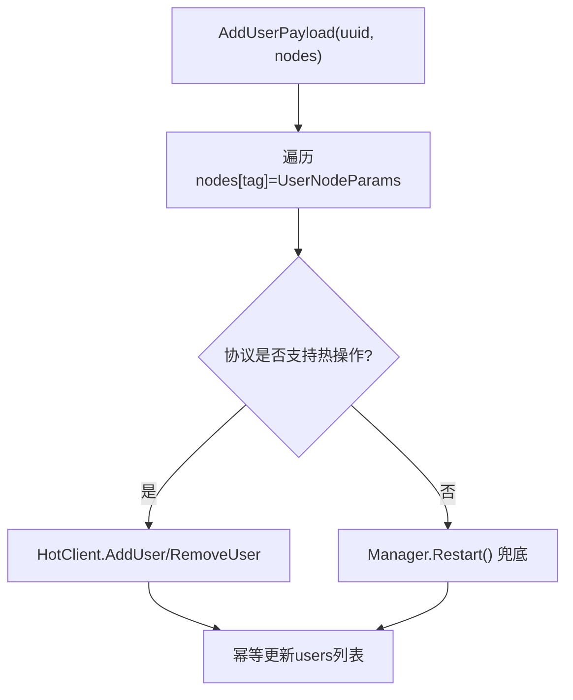
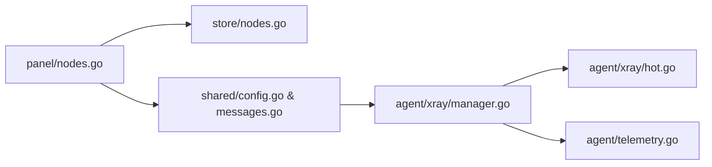

# 节点管理

<cite>
**本文引用的文件**   
- [src/backend/internal/panel/nodes.go](file://src/backend/internal/panel/nodes.go)
- [src/backend/internal/store/nodes.go](file://src/backend/internal/store/nodes.go)
- [src/shared/config.go](file://src/shared/config.go)
- [src/shared/messages.go](file://src/shared/messages.go)
- [src/agent/internal/xray/config.go](file://src/agent/internal/xray/config.go)
- [src/agent/internal/xray/hot.go](file://src/agent/internal/xray/hot.go)
- [src/agent/internal/xray/manager.go](file://src/agent/internal/xray/manager.go)
- [src/agent/cmd/agent/telemetry.go](file://src/agent/cmd/agent/telemetry.go)
- [src/backend/internal/panel/metrics.go](file://src/backend/internal/panel/metrics.go)
</cite>

## 目录
1. [简介](#简介)
2. [项目结构](#项目结构)
3. [核心组件](#核心组件)
4. [架构总览](#架构总览)
5. [详细组件分析](#详细组件分析)
6. [依赖关系分析](#依赖关系分析)
7. [性能考量](#性能考量)
8. [故障排查指南](#故障排查指南)
9. [结论](#结论)
10. [附录：配置与API示例](#附录配置与api示例)

## 简介
本文件面向 Lattix-codex 的“节点管理”功能，系统性阐述代理节点的创建、配置模板、状态机、热更新与健康监控等关键机制。内容覆盖：
- 节点创建流程（协议选择 VLESS/Reality、端口分配、证书与指纹、用户绑定）
- 虚拟配置（VirtualConfig）结构与生成算法、参数校验规则
- 节点状态管理（pending/applying/active/failed 转换与约束）
- 配置热更新（gRPC 热操作 + 重启兜底 + 回滚策略）
- 健康检查与遥测（心跳、连接测试、指标采集）
- API 调用与配置示例（以路径引用代替具体代码片段）

## 项目结构
节点管理涉及后端面板、共享协议类型、Agent 侧 xray 管理与遥测四大模块：
- 后端面板：HTTP 接口、请求校验、虚拟配置构建、持久化、任务下发
- 共享层：协议常量、占位符、消息信封、载荷定义
- Agent 侧：xray 配置填充、热操作、服务重启、漂移检测、遥测上报
- 指标与历史：面板对主机指标的存储与查询

**图表来源** 
- [src/backend/internal/panel/nodes.go:1-490](file://src/backend/internal/panel/nodes.go#L1-L490)
- [src/backend/internal/store/nodes.go:1-141](file://src/backend/internal/store/nodes.go#L1-L141)
- [src/shared/config.go:1-206](file://src/shared/config.go#L1-L206)
- [src/shared/messages.go:1-313](file://src/shared/messages.go#L1-L313)
- [src/agent/internal/xray/manager.go:1-459](file://src/agent/internal/xray/manager.go#L1-L459)
- [src/agent/internal/xray/hot.go:1-148](file://src/agent/internal/xray/hot.go#L1-L148)
- [src/agent/internal/xray/config.go:1-202](file://src/agent/internal/xray/config.go#L1-L202)
- [src/agent/cmd/agent/telemetry.go:1-326](file://src/agent/cmd/agent/telemetry.go#L1-L326)
- [src/backend/internal/panel/metrics.go:1-105](file://src/backend/internal/panel/metrics.go#L1-L105)

**章节来源**
- [src/backend/internal/panel/nodes.go:1-490](file://src/backend/internal/panel/nodes.go#L1-L490)
- [src/backend/internal/store/nodes.go:1-141](file://src/backend/internal/store/nodes.go#L1-L141)
- [src/shared/config.go:1-206](file://src/shared/config.go#L1-L206)
- [src/shared/messages.go:1-313](file://src/shared/messages.go#L1-L313)
- [src/agent/internal/xray/manager.go:1-459](file://src/agent/internal/xray/manager.go#L1-L459)
- [src/agent/internal/xray/hot.go:1-148](file://src/agent/internal/xray/hot.go#L1-L148)
- [src/agent/internal/xray/config.go:1-202](file://src/agent/internal/xray/config.go#L1-L202)
- [src/agent/cmd/agent/telemetry.go:1-326](file://src/agent/cmd/agent/telemetry.go#L1-L326)
- [src/backend/internal/panel/metrics.go:1-105](file://src/backend/internal/panel/metrics.go#L1-L105)

## 核心组件
- 节点 DTO 与 HTTP 接口：列表、创建、重试、删除
- 虚拟配置构建器：按协议生成 inbound JSON 模板与占位符
- 节点状态机：pending → applying → active | failed
- Agent xray 管理器：模板填充、校验、落盘、热操作、回滚
- gRPC 热操作客户端：Add/Remove Inbound、Add/Remove User、Stats
- 遥测与指标：主机指标、流量计数器、延迟采样

**章节来源**
- [src/backend/internal/panel/nodes.go:21-74](file://src/backend/internal/panel/nodes.go#L21-L74)
- [src/backend/internal/panel/nodes.go:101-194](file://src/backend/internal/panel/nodes.go#L101-L194)
- [src/backend/internal/panel/nodes.go:393-489](file://src/backend/internal/panel/nodes.go#L393-L489)
- [src/backend/internal/store/nodes.go:12-18](file://src/backend/internal/store/nodes.go#L12-L18)
- [src/agent/internal/xray/manager.go:109-170](file://src/agent/internal/xray/manager.go#L109-L170)
- [src/agent/internal/xray/hot.go:27-148](file://src/agent/internal/xray/hot.go#L27-L148)
- [src/agent/cmd/agent/telemetry.go:17-53](file://src/agent/cmd/agent/telemetry.go#L17-L53)

## 架构总览
节点管理的端到端流程如下：
- 面板接收创建请求，校验参数并构建 VirtualConfig
- 持久化节点记录为 pending，入队 apply_node
- Agent 收到 apply_node，填充模板、校验、落盘，gRPC 热操作生效
- Agent 上报 realized_config，面板更新为 active
- 删除节点时，先下发 remove_node，再删除记录
- 遥测周期上报主机与流量指标，面板聚合展示

**图表来源** 
- [src/backend/internal/panel/nodes.go:196-250](file://src/backend/internal/panel/nodes.go#L196-L250)
- [src/backend/internal/store/nodes.go:59-68](file://src/backend/internal/store/nodes.go#L59-L68)
- [src/shared/messages.go:139-149](file://src/shared/messages.go#L139-L149)
- [src/agent/internal/xray/manager.go:109-170](file://src/agent/internal/xray/manager.go#L109-L170)
- [src/agent/internal/xray/hot.go:72-100](file://src/agent/internal/xray/hot.go#L72-L100)

## 详细组件分析

### 节点创建与配置模板系统
- 协议与传输组合校验：支持 vless/vmess/trojan/shadowsocks/socks/http/dokodemo；Reality 仅 tcp/grpc/xhttp
- 默认值与必填项：如 short_id、dest、server_names、fingerprint、flow、method 等
- VirtualConfig 构造：按协议生成 inbound JSON 模板，嵌入占位符（PORT/CLIENTS/PRIVATE_KEY/TAG/DECRYPTION）
- 受限 NAT 端口分配：若 allowed_ports 非空且 Port=0，则展开候选端口段下发给 Agent

**图表来源** 
- [src/backend/internal/panel/nodes.go:101-194](file://src/backend/internal/panel/nodes.go#L101-L194)
- [src/backend/internal/panel/nodes.go:393-489](file://src/backend/internal/panel/nodes.go#L393-L489)
- [src/backend/internal/panel/nodes.go:344-369](file://src/backend/internal/panel/nodes.go#L344-L369)
- [src/backend/internal/store/nodes.go:59-68](file://src/backend/internal/store/nodes.go#L59-L68)

**章节来源**
- [src/backend/internal/panel/nodes.go:101-194](file://src/backend/internal/panel/nodes.go#L101-L194)
- [src/backend/internal/panel/nodes.go:393-489](file://src/backend/internal/panel/nodes.go#L393-L489)
- [src/shared/config.go:149-186](file://src/shared/config.go#L149-L186)

### 节点状态机与生命周期
- 状态定义：pending、applying、active、failed
- 转换规则：
  - 创建后为 pending
  - 下发 apply_node 后进入 applying
  - Agent 上报 realized_config 后转为 active
  - 失败时置为 failed，并提供重试入口
- 删除流程：先下发 remove_node，再删除记录

**图表来源** 
- [src/backend/internal/store/nodes.go:12-18](file://src/backend/internal/store/nodes.go#L12-L18)
- [src/backend/internal/store/nodes.go:102-122](file://src/backend/internal/store/nodes.go#L102-L122)
- [src/backend/internal/panel/nodes.go:289-326](file://src/backend/internal/panel/nodes.go#L289-L326)

**章节来源**
- [src/backend/internal/store/nodes.go:12-18](file://src/backend/internal/store/nodes.go#L12-L18)
- [src/backend/internal/panel/nodes.go:289-326](file://src/backend/internal/panel/nodes.go#L289-L326)

### 配置热更新机制
- 主路径：gRPC 热操作（ReplaceInbound/AddUser/RemoveUser），零重启生效
- 兜底路径：热操作失败则重启 xray 生效
- 回滚策略：commitConfig 前备份 .prev，失败恢复上一份可用配置
- 漂移检测：比较 lastHash 与当前文件哈希，外部修改触发净化重建

**图表来源** 
- [src/agent/internal/xray/manager.go:235-287](file://src/agent/internal/xray/manager.go#L235-L287)
- [src/agent/internal/xray/manager.go:289-334](file://src/agent/internal/xray/manager.go#L289-L334)
- [src/agent/internal/xray/hot.go:72-100](file://src/agent/internal/xray/hot.go#L72-L100)

**章节来源**
- [src/agent/internal/xray/manager.go:109-170](file://src/agent/internal/xray/manager.go#L109-L170)
- [src/agent/internal/xray/manager.go:235-287](file://src/agent/internal/xray/manager.go#L235-L287)
- [src/agent/internal/xray/hot.go:72-100](file://src/agent/internal/xray/hot.go#L72-L100)

### 节点健康检查与遥测
- 心跳与连接：WebSocket session.open/ready 建立控制通道
- 连接测试：xray run -test 在落盘前校验配置合法性
- 指标采集：主机负载、内存、CPU、磁盘、网络速率、延迟中位数
- 流量统计：按 inbound/node/forward/user 维度聚合绝对计数器，面板计算增量

**图表来源** 
- [src/agent/cmd/agent/telemetry.go:35-53](file://src/agent/cmd/agent/telemetry.go#L35-L53)
- [src/agent/internal/xray/manager.go:86-107](file://src/agent/internal/xray/manager.go#L86-L107)
- [src/agent/internal/xray/hot.go:56-70](file://src/agent/internal/xray/hot.go#L56-L70)

**章节来源**
- [src/agent/cmd/agent/telemetry.go:17-53](file://src/agent/cmd/agent/telemetry.go#L17-L53)
- [src/backend/internal/panel/metrics.go:34-64](file://src/backend/internal/panel/metrics.go#L34-L64)

### 用户绑定与增量更新
- 全量用户：apply_node 携带 user_uuids，Agent 生成 clients/accounts 数组
- 增量用户：add_user/remove_user 按 tag 扇出，仅影响指定节点
- 协议差异：vless/vmess/trojan 使用 clients；socks/http 使用 accounts；ss 2022-blake3 需 PSK

**图表来源** 
- [src/shared/messages.go:156-178](file://src/shared/messages.go#L156-L178)
- [src/agent/internal/xray/config.go:83-114](file://src/agent/internal/xray/config.go#L83-L114)
- [src/agent/internal/xray/hot.go:102-135](file://src/agent/internal/xray/hot.go#L102-L135)

**章节来源**
- [src/shared/messages.go:156-178](file://src/shared/messages.go#L156-L178)
- [src/agent/internal/xray/config.go:83-114](file://src/agent/internal/xray/config.go#L83-L114)
- [src/agent/internal/xray/hot.go:102-135](file://src/agent/internal/xray/hot.go#L102-L135)

## 依赖关系分析
- 面板依赖 store 进行节点持久化与状态变更
- 面板通过 shared 消息类型与 Agent 通信
- Agent 依赖 xray 二进制与 gRPC API 实现热操作
- 遥测依赖 /proc 与 xray StatsService

**图表来源** 
- [src/backend/internal/panel/nodes.go:1-13](file://src/backend/internal/panel/nodes.go#L1-L13)
- [src/backend/internal/store/nodes.go:1-10](file://src/backend/internal/store/nodes.go#L1-L10)
- [src/shared/config.go:1-11](file://src/shared/config.go#L1-L11)
- [src/shared/messages.go:1-11](file://src/shared/messages.go#L1-L11)
- [src/agent/internal/xray/manager.go:1-22](file://src/agent/internal/xray/manager.go#L1-L22)
- [src/agent/internal/xray/hot.go:1-22](file://src/agent/internal/xray/hot.go#L1-L22)
- [src/agent/cmd/agent/telemetry.go:1-15](file://src/agent/cmd/agent/telemetry.go#L1-L15)

**章节来源**
- [src/backend/internal/panel/nodes.go:1-13](file://src/backend/internal/panel/nodes.go#L1-L13)
- [src/backend/internal/store/nodes.go:1-10](file://src/backend/internal/store/nodes.go#L1-L10)
- [src/shared/config.go:1-11](file://src/shared/config.go#L1-L11)
- [src/shared/messages.go:1-11](file://src/shared/messages.go#L1-L11)
- [src/agent/internal/xray/manager.go:1-22](file://src/agent/internal/xray/manager.go#L1-L22)
- [src/agent/internal/xray/hot.go:1-22](file://src/agent/internal/xray/hot.go#L1-L22)
- [src/agent/cmd/agent/telemetry.go:1-15](file://src/agent/cmd/agent/telemetry.go#L1-L15)

## 性能考量
- 热操作优先：避免频繁重启 xray，降低业务中断风险
- 原子落盘与校验：减少无效配置导致的启动失败
- 指标增量计算：基于绝对计数器差值，容错丢帧
- 端口候选展开：仅在受限 NAT 场景下执行，避免无谓开销

[本节为通用指导，不直接分析具体文件]

## 故障排查指南
- 节点创建失败：检查 normalize() 校验错误、端口是否在 allowed_ports 范围内
- 应用失败：查看 failed 状态的 error 字段，确认 Agent 日志与 xrun -test 输出
- 热操作异常：观察 ReplaceInbound/AddUser/RemoveUser 的错误码，必要时重启兜底
- 漂移修复：若配置文件被外部修改，Agent 将净化并重建受管 inbound
- 指标缺失：确保 policy/stats/StatsService 已启用，必要时 EnsureTelemetryFeatures

**章节来源**
- [src/backend/internal/panel/nodes.go:101-194](file://src/backend/internal/panel/nodes.go#L101-L194)
- [src/backend/internal/store/nodes.go:117-122](file://src/backend/internal/store/nodes.go#L117-L122)
- [src/agent/internal/xray/manager.go:289-334](file://src/agent/internal/xray/manager.go#L289-L334)
- [src/agent/internal/xray/hot.go:72-100](file://src/agent/internal/xray/hot.go#L72-L100)

## 结论
节点管理通过“面板构建模板 + Agent 填充落地 + gRPC 热操作”的协作模式，实现了高可用、可观测、易运维的节点生命周期管理。其设计强调：
- 严格的参数校验与协议约束
- 幂等的状态机与任务队列
- 热操作优先、重启兜底、自动回滚
- 完善的遥测与指标体系

## 附录：配置与API示例
- 节点创建 API：POST /api/nodes
  - 参考路径：[src/backend/internal/panel/nodes.go:196-250](file://src/backend/internal/panel/nodes.go#L196-L250)
- 节点重试 API：POST /api/nodes/{id}/retry
  - 参考路径：[src/backend/internal/panel/nodes.go:252-287](file://src/backend/internal/panel/nodes.go#L252-L287)
- 节点删除 API：DELETE /api/nodes/{id}
  - 参考路径：[src/backend/internal/panel/nodes.go:289-326](file://src/backend/internal/panel/nodes.go#L289-L326)
- 虚拟配置模板字段：VirtualConfig
  - 参考路径：[src/shared/config.go:170-186](file://src/shared/config.go#L170-L186)
- 生效配置字段：RealizedConfig
  - 参考路径：[src/shared/config.go:188-206](file://src/shared/config.go#L188-L206)
- 遥测上报载荷：TelemetryPayload
  - 参考路径：[src/shared/messages.go:195-203](file://src/shared/messages.go#L195-L203)