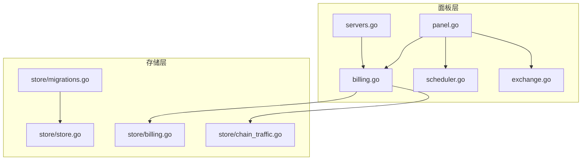
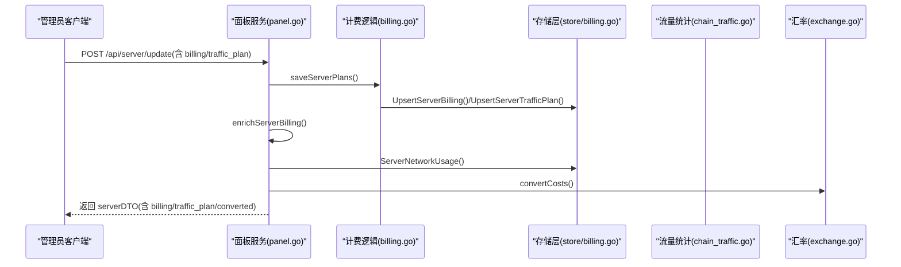
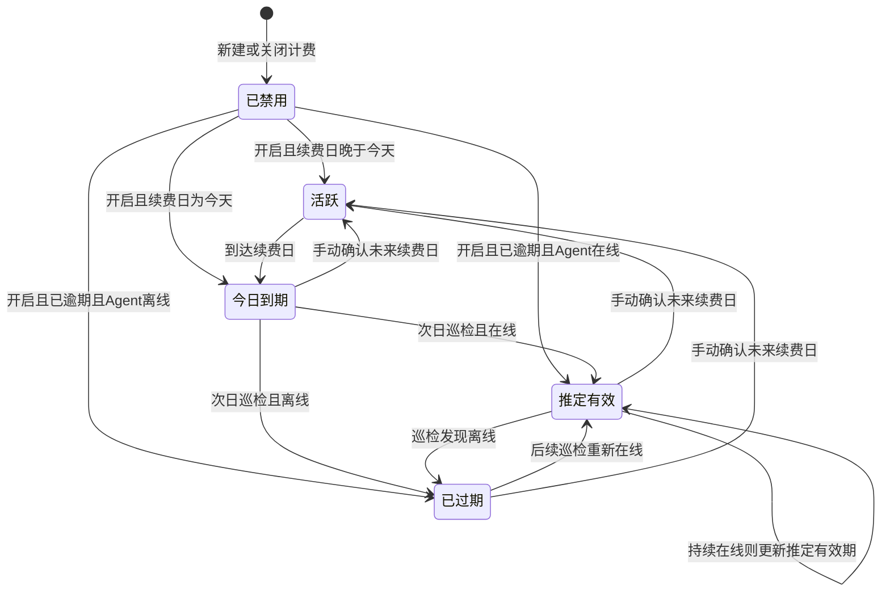
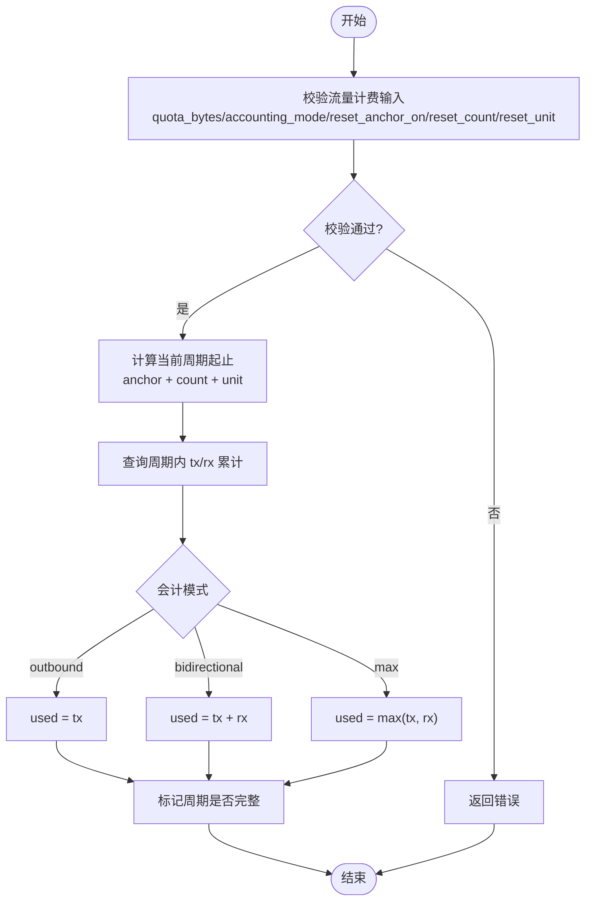
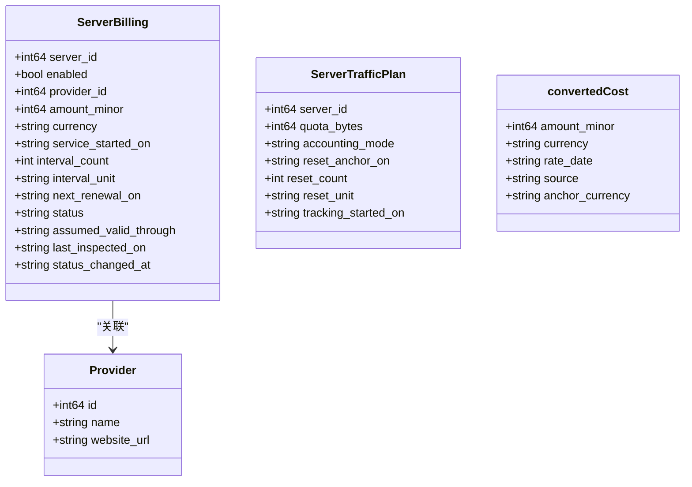
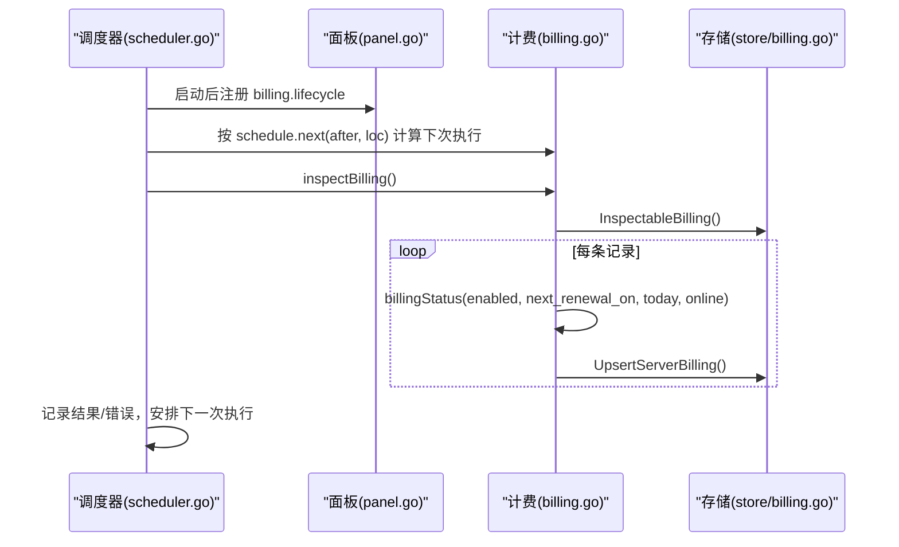
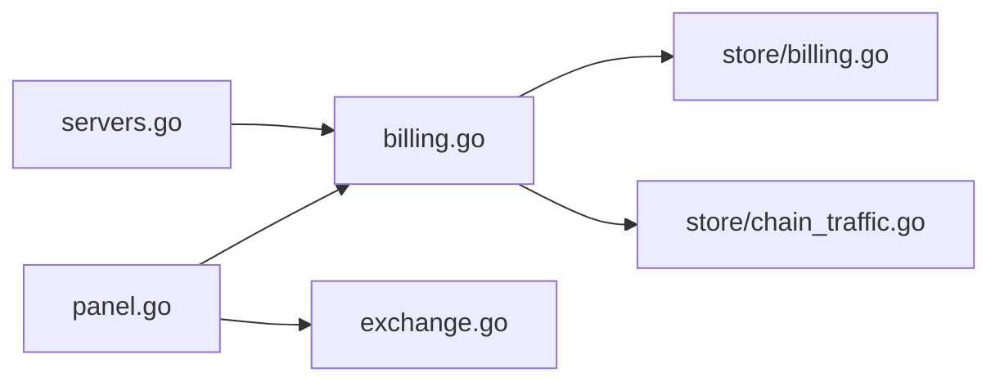

# 计费系统

<cite>
**本文引用的文件**   
- [billing.go](file://src/backend/internal/panel/billing.go)
- [billing.go](file://src/backend/internal/store/billing.go)
- [chain_traffic.go](file://src/backend/internal/store/chain_traffic.go)
- [scheduler.go](file://src/backend/internal/panel/scheduler.go)
- [panel.go](file://src/backend/internal/panel/panel.go)
- [servers.go](file://src/backend/internal/panel/servers.go)
- [exchange.go](file://src/backend/internal/panel/exchange.go)
- [billing_test.go](file://src/backend/internal/panel/billing_test.go)
- [migrations.go](file://src/backend/internal/store/migrations.go)
- [store.go](file://src/backend/internal/store/store.go)
- [billing-scheduler-design.md](file://docs/billing-scheduler-design.md)
</cite>

## 目录
1. [简介](#简介)
2. [项目结构](#项目结构)
3. [核心组件](#核心组件)
4. [架构总览](#架构总览)
5. [详细组件分析](#详细组件分析)
6. [依赖关系分析](#依赖关系分析)
7. [性能考量](#性能考量)
8. [故障排查指南](#故障排查指南)
9. [结论](#结论)
10. [附录](#附录)

## 简介
本技术文档面向 Lattix-codex 的计费子系统，系统性阐述订阅周期管理、流量统计、账单生成与汇率折算、支付状态跟踪（续费确认）、调度器机制以及数据一致性策略。文档以代码级实现为依据，辅以时序图、流程图与类图，帮助开发者快速理解并扩展计费能力。

## 项目结构
计费相关代码主要分布在后端面板层与存储层：
- 面板层（HTTP API、业务编排、调度注册）：billing.go、servers.go、panel.go、scheduler.go、exchange.go
- 存储层（数据模型、SQL 访问、迁移）：store/billing.go、store/chain_traffic.go、store/migrations.go、store/store.go
- 设计文档：docs/billing-scheduler-design.md

图表来源
- [panel.go:146-155](file://src/backend/internal/panel/panel.go#L146-L155)
- [billing.go:158-178](file://src/backend/internal/panel/billing.go#L158-L178)
- [billing.go:12-18](file://src/backend/internal/store/billing.go#L12-L18)
- [chain_traffic.go:39-104](file://src/backend/internal/store/chain_traffic.go#L39-L104)

章节来源
- [panel.go:146-155](file://src/backend/internal/panel/panel.go#L146-L155)
- [billing.go:158-178](file://src/backend/internal/panel/billing.go#L158-L178)
- [billing.go:12-18](file://src/backend/internal/store/billing.go#L12-L18)
- [chain_traffic.go:39-104](file://src/backend/internal/store/chain_traffic.go#L39-L104)

## 核心组件
- 订阅与生命周期
  - 服务商 Provider：名称唯一、可附官网地址
  - 服务器计费 ServerBilling：金额（最小单位+币种）、开通日、周期、下次续费日、状态机
  - 状态机：disabled/active/due_today/assumed_valid/expired，按续费日与 Agent 在线状态转换
- 流量计费计划
  - ServerTrafficPlan：配额（可选）、会计模式（出站/双向合计/取较大值）、重置锚点、重置周期、追踪起始日
  - 网络用量聚合：按日累计 tx/rx，支持周期起止计算与使用量折算
- 汇率与费用展示
  - 公共汇率源（默认 Frankfurter）与自定义汇率；原价与目标币种折算结果同时返回
- 调度器
  - billing.lifecycle：每日指定时间巡检续费状态
  - exchange_rates.refresh：定时刷新汇率缓存

章节来源
- [billing.go:23-56](file://src/backend/internal/panel/billing.go#L23-L56)
- [billing.go:142-156](file://src/backend/internal/panel/billing.go#L142-L156)
- [billing.go:34-40](file://src/backend/internal/panel/billing.go#L34-L40)
- [billing.go:342-352](file://src/backend/internal/panel/billing.go#L342-L352)
- [billing-scheduler-design.md:18-24](file://docs/billing-scheduler-design.md#L18-L24)
- [billing-scheduler-design.md:26-53](file://docs/billing-scheduler-design.md#L26-L53)
- [billing-scheduler-design.md:55-63](file://docs/billing-scheduler-design.md#L55-L63)

## 架构总览
计费系统由“面板服务 + 调度器 + 存储”构成。面板提供 HTTP API，负责参数校验、状态计算、数据持久化与 DTO 组装；调度器统一驱动周期性任务；存储层封装 SQL 与事务，保证数据一致性与幂等写入。

图表来源
- [panel.go:202-210](file://src/backend/internal/panel/panel.go#L202-L210)
- [billing.go:399-426](file://src/backend/internal/panel/billing.go#L399-L426)
- [billing.go:354-389](file://src/backend/internal/panel/billing.go#L354-L389)
- [billing.go:177-181](file://src/backend/internal/store/billing.go#L177-L181)
- [exchange.go:123-123](file://src/backend/internal/panel/exchange.go#L123-L123)

## 详细组件分析

### 订阅计划与生命周期
- 输入校验
  - 必填字段：服务商、金额（非负）、币种（ISO 4217）、周期（count/unit）、开通日与下次续费日（日期格式与先后关系）
  - 未启用时直接置为 disabled
- 状态机
  - enabled=false → disabled
  - renewal > today → active
  - renewal == today → due_today
  - renewal < today 且 online → assumed_valid
  - renewal < today 且 offline → expired
- 手动续费
  - 仅允许将 next_renewal_on 设置为晚于今天的日期，成功后状态置为 active，清除推定有效期限

图表来源
- [billing.go:142-156](file://src/backend/internal/panel/billing.go#L142-L156)
- [billing.go:279-313](file://src/backend/internal/panel/billing.go#L279-L313)
- [billing-scheduler-design.md:26-53](file://docs/billing-scheduler-design.md#L26-L53)

章节来源
- [billing.go:85-125](file://src/backend/internal/panel/billing.go#L85-L125)
- [billing.go:142-156](file://src/backend/internal/panel/billing.go#L142-L156)
- [billing.go:279-313](file://src/backend/internal/panel/billing.go#L279-L313)
- [billing_test.go:10-33](file://src/backend/internal/panel/billing_test.go#L10-L33)

### 流量计费与统计
- 会计模式
  - outbound：仅统计上行
  - bidirectional：上行+下行
  - max：取上下行较大值
- 周期计算
  - 基于重置锚点与周期步长（day/month/year），自动处理月末边界
- 数据聚合
  - 从 server_network_usage_daily 按区间求和得到 tx/rx
  - 使用量根据会计模式折算
- 重置策略
  - 通过 ResetAnchorOn + ResetCount + ResetUnit 定义周期；TrackingStartedOn 用于判断周期数据完整性

图表来源
- [billing.go:127-140](file://src/backend/internal/panel/billing.go#L127-L140)
- [billing.go:315-340](file://src/backend/internal/panel/billing.go#L315-L340)
- [billing.go:342-352](file://src/backend/internal/panel/billing.go#L342-L352)
- [billing.go:374-389](file://src/backend/internal/panel/billing.go#L374-L389)

章节来源
- [billing.go:127-140](file://src/backend/internal/panel/billing.go#L127-L140)
- [billing.go:315-340](file://src/backend/internal/panel/billing.go#L315-L340)
- [billing.go:342-352](file://src/backend/internal/panel/billing.go#L342-L352)
- [billing.go:374-389](file://src/backend/internal/panel/billing.go#L374-L389)
- [billing_test.go:35-48](file://src/backend/internal/panel/billing_test.go#L35-L48)

### 账单生成与费用展示
- 费用存储
  - amount_minor + currency 表示原始费用，避免组合文本歧义
- 汇率折算
  - 公共汇率：默认 Frankfurter，失败不阻断新增/编辑，保留最近缓存
  - 自定义汇率：至少一侧金额为 1，目标币种由保存时的面板币种决定；每个源币种一条记录，每个目标币种最多一个锚点
  - 响应包含 public_converted 与 custom_converted 两套折算结果
- 列表与详情
  - serverDTO 中附带 billing 与 traffic_plan 信息，便于前端渲染

图表来源
- [billing.go:20-24](file://src/backend/internal/store/billing.go#L20-L24)
- [billing.go:26-40](file://src/backend/internal/store/billing.go#L26-L40)
- [billing.go:42-50](file://src/backend/internal/store/billing.go#L42-L50)
- [billing.go:58-64](file://src/backend/internal/panel/billing.go#L58-L64)

章节来源
- [billing.go:354-389](file://src/backend/internal/panel/billing.go#L354-L389)
- [billing.go:391-397](file://src/backend/internal/panel/billing.go#L391-L397)
- [billing-scheduler-design.md:55-63](file://docs/billing-scheduler-design.md#L55-L63)

### 计费调度器
- 统一调度器 taskScheduler
  - 支持固定间隔与日历对齐触发
  - 每项任务独立超时、禁止自身重叠；失败不影响其他任务
  - 设置变更通过 NotifyChanged 唤醒循环并重新计算执行时间
- 计费生命周期任务
  - 名称：billing.lifecycle
  - 默认每天 00:05 执行，读取配置 inspectionSchedule
  - 遍历可巡检的已启用计费记录，依据续费日与 Agent 在线状态更新 status、assumed_valid_through、last_inspected_on

图表来源
- [scheduler.go:132-215](file://src/backend/internal/panel/scheduler.go#L132-L215)
- [panel.go:146-155](file://src/backend/internal/panel/panel.go#L146-L155)
- [billing.go:158-178](file://src/backend/internal/panel/billing.go#L158-L178)
- [billing.go:183-200](file://src/backend/internal/store/billing.go#L183-L200)

章节来源
- [billing-scheduler-design.md:1-16](file://docs/billing-scheduler-design.md#L1-L16)
- [scheduler.go:11-57](file://src/backend/internal/panel/scheduler.go#L11-L57)
- [panel.go:146-155](file://src/backend/internal/panel/panel.go#L146-L155)
- [billing.go:158-178](file://src/backend/internal/panel/billing.go#L158-L178)

### 数据一致性保障
- 事务与幂等
  - 流量快照 ApplyTrafficSnapshot 使用事务，确保计数器、用户/节点用量、链路与日表原子写入
  - UpsertServerBilling/UpsertServerTrafficPlan 使用 ON CONFLICT 更新，保证幂等
- 数据校验
  - 输入校验覆盖范围、格式、业务约束（如周期单位、日期先后、金额非负）
- 冲突解决
  - 流量游标 traffic_cursors 记录上次实例与计数，避免重复或回退导致的重复统计
  - chain_traffic_totals 维护余数，配合 multiplier 精确折算有效用量

章节来源
- [chain_traffic.go:39-104](file://src/backend/internal/store/chain_traffic.go#L39-L104)
- [chain_traffic.go:119-140](file://src/backend/internal/store/chain_traffic.go#L119-L140)
- [chain_traffic.go:195-223](file://src/backend/internal/store/chain_traffic.go#L195-L223)
- [billing.go:129-143](file://src/backend/internal/store/billing.go#L129-L143)
- [billing.go:167-175](file://src/backend/internal/store/billing.go#L167-L175)

## 依赖关系分析
- 模块耦合
  - panel/billing 依赖 store/billing 与 store/chain_traffic
  - panel/panel 注册调度任务并调用 panel/billing
  - panel/exchange 提供汇率折算，被 panel/billing 在 DTO 组装时调用
- 外部依赖
  - 汇率源（默认 Frankfurter）
  - 数据库（SQLite/MySQL，具体由运行时决定）

图表来源
- [panel.go:146-155](file://src/backend/internal/panel/panel.go#L146-L155)
- [billing.go:354-389](file://src/backend/internal/panel/billing.go#L354-L389)
- [billing.go:177-181](file://src/backend/internal/store/billing.go#L177-L181)
- [chain_traffic.go:39-104](file://src/backend/internal/store/chain_traffic.go#L39-L104)

章节来源
- [panel.go:146-155](file://src/backend/internal/panel/panel.go#L146-L155)
- [billing.go:354-389](file://src/backend/internal/panel/billing.go#L354-L389)
- [store/billing.go:177-181](file://src/backend/internal/store/billing.go#L177-L181)
- [store/chain_traffic.go:39-104](file://src/backend/internal/store/chain_traffic.go#L39-L104)

## 性能考量
- 批量与聚合
  - 流量统计按日聚合，减少高频写入压力；查询按区间 SUM 聚合，降低实时计算开销
- 幂等与去重
  - 游标与 ON CONFLICT 更新避免重复统计与重复写入
- 调度优化
  - 固定间隔任务从上次完成时间继续计算，避免慢任务堆积；任务独立超时与互斥，防止阻塞
- 汇率缓存
  - 刷新失败继续使用最近缓存，避免频繁外部请求影响主流程

[本节为通用指导，无需特定文件引用]

## 故障排查指南
- 常见错误
  - 服务商不存在/名称重复：检查 providers 表与创建/更新接口
  - 币种不支持：校验 ISO 4217 列表
  - 周期单位无效：确保 day/month/year
  - 日期格式或先后关系错误：校验 service_started_on 与 next_renewal_on
  - 流量计费方式无效：确保 outbound/bidirectional/max
- 定位建议
  - 查看调度日志：billing.lifecycle 失败会打印错误
  - 检查数据库表：server_billing、server_traffic_plans、traffic_cursors、chain_traffic_totals、chain_traffic_daily
  - 核对汇率缓存：exchange_rates.refresh 失败不影响新增/编辑，但会影响折算展示

章节来源
- [billing.go:85-125](file://src/backend/internal/panel/billing.go#L85-L125)
- [billing.go:127-140](file://src/backend/internal/panel/billing.go#L127-L140)
- [scheduler.go:200-202](file://src/backend/internal/panel/scheduler.go#L200-L202)
- [billing-scheduler-design.md:55-63](file://docs/billing-scheduler-design.md#L55-L63)

## 结论
计费系统以清晰的领域模型与严格的校验规则为基础，结合统一的调度器与事务化的存储层，实现了稳健的订阅生命周期管理、灵活的流量计费与多源汇率折算。通过幂等写入与游标机制，系统在并发与异常场景下仍能保证数据一致性。开发者可基于现有 API 与数据结构快速扩展新的计费策略与报表能力。

[本节为总结性内容，无需特定文件引用]

## 附录

### 计费配置示例（说明）
- 服务商
  - 名称：唯一（大小写不敏感）
  - 官网地址：可选，需为 http(s) URL
- 订阅计划
  - enabled：是否开启计费
  - provider_id：关联服务商
  - amount_minor/currency：原始费用（最小单位+币种）
  - interval_count/interval_unit：周期步长与单位
  - service_started_on/next_renewal_on：开通日与下次续费日
- 流量计费计划
  - quota_bytes：可选额度（十进制单位，1GB=10^9 bytes）
  - accounting_mode：outbound/bidirectional/max
  - reset_anchor_on/reset_count/reset_unit：重置锚点与周期
  - tracking_started_on：追踪起始日（用于周期完整性判断）

章节来源
- [billing.go:23-56](file://src/backend/internal/panel/billing.go#L23-L56)
- [billing.go:34-40](file://src/backend/internal/panel/billing.go#L34-L40)
- [billing-scheduler-design.md:18-24](file://docs/billing-scheduler-design.md#L18-L24)

### 账单查询示例（说明）
- 获取服务器列表（含计费与流量计划）
  - 接口：GET /api/server/list
  - 返回字段：billing（enabled/provider/amount/currency/period/renewal/status/converted）、traffic_plan（quota/mode/reset/usage/complete）
- 确认续费
  - 接口：POST /api/server/confirm-renewal
  - 入参：server_id、next_renewal_on（必须晚于今天）
  - 返回：status、next_renewal_on
- 汇率相关
  - 列表/刷新/保存自定义/删除自定义汇率接口见路由注册

章节来源
- [panel.go:173-210](file://src/backend/internal/panel/panel.go#L173-L210)
- [billing.go:279-313](file://src/backend/internal/panel/billing.go#L279-L313)
- [billing.go:354-389](file://src/backend/internal/panel/billing.go#L354-L389)

### 数据模型与表结构（说明）
- providers：服务商（id/name/website_url）
- server_billing：服务器计费（server_id/enabled/provider_id/amount_minor/currency/service_started_on/interval_count/interval_unit/next_renewal_on/status/assumed_valid_through/last_inspected_on/status_changed_at）
- server_traffic_plans：服务器流量计划（server_id/quota_bytes/accounting_mode/reset_anchor_on/reset_count/reset_unit/tracking_started_on）
- traffic_cursors：流量游标（server_id/counter_key/instance_id/up/down/updated_at）
- chain_traffic_totals/chain_traffic_daily：链路用量总量与日粒度明细
- 迁移与建表：migrations.go、store.go

章节来源
- [billing.go:20-40](file://src/backend/internal/store/billing.go#L20-L40)
- [chain_traffic.go:14-37](file://src/backend/internal/store/chain_traffic.go#L14-L37)
- [migrations.go:45-48](file://src/backend/internal/store/migrations.go#L45-L48)
- [store.go:72-72](file://src/backend/internal/store/store.go#L72-L72)