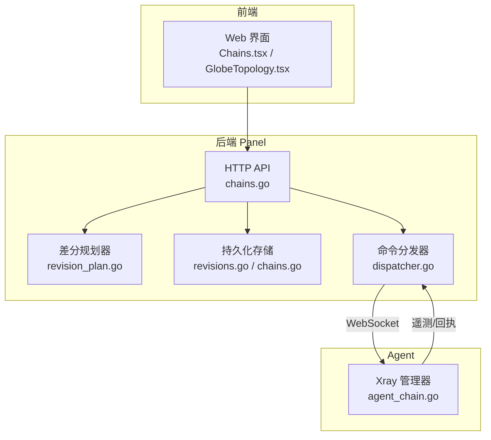
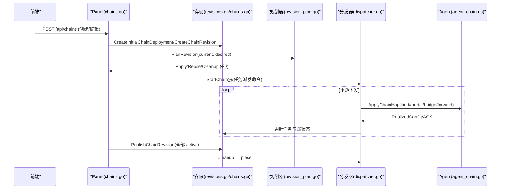
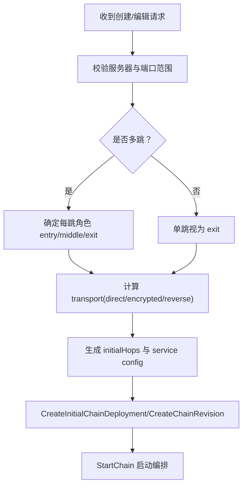
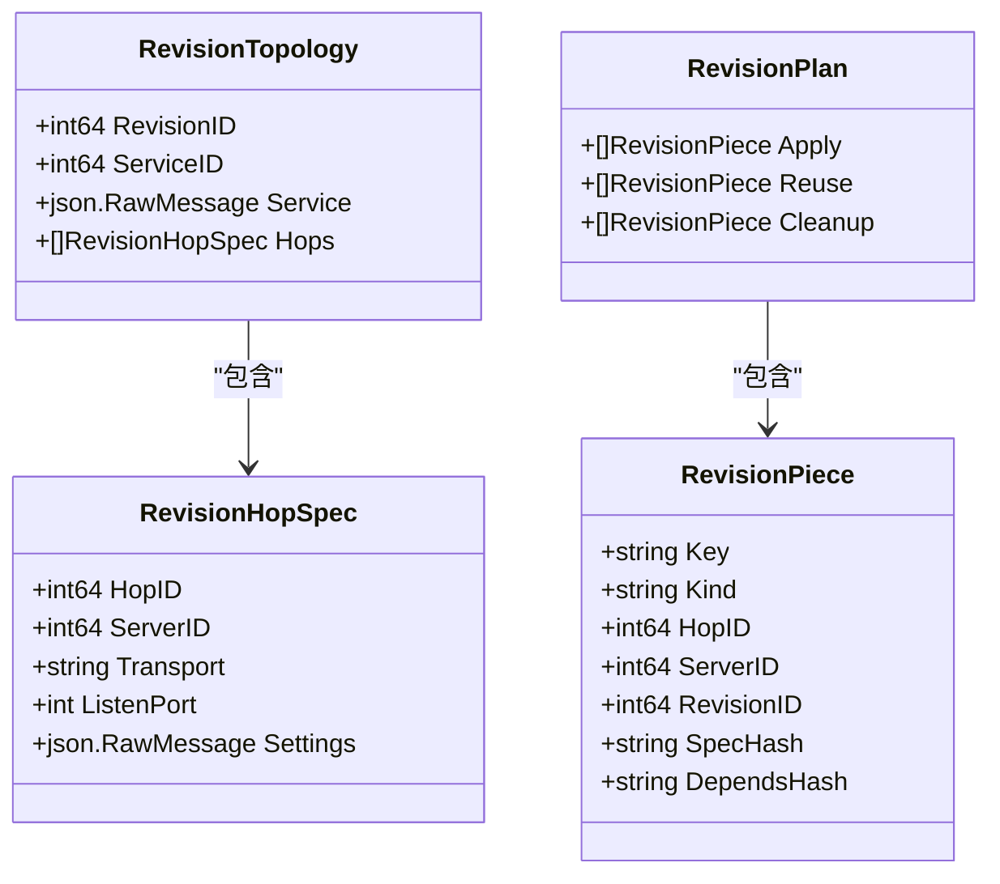
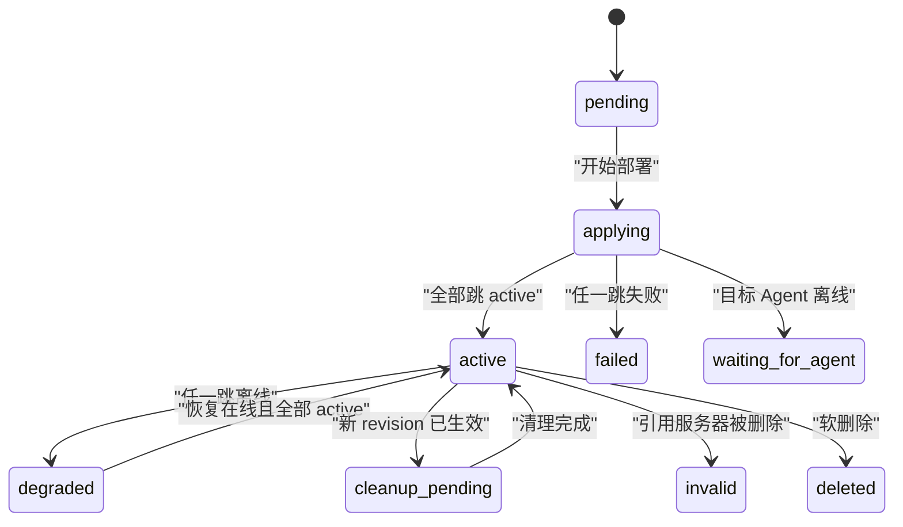
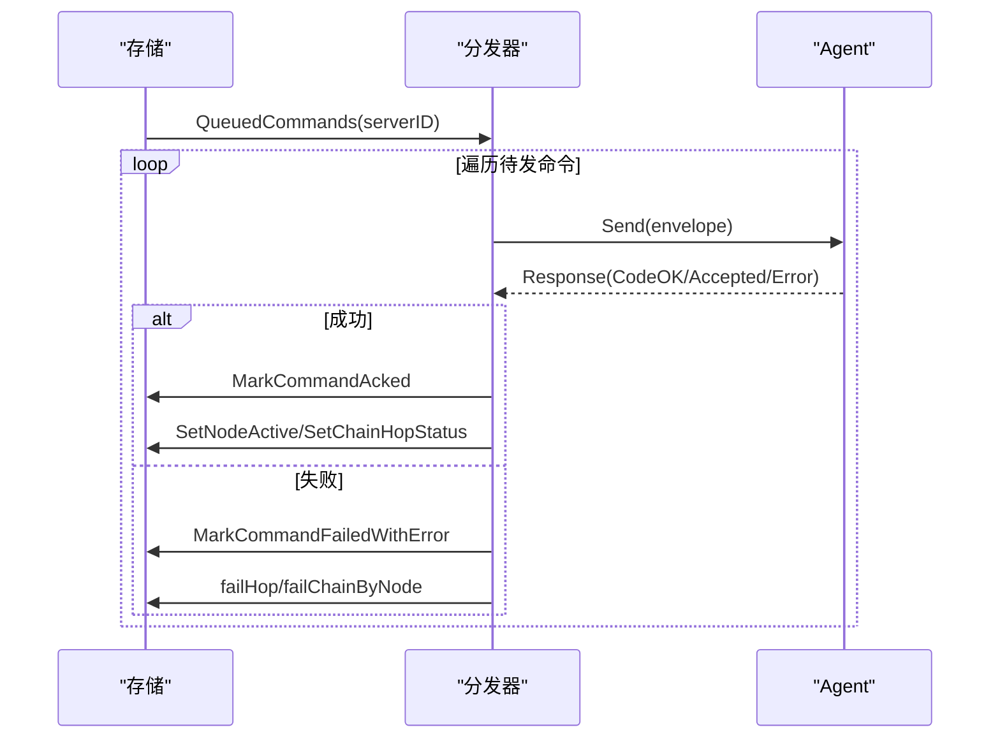
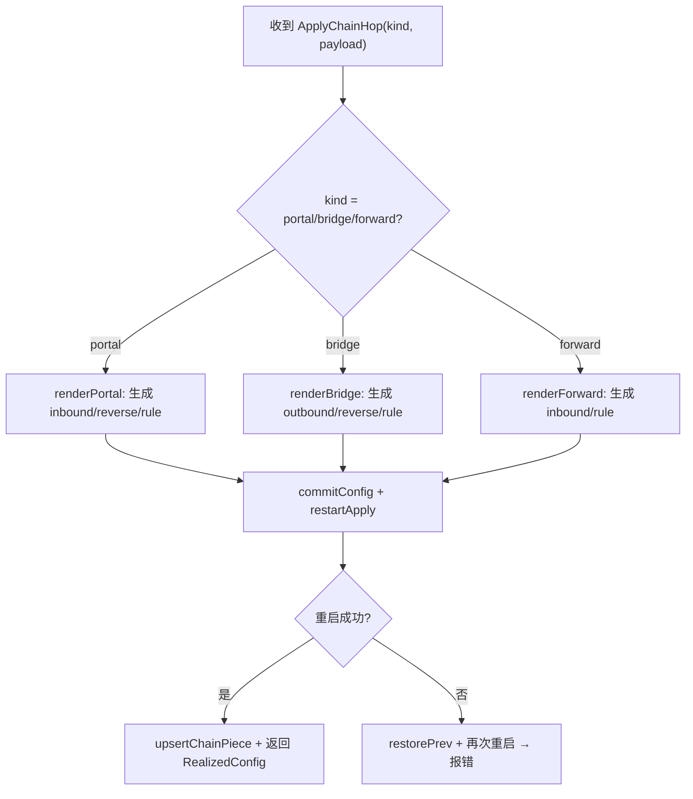
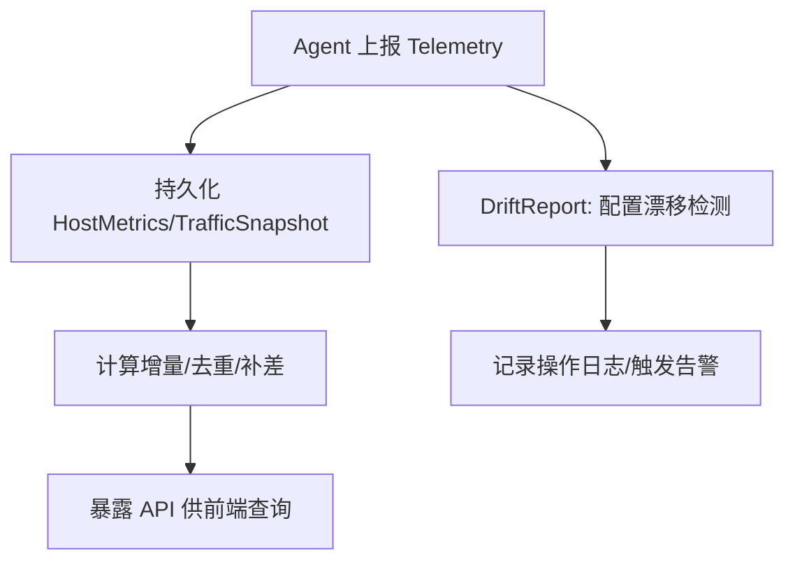
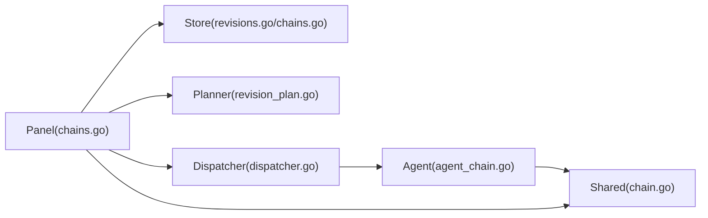

# 链路编排

<cite>
**本文引用的文件**   
- [dispatcher.go](file://src/backend/internal/dispatch/dispatcher.go)
- [chains.go](file://src/backend/internal/panel/chains.go)
- [chain-revisions-traffic-design.md](file://docs/chain-revisions-traffic-design.md)
- [revisions.go](file://src/backend/internal/store/revisions.go)
- [revision_plan.go](file://src/backend/internal/dispatch/revision_plan.go)
- [chain.go](file://src/shared/chain.go)
- [agent_chain.go](file://src/agent/internal/xray/chain.go)
- [store_chains.go](file://src/backend/internal/store/chains.go)
- [GlobeTopology.tsx](file://src/frontend/src/components/GlobeTopology.tsx)
- [Chains.tsx](file://src/frontend/src/pages/Chains.tsx)
</cite>

## 目录
1. [引言](#引言)
2. [项目结构](#项目结构)
3. [核心组件](#核心组件)
4. [架构总览](#架构总览)
5. [详细组件分析](#详细组件分析)
6. [依赖关系分析](#依赖关系分析)
7. [性能考量](#性能考量)
8. [故障排查指南](#故障排查指南)
9. [结论](#结论)
10. [附录：编排示例与配置模板](#附录：编排示例与配置模板)

## 引言
本技术文档围绕 Lattix-codex 的“链路编排”能力，系统性阐述从创建、版本化、下发执行到状态监控与优化的全链路流程。重点覆盖：
- 直连与中转链路的拓扑构建、节点选择与路由策略
- 反向隧道（Reality reverse portal/bridge）与明文加密传输的选择
- 基于内容寻址的差分发布与幂等重试
- 链路版本控制（发布、强制发布、回滚语义）、灰度发布与流量倍率
- 实时状态检测、遥测采集、告警触发与降级推导
- 部署流水线（生成计划、下发执行、回执处理、错误定位与清理）

## 项目结构
本项目采用前后端分离与 Agent 协同的架构：
- 后端 Panel：提供 HTTP API、编排器、调度器、存储层
- Agent：运行在每台受控服务器，负责渲染 Xray 配置并重启生效
- 前端：可视化拓扑、链路编辑与监控

**图表来源** 
- [chains.go:154-383](file://src/backend/internal/panel/chains.go#L154-L383)
- [revision_plan.go:57-94](file://src/backend/internal/dispatch/revision_plan.go#L57-L94)
- [revisions.go:117-262](file://src/backend/internal/store/revisions.go#L117-L262)
- [dispatcher.go:171-241](file://src/backend/internal/dispatch/dispatcher.go#L171-L241)
- [agent_chain.go:82-119](file://src/agent/internal/xray/chain.go#L82-L119)

**章节来源**
- [chains.go:154-383](file://src/backend/internal/panel/chains.go#L154-L383)
- [chain-revisions-traffic-design.md:1-173](file://docs/chain-revisions-traffic-design.md#L1-L173)

## 核心组件
- 编排控制器（Panel）：接收用户请求，校验拓扑，生成初始部署或修订快照，驱动编排生命周期
- 差分规划器：对当前与目标拓扑进行规范化求哈希，输出 apply/reuse/cleanup 任务集
- 存储层：维护链、跳、修订、任务、遥测与流量统计
- 命令分发器：将任务转为命令入队、投递、ACK 处理、失败死信与重试
- Agent：渲染 piece（portal/bridge/forward），落盘、校验、重启，上报回执与遥测

**章节来源**
- [chains.go:199-383](file://src/backend/internal/panel/chains.go#L199-L383)
- [revision_plan.go:57-94](file://src/backend/internal/dispatch/revision_plan.go#L57-L94)
- [revisions.go:117-262](file://src/backend/internal/store/revisions.go#L117-L262)
- [dispatcher.go:171-241](file://src/backend/internal/dispatch/dispatcher.go#L171-L241)
- [agent_chain.go:82-119](file://src/agent/internal/xray/chain.go#L82-L119)

## 架构总览
链路编排的核心流程如下：
- 创建/编辑链路：面板校验拓扑 → 生成初始部署或修订快照 → 写入存储 → 启动编排
- 规划阶段：计算差分 plan（service/portal/bridge/forward）→ 生成任务图
- 下发阶段：按出口→入口顺序派发 ApplyChainHop 命令 → Agent 渲染并重启
- 回执阶段：逐跳 ACK → 推进链状态 → 全部 active 后提升 published revision
- 清理阶段：移除旧 piece 并归档历史

**图表来源** 
- [chains.go:199-383](file://src/backend/internal/panel/chains.go#L199-L383)
- [revision_plan.go:57-94](file://src/backend/internal/dispatch/revision_plan.go#L57-L94)
- [revisions.go:117-262](file://src/backend/internal/store/revisions.go#L117-L262)
- [dispatcher.go:171-241](file://src/backend/internal/dispatch/dispatcher.go#L171-L241)
- [agent_chain.go:82-119](file://src/agent/internal/xray/chain.go#L82-L119)

## 详细组件分析

### 链路创建与编辑（Panel）
- 校验规则：
  - 1～4 台服务器，不可重复；非出口跳需具备入站能力
  - 入口端口可选，自动时由编排器携带候选段展开
  - 出口协议与参数校验（dokodemo-door 不能作为中转链出口）
- 拓扑构建：
  - 根据下一跳能力决定 transport：direct/encrypted/reverse
  - 反向链预生成 tunnel_uuid，short_id 由编排器派生
- 初始部署：
  - 原子写入 nodes/chains/chain_hops/revision/tasks
  - 设置 desired_revision_id，进入 applying 状态

**图表来源** 
- [chains.go:199-383](file://src/backend/internal/panel/chains.go#L199-L383)
- [revisions.go:117-262](file://src/backend/internal/store/revisions.go#L117-L262)

**章节来源**
- [chains.go:199-383](file://src/backend/internal/panel/chains.go#L199-L383)
- [revisions.go:117-262](file://src/backend/internal/store/revisions.go#L117-L262)

### 差分规划器（Planner）
- 输入：当前与目标拓扑（含 service、hop 列表与 settings）
- 输出：Apply/Reuse/Cleanup 三类 piece 集合
- 关键特性：
  - 规范化 JSON 求哈希，仅当自身 spec 与下游依赖均不变才复用
  - cleanup 排序保证入口先清理、服务最后清理
  - 支持 direct/encrypted/reverse 三种传输模式

**图表来源** 
- [revision_plan.go:20-51](file://src/backend/internal/dispatch/revision_plan.go#L20-L51)

**章节来源**
- [revision_plan.go:57-94](file://src/backend/internal/dispatch/revision_plan.go#L57-L94)

### 存储与版本控制（Store）
- 链与跳状态机：pending/applying/active/degraded/failed/waiting_for_agent/invalid/deleted
- 修订快照：不可变，记录 service/hop/apply_keys
- 任务模型：phase(action/cleanup)、kind(service/forward/portal/bridge)、status(pending/queued/acked/failed/abandoned)
- 发布机制：普通发布确认后再切换；强制发布立即生效且不可自动回滚

**图表来源** 
- [store_chains.go:12-26](file://src/backend/internal/store/chains.go#L12-L26)
- [revisions.go:14-37](file://src/backend/internal/store/revisions.go#L14-L37)

**章节来源**
- [store_chains.go:12-26](file://src/backend/internal/store/chains.go#L12-L26)
- [revisions.go:117-262](file://src/backend/internal/store/revisions.go#L117-L262)

### 命令分发与回执处理（Dispatcher）
- 入队与投递：Enqueue/Flush 支持离线排队与重发
- 回执处理：MarkCommandAcked/FailWithError，联动修订任务与跳状态
- 死信策略：超过最大尝试次数标记 dead-letter，并置相关 node/hop failed
- 链编排推进：应用节点就绪后推进链编排；全部跳 active 后提升链状态

**图表来源** 
- [dispatcher.go:171-241](file://src/backend/internal/dispatch/dispatcher.go#L171-L241)
- [dispatcher.go:626-730](file://src/backend/internal/dispatch/dispatcher.go#L626-L730)

**章节来源**
- [dispatcher.go:171-241](file://src/backend/internal/dispatch/dispatcher.go#L171-L241)
- [dispatcher.go:626-730](file://src/backend/internal/dispatch/dispatcher.go#L626-L730)

### Agent 侧 Piece 渲染与生效
- Piece 类型：portal（反向上游）、bridge（反向下游）、forward（入口/中间透传）
- 渲染流程：解析规格 → 合并现有配置 → 落盘 → 校验 → 重启（失败回滚上一份）
- 幂等性：同 hop_id+kind 重发复用端口与密钥；remove 幂等

**图表来源** 
- [agent_chain.go:82-119](file://src/agent/internal/xray/chain.go#L82-L119)
- [agent_chain.go:159-218](file://src/agent/internal/xray/chain.go#L159-L218)
- [agent_chain.go:244-286](file://src/agent/internal/xray/chain.go#L244-L286)
- [agent_chain.go:313-349](file://src/agent/internal/xray/chain.go#L313-L349)

**章节来源**
- [agent_chain.go:82-119](file://src/agent/internal/xray/chain.go#L82-L119)
- [agent_chain.go:159-218](file://src/agent/internal/xray/chain.go#L159-L218)
- [agent_chain.go:244-286](file://src/agent/internal/xray/chain.go#L244-L286)
- [agent_chain.go:313-349](file://src/agent/internal/xray/chain.go#L313-L349)

### 内部传输与路由策略
- direct：客户端协议端到端加密时使用 L4 转发
- encrypted：明文协议用于多跳时自动加密
- reverse：下游无入站能力时使用 Reality reverse portal/bridge
- 路由键：TunnelDomain(c<hopID>.lx)，tag 统一命名规范

**章节来源**
- [chain-revisions-traffic-design.md:98-104](file://docs/chain-revisions-traffic-design.md#L98-L104)
- [chain.go:12-24](file://src/shared/chain.go#L12-L24)

### 链路状态监控与遥测
- 遥测上报：主机指标、Xray 版本、流量绝对值快照
- 流量口径：出口 service inbound 为权威总量；入口 forward 对账；中间 hop 仅展示
- 降级推导：任一跳离线 → degraded；全部恢复 → active
- 告警：配置漂移、节点失败、命令死信

**图表来源** 
- [dispatcher.go:554-592](file://src/backend/internal/dispatch/dispatcher.go#L554-L592)
- [dispatcher.go:594-623](file://src/backend/internal/dispatch/dispatcher.go#L594-L623)

**章节来源**
- [dispatcher.go:554-592](file://src/backend/internal/dispatch/dispatcher.go#L554-L592)
- [dispatcher.go:594-623](file://src/backend/internal/dispatch/dispatcher.go#L594-L623)
- [chain-revisions-traffic-design.md:105-137](file://docs/chain-revisions-traffic-design.md#L105-L137)

### 前端可视化与交互
- 拓扑视图：地球仪上展示节点位置、在线状态、上下行速率
- 链路卡片：显示名称、类型（直连/中转）、状态、时间戳、流量信息
- 状态映射：active_unconfirmed/waiting_for_agent/cleanup_pending 等状态在前端映射为直观标签

**章节来源**
- [GlobeTopology.tsx:91-120](file://src/frontend/src/components/GlobeTopology.tsx#L91-L120)
- [Chains.tsx:891-912](file://src/frontend/src/pages/Chains.tsx#L891-L912)

## 依赖关系分析
- Panel 依赖 Store 进行数据持久化与状态管理
- Panel 依赖 Planner 生成差分计划
- Panel 依赖 Dispatcher 投递命令与处理回执
- Agent 依赖 Manager 渲染与重启 Xray
- 共享常量与类型定义位于 shared 包

**图表来源** 
- [chains.go:1-17](file://src/backend/internal/panel/chains.go#L1-L17)
- [revisions.go:1-12](file://src/backend/internal/store/revisions.go#L1-L12)
- [revision_plan.go:1-11](file://src/backend/internal/dispatch/revision_plan.go#L1-L11)
- [dispatcher.go:1-22](file://src/backend/internal/dispatch/dispatcher.go#L1-L22)
- [agent_chain.go:1-14](file://src/agent/internal/xray/chain.go#L1-L14)
- [chain.go:1-24](file://src/shared/chain.go#L1-L24)

**章节来源**
- [chains.go:1-17](file://src/backend/internal/panel/chains.go#L1-L17)
- [revisions.go:1-12](file://src/backend/internal/store/revisions.go#L1-L12)
- [revision_plan.go:1-11](file://src/backend/internal/dispatch/revision_plan.go#L1-L11)
- [dispatcher.go:1-22](file://src/backend/internal/dispatch/dispatcher.go#L1-L22)
- [agent_chain.go:1-14](file://src/agent/internal/xray/chain.go#L1-L14)
- [chain.go:1-24](file://src/shared/chain.go#L1-L24)

## 性能考量
- 幂等与复用：通过规范化哈希避免不必要的重建，减少重启次数
- 离线队列：命令离线滞留，重连后补发，避免阻塞
- 流量统计：绝对值快照去重与补差，降低重复计算开销
- 并发控制：每服务器独立锁，避免并发 Flush 重复投递

[本节为通用指导，不直接分析具体文件]

## 故障排查指南
- 命令死信：检查 attempts 是否达到上限，查看 dead-letter 日志与节点/跳状态
- 回执失败：定位具体 hop 的错误消息，检查 Agent 是否在线与配置是否正确
- 配置漂移：关注 DriftReport 告警，修复外部修改后重新同步
- 版本不一致：确保 Panel 与 Agent 版本一致，必要时触发升级

**章节来源**
- [dispatcher.go:191-226](file://src/backend/internal/dispatch/dispatcher.go#L191-L226)
- [dispatcher.go:626-730](file://src/backend/internal/dispatch/dispatcher.go#L626-L730)
- [dispatcher.go:594-623](file://src/backend/internal/dispatch/dispatcher.go#L594-L623)

## 结论
Lattix-codex 的链路编排通过“差分规划 + 幂等下发 + 回执推进”的闭环，实现了稳定、可观测、可回滚的链路管理能力。结合严格的拓扑校验、内容寻址与状态机，确保了在高可用与一致性之间的平衡。未来可在负载均衡、智能路由与动态调整方面进一步扩展。

[本节为总结，不直接分析具体文件]

## 附录：编排示例与配置模板
- 直连链路：单跳 exit，端口由入口或出口指定
- 中转链路：entry → middle(s) → exit，transport 自动选择
- 反向链：下游无入站能力时启用 portal/bridge，tunnel_domain 唯一标识
- 流量倍率：链级配置，默认 1.000，范围 0.001～1000.000

示例参考：
- 创建链路请求体字段见 [chains.go:175-184](file://src/backend/internal/panel/chains.go#L175-L184)
- 修订快照结构见 [revisions.go:51-60](file://src/backend/internal/store/revisions.go#L51-L60)
- Piece 类型与 tag 定义见 [chain.go:5-24](file://src/shared/chain.go#L5-L24)

**章节来源**
- [chains.go:175-184](file://src/backend/internal/panel/chains.go#L175-L184)
- [revisions.go:51-60](file://src/backend/internal/store/revisions.go#L51-L60)
- [chain.go:5-24](file://src/shared/chain.go#L5-L24)