# 中间件系统

<cite>
**本文引用的文件**   
- [context.go](file://src/backend/internal/logging/context.go)
- [http.go](file://src/backend/internal/logging/http.go)
- [request.go](file://src/backend/internal/logging/request.go)
- [operation.go](file://src/backend/internal/logging/operation.go)
- [alert.go](file://src/backend/internal/alert/alert.go)
- [logging-design.md](file://docs/logging-design.md)
- [auth.go](file://src/backend/internal/panel/auth.go)
- [hub.go](file://src/backend/internal/ws/hub.go)
- [agent.go](file://src/backend/internal/ws/agent.go)
- [metrics.go](file://src/backend/internal/panel/metrics.go)
</cite>

## 目录
1. [简介](#简介)
2. [项目结构](#项目结构)
3. [核心组件](#核心组件)
4. [架构总览](#架构总览)
5. [详细组件分析](#详细组件分析)
6. [依赖关系分析](#依赖关系分析)
7. [性能考量](#性能考量)
8. [故障排查指南](#故障排查指南)
9. [结论](#结论)
10. [附录](#附录)

## 简介
本技术文档面向 Lattix-codex 后端服务的中间件系统，聚焦以下方面：
- 日志记录中间件：请求日志、操作日志、结构化日志与脱敏策略
- 告警通知机制：事件监听、告警规则、通知渠道（Webhook/Telegram）、去重策略
- 中间件执行顺序与管道模式：注册、链式调用、错误传播
- 性能监控与指标收集：请求耗时、资源使用、业务指标
- 自定义中间件开发指南与最佳实践

## 项目结构
后端中间件与日志能力主要位于 backend/internal 下的 logging、alert、panel、ws 等包中。设计文档 logging-design.md 对日志体系进行了完整说明。

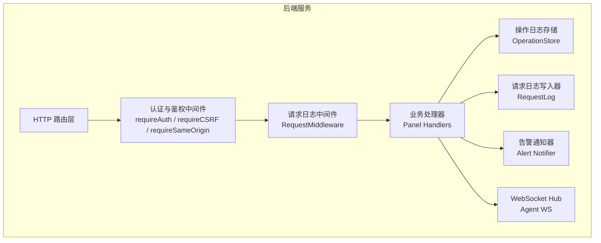

图表来源
- [auth.go:197-269](file://src/backend/internal/panel/auth.go#L197-L269)
- [http.go:43-82](file://src/backend/internal/logging/http.go#L43-L82)
- [operation.go:116-136](file://src/backend/internal/logging/operation.go#L116-L136)
- [request.go:90-105](file://src/backend/internal/logging/request.go#L90-L105)
- [alert.go:106-133](file://src/backend/internal/alert/alert.go#L106-L133)
- [hub.go:25-46](file://src/backend/internal/ws/hub.go#L25-L46)

章节来源
- [logging-design.md:1-311](file://docs/logging-design.md#L1-L311)

## 核心组件
- 请求上下文元数据：在请求上下文中注入 RequestID、TraceID、RPCCode、SafeMessage、幂等重放标记及白名单属性
- HTTP 请求日志中间件：统一采集请求元数据、响应状态码、耗时、IP、UA、参数脱敏、严重级别判定、WebSocket 握手与命令型 RPC 记录
- 请求日志持久化：异步 JSONL 分段写入、容量限制、尾部读取、清理与状态查询
- 操作日志持久化：SQLite 独立库、固定类别与动作、分页查询、清空审计、运行生命周期标记
- 告警通知器：基于设置表配置，支持 Webhook 与 Telegram 双通道，内存防抖动窗口，异步发送不阻塞主路径
- 认证与 CSRF 中间件：会话校验、更新中锁定、同源校验、CSRF Token 校验

章节来源
- [context.go:10-67](file://src/backend/internal/logging/context.go#L10-L67)
- [http.go:43-82](file://src/backend/internal/logging/http.go#L43-L82)
- [request.go:90-105](file://src/backend/internal/logging/request.go#L90-L105)
- [operation.go:116-136](file://src/backend/internal/logging/operation.go#L116-L136)
- [alert.go:106-133](file://src/backend/internal/alert/alert.go#L106-L133)
- [auth.go:197-269](file://src/backend/internal/panel/auth.go#L197-L269)

## 架构总览
中间件以 Go 标准库 http.Handler 为契约，形成“外层通用横切能力 + 内层业务处理”的管道。请求进入后依次经过认证、鉴权、请求日志等中间件，最终到达业务处理器；响应返回时由请求日志中间件统一收尾并落盘。

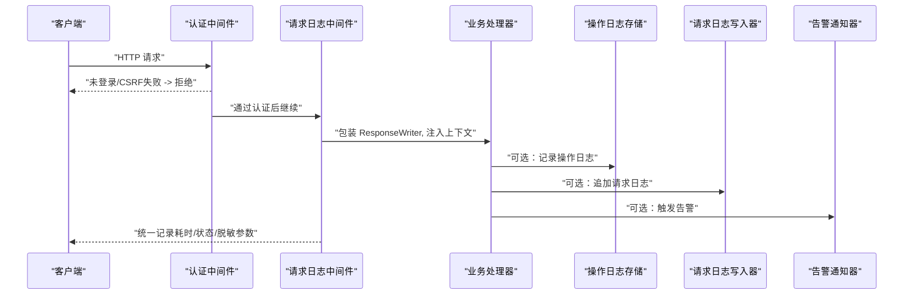

图表来源
- [auth.go:197-269](file://src/backend/internal/panel/auth.go#L197-L269)
- [http.go:43-82](file://src/backend/internal/logging/http.go#L43-L82)
- [operation.go:142-182](file://src/backend/internal/logging/operation.go#L142-L182)
- [request.go:115-129](file://src/backend/internal/logging/request.go#L115-L129)
- [alert.go:106-133](file://src/backend/internal/alert/alert.go#L106-L133)

## 详细组件分析

### 请求上下文与结构化元数据
- 通过 WithRequestMeta 将 RequestID、TraceID 注入请求上下文
- 提供 RequestID、TraceID 访问器
- 允许业务处理器通过 SetRPCOutcome、SetIdempotencyReplayed、AddSafeAttribute 补充结果与安全属性
- 安全属性仅接受白名单字段，避免任意 body 泄露

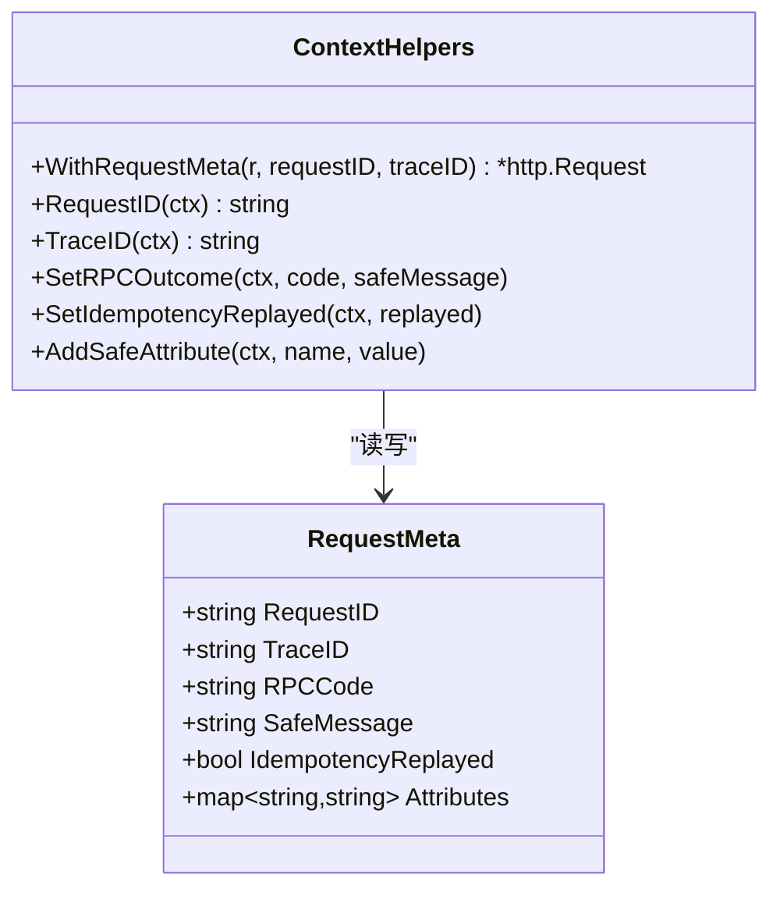

图表来源
- [context.go:10-67](file://src/backend/internal/logging/context.go#L10-L67)

章节来源
- [context.go:10-67](file://src/backend/internal/logging/context.go#L10-L67)

### HTTP 请求日志中间件
- 生成或复用 X-Request-ID/X-Trace-ID，并在响应头回写
- 根据策略决定是否记录（full/failures_only/none）
- 封装 ResponseWriter 捕获状态码、字节数、错误摘要
- 计算严重级别（info/warning/error），合并 attributes，脱敏敏感参数
- WebSocket 升级立即记录 101，命令型 WS RPC 按协议错误与业务码记录

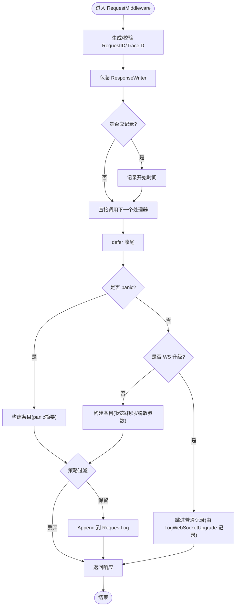

图表来源
- [http.go:43-82](file://src/backend/internal/logging/http.go#L43-L82)
- [http.go:107-152](file://src/backend/internal/logging/http.go#L107-L152)
- [http.go:166-183](file://src/backend/internal/logging/http.go#L166-L183)
- [http.go:185-204](file://src/backend/internal/logging/http.go#L185-L204)
- [http.go:226-228](file://src/backend/internal/logging/http.go#L226-L228)
- [http.go:252-290](file://src/backend/internal/logging/http.go#L252-L290)

章节来源
- [http.go:43-82](file://src/backend/internal/logging/http.go#L43-L82)
- [http.go:107-152](file://src/backend/internal/logging/http.go#L107-L152)
- [http.go:166-183](file://src/backend/internal/logging/http.go#L166-L183)
- [http.go:185-204](file://src/backend/internal/logging/http.go#L185-L204)
- [http.go:226-228](file://src/backend/internal/logging/http.go#L226-L228)
- [http.go:252-290](file://src/backend/internal/logging/http.go#L252-L290)

### 请求日志持久化（JSONL）
- 异步队列（容量 1024），单协程串行写入
- 分段归档：当前段 requests-current.jsonl，达到目标大小后重命名为带时间戳的归档段
- 容量控制：默认 10 MiB，可配置 1–1024 MiB；超过容量删除最旧归档段
- 尾部读取：从各分段尾部高效读取最近 N 行（10/30/50/100）
- 清理与状态：支持清空、查询占用、丢弃计数上报

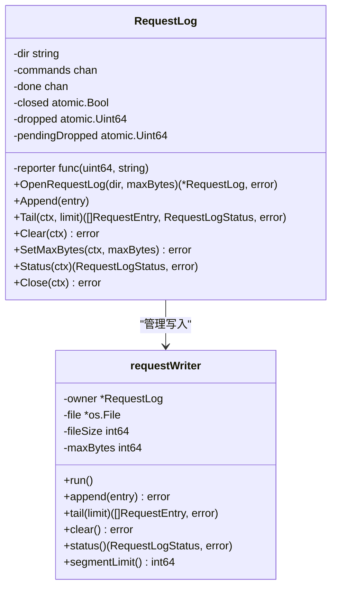

图表来源
- [request.go:90-105](file://src/backend/internal/logging/request.go#L90-L105)
- [request.go:115-129](file://src/backend/internal/logging/request.go#L115-L129)
- [request.go:205-244](file://src/backend/internal/logging/request.go#L205-L244)
- [request.go:246-263](file://src/backend/internal/logging/request.go#L246-L263)
- [request.go:293-312](file://src/backend/internal/logging/request.go#L293-L312)
- [request.go:314-333](file://src/backend/internal/logging/request.go#L314-L333)
- [request.go:355-382](file://src/backend/internal/logging/request.go#L355-L382)
- [request.go:384-393](file://src/backend/internal/logging/request.go#L384-L393)
- [request.go:395-401](file://src/backend/internal/logging/request.go#L395-L401)

章节来源
- [request.go:90-105](file://src/backend/internal/logging/request.go#L90-L105)
- [request.go:115-129](file://src/backend/internal/logging/request.go#L115-L129)
- [request.go:205-244](file://src/backend/internal/logging/request.go#L205-L244)
- [request.go:246-263](file://src/backend/internal/logging/request.go#L246-L263)
- [request.go:293-312](file://src/backend/internal/logging/request.go#L293-L312)
- [request.go:314-333](file://src/backend/internal/logging/request.go#L314-L333)
- [request.go:355-382](file://src/backend/internal/logging/request.go#L355-L382)
- [request.go:384-393](file://src/backend/internal/logging/request.go#L384-L393)
- [request.go:395-401](file://src/backend/internal/logging/request.go#L395-L401)

### 操作日志（SQLite）
- 独立 SQLite 文件 operation.db，单连接，事务写入
- 固定类别（server/chain/user/settings/panel/agent/command/auth/log）与稳定动作名
- 支持按 severity/category/server/operator/query/time 范围查询与分页
- 每次写入后裁剪至最大条数（默认 1000，范围 100–100000）
- 面板启停生命周期：启动写入 started/unclean_shutdown，停止写入 stopped 并清理运行标记

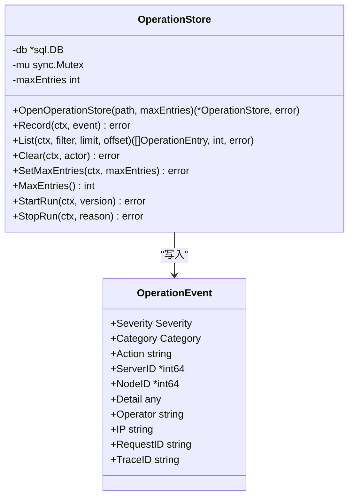

图表来源
- [operation.go:116-136](file://src/backend/internal/logging/operation.go#L116-L136)
- [operation.go:142-182](file://src/backend/internal/logging/operation.go#L142-L182)
- [operation.go:184-228](file://src/backend/internal/logging/operation.go#L184-L228)
- [operation.go:230-261](file://src/backend/internal/logging/operation.go#L230-L261)
- [operation.go:276-324](file://src/backend/internal/logging/operation.go#L276-L324)
- [operation.go:326-352](file://src/backend/internal/logging/operation.go#L326-L352)

章节来源
- [operation.go:116-136](file://src/backend/internal/logging/operation.go#L116-L136)
- [operation.go:142-182](file://src/backend/internal/logging/operation.go#L142-L182)
- [operation.go:184-228](file://src/backend/internal/logging/operation.go#L184-L228)
- [operation.go:230-261](file://src/backend/internal/logging/operation.go#L230-L261)
- [operation.go:276-324](file://src/backend/internal/logging/operation.go#L276-L324)
- [operation.go:326-352](file://src/backend/internal/logging/operation.go#L326-L352)

### 告警通知机制
- 事件类型：server_offline、config_drift、node_failed、chain_degraded
- 配置来源：settings 表（webhook URL、Telegram Bot Token、Chat ID）
- 去重策略：内存 map 记录 key="<serverID>|<event>" 上次发送时间，默认 5 分钟窗口
- 发送通道：Webhook POST JSON、Telegram sendMessage 纯文本
- 异步发送：超时 5s，失败仅记日志，不阻塞主路径
- 测试接口：Test 同步发送测试消息并返回各通道配置与结果

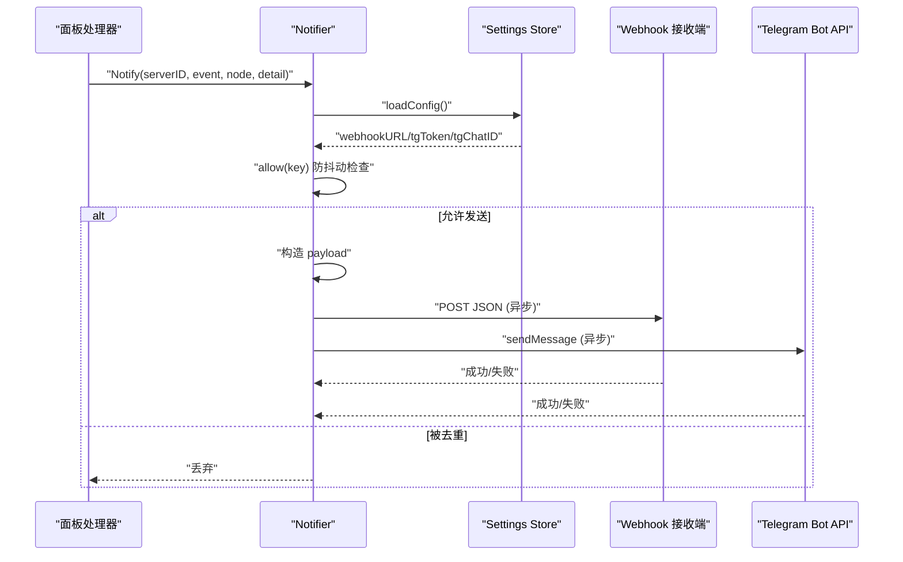

图表来源
- [alert.go:106-133](file://src/backend/internal/alert/alert.go#L106-L133)
- [alert.go:136-144](file://src/backend/internal/alert/alert.go#L136-L144)
- [alert.go:159-173](file://src/backend/internal/alert/alert.go#L159-L173)
- [alert.go:184-205](file://src/backend/internal/alert/alert.go#L184-L205)
- [alert.go:208-221](file://src/backend/internal/alert/alert.go#L208-L221)

章节来源
- [alert.go:106-133](file://src/backend/internal/alert/alert.go#L106-L133)
- [alert.go:136-144](file://src/backend/internal/alert/alert.go#L136-L144)
- [alert.go:159-173](file://src/backend/internal/alert/alert.go#L159-L173)
- [alert.go:184-205](file://src/backend/internal/alert/alert.go#L184-L205)
- [alert.go:208-221](file://src/backend/internal/alert/alert.go#L208-L221)

### 认证与 CSRF 中间件
- requireAuth：校验会话 Cookie，更新进行中拒绝非进度轮询接口
- requireCSRF：校验 X-CSRF-Token，防止跨站请求伪造
- requireSameOrigin：校验 Origin/Referer 同源，HTTPS 下禁止 HTTP 来源

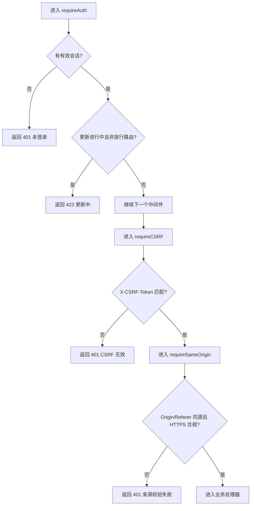

图表来源
- [auth.go:197-269](file://src/backend/internal/panel/auth.go#L197-L269)

章节来源
- [auth.go:197-269](file://src/backend/internal/panel/auth.go#L197-L269)

### WebSocket 中间件与链路
- Hub.ServeHTTP：鉴权、生命周期检查、握手错误处理
- OnUpgrade：握手成功后立即记录 101 请求日志
- OnConnect/OnOnline/OnReconnect/OnDisconnect：真实状态跃迁挂点，用于操作日志与告警

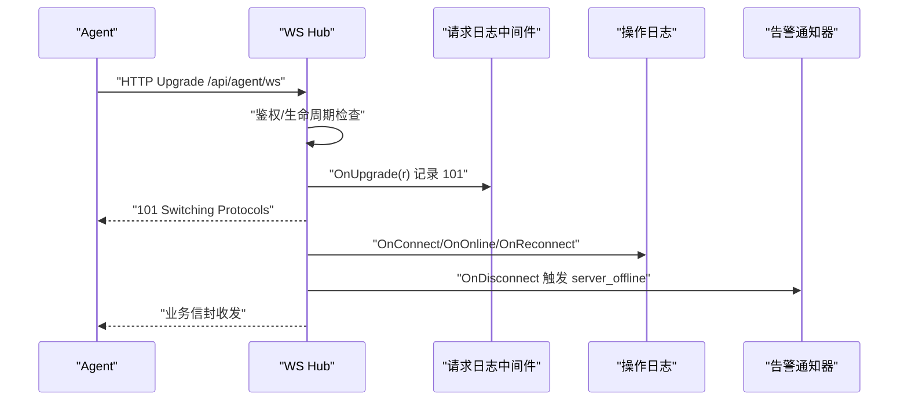

图表来源
- [agent.go:31-63](file://src/backend/internal/ws/agent.go#L31-L63)
- [hub.go:25-46](file://src/backend/internal/ws/hub.go#L25-L46)
- [http.go:84-105](file://src/backend/internal/logging/http.go#L84-L105)

章节来源
- [agent.go:31-63](file://src/backend/internal/ws/agent.go#L31-L63)
- [hub.go:25-46](file://src/backend/internal/ws/hub.go#L25-L46)
- [http.go:84-105](file://src/backend/internal/logging/http.go#L84-L105)

### 性能监控与指标收集
- 请求耗时：RequestMiddleware 自动记录 duration_ms
- 资源使用：Agent 侧 telemetry 采集主机负载、CPU、内存、磁盘、网络、xray 流量计数器
- 业务指标：服务器指标历史与样本接口（CPU%、内存使用率、磁盘使用率、网络吞吐、延迟）
- 前端展示：ServerMonitor 组件聚合趋势图与详情面板

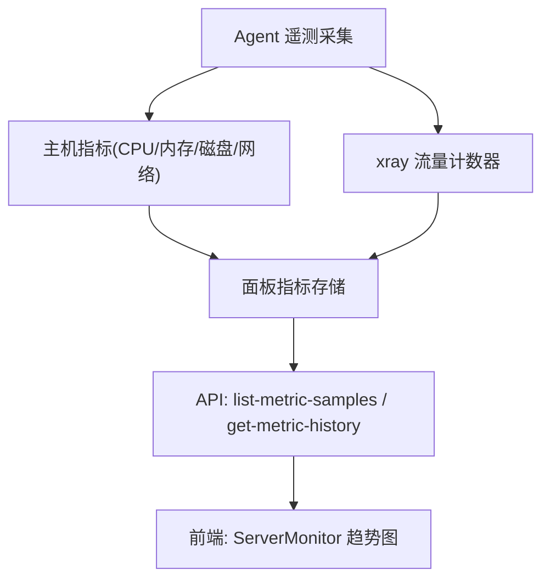

图表来源
- [metrics.go:34-64](file://src/backend/internal/panel/metrics.go#L34-L64)
- [metrics.go:66-99](file://src/backend/internal/panel/metrics.go#L66-L99)

章节来源
- [metrics.go:34-64](file://src/backend/internal/panel/metrics.go#L34-L64)
- [metrics.go:66-99](file://src/backend/internal/panel/metrics.go#L66-L99)

## 依赖关系分析
- 中间件耦合度低：每个中间件实现 http.Handler，职责单一，易于组合
- 日志子系统解耦：请求日志与操作日志分别持久化，互不影响
- 告警通知器依赖 store.Settings 与外部 HTTP 客户端，内部无强依赖
- WebSocket Hub 通过回调钩子与日志、告警、操作日志解耦

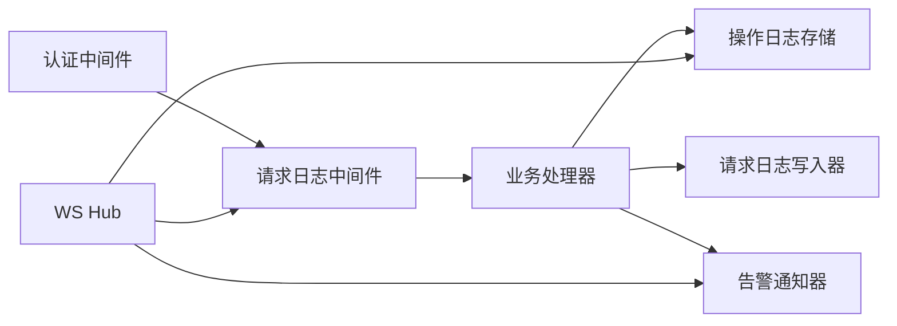

图表来源
- [auth.go:197-269](file://src/backend/internal/panel/auth.go#L197-L269)
- [http.go:43-82](file://src/backend/internal/logging/http.go#L43-L82)
- [operation.go:116-136](file://src/backend/internal/logging/operation.go#L116-L136)
- [request.go:90-105](file://src/backend/internal/logging/request.go#L90-L105)
- [alert.go:106-133](file://src/backend/internal/alert/alert.go#L106-L133)
- [agent.go:31-63](file://src/backend/internal/ws/agent.go#L31-L63)

章节来源
- [auth.go:197-269](file://src/backend/internal/panel/auth.go#L197-L269)
- [http.go:43-82](file://src/backend/internal/logging/http.go#L43-L82)
- [operation.go:116-136](file://src/backend/internal/logging/operation.go#L116-L136)
- [request.go:90-105](file://src/backend/internal/logging/request.go#L90-L105)
- [alert.go:106-133](file://src/backend/internal/alert/alert.go#L106-L133)
- [agent.go:31-63](file://src/backend/internal/ws/agent.go#L31-L63)

## 性能考量
- 请求日志异步写入：内存队列 1024，单协程串行写入，避免阻塞 HTTP 响应
- 分段与容量控制：默认 10 MiB，单段目标为总容量的 1/10（最小 64 KiB），超量删除最旧归档段
- 尾部读取优化：只扫描各分段尾部，减少 I/O
- 操作日志单连接与事务：降低并发竞争，保证一致性
- 告警通知异步发送：超时 5s，失败不阻塞主路径
- 脱敏与截断：参数值与错误摘要限制长度，attributes 总量限制，避免大对象影响性能

章节来源
- [request.go:205-244](file://src/backend/internal/logging/request.go#L205-L244)
- [request.go:293-312](file://src/backend/internal/logging/request.go#L293-L312)
- [request.go:314-333](file://src/backend/internal/logging/request.go#L314-L333)
- [request.go:355-382](file://src/backend/internal/logging/request.go#L355-L382)
- [operation.go:116-136](file://src/backend/internal/logging/operation.go#L116-L136)
- [alert.go:106-133](file://src/backend/internal/alert/alert.go#L106-L133)
- [http.go:252-290](file://src/backend/internal/logging/http.go#L252-L290)

## 故障排查指南
- 请求日志丢失：检查队列是否已满、日志是否已关闭、文件写入是否失败；查看 dropped 计数与 pendingDropped 上报
- 操作日志写入失败：确认 SQLite 文件权限、连接池、事务提交；查看进程标准日志
- 告警未送达：检查 settings 配置是否齐全、网络连通性、Webhook/Telegram 返回码；查看发送失败日志
- WebSocket 握手失败：检查鉴权、生命周期状态、OnUpgrade 回调是否记录 101
- 性能问题：观察请求耗时分布、日志分段数量与容量、告警发送超时与重试情况

章节来源
- [request.go:115-129](file://src/backend/internal/logging/request.go#L115-L129)
- [request.go:205-244](file://src/backend/internal/logging/request.go#L205-L244)
- [operation.go:142-182](file://src/backend/internal/logging/operation.go#L142-L182)
- [alert.go:159-173](file://src/backend/internal/alert/alert.go#L159-L173)
- [agent.go:31-63](file://src/backend/internal/ws/agent.go#L31-L63)

## 结论
本中间件系统以标准化 http.Handler 为核心，结合结构化日志、独立持久化与异步写入，实现了高可用、低耦合、易扩展的后端横切能力。告警通知器与 WebSocket 钩子提供了事件驱动的运维反馈闭环。通过严格的脱敏与容量控制，系统在安全性与性能之间取得平衡。开发者可基于现有模式快速扩展自定义中间件。

## 附录

### 自定义中间件开发指南
- 实现 http.Handler 接口，遵循“先入后出”的链式调用约定
- 使用 WithRequestMeta 注入 RequestID/TraceID，并通过 SetRPCOutcome/SetIdempotencyReplayed/AddSafeAttribute 补充结构化元数据
- 如需记录请求日志，使用 RequestMiddleware 提供的策略与脱敏能力；如需记录操作日志，使用 OperationStore.Record
- 如需触发告警，使用 Notifier.Notify，注意防抖动键与异步发送特性
- 错误处理：优先返回标准 RPC 错误码，避免泄露敏感信息；必要时记录操作日志与告警

章节来源
- [context.go:10-67](file://src/backend/internal/logging/context.go#L10-L67)
- [http.go:43-82](file://src/backend/internal/logging/http.go#L43-L82)
- [operation.go:142-182](file://src/backend/internal/logging/operation.go#L142-L182)
- [alert.go:106-133](file://src/backend/internal/alert/alert.go#L106-L133)