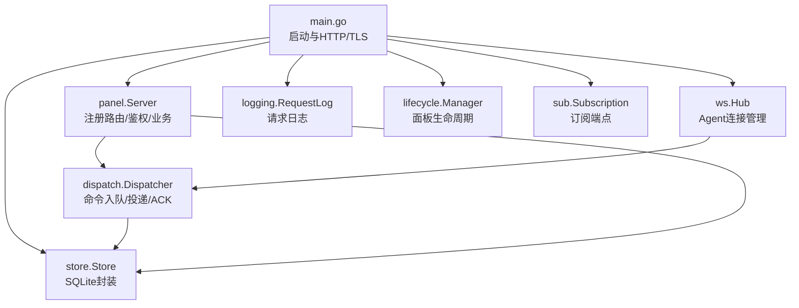
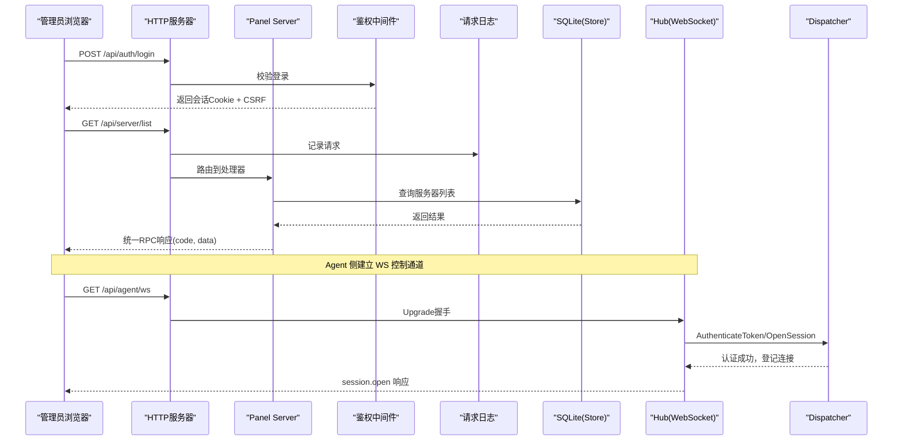
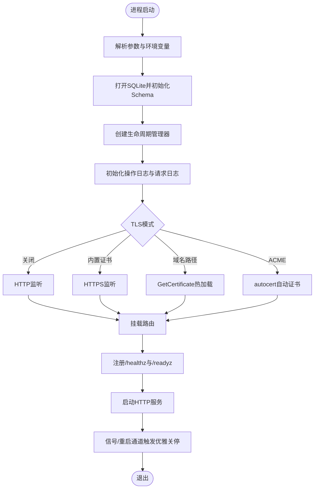
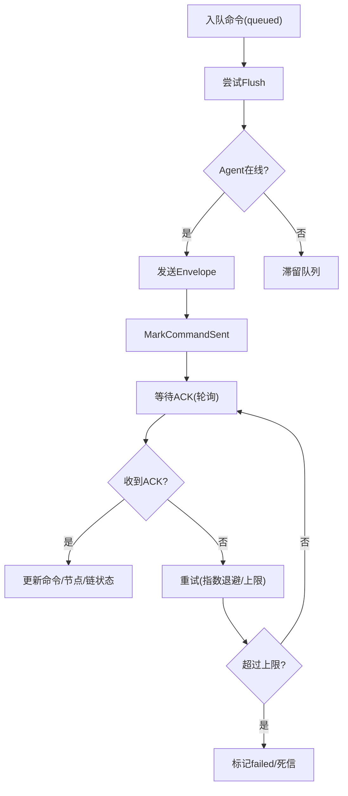
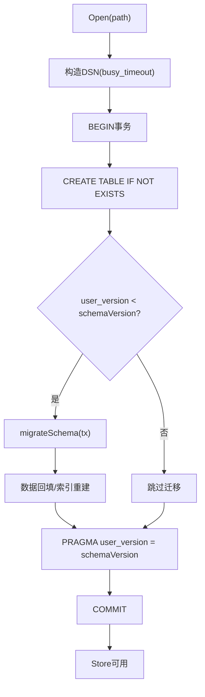
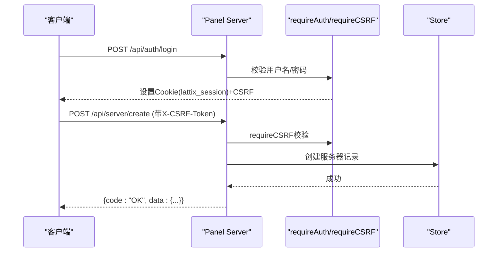
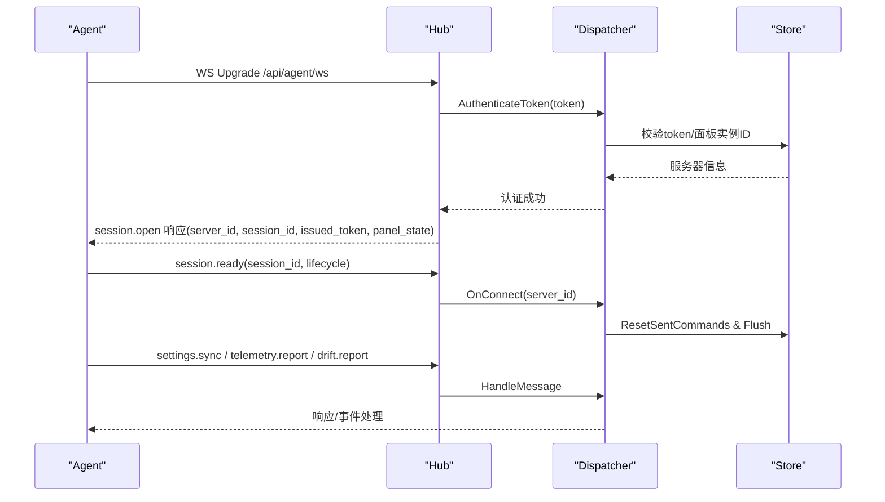
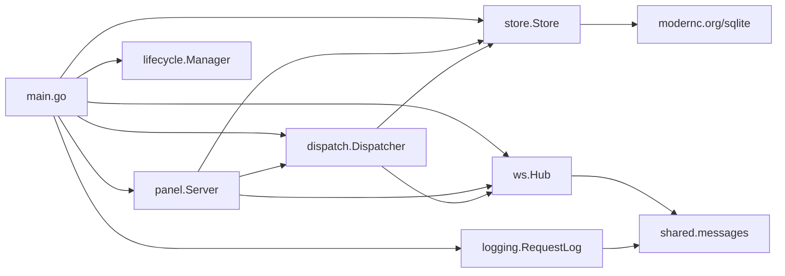

# 后端服务

<cite>
**本文引用的文件**   
- [src/backend/cmd/backend/main.go](file://src/backend/cmd/backend/main.go)
- [src/backend/internal/store/store.go](file://src/backend/internal/store/store.go)
- [src/backend/internal/store/migrations.go](file://src/backend/internal/store/migrations.go)
- [src/backend/internal/ws/hub.go](file://src/backend/internal/ws/hub.go)
- [src/backend/internal/dispatch/dispatcher.go](file://src/backend/internal/dispatch/dispatcher.go)
- [src/backend/internal/panel/panel.go](file://src/backend/internal/panel/panel.go)
- [src/backend/internal/panel/auth.go](file://src/backend/internal/panel/auth.go)
- [src/backend/internal/logging/http.go](file://src/backend/internal/logging/http.go)
- [src/backend/internal/lifecycle/manager.go](file://src/backend/internal/lifecycle/manager.go)
- [docs/openapi.yaml](file://docs/openapi.yaml)
- [docs/ws-protocol.schema.json](file://docs/ws-protocol.schema.json)
- [src/shared/messages.go](file://src/shared/messages.go)
</cite>

## 目录
1. [简介](#简介)
2. [项目结构](#项目结构)
3. [核心组件](#核心组件)
4. [架构总览](#架构总览)
5. [详细组件分析](#详细组件分析)
6. [依赖关系分析](#依赖关系分析)
7. [性能考量](#性能考量)
8. [故障排查指南](#故障排查指南)
9. [结论](#结论)
10. [附录](#附录)

## 简介
本技术文档面向 Lattix-codex 后端服务，系统性阐述其主程序启动流程、HTTP 服务器与 TLS 配置、WebSocket Hub 设计、数据存储层（SQLite）与迁移策略、API 接口规范（RESTful + WebSocket）、认证授权机制、业务逻辑模块（服务器管理、节点管理、用户管理、链路编排），以及中间件与拦截器（日志、请求处理、错误处理）。文档同时提供架构图与流程图，帮助开发者快速理解并扩展功能。

## 项目结构
后端采用 Go 模块化组织，核心入口位于 backend/cmd/backend/main.go；内部按职责划分为 store（数据访问）、ws（WebSocket Hub）、dispatch（命令分发与生命周期）、panel（面板 API）、logging（日志）、lifecycle（生命周期状态机）等子包；共享协议类型定义在 shared/messages.go；OpenAPI 与 WS 协议 Schema 分别位于 docs 目录。



**图表来源** 
- [src/backend/cmd/backend/main.go:62-472](file://src/backend/cmd/backend/main.go#L62-L472)
- [src/backend/internal/panel/panel.go:158-276](file://src/backend/internal/panel/panel.go#L158-L276)
- [src/backend/internal/ws/hub.go:24-62](file://src/backend/internal/ws/hub.go#L24-L62)
- [src/backend/internal/store/store.go:355-386](file://src/backend/internal/store/store.go#L355-L386)
- [src/backend/internal/logging/http.go:43-82](file://src/backend/internal/logging/http.go#L43-L82)
- [src/backend/internal/lifecycle/manager.go:18-28](file://src/backend/internal/lifecycle/manager.go#L18-L28)

**章节来源**
- [src/backend/cmd/backend/main.go:62-472](file://src/backend/cmd/backend/main.go#L62-L472)
- [src/backend/internal/panel/panel.go:158-276](file://src/backend/internal/panel/panel.go#L158-L276)

## 核心组件
- 主程序与 HTTP 服务器：负责参数解析、TLS 模式选择、健康检查、静态 SPA 托管、优雅关停。
- WebSocket Hub：维护 Agent 连接、发送队列、在线状态、生命周期同步、优雅排空。
- 命令分发器 Dispatcher：命令入队、离线排队、重试与死信、ACK 处理、遥测与漂移上报。
- 存储层 Store：SQLite 单连接、Schema 初始化与迁移、备份导出。
- 面板 API Server：统一 RPC 响应信封、鉴权（会话+CSRF）、路由注册、后台任务调度。
- 日志中间件：请求/WS 升级/WS RPC 记录、敏感信息脱敏、策略化记录。
- 生命周期 Manager：面板状态机（startup/active/updating/faulted）与重试策略。

**章节来源**
- [src/backend/cmd/backend/main.go:62-472](file://src/backend/cmd/backend/main.go#L62-L472)
- [src/backend/internal/ws/hub.go:24-62](file://src/backend/internal/ws/hub.go#L24-L62)
- [src/backend/internal/dispatch/dispatcher.go:24-48](file://src/backend/internal/dispatch/dispatcher.go#L24-L48)
- [src/backend/internal/store/store.go:355-386](file://src/backend/internal/store/store.go#L355-L386)
- [src/backend/internal/panel/panel.go:90-113](file://src/backend/internal/panel/panel.go#L90-L113)
- [src/backend/internal/logging/http.go:43-82](file://src/backend/internal/logging/http.go#L43-L82)
- [src/backend/internal/lifecycle/manager.go:18-28](file://src/backend/internal/lifecycle/manager.go#L18-L28)

## 架构总览
后端以 HTTP 为对外边界，通过 gorilla/websocket 暴露 /api/agent/ws 给 Agent 建立控制通道；Panel API 使用统一的 JSON 信封与 code 语义；Store 使用 SQLite 单连接并发安全；Lifecycle 驱动面板状态并在异常时通知 Agent 重连或降级。



**图表来源** 
- [src/backend/cmd/backend/main.go:364-472](file://src/backend/cmd/backend/main.go#L364-L472)
- [src/backend/internal/panel/panel.go:158-276](file://src/backend/internal/panel/panel.go#L158-L276)
- [src/backend/internal/panel/auth.go:67-109](file://src/backend/internal/panel/auth.go#L67-L109)
- [src/backend/internal/logging/http.go:43-82](file://src/backend/internal/logging/http.go#L43-L82)
- [src/backend/internal/ws/hub.go:24-62](file://src/backend/internal/ws/hub.go#L24-L62)
- [src/backend/internal/dispatch/dispatcher.go:251-328](file://src/backend/internal/dispatch/dispatcher.go#L251-L328)

## 详细组件分析

### 主程序启动流程与 HTTP 服务器
- 参数与环境变量：监听地址、数据库路径、日志目录、前端静态覆盖、管理员账号密码、公共 URL、GitHub 仓库、TLS 证书/ACME 域名/缓存/邮箱、重置管理员密码等。
- TLS 模式：支持关闭、内置证书、域名路径热加载、ACME 自动证书；设置页值优先于启动参数。
- 健康与就绪：/healthz 直接返回 ok；/readyz 检查 Hub 是否排空、面板状态是否为 active、DB Ping 成功。
- 路由挂载：Agent WS、Panel API、订阅端点、SPA 回退、/api/* 未命中返回 404。
- 优雅关停：BeginDrain 拒绝新请求并断开所有 Agent WS；等待背景任务、告警器、操作日志写入完成。



**图表来源** 
- [src/backend/cmd/backend/main.go:62-132](file://src/backend/cmd/backend/main.go#L62-L132)
- [src/backend/cmd/backend/main.go:172-238](file://src/backend/cmd/backend/main.go#L172-L238)
- [src/backend/cmd/backend/main.go:376-424](file://src/backend/cmd/backend/main.go#L376-L424)
- [src/backend/cmd/backend/main.go:442-472](file://src/backend/cmd/backend/main.go#L442-L472)
- [src/backend/cmd/backend/main.go:524-566](file://src/backend/cmd/backend/main.go#L524-L566)

**章节来源**
- [src/backend/cmd/backend/main.go:62-132](file://src/backend/cmd/backend/main.go#L62-L132)
- [src/backend/cmd/backend/main.go:172-238](file://src/backend/cmd/backend/main.go#L172-L238)
- [src/backend/cmd/backend/main.go:376-424](file://src/backend/cmd/backend/main.go#L376-L424)
- [src/backend/cmd/backend/main.go:442-472](file://src/backend/cmd/backend/main.go#L442-L472)
- [src/backend/cmd/backend/main.go:524-566](file://src/backend/cmd/backend/main.go#L524-L566)

### WebSocket Hub 设计
- 连接管理：维护 serverID -> agentConn 映射，支持重连替换旧连接，记录连接快照（state/session_id/session_kind/changed_at）。
- 发送队列：每连接独立 channel，writePump 串行写出，写超时即判定连接死亡；队列满则断开并重连后补发。
- 生命周期同步：SyncLifecycle 向所有在线 Agent 广播面板生命周期变更，等待 ACK 或超时。
- 事件回调：OnConnect/OnOnline/OnReconnect/OnMessage/OnDisconnect 由 main 注入 dispatcher 与告警器。
- 优雅排空：BeginDrain 标记 draining，拒绝新工作并关闭所有 Agent WS，配合 HTTP drainMiddleware 返回“面板重启中”。

```mermaid
classDiagram
class Hub {
+Auth
+Lifecycle
+OnUpgrade
+OnConnect
+OnOnline
+OnReconnect
+OnMessage
+OnProtocolError
+OnDisconnect
+IsOnline(serverID) bool
+Send(ctx, serverID, env) error
+BeginDrain() void
+Wait(ctx) error
+CloseAllAgents(code, reason) void
+SyncLifecycle(ctx, snapshot) []int64
}
class agentConn {
-hub *Hub
-serverID int64
-sessionID string
-sessionKind string
-ws *websocket.Conn
-send chan Envelope
-done chan struct{}
-ackMu sync.Mutex
-lifecycleAcks map[string]chan struct{}
+registerLifecycleAck(requestID) <-chan struct{}
+resolveLifecycleAck(requestID) bool
+removeLifecycleAck(requestID) void
+close() void
+closeWithCode(code, reason) void
+writePump() void
}
Hub --> agentConn : "管理多个连接"
```

**图表来源** 
- [src/backend/internal/ws/hub.go:24-62](file://src/backend/internal/ws/hub.go#L24-L62)
- [src/backend/internal/ws/hub.go:101-138](file://src/backend/internal/ws/hub.go#L101-L138)
- [src/backend/internal/ws/hub.go:155-172](file://src/backend/internal/ws/hub.go#L155-L172)
- [src/backend/internal/ws/hub.go:319-360](file://src/backend/internal/ws/hub.go#L319-L360)
- [src/backend/internal/ws/hub.go:280-395](file://src/backend/internal/ws/hub.go#L280-L395)

**章节来源**
- [src/backend/internal/ws/hub.go:24-62](file://src/backend/internal/ws/hub.go#L24-L62)
- [src/backend/internal/ws/hub.go:101-138](file://src/backend/internal/ws/hub.go#L101-L138)
- [src/backend/internal/ws/hub.go:155-172](file://src/backend/internal/ws/hub.go#L155-L172)
- [src/backend/internal/ws/hub.go:319-360](file://src/backend/internal/ws/hub.go#L319-L360)
- [src/backend/internal/ws/hub.go:280-395](file://src/backend/internal/ws/hub.go#L280-L395)

### 命令分发器 Dispatcher
- 命令入队：Enqueue 将命令写入 commands 表（queued），并尝试立即 Flush。
- 离线排队：Flush 遇到离线停止投递，剩余命令保持 queued，重连后补发。
- 重试与死信：超过最大尝试次数标记 failed（死信），对 apply_node/apply_chain_hop 进行失败定位与链状态推导。
- ACK 处理：handleCommandResponse 根据回执更新命令状态、节点状态机、链跳状态，并记录操作日志。
- 遥测与漂移：handleTelemetry 持久化主机指标与流量增量；handleDriftReport 记录配置漂移并告警。
- 版本同步：ensureAgentVersion 检测 Agent 版本不一致时下发升级命令。



**图表来源** 
- [src/backend/internal/dispatch/dispatcher.go:50-67](file://src/backend/internal/dispatch/dispatcher.go#L50-L67)
- [src/backend/internal/dispatch/dispatcher.go:171-241](file://src/backend/internal/dispatch/dispatcher.go#L171-L241)
- [src/backend/internal/dispatch/dispatcher.go:113-134](file://src/backend/internal/dispatch/dispatcher.go#L113-L134)
- [src/backend/internal/dispatch/dispatcher.go:625-730](file://src/backend/internal/dispatch/dispatcher.go#L625-L730)
- [src/backend/internal/dispatch/dispatcher.go:553-592](file://src/backend/internal/dispatch/dispatcher.go#L553-L592)
- [src/backend/internal/dispatch/dispatcher.go:594-623](file://src/backend/internal/dispatch/dispatcher.go#L594-L623)
- [src/backend/internal/dispatch/dispatcher.go:341-365](file://src/backend/internal/dispatch/dispatcher.go#L341-L365)

**章节来源**
- [src/backend/internal/dispatch/dispatcher.go:50-67](file://src/backend/internal/dispatch/dispatcher.go#L50-L67)
- [src/backend/internal/dispatch/dispatcher.go:171-241](file://src/backend/internal/dispatch/dispatcher.go#L171-L241)
- [src/backend/internal/dispatch/dispatcher.go:113-134](file://src/backend/internal/dispatch/dispatcher.go#L113-L134)
- [src/backend/internal/dispatch/dispatcher.go:625-730](file://src/backend/internal/dispatch/dispatcher.go#L625-L730)
- [src/backend/internal/dispatch/dispatcher.go:553-592](file://src/backend/internal/dispatch/dispatcher.go#L553-L592)
- [src/backend/internal/dispatch/dispatcher.go:594-623](file://src/backend/internal/dispatch/dispatcher.go#L594-L623)
- [src/backend/internal/dispatch/dispatcher.go:341-365](file://src/backend/internal/dispatch/dispatcher.go#L341-L365)

### 数据存储层（SQLite）与迁移
- Schema：包含 servers、providers、users、nodes、commands、rpc_idempotency、user_nodes、server_metrics、traffic、chains、chain_hops、各类流量统计与修订任务表。
- 并发与锁：单连接 + busy_timeout，避免 database is locked；Backup 使用 VACUUM INTO 一致性快照。
- 迁移策略：initializeSchema 在事务内执行 CREATE TABLE IF NOT EXISTS，比较 user_version 与 schemaVersion 执行增量迁移；确保列存在、历史数据回填、索引重建。
- 典型迁移：commands 表结构演进、server_metrics 字段调整、custom_exchange_rates 去重与唯一索引。



**图表来源** 
- [src/backend/internal/store/store.go:364-386](file://src/backend/internal/store/store.go#L364-L386)
- [src/backend/internal/store/migrations.go:18-52](file://src/backend/internal/store/migrations.go#L18-L52)
- [src/backend/internal/store/migrations.go:54-144](file://src/backend/internal/store/migrations.go#L54-L144)
- [src/backend/internal/store/migrations.go:184-245](file://src/backend/internal/store/migrations.go#L184-L245)
- [src/backend/internal/store/migrations.go:247-306](file://src/backend/internal/store/migrations.go#L247-L306)
- [src/backend/internal/store/migrations.go:308-318](file://src/backend/internal/store/migrations.go#L308-L318)

**章节来源**
- [src/backend/internal/store/store.go:15-353](file://src/backend/internal/store/store.go#L15-L353)
- [src/backend/internal/store/store.go:364-386](file://src/backend/internal/store/store.go#L364-L386)
- [src/backend/internal/store/migrations.go:18-52](file://src/backend/internal/store/migrations.go#L18-L52)
- [src/backend/internal/store/migrations.go:54-144](file://src/backend/internal/store/migrations.go#L54-L144)
- [src/backend/internal/store/migrations.go:184-245](file://src/backend/internal/store/migrations.go#L184-L245)
- [src/backend/internal/store/migrations.go:247-306](file://src/backend/internal/store/migrations.go#L247-L306)
- [src/backend/internal/store/migrations.go:308-318](file://src/backend/internal/store/migrations.go#L308-L318)

### API 接口设计与认证授权
- RESTful API：统一 JSON 信封 response{code,message,data,request_id,trace_id}；HTTP 状态码固定 200，业务结果由 code 表达；部分非 RPC 场景（下载、WS Upgrade、健康检查）不使用信封。
- 认证与会话：基于 cookie lattix_session，HMAC-SHA256 签名，有效期 7 天；CSRF Token 由会话派生；SameOrigin 校验；更新进行中锁定其余 API。
- 路由注册：/api/auth/*、/api/dashboard/*、/api/server/*、/api/node/*、/api/chain/*、/api/user/*、/api/setting/*、/api/panel/*、/api/log/*、/api/backup/*。
- 幂等性：部分写接口支持 Idempotent，结合 rpc_idempotency 表与 request_hash 防重放。



**图表来源** 
- [docs/openapi.yaml:1-523](file://docs/openapi.yaml#L1-L523)
- [src/backend/internal/panel/auth.go:67-109](file://src/backend/internal/panel/auth.go#L67-L109)
- [src/backend/internal/panel/auth.go:149-162](file://src/backend/internal/panel/auth.go#L149-L162)
- [src/backend/internal/panel/panel.go:158-276](file://src/backend/internal/panel/panel.go#L158-L276)

**章节来源**
- [docs/openapi.yaml:1-523](file://docs/openapi.yaml#L1-L523)
- [src/backend/internal/panel/auth.go:67-109](file://src/backend/internal/panel/auth.go#L67-L109)
- [src/backend/internal/panel/auth.go:149-162](file://src/backend/internal/panel/auth.go#L149-L162)
- [src/backend/internal/panel/panel.go:158-276](file://src/backend/internal/panel/panel.go#L158-L276)

### WebSocket 协议实现
- 信封格式：kind(type), type(domain.action), request_id/trace_id(32位十六进制), data(JSON)，response 必须携带 code/message。
- 关键消息：agent.session.open、agent.credential.commit、agent.session.ready、panel.lifecycle.changed、agent.settings.sync、telemetry.report、config.drift、chain-hop.apply/remove。
- 传输保障：writeTimeout=10s，pongTimeout=90s，sendBuffer=256；慢连接断开后重连补发。
- 协议校验：shared.Envelope.Validate() 严格校验结构与必填字段。



**图表来源** 
- [docs/ws-protocol.schema.json:1-356](file://docs/ws-protocol.schema.json#L1-L356)
- [src/shared/messages.go:13-45](file://src/shared/messages.go#L13-L45)
- [src/shared/messages.go:111-137](file://src/shared/messages.go#L111-L137)
- [src/backend/internal/ws/hub.go:101-138](file://src/backend/internal/ws/hub.go#L101-L138)
- [src/backend/internal/dispatch/dispatcher.go:251-328](file://src/backend/internal/dispatch/dispatcher.go#L251-L328)

**章节来源**
- [docs/ws-protocol.schema.json:1-356](file://docs/ws-protocol.schema.json#L1-L356)
- [src/shared/messages.go:13-45](file://src/shared/messages.go#L13-L45)
- [src/shared/messages.go:111-137](file://src/shared/messages.go#L111-L137)
- [src/backend/internal/ws/hub.go:101-138](file://src/backend/internal/ws/hub.go#L101-L138)
- [src/backend/internal/dispatch/dispatcher.go:251-328](file://src/backend/internal/dispatch/dispatcher.go#L251-L328)

### 业务逻辑模块概览
- 服务器管理：创建/更新/删除/修复/升级 xray/agent、令牌轮换、遥测采集、命令历史。
- 节点管理：虚拟配置模板、实际生效配置、状态机 pending→applying→active/failed、重试与失败定位。
- 用户管理：用户增删改、节点权限分配、订阅链接生成、过期清理。
- 链路编排：链的创建/编辑/发布/重试/删除、逐跳配置件下发、流量倍率与统计、修订任务与回滚。

**章节来源**
- [src/backend/internal/panel/panel.go:158-276](file://src/backend/internal/panel/panel.go#L158-L276)
- [src/backend/internal/dispatch/dispatcher.go:625-730](file://src/backend/internal/dispatch/dispatcher.go#L625-L730)
- [src/backend/internal/store/store.go:124-135](file://src/backend/internal/store/store.go#L124-L135)
- [src/backend/internal/store/store.go:230-353](file://src/backend/internal/store/store.go#L230-L353)

### 中间件与拦截器
- 请求日志中间件：RequestMiddleware 捕获请求/响应、计算耗时、脱敏参数、策略化记录（full/failures_only/none）。
- WS 升级日志：LogWebSocketUpgrade 记录握手成功。
- WS RPC 日志：LogWebSocketRPC 记录命令型 RPC 的 code/duration/attributes。
- 错误处理：panic 恢复、HTTP 状态码映射到 code、问题体摘要。

**章节来源**
- [src/backend/internal/logging/http.go:43-82](file://src/backend/internal/logging/http.go#L43-L82)
- [src/backend/internal/logging/http.go:84-105](file://src/backend/internal/logging/http.go#L84-L105)
- [src/backend/internal/logging/http.go:154-164](file://src/backend/internal/logging/http.go#L154-L164)
- [src/backend/internal/logging/http.go:166-183](file://src/backend/internal/logging/http.go#L166-L183)

## 依赖关系分析
- main.go 依赖 panel、ws、dispatch、store、logging、lifecycle、sub。
- panel 依赖 store、dispatch、ws、alert、logging、lifecycle。
- dispatch 依赖 store、ws、alert、logging、shared。
- ws 依赖 shared、gorilla/websocket。
- store 依赖 modernc.org/sqlite。
- logging 依赖 shared。



**图表来源** 
- [src/backend/cmd/backend/main.go:27-36](file://src/backend/cmd/backend/main.go#L27-L36)
- [src/backend/internal/panel/panel.go:4-26](file://src/backend/internal/panel/panel.go#L4-L26)
- [src/backend/internal/dispatch/dispatcher.go:5-22](file://src/backend/internal/dispatch/dispatcher.go#L5-L22)
- [src/backend/internal/ws/hub.go:3-13](file://src/backend/internal/ws/hub.go#L3-L13)
- [src/backend/internal/store/store.go:4-11](file://src/backend/internal/store/store.go#L4-L11)
- [src/backend/internal/logging/http.go:3-18](file://src/backend/internal/logging/http.go#L3-L18)

**章节来源**
- [src/backend/cmd/backend/main.go:27-36](file://src/backend/cmd/backend/main.go#L27-L36)
- [src/backend/internal/panel/panel.go:4-26](file://src/backend/internal/panel/panel.go#L4-L26)
- [src/backend/internal/dispatch/dispatcher.go:5-22](file://src/backend/internal/dispatch/dispatcher.go#L5-L22)
- [src/backend/internal/ws/hub.go:3-13](file://src/backend/internal/ws/hub.go#L3-L13)
- [src/backend/internal/store/store.go:4-11](file://src/backend/internal/store/store.go#L4-L11)
- [src/backend/internal/logging/http.go:3-18](file://src/backend/internal/logging/http.go#L3-L18)

## 性能考量
- SQLite 单连接与 busy_timeout 降低锁竞争；VACUUM INTO 备份不阻塞读写。
- WS 写超时与缓冲限制防止慢连接拖垮系统；重连后补发保证可靠性。
- 请求日志策略化记录减少高频 I/O；敏感参数脱敏控制体积。
- 生命周期状态机与重试策略提升稳定性与自愈能力。

[本节为通用指导，无需特定文件引用]

## 故障排查指南
- 登录失败：检查用户名/密码、CSRF Token、SameOrigin、更新锁定状态。
- WS 连接失败：确认 token 有效、面板实例 ID 匹配、端口可达、TLS 模式正确。
- 命令失败：查看 commands 表 status/error、dispatcher 死信与重试计数、节点/链状态。
- 配置漂移：关注 drift_report 事件与告警，重新应用配置。
- 健康检查：/healthz 与 /readyz 返回状态，排查 DB Ping 与面板状态。

**章节来源**
- [src/backend/internal/panel/auth.go:67-109](file://src/backend/internal/panel/auth.go#L67-L109)
- [src/backend/internal/dispatch/dispatcher.go:171-241](file://src/backend/internal/dispatch/dispatcher.go#L171-L241)
- [src/backend/internal/dispatch/dispatcher.go:594-623](file://src/backend/internal/dispatch/dispatcher.go#L594-L623)
- [src/backend/cmd/backend/main.go:376-424](file://src/backend/cmd/backend/main.go#L376-L424)

## 结论
Lattix-codex 后端服务通过清晰的模块化设计、稳健的 SQLite 存储、可靠的 WebSocket 控制通道与完善的日志与生命周期管理，提供了高可用的面板管理能力。开发者可基于现有组件快速扩展 API、新增业务逻辑或优化性能。

[本节为总结，无需特定文件引用]

## 附录
- OpenAPI 规范：见 docs/openapi.yaml，定义了所有 RPC 端点、请求体、响应体与安全方案。
- WebSocket 协议 Schema：见 docs/ws-protocol.schema.json，定义了信封结构与消息类型约束。
- 共享协议类型：见 src/shared/messages.go，定义了 Envelope、Payload、常量与工具函数。

**章节来源**
- [docs/openapi.yaml:1-523](file://docs/openapi.yaml#L1-L523)
- [docs/ws-protocol.schema.json:1-356](file://docs/ws-protocol.schema.json#L1-L356)
- [src/shared/messages.go:1-313](file://src/shared/messages.go#L1-L313)