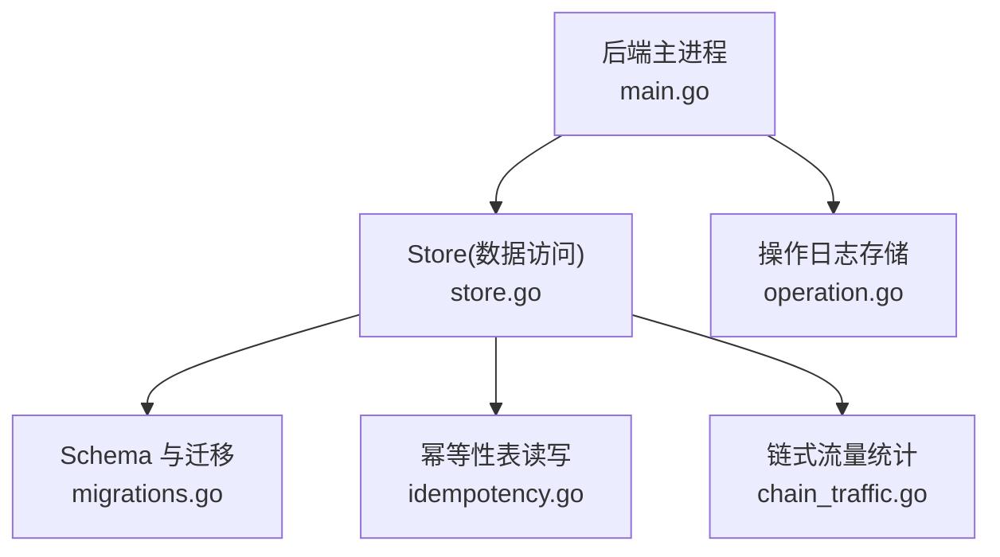
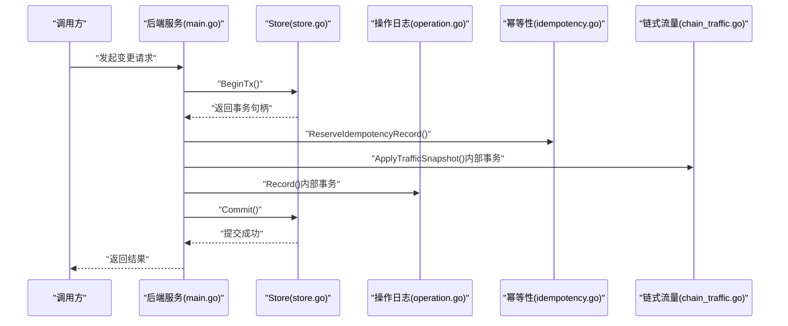
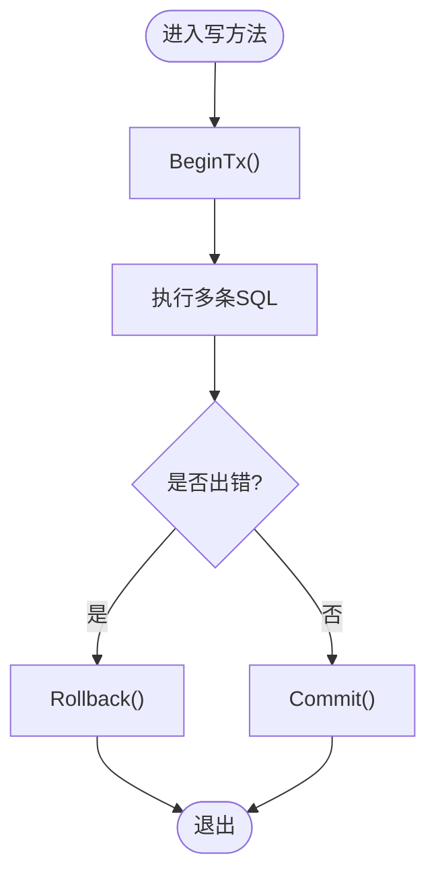
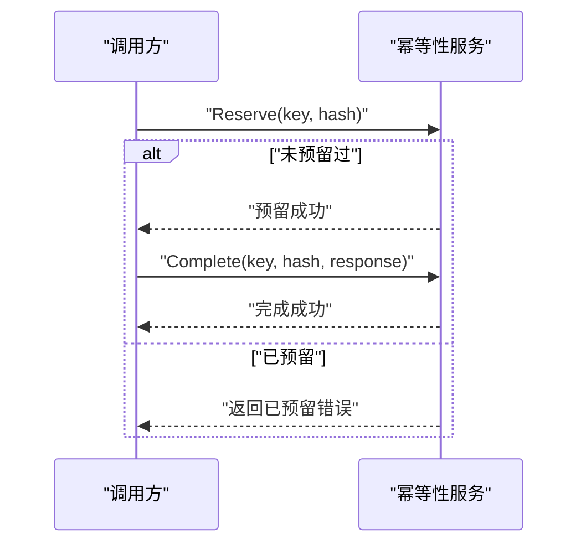
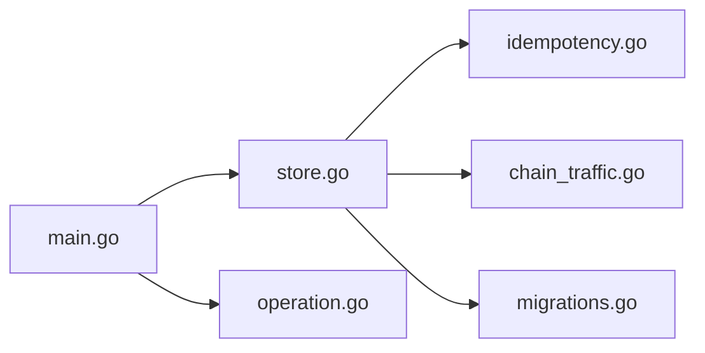

# 事务管理

<cite>
**本文引用的文件**   
- [store.go](file://src/backend/internal/store/store.go)
- [migrations.go](file://src/backend/internal/store/migrations.go)
- [idempotency.go](file://src/backend/internal/store/idempotency.go)
- [chain_traffic.go](file://src/backend/internal/store/chain_traffic.go)
- [operation.go](file://src/backend/internal/logging/operation.go)
- [main.go](file://src/backend/cmd/backend/main.go)
</cite>

## 目录
1. [简介](#简介)
2. [项目结构](#项目结构)
3. [核心组件](#核心组件)
4. [架构总览](#架构总览)
5. [详细组件分析](#详细组件分析)
6. [依赖关系分析](#依赖关系分析)
7. [性能考量](#性能考量)
8. [故障排查指南](#故障排查指南)
9. [结论](#结论)
10. [附录](#附录)

## 简介
本技术文档聚焦 Lattix-codex 后端在 SQLite 上的事务管理机制，涵盖事务的开启、提交与回滚；并发控制策略（锁机制、隔离级别选择与性能优化）；幂等性保证（idempotency 表设计与 RPC 去重）；事务边界的设计原则与最佳实践；事务嵌套与保存点的使用示例；死锁检测与预防策略；以及分布式事务的处理方案与一致性保证。

## 项目结构
- 存储层：SQLite 数据库连接、Schema 定义、迁移、备份与并发设置集中在 store 包中。
- 日志层：操作日志与请求日志使用独立的 SQLite 实例，采用单连接与 busy_timeout 避免写冲突。
- 业务逻辑：链式流量统计、计费、命令队列等通过 store 接口进行事务化更新。
- 启动流程：后端主进程初始化日志、调度器、WS Hub，并在启动阶段执行 Schema 初始化与迁移。

**图表来源** 
- [main.go:152-188](file://src/backend/cmd/backend/main.go#L152-L188)
- [store.go:368-389](file://src/backend/internal/store/store.go#L368-L389)
- [migrations.go:18-52](file://src/backend/internal/store/migrations.go#L18-L52)
- [idempotency.go:17-105](file://src/backend/internal/store/idempotency.go#L17-L105)
- [chain_traffic.go:39-104](file://src/backend/internal/store/chain_traffic.go#L39-L104)

**章节来源**
- [store.go:368-389](file://src/backend/internal/store/store.go#L368-L389)
- [migrations.go:18-52](file://src/backend/internal/store/migrations.go#L18-L52)
- [operation.go:116-136](file://src/backend/internal/logging/operation.go#L116-L136)
- [main.go:152-188](file://src/backend/cmd/backend/main.go#L152-L188)

## 核心组件
- Store：封装 SQLite 连接、并发参数（单连接 + busy_timeout）、Schema 初始化与迁移、备份导出。
- OperationStore：独立的操作日志 SQLite，单连接写入，带最大条目限制与清理。
- Idempotency：rpc_idempotency 表的预留-完成模式，保障 RPC 幂等性与去重。
- ChainTraffic：批量应用计数器快照，计算增量并写入多张统计表，全部在事务内完成。

**章节来源**
- [store.go:358-389](file://src/backend/internal/store/store.go#L358-L389)
- [operation.go:116-136](file://src/backend/internal/logging/operation.go#L116-L136)
- [idempotency.go:17-105](file://src/backend/internal/store/idempotency.go#L17-L105)
- [chain_traffic.go:39-104](file://src/backend/internal/store/chain_traffic.go#L39-L104)

## 架构总览
后端以 SQLite 为唯一持久化介质，所有写路径均通过事务包裹，确保原子性与一致性。并发方面，通过单连接与 busy_timeout 降低锁竞争；幂等性通过专用表与“预留-完成”协议实现；备份通过 VACUUM INTO 提供一致性快照。

**图表来源** 
- [main.go:152-188](file://src/backend/cmd/backend/main.go#L152-L188)
- [store.go:368-389](file://src/backend/internal/store/store.go#L368-L389)
- [idempotency.go:37-81](file://src/backend/internal/store/idempotency.go#L37-L81)
- [chain_traffic.go:39-104](file://src/backend/internal/store/chain_traffic.go#L39-L104)
- [operation.go:165-182](file://src/backend/internal/logging/operation.go#L165-L182)

## 详细组件分析

### SQLite 事务处理机制（开启、提交、回滚）
- 开启事务：各写方法通过 BeginTx 获取事务句柄，并使用 defer tx.Rollback() 确保异常时回滚。
- 提交事务：所有 SQL 成功后显式 Commit；失败则回滚。
- 错误处理：任何一步失败都会触发 Rollback，保证数据一致性。

**图表来源** 
- [chain_traffic.go:44-104](file://src/backend/internal/store/chain_traffic.go#L44-L104)
- [operation.go:165-182](file://src/backend/internal/logging/operation.go#L165-L182)

**章节来源**
- [chain_traffic.go:44-104](file://src/backend/internal/store/chain_traffic.go#L44-L104)
- [operation.go:165-182](file://src/backend/internal/logging/operation.go#L165-L182)

### 并发控制策略（锁机制、隔离级别、性能优化）
- 单连接：db.SetMaxOpenConns(1) 强制串行写，避免 SQLite 并发写导致的 locked 错误。
- busy_timeout：DSN 中设置 _pragma=busy_timeout(5000)，等待锁释放而非立即失败。
- 隔离级别：默认使用 SQLite 的读已提交（Read Committed），配合单连接与事务边界保证一致性。
- 性能优化：批量写入、UPSERT 减少行锁竞争；索引设计（如 rpc_idempotency 复合主键）提升查询效率。

**章节来源**
- [store.go:368-389](file://src/backend/internal/store/store.go#L368-L389)
- [idempotency.go:17-105](file://src/backend/internal/store/idempotency.go#L17-L105)

### 幂等性保证机制（idempotency 表与 RPC 去重）
- 表结构：rpc_idempotency 以 (operator, route, idempotency_key) 为主键，记录 request_hash 与 response_json。
- 预留阶段：ReserveIdempotencyRecord 使用 INSERT ... ON CONFLICT DO NOTHING，若已存在则返回错误。
- 完成阶段：CompleteIdempotencyRecord 仅在 request_hash 匹配且 response_json 为空时更新，防止篡改。
- 清理：DeleteExpiredIdempotencyRecords 定期删除 24 小时前的预留记录。

**图表来源** 
- [idempotency.go:37-81](file://src/backend/internal/store/idempotency.go#L37-L81)

**章节来源**
- [idempotency.go:17-105](file://src/backend/internal/store/idempotency.go#L17-L105)

### 事务边界设计与最佳实践
- 最小化事务范围：仅包裹必要的写操作，减少锁持有时间。
- 明确失败路径：每个事务必须包含 defer Rollback 与错误检查。
- 组合事务：跨表更新应放在同一事务中，保证原子性（如链式流量统计）。
- 幂等性优先：对外部不可控的重试场景，优先使用幂等性表。

**章节来源**
- [chain_traffic.go:39-104](file://src/backend/internal/store/chain_traffic.go#L39-L104)
- [operation.go:165-182](file://src/backend/internal/logging/operation.go#L165-L182)

### 事务嵌套与保存点使用示例
- 当前代码未直接使用保存点（SAVEPOINT），但可通过嵌套事务模拟：外层事务开始，内层使用 PRAGMA savepoint_name 创建保存点，失败时回滚到保存点，成功时释放保存点。
- 建议：对于复杂业务流程，可将子步骤封装为独立函数，由上层事务统一提交或回滚。

[本节为概念性说明，不直接引用具体文件]

### 死锁检测与预防策略
- 检测：SQLite 本身不提供死锁检测 API，需通过日志捕获 database is locked 错误。
- 预防：
  - 保持事务短小，避免长事务持有锁。
  - 固定资源访问顺序，避免循环等待。
  - 使用 UPSERT 和原子更新减少锁升级。
  - 合理设置 busy_timeout 与重试退避。

**章节来源**
- [store.go:368-389](file://src/backend/internal/store/store.go#L368-L389)

### 分布式事务处理方案与一致性保证
- 现状：当前系统为单机 SQLite，无分布式事务需求。
- 扩展建议：
  - 引入消息队列（如 Kafka/RabbitMQ）作为最终一致性基础。
  - 使用 Saga 模式编排跨服务事务，补偿失败步骤。
  - 对关键状态引入版本字段与乐观锁，避免覆盖更新。
  - 使用分布式锁（如 Redis RedLock）协调并发写入。

[本节为概念性说明，不直接引用具体文件]

## 依赖关系分析
- Store 依赖 SQLite 驱动与 DSN 配置。
- OperationStore 独立于 Store，使用自己的 SQLite 实例。
- Idempotency 与 ChainTraffic 均依赖 Store 的事务能力。
- 主进程 main.go 初始化 Store、OperationStore 并注册事件回调。

**图表来源** 
- [main.go:152-188](file://src/backend/cmd/backend/main.go#L152-L188)
- [store.go:368-389](file://src/backend/internal/store/store.go#L368-L389)
- [operation.go:116-136](file://src/backend/internal/logging/operation.go#L116-L136)
- [idempotency.go:17-105](file://src/backend/internal/store/idempotency.go#L17-L105)
- [chain_traffic.go:39-104](file://src/backend/internal/store/chain_traffic.go#L39-L104)
- [migrations.go:18-52](file://src/backend/internal/store/migrations.go#L18-L52)

**章节来源**
- [main.go:152-188](file://src/backend/cmd/backend/main.go#L152-L188)
- [store.go:368-389](file://src/backend/internal/store/store.go#L368-L389)

## 性能考量
- 单连接串行写：避免锁竞争，适合写少读多的场景。
- busy_timeout：提高容错性，但可能增加延迟。
- 批量操作：使用 UPSERT 与批量插入减少往返。
- 索引优化：为高频查询字段添加索引（如 rpc_idempotency.created_at）。
- 备份策略：VACUUM INTO 提供一致性快照，避免影响在线服务。

**章节来源**
- [store.go:368-389](file://src/backend/internal/store/store.go#L368-L389)
- [idempotency.go:96-105](file://src/backend/internal/store/idempotency.go#L96-L105)

## 故障排查指南
- database is locked：检查是否有长事务或未释放的连接，调整 busy_timeout。
- 幂等性预留失败：确认 key 是否已被预留，检查 request_hash 是否一致。
- 链式流量统计异常：验证计数器快照是否为非负数，检查 instanceID 是否正确。
- 操作日志丢失：检查 OperationStore 的最大条目限制与清理逻辑。

**章节来源**
- [store.go:368-389](file://src/backend/internal/store/store.go#L368-L389)
- [idempotency.go:37-81](file://src/backend/internal/store/idempotency.go#L37-L81)
- [chain_traffic.go:39-104](file://src/backend/internal/store/chain_traffic.go#L39-L104)
- [operation.go:165-182](file://src/backend/internal/logging/operation.go#L165-L182)

## 结论
Lattix-codex 的事务管理基于 SQLite 的单连接与 busy_timeout 策略，结合幂等性表与事务边界设计，确保了数据一致性与高可用。未来可扩展至分布式场景，通过消息队列与 Saga 模式实现最终一致性。

[本节为总结性内容，不直接引用具体文件]

## 附录
- Schema 定义：见 store.go 中的 Schema 常量。
- 迁移逻辑：见 migrations.go 中的 initializeSchema 与 migrateSchema。
- 备份接口：见 store.go 中的 Backup 方法。

**章节来源**
- [store.go:18-356](file://src/backend/internal/store/store.go#L18-L356)
- [migrations.go:18-52](file://src/backend/internal/store/migrations.go#L18-L52)
- [store.go:448-465](file://src/backend/internal/store/store.go#L448-L465)