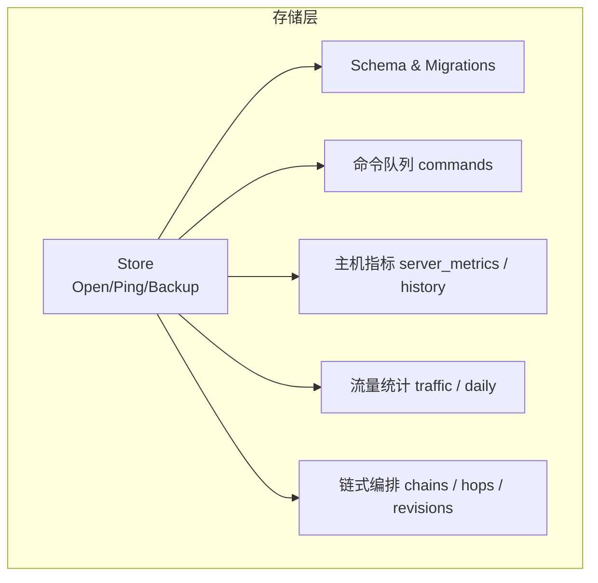
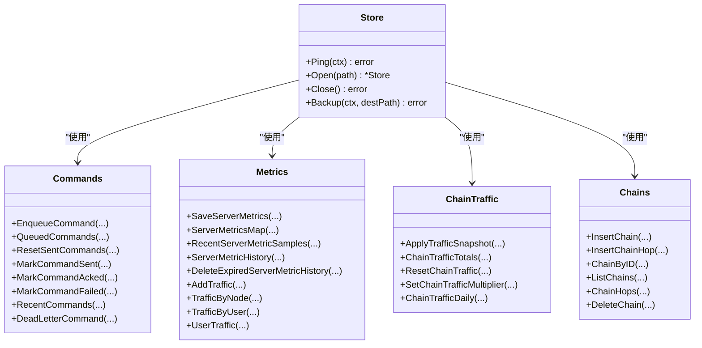
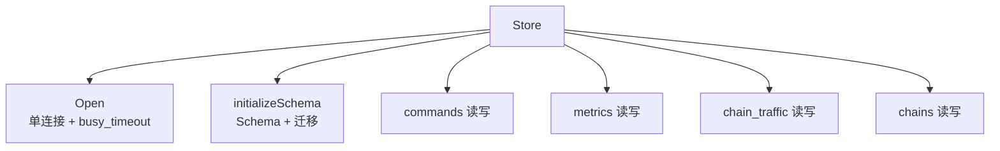

# 性能优化

<cite>
**本文引用的文件**   
- [store.go](file://src/backend/internal/store/store.go)
- [migrations.go](file://src/backend/internal/store/migrations.go)
- [commands.go](file://src/backend/internal/store/commands.go)
- [metrics.go](file://src/backend/internal/store/metrics.go)
- [chains.go](file://src/backend/internal/store/chains.go)
- [chain_traffic.go](file://src/backend/internal/store/chain_traffic.go)
</cite>

## 目录
1. [简介](#简介)
2. [项目结构](#项目结构)
3. [核心组件](#核心组件)
4. [架构总览](#架构总览)
5. [详细组件分析](#详细组件分析)
6. [依赖关系分析](#依赖关系分析)
7. [性能考量与优化策略](#性能考量与优化策略)
8. [故障排查指南](#故障排查指南)
9. [结论](#结论)
10. [附录](#附录)

## 简介
本技术文档聚焦 Lattix-codex 数据存储层的性能优化，围绕 SQLite 的配置、连接与并发控制、索引与查询优化、批量操作、缓存策略、监控与分析以及数据分片与归档等主题展开。文档基于后端存储实现代码进行分析，给出可落地的优化建议与最佳实践，帮助读者在保障一致性与可用性的前提下，获得更高的吞吐与更低的延迟。

## 项目结构
后端存储层位于 src/backend/internal/store，采用单进程内嵌 SQLite 的方式，通过一个 Store 对象封装数据库访问，包含：
- 连接与初始化：Open、Schema、initializeSchema
- 迁移：migrateSchema、ensureColumns、migrateCommands、migrateServerMetrics
- 命令队列与状态机：commands 表及 Enqueue/Mark/Set 等方法
- 主机遥测与流量统计：server_metrics、traffic、chain_traffic_* 系列表
- 链式编排与状态：chains、chain_hops、chain_revisions、chain_revision_tasks 等

图表来源 
- [store.go:355-396](file://src/backend/internal/store/store.go#L355-L396)
- [migrations.go:18-52](file://src/backend/internal/store/migrations.go#L18-L52)

章节来源
- [store.go:355-396](file://src/backend/internal/store/store.go#L355-L396)
- [migrations.go:18-52](file://src/backend/internal/store/migrations.go#L18-L52)

## 核心组件
- Store：封装 sqlite 驱动与 sql.DB，设置单连接与 busy_timeout，提供 Backup（VACUUM INTO）一致性快照能力。
- Schema：集中定义所有表结构与基础索引（如 rpc_idempotency、server_metric_history）。
- 迁移系统：启动时以事务执行 schema 创建与增量迁移，保证版本兼容与字段补齐。
- 命令队列：commands 表承载离线命令与操作日志，支持 queued/sent/acked/failed/abandoned 状态流转。
- 遥测与流量：server_metrics 最新值 + history 样本；traffic 按节点/用户维度累计；chain_traffic_* 用于链路级流量统计与倍率计算。
- 链式编排：chains/chain_hops/chain_revisions/chain_revision_tasks 支撑多跳链路的发布、重试与清理。

章节来源
- [store.go:15-353](file://src/backend/internal/store/store.go#L15-L353)
- [store.go:355-396](file://src/backend/internal/store/store.go#L355-L396)
- [migrations.go:18-52](file://src/backend/internal/store/migrations.go#L18-L52)
- [commands.go:12-188](file://src/backend/internal/store/commands.go#L12-L188)
- [metrics.go:12-276](file://src/backend/internal/store/metrics.go#L12-L276)
- [chains.go:12-336](file://src/backend/internal/store/chains.go#L12-L336)
- [chain_traffic.go:12-324](file://src/backend/internal/store/chain_traffic.go#L12-L324)

## 架构总览
下图展示 Store 的对外接口与内部关键表的交互关系，体现“单连接 + 事务”的一致性模型与高并发写下的锁等待策略。

图表来源 
- [store.go:355-396](file://src/backend/internal/store/store.go#L355-L396)
- [commands.go:36-188](file://src/backend/internal/store/commands.go#L36-L188)
- [metrics.go:47-276](file://src/backend/internal/store/metrics.go#L47-L276)
- [chain_traffic.go:39-324](file://src/backend/internal/store/chain_traffic.go#L39-L324)
- [chains.go:112-336](file://src/backend/internal/store/chains.go#L112-L336)

## 详细组件分析

### SQLite 配置与连接池优化
- 连接数限制：通过 SetMaxOpenConns(1) 强制单连接，避免 SQLite 并发写导致的锁竞争与 database is locked 错误。
- 忙等待超时：DSN 追加 _pragma=busy_timeout(5000)，在写入冲突时最多等待 5 秒，降低瞬时锁争用失败概率。
- 备份与一致性：使用 VACUUM INTO 生成一致性快照，适合在线备份下载场景。

优化建议
- 保持单连接策略不变，确保写路径串行化。
- 根据业务峰值调整 busy_timeout（例如 3–10 秒），并配合重试退避策略。
- 将耗时写操作合并为短事务，减少持有锁的时间。

章节来源
- [store.go:365-383](file://src/backend/internal/store/store.go#L365-L383)
- [store.go:388-396](file://src/backend/internal/store/store.go#L388-L396)

### 内存与 WAL 模式
- 当前未显式开启 WAL 模式。WAL 能显著提升读多写少场景的并发度与 I/O 吞吐。
- 建议启用 PRAGMA journal_mode=WAL，并结合 PRAGMA cache_size、PRAGMA temp_store 调优内存页缓存与临时存储。

注意
- 切换 WAL 需评估现有备份/恢复流程兼容性。
- 在高并发写场景下，WAL 可减少读阻塞，但仍需控制事务粒度。

章节来源
- [store.go:365-383](file://src/backend/internal/store/store.go#L365-L383)

### 索引设计与查询优化
已存在的索引
- rpc_idempotency.created_at：便于按时间范围查询幂等记录。
- server_metric_history(server_id, sampled_at)：加速按服务器与时间的历史采样查询。

建议补充的复合索引（按热点查询推导）
- commands(server_id, status, id)：加速 QueuedCommands、RecentCommands 等按服务器与状态的排序查询。
- traffic(node_id, user_uuid)：覆盖 AddTraffic 的 upsert 键，减少重复扫描。
- chain_traffic_totals(chain_id, hop_id)：加速链路总量聚合与基线对比。
- chain_traffic_daily(chain_id, hop_id, usage_date)：加速按日期的趋势查询。
- server_network_usage_daily(server_id, usage_date)：加速每日网络用量汇总。

覆盖索引原则
- 优先选择高频 WHERE + ORDER BY/LIMIT 的列组合，尽量让查询仅命中索引而不回表。
- 对 JSON 字段（如 data、snapshot）避免直接作为索引列，必要时抽取必要字段到独立列。

章节来源
- [store.go:160-212](file://src/backend/internal/store/store.go#L160-L212)
- [metrics.go:142-190](file://src/backend/internal/store/metrics.go#L142-L190)
- [chain_traffic.go:257-324](file://src/backend/internal/store/chain_traffic.go#L257-L324)

### 批量操作最佳实践
- 命令入队与状态更新：commands 表多为单行插入/更新，可通过事务批量提交多条语句以减少往返。
- 遥测指标：SaveServerMetrics 使用 ON CONFLICT DO UPDATE 原子 upsert，并在同一事务中写入 history 与 daily 聚合，避免多次锁竞争。
- 流量累计：AddTraffic 与 ApplyTrafficSnapshot 均使用 upsert 累加，建议在调用侧分批聚合后一次性提交。

优化建议
- 将多个相关写入合并到一个事务中，缩短锁持有时间。
- 对高频写入路径（如 metrics、traffic）采用批处理聚合，减少事务次数。
- 避免在循环中逐条 Exec，改用 Prepared Statement 或批量 INSERT/UPDATE。

章节来源
- [metrics.go:47-107](file://src/backend/internal/store/metrics.go#L47-L107)
- [chain_traffic.go:39-104](file://src/backend/internal/store/chain_traffic.go#L39-L104)
- [commands.go:36-83](file://src/backend/internal/store/commands.go#L36-L83)

### 缓存策略设计
- 面板设置与调度：settings 表作为持久化配置源，结合内存缓存（由上层 panel 管理）减少频繁读取。
- 发布版本与链信息：chains/chain_revisions 快照较大，建议在应用层缓存 published 快照并按 revision_id 失效。
- 遥测与流量：server_metrics 最新值可在内存中短期缓存，history/daily 走 DB 查询；traffic totals 可按用户/节点维度缓存短时结果。

失效机制
- 基于版本号（schemaVersion、revision_id）或更新时间戳触发缓存失效。
- 对热点键设置 TTL，过期自动刷新；对强一致场景采用写穿（write-through）或双写校验。

章节来源
- [migrations.go:9-52](file://src/backend/internal/store/migrations.go#L9-L52)
- [chains.go:112-183](file://src/backend/internal/store/chains.go#L112-L183)
- [metrics.go:109-126](file://src/backend/internal/store/metrics.go#L109-L126)

### 性能监控与分析方法
- 慢查询日志：SQLite 无内置慢查询日志，可在应用层记录耗时超过阈值的 SQL（如 >50ms），并附带参数与上下文。
- 执行计划分析：使用 EXPLAIN QUERY PLAN 分析关键查询是否命中索引、是否存在全表扫描。
- 指标采集：利用 server_metrics/history 与 traffic 表，结合面板可视化观察 CPU、内存、磁盘、网络与延迟。

建议
- 在关键路径埋点记录 SQL 耗时、行数影响与锁等待时长。
- 定期导出慢查询日志，结合 EXPLAIN 结果优化索引与 SQL。
- 对高频热点查询建立覆盖索引，减少回表与排序开销。

章节来源
- [metrics.go:142-200](file://src/backend/internal/store/metrics.go#L142-L200)
- [chain_traffic.go:306-324](file://src/backend/internal/store/chain_traffic.go#L306-L324)

### 数据分片与归档策略
- 分片思路：按时间（usage_date、sampled_at）进行水平分表或分区，缓解单表膨胀带来的写入与查询压力。
- 归档策略：将历史样本（server_metric_history、chain_traffic_daily）按周期归档至冷存储或只读库，保留最近窗口用于热查询。
- 清理任务：DeleteExpiredServerMetricHistory 示例展示了按 retention 清理过期数据的模式，可扩展到其他大表。

建议
- 引入定时任务按月/周归档历史数据，删除或移动到归档库。
- 对归档后的数据保留审计与报表查询能力，但不在主库热路径上。
- 对超大表考虑按 server_id + time 的分片键，提升局部性。

章节来源
- [metrics.go:192-200](file://src/backend/internal/store/metrics.go#L192-L200)
- [chain_traffic.go:278-324](file://src/backend/internal/store/chain_traffic.go#L278-L324)

## 依赖关系分析
- Store 依赖 sql.DB 与 modernc.org/sqlite 驱动，统一通过 Open 初始化并设置单连接与 busy_timeout。
- migrations.go 在启动阶段以事务执行 Schema 与增量迁移，确保版本兼容。
- commands.go、metrics.go、chain_traffic.go、chains.go 分别封装对应表的读写逻辑，被上层 panel/调度器调用。

图表来源 
- [store.go:355-396](file://src/backend/internal/store/store.go#L355-L396)
- [migrations.go:18-52](file://src/backend/internal/store/migrations.go#L18-L52)

章节来源
- [store.go:355-396](file://src/backend/internal/store/store.go#L355-L396)
- [migrations.go:18-52](file://src/backend/internal/store/migrations.go#L18-L52)

## 性能考量与优化策略
- 连接与锁
  - 维持单连接，避免并发写锁竞争。
  - 合理设置 busy_timeout，配合重试退避。
- 事务与批处理
  - 合并相关写入到单一事务，减少锁持有时间。
  - 使用 upsert 与批量插入降低往返与锁竞争。
- 索引与查询
  - 针对热点查询构建复合索引，尽量覆盖 WHERE + ORDER BY/LIMIT。
  - 避免对 JSON 字段直接索引，抽取必要字段。
- 缓存与失效
  - 应用层缓存热点配置与快照，按版本或时间失效。
  - 对强一致场景采用写穿或双写校验。
- 监控与分析
  - 记录慢查询与执行计划，持续优化索引与 SQL。
  - 利用 server_metrics/traffic 表进行可视化监控。
- 分片与归档
  - 按时间分片与归档历史数据，减轻主库压力。
  - 定期清理过期数据，保留审计能力。

[本节为通用指导，不直接分析具体文件]

## 故障排查指南
- database is locked
  - 检查是否有长事务或未释放的连接；确认 busy_timeout 设置是否足够。
  - 审查慢查询与执行计划，优化索引与 SQL。
- 写入丢失或重复
  - 检查 upsert 逻辑与事务边界，确保幂等性。
  - 对命令队列与流量累计，验证状态机与去重键。
- 备份不一致
  - 使用 VACUUM INTO 进行一致性备份，避免在写高峰期间执行。
- 历史数据膨胀
  - 检查清理任务是否正常运行，调整 retention 策略。

章节来源
- [store.go:365-396](file://src/backend/internal/store/store.go#L365-L396)
- [metrics.go:192-200](file://src/backend/internal/store/metrics.go#L192-L200)
- [commands.go:115-188](file://src/backend/internal/store/commands.go#L115-L188)

## 结论
通过对 SQLite 的单连接与忙等待策略、索引与查询优化、批处理与事务合并、缓存与失效机制、监控分析与分片归档的系统性优化，可在保障一致性与可用性的前提下显著提升 Lattix-codex 数据存储层的吞吐与稳定性。建议在生产环境逐步落地上述策略，并结合实际负载进行压测与调优。

[本节为总结，不直接分析具体文件]

## 附录
- 关键表与索引速览
  - rpc_idempotency(created_at)
  - server_metric_history(server_id, sampled_at)
  - 建议新增：commands(server_id, status, id)、traffic(node_id, user_uuid)、chain_traffic_totals(chain_id, hop_id)、chain_traffic_daily(chain_id, hop_id, usage_date)、server_network_usage_daily(server_id, usage_date)

章节来源
- [store.go:160-212](file://src/backend/internal/store/store.go#L160-L212)
- [metrics.go:142-200](file://src/backend/internal/store/metrics.go#L142-L200)
- [chain_traffic.go:257-324](file://src/backend/internal/store/chain_traffic.go#L257-L324)