# 数据存储

<cite>
**本文引用的文件**   
- [store.go](file://src/backend/internal/store/store.go)
- [migrations.go](file://src/backend/internal/store/migrations.go)
- [servers.go](file://src/backend/internal/store/servers.go)
- [nodes.go](file://src/backend/internal/store/nodes.go)
- [users.go](file://src/backend/internal/store/users.go)
- [chains.go](file://src/backend/internal/store/chains.go)
- [commands.go](file://src/backend/internal/store/commands.go)
- [metrics.go](file://src/backend/internal/store/metrics.go)
- [settings.go](file://src/backend/internal/store/settings.go)
- [billing.go](file://src/backend/internal/store/billing.go)
- [chain_traffic.go](file://src/backend/internal/store/chain_traffic.go)
- [revisions.go](file://src/backend/internal/store/revisions.go)
- [exchange.go](file://src/backend/internal/store/exchange.go)
</cite>

## 目录
1. [简介](#简介)
2. [项目结构](#项目结构)
3. [核心组件](#核心组件)
4. [架构总览](#架构总览)
5. [详细组件分析](#详细组件分析)
6. [依赖关系分析](#依赖关系分析)
7. [性能与并发控制](#性能与并发控制)
8. [数据迁移策略](#数据迁移策略)
9. [最佳实践与常见问题](#最佳实践与常见问题)
10. [结论](#结论)

## 简介
本技术文档聚焦 Lattix-codex 后端服务的数据存储层，基于 SQLite 实现。内容涵盖：
- 数据库表结构设计、索引与约束
- 实体关系模型（服务器、节点、用户、链路等）
- 数据迁移策略（版本管理、增量更新、回滚机制）
- 事务处理与并发控制（锁机制、隔离级别、性能优化）
- 操作最佳实践与常见问题排查指南

该存储层以单连接 + busy_timeout 的方式保证 SQLite 在高并发写场景下的稳定性，并通过 schemaVersion 与迁移脚本确保向后兼容与可演进性。

## 项目结构
存储层位于 src/backend/internal/store 包，按领域拆分多个文件：
- store.go：Schema 定义、Store 封装、Open/Backup 等基础能力
- migrations.go：初始化 Schema、版本管理与增量迁移
- servers.go：服务器实体 CRUD、连接状态、地址模式、凭证轮换
- nodes.go：节点实体与状态机
- users.go：用户实体、到期与停用、用户-节点分配
- chains.go：链与跳的状态机、拓扑与删除软删
- commands.go：命令队列与状态机（离线命令队列与操作日志）
- metrics.go：主机遥测、历史样本、网络用量日累计
- settings.go：面板设置键值对、Agent 全局设置
- billing.go：计费提供者、服务器计费计划、流量配额
- chain_traffic.go：链路维度流量统计、乘数、基线重置
- revisions.go：链版本快照、任务编排、发布流程
- exchange.go：汇率与自定义汇率

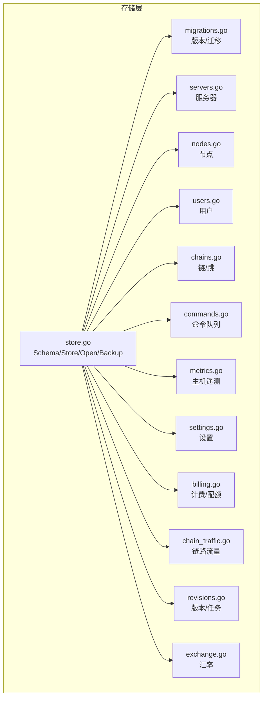

**图表来源** 
- [store.go:15-353](file://src/backend/internal/store/store.go#L15-L353)
- [migrations.go:18-52](file://src/backend/internal/store/migrations.go#L18-L52)

**章节来源**
- [store.go:15-353](file://src/backend/internal/store/store.go#L15-L353)
- [migrations.go:18-52](file://src/backend/internal/store/migrations.go#L18-L52)

## 核心组件
- Store：SQLite 连接封装，提供 Open、Ping、Close、Backup；通过 _pragma=busy_timeout(5000) 与 SetMaxOpenConns(1) 避免 database is locked
- Schema：集中定义所有表结构与部分索引，作为初始建表与迁移的基准
- 迁移器：initializeSchema 负责读取 user_version、执行 Schema、执行增量迁移、记录版本
- 领域模块：按实体划分，提供 CRUD、状态机推进、级联删除、统计聚合等方法

**章节来源**
- [store.go:355-396](file://src/backend/internal/store/store.go#L355-L396)
- [store.go:15-353](file://src/backend/internal/store/store.go#L15-L353)
- [migrations.go:18-52](file://src/backend/internal/store/migrations.go#L18-L52)

## 架构总览
整体数据流围绕“配置下发与执行”、“遥测上报”、“计费与流量统计”三条主线展开：
- 配置下发：通过 commands 表驱动 Agent 执行，链与版本系统协调多跳拓扑
- 遥测上报：server_metrics 最新值与历史样本，结合 server_network_usage_daily 做日累计
- 计费与流量：server_billing、server_traffic_plans、traffic、chain_traffic_* 支撑用量与账单

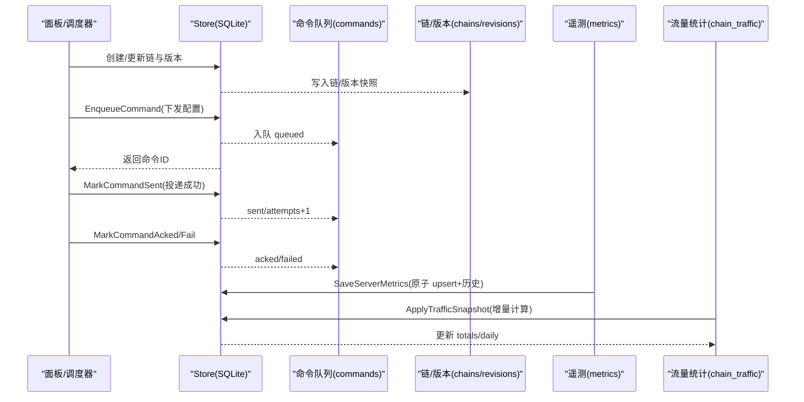

**图表来源** 
- [commands.go:36-119](file://src/backend/internal/store/commands.go#L36-L119)
- [revisions.go:87-113](file://src/backend/internal/store/revisions.go#L87-L113)
- [metrics.go:47-107](file://src/backend/internal/store/metrics.go#L47-L107)
- [chain_traffic.go:39-104](file://src/backend/internal/store/chain_traffic.go#L39-L104)

## 详细组件分析

### 服务器（servers）
- 字段要点：别名、长期凭证 token、自动/手动地址模式、NAT 端口段、标签、国家代码、位置、凭证 epoch/pending/committed、连接时间戳、agent 设置版本与错误
- 关键方法：CreateServer、ServerByToken、TouchServer、UpdateServerAddress、RotateServerToken、DeleteServerCascade
- 约束与索引：token 唯一；address_mode 控制是否允许被 session.open 覆盖；NAT 类型由 panel 校验

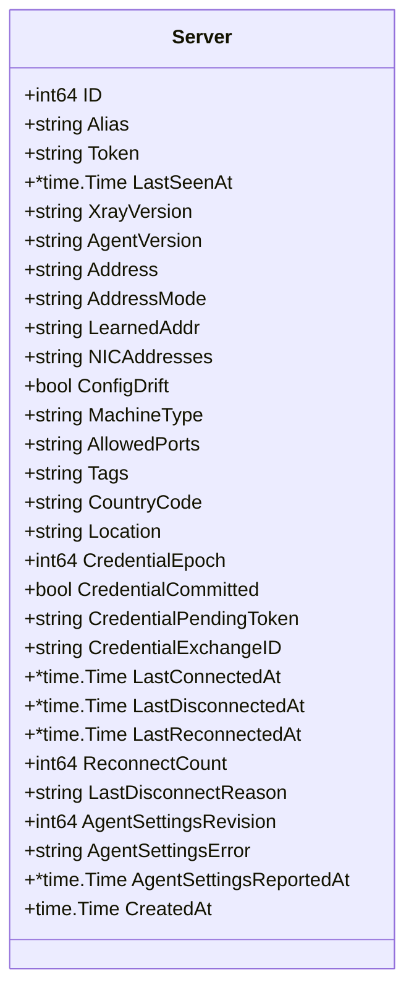

**图表来源** 
- [servers.go:25-56](file://src/backend/internal/store/servers.go#L25-L56)

**章节来源**
- [servers.go:94-113](file://src/backend/internal/store/servers.go#L94-L113)
- [servers.go:115-126](file://src/backend/internal/store/servers.go#L115-L126)
- [servers.go:250-264](file://src/backend/internal/store/servers.go#L250-L264)
- [servers.go:304-332](file://src/backend/internal/store/servers.go#L304-L332)

### 节点（nodes）
- 状态机：pending → applying → active | failed
- 字段要点：协议、端口（nil 表示 Agent 自动挑选）、模板配置、实际生效配置
- 关键方法：InsertNode、ListNodes、SetNodeApplying、SetNodeActive、SetNodeFailed、DeleteNode

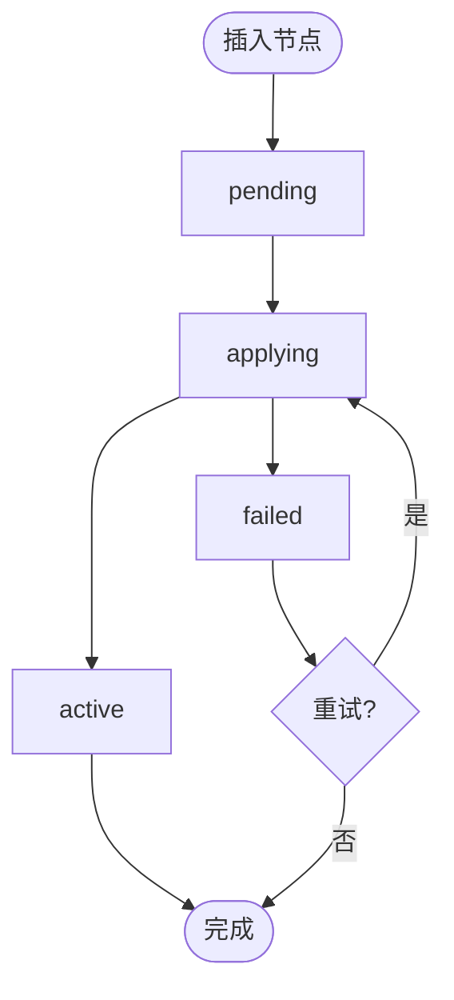

**图表来源** 
- [nodes.go:12-18](file://src/backend/internal/store/nodes.go#L12-L18)
- [nodes.go:59-68](file://src/backend/internal/store/nodes.go#L59-L68)
- [nodes.go:102-122](file://src/backend/internal/store/nodes.go#L102-L122)

**章节来源**
- [nodes.go:59-68](file://src/backend/internal/store/nodes.go#L59-L68)
- [nodes.go:102-122](file://src/backend/internal/store/nodes.go#L102-L122)
- [nodes.go:124-140](file://src/backend/internal/store/nodes.go#L124-L140)

### 用户（users）与用户-节点关联（user_nodes）
- 用户字段：UUID（跨服务器统一）、sub_token、有效期、过期标记、停用标记
- 关联：user_nodes(user_id, node_id) 主键，默认无关联即无访问权
- 关键方法：InsertUser、UserBySubToken、SetUserExpired、SetUserDisabled、SetUserExpiry、SetUserNodes、NodeUserUUIDs

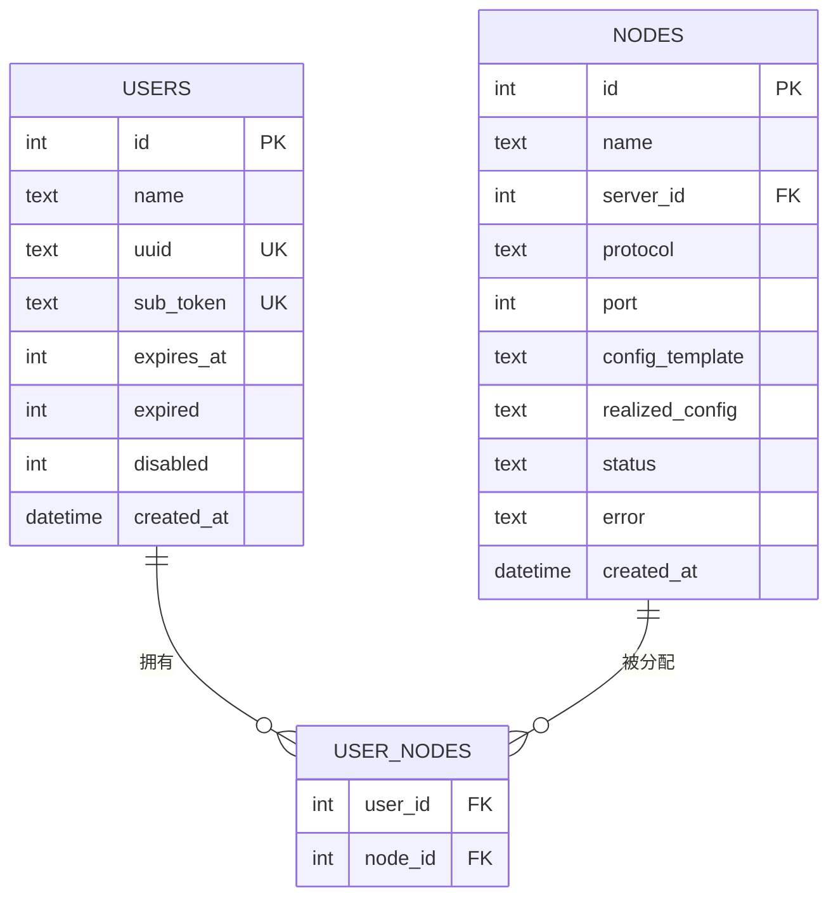

**图表来源** 
- [users.go:14-23](file://src/backend/internal/store/users.go#L14-L23)
- [store.go:162-167](file://src/backend/internal/store/store.go#L162-L167)

**章节来源**
- [users.go:25-38](file://src/backend/internal/store/users.go#L25-L38)
- [users.go:118-152](file://src/backend/internal/store/users.go#L118-L152)
- [users.go:213-253](file://src/backend/internal/store/users.go#L213-L253)
- [users.go:255-275](file://src/backend/internal/store/users.go#L255-L275)

### 链（chains）与跳（chain_hops）
- 链状态机：pending → applying → active | failed；支持 degraded、waiting_for_agent、active_unconfirmed、active_failed、cleanup_pending、invalid、deleted
- 跳角色：entry / middle / exit；状态机同节点
- 关键方法：InsertChain、InsertChainHop、ChainHops、SetChainStatus、SetChainHopStatus、DeleteChain（软删）

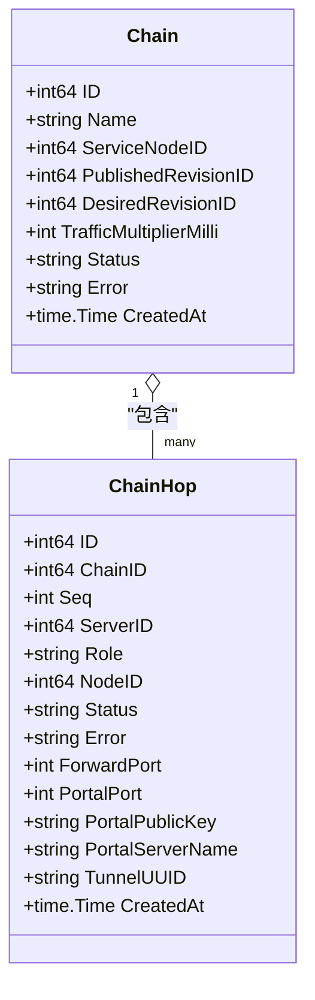

**图表来源** 
- [chains.go:43-73](file://src/backend/internal/store/chains.go#L43-L73)
- [chains.go:112-152](file://src/backend/internal/store/chains.go#L112-L152)

**章节来源**
- [chains.go:112-152](file://src/backend/internal/store/chains.go#L112-L152)
- [chains.go:231-258](file://src/backend/internal/store/chains.go#L231-L258)
- [chains.go:260-292](file://src/backend/internal/store/chains.go#L260-L292)

### 命令队列（commands）
- 状态机：queued → sent → acked | failed；支持 abandoned（死信）
- 用途：离线命令队列与操作日志；支持按 request_id 去重与重试计数 attempts
- 关键方法：EnqueueCommand、QueuedCommands、MarkCommandSent、MarkCommandAcked、MarkCommandFailedWithError、RecentCommands、DeadLetterCommand

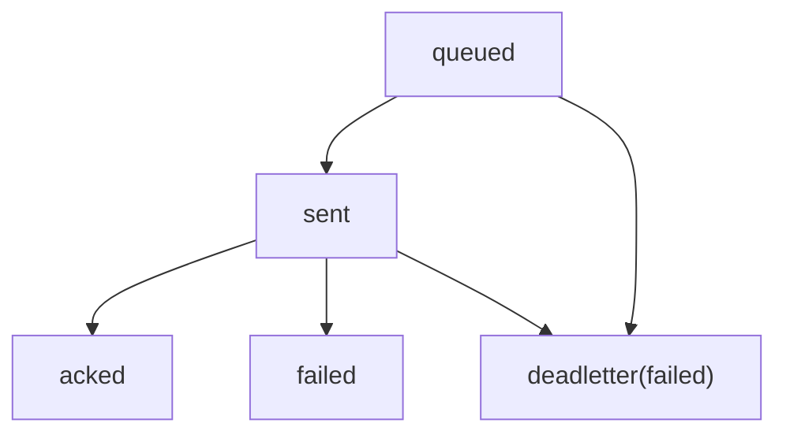

**图表来源** 
- [commands.go:11-18](file://src/backend/internal/store/commands.go#L11-L18)
- [commands.go:36-51](file://src/backend/internal/store/commands.go#L36-L51)
- [commands.go:77-83](file://src/backend/internal/store/commands.go#L77-L83)
- [commands.go:115-137](file://src/backend/internal/store/commands.go#L115-L137)
- [commands.go:181-187](file://src/backend/internal/store/commands.go#L181-L187)

**章节来源**
- [commands.go:36-51](file://src/backend/internal/store/commands.go#L36-L51)
- [commands.go:77-83](file://src/backend/internal/store/commands.go#L77-L83)
- [commands.go:115-137](file://src/backend/internal/store/commands.go#L115-L137)
- [commands.go:181-187](file://src/backend/internal/store/commands.go#L181-L187)

### 主机遥测（server_metrics、server_metric_history、server_network_usage_daily）
- server_metrics：每服务器一行最新值，upsert 更新
- server_metric_history：采样历史，按 server_id + sampled_at 索引
- server_network_usage_daily：按 usage_date 累计 tx/rx 字节
- 关键方法：SaveServerMetrics、ServerMetricsMap、RecentServerMetricSamples、ServerMetricHistory、DeleteExpiredServerMetricHistory、AddTraffic、TrafficByNode、TrafficByUser、UserTraffic

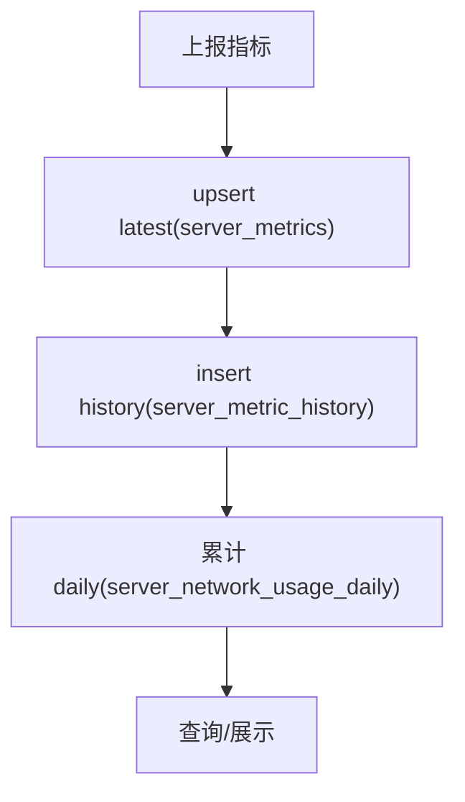

**图表来源** 
- [metrics.go:47-107](file://src/backend/internal/store/metrics.go#L47-L107)
- [metrics.go:141-167](file://src/backend/internal/store/metrics.go#L141-L167)
- [metrics.go:202-213](file://src/backend/internal/store/metrics.go#L202-L213)

**章节来源**
- [metrics.go:47-107](file://src/backend/internal/store/metrics.go#L47-L107)
- [metrics.go:141-167](file://src/backend/internal/store/metrics.go#L141-L167)
- [metrics.go:202-213](file://src/backend/internal/store/metrics.go#L202-L213)

### 设置（settings）与 Agent 全局设置
- settings：key/value 键值对，DB 优先于启动参数
- AgentSettings：JSON 对象，首次使用生成默认值并保存；更新时递增 revision 并在同一事务中持久化
- 关键方法：GetSetting、SetSetting、DeleteSetting、PanelInstanceID、AgentSettings、UpdateAgentSettings

**章节来源**
- [settings.go:42-64](file://src/backend/internal/store/settings.go#L42-L64)
- [settings.go:75-99](file://src/backend/internal/store/settings.go#L75-L99)
- [settings.go:101-123](file://src/backend/internal/store/settings.go#L101-L123)
- [settings.go:125-158](file://src/backend/internal/store/settings.go#L125-L158)

### 计费与流量配额（providers、server_billing、server_traffic_plans）
- providers：计费提供方
- server_billing：服务器计费信息（金额、币种、周期、状态、下次续费时间等）
- server_traffic_plans：服务器流量配额与重置锚点
- 关键方法：UpsertServerBilling、ServerTrafficPlanMap、UpsertServerTrafficPlan、ServerNetworkUsage

**章节来源**
- [billing.go:129-143](file://src/backend/internal/store/billing.go#L129-L143)
- [billing.go:145-175](file://src/backend/internal/store/billing.go#L145-L175)
- [billing.go:177-181](file://src/backend/internal/store/billing.go#L177-L181)

### 汇率（exchange_rates、custom_exchange_rates）
- exchange_rates：外部汇率源，按 base/quote 唯一键 upsert
- custom_exchange_rates：自定义汇率映射，支持启用开关与唯一性约束
- 关键方法：ReplaceExchangeRates、ExchangeRates、LatestExchangeFetch、UpsertCustomExchangeRate、ListCustomExchangeRates

**章节来源**
- [exchange.go:29-44](file://src/backend/internal/store/exchange.go#L29-L44)
- [exchange.go:72-87](file://src/backend/internal/store/exchange.go#L72-L87)
- [exchange.go:89-125](file://src/backend/internal/store/exchange.go#L89-L125)

### 链路流量统计（chain_traffic_totals、chain_traffic_daily、chain_traffic_baselines、traffic_cursors）
- traffic_cursors：按 server_id + counter_key 记录实例增量游标，避免重复计算
- chain_traffic_totals：链维度原始与有效流量累计，含小数位余量
- chain_traffic_daily：按日期/时区汇总
- chain_traffic_baselines：基线重置用于清零统计
- 关键方法：ApplyTrafficSnapshot、ChainTrafficTotals、ResetChainTraffic、SetChainTrafficMultiplier、ChainTrafficDaily

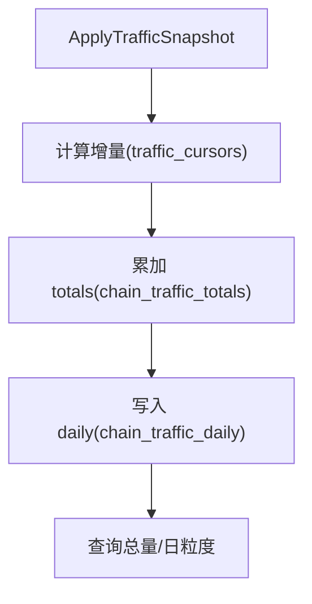

**图表来源** 
- [chain_traffic.go:39-104](file://src/backend/internal/store/chain_traffic.go#L39-L104)
- [chain_traffic.go:195-223](file://src/backend/internal/store/chain_traffic.go#L195-L223)
- [chain_traffic.go:278-286](file://src/backend/internal/store/chain_traffic.go#L278-L286)

**章节来源**
- [chain_traffic.go:39-104](file://src/backend/internal/store/chain_traffic.go#L39-L104)
- [chain_traffic.go:195-223](file://src/backend/internal/store/chain_traffic.go#L195-L223)
- [chain_traffic.go:278-286](file://src/backend/internal/store/chain_traffic.go#L278-L286)

### 版本与任务（chain_revisions、chain_revision_tasks）
- chain_revisions：链版本快照，含 hops、service_node、traffic_multiplier 等
- chain_revision_tasks：按 task_key 分阶段任务，与 commands 关联
- 关键方法：CreateChainRevision、PublishChainRevision、ReplaceWorkingChainTopology、NextChainHopID、EnqueueRevisionTaskCommand

**章节来源**
- [revisions.go:87-113](file://src/backend/internal/store/revisions.go#L87-L113)
- [revisions.go:387-418](file://src/backend/internal/store/revisions.go#L387-L418)
- [revisions.go:429-469](file://src/backend/internal/store/revisions.go#L429-L469)
- [revisions.go:320-356](file://src/backend/internal/store/revisions.go#L320-L356)

## 依赖关系分析
- Store 是所有表的统一入口，Open 时执行 initializeSchema 确保表存在与版本一致
- 各实体模块通过 Store.db 直接执行 SQL，保持低耦合与高内聚
- 迁移逻辑集中在 migrations.go，通过 ensureColumns 与特定迁移函数保证向前兼容

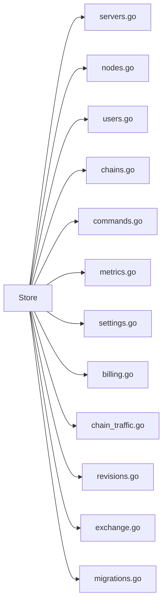

**图表来源** 
- [store.go:355-396](file://src/backend/internal/store/store.go#L355-L396)
- [migrations.go:18-52](file://src/backend/internal/store/migrations.go#L18-L52)

**章节来源**
- [store.go:355-396](file://src/backend/internal/store/store.go#L355-L396)
- [migrations.go:18-52](file://src/backend/internal/store/migrations.go#L18-L52)

## 性能与并发控制
- 连接池：SetMaxOpenConns(1)，单连接避免 SQLite 并发写冲突
- 锁机制：_pragma=busy_timeout(5000) 等待 5 秒，降低 database is locked 概率
- 事务：大量写操作使用 BeginTx，保证原子性与一致性
- 备份：VACUUM INTO 导出一致性快照，与并发读写安全共存
- 索引：为 rpc_idempotency.created_at、server_metric_history(server_id, sampled_at) 建立索引提升查询性能

**章节来源**
- [store.go:365-383](file://src/backend/internal/store/store.go#L365-L383)
- [store.go:388-395](file://src/backend/internal/store/store.go#L388-L395)
- [store.go:160](file://src/backend/internal/store/store.go#L160-L160)
- [store.go:210-211](file://src/backend/internal/store/store.go#L210-L211)

## 数据迁移策略
- 版本管理：schemaVersion 常量与 PRAGMA user_version 配合，启动时比较版本
- 初始化：先执行 Schema 建表，再根据 version < schemaVersion 执行 migrateSchema
- 增量迁移：ensureColumns 动态检测列是否存在并 ADD COLUMN；针对旧表结构进行 rename/create/insert/drop
- 特殊迁移：migrateCommands、migrateServerMetrics、migrateCustomExchangeRates 处理复杂变更
- 回滚机制：initializeSchema 在失败时 Rollback，保证数据库一致性

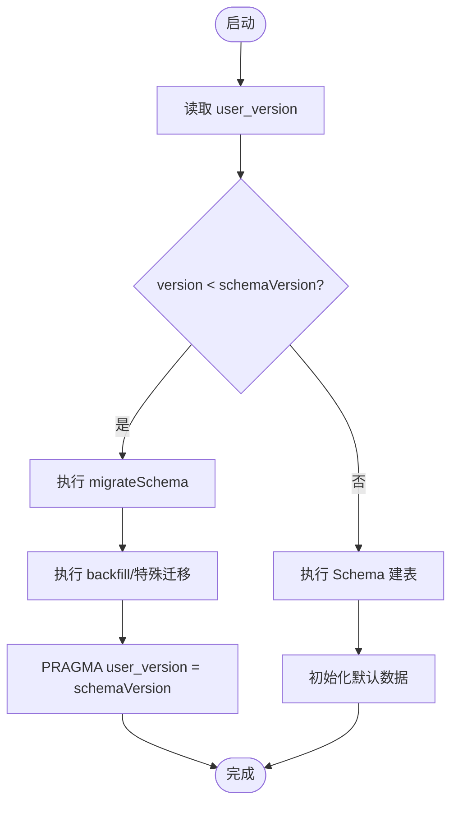

**图表来源** 
- [migrations.go:18-52](file://src/backend/internal/store/migrations.go#L18-L52)
- [migrations.go:54-144](file://src/backend/internal/store/migrations.go#L54-L144)
- [migrations.go:184-245](file://src/backend/internal/store/migrations.go#L184-L245)
- [migrations.go:247-306](file://src/backend/internal/store/migrations.go#L247-L306)
- [migrations.go:308-318](file://src/backend/internal/store/migrations.go#L308-L318)

**章节来源**
- [migrations.go:18-52](file://src/backend/internal/store/migrations.go#L18-L52)
- [migrations.go:54-144](file://src/backend/internal/store/migrations.go#L54-L144)
- [migrations.go:184-245](file://src/backend/internal/store/migrations.go#L184-L245)
- [migrations.go:247-306](file://src/backend/internal/store/migrations.go#L247-L306)
- [migrations.go:308-318](file://src/backend/internal/store/migrations.go#L308-L318)

## 最佳实践与常见问题
- 使用事务：批量写操作务必使用 BeginTx，确保原子性（如 DeleteServerCascade、ReplaceWorkingChainTopology）
- 幂等性：rpc_idempotency 表保障请求幂等；commands 的 request_id 唯一避免重复处理
- 避免锁竞争：尽量将写操作合并到事务中，减少长时间持有锁
- 正确维护索引：为高频查询列添加索引（如 server_metric_history.server_id, sampled_at）
- 清理历史数据：定期删除过期的 server_metric_history，防止膨胀
- 备份策略：使用 Backup(VACUUM INTO) 导出一致性快照，便于恢复与审计
- 常见问题：
  - database is locked：检查是否有长事务或并发写过多，确认 busy_timeout 设置合理
  - 迁移失败：查看 initializeSchema 错误信息，必要时回滚并修复迁移脚本
  - 命令未终态：检查 DeadLetterCommand 是否触发，确认重试上限与错误原因

**章节来源**
- [store.go:365-383](file://src/backend/internal/store/store.go#L365-L383)
- [store.go:388-395](file://src/backend/internal/store/store.go#L388-L395)
- [commands.go:181-187](file://src/backend/internal/store/commands.go#L181-L187)
- [metrics.go:192-200](file://src/backend/internal/store/metrics.go#L192-L200)

## 结论
Lattix-codex 数据存储层以 SQLite 为核心，通过单连接 + busy_timeout 与完善的事务与迁移机制，实现了稳定、可扩展且易于维护的数据访问层。表结构设计清晰，实体关系明确，覆盖了服务器、节点、用户、链路、遥测、计费、汇率等核心业务域。开发者应遵循事务与幂等性原则，合理使用索引与备份策略，以确保系统在高并发场景下的可靠性与性能。