# 数据库设计

<cite>
**本文引用的文件**
- [store.go](file://src/backend/internal/store/store.go)
- [migrations.go](file://src/backend/internal/store/migrations.go)
- [servers.go](file://src/backend/internal/store/servers.go)
- [users.go](file://src/backend/internal/store/users.go)
- [nodes.go](file://src/backend/internal/store/nodes.go)
- [chains.go](file://src/backend/internal/store/chains.go)
- [commands.go](file://src/backend/internal/store/commands.go)
- [chain_traffic.go](file://src/backend/internal/store/chain_traffic.go)
- [revisions.go](file://src/backend/internal/store/revisions.go)
- [metrics.go](file://src/backend/internal/store/metrics.go)
- [billing.go](file://src/backend/internal/store/billing.go)
</cite>

## 目录
1. [简介](#简介)
2. [项目结构](#项目结构)
3. [核心组件](#核心组件)
4. [架构总览](#架构总览)
5. [详细组件分析](#详细组件分析)
6. [依赖关系分析](#依赖关系分析)
7. [性能与索引优化](#性能与索引优化)
8. [故障排查指南](#故障排查指南)
9. [结论](#结论)
10. [附录：完整建表语句与约束说明](#附录完整建表语句与约束说明)

## 简介
本技术文档面向 Lattix-codex 的 SQLite 数据模型，系统性梳理所有核心表结构与字段含义、数据类型、约束条件与索引策略；解释表间关系与关联规则（外键、唯一性）；总结数据模型的设计原则与命名规范；给出完整的 SQL 建表语句与索引优化建议；并说明特殊字段的使用场景（JSON 存储格式、状态枚举值等），以及数据完整性保证机制与并发访问控制策略。

## 项目结构
后端通过 store 包集中管理 SQLite 数据访问与模式定义：
- 模式定义与初始化：Schema 常量与 initializeSchema/migrateSchema 流程
- 核心实体 CRUD：servers、users、nodes、chains、commands 等
- 扩展域：计费 providers/server_billing/server_traffic_plans、汇率 exchange_rates/custom_exchange_rates
- 遥测与流量：server_metrics、server_metric_history、server_network_usage_daily、traffic、traffic_cursors
- 链式编排与版本：chains、chain_hops、chain_revisions、chain_revision_tasks、chain_hop_identities
- 幂等性与设置：rpc_idempotency、settings

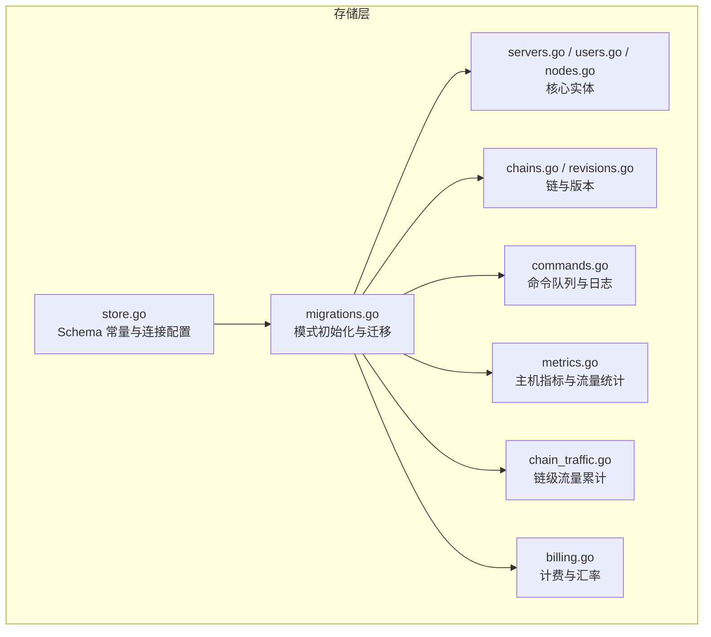

**图表来源**
- [store.go:18-356](file://src/backend/internal/store/store.go#L18-L356)
- [migrations.go:18-52](file://src/backend/internal/store/migrations.go#L18-L52)

**章节来源**
- [store.go:18-356](file://src/backend/internal/store/store.go#L18-L356)
- [migrations.go:18-52](file://src/backend/internal/store/migrations.go#L18-L52)

## 核心组件
- servers：服务器元数据、地址学习、NAT 端口段、标签与地理信息、凭证轮换与 Agent 设置同步
- users：用户主数据，跨服务器统一 UUID，订阅令牌与有效期/停用标记
- nodes：节点（服务入口），模板与实际生效配置、状态机
- chains 与 chain_hops：链路拓扑与逐跳状态、角色（entry/middle/exit）、端口与隧道标识
- commands：离线命令队列与操作日志，状态流转与死信处理
- metrics：主机指标最新值与历史样本、网络日累计
- traffic/traffic_cursors：增量流量累计与去重
- billing/providers/exchange_rates：计费、周期、汇率与自定义汇率
- rpc_idempotency/settings：接口幂等缓存与全局设置

**章节来源**
- [store.go:18-356](file://src/backend/internal/store/store.go#L18-L356)
- [servers.go:25-56](file://src/backend/internal/store/servers.go#L25-L56)
- [users.go:14-23](file://src/backend/internal/store/users.go#L14-L23)
- [nodes.go:20-34](file://src/backend/internal/store/nodes.go#L20-L34)
- [chains.go:43-73](file://src/backend/internal/store/chains.go#L43-L73)
- [commands.go:22-34](file://src/backend/internal/store/commands.go#L22-L34)
- [metrics.go:12-31](file://src/backend/internal/store/metrics.go#L12-L31)
- [chain_traffic.go:14-37](file://src/backend/internal/store/chain_traffic.go#L14-L37)
- [billing.go:20-50](file://src/backend/internal/store/billing.go#L20-L50)

## 架构总览
SQLite 作为单进程内嵌数据库，采用“单连接 + busy_timeout”的并发控制策略，避免 database is locked 错误。Schema 在启动时以事务方式创建并执行迁移，确保向后兼容。

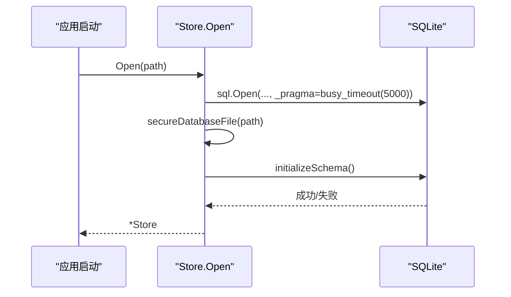

**图表来源**
- [store.go:368-389](file://src/backend/internal/store/store.go#L368-L389)
- [store.go:391-419](file://src/backend/internal/store/store.go#L391-L419)

**章节来源**
- [store.go:368-389](file://src/backend/internal/store/store.go#L368-L389)

## 详细组件分析

### 表：servers
- 用途：记录服务器基本信息、公网地址学习与 NAT 能力、Agent 版本与设置同步、连接生命周期与凭证轮换
- 关键字段
  - alias/token：别名与长期凭证（token 唯一）
  - address/address_mode/learned_addr：手动或自动地址学习
  - nic_addresses/allowed_ports/tags/country_code/location：JSON 数组或文本元数据
  - credential_*：凭证 epoch、提交态、待换发 token 与交换 ID
  - last_connected/disconnected/reconnected_at、reconnect_count、last_disconnect_reason：连接状态
  - agent_settings_*：Agent 设置版本、错误与上报时间
- 约束与索引
  - id 自增主键
  - token 唯一
  - 无显式外键（逻辑上被其他表引用）
- 典型操作
  - 创建/更新别名/地址/端口段/标签/地理信息
  - 记录连接/断开事件
  - 凭证轮换与重置 bootstrap
  - 删除级联清理

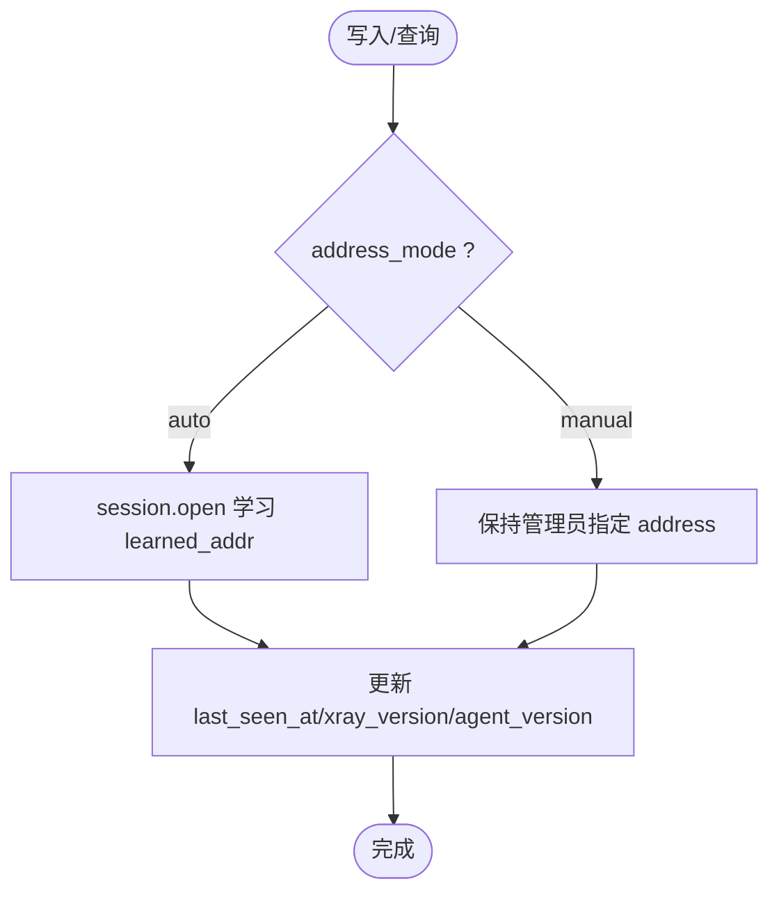

**图表来源**
- [store.go:19-49](file://src/backend/internal/store/store.go#L19-L49)
- [servers.go:287-301](file://src/backend/internal/store/servers.go#L287-L301)

**章节来源**
- [store.go:19-49](file://src/backend/internal/store/store.go#L19-L49)
- [servers.go:25-56](file://src/backend/internal/store/servers.go#L25-L56)
- [servers.go:287-301](file://src/backend/internal/store/servers.go#L287-L301)

### 表：users
- 用途：用户主数据，跨服务器统一 UUID，独立订阅令牌，有效期与停权标记
- 关键字段
  - uuid/sub_token：唯一标识与订阅令牌
  - expires_at/expired/disabled：到期时间与停权标志（正交）
- 约束与索引
  - id 自增主键
  - uuid、sub_token 唯一
- 典型操作
  - 插入/查询/删除
  - 到期扫描与停权标记
  - 用户-节点分配（user_nodes）

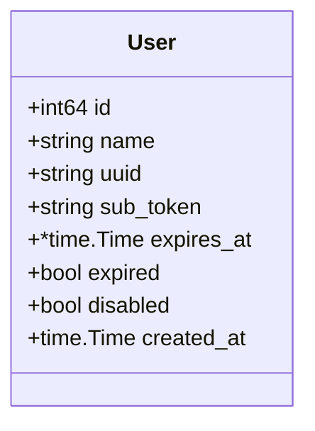

**图表来源**
- [store.go:116-125](file://src/backend/internal/store/store.go#L116-L125)
- [users.go:14-23](file://src/backend/internal/store/users.go#L14-L23)

**章节来源**
- [store.go:116-125](file://src/backend/internal/store/store.go#L116-L125)
- [users.go:14-23](file://src/backend/internal/store/users.go#L14-L23)

### 表：nodes
- 用途：节点（服务入口）配置模板与实际生效配置、状态机
- 关键字段
  - name/server_id/protocol/port/config_template/realized_config/status/error
- 约束与索引
  - id 自增主键
  - server_id 外键指向 servers(id)
- 状态机：pending → applying → active | failed

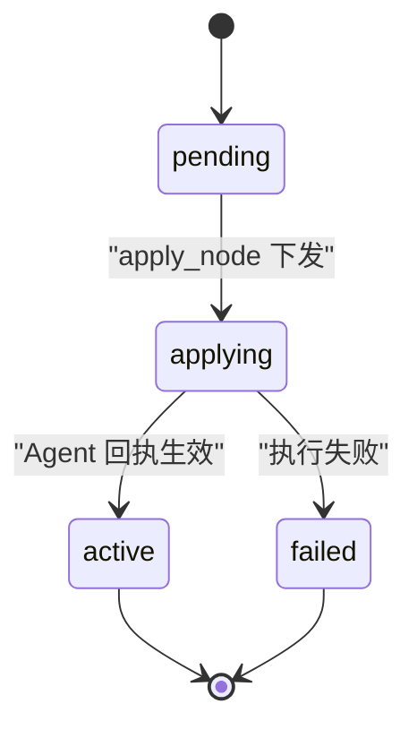

**图表来源**
- [store.go:127-138](file://src/backend/internal/store/store.go#L127-L138)
- [nodes.go:12-18](file://src/backend/internal/store/nodes.go#L12-L18)

**章节来源**
- [store.go:127-138](file://src/backend/internal/store/store.go#L127-L138)
- [nodes.go:20-34](file://src/backend/internal/store/nodes.go#L20-L34)

### 表：chains 与 chain_hops
- chains：链路名称、服务节点、发布/期望版本、流量倍率、软删除
- chain_hops：逐跳序列、角色（entry/middle/exit）、端口与隧道信息、状态与错误
- 约束与索引
  - chains.id 自增主键
  - chain_hops.chain_id 外键指向 chains(id)
  - chain_hops.server_id 外键指向 servers(id)
- 状态机：链与跳均遵循 pending → applying → active | failed，链可因跳离线推导 degraded

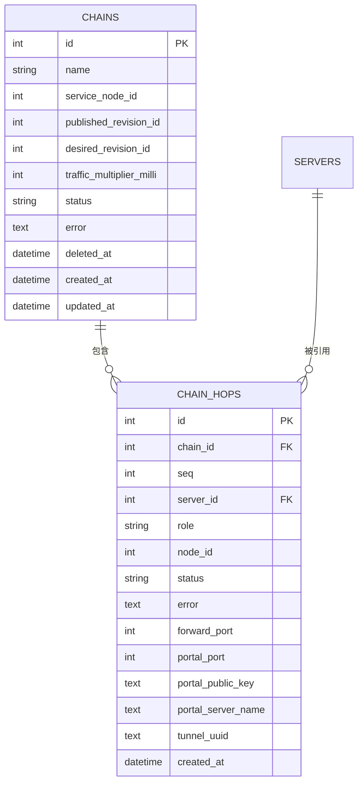

**图表来源**
- [store.go:233-262](file://src/backend/internal/store/store.go#L233-L262)

**章节来源**
- [store.go:233-262](file://src/backend/internal/store/store.go#L233-L262)
- [chains.go:43-73](file://src/backend/internal/store/chains.go#L43-L73)

### 表：commands
- 用途：离线命令队列与操作日志；状态 queued → sent → acked | failed；支持死信
- 关键字段
  - request_id（唯一）、trace_id、server_id、type、data(JSON)、status、error、attempts、created_at/updated_at
- 约束与索引
  - id 自增主键
  - request_id 唯一
  - server_id 外键指向 servers(id)
- 典型操作
  - 入队、按服务器取待发、发送后标记、确认/失败终态、最近日志

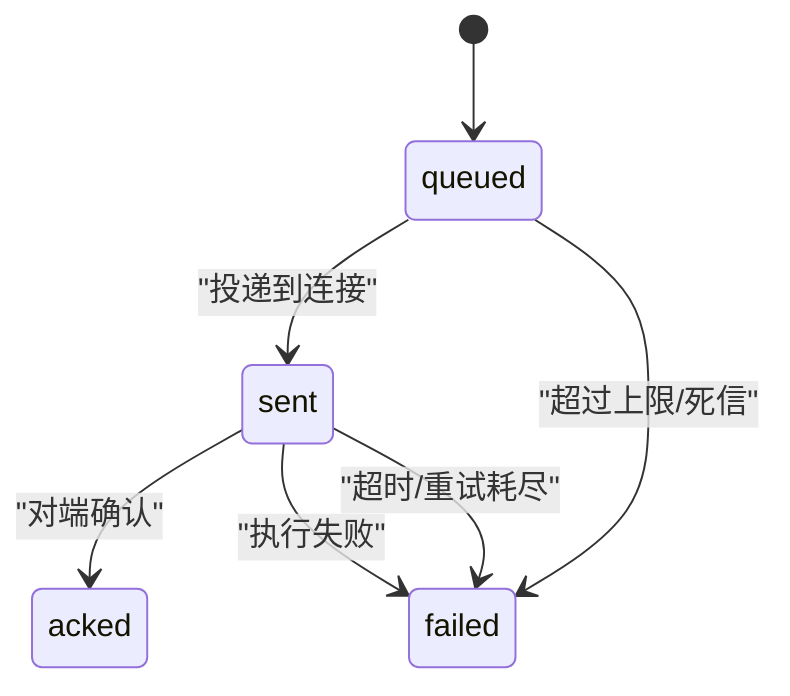

**图表来源**
- [store.go:140-152](file://src/backend/internal/store/store.go#L140-L152)
- [commands.go:11-18](file://src/backend/internal/store/commands.go#L11-L18)

**章节来源**
- [store.go:140-152](file://src/backend/internal/store/store.go#L140-L152)
- [commands.go:22-34](file://src/backend/internal/store/commands.go#L22-L34)

### 表：traffic 与 traffic_cursors
- traffic：节点维度（user_uuid=''）与用户维度（node_id=0）的累计流量
- traffic_cursors：按 server_id+counter_key 记录实例增量游标，用于去重计算差值
- 约束与索引
  - traffic.unique(node_id, user_uuid)
  - traffic_cursors.primary(server_id, counter_key)

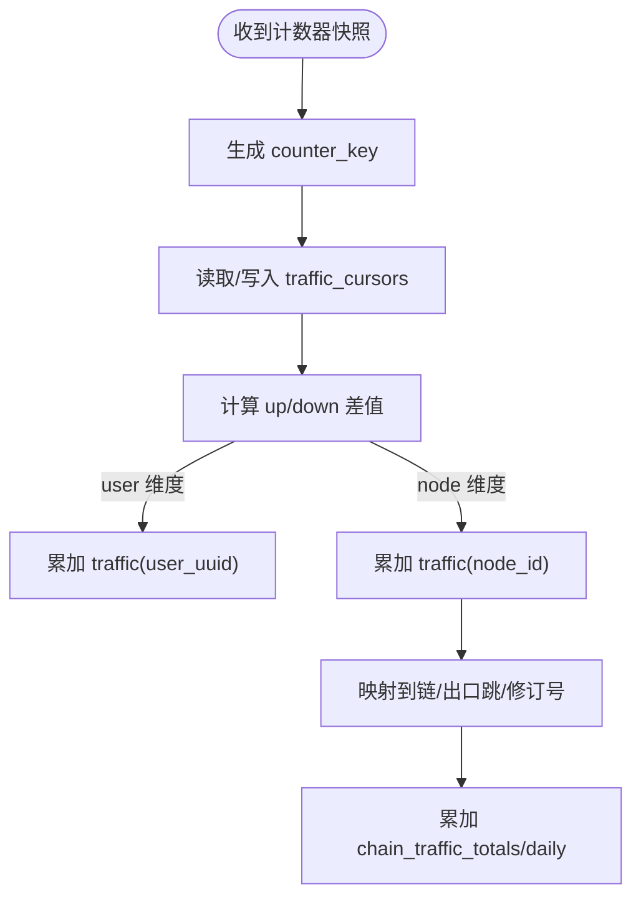

**图表来源**
- [store.go:222-231](file://src/backend/internal/store/store.go#L222-L231)
- [store.go:264-272](file://src/backend/internal/store/store.go#L264-L272)
- [chain_traffic.go:39-104](file://src/backend/internal/store/chain_traffic.go#L39-L104)

**章节来源**
- [store.go:222-231](file://src/backend/internal/store/store.go#L222-L231)
- [store.go:264-272](file://src/backend/internal/store/store.go#L264-L272)
- [chain_traffic.go:39-104](file://src/backend/internal/store/chain_traffic.go#L39-L104)

### 表：server_metrics 与 server_metric_history
- server_metrics：每台服务器最新指标（load、CPU、内存、磁盘、网络、延迟、运行时长）
- server_metric_history：采样历史，带 sampled_at 时间戳
- 约束与索引
  - server_metrics.primary(server_id)
  - server_metric_history.index(server_id, sampled_at)

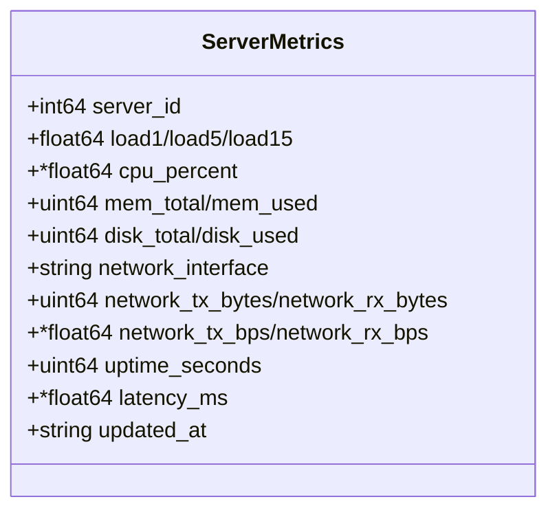

**图表来源**
- [store.go:173-191](file://src/backend/internal/store/store.go#L173-L191)
- [store.go:193-214](file://src/backend/internal/store/store.go#L193-L214)
- [metrics.go:12-31](file://src/backend/internal/store/metrics.go#L12-L31)

**章节来源**
- [store.go:173-191](file://src/backend/internal/store/store.go#L173-L191)
- [store.go:193-214](file://src/backend/internal/store/store.go#L193-L214)
- [metrics.go:12-31](file://src/backend/internal/store/metrics.go#L12-L31)

### 表：providers、server_billing、server_traffic_plans、exchange_rates、custom_exchange_rates
- providers：供应商基础信息
- server_billing：服务器计费明细（金额、币种、周期、状态、下次续费、检查时间）
- server_traffic_plans：服务器流量计划（配额、会计模式、重置锚点与单位、跟踪起始时间）
- exchange_rates：公共汇率（base/quote/rate/date/source/fetched_at），主键(base_currency, quote_currency)
- custom_exchange_rates：自定义汇率（source/target 唯一）

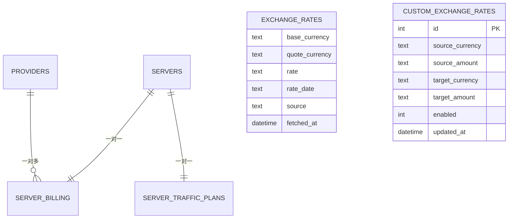

**图表来源**
- [store.go:51-74](file://src/backend/internal/store/store.go#L51-L74)
- [store.go:76-85](file://src/backend/internal/store/store.go#L76-L85)
- [store.go:95-114](file://src/backend/internal/store/store.go#L95-L114)

**章节来源**
- [store.go:51-74](file://src/backend/internal/store/store.go#L51-L74)
- [store.go:76-85](file://src/backend/internal/store/store.go#L76-L85)
- [store.go:95-114](file://src/backend/internal/store/store.go#L95-L114)
- [billing.go:20-50](file://src/backend/internal/store/billing.go#L20-L50)

### 表：rpc_idempotency、settings
- rpc_idempotency：接口幂等缓存（operator, route, idempotency_key 复合主键）
- settings：key/value 全局设置（如时区）

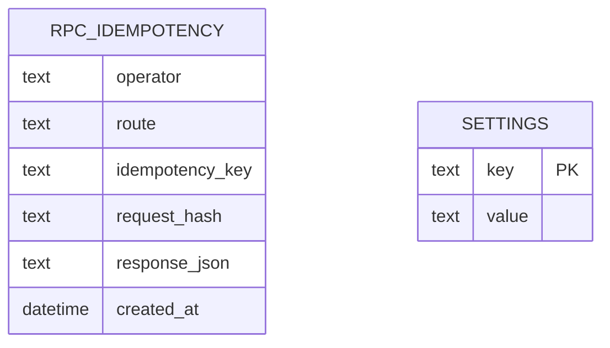

**图表来源**
- [store.go:154-163](file://src/backend/internal/store/store.go#L154-L163)
- [store.go:217-220](file://src/backend/internal/store/store.go#L217-L220)

**章节来源**
- [store.go:154-163](file://src/backend/internal/store/store.go#L154-L163)
- [store.go:217-220](file://src/backend/internal/store/store.go#L217-L220)

### 表：chain_revisions、chain_revision_tasks、chain_hop_identities
- chain_revisions：链版本快照（含 hops、service 配置、倍率、apply_keys），唯一(chain_id, revision_no)
- chain_revision_tasks：版本任务（phase/action/kind/hop_id/server_id/command_id/status）
- chain_hop_identities：跳身份归档（archived_at）

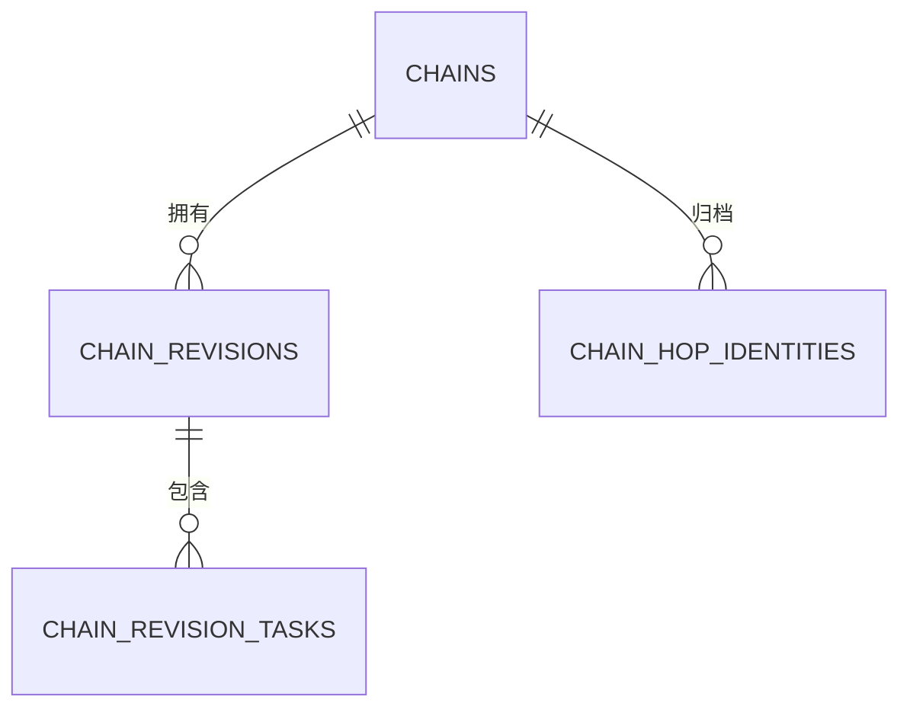

**图表来源**
- [store.go:318-354](file://src/backend/internal/store/store.go#L318-L354)

**章节来源**
- [store.go:318-354](file://src/backend/internal/store/store.go#L318-L354)
- [revisions.go:62-86](file://src/backend/internal/store/revisions.go#L62-L86)

## 依赖关系分析
- 外键关系（逻辑层面）
  - nodes.server_id → servers.id
  - commands.server_id → servers.id
  - chain_hops.chain_id → chains.id
  - chain_hops.server_id → servers.id
  - server_billing.server_id → servers.id
  - server_traffic_plans.server_id → servers.id
  - server_metrics.server_id → servers.id
  - server_metric_history.server_id → servers.id
  - server_network_usage_daily.server_id → servers.id
  - traffic_cursors.server_id → servers.id
  - chain_traffic_totals.chain_id → chains.id
  - chain_traffic_daily.chain_id → chains.id
  - chain_revisions.chain_id → chains.id
  - chain_revision_tasks.revision_id → chain_revisions.id
- 唯一性约束
  - servers.token
  - users.uuid、users.sub_token
  - commands.request_id
  - exchange_rates(base_currency, quote_currency)
  - custom_exchange_rates(source_currency, target_currency)
  - traffic(node_id, user_uuid)
  - chain_revisions(chain_id, revision_no)
  - chain_revision_tasks(revision_id, task_key)
  - rpc_idempotency(operator, route, idempotency_key)
  - server_metrics(server_id)
  - server_network_usage_daily(server_id, usage_date)
  - traffic_cursors(server_id, counter_key)

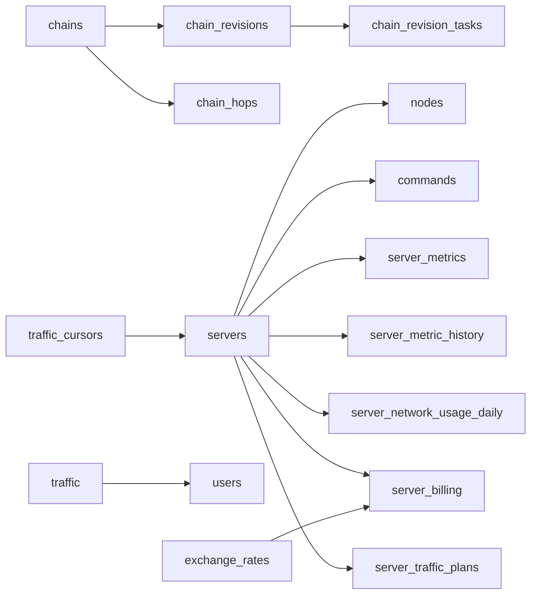

**图表来源**
- [store.go:19-356](file://src/backend/internal/store/store.go#L19-L356)

**章节来源**
- [store.go:19-356](file://src/backend/internal/store/store.go#L19-L356)

## 性能与索引优化
- 已定义索引
  - rpc_idempotency(created_at)：加速幂等结果过期清理
  - server_metric_history(server_id, sampled_at)：加速历史查询
- 建议索引（基于常见查询模式）
  - commands(server_id, status)：按服务器拉取待发命令
  - commands(type)：按类型批量拉取（链编排器使用）
  - chain_hops(chain_id, seq)：按链顺序遍历跳
  - chain_hops(server_id)：按服务器定位跳（degraded 推导）
  - chain_hops(node_id)：按业务节点反查出口跳
  - traffic(node_id, user_uuid)：已有唯一约束，覆盖查询
  - server_network_usage_daily(server_id, usage_date)：已有主键，覆盖查询
  - chain_traffic_daily(chain_id, hop_id, usage_date)：已有主键，覆盖查询
  - chain_revisions(chain_id, revision_no)：已有唯一约束
  - chain_revision_tasks(revision_id, status)：调度任务拉取
- 并发与锁
  - 单连接 + busy_timeout(5000ms)，避免 database is locked
  - 写路径尽量使用事务，减少锁竞争
  - 备份使用 VACUUM INTO，配合只读备份文件权限 0600

**章节来源**
- [store.go:368-389](file://src/backend/internal/store/store.go#L368-L389)
- [store.go:448-465](file://src/backend/internal/store/store.go#L448-L465)

## 故障排查指南
- 常见问题
  - database is locked：检查是否开启多连接或长时间未提交事务
  - 命令未终态：检查 commands.status 是否为 sent，是否存在迟到的 ack/failed
  - 节点状态卡在 applying：查看 nodes.error 与 chain_revision_tasks 状态
  - 链状态 degraded：检查 chain_hops 中是否有 server 离线导致的状态推导
  - 流量重复：检查 traffic_cursors.instance_id 与 up/down 单调性
- 诊断要点
  - 查看最近命令日志（RecentCommands）
  - 查看节点与链状态机转换
  - 检查指标与历史样本一致性
  - 校验幂等缓存是否命中

**章节来源**
- [commands.go:139-188](file://src/backend/internal/store/commands.go#L139-L188)
- [nodes.go:102-141](file://src/backend/internal/store/nodes.go#L102-L141)
- [chains.go:231-292](file://src/backend/internal/store/chains.go#L231-L292)
- [chain_traffic.go:119-140](file://src/backend/internal/store/chain_traffic.go#L119-L140)

## 结论
该 SQLite 数据模型围绕“服务器-用户-节点-链-命令-指标-流量-计费”的核心领域展开，采用强一致的事务与幂等机制保障可靠性，结合状态机驱动编排与增量累计实现高吞吐与低开销。通过合理的索引设计与单连接并发控制，满足面板与 Agent 的高频读写需求。建议在后续演进中持续完善索引覆盖与慢查询监控，确保稳定性与性能。

## 附录：完整建表语句与约束说明
以下为 Schema 常量中的完整建表语句（节选关键表），可直接用于初始化：

- servers
  - 主键：id
  - 唯一：token
  - 默认值：大量 NOT NULL DEFAULT 字段（见 schema）
- providers
  - 主键：id
  - 唯一：name(COLLATE NOCASE)
- server_billing
  - 主键：server_id（外键→servers）
- server_traffic_plans
  - 主键：server_id（外键→servers）
- server_network_usage_daily
  - 主键：(server_id, usage_date)
- exchange_rates
  - 主键：(base_currency, quote_currency)
- custom_exchange_rates
  - 主键：id
  - 唯一：(source_currency, target_currency)
- users
  - 主键：id
  - 唯一：uuid、sub_token
- nodes
  - 主键：id
  - 外键：server_id→servers(id)
- commands
  - 主键：id
  - 唯一：request_id
  - 外键：server_id→servers(id)
- rpc_idempotency
  - 主键：(operator, route, idempotency_key)
  - 索引：created_at
- user_nodes
  - 主键：(user_id, node_id)
  - 外键：user_id→users(id), node_id→nodes(id)
- server_metrics
  - 主键：server_id（外键→servers）
- server_metric_history
  - 主键：id
  - 外键：server_id→servers(id)
  - 索引：(server_id, sampled_at)
- settings
  - 主键：key
- traffic
  - 主键：id
  - 唯一：(node_id, user_uuid)
- chains
  - 主键：id
- chain_hops
  - 主键：id
  - 外键：chain_id→chains(id), server_id→servers(id)
- traffic_cursors
  - 主键：(server_id, counter_key)
  - 外键：server_id→servers(id)
- chain_traffic_totals
  - 主键：(chain_id, hop_id)
  - 外键：chain_id→chains(id)
- chain_traffic_baselines
  - 主键：(chain_id, hop_id)
  - 外键：chain_id→chains(id)
- chain_traffic_daily
  - 主键：(chain_id, hop_id, revision_id, usage_date, timezone)
  - 外键：chain_id→chains(id)
- chain_multiplier_events
  - 主键：id
  - 外键：chain_id→chains(id)
- chain_revisions
  - 主键：id
  - 唯一：(chain_id, revision_no)
  - 外键：chain_id→chains(id)
- chain_revision_tasks
  - 主键：id
  - 唯一：(revision_id, task_key)
  - 外键：revision_id→chain_revisions(id)
- chain_hop_identities
  - 主键：id
  - 外键：chain_id→chains(id)

**章节来源**
- [store.go:18-356](file://src/backend/internal/store/store.go#L18-L356)