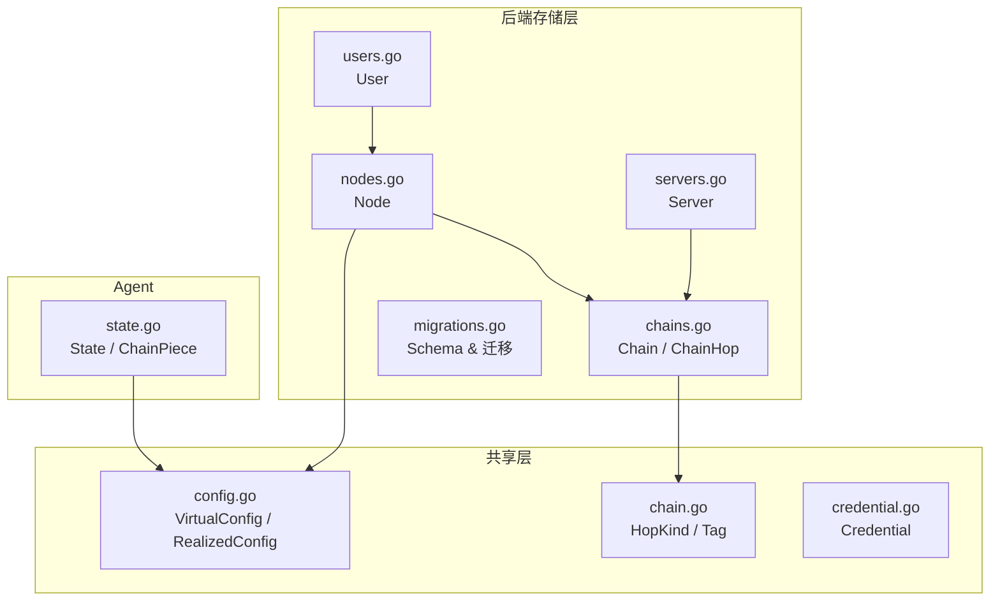
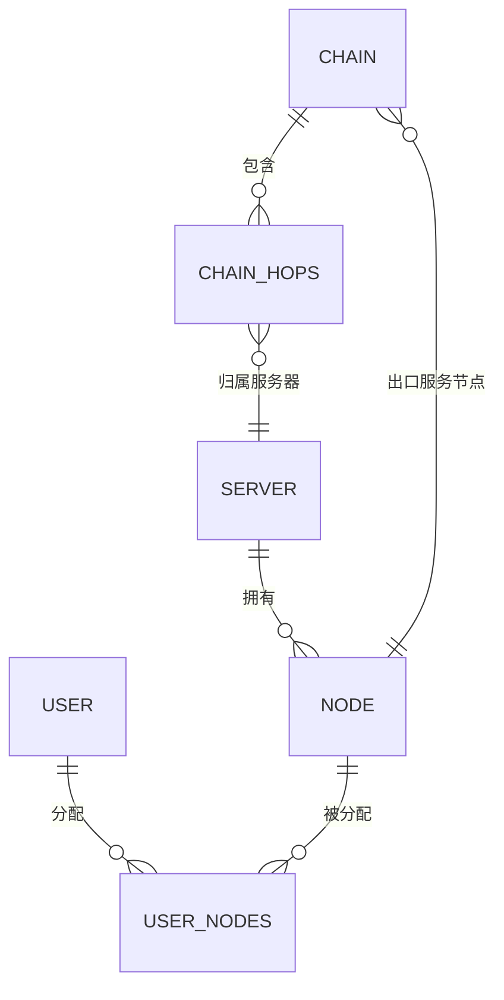
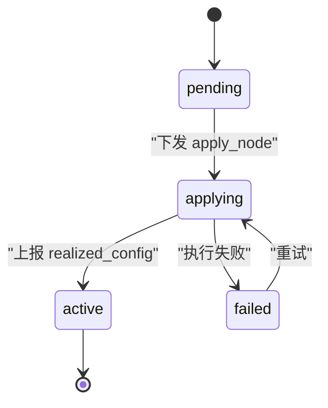
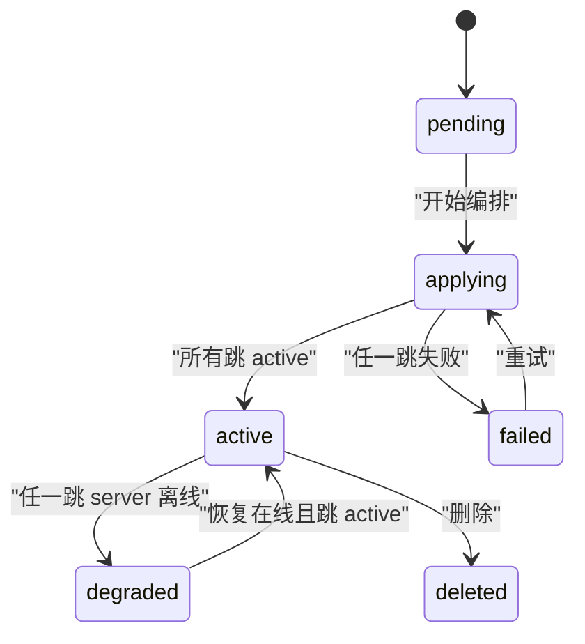
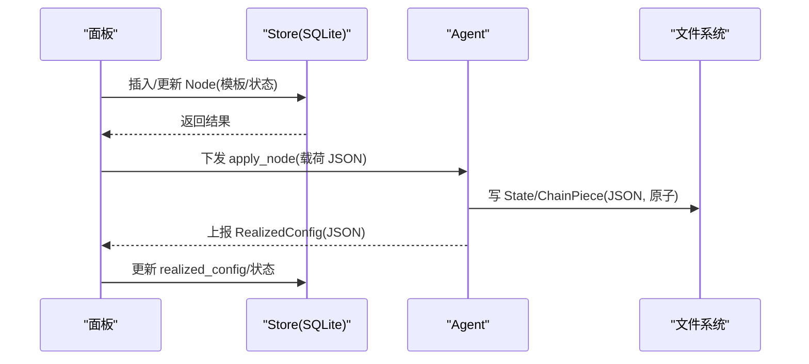
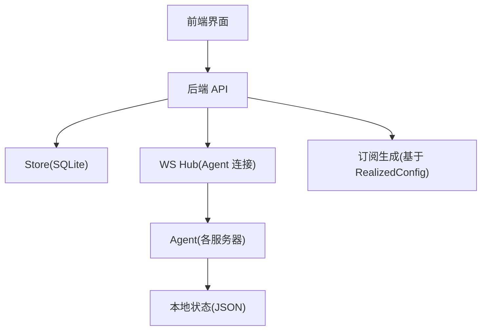
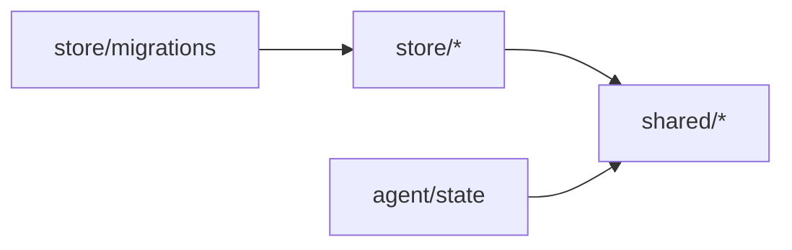

# 数据模型

<cite>
**本文引用的文件**
- [src/backend/internal/store/servers.go](file://src/backend/internal/store/servers.go)
- [src/backend/internal/store/nodes.go](file://src/backend/internal/store/nodes.go)
- [src/backend/internal/store/chains.go](file://src/backend/internal/store/chains.go)
- [src/backend/internal/store/users.go](file://src/backend/internal/store/users.go)
- [src/shared/config.go](file://src/shared/config.go)
- [src/shared/chain.go](file://src/shared/chain.go)
- [src/shared/credential.go](file://src/shared/credential.go)
- [src/agent/internal/state/state.go](file://src/agent/internal/state/state.go)
- [src/backend/internal/store/migrations.go](file://src/backend/internal/store/migrations.go)
</cite>

## 目录
1. [简介](#简介)
2. [项目结构](#项目结构)
3. [核心实体与字段定义](#核心实体与字段定义)
4. [实体关系映射](#实体关系映射)
5. [状态机设计](#状态机设计)
6. [数据验证规则与业务约束](#数据验证规则与业务约束)
7. [序列化与反序列化](#序列化与反序列化)
8. [架构总览](#架构总览)
9. [依赖分析](#依赖分析)
10. [性能考量](#性能考量)
11. [故障排查指南](#故障排查指南)
12. [结论](#结论)

## 简介
本文件面向 Lattix-codex 的核心数据模型，聚焦服务器（Server）、用户（User）、节点（Node）、链路（Chain）等关键实体的数据结构、字段含义、取值范围与使用场景；阐述实体间一对一、一对多、多对多的关系映射；说明节点与链的状态机流转；给出数据验证规则与业务约束；并覆盖数据在面板、Agent 与持久化层之间的序列化和反序列化逻辑。

## 项目结构
- 存储层（store）：定义数据库表结构与读写接口，包含 Server、Node、Chain、User 等核心模型的持久化实现。
- 共享层（shared）：协议、传输、模板占位符、RealizedConfig 等跨进程共享的数据结构与常量。
- Agent 状态（agent state）：Agent 本地落盘状态，用于重启恢复与幂等重建配置。
- 迁移（migrations）：SQLite schema 版本管理与列级增量迁移。

**图表来源**
- [src/backend/internal/store/servers.go:25-56](file://src/backend/internal/store/servers.go#L25-L56)
- [src/backend/internal/store/nodes.go:21-34](file://src/backend/internal/store/nodes.go#L21-L34)
- [src/backend/internal/store/chains.go:44-73](file://src/backend/internal/store/chains.go#L44-L73)
- [src/backend/internal/store/users.go:14-23](file://src/backend/internal/store/users.go#L14-L23)
- [src/shared/config.go:170-206](file://src/shared/config.go#L170-L206)
- [src/shared/chain.go:6-24](file://src/shared/chain.go#L6-L24)
- [src/shared/credential.go:14-18](file://src/shared/credential.go#L14-L18)
- [src/agent/internal/state/state.go:15-23](file://src/agent/internal/state/state.go#L15-L23)

**章节来源**
- [src/backend/internal/store/servers.go:25-56](file://src/backend/internal/store/servers.go#L25-L56)
- [src/backend/internal/store/nodes.go:21-34](file://src/backend/internal/store/nodes.go#L21-L34)
- [src/backend/internal/store/chains.go:44-73](file://src/backend/internal/store/chains.go#L44-L73)
- [src/backend/internal/store/users.go:14-23](file://src/backend/internal/store/users.go#L14-L23)
- [src/shared/config.go:170-206](file://src/shared/config.go#L170-L206)
- [src/shared/chain.go:6-24](file://src/shared/chain.go#L6-L24)
- [src/shared/credential.go:14-18](file://src/shared/credential.go#L14-L18)
- [src/agent/internal/state/state.go:15-23](file://src/agent/internal/state/state.go#L15-L23)

## 核心实体与字段定义
本节按实体逐一说明字段类型、取值范围与业务含义。

### 服务器（Server）
- 标识与基础信息
  - id: int64，主键
  - alias: string，管理员可见别名
  - address: string，公网地址（自动学习或手动指定）
  - address_mode: string，auto/manual
  - learned_addr: string，本次拨入学习的公网地址
  - nic_addresses: string，JSON 数组，Agent 上报的非回环网卡地址
- 认证与会话
  - token: string，长期凭证（bootstrap 换发后）
  - credential_epoch: int64，凭证纪元
  - credential_committed: bool，是否已提交新凭证
  - credential_pending_token: string，待提交的临时凭证
  - credential_exchange_id: string，交换 ID
  - last_seen_at: *time.Time，最后心跳时间
  - last_connected_at / last_disconnected_at / last_reconnected_at: *time.Time，连接时间线
  - reconnect_count: int64，重连次数
  - last_disconnect_reason: string，最近断开原因
- 运行元数据
  - xray_version: string，xray 版本
  - agent_version: string，Agent 版本
  - config_drift: bool，配置漂移标志
  - machine_type: string，direct|nat
  - allowed_ports: string，NAT 可用端口段 JSON
  - tags: string，管理标签 JSON 数组
  - country_code: string，ISO 3166-1 alpha-2
  - location: string，城市或机房位置
- 设置同步
  - agent_settings_revision: int64，Agent 已应用设置版本号
  - agent_settings_error: string，设置同步错误
  - agent_settings_reported_at: *time.Time，设置上报时间
- 时间戳
  - created_at: time.Time

用途与场景
- 作为 Agent 的宿主机器，承载节点与链路跳；提供订阅地址、证书与网络拓扑元数据；驱动遥测与计费。

**章节来源**
- [src/backend/internal/store/servers.go:25-56](file://src/backend/internal/store/servers.go#L25-L56)
- [src/backend/internal/store/servers.go:58-92](file://src/backend/internal/store/servers.go#L58-L92)
- [src/backend/internal/store/migrations.go:55-79](file://src/backend/internal/store/migrations.go#L55-L79)

### 用户（User）
- id: int64，主键
- name: string，用户名
- uuid: string，跨服务器唯一用户标识
- sub_token: string，订阅令牌
- expires_at: *time.Time，到期时间（nil 表示长期）
- expired: bool，到期停权标记
- disabled: bool，管理员显式停用标记
- created_at: time.Time

用途与场景
- 订阅生成、鉴权与生命周期管理；与节点的多对多分配决定用户可访问的服务。

**章节来源**
- [src/backend/internal/store/users.go:14-23](file://src/backend/internal/store/users.go#L14-L23)
- [src/backend/internal/store/users.go:40-54](file://src/backend/internal/store/users.go#L40-L54)

### 节点（Node）
- id: int64，主键
- name: string，节点名称
- server_id: int64，所属服务器
- protocol: string，协议（vless/vmess/trojan/shadowsocks/socks/http/dokodemo-door）
- port: *int，端口（nil 表示由 Agent 自动挑选）
- config_template: json.RawMessage，虚拟配置模板（含占位符）
- realized_config: json.RawMessage，Agent 上报的实际生效配置
- status: string，pending/applying/active/failed
- error: string，失败详情
- created_at: time.Time

用途与场景
- 代表一个 inbound 服务实例；通过模板渲染与 Agent 协作完成端口分配、密钥生成与客户端列表注入；支撑订阅生成与流量统计。

**章节来源**
- [src/backend/internal/store/nodes.go:21-34](file://src/backend/internal/store/nodes.go#L21-L34)
- [src/backend/internal/store/nodes.go:36-57](file://src/backend/internal/store/nodes.go#L36-L57)

### 链路（Chain）与跳（ChainHop）
- Chain
  - id: int64，主键
  - name: string，链路名称
  - service_node_id: int64，出口业务节点（service node）
  - published_revision_id: int64，已发布修订版
  - desired_revision_id: int64，期望修订版
  - traffic_multiplier_milli: int，流量倍率（千分比）
  - status: string，链状态
  - error: string，错误定位（可指向跳）
  - created_at: time.Time
- ChainHop
  - id: int64，主键
  - chain_id: int64，所属链路
  - seq: int，顺序（0=入口，末位=出口）
  - server_id: int64，跳所在服务器
  - role: string，entry/middle/exit
  - node_id: int64，仅出口跳关联的业务节点
  - status: string，跳状态
  - error: string，跳错误详情
  - forward_port: int，入口跳的订阅监听端口
  - portal_port: int，portal 回执的端口
  - portal_public_key: string，portal 公钥
  - portal_server_name: string，Reality SNI（bridge spec 用）
  - tunnel_uuid: string，反向链 portal 所在跳的反向路由键
  - created_at: time.Time

用途与场景
- 描述端到端转发路径（入口→中间→出口），支持反向链（portal/bridge）与正向透传（forward）；逐跳独立状态与重试，便于故障定位与恢复。

**章节来源**
- [src/backend/internal/store/chains.go:44-73](file://src/backend/internal/store/chains.go#L44-L73)
- [src/backend/internal/store/chains.go:75-97](file://src/backend/internal/store/chains.go#L75-L97)

### 共享数据结构（Shared）
- VirtualConfig：面板侧虚拟配置（协议、传输、占位符、模板）
- RealizedConfig：Agent 上报的实际生效值（端口、公钥、SNI、指纹、加密方式等）
- HopKind：portal/bridge/forward
- TunnelDomain / Tags：反向链路由键与 inbound tag

**章节来源**
- [src/shared/config.go:170-206](file://src/shared/config.go#L170-L206)
- [src/shared/chain.go:6-24](file://src/shared/chain.go#L6-L24)

### Agent 本地状态（Agent State）
- State：token、server_id、panel_instance_id、credential_epoch、PanelObservation、AuthRejected、ChainPieces
- ChainPiece：hop_id、kind、port、private_key、public_key、inbound/outbound/reverse/rules

用途与场景
- Agent 重启后重建配置文件与下发幂等依据；端口与公钥不变保证下游凭证不失效。

**章节来源**
- [src/agent/internal/state/state.go:15-23](file://src/agent/internal/state/state.go#L15-L23)
- [src/agent/internal/state/state.go:28-38](file://src/agent/internal/state/state.go#L28-L38)

## 实体关系映射
- 服务器与节点：一对多（一个服务器可拥有多个节点）
- 用户与节点：多对多（通过 user_nodes 关联）
- 链路（Chain）与跳（ChainHop）：一对多（一条链包含多个跳）
- 跳与服务器：多对一（每个跳属于一台服务器）
- 链路与服务节点：多对一（service_node_id 指向出口节点）
- 用户与服务器：无直接外键，通过节点间接关联

**图表来源**
- [src/backend/internal/store/nodes.go:21-34](file://src/backend/internal/store/nodes.go#L21-L34)
- [src/backend/internal/store/users.go:194-211](file://src/backend/internal/store/users.go#L194-L211)
- [src/backend/internal/store/chains.go:44-73](file://src/backend/internal/store/chains.go#L44-L73)

## 状态机设计
### 节点状态机（Node）
- pending → applying → active | failed
- applying：apply_node 已下发
- active：Agent 上报 realized_config 成功
- failed：记录错误详情，支持重试

**图表来源**
- [src/backend/internal/store/nodes.go:12-18](file://src/backend/internal/store/nodes.go#L12-18)

### 链路状态机（Chain）与跳状态机（ChainHop）
- 链：pending → applying → active | failed；在线性推导中可能出现 degraded、waiting_for_agent、active_unconfirmed、active_failed、cleanup_pending、invalid、deleted
- 跳：pending → applying → active | failed
- degraded：任一跳所在服务器离线时推导为降级；全部恢复且跳均 active 则回到 active

**图表来源**
- [src/backend/internal/store/chains.go:12-26](file://src/backend/internal/store/chains.go#L12-26)
- [src/backend/internal/store/chains.go:35-41](file://src/backend/internal/store/chains.go#L35-41)

## 数据验证规则与业务约束
- 协议与传输
  - 协议集合：vless/vmess/trojan/shadowsocks/socks/http/dokodemo-door
  - Reality 仅与 tcp/grpc/xhttp 组合
  - dokodemo-door 需要目标地址与端口
- VLESS Encryption
  - 可选 x25519 或 mlkem768；可与 flow vision 组合（tcp 下）
- Shadowsocks 2022-blake3
  - 定长 base64 密钥；用户密码由 UUID 确定性派生
- 地址模式
  - auto/manual；NAT 类型禁止置空（面板校验）
- 用户有效期与停权
  - expires_at 为 nil 表示长期；expired/disabled 任一成立即停权
- 链路跳角色
  - entry/middle/exit；seq 顺序严格递增
- 配置漂移
  - config_drift 由 Agent drift_report 驱动，面板据此提示修复

**章节来源**
- [src/shared/config.go:16-30](file://src/shared/config.go#L16-L30)
- [src/shared/config.go:32-44](file://src/shared/config.go#L32-L44)
- [src/shared/config.go:45-58](file://src/shared/config.go#L45-L58)
- [src/shared/config.go:66-79](file://src/shared/config.go#L66-L79)
- [src/shared/config.go:127-144](file://src/shared/config.go#L127-L144)
- [src/backend/internal/store/servers.go:18-23](file://src/backend/internal/store/servers.go#L18-L23)
- [src/backend/internal/store/users.go:118-152](file://src/backend/internal/store/users.go#L118-L152)
- [src/backend/internal/store/chains.go:28-33](file://src/backend/internal/store/chains.go#L28-33)

## 序列化与反序列化
- 面板 ↔ 持久化
  - Server/Node/Chain/User 通过 SQL 扫描器将行映射到结构体，json.RawMessage 用于模板与 realized_config 的原样存取
- 面板 ↔ Agent
  - 命令载荷使用 json.RawMessage 传递；RealizedConfig 由 Agent 上报，面板用于订阅生成
- Agent 本地状态
  - State/ChainPiece 以 JSON 落盘，原子写入（tmp+rename），权限 0600；Load/Save 处理首次启动与解析异常
- 凭证
  - Credential 格式 ltx1.<panel_instance_id>.<epoch>.<secret_hex>，解析校验 epoch 与 secret 长度

**图表来源**
- [src/backend/internal/store/nodes.go:36-57](file://src/backend/internal/store/nodes.go#L36-L57)
- [src/agent/internal/state/state.go:40-62](file://src/agent/internal/state/state.go#L40-L62)
- [src/shared/config.go:170-206](file://src/shared/config.go#L170-L206)
- [src/shared/credential.go:42-56](file://src/shared/credential.go#L42-56)

**章节来源**
- [src/backend/internal/store/nodes.go:36-57](file://src/backend/internal/store/nodes.go#L36-L57)
- [src/agent/internal/state/state.go:40-62](file://src/agent/internal/state/state.go#L40-L62)
- [src/shared/config.go:170-206](file://src/shared/config.go#L170-L206)
- [src/shared/credential.go:42-56](file://src/shared/credential.go#L42-56)

## 架构总览

[此图为概念性架构图，不直接映射具体源码文件，故不附“图表来源”]

## 依赖分析
- 存储层依赖 shared 中的协议、传输、RealizedConfig 等常量与结构
- Agent 依赖 shared 的 RealizedConfig 与模板占位符进行配置渲染
- 迁移模块维护 schemaVersion 与列级增量迁移，确保向后兼容

**图表来源**
- [src/backend/internal/store/migrations.go:9-11](file://src/backend/internal/store/migrations.go#L9-L11)
- [src/shared/config.go:170-206](file://src/shared/config.go#L170-L206)
- [src/agent/internal/state/state.go:15-23](file://src/agent/internal/state/state.go#L15-L23)

**章节来源**
- [src/backend/internal/store/migrations.go:9-11](file://src/backend/internal/store/migrations.go#L9-L11)

## 性能考量
- 批量操作与事务：删除服务器/链时使用事务批量清理，减少锁竞争
- 只读查询优化：List* 方法按主键排序，避免复杂 join 与全表扫描
- 大对象存储：模板与 realized_config 以 RawMessage 原样存取，避免重复解析
- Agent 本地状态原子写入：降低崩溃导致的不一致风险

[本节为通用指导，不直接分析具体文件，故不附“章节来源”]

## 故障排查指南
- 节点失败
  - 查看 nodes.error 与 status；确认 apply_node 载荷与模板占位符是否正确
- 链路失败
  - 检查 chain_hops.status 与 error，定位失败跳；必要时重试该跳
- 配置漂移
  - servers.config_drift 为真时，检查 Agent 配置文件哈希与上次落盘基线
- 用户停权
  - 检查 users.expired 与 users.disabled；恢复有效期或停用标记后需扇出 add_user

**章节来源**
- [src/backend/internal/store/nodes.go:117-122](file://src/backend/internal/store/nodes.go#L117-L122)
- [src/backend/internal/store/chains.go:231-243](file://src/backend/internal/store/chains.go#L231-L243)
- [src/backend/internal/store/servers.go:310-315](file://src/backend/internal/store/servers.go#L310-L315)
- [src/backend/internal/store/users.go:138-152](file://src/backend/internal/store/users.go#L138-L152)

## 结论
Lattix-codex 的核心数据模型围绕 Server、User、Node、Chain 构建，通过清晰的字段语义与严格的取值约束，配合节点与链的状态机，实现了从配置下发、Agent 执行到订阅生成的完整闭环。Store 层提供稳定的持久化接口，shared 层统一协议与配置结构，Agent 本地状态保障幂等与恢复。整体设计兼顾可扩展性与可观测性，适合大规模多租户与多地域部署。