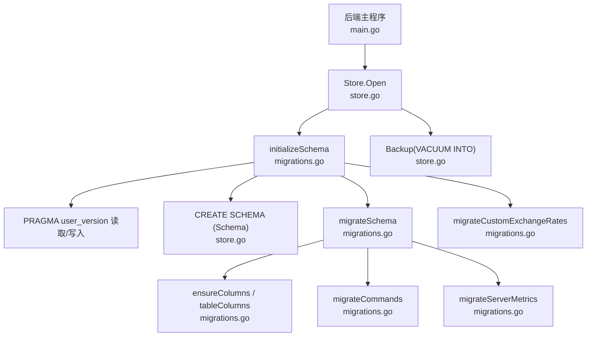
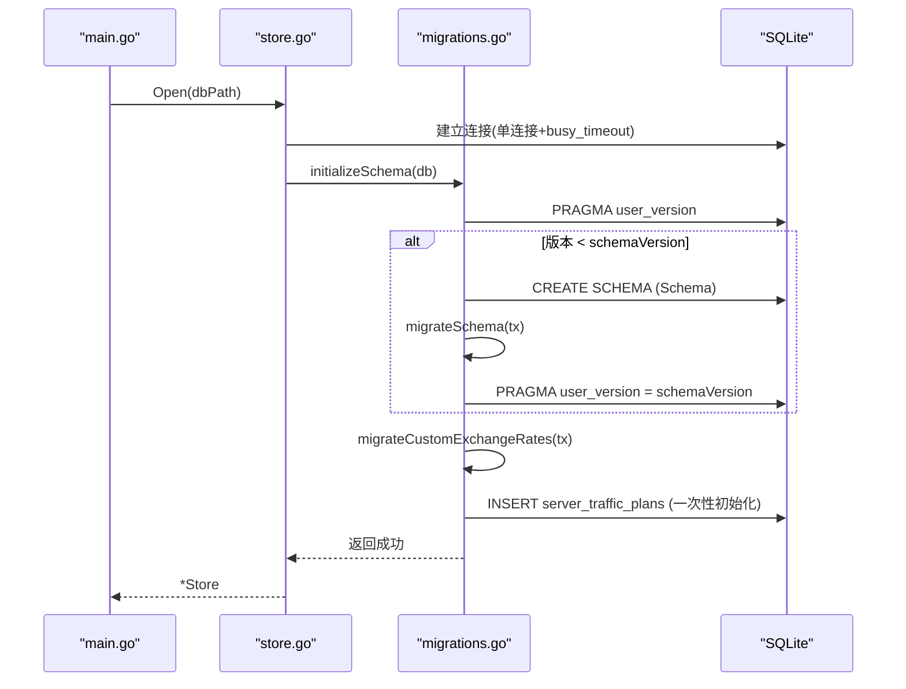
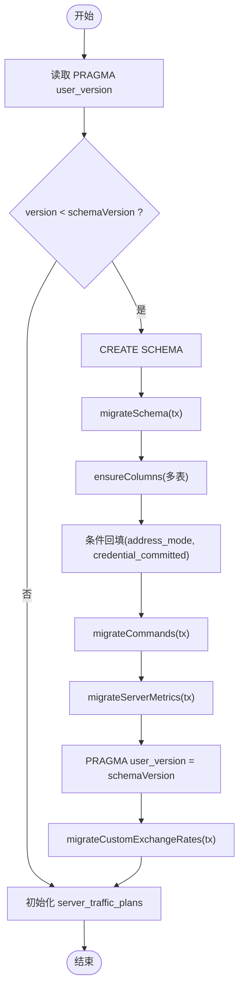
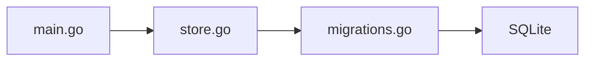

# 数据迁移

<cite>
**本文引用的文件**   
- [migrations.go](file://src/backend/internal/store/migrations.go)
- [store.go](file://src/backend/internal/store/store.go)
- [migrations_test.go](file://src/backend/internal/store/migrations_test.go)
- [main.go](file://src/backend/cmd/backend/main.go)
- [settings.go](file://src/backend/internal/store/settings.go)
- [metrics.go](file://src/backend/internal/store/metrics.go)
</cite>

## 目录
1. [简介](#简介)
2. [项目结构](#项目结构)
3. [核心组件](#核心组件)
4. [架构总览](#架构总览)
5. [详细组件分析](#详细组件分析)
6. [依赖关系分析](#依赖关系分析)
7. [性能考量](#性能考量)
8. [故障排查指南](#故障排查指南)
9. [结论](#结论)
10. [附录：迁移脚本编写规范与最佳实践](#附录：迁移脚本编写规范与最佳实践)

## 简介
本技术文档面向 Lattix-codex 后端的数据迁移系统，聚焦 SQLite 数据库的版本管理与增量迁移机制。内容涵盖版本定义、迁移脚本组织与执行顺序、增量更新策略（表结构变更、数据转换、默认值设置）、回滚机制、错误处理与重试、数据备份与恢复、以及迁移测试与验证方法。读者可据此安全地演进数据库模式并保证生产环境稳定性。

## 项目结构
与数据迁移相关的代码集中在后端存储层：
- 版本与迁移入口：初始化 schema、读取/写入 PRAGMA user_version、按版本差执行迁移
- 表结构定义：集中式 Schema 常量，确保新实例与迁移路径一致
- 备份能力：基于 VACUUM INTO 的一致性快照导出
- 启动流程：后端进程启动时调用 Open，触发 initializeSchema

图表来源 
- [store.go:368-389](file://src/backend/internal/store/store.go#L368-L389)
- [migrations.go:18-52](file://src/backend/internal/store/migrations.go#L18-L52)
- [migrations.go:54-144](file://src/backend/internal/store/migrations.go#L54-L144)
- [migrations.go:146-182](file://src/backend/internal/store/migrations.go#L146-L182)
- [migrations.go:184-245](file://src/backend/internal/store/migrations.go#L184-L245)
- [migrations.go:247-306](file://src/backend/internal/store/migrations.go#L247-L306)
- [migrations.go:308-318](file://src/backend/internal/store/migrations.go#L308-L318)
- [store.go:448-465](file://src/backend/internal/store/store.go#L448-L465)

章节来源
- [store.go:368-389](file://src/backend/internal/store/store.go#L368-L389)
- [migrations.go:18-52](file://src/backend/internal/store/migrations.go#L18-L52)

## 核心组件
- 版本常量与迁移入口
  - schemaVersion：当前支持的数据库模式版本号，每次模式变更需递增
  - initializeSchema：在单事务内完成 schema 创建、版本比较、迁移执行与版本落盘
- 表结构常量
  - Schema：所有表的 DDL 定义，保证新建库与迁移目标一致
- 迁移工具函数
  - ensureColumns：按列名存在性判断是否 ADD COLUMN，避免重复
  - tableColumns：通过 PRAGMA table_info 探测现有列集合
- 具体迁移逻辑
  - migrateSchema：批量添加列、回填默认值、条件化数据修复
  - migrateCommands：旧命令表结构到新版结构的迁移（含字段映射与兼容）
  - migrateServerMetrics：指标表结构变更与历史数据迁移
  - migrateCustomExchangeRates：去重与索引优化
- 备份接口
  - Backup：VACUUM INTO 一致性快照，权限加固

章节来源
- [migrations.go:9-12](file://src/backend/internal/store/migrations.go#L9-L12)
- [migrations.go:18-52](file://src/backend/internal/store/migrations.go#L18-L52)
- [store.go:18-356](file://src/backend/internal/store/store.go#L18-L356)
- [migrations.go:146-182](file://src/backend/internal/store/migrations.go#L146-L182)
- [migrations.go:184-245](file://src/backend/internal/store/migrations.go#L184-L245)
- [migrations.go:247-306](file://src/backend/internal/store/migrations.go#L247-L306)
- [migrations.go:308-318](file://src/backend/internal/store/migrations.go#L308-L318)
- [store.go:448-465](file://src/backend/internal/store/store.go#L448-L465)

## 架构总览
数据迁移发生在后端进程启动阶段，位于 Store.Open 中。Open 会先对数据库文件进行安全检查，再打开连接并调用 initializeSchema。initializeSchema 以事务为单位，依次完成：
- 读取 PRAGMA user_version
- 若版本低于 schemaVersion，则执行 migrateSchema
- 记录新版本号
- 执行特定数据迁移（如自定义汇率去重）
- 初始化服务器流量计划等一次性数据

图表来源 
- [store.go:368-389](file://src/backend/internal/store/store.go#L368-L389)
- [migrations.go:18-52](file://src/backend/internal/store/migrations.go#L18-L52)

章节来源
- [main.go:141-145](file://src/backend/cmd/backend/main.go#L141-L145)
- [store.go:368-389](file://src/backend/internal/store/store.go#L368-L389)
- [migrations.go:18-52](file://src/backend/internal/store/migrations.go#L18-L52)

## 详细组件分析

### 版本管理机制
- 版本号定义
  - schemaVersion 为当前支持的最高版本，任何模式变更必须递增该值
  - PRAGMA user_version 持久化数据库实际版本
- 版本校验与保护
  - 若数据库版本高于 schemaVersion，直接报错阻止启动，防止不兼容升级
- 执行时机
  - 在 initializeSchema 的事务内执行，确保“建表 + 迁移 + 写版本”原子性

章节来源
- [migrations.go:9-12](file://src/backend/internal/store/migrations.go#L9-L12)
- [migrations.go:25-31](file://src/backend/internal/store/migrations.go#L25-L31)
- [migrations.go:35-42](file://src/backend/internal/store/migrations.go#L35-L42)

### 迁移脚本组织与执行顺序
- 统一入口
  - initializeSchema 负责整体编排：读版本 → 建表 → 迁移 → 写版本 → 数据初始化
- 迁移步骤
  - migrateSchema：批量 ensureColumns 添加列；根据新增列做条件回填（address_mode、credential_committed）
  - migrateCommands：兼容旧表结构（payload→data、request_id/trace_id 生成），必要时重命名旧表并重建
  - migrateServerMetrics：检测列约束变化，必要时重命名旧表并重建，迁移历史数据
  - migrateCustomExchangeRates：按 source_currency 去重并创建唯一索引
- 执行顺序原则
  - 先结构后数据：先 ADD COLUMN/RENAME TABLE/CREATE TABLE，再做 UPDATE/INSERT
  - 幂等性：ensureColumns 通过检查列是否存在避免重复操作

图表来源 
- [migrations.go:18-52](file://src/backend/internal/store/migrations.go#L18-L52)
- [migrations.go:54-144](file://src/backend/internal/store/migrations.go#L54-L144)
- [migrations.go:184-245](file://src/backend/internal/store/migrations.go#L184-L245)
- [migrations.go:247-306](file://src/backend/internal/store/migrations.go#L247-L306)
- [migrations.go:308-318](file://src/backend/internal/store/migrations.go#L308-L318)

章节来源
- [migrations.go:18-52](file://src/backend/internal/store/migrations.go#L18-L52)
- [migrations.go:54-144](file://src/backend/internal/store/migrations.go#L54-L144)

### 增量更新策略
- 表结构变更
  - 使用 ensureColumns 动态 ADD COLUMN，避免破坏已有数据
  - 对于需要重构的表（如 commands、server_metrics），采用 RENAME + 重建 + 数据迁移的模式
- 数据转换
  - migrateCommands：将 payload→data，并为 request_id/trace_id 生成兼容值
  - migrateServerMetrics：根据列约束变化决定是否需要重建表并迁移历史数据
- 默认值设置
  - 新增列均提供 NOT NULL DEFAULT，保证存量数据完整性
  - address_mode 根据 address 与 learned_addr 的关系回填 auto/manual

章节来源
- [migrations.go:146-182](file://src/backend/internal/store/migrations.go#L146-L182)
- [migrations.go:184-245](file://src/backend/internal/store/migrations.go#L184-L245)
- [migrations.go:247-306](file://src/backend/internal/store/migrations.go#L247-L306)
- [migrations.go:83-104](file://src/backend/internal/store/migrations.go#L83-L104)

### 回滚机制的实现原理与注意事项
- 事务回滚
  - initializeSchema 使用单一事务包裹建表与迁移，任何一步失败都会 Rollback，保持数据库状态不变
- 版本保护
  - 若数据库版本高于 schemaVersion，直接拒绝启动，避免降级或未知行为
- 测试覆盖
  - 单元测试验证失败迁移后的版本未改变、列未部分添加，确保回滚有效

章节来源
- [migrations.go:18-31](file://src/backend/internal/store/migrations.go#L18-L31)
- [migrations_test.go:158-195](file://src/backend/internal/store/migrations_test.go#L158-L195)

### 错误处理与重试机制
- 错误处理
  - 每个 SQL 语句都附带上下文错误包装，便于定位问题
  - 表结构探测失败、列不存在、SQL 执行异常均有明确错误信息
- 重试机制
  - 迁移过程本身无显式重试；但 SQLite 连接配置了 busy_timeout，缓解并发写导致的短暂锁定
  - 业务层的命令队列与链任务有独立的重试逻辑（非本次迁移范围）

章节来源
- [store.go:372-383](file://src/backend/internal/store/store.go#L372-L383)
- [migrations.go:146-182](file://src/backend/internal/store/migrations.go#L146-L182)

### 数据备份与恢复策略
- 备份
  - Backup 使用 VACUUM INTO 生成一致性快照，配合单连接与 busy_timeout 保证并发安全
  - 备份文件权限设置为 0o600，避免泄露敏感数据
- 恢复
  - 可通过替换数据库文件或导入备份的方式恢复；注意面板实例 ID 随备份保留
- 建议
  - 在生产环境中，升级前务必执行一次备份
  - 恢复后确认 PRAGMA user_version 与 schemaVersion 一致

章节来源
- [store.go:448-465](file://src/backend/internal/store/store.go#L448-L465)
- [settings.go:81-105](file://src/backend/internal/store/settings.go#L81-L105)

### 迁移测试与验证方法
- 单元测试
  - TestOpenMigratesLegacySchemaAndPreservesData：模拟旧版本数据库，验证迁移后结构与数据正确性
  - TestOpenRollsBackFailedMigration：构造不可迁移的表结构，验证失败回滚与版本不变
- 断言要点
  - 迁移后各表新增列存在且默认值正确
  - 命令表字段映射与状态保留
  - 第二次启动不会重复迁移或产生重复数据

章节来源
- [migrations_test.go:80-156](file://src/backend/internal/store/migrations_test.go#L80-L156)
- [migrations_test.go:158-195](file://src/backend/internal/store/migrations_test.go#L158-L195)

## 依赖关系分析
- 模块耦合
  - store.go 提供 Open、Backup 等对外能力，内部依赖 migrations.go 的 initializeSchema 与迁移函数
  - main.go 在启动时调用 store.Open，触发迁移流程
- 外部依赖
  - SQLite 驱动（modernc.org/sqlite）
  - PRAGMA user_version 用于版本管理
- 潜在循环依赖
  - 迁移逻辑仅依赖 sql.Tx 与 SQLite 原生能力，无循环引用

图表来源 
- [main.go:141-145](file://src/backend/cmd/backend/main.go#L141-L145)
- [store.go:368-389](file://src/backend/internal/store/store.go#L368-L389)
- [migrations.go:18-52](file://src/backend/internal/store/migrations.go#L18-L52)

章节来源
- [main.go:141-145](file://src/backend/cmd/backend/main.go#L141-L145)
- [store.go:368-389](file://src/backend/internal/store/store.go#L368-L389)

## 性能考量
- 单连接与忙等待
  - SetMaxOpenConns(1) 与 busy_timeout=5000ms 降低锁竞争，避免 database is locked
- 迁移粒度
  - 增量 ADD COLUMN 比全量重建更高效；仅在必要时才 RENAME + 重建
- 备份开销
  - VACUUM INTO 在大库上可能耗时较长，建议在低峰期执行

[本节为通用指导，无需源码引用]

## 故障排查指南
- 常见错误
  - 数据库版本过高：检查 schemaVersion 与数据库 user_version 是否匹配
  - 迁移失败：查看日志中的错误包装信息，定位具体 SQL 语句
  - 权限问题：确认数据库文件与备份文件权限为 0o600
- 诊断步骤
  - 查询 PRAGMA user_version 确认版本
  - 使用 PRAGMA table_info 检查表结构是否符合预期
  - 运行单元测试复现问题

章节来源
- [migrations.go:25-31](file://src/backend/internal/store/migrations.go#L25-L31)
- [migrations_test.go:158-195](file://src/backend/internal/store/migrations_test.go#L158-L195)

## 结论
Lattix-codex 的数据迁移系统以 SQLite 为基础，通过集中式 Schema、严格的版本控制与事务化迁移，实现了安全可靠的增量升级。其设计强调幂等性、回滚保障与备份能力，结合完善的单元测试，为生产环境的稳定演进提供了坚实基础。遵循本文档的规范与实践，可有效降低迁移风险并提升可维护性。

[本节为总结，无需源码引用]

## 附录：迁移脚本编写规范与最佳实践
- 版本管理
  - 每次模式变更递增 schemaVersion，并在 migrateSchema 中实现对应增量逻辑
- 脚本组织
  - 优先使用 ensureColumns 添加列，避免重复操作
  - 复杂结构变更采用 RENAME + 重建 + 数据迁移，确保向后兼容
- 数据转换
  - 为新增列设置合理的 NOT NULL DEFAULT
  - 对历史数据进行条件回填（如 address_mode、credential_committed）
- 错误处理
  - 每个 SQL 操作附带错误包装，便于定位
  - 利用事务回滚保证一致性
- 备份与恢复
  - 升级前执行 Backup，恢复后验证 user_version 与 Schema 一致
- 测试验证
  - 编写单元测试覆盖迁移前后状态，包括失败回滚场景
  - 验证第二次启动不会重复迁移或产生重复数据

[本节为通用指导，无需源码引用]