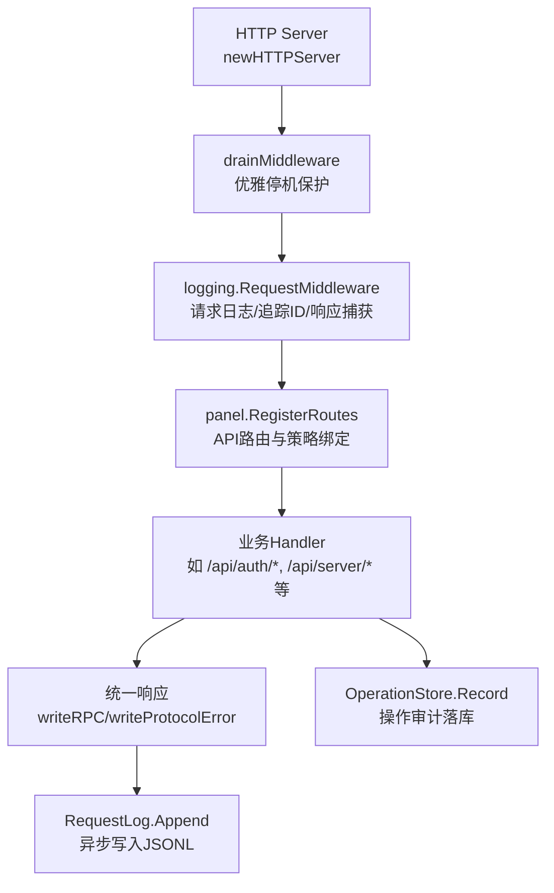
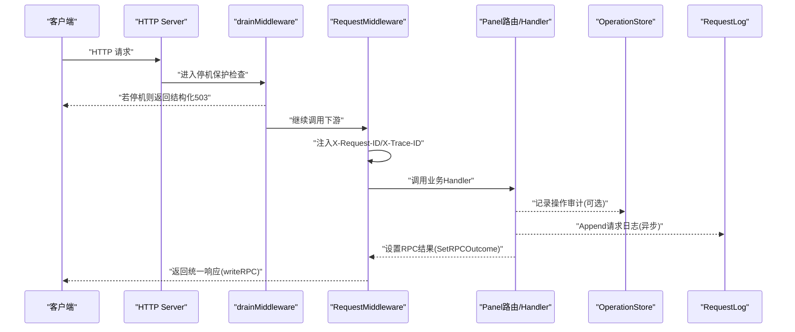
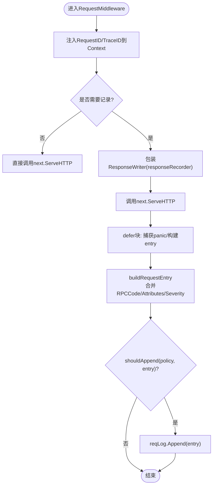
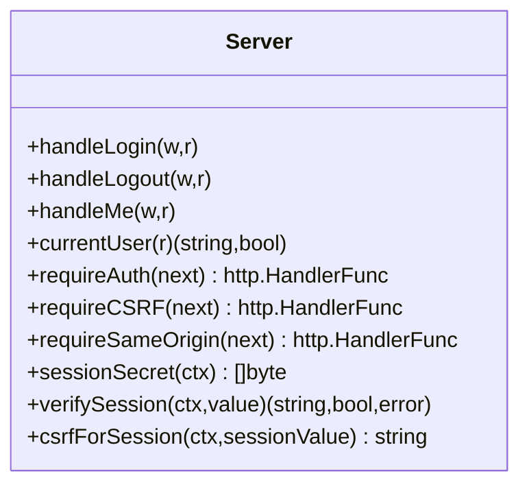
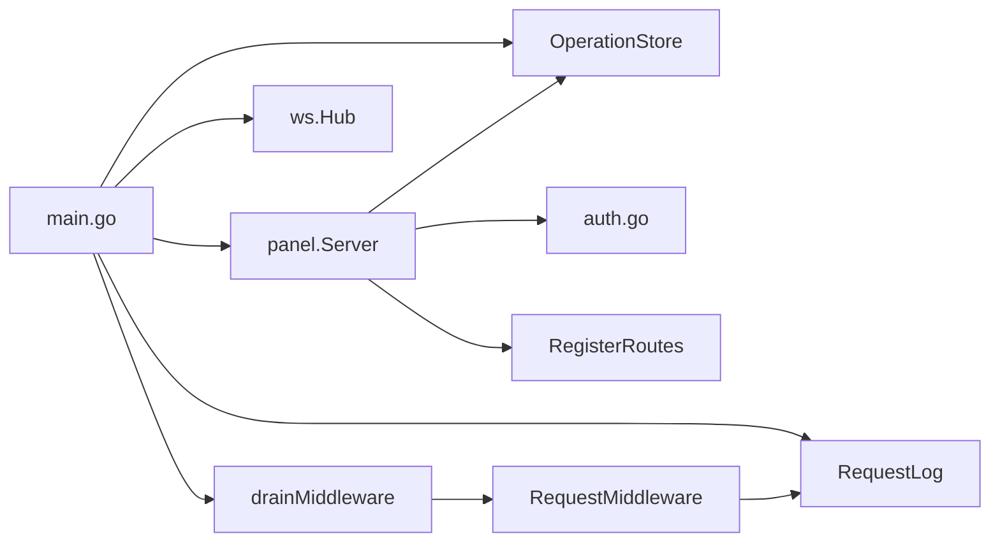

# 中间件架构

<cite>
**本文引用的文件**
- [src/backend/cmd/backend/main.go](file://src/backend/cmd/backend/main.go)
- [src/backend/internal/panel/panel.go](file://src/backend/internal/panel/panel.go)
- [src/backend/internal/panel/auth.go](file://src/backend/internal/panel/auth.go)
- [src/backend/internal/logging/http.go](file://src/backend/internal/logging/http.go)
- [src/backend/internal/logging/context.go](file://src/backend/internal/logging/context.go)
- [src/backend/internal/logging/request.go](file://src/backend/internal/logging/request.go)
- [src/backend/internal/logging/operation.go](file://src/backend/internal/logging/operation.go)
</cite>

## 目录
1. [简介](#简介)
2. [项目结构](#项目结构)
3. [核心组件](#核心组件)
4. [架构总览](#架构总览)
5. [详细组件分析](#详细组件分析)
6. [依赖关系分析](#依赖关系分析)
7. [性能考量](#性能考量)
8. [故障排查指南](#故障排查指南)
9. [结论](#结论)
10. [附录：中间件开发指南与最佳实践](#附录中间件开发指南与最佳实践)

## 简介
本技术文档围绕 Lattix-codex 后端服务中的 HTTP 中间件架构展开，系统性阐述请求处理链、响应拦截、错误传播、日志记录（请求日志与操作日志）、认证授权与会话管理、错误处理统一化、以及中间件的注册与执行顺序。通过代码级分析与可视化图示，帮助开发者理解并扩展中间件能力。

## 项目结构
后端以 Go 标准库 http.ServeMux 为路由中心，结合自定义中间件形成“请求进入 → 鉴权/限流/日志 → 业务处理器 → 统一响应”的流水线。关键入口在 main 中完成日志子系统初始化、面板服务装配、路由注册与 HTTP Server 启动；面板服务负责将各 API 路由与策略（是否需登录、CSRF、幂等、日志策略）绑定。

**图表来源**
- [src/backend/cmd/backend/main.go:450-477](file://src/backend/cmd/backend/main.go#L450-L477)
- [src/backend/cmd/backend/main.go:586-604](file://src/backend/cmd/backend/main.go#L586-L604)
- [src/backend/internal/logging/http.go:43-82](file://src/backend/internal/logging/http.go#L43-L82)
- [src/backend/internal/panel/panel.go:162-279](file://src/backend/internal/panel/panel.go#L162-L279)
- [src/backend/internal/logging/request.go:115-129](file://src/backend/internal/logging/request.go#L115-L129)
- [src/backend/internal/logging/operation.go:142-182](file://src/backend/internal/logging/operation.go#L142-L182)

**章节来源**
- [src/backend/cmd/backend/main.go:372-477](file://src/backend/cmd/backend/main.go#L372-L477)
- [src/backend/internal/panel/panel.go:162-279](file://src/backend/internal/panel/panel.go#L162-L279)

## 核心组件
- 请求日志中间件：封装 RequestMiddleware，注入 RequestID/TraceID，捕获响应状态码与字节数，按策略决定是否落盘，支持 WebSocket 升级特殊路径。
- 上下文元数据：RequestMeta 在 context 中传递 request_id、trace_id、rpc_code、safe_message、idempotency_replayed 及白名单属性。
- 操作日志存储：OperationStore 基于 SQLite 持久化审计事件，支持过滤、分页、清理与运行生命周期记录。
- 认证授权中间件：会话 Cookie + HMAC 签名校验，CSRF 防护，同源校验，更新中锁定非相关接口。
- 统一错误处理：writeProtocolError/writeRPC 将 HTTP 状态码映射为 RPC Code，保证前后端一致的错误语义。
- 优雅停机中间件：drainMiddleware 在服务重启/关闭期间拒绝新请求并返回结构化响应。

**章节来源**
- [src/backend/internal/logging/http.go:43-82](file://src/backend/internal/logging/http.go#L43-L82)
- [src/backend/internal/logging/context.go:10-67](file://src/backend/internal/logging/context.go#L10-L67)
- [src/backend/internal/logging/operation.go:116-182](file://src/backend/internal/logging/operation.go#L116-L182)
- [src/backend/internal/panel/auth.go:197-269](file://src/backend/internal/panel/auth.go#L197-L269)
- [src/backend/internal/panel/panel.go:325-419](file://src/backend/internal/panel/panel.go#L325-L419)
- [src/backend/cmd/backend/main.go:586-604](file://src/backend/cmd/backend/main.go#L586-L604)

## 架构总览
下图展示了从请求进入到响应返回的完整链路，包括中间件组合、上下文传递、日志落盘与错误统一化。

**图表来源**
- [src/backend/cmd/backend/main.go:450-477](file://src/backend/cmd/backend/main.go#L450-L477)
- [src/backend/cmd/backend/main.go:586-604](file://src/backend/cmd/backend/main.go#L586-L604)
- [src/backend/internal/logging/http.go:43-82](file://src/backend/internal/logging/http.go#L43-L82)
- [src/backend/internal/logging/context.go:45-56](file://src/backend/internal/logging/context.go#L45-L56)
- [src/backend/internal/panel/panel.go:325-350](file://src/backend/internal/panel/panel.go#L325-L350)
- [src/backend/internal/logging/request.go:115-129](file://src/backend/internal/logging/request.go#L115-L129)
- [src/backend/internal/logging/operation.go:142-182](file://src/backend/internal/logging/operation.go#L142-L182)

## 详细组件分析

### 请求日志中间件（RequestMiddleware）
- 功能要点
  - 注入并透传 X-Request-ID 与 X-Trace-ID，缺失时自动生成。
  - 使用 responseRecorder 捕获 WriteHeader/Write/Flush/Hijack/Push 等，统计状态码、响应字节数与部分响应体。
  - 根据策略（full/failures_only/none）决定是否追加日志条目。
  - 对 WebSocket 升级路径做特殊处理，避免重复记录。
  - 自动计算严重级别（info/warning/error），合并业务侧 SetRPCOutcome 的结果。
- 数据结构与复杂度
  - RequestEntry 包含时间戳、追踪ID、传输类型、方法、路径、路由模式、属性、HTTP状态、RPC代码、耗时、响应字节、操作者、IP、UA、错误摘要、幂等重放标记等。
  - Append 采用无阻塞通道入队，队列满或写入失败时计数 dropped，并通过 reporter 回调上报。
- 优化点
  - 参数与路径敏感字段脱敏与截断，控制 JSON 大小上限。
  - 分段轮转与总量限制，避免磁盘膨胀。

**图表来源**
- [src/backend/internal/logging/http.go:43-82](file://src/backend/internal/logging/http.go#L43-L82)
- [src/backend/internal/logging/http.go:107-152](file://src/backend/internal/logging/http.go#L107-L152)
- [src/backend/internal/logging/http.go:195-204](file://src/backend/internal/logging/http.go#L195-L204)
- [src/backend/internal/logging/request.go:115-129](file://src/backend/internal/logging/request.go#L115-L129)

**章节来源**
- [src/backend/internal/logging/http.go:43-82](file://src/backend/internal/logging/http.go#L43-L82)
- [src/backend/internal/logging/http.go:107-152](file://src/backend/internal/logging/http.go#L107-L152)
- [src/backend/internal/logging/request.go:90-129](file://src/backend/internal/logging/request.go#L90-L129)

### 上下文元数据（RequestMeta）
- 作用
  - 在请求上下文中携带 RequestID、TraceID、RPCCode、SafeMessage、IdempotencyReplayed 与白名单 Attributes。
  - 提供 AddSafeAttribute 供路由显式声明安全字段，避免泄露敏感信息。
- 使用方式
  - 中间件通过 WithRequestMeta 注入，后续 Handler 通过 SetRPCOutcome/SetIdempotencyReplayed/AddSafeAttribute 补充。

**章节来源**
- [src/backend/internal/logging/context.go:10-67](file://src/backend/internal/logging/context.go#L10-L67)

### 操作日志存储（OperationStore）
- 功能要点
  - 基于 SQLite 持久化审计事件，支持分类、级别、时间范围、操作者、服务器/节点维度过滤。
  - 维护最大条目数，自动裁剪旧记录；记录面板启动/停止/异常退出等生命周期事件。
- 数据结构
  - OperationEntry/OperationEvent 定义事件字段；trimOperation 实现按时间倒序保留最近 N 条。
- 性能与安全
  - 单连接写入，事务包裹插入与裁剪，避免并发写冲突。

**章节来源**
- [src/backend/internal/logging/operation.go:116-182](file://src/backend/internal/logging/operation.go#L116-L182)
- [src/backend/internal/logging/operation.go:377-389](file://src/backend/internal/logging/operation.go#L377-L389)

### 认证授权与会话管理
- 会话机制
  - 登录成功后签发带 HMAC 签名的 Cookie（用户+过期时间），服务端校验签名与有效期。
  - 登出清空 Cookie；/api/me 用于前端判定登录态并获取 CSRF Token。
- 安全策略
  - requireAuth：未登录或会话过期返回未认证；面板更新进行中拒绝除特定接口外的所有 API。
  - requireCSRF：校验 X-CSRF-Token 与会话派生的期望值。
  - requireSameOrigin：校验 Origin/Referer 与 Host 一致，HTTPS 下要求来源也为 HTTPS。
- 速率限制
  - 登录失败次数限制与重试间隔，防止暴力破解。

**图表来源**
- [src/backend/internal/panel/auth.go:81-145](file://src/backend/internal/panel/auth.go#L81-L145)
- [src/backend/internal/panel/auth.go:147-181](file://src/backend/internal/panel/auth.go#L147-L181)
- [src/backend/internal/panel/auth.go:183-269](file://src/backend/internal/panel/auth.go#L183-L269)

**章节来源**
- [src/backend/internal/panel/auth.go:81-145](file://src/backend/internal/panel/auth.go#L81-L145)
- [src/backend/internal/panel/auth.go:183-269](file://src/backend/internal/panel/auth.go#L183-L269)

### 错误处理与统一响应
- 统一响应
  - writeRPC 输出标准信封（code/message/data/request_id/trace_id），并将 HTTP 状态码映射为 RPC Code。
  - writeProtocolError 用于协议层错误（如 404/4xx/5xx），保持前后端一致的 code 语义。
- 错误传播
  - 业务 Handler 通过 writeError/writeProtocolError 返回错误；中间件不吞异常，由 panic 恢复后记录错误摘要。

**章节来源**
- [src/backend/internal/panel/panel.go:325-419](file://src/backend/internal/panel/panel.go#L325-L419)
- [src/backend/internal/logging/http.go:60-70](file://src/backend/internal/logging/http.go#L60-L70)

### 优雅停机中间件（drainMiddleware）
- 行为
  - 当 Hub 处于排空阶段且请求路径为 /api/*（排除 WS 端点）时，立即返回结构化 503 响应，阻止新请求进入。
- 目的
  - 配合进程重启/优雅关闭，确保现有请求处理完毕后再拒绝新请求，提升用户体验与稳定性。

**章节来源**
- [src/backend/cmd/backend/main.go:586-604](file://src/backend/cmd/backend/main.go#L586-L604)

## 依赖关系分析
- 主程序依赖
  - logging.OperationStore、logging.RequestLog 作为可插拔日志后端。
  - panel.Server 聚合路由、策略、调度器、告警器等。
  - ws.Hub 负责 Agent 控制通道与生命周期事件。
- 中间件耦合
  - drainMiddleware 依赖 Hub 的排空状态。
  - RequestMiddleware 依赖 RequestLog 与 panel.Operator/LogPolicy。
  - 面板路由通过 rpcRouteOptions 配置 Auth/CSRF/Idempotent/SameOrigin/LogPolicy。

**图表来源**
- [src/backend/cmd/backend/main.go:337-370](file://src/backend/cmd/backend/main.go#L337-L370)
- [src/backend/internal/panel/panel.go:162-279](file://src/backend/internal/panel/panel.go#L162-L279)
- [src/backend/cmd/backend/main.go:586-604](file://src/backend/cmd/backend/main.go#L586-L604)
- [src/backend/internal/logging/http.go:43-82](file://src/backend/internal/logging/http.go#L43-L82)

**章节来源**
- [src/backend/cmd/backend/main.go:337-370](file://src/backend/cmd/backend/main.go#L337-L370)
- [src/backend/internal/panel/panel.go:162-279](file://src/backend/internal/panel/panel.go#L162-L279)

## 性能考量
- 请求日志
  - 异步 Append 与队列缓冲，避免阻塞请求路径；队列满时丢弃并上报 dropped。
  - 分段轮转与总量限制，控制磁盘占用；响应体仅捕获有限字节。
- 操作日志
  - 单连接写入与事务裁剪，降低锁竞争；限制最大条目数。
- 认证与鉴权
  - HMAC 校验与 Cookie 解析开销较低；CSRF 校验仅在写操作启用。
- 优雅停机
  - 快速拒绝新请求，缩短排队等待时间。

[本节为通用指导，不直接分析具体文件]

## 故障排查指南
- 常见问题定位
  - 请求未记录：检查 shouldLogRequest 路径前缀与 LogPolicy；确认 RequestMiddleware 已包裹 mux。
  - 会话失效：验证 Cookie 签名与过期时间；检查 requireAuth/requireCSRF/requireSameOrigin 策略。
  - 错误码不一致：确认 writeRPC 与 writeProtocolError 的使用场景；核对 rpcCodeForLegacyStatus 映射。
  - 日志丢失：查看 RequestLog dropped 计数与 reporter 回调；检查磁盘空间与轮转策略。
- 诊断手段
  - 通过 /api/log/list-requests 与 /api/log/list-operations 查询最近日志。
  - 关注 X-Request-ID/X-Trace-ID 贯穿全链路，便于跨模块关联。

**章节来源**
- [src/backend/internal/logging/http.go:226-228](file://src/backend/internal/logging/http.go#L226-L228)
- [src/backend/internal/panel/panel.go:398-419](file://src/backend/internal/panel/panel.go#L398-L419)
- [src/backend/internal/logging/request.go:107-129](file://src/backend/internal/logging/request.go#L107-L129)

## 结论
Lattix-codex 的中间件架构以清晰的分层与职责分离为核心：drainMiddleware 保障优雅停机，RequestMiddleware 统一追踪与日志，面板路由集中管理认证、CSRF、幂等与日志策略，OperationStore 与 RequestLog 分别承载审计与请求日志。该设计在保证安全与可观测性的同时，兼顾了性能与可扩展性，便于开发者按需扩展新的中间件能力。

[本节为总结性内容，不直接分析具体文件]

## 附录：中间件开发指南与最佳实践
- 新增中间件步骤
  - 实现 http.Handler 包装函数，遵循“先处理请求，再调用 next.ServeHTTP，最后处理响应/异常”的模式。
  - 如需读取/修改上下文，使用 context.WithValue 与专用 key 类型，避免键冲突。
  - 对于高开销操作，尽量异步化（如写入日志），避免阻塞请求路径。
- 日志规范
  - 使用 AddSafeAttribute 添加白名单属性，避免泄露敏感信息。
  - 合理设置 LogPolicy，高频接口建议 failures_only 或 none。
- 认证与权限
  - 敏感写操作必须启用 requireCSRF；跨域访问需校验 SameOrigin。
  - 会话密钥应随管理员凭证变化而失效，确保安全性。
- 错误处理
  - 统一使用 writeRPC/writeProtocolError 返回错误，确保前后端一致。
  - 在 panic 恢复时记录错误摘要，便于问题定位。
- 性能与容量
  - 控制响应体捕获大小与参数序列化体积，避免内存与磁盘压力。
  - 合理配置 RequestLog 的最大字节与分段大小，定期清理历史片段。

[本节为通用指导，不直接分析具体文件]