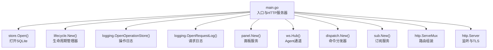
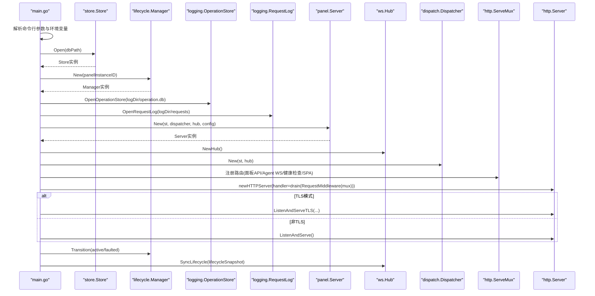
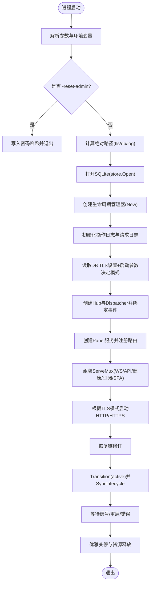
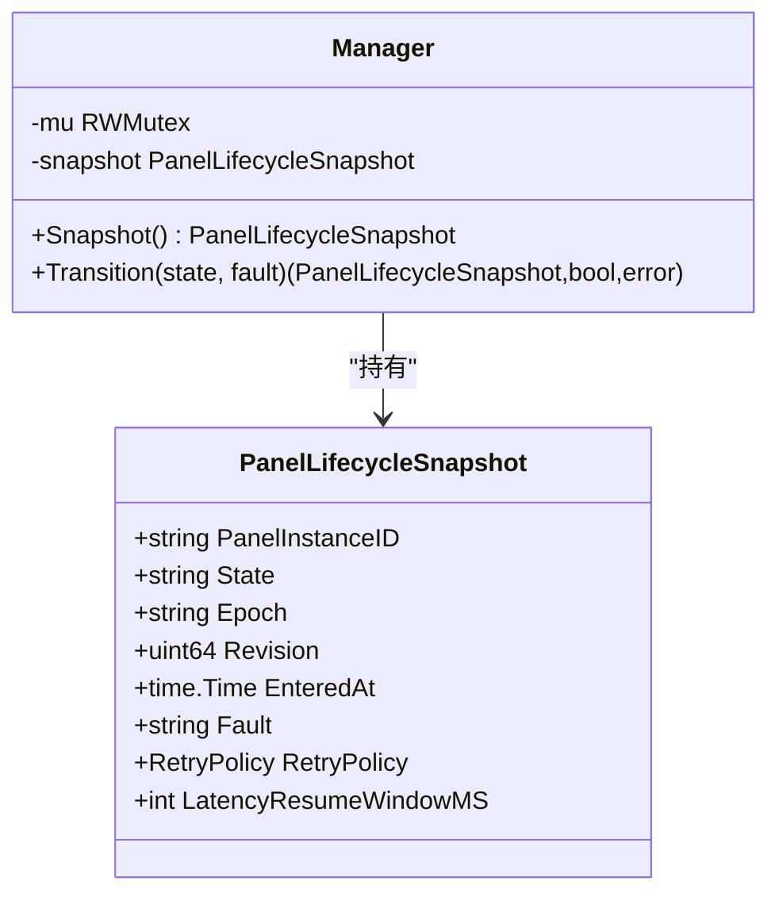
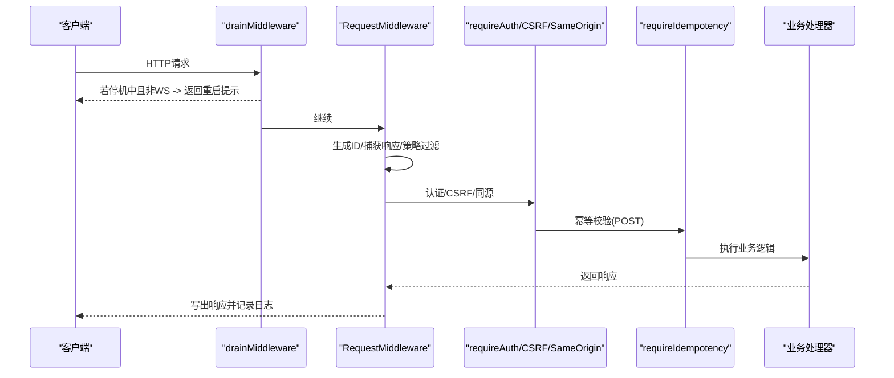
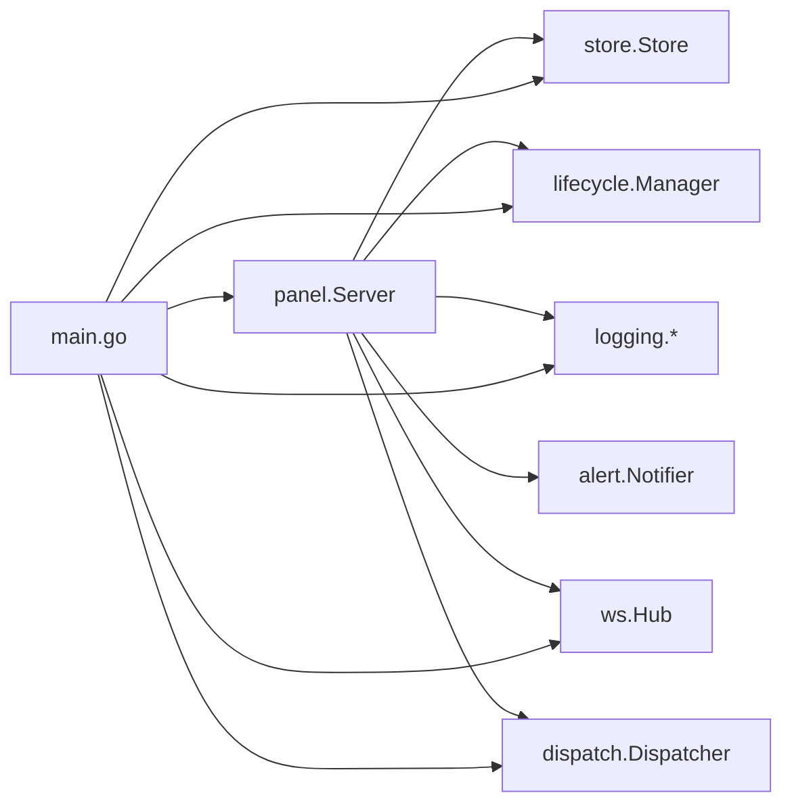

# 主程序启动流程

<cite>
**本文引用的文件**   
- [src/backend/cmd/backend/main.go](file://src/backend/cmd/backend/main.go)
- [src/backend/internal/lifecycle/manager.go](file://src/backend/internal/lifecycle/manager.go)
- [src/backend/internal/logging/http.go](file://src/backend/internal/logging/http.go)
- [src/backend/internal/panel/auth.go](file://src/backend/internal/panel/auth.go)
- [src/backend/internal/panel/panel.go](file://src/backend/internal/panel/panel.go)
- [src/backend/internal/store/store.go](file://src/backend/internal/store/store.go)
- [src/shared/lifecycle.go](file://src/shared/lifecycle.go)
</cite>

## 目录
1. [简介](#简介)
2. [项目结构](#项目结构)
3. [核心组件](#核心组件)
4. [架构总览](#架构总览)
5. [详细组件分析](#详细组件分析)
6. [依赖关系分析](#依赖关系分析)
7. [性能考量](#性能考量)
8. [故障排查指南](#故障排查指南)
9. [结论](#结论)

## 简介
本文面向 Lattix-codex 后端服务，系统性梳理主程序启动流程，覆盖命令行参数解析、环境变量覆盖机制、配置初始化顺序（数据库、日志、TLS）、生命周期管理器初始化与状态设置、中间件链构建与注册（请求日志、认证授权、错误处理），并给出流程图和代码级引用路径，帮助开发者快速理解从进程启动到 HTTP/WS 服务就绪的完整过程。

## 项目结构
后端入口位于 src/backend/cmd/backend/main.go，内部模块按职责划分：
- lifecycle：面板生命周期管理
- logging：请求/操作日志记录与策略
- panel：面板 API、认证、路由注册
- store：SQLite 存储封装与迁移
- shared：共享类型与常量（生命周期状态等）

图表来源
- [src/backend/cmd/backend/main.go:70-572](file://src/backend/cmd/backend/main.go#L70-L572)
- [src/backend/internal/store/store.go:368-389](file://src/backend/internal/store/store.go#L368-L389)
- [src/backend/internal/lifecycle/manager.go:18-28](file://src/backend/internal/lifecycle/manager.go#L18-L28)
- [src/backend/internal/logging/http.go:43-82](file://src/backend/internal/logging/http.go#L43-L82)
- [src/backend/internal/panel/panel.go:94-116](file://src/backend/internal/panel/panel.go#L94-L116)
- [src/backend/internal/panel/panel.go:162-279](file://src/backend/internal/panel/panel.go#L162-L279)

章节来源
- [src/backend/cmd/backend/main.go:70-572](file://src/backend/cmd/backend/main.go#L70-L572)

## 核心组件
- 命令行参数与环境变量覆盖
  - 所有关键参数均支持通过环境变量覆盖，统一使用 envOr(key, fallback) 实现。
  - 主要参数包括监听地址、数据库路径、日志目录、前端静态目录、管理员账号密码、对外地址、GitHub 仓库、TLS 证书/ACME 域名/缓存/邮箱、重置管理员密码等。
- 数据库初始化
  - 使用 SQLite，单连接 + busy_timeout，确保并发安全；自动创建表结构并设置权限。
- 日志系统
  - 操作日志（operation.db）与请求日志（按大小分片）分别初始化，支持丢弃上报回调。
- TLS 配置
  - 三种模式：关闭、自带证书、域名路径热加载、ACME 自动证书；DB 设置优先于启动参数，重启生效。
- 生命周期管理器
  - 初始化为 startup，随后根据初始化结果过渡到 active 或 faulted，并通过 Hub 同步给 Agent。
- 中间件链
  - 外层 drain 中间件（优雅停机）包裹请求日志中间件，再进入业务路由。
  - 面板路由内嵌认证、CSRF、同源校验、幂等性、查询/JSON 校验等。

章节来源
- [src/backend/cmd/backend/main.go:83-98](file://src/backend/cmd/backend/main.go#L83-L98)
- [src/backend/internal/store/store.go:368-389](file://src/backend/internal/store/store.go#L368-L389)
- [src/backend/cmd/backend/main.go:152-178](file://src/backend/cmd/backend/main.go#L152-L178)
- [src/backend/cmd/backend/main.go:180-247](file://src/backend/cmd/backend/main.go#L180-L247)
- [src/backend/internal/lifecycle/manager.go:18-28](file://src/backend/internal/lifecycle/manager.go#L18-L28)
- [src/backend/cmd/backend/main.go:450-477](file://src/backend/cmd/backend/main.go#L450-L477)
- [src/backend/cmd/backend/main.go:586-604](file://src/backend/cmd/backend/main.go#L586-L604)
- [src/backend/internal/logging/http.go:43-82](file://src/backend/internal/logging/http.go#L43-L82)
- [src/backend/internal/panel/rpc_routes.go:33-72](file://src/backend/internal/panel/rpc_routes.go#L33-L72)

## 架构总览
下图展示从 main() 到 HTTP/WS 服务就绪的关键调用序列与组件交互。

图表来源
- [src/backend/cmd/backend/main.go:70-572](file://src/backend/cmd/backend/main.go#L70-L572)
- [src/backend/internal/store/store.go:368-389](file://src/backend/internal/store/store.go#L368-L389)
- [src/backend/internal/lifecycle/manager.go:18-28](file://src/backend/internal/lifecycle/manager.go#L18-L28)
- [src/backend/internal/logging/http.go:43-82](file://src/backend/internal/logging/http.go#L43-L82)
- [src/backend/internal/panel/panel.go:94-116](file://src/backend/internal/panel/panel.go#L94-L116)
- [src/backend/internal/panel/panel.go:162-279](file://src/backend/internal/panel/panel.go#L162-L279)

## 详细组件分析

### 命令行参数与环境变量覆盖
- 参数定义与默认值
  - addr: 监听地址，默认 :8080
  - db: SQLite 路径，默认 lattix.db，可通过 LATTIX_DB 覆盖
  - log-dir: 日志目录，空则与 DB 同级 logs/，可通过 LATTIX_LOG_DIR 覆盖
  - static: 前端静态目录，可通过 LATTIX_STATIC 覆盖
  - admin-user/admin-pass: 管理员凭据，可通过 LATTIX_ADMIN_USER/LATTIX_ADMIN_PASS 覆盖
  - public-url: 对外地址，可通过 LATTIX_PUBLIC_URL 覆盖
  - github-repo: 发布仓库，空时使用构建注入值
  - tls-cert/tls-key: 自带证书对
  - tls-dir: 域名路径模式证书根目录，默认 ~/cert，可通过 LATTIX_TLS_DIR 覆盖
  - tls-acme-domain/acme-cache/acme-email: ACME 自动证书相关
  - reset-admin: 仅重置管理员密码后退出
- 覆盖优先级
  - DB 设置（如 tls_mode、tls_domain、acme_*）优先于启动参数，重启生效
  - 环境变量覆盖启动参数默认值
- 特殊开关
  - -version：直接输出版本并退出
  - -reset-admin：写入 bcrypt 哈希后退出，不启动面板

章节来源
- [src/backend/cmd/backend/main.go:83-98](file://src/backend/cmd/backend/main.go#L83-L98)
- [src/backend/cmd/backend/main.go:100-120](file://src/backend/cmd/backend/main.go#L100-L120)
- [src/backend/cmd/backend/main.go:180-247](file://src/backend/cmd/backend/main.go#L180-L247)

### 配置初始化流程与依赖顺序
1. 解析参数与环境变量
2. 可选 -reset-admin 分支：直连 store 写密码哈希后退出
3. 计算绝对路径：tls-dir、db-path、log-dir
4. 打开数据库 store.Open()
5. 读取面板实例 ID 并创建生命周期管理器 lifecycle.New()
6. 初始化操作日志与请求日志，设置请求日志丢弃回调
7. 读取 DB 中的 TLS 设置，结合启动参数确定实际生效的 TLS 模式与证书
8. 创建 ws.Hub 与 dispatch.Dispatcher，绑定事件回调（连接、在线、重连、断开）
9. 创建 panel.Server，注册路由与后台任务
10. 组装 http.ServeMux，注册 Agent WS、面板 API、健康检查、订阅、SPA 回退
11. 构造 http.Server，根据 TLS 模式选择监听方式
12. 恢复链修订并推进生命周期至 active，向 Hub 同步生命周期快照
13. 阻塞等待信号/重启/服务错误，执行优雅关停

图表来源
- [src/backend/cmd/backend/main.go:70-572](file://src/backend/cmd/backend/main.go#L70-L572)
- [src/backend/internal/store/store.go:368-389](file://src/backend/internal/store/store.go#L368-L389)
- [src/backend/internal/lifecycle/manager.go:18-28](file://src/backend/internal/lifecycle/manager.go#L18-L28)

章节来源
- [src/backend/cmd/backend/main.go:70-572](file://src/backend/cmd/backend/main.go#L70-L572)

### 生命周期管理器初始化与状态设置
- 初始化
  - 新建时设置实例 ID、初始状态 startup、epoch/revision 与重试策略
- 状态转换
  - Transition(state, fault) 更新快照并返回变更标记
  - 不同状态对应不同重试策略（updating/faulted 更保守）
- 在启动流程中
  - 初始化失败：transition(faulted)，关闭 Agent 连接
  - 正常就绪：transition(active)，同步生命周期快照到 Hub

图表来源
- [src/backend/internal/lifecycle/manager.go:13-51](file://src/backend/internal/lifecycle/manager.go#L13-L51)
- [src/shared/lifecycle.go:32-45](file://src/shared/lifecycle.go#L32-L45)

章节来源
- [src/backend/internal/lifecycle/manager.go:18-51](file://src/backend/internal/lifecycle/manager.go#L18-L51)
- [src/shared/lifecycle.go:32-45](file://src/shared/lifecycle.go#L32-L45)

### 中间件链构建与注册
- 外层中间件
  - drainMiddleware：在优雅停机期间拒绝 /api/*（除 Agent WS），返回“面板正在重启”
  - logging.RequestMiddleware：为每个请求生成 RequestID/TraceID，捕获响应体片段，按策略决定是否落盘
- 面板路由中间件（按注册顺序叠加）
  - validateRPCJSON/validateRPCQuery：严格 JSON/查询参数校验
  - requireIdempotency：幂等键校验与结果缓存
  - requireCSRF：CSRF Token 校验
  - requireAuth：会话校验与更新中限制
  - requireSameOrigin：同源校验
- 执行顺序
  - 请求进入 -> drain -> RequestMiddleware -> 路由特定校验 -> 业务处理器

图表来源
- [src/backend/cmd/backend/main.go:586-604](file://src/backend/cmd/backend/main.go#L586-L604)
- [src/backend/internal/logging/http.go:43-82](file://src/backend/internal/logging/http.go#L43-L82)
- [src/backend/internal/panel/rpc_routes.go:33-72](file://src/backend/internal/panel/rpc_routes.go#L33-L72)
- [src/backend/internal/panel/auth.go:200-213](file://src/backend/internal/panel/auth.go#L200-L213)

章节来源
- [src/backend/cmd/backend/main.go:586-604](file://src/backend/cmd/backend/main.go#L586-L604)
- [src/backend/internal/logging/http.go:43-82](file://src/backend/internal/logging/http.go#L43-L82)
- [src/backend/internal/panel/rpc_routes.go:33-72](file://src/backend/internal/panel/rpc_routes.go#L33-L72)
- [src/backend/internal/panel/auth.go:200-213](file://src/backend/internal/panel/auth.go#L200-L213)

### TLS 配置与证书热加载
- 模式优先级
  - DB 设置（tls_mode、tls_domain、acme_*）优先于启动参数
  - 未设置时跟随启动参数
- 模式说明
  - off：关闭 TLS
  - cert：加载内置 PEM 对
  - path：按域名的路径模式，GetCertificate 基于 mtime 热加载，外部 ACME 续期无需重启
  - acme：ACME 自动证书（Let’s Encrypt，TLS-ALPN-01，仅需 443 可达）
- 最小版本强制 TLS1.2

章节来源
- [src/backend/cmd/backend/main.go:180-247](file://src/backend/cmd/backend/main.go#L180-L247)
- [src/backend/cmd/backend/main.go:450-477](file://src/backend/cmd/backend/main.go#L450-L477)

### 健康检查与就绪探针
- /healthz：简单存活检查
- /readyz：综合就绪检查（Hub 未排空、生命周期非 active、DB Ping 失败将返回 not ready）

章节来源
- [src/backend/cmd/backend/main.go:385-432](file://src/backend/cmd/backend/main.go#L385-L432)

## 依赖关系分析
- 组件耦合
  - main 依赖 store、lifecycle、logging、panel、ws、dispatch、sub、alert
  - panel 依赖 store、dispatch、ws、alert、logging、lifecycle
  - logging 提供通用中间件与记录能力
  - store 提供 SQLite 访问与迁移
- 外部依赖
  - SQLite（modernc.org/sqlite）
  - autocert（ACME）
  - gorilla/websocket

图表来源
- [src/backend/cmd/backend/main.go:27-37](file://src/backend/cmd/backend/main.go#L27-L37)
- [src/backend/internal/panel/panel.go:19-26](file://src/backend/internal/panel/panel.go#L19-L26)

章节来源
- [src/backend/cmd/backend/main.go:27-37](file://src/backend/cmd/backend/main.go#L27-L37)
- [src/backend/internal/panel/panel.go:19-26](file://src/backend/internal/panel/panel.go#L19-L26)

## 性能考量
- 数据库
  - 单连接 + busy_timeout(5s)，避免并发写锁冲突
  - 备份使用 VACUUM INTO，保证一致性快照
- 日志
  - 请求日志按大小分片，支持丢弃回调与策略过滤，降低高负载下 IO 压力
  - 操作日志用于审计与告警，写入失败不影响主流程
- HTTP
  - 合理设置读写超时与空闲超时，防止慢请求堆积
  - SPA 静态资源由内存 FS 或外部目录提供，减少磁盘开销

章节来源
- [src/backend/internal/store/store.go:368-389](file://src/backend/internal/store/store.go#L368-L389)
- [src/backend/internal/store/store.go:448-465](file://src/backend/internal/store/store.go#L448-L465)
- [src/backend/cmd/backend/main.go:47-51](file://src/backend/cmd/backend/main.go#L47-L51)
- [src/backend/cmd/backend/main.go:152-178](file://src/backend/cmd/backend/main.go#L152-L178)

## 故障排查指南
- 常见启动错误
  - 数据库路径无效或权限不足：检查 db 路径与文件权限（store.secureDatabaseFile）
  - TLS 配置不一致：-tls-cert/-tls-key 必须成对；与 ACME 互斥；DB 设置优先
  - 就绪探针失败：检查 Hub 是否排空、生命周期是否为 active、DB Ping 是否正常
- 日志定位
  - 操作日志：operation.db，查看 panel.start/stop、agent.online/offline、auth.login_failed 等事件
  - 请求日志：按大小分片，关注 RPCCode、ErrorSummary、DurationMS
- 优雅关停
  - 收到 SIGINT/SIGTERM 或重启请求时，BeginDrain -> Shutdown -> 等待 Hub/后台任务 -> 关闭日志 -> 退出

章节来源
- [src/backend/cmd/backend/main.go:100-120](file://src/backend/cmd/backend/main.go#L100-L120)
- [src/backend/cmd/backend/main.go:180-247](file://src/backend/cmd/backend/main.go#L180-L247)
- [src/backend/cmd/backend/main.go:385-432](file://src/backend/cmd/backend/main.go#L385-L432)
- [src/backend/cmd/backend/main.go:503-572](file://src/backend/cmd/backend/main.go#L503-L572)
- [src/backend/internal/logging/http.go:166-183](file://src/backend/internal/logging/http.go#L166-L183)

## 结论
Lattix-codex 后端启动流程以清晰的阶段化设计组织：参数与环境变量解析 -> 数据库与日志初始化 -> TLS 配置决策 -> 生命周期管理与中间件链构建 -> HTTP/WS 服务就绪。通过 DB 设置优先、环境变量覆盖、分层中间件与健壮的生命周期管理，系统在可观测性、安全性与可用性方面具备良好基础。开发者可依据本文的流程与图示快速定位问题与扩展功能。