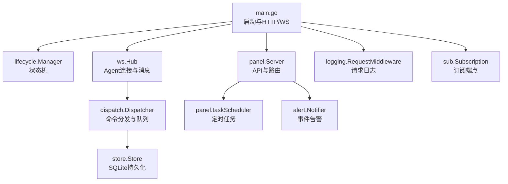
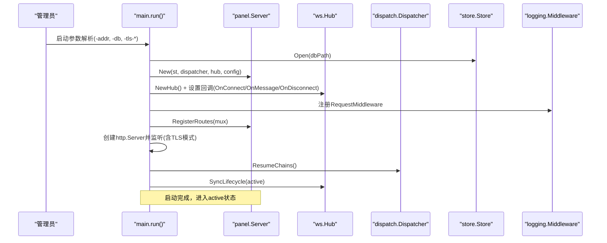
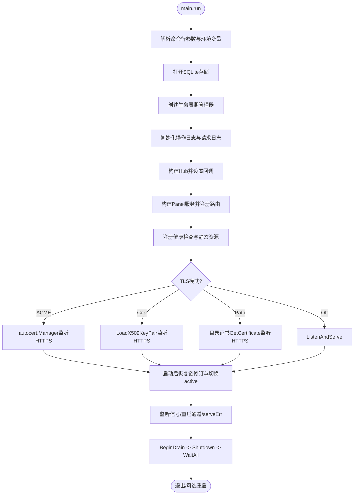
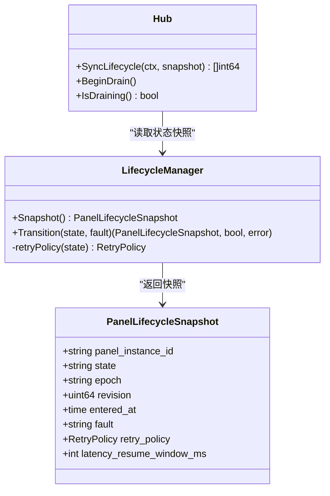
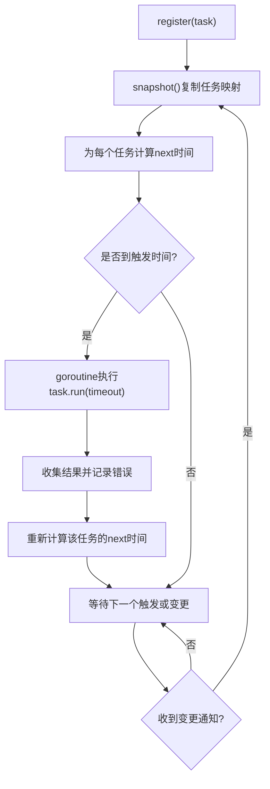
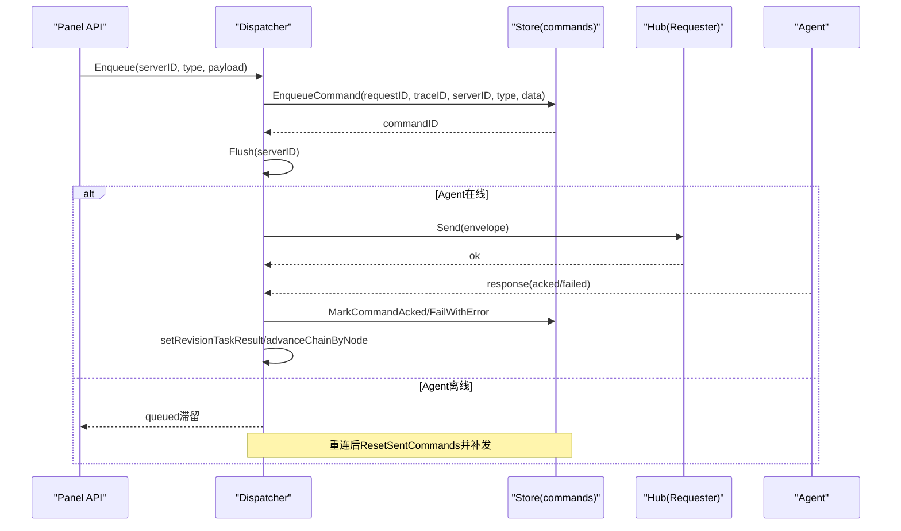
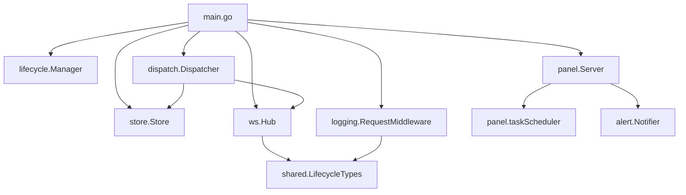

# 核心架构

<cite>
**本文引用的文件**   
- [src/backend/cmd/backend/main.go](file://src/backend/cmd/backend/main.go)
- [src/backend/internal/lifecycle/manager.go](file://src/backend/internal/lifecycle/manager.go)
- [src/backend/internal/ws/hub.go](file://src/backend/internal/ws/hub.go)
- [src/backend/internal/dispatch/dispatcher.go](file://src/backend/internal/dispatch/dispatcher.go)
- [src/backend/internal/panel/scheduler.go](file://src/backend/internal/panel/scheduler.go)
- [src/backend/internal/panel/panel.go](file://src/backend/internal/panel/panel.go)
- [src/backend/internal/logging/context.go](file://src/backend/internal/logging/context.go)
- [src/backend/internal/logging/http.go](file://src/backend/internal/logging/http.go)
- [src/backend/internal/store/store.go](file://src/backend/internal/store/store.go)
- [src/shared/lifecycle.go](file://src/shared/lifecycle.go)
- [docs/panel-lifecycle-state-machine-design.md](file://docs/panel-lifecycle-state-machine-design.md)
- [docs/framework-design.md](file://docs/framework-design.md)
</cite>

## 目录
1. [简介](#简介)
2. [项目结构](#项目结构)
3. [核心组件](#核心组件)
4. [架构总览](#架构总览)
5. [详细组件分析](#详细组件分析)
6. [依赖关系分析](#依赖关系分析)
7. [性能考量](#性能考量)
8. [故障排查指南](#故障排查指南)
9. [结论](#结论)
10. [附录](#附录)

## 简介
本技术文档聚焦 Lattix-codex 后端服务的核心架构，围绕以下目标展开：
- 主程序启动流程：命令行参数解析、配置初始化、依赖组件加载与 HTTP/WS 服务启动。
- 生命周期管理器：状态机设计、状态转换逻辑、优雅关停机制以及与 Agent 的同步。
- 调度器：任务注册、触发策略（固定间隔与日历对齐）、并发控制与超时处理。
- 中间件架构：请求处理链、错误处理、日志记录与可观测性。
- 命令分发与队列管理：离线排队、重试与死信、ACK 确认与幂等性。
- 提供架构图表与代码级路径，帮助开发者理解系统整体设计与组件交互。

## 项目结构
后端采用 Go 模块化组织，关键目录与职责如下：
- cmd/backend：入口 main，负责参数解析、TLS 配置、HTTP/WS 路由、优雅关停。
- internal/lifecycle：面板生命周期状态机与快照。
- internal/ws：Agent WebSocket Hub，连接管理与消息投递。
- internal/dispatch：命令分发器，封装 store 与 Requester，实现离线队列、重试与 ACK。
- internal/panel：面板 API 服务、定时任务调度器、业务路由注册。
- internal/logging：请求上下文元数据、HTTP 中间件、WebSocket RPC 日志。
- internal/store：SQLite 存储层与 DDL。
- shared：跨模块共享类型（生命周期、消息信封等）。



图表来源
- [src/backend/cmd/backend/main.go:62-120](file://src/backend/cmd/backend/main.go#L62-L120)
- [src/backend/internal/lifecycle/manager.go:18-28](file://src/backend/internal/lifecycle/manager.go#L18-L28)
- [src/backend/internal/ws/hub.go:25-62](file://src/backend/internal/ws/hub.go#L25-L62)
- [src/backend/internal/dispatch/dispatcher.go:24-48](file://src/backend/internal/dispatch/dispatcher.go#L24-L48)
- [src/backend/internal/panel/panel.go:91-113](file://src/backend/internal/panel/panel.go#L91-L113)
- [src/backend/internal/panel/scheduler.go:95-101](file://src/backend/internal/panel/scheduler.go#L95-L101)
- [src/backend/internal/logging/http.go:43-82](file://src/backend/internal/logging/http.go#L43-L82)
- [src/backend/internal/store/store.go:15-200](file://src/backend/internal/store/store.go#L15-L200)

章节来源
- [docs/framework-design.md:23-44](file://docs/framework-design.md#L23-L44)
- [src/backend/cmd/backend/main.go:62-120](file://src/backend/cmd/backend/main.go#L62-L120)

## 核心组件
- 生命周期管理器（Lifecycle Manager）：维护面板全局状态（startup/active/updating/faulted），提供快照与状态转换，支持不同状态的退避策略。
- WebSocket Hub：维护 Agent 连接注册表、发送队列、连接状态、优雅关停与生命周期同步。
- 命令分发器（Dispatcher）：串联 store 与 Requester，负责命令入队、离线滞留、重发、ACK 等待、死信处理与节点状态推进。
- 面板服务（Panel Server）：聚合 API、定时任务、发布更新、交换汇率、计费巡检等后台任务。
- 调度器（Task Scheduler）：统一的任务注册与执行引擎，支持固定间隔与日历对齐触发，具备超时与并发控制。
- 日志中间件（Logging Middleware）：注入 RequestID/TraceID、捕获响应、按策略记录 HTTP 与 WS RPC 日志。
- 存储层（Store）：SQLite 数据库，定义命令队列、节点、服务器、遥测、流量等表结构。

章节来源
- [src/backend/internal/lifecycle/manager.go:18-51](file://src/backend/internal/lifecycle/manager.go#L18-L51)
- [src/backend/internal/ws/hub.go:25-138](file://src/backend/internal/ws/hub.go#L25-L138)
- [src/backend/internal/dispatch/dispatcher.go:50-164](file://src/backend/internal/dispatch/dispatcher.go#L50-L164)
- [src/backend/internal/panel/panel.go:91-113](file://src/backend/internal/panel/panel.go#L91-L113)
- [src/backend/internal/panel/scheduler.go:95-130](file://src/backend/internal/panel/scheduler.go#L95-L130)
- [src/backend/internal/logging/http.go:43-82](file://src/backend/internal/logging/http.go#L43-L82)
- [src/backend/internal/store/store.go:137-160](file://src/backend/internal/store/store.go#L137-L160)

## 架构总览
后端以单进程形态运行，对外暴露 HTTP API 与 Agent WebSocket 端点；内部通过 SQLite 持久化，使用 Hub 管理 Agent 连接，Dispatcher 协调命令生命周期，Panel 提供服务与定时任务。



图表来源
- [src/backend/cmd/backend/main.go:62-120](file://src/backend/cmd/backend/main.go#L62-L120)
- [src/backend/cmd/backend/main.go:329-357](file://src/backend/cmd/backend/main.go#L329-L357)
- [src/backend/cmd/backend/main.go:364-472](file://src/backend/cmd/backend/main.go#L364-L472)
- [src/backend/cmd/backend/main.go:474-497](file://src/backend/cmd/backend/main.go#L474-L497)
- [src/backend/internal/panel/panel.go:91-113](file://src/backend/internal/panel/panel.go#L91-L113)
- [src/backend/internal/ws/hub.go:25-62](file://src/backend/internal/ws/hub.go#L25-L62)
- [src/backend/internal/dispatch/dispatcher.go:171-241](file://src/backend/internal/dispatch/dispatcher.go#L171-L241)

## 详细组件分析

### 主程序启动流程
- 参数解析：-addr、-db、-log-dir、-static、-admin-user/pass、-public-url、-github-repo、-tls-cert/key、-tls-dir、-tls-acme-domain/cache/email、-reset-admin。
- 证书与 TLS：根据 DB 设置或启动参数选择 ACME、自带证书、域名路径模式或关闭 TLS；生成 AppliedTLS 快照供面板展示。
- 依赖初始化：打开 store、创建 lifecycleManager、初始化操作日志与请求日志、构建 Hub 与 Dispatcher、注册面板路由与健康检查。
- 服务启动：根据 TLS 模式选择 ListenAndServe/TLS；启动后恢复链修订、切换 active 状态、同步生命周期到在线 Agent。
- 优雅关停：信号监听、BeginDrain、Shutdown、等待 Hub/BackgroundTasks/Notifier/Logs 关闭，必要时重启退出码。



图表来源
- [src/backend/cmd/backend/main.go:62-120](file://src/backend/cmd/backend/main.go#L62-L120)
- [src/backend/cmd/backend/main.go:172-238](file://src/backend/cmd/backend/main.go#L172-L238)
- [src/backend/cmd/backend/main.go:329-357](file://src/backend/cmd/backend/main.go#L329-L357)
- [src/backend/cmd/backend/main.go:364-472](file://src/backend/cmd/backend/main.go#L364-L472)
- [src/backend/cmd/backend/main.go:474-567](file://src/backend/cmd/backend/main.go#L474-L567)

章节来源
- [src/backend/cmd/backend/main.go:62-120](file://src/backend/cmd/backend/main.go#L62-L120)
- [src/backend/cmd/backend/main.go:172-238](file://src/backend/cmd/backend/main.go#L172-L238)
- [src/backend/cmd/backend/main.go:364-472](file://src/backend/cmd/backend/main.go#L364-L472)
- [src/backend/cmd/backend/main.go:474-567](file://src/backend/cmd/backend/main.go#L474-L567)

### 生命周期管理器（状态机与优雅关停）
- 状态集合：startup、active、updating、faulted。
- 快照与版本：epoch、revision、entered_at、retry_policy、latency_resume_window_ms。
- 转换逻辑：Transition 校验状态、更新快照与 revision、计算 retryPolicy。
- 与 Hub 集成：SyncLifecycle 向在线 Agent 广播生命周期变更并等待 ACK。
- 优雅关停：BeginDrain 拒绝新工作并关闭所有 Agent 连接；shutdown 阶段等待各组件清理。



图表来源
- [src/backend/internal/lifecycle/manager.go:18-51](file://src/backend/internal/lifecycle/manager.go#L18-L51)
- [src/shared/lifecycle.go:32-41](file://src/shared/lifecycle.go#L32-L41)
- [src/backend/internal/ws/hub.go:321-360](file://src/backend/internal/ws/hub.go#L321-L360)
- [src/backend/internal/ws/hub.go:157-172](file://src/backend/internal/ws/hub.go#L157-L172)

章节来源
- [src/backend/internal/lifecycle/manager.go:18-51](file://src/backend/internal/lifecycle/manager.go#L18-L51)
- [src/shared/lifecycle.go:32-41](file://src/shared/lifecycle.go#L32-L41)
- [src/backend/internal/ws/hub.go:321-360](file://src/backend/internal/ws/hub.go#L321-L360)
- [docs/panel-lifecycle-state-machine-design.md:19-36](file://docs/panel-lifecycle-state-machine-design.md#L19-L36)

### 调度器（任务注册、触发与并发控制）
- 任务模型：name、trigger（intervalTrigger 或 inspectionSchedule）、run、timeout、runOnStart。
- 触发策略：固定间隔（minute/hour）与日历对齐（day/month/year at HH:MM）。
- 并发控制：每个任务独立 goroutine 执行，互不重叠；使用 WaitGroup 等待任务结束。
- 结果处理：记录失败日志、重新计算下次触发时间；支持动态变更（changed 通道唤醒）。



图表来源
- [src/backend/internal/panel/scheduler.go:95-130](file://src/backend/internal/panel/scheduler.go#L95-L130)
- [src/backend/internal/panel/scheduler.go:132-216](file://src/backend/internal/panel/scheduler.go#L132-L216)

章节来源
- [src/backend/internal/panel/scheduler.go:95-130](file://src/backend/internal/panel/scheduler.go#L95-L130)
- [src/backend/internal/panel/scheduler.go:132-216](file://src/backend/internal/panel/scheduler.go#L132-L216)

### 命令分发与队列管理（离线排队、重试与死信）
- Enqueue：序列化 payload、生成 requestID/traceID、写入 commands 表（queued）、尝试 Flush。
- Flush：按服务器锁串行投递 queued 命令；离线时停止并滞留；超过最大尝试次数标记 failed（死信）。
- ACK 等待：waitForCommandACK 轮询命令状态至 acked；UninstallWithRetry 使用指数退避预算。
- 回执处理：handleCommandResponse 校验归属与关联，成功则 MarkCommandAcked 并推进节点/链状态；失败则 MarkCommandFailedWithError 并置节点 failed。



图表来源
- [src/backend/internal/dispatch/dispatcher.go:50-67](file://src/backend/internal/dispatch/dispatcher.go#L50-L67)
- [src/backend/internal/dispatch/dispatcher.go:171-241](file://src/backend/internal/dispatch/dispatcher.go#L171-L241)
- [src/backend/internal/dispatch/dispatcher.go:113-134](file://src/backend/internal/dispatch/dispatcher.go#L113-L134)
- [src/backend/internal/dispatch/dispatcher.go:625-730](file://src/backend/internal/dispatch/dispatcher.go#L625-L730)
- [src/backend/internal/ws/hub.go:110-138](file://src/backend/internal/ws/hub.go#L110-L138)

章节来源
- [src/backend/internal/dispatch/dispatcher.go:50-67](file://src/backend/internal/dispatch/dispatcher.go#L50-L67)
- [src/backend/internal/dispatch/dispatcher.go:171-241](file://src/backend/internal/dispatch/dispatcher.go#L171-L241)
- [src/backend/internal/dispatch/dispatcher.go:625-730](file://src/backend/internal/dispatch/dispatcher.go#L625-L730)

### 中间件架构（请求处理链、错误处理、日志记录）
- RequestMiddleware：注入 RequestID/TraceID、捕获响应体、按策略记录 HTTP 请求日志；对 WS 升级单独记录。
- Context 元数据：RequestMeta 携带 RPCCode、SafeMessage、IdempotencyReplayed、Attributes；SetRPCOutcome/SetIdempotencyReplayed 由处理器设置。
- WS RPC 日志：LogWebSocketRPC 记录已完成的命令型 RPC，包含 duration、server_id、command_id 等属性。
- 安全与脱敏：safeValue 对敏感字段名进行脱敏；safeParameters 限制参数大小与截断。

```mermaid
flowchart TD
Req["HTTP请求进入"] --> MW["RequestMiddleware"]
MW --> Inject["注入RequestID/TraceID到Context"]
Inject --> Handler["业务Handler执行"]
Handler --> SetMeta["SetRPCOutcome/SetIdempotencyReplayed"]
SetMeta --> Record["buildRequestEntry并Append日志"]
Record --> Resp["返回响应"]
Note over MW,Record: WS升级走LogWebSocketUpgrade; WS RPC走LogWebSocketRPC
```

图表来源
- [src/backend/internal/logging/http.go:43-82](file://src/backend/internal/logging/http.go#L43-L82)
- [src/backend/internal/logging/http.go:107-152](file://src/backend/internal/logging/http.go#L107-L152)
- [src/backend/internal/logging/http.go:154-164](file://src/backend/internal/logging/http.go#L154-L164)
- [src/backend/internal/logging/context.go:21-67](file://src/backend/internal/logging/context.go#L21-L67)

章节来源
- [src/backend/internal/logging/http.go:43-82](file://src/backend/internal/logging/http.go#L43-L82)
- [src/backend/internal/logging/context.go:21-67](file://src/backend/internal/logging/context.go#L21-L67)

### 面板服务与路由（API 与后台任务）
- Panel.New：注入依赖（store、dispatcher、hub、alerter、logs、scheduler），设置 destCandidates、PanelVersion、PublicURL、AgentReleaseBase。
- RegisterRoutes：注册认证、仪表盘、服务器管理、用户管理、链路管理等 RPC 路由，支持 Auth/CSRF/Idempotent/LogPolicy。
- StartBackgroundTasks：启动 scheduler 运行核心任务（用户过期清理、指标保留、release 刷新、计费巡检、汇率刷新）。

章节来源
- [src/backend/internal/panel/panel.go:91-113](file://src/backend/internal/panel/panel.go#L91-L113)
- [src/backend/internal/panel/panel.go:158-200](file://src/backend/internal/panel/panel.go#L158-L200)
- [src/backend/internal/panel/panel.go:67-88](file://src/backend/internal/panel/panel.go#L67-L88)

## 依赖关系分析
- main.go 依赖 lifecycle、store、panel、ws、dispatch、logging、sub、web。
- panel.Server 依赖 dispatch.Dispatcher、ws.AgentRequester、lifecycle.Manager、alert.Notifier、logging.OperationStore/RequestLog。
- ws.Hub 依赖 shared 生命周期与连接状态类型，实现 AgentRequester 接口。
- dispatch.Dispatcher 依赖 store.Store 与 ws.AgentRequester，并可选择性接入 alert.Notifier 与 logging。
- logging 中间件依赖 shared 错误码与 RequestMeta 上下文。



图表来源
- [src/backend/cmd/backend/main.go:27-37](file://src/backend/cmd/backend/main.go#L27-L37)
- [src/backend/internal/panel/panel.go:47-65](file://src/backend/internal/panel/panel.go#L47-L65)
- [src/backend/internal/ws/hub.go:25-54](file://src/backend/internal/ws/hub.go#L25-L54)
- [src/backend/internal/dispatch/dispatcher.go:24-43](file://src/backend/internal/dispatch/dispatcher.go#L24-L43)
- [src/backend/internal/logging/http.go:31-41](file://src/backend/internal/logging/http.go#L31-L41)

章节来源
- [src/backend/cmd/backend/main.go:27-37](file://src/backend/cmd/backend/main.go#L27-L37)
- [src/backend/internal/panel/panel.go:47-65](file://src/backend/internal/panel/panel.go#L47-L65)
- [src/backend/internal/ws/hub.go:25-54](file://src/backend/internal/ws/hub.go#L25-L54)
- [src/backend/internal/dispatch/dispatcher.go:24-43](file://src/backend/internal/dispatch/dispatcher.go#L24-L43)
- [src/backend/internal/logging/http.go:31-41](file://src/backend/internal/logging/http.go#L31-L41)

## 性能考量
- 发送队列与慢连接保护：Hub 每连接 sendBuffer=256，写满即断开并重连补发，避免背压扩散。
- 超时与退避：UninstallWithRetry 指数退避上限 10s；生命周期更新 ACK 屏障 5s；WS 写超时 10s。
- 日志落盘：请求日志按大小分片，DropReporter 回写操作日志；操作日志限流（operation log limit）。
- 并发控制：Dispatcher 每服务器一把 flushMu 避免重复 Flush；Scheduler 任务独立 goroutine 且互不重叠。
- 存储层：SQLite busy_timeout 保证并发读写安全；commands 表作为离线队列与审计。

[本节为通用指导，无需具体文件引用]

## 故障排查指南
- 启动失败：检查 -db 路径、TLS 配置（证书/ACME）、端口占用；查看 operation.log 中 panel.start/panel.server_failed。
- Agent 离线：Hub OnDisconnect 触发 offline 事件与链 degraded 推导；检查 WS 连接与网络可达性。
- 命令死信：attempts>=10 标记 failed；查看 command.dead_lettered 事件与节点 failed 原因。
- 配置漂移：Agent 上报 config.drift=true；面板显示徽章并提供修复按钮。
- 健康检查：/healthz 返回 ok；/readyz 检查 Hub draining 与 lifecycle.state==active 及 DB Ping。

章节来源
- [src/backend/cmd/backend/main.go:377-424](file://src/backend/cmd/backend/main.go#L377-L424)
- [src/backend/internal/dispatch/dispatcher.go:191-226](file://src/backend/internal/dispatch/dispatcher.go#L191-L226)
- [src/backend/internal/dispatch/dispatcher.go:594-623](file://src/backend/internal/dispatch/dispatcher.go#L594-L623)
- [src/backend/internal/ws/hub.go:264-278](file://src/backend/internal/ws/hub.go#L264-L278)

## 结论
Lattix-codex 后端通过清晰的分层与职责划分，实现了高可靠的面板服务：
- 生命周期状态机确保面板在启动、更新、故障期间的行为边界明确。
- WebSocket Hub 与 Dispatcher 协同保障命令的可靠投递与离线补发。
- 调度器统一管理后台任务，具备超时与并发控制。
- 中间件与日志体系提供完整的可观测性与错误追踪。
- 存储层以 SQLite 为中心，支撑命令队列、遥测与业务数据。

[本节为总结，无需具体文件引用]

## 附录
- 设计文档参考：
  - [框架设计](file://docs/framework-design.md)
  - [面板生命周期状态机设计](file://docs/panel-lifecycle-state-machine-design.md)
- 关键代码路径：
  - 启动与TLS：[src/backend/cmd/backend/main.go:62-120](file://src/backend/cmd/backend/main.go#L62-L120)
  - 生命周期状态机：[src/backend/internal/lifecycle/manager.go:18-51](file://src/backend/internal/lifecycle/manager.go#L18-L51)
  - WebSocket Hub：[src/backend/internal/ws/hub.go:25-138](file://src/backend/internal/ws/hub.go#L25-L138)
  - 命令分发：[src/backend/internal/dispatch/dispatcher.go:50-164](file://src/backend/internal/dispatch/dispatcher.go#L50-L164)
  - 调度器：[src/backend/internal/panel/scheduler.go:95-130](file://src/backend/internal/panel/scheduler.go#L95-L130)
  - 日志中间件：[src/backend/internal/logging/http.go:43-82](file://src/backend/internal/logging/http.go#L43-L82)
  - 存储DDL：[src/backend/internal/store/store.go:137-160](file://src/backend/internal/store/store.go#L137-L160)