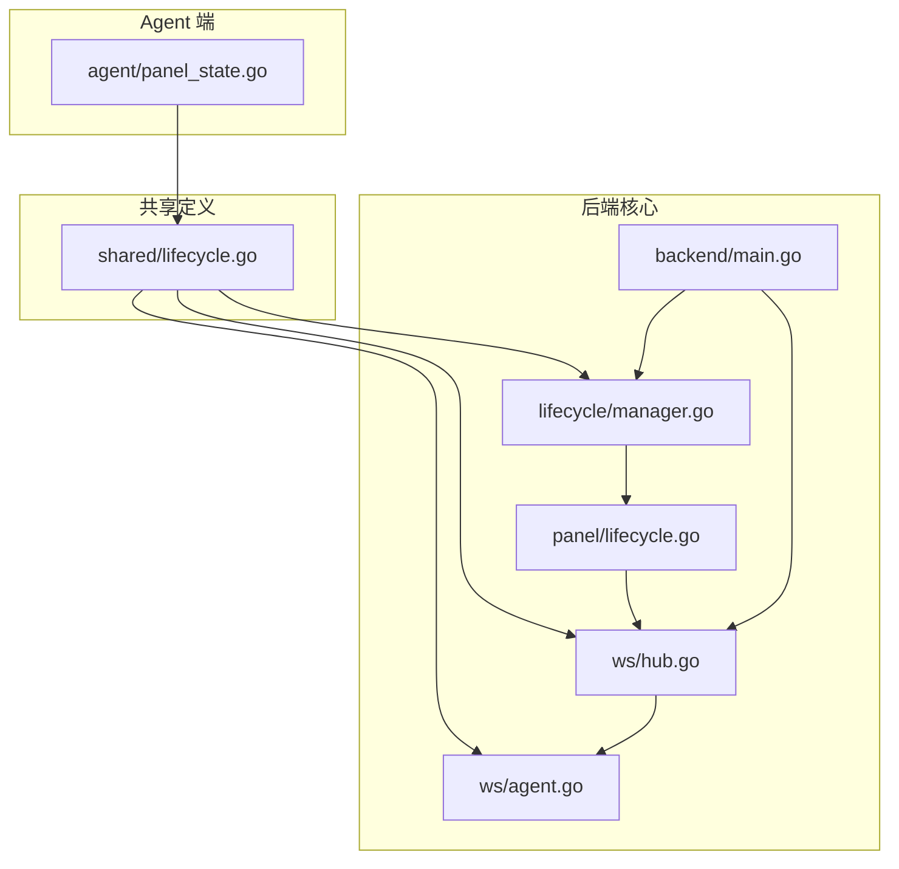
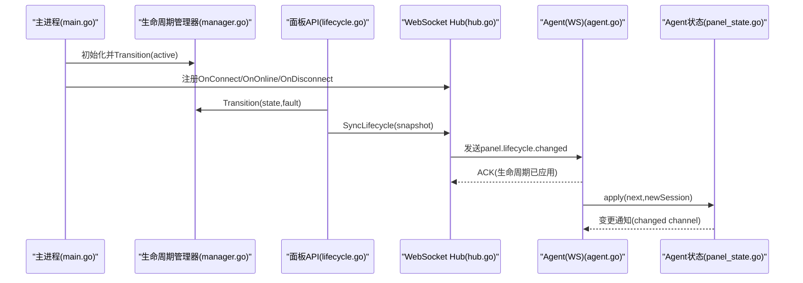
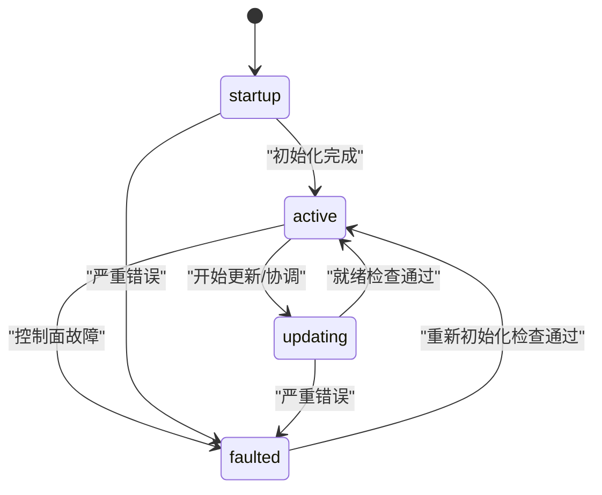
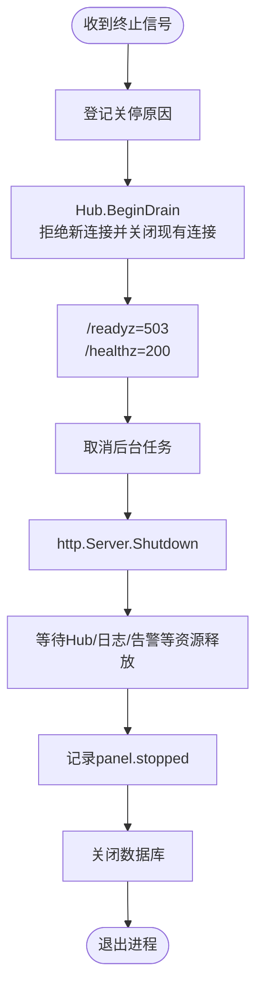
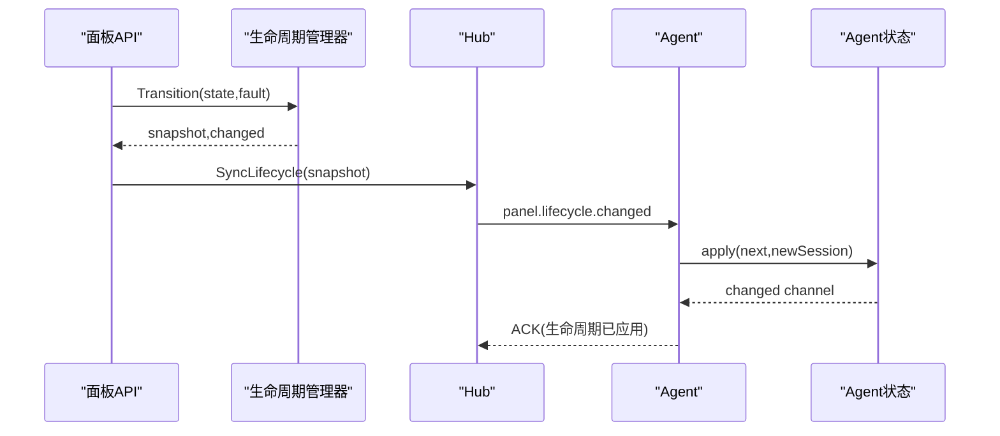
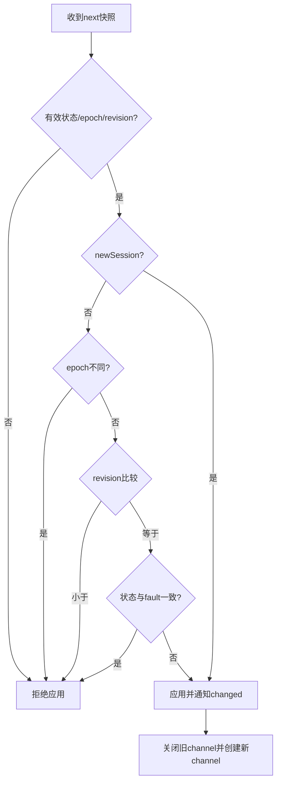
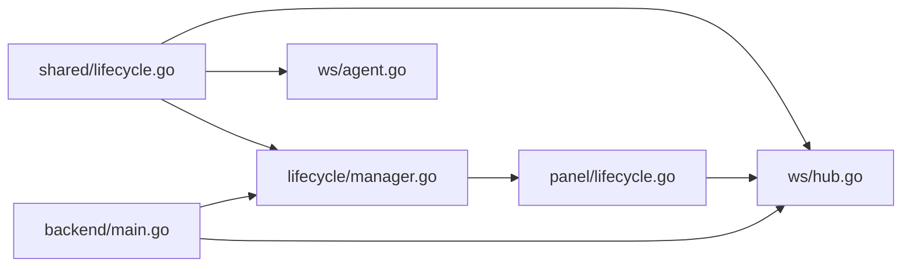

# 生命周期管理

<cite>
**本文引用的文件**   
- [panel-lifecycle-state-machine-design.md](file://docs/panel-lifecycle-state-machine-design.md)
- [manager.go](file://src/backend/internal/lifecycle/manager.go)
- [lifecycle.go](file://src/shared/lifecycle.go)
- [lifecycle.go](file://src/backend/internal/panel/lifecycle.go)
- [hub.go](file://src/backend/internal/ws/hub.go)
- [agent.go](file://src/backend/internal/ws/agent.go)
- [main.go](file://src/backend/cmd/backend/main.go)
- [graceful-shutdown-agent-settings-design.md](file://docs/graceful-shutdown-agent-settings-design.md)
- [panel_state.go](file://src/agent/cmd/agent/panel_state.go)
</cite>

## 目录
1. [引言](#引言)
2. [项目结构](#项目结构)
3. [核心组件](#核心组件)
4. [架构总览](#架构总览)
5. [详细组件分析](#详细组件分析)
6. [依赖关系分析](#依赖关系分析)
7. [性能考量](#性能考量)
8. [故障排查指南](#故障排查指南)
9. [结论](#结论)
10. [附录](#附录)

## 引言
本技术文档围绕 Lattix-codex 的生命周期管理系统，系统性阐述状态机设计、优雅关停机制、生命周期事件处理流程以及与 WebSocket Hub 的集成方式。目标读者包括后端开发者、运维工程师与对系统行为有深入理解需求的用户。文档以代码为依据，提供可视化图示与可操作的排障建议，帮助快速定位问题并优化系统行为。

## 项目结构
生命周期管理涉及以下关键模块：
- 共享类型与协议定义：面板生命周期快照、连接状态、会话消息等
- 生命周期管理器：维护面板进程级状态、版本（epoch/revision）、重试策略
- 面板 API 层：暴露状态查询接口、触发状态转换并广播同步
- WebSocket Hub：Agent 连接注册、状态广播、优雅关停（draining）
- Agent 侧状态跟踪：应用 Panel 生命周期快照，保证幂等与顺序性
- 启动与关停流程：信号监听、HTTP 优雅关闭、资源清理顺序



**图表来源** 
- [lifecycle.go:1-86](file://src/shared/lifecycle.go#L1-L86)
- [manager.go:1-63](file://src/backend/internal/lifecycle/manager.go#L1-L63)
- [lifecycle.go:1-44](file://src/backend/internal/panel/lifecycle.go#L1-L44)
- [hub.go:1-413](file://src/backend/internal/ws/hub.go#L1-L413)
- [agent.go:1-359](file://src/backend/internal/ws/agent.go#L1-L359)
- [main.go:1-638](file://src/backend/cmd/backend/main.go#L1-L638)
- [panel_state.go:1-52](file://src/agent/cmd/agent/panel_state.go#L1-L52)

**章节来源**
- [lifecycle.go:1-86](file://src/shared/lifecycle.go#L1-L86)
- [manager.go:1-63](file://src/backend/internal/lifecycle/manager.go#L1-L63)
- [lifecycle.go:1-44](file://src/backend/internal/panel/lifecycle.go#L1-L44)
- [hub.go:1-413](file://src/backend/internal/ws/hub.go#L1-L413)
- [agent.go:1-359](file://src/backend/internal/ws/agent.go#L1-L359)
- [main.go:1-638](file://src/backend/cmd/backend/main.go#L1-L638)
- [panel_state.go:1-52](file://src/agent/cmd/agent/panel_state.go#L1-L52)

## 核心组件
- 共享类型与协议
  - 面板生命周期状态常量：startup、active、updating、faulted
  - 连接状态常量：never_connected、connecting、reconnecting、online、offline、auth_rejected
  - 会话与生命周期消息载荷：SessionOpenPayload、SessionOpenResult、LifecycleChangedPayload 等
  - 重试策略与版本控制：RetryPolicy、LifecycleVersion、PanelLifecycleSnapshot
- 生命周期管理器（Manager）
  - 维护当前快照、Revision 递增、进入时间、Fault 信息、RetryPolicy
  - 提供 Transition(state, fault) 原子切换与 Snapshot() 读取
- 面板 API（Panel Lifecycle）
  - 暴露 GET /api/panel/state 返回快照
  - transitionLifecycle 调用 Manager.Transition，并通过 SyncLifecycle 广播到在线 Agent
- WebSocket Hub
  - 连接注册表、发送队列、写超时、Pong 超时
  - BeginDrain/IsDraining 优雅关停；SyncLifecycle 屏障式广播；CloseAllAgents/ForgetAgent 连接管理
- Agent 侧状态跟踪
  - panelStateTracker 维护本地快照与变更通道，按 epoch/revision 校验与应用

**章节来源**
- [lifecycle.go:1-86](file://src/shared/lifecycle.go#L1-L86)
- [manager.go:1-63](file://src/backend/internal/lifecycle/manager.go#L1-L63)
- [lifecycle.go:1-44](file://src/backend/internal/panel/lifecycle.go#L1-L44)
- [hub.go:1-413](file://src/backend/internal/ws/hub.go#L1-L413)
- [agent.go:1-359](file://src/backend/internal/ws/agent.go#L1-L359)
- [panel_state.go:1-52](file://src/agent/cmd/agent/panel_state.go#L1-L52)

## 架构总览
生命周期管理的整体交互如下：
- 进程启动：初始化 lifecycle.Manager，注册路由与 WS Hub，恢复链任务后进入 active，并广播
- 状态转换：通过 Panel API 或内部逻辑调用 transitionLifecycle，更新快照并广播
- 连接建立：Agent 发起 HTTP Upgrade，鉴权成功后 session.open，返回 Panel 快照
- 生命周期同步：Hub.SyncLifecycle 向所有在线 Agent 发送 panel.lifecycle.changed，等待 ACK
- 优雅关停：收到 SIGINT/SIGTERM 或自更新完成，BeginDrain 拒绝新连接并关闭现有连接，随后等待资源释放



**图表来源** 
- [main.go:479-527](file://src/backend/cmd/backend/main.go#L479-L527)
- [manager.go:36-51](file://src/backend/internal/lifecycle/manager.go#L36-L51)
- [lifecycle.go:23-43](file://src/backend/internal/panel/lifecycle.go#L23-L43)
- [hub.go:322-378](file://src/backend/internal/ws/hub.go#L322-L378)
- [agent.go:158-238](file://src/backend/internal/ws/agent.go#L158-L238)
- [panel_state.go:29-51](file://src/agent/cmd/agent/panel_state.go#L29-L51)

## 详细组件分析

### 状态机设计与转换规则
- 面板全局状态：startup → active → updating → faulted
  - startup：允许 WS 升级，暂停业务命令，继续 liveness，暂停 latency probe
  - active：允许 WS 升级与业务命令，正常 liveness 与 latency
  - updating：协调信号，允许 WS，维持现状，继续 liveness，暂停 latency
  - faulted：尽力通知后断开，禁止业务命令，不要求 liveness，暂停 latency
- 连接状态（每 Agent）：never_connected → connecting → reconnecting → online/offline/auth_rejected
- 版本控制：每次进程启动生成随机 epoch，进程内每次状态变化递增 revision；Agent 仅接受更大 revision
- 重试策略：不同状态对应不同的 min_ms/max_ms 窗口，用于 Agent 重连与延迟恢复窗口



**图表来源** 
- [panel-lifecycle-state-machine-design.md:19-36](file://docs/panel-lifecycle-state-machine-design.md#L19-L36)
- [lifecycle.go:5-20](file://src/shared/lifecycle.go#L5-L20)
- [manager.go:53-62](file://src/backend/internal/lifecycle/manager.go#L53-L62)

**章节来源**
- [panel-lifecycle-state-machine-design.md:1-133](file://docs/panel-lifecycle-state-machine-design.md#L1-L133)
- [lifecycle.go:1-86](file://src/shared/lifecycle.go#L1-L86)
- [manager.go:1-63](file://src/backend/internal/lifecycle/manager.go#L1-L63)

### 优雅关停机制
- 信号监听：SIGINT/SIGTERM 触发关停流程；第二次信号强制关闭 HTTP
- 关停步骤：
  1) 原子登记关停原因，重复请求返回 OPERATION_LOCKED
  2) Hub.BeginDrain：拒绝新 WS Upgrade，关闭现有 Agent WS（1012 Service Restart）
  3) /readyz 返回 503；/healthz 仍返回 200
  4) 取消后台任务，http.Server.Shutdown 优雅关闭
  5) 写入停止事件、排空请求日志、关闭数据库
- 预算与超时：总预算 10 秒；HTTP 关停最多前 8 秒，剩余 2 秒用于清理
- Agent 重连策略：指数退避、有限模式、面板明确拒绝时保持进程等待



**图表来源** 
- [graceful-shutdown-agent-settings-design.md:12-36](file://docs/graceful-shutdown-agent-settings-design.md#L12-L36)
- [main.go:529-572](file://src/backend/cmd/backend/main.go#L529-L572)
- [hub.go:156-193](file://src/backend/internal/ws/hub.go#L156-L193)

**章节来源**
- [graceful-shutdown-agent-settings-design.md:1-152](file://docs/graceful-shutdown-agent-settings-design.md#L1-L152)
- [main.go:529-572](file://src/backend/cmd/backend/main.go#L529-L572)
- [hub.go:156-193](file://src/backend/internal/ws/hub.go#L156-L193)

### 生命周期事件处理流程
- 状态变更通知：Panel.transitionLifecycle 调用 Manager.Transition，若 changed 则通过 SyncLifecycle 广播
- 客户端同步：Hub.SyncLifecycle 向每个在线 Agent 发送 panel.lifecycle.changed，等待 ACK 或超时
- 持久化存储：当前快照在内存权威维护；数据库保存迁移审计记录，不依赖备份恢复旧状态
- Agent 应用：panelStateTracker.apply 校验 epoch/revision，确保幂等与顺序，触发 changed channel



**图表来源** 
- [lifecycle.go:23-43](file://src/backend/internal/panel/lifecycle.go#L23-L43)
- [manager.go:36-51](file://src/backend/internal/lifecycle/manager.go#L36-L51)
- [hub.go:322-378](file://src/backend/internal/ws/hub.go#L322-L378)
- [panel_state.go:29-51](file://src/agent/cmd/agent/panel_state.go#L29-L51)

**章节来源**
- [lifecycle.go:1-44](file://src/backend/internal/panel/lifecycle.go#L1-L44)
- [manager.go:1-63](file://src/backend/internal/lifecycle/manager.go#L1-L63)
- [hub.go:322-378](file://src/backend/internal/ws/hub.go#L322-L378)
- [panel_state.go:1-52](file://src/agent/cmd/agent/panel_state.go#L1-L52)

### 与 WebSocket Hub 的集成
- 连接管理：Hub.register/unregister 维护 conns/states，区分 offline→online 跃迁与重连
- 状态广播：SyncLifecycle 使用 requestID 与 ack channel 实现屏障式确认
- 健康与超时：writeTimeout 单次写超时；pongTimeoutDefault 心跳检测；sendBuffer 满则断线
- 优雅关停：BeginDrain 设置 draining，拒绝新工作并关闭连接；Wait 等待 goroutine 退出

```mermaid
classDiagram
class Hub {
+Auth
+Lifecycle
+OnUpgrade
+OnConnect
+OnOnline
+OnReconnect
+OnMessage
+OnProtocolError
+OnDisconnect
+Send(ctx, serverID, env) error
+SyncLifecycle(ctx, snapshot) []int64
+BeginDrain()
+IsDraining() bool
+CloseAgent(serverID, code, reason)
+ForgetAgent(serverID, code, reason)
+CloseAllAgents(code, reason)
}
class agentConn {
+serverID
+sessionID
+sessionKind
+send chan Envelope
+done chan struct{}
+registerLifecycleAck(requestID) <-chan struct{}
+resolveLifecycleAck(requestID) bool
+removeLifecycleAck(requestID)
+close()
+closeWithCode(code, reason)
}
Hub --> agentConn : "管理连接"
```

**图表来源** 
- [hub.go:26-55](file://src/backend/internal/ws/hub.go#L26-L55)
- [hub.go:282-318](file://src/backend/internal/ws/hub.go#L282-L318)
- [hub.go:322-378](file://src/backend/internal/ws/hub.go#L322-L378)
- [agent.go:158-238](file://src/backend/internal/ws/agent.go#L158-L238)

**章节来源**
- [hub.go:1-413](file://src/backend/internal/ws/hub.go#L1-L413)
- [agent.go:1-359](file://src/backend/internal/ws/agent.go#L1-L359)

### Agent 侧生命周期应用
- panelStateTracker 维护 value 与 changed channel，apply 校验 epoch/revision/newSession
- 非新会话且 epoch 不同：拒绝；同 epoch 且 revision 更小：忽略；相同 revision 且状态一致：幂等确认
- 成功应用后关闭旧 channel 并创建新 channel，供上层订阅者消费变更



**图表来源** 
- [panel_state.go:29-51](file://src/agent/cmd/agent/panel_state.go#L29-L51)

**章节来源**
- [panel_state.go:1-52](file://src/agent/cmd/agent/panel_state.go#L1-L52)

## 依赖关系分析
- shared/lifecycle.go 为所有组件提供统一的数据结构与协议定义
- lifecycle/manager.go 被 panel/lifecycle.go 与 main.go 使用，负责状态转换
- panel/lifecycle.go 通过 ws.AgentRequester 接口调用 hub.SyncLifecycle
- ws/hub.go 依赖 shared 类型，并在 agent.go 中实现握手与会话管理
- main.go 组装各组件，注册路由与回调，驱动启动与关停流程



**图表来源** 
- [lifecycle.go:1-86](file://src/shared/lifecycle.go#L1-L86)
- [manager.go:1-63](file://src/backend/internal/lifecycle/manager.go#L1-L63)
- [lifecycle.go:1-44](file://src/backend/internal/panel/lifecycle.go#L1-L44)
- [hub.go:1-413](file://src/backend/internal/ws/hub.go#L1-L413)
- [agent.go:1-359](file://src/backend/internal/ws/agent.go#L1-L359)
- [main.go:1-638](file://src/backend/cmd/backend/main.go#L1-L638)

**章节来源**
- [lifecycle.go:1-86](file://src/shared/lifecycle.go#L1-L86)
- [manager.go:1-63](file://src/backend/internal/lifecycle/manager.go#L1-L63)
- [lifecycle.go:1-44](file://src/backend/internal/panel/lifecycle.go#L1-L44)
- [hub.go:1-413](file://src/backend/internal/ws/hub.go#L1-L413)
- [agent.go:1-359](file://src/backend/internal/ws/agent.go#L1-L359)
- [main.go:1-638](file://src/backend/cmd/backend/main.go#L1-L638)

## 性能考量
- 写超时与缓冲：writeTimeout=10s，sendBuffer=256，慢连接断线避免阻塞
- 心跳与存活：Agent Ping/Pong 续期读超时；Panel 90s 无字节判定死亡
- 广播屏障：SyncLifecycle 并发等待 ACK，超时仅记录缺失，不阻止更新
- 重试策略：不同状态下的 min/max 毫秒窗口，避免雪崩与抖动
- 就绪检查：/readyz 结合 Hub.draining 与 Panel state，避免流量进入不稳定节点

[本节为通用指导，无需特定文件引用]

## 故障排查指南
- 无法建立 WS 连接
  - 检查 Authorization Bearer token 与 X-Lattix-Protocol 头
  - 查看 Panel 是否处于 faulted 或 draining
  - 参考握手错误响应与协议错误回调
- 生命周期未同步
  - 确认 SyncLifecycle 是否超时或缺失 ACK
  - 检查 Agent 侧 panelStateTracker.apply 是否因 epoch/revision 拒绝
- 优雅关停异常
  - 观察 BeginDrain 是否被调用，/readyz 是否返回 503
  - 确认 http.Server.Shutdown 与 Hub.Wait 是否超时
- 连接频繁重连
  - 检查重试策略与网络状况
  - 关注 auth_rejected 与 1012 关闭码

**章节来源**
- [agent.go:264-300](file://src/backend/internal/ws/agent.go#L264-L300)
- [hub.go:156-193](file://src/backend/internal/ws/hub.go#L156-L193)
- [panel_state.go:29-51](file://src/agent/cmd/agent/panel_state.go#L29-L51)
- [main.go:529-572](file://src/backend/cmd/backend/main.go#L529-L572)

## 结论
Lattix-codex 的生命周期管理通过清晰的状态机、严格的版本控制与可靠的 WebSocket 广播机制，实现了高可用的面板与 Agent 协同。优雅关停流程确保了服务重启期间的稳定性与一致性。开发者应重点关注状态转换条件、Hub 的连接管理与 Agent 的应用逻辑，以确保系统在异常场景下的健壮性与可恢复性。

[本节为总结，无需特定文件引用]

## 附录
- 相关设计文档
  - 面板生命周期与 Agent 连接状态机设计
  - 面板优雅停机与 Agent 设置同步设计
- 关键 API
  - GET /api/panel/state：返回生命周期快照
  - GET /readyz：就绪检查（draining 或非 active 返回 503）
  - GET /healthz：存活检查（始终返回 200）

**章节来源**
- [panel-lifecycle-state-machine-design.md:128-133](file://docs/panel-lifecycle-state-machine-design.md#L128-L133)
- [graceful-shutdown-agent-settings-design.md:12-36](file://docs/graceful-shutdown-agent-settings-design.md#L12-L36)
- [main.go:384-432](file://src/backend/cmd/backend/main.go#L384-L432)