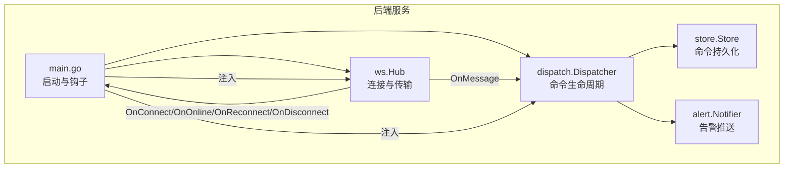
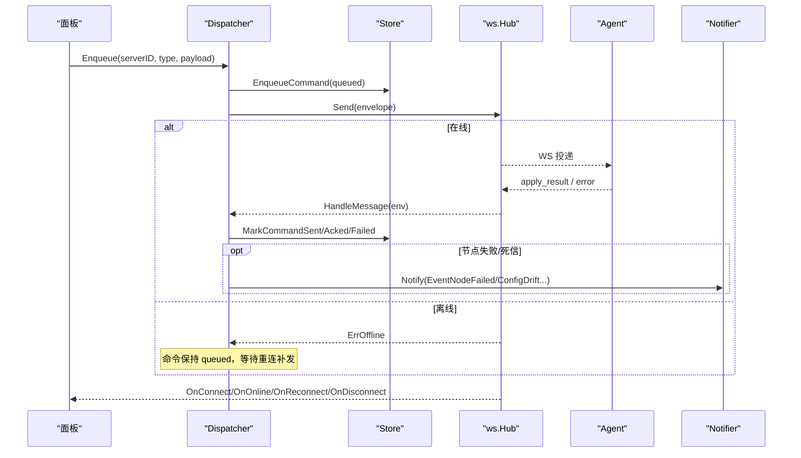
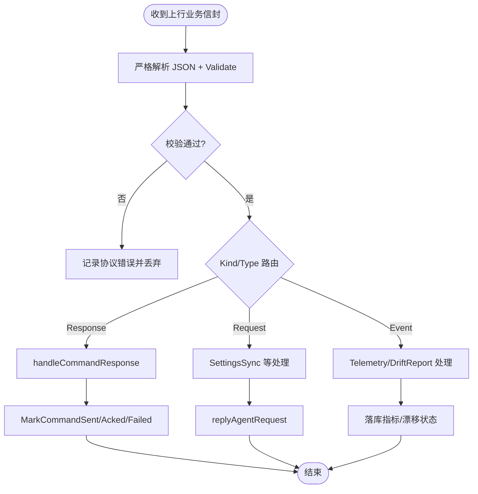
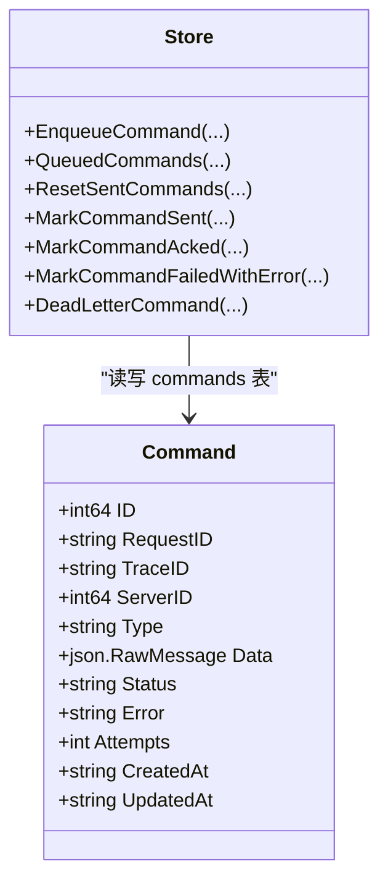
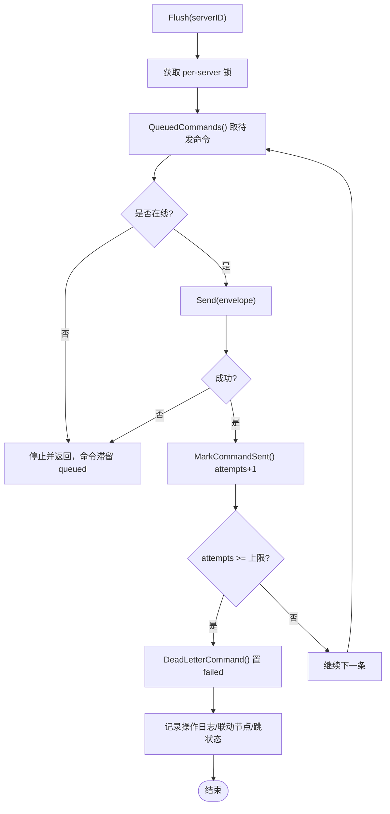
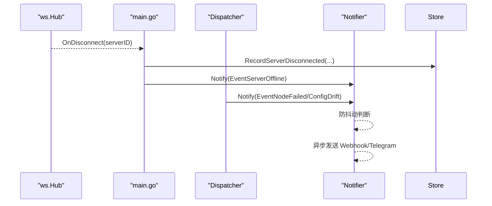
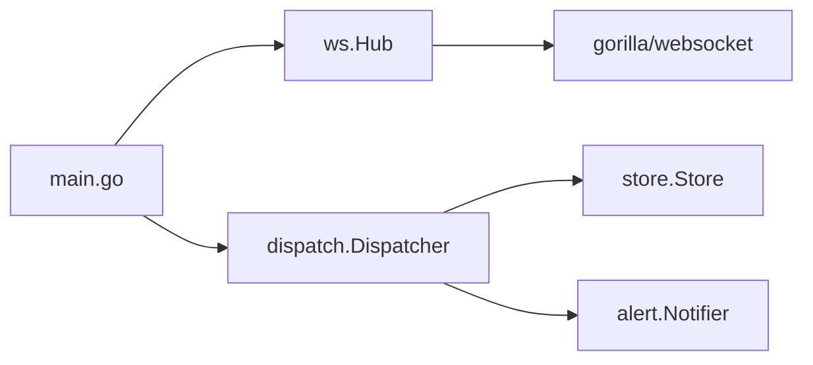
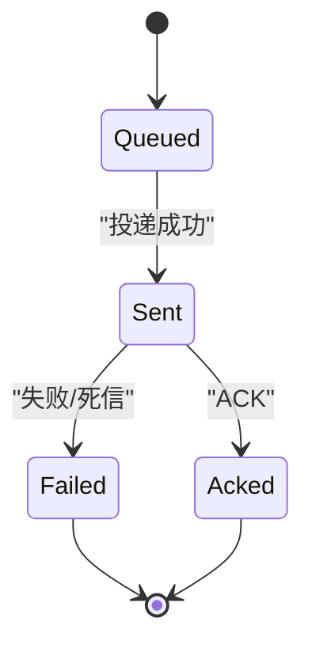

# 调度器设计

<cite>
**本文引用的文件**   
- [dispatcher.go](file://src/backend/internal/dispatch/dispatcher.go)
- [commands.go](file://src/backend/internal/store/commands.go)
- [hub.go](file://src/backend/internal/ws/hub.go)
- [alert.go](file://src/backend/internal/alert/alert.go)
- [main.go](file://src/backend/cmd/backend/main.go)
</cite>

## 目录
1. [引言](#引言)
2. [项目结构](#项目结构)
3. [核心组件](#核心组件)
4. [架构总览](#架构总览)
5. [详细组件分析](#详细组件分析)
6. [依赖关系分析](#依赖关系分析)
7. [性能与并发控制](#性能与并发控制)
8. [故障排查指南](#故障排查指南)
9. [结论](#结论)
10. [附录：数据模型与状态机](#附录数据模型与状态机)

## 引言
本技术文档聚焦 Lattix-codex 的命令调度器，系统性阐述命令分发机制（消息路由、协议解析、参数校验）、任务队列管理（离线存储、重发、优先级）、并发控制（锁、超时、重试）、存储层交互（持久化、事务、一致性）以及与告警系统的集成（事件检测、通知发送、状态更新）。文档同时提供架构图与数据流图，帮助开发者理解调度器的工作原理与扩展点。

## 项目结构
调度器由四个关键模块组成：
- 分发器（Dispatcher）：负责命令入队、投递、ACK 处理、会话认证、设置同步、遥测与漂移上报等。
- 存储层（Store）：命令表与状态迁移、最近命令查询、幂等性保障等。
- WebSocket Hub：连接注册、在线状态、消息收发、生命周期回调。
- 告警系统（Alert）：Webhook/Telegram 双通道异步推送，防抖动。

**图表来源** 
- [main.go:252-314](file://src/backend/cmd/backend/main.go#L252-L314)
- [hub.go:25-55](file://src/backend/internal/ws/hub.go#L25-L55)
- [dispatcher.go:24-48](file://src/backend/internal/dispatch/dispatcher.go#L24-L48)
- [commands.go:11-34](file://src/backend/internal/store/commands.go#L11-L34)
- [alert.go:34-68](file://src/backend/internal/alert/alert.go#L34-L68)

**章节来源**
- [main.go:252-314](file://src/backend/cmd/backend/main.go#L252-L314)
- [hub.go:25-55](file://src/backend/internal/ws/hub.go#L25-L55)
- [dispatcher.go:24-48](file://src/backend/internal/dispatch/dispatcher.go#L24-L48)
- [commands.go:11-34](file://src/backend/internal/store/commands.go#L11-L34)
- [alert.go:34-68](file://src/backend/internal/alert/alert.go#L34-L68)

## 核心组件
- Dispatcher：串联 Store 与 Requester（Hub），实现命令入队、Flush 投递、ACK 处理、会话认证、Agent 设置同步、遥测与漂移上报、链编排联动、死信处理等。
- Store：维护 commands 表的状态机（queued → sent → acked/failed），提供入队、重置、标记、查询等方法。
- Hub：WS 连接注册表与传输实现，提供 IsOnline/Send、连接生命周期回调、写超时与缓冲控制。
- Notifier：读取配置，按事件类型异步发送 Webhook/Telegram 告警，具备防抖动与错误脱敏。

**章节来源**
- [dispatcher.go:24-48](file://src/backend/internal/dispatch/dispatcher.go#L24-L48)
- [commands.go:11-34](file://src/backend/internal/store/commands.go#L11-L34)
- [hub.go:25-55](file://src/backend/internal/ws/hub.go#L25-L55)
- [alert.go:34-68](file://src/backend/internal/alert/alert.go#L34-L68)

## 架构总览
调度器的整体流程如下：
- 面板通过 Dispatcher.Enqueue 将命令写入 commands 表并尝试 Flush 投递。
- Hub.Send 将信封投递到 Agent WS；若离线则返回错误，命令滞留 queued。
- Agent 执行后回传 ACK 或失败响应，Dispatcher.HandleMessage 根据请求 ID 关联命令并更新状态。
- 连接断开触发 OnDisconnect，记录离线并可能触发告警；重连触发 OnConnect，重置 sent 未终态命令并重发。

**图表来源** 
- [dispatcher.go:50-67](file://src/backend/internal/dispatch/dispatcher.go#L50-L67)
- [dispatcher.go:171-241](file://src/backend/internal/dispatch/dispatcher.go#L171-L241)
- [dispatcher.go:412-438](file://src/backend/internal/dispatch/dispatcher.go#L412-L438)
- [commands.go:36-51](file://src/backend/internal/store/commands.go#L36-L51)
- [commands.go:77-83](file://src/backend/internal/store/commands.go#L77-L83)
- [hub.go:111-139](file://src/backend/internal/ws/hub.go#L111-L139)
- [alert.go:108-133](file://src/backend/internal/alert/alert.go#L108-L133)

## 详细组件分析

### 命令分发与消息路由
- 入队与立即投递：Enqueue 生成 requestID/traceID，持久化为 queued，随后调用 Flush 尝试投递。
- 投递与离线滞留：Flush 按 serverID 串行取 queued 命令，逐条经 Hub.Send 投递；离线时停止并保留剩余命令。
- 回执处理：HandleMessage 区分 Kind/Type，响应走 handleCommandResponse，按 requestID 关联命令，仅允许 sent → acked/failed 的原子迁移。
- 参数校验与协议解析：Hub.readEnvelope 使用严格 JSON 解码与 Validate，确保字段合法；Dispatcher 对特定 Type 做负载校验与长度限制。

**图表来源** 
- [hub.go:302-329](file://src/backend/internal/ws/hub.go#L302-L329)
- [dispatcher.go:412-438](file://src/backend/internal/dispatch/dispatcher.go#L412-L438)
- [dispatcher.go:626-730](file://src/backend/internal/dispatch/dispatcher.go#L626-L730)

**章节来源**
- [dispatcher.go:50-67](file://src/backend/internal/dispatch/dispatcher.go#L50-L67)
- [dispatcher.go:171-241](file://src/backend/internal/dispatch/dispatcher.go#L171-L241)
- [dispatcher.go:412-438](file://src/backend/internal/dispatch/dispatcher.go#L412-L438)
- [hub.go:302-329](file://src/backend/internal/ws/hub.go#L302-L329)

### 任务队列管理与重发机制
- 状态机：queued → sent → acked/failed，禁止从非 sent 状态翻回终态，避免重复 ACK。
- 重发语义：OnAgentConnect 调用 ResetSentCommands 将 sent 未终态命令重置为 queued，再 Flush 补发。
- 死信策略：attempts 超过上限（默认 10）进入 failed，记录操作日志并联动节点/跳状态。
- 优先级：按数据库 id 升序出队，保证 FIFO；升级类命令在版本不匹配时跳过，优先精确升级。

**图表来源** 
- [commands.go:22-34](file://src/backend/internal/store/commands.go#L22-L34)
- [commands.go:36-51](file://src/backend/internal/store/commands.go#L36-L51)
- [commands.go:77-83](file://src/backend/internal/store/commands.go#L77-L83)
- [commands.go:85-92](file://src/backend/internal/store/commands.go#L85-L92)
- [commands.go:115-137](file://src/backend/internal/store/commands.go#L115-L137)
- [commands.go:181-187](file://src/backend/internal/store/commands.go#L181-L187)

**章节来源**
- [commands.go:11-34](file://src/backend/internal/store/commands.go#L11-L34)
- [commands.go:77-83](file://src/backend/internal/store/commands.go#L77-L83)
- [commands.go:181-187](file://src/backend/internal/store/commands.go#L181-L187)
- [dispatcher.go:171-241](file://src/backend/internal/dispatch/dispatcher.go#L171-L241)

### 并发控制策略
- 每服务器锁：Flush 使用 per-server 互斥锁，避免同一服务器的并发 Flush 导致重复投递。
- 写超时与缓冲：Hub.writePump 单次写超时 10s；send 缓冲满即断开连接，重连后补发。
- 超时与重试：UninstallWithRetry 采用指数退避与最大次数预算；waitForCommandACK 轮询 ACK 并受上下文超时控制。
- 幂等与顺序：requestID/traceID 关联命令，仅允许 sent → acked/failed 的原子迁移，迟到的 ACK 被忽略。

**图表来源** 
- [dispatcher.go:171-241](file://src/backend/internal/dispatch/dispatcher.go#L171-L241)
- [dispatcher.go:782-791](file://src/backend/internal/dispatch/dispatcher.go#L782-L791)
- [hub.go:111-139](file://src/backend/internal/ws/hub.go#L111-L139)
- [hub.go:398-412](file://src/backend/internal/ws/hub.go#L398-L412)
- [commands.go:85-92](file://src/backend/internal/store/commands.go#L85-L92)
- [commands.go:181-187](file://src/backend/internal/store/commands.go#L181-L187)

**章节来源**
- [dispatcher.go:171-241](file://src/backend/internal/dispatch/dispatcher.go#L171-L241)
- [dispatcher.go:782-791](file://src/backend/internal/dispatch/dispatcher.go#L782-L791)
- [hub.go:111-139](file://src/backend/internal/ws/hub.go#L111-L139)
- [hub.go:398-412](file://src/backend/internal/ws/hub.go#L398-L412)

### 与存储层的交互方式
- 持久化：命令入队、状态迁移、最近命令查询均通过 SQL 执行，附带错误包装。
- 事务与一致性：状态迁移使用条件 UPDATE（仅 sent 可迁移至终态），保证原子性与幂等。
- 一致性保证：ResetSentCommands 仅在重连时重置 sent 未终态命令，避免重复 ACK；DeadLetterCommand 统一终态化处理。

**章节来源**
- [commands.go:36-51](file://src/backend/internal/store/commands.go#L36-L51)
- [commands.go:77-83](file://src/backend/internal/store/commands.go#L77-L83)
- [commands.go:115-137](file://src/backend/internal/store/commands.go#L115-L137)
- [commands.go:181-187](file://src/backend/internal/store/commands.go#L181-L187)

### 与告警系统的集成
- 事件类型：server_offline、config_drift、node_failed、chain_degraded。
- 触发点：连接断开（OnDisconnect）、漂移上报（handleDriftReport）、节点失败（死信与 apply 失败）。
- 发送通道：Webhook POST JSON、Telegram sendMessage；失败仅记日志，不阻塞主路径。
- 防抖动：同 serverID+event 窗口内不重复发送，默认 5 分钟。

**图表来源** 
- [main.go:281-314](file://src/backend/cmd/backend/main.go#L281-L314)
- [alert.go:108-133](file://src/backend/internal/alert/alert.go#L108-L133)
- [alert.go:158-173](file://src/backend/internal/alert/alert.go#L158-L173)
- [dispatcher.go:605-623](file://src/backend/internal/dispatch/dispatcher.go#L605-L623)
- [dispatcher.go:774-780](file://src/backend/internal/dispatch/dispatcher.go#L774-L780)

**章节来源**
- [alert.go:19-25](file://src/backend/internal/alert/alert.go#L19-L25)
- [alert.go:108-133](file://src/backend/internal/alert/alert.go#L108-L133)
- [alert.go:158-173](file://src/backend/internal/alert/alert.go#L158-L173)
- [main.go:281-314](file://src/backend/cmd/backend/main.go#L281-L314)
- [dispatcher.go:605-623](file://src/backend/internal/dispatch/dispatcher.go#L605-L623)
- [dispatcher.go:774-780](file://src/backend/internal/dispatch/dispatcher.go#L774-L780)

## 依赖关系分析
- Dispatcher 依赖 Store（命令持久化）、Hub（AgentRequester 接口）、Alert（可选）。
- Hub 依赖 gorilla/websocket，提供连接管理与写超时。
- main.go 组装 Hub、Dispatcher、LifecycleManager、OperationLog、RequestLog、Alert，并注入回调。

**图表来源** 
- [main.go:252-314](file://src/backend/cmd/backend/main.go#L252-L314)
- [dispatcher.go:24-48](file://src/backend/internal/dispatch/dispatcher.go#L24-L48)
- [hub.go:1-14](file://src/backend/internal/ws/hub.go#L1-L14)

**章节来源**
- [main.go:252-314](file://src/backend/cmd/backend/main.go#L252-L314)
- [dispatcher.go:24-48](file://src/backend/internal/dispatch/dispatcher.go#L24-L48)
- [hub.go:1-14](file://src/backend/internal/ws/hub.go#L1-L14)

## 性能与并发控制
- 写超时：Hub.writePump 单次写超时 10s，防止慢连接阻塞。
- 缓冲控制：Hub.send 缓冲 256，满则断开连接，重连后补发，避免内存膨胀。
- 每服务器锁：Dispatcher.flushMu 保证单服务器命令串行投递，避免竞争。
- 重试预算：UninstallWithRetry 指数退避与最大次数限制，避免无限重试。
- 幂等与去抖：命令状态迁移与告警防抖动确保系统稳定与一致。

[本节为通用指导，无需具体文件引用]

## 故障排查指南
- 命令未送达：检查 Hub.IsOnline 与 send 缓冲是否满；查看 commands 表 status 是否为 queued/sent。
- ACK 丢失：确认 requestID/traceID 关联正确；检查 MarkCommandSent/Acked/Failed 是否被调用。
- 节点失败：查看死信记录与操作日志；确认节点状态机是否置 failed。
- 告警未发送：检查 settings 配置是否启用；查看 Notifier 日志与网络连通性。

**章节来源**
- [dispatcher.go:171-241](file://src/backend/internal/dispatch/dispatcher.go#L171-L241)
- [commands.go:115-137](file://src/backend/internal/store/commands.go#L115-L137)
- [alert.go:158-173](file://src/backend/internal/alert/alert.go#L158-L173)

## 结论
调度器通过严格的命令状态机、可靠的 WS 传输与异步告警机制，实现了高可靠、可扩展的命令分发与任务管理。其设计在保证一致性的同时，提供了良好的容错与恢复能力，适合大规模 Agent 集群的运维场景。

[本节为总结，无需具体文件引用]

## 附录：数据模型与状态机
- 命令状态机：queued → sent → acked/failed，禁止非 sent 状态翻回终态。
- 节点/跳状态：apply 成功置 active，失败置 failed；死信触发联动。
- 连接状态：online/offline/neverConnected，支持重连与注销。

**图表来源** 
- [commands.go:11-18](file://src/backend/internal/store/commands.go#L11-L18)
- [commands.go:115-137](file://src/backend/internal/store/commands.go#L115-L137)
- [commands.go:181-187](file://src/backend/internal/store/commands.go#L181-L187)

**章节来源**
- [commands.go:11-18](file://src/backend/internal/store/commands.go#L11-L18)
- [commands.go:115-137](file://src/backend/internal/store/commands.go#L115-L137)
- [commands.go:181-187](file://src/backend/internal/store/commands.go#L181-L187)